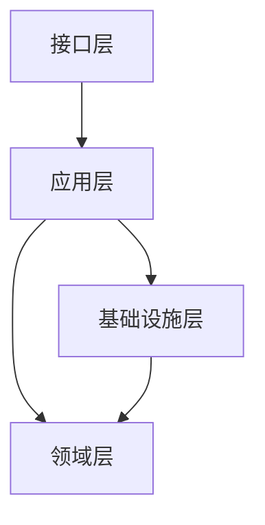
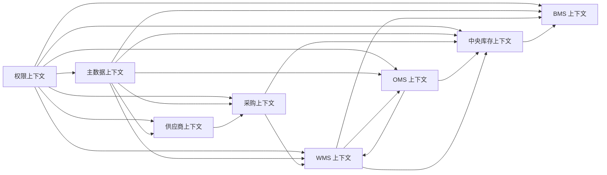
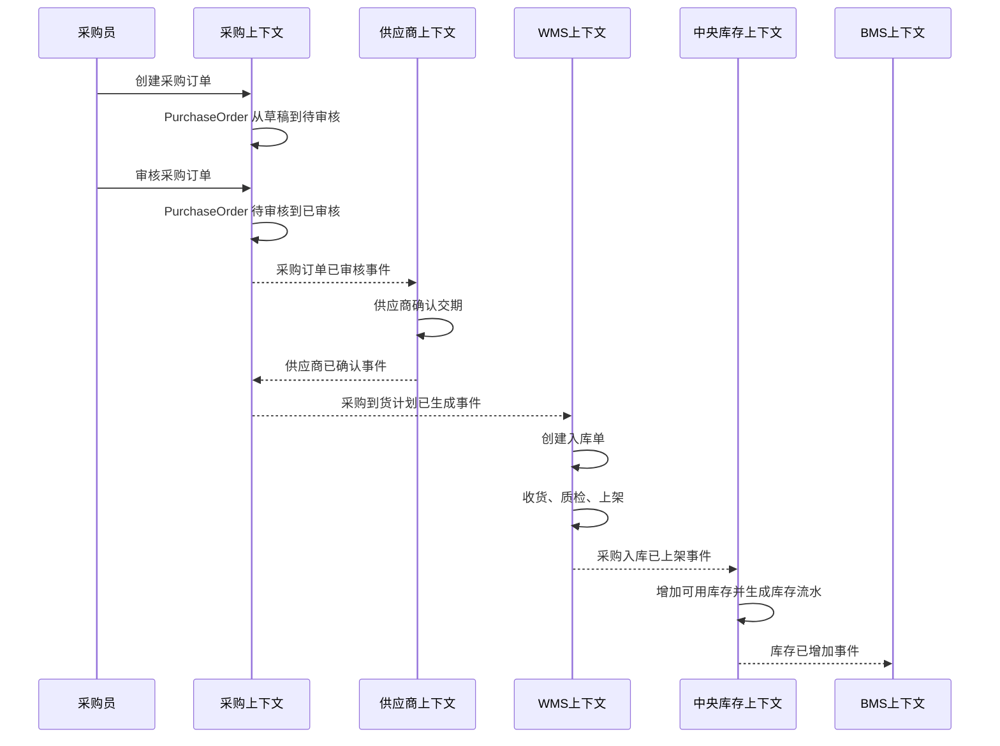
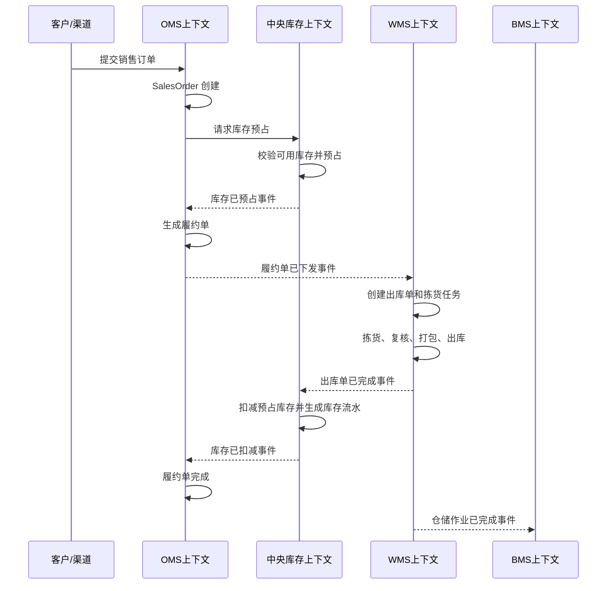
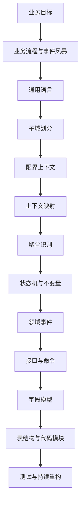

# 00-领域驱动设计总分总整理

> 本文基于当前目录下的《领域驱动设计：软件核心复杂性应对之道》《实现领域驱动设计》相关 Markdown 资料，并结合 DDD Guideline 资料入口整理。目标不是复述原书，而是把 DDD 的思想、方法论、模式、落地步骤和供应链系统应用方式整理成一份后续设计可复用的工作文档。

## 一、总：DDD 的核心定位

领域驱动设计，简称 DDD，首先不是一套代码模板，也不是把类命名为实体、值对象、聚合就完成了。DDD 是一套处理业务复杂度的方法，它强调业务专家、产品、架构师、开发人员围绕同一套业务语言持续建模，并让模型进入系统边界、代码结构、接口、事件、状态机、数据库和测试。

DDD 的前提判断是：很多系统真正难的地方不是框架、数据库、缓存或消息队列，而是业务本身。尤其是供应链、金融、交易、库存、履约、仓储、结算这类系统，表面上看是一堆单据和状态，底层其实是复杂规则、责任边界、协作流程和异常处理。

可以用一句话概括 DDD：

> 用业务语言形成模型，用模型识别边界，用边界隔离复杂度，用代码表达业务规则。

DDD 主要解决四类问题：

| 问题 | 没有 DDD 时的表现 | DDD 的应对方式 |
| --- | --- | --- |
| 业务概念混乱 | 同一个词在不同系统含义不同，沟通靠猜 | 通用语言、限界上下文 |
| 系统边界混乱 | 子系统按页面、表、技术层拆分，跨系统流程失控 | 子域、限界上下文、上下文映射 |
| 规则分散 | 业务规则散落在 Service、SQL、前端、定时任务里 | 聚合、领域服务、领域事件 |
| 演进困难 | 新需求一来就全链路改动，副作用不可控 | 核心域精炼、柔性设计、持续重构 |

DDD 特别适合这些场景：

- 业务规则复杂，且规则经常变化。
- 状态流转多，异常场景多。
- 多个团队或多个子系统协作。
- 系统生命周期长，需要持续演进。
- 系统价值主要来自业务模型，而不是简单数据录入。
- 业务人员和技术人员对概念经常理解不一致。

DDD 不一定适合重度使用的场景：

- 纯 CRUD 后台。
- 业务规则很少。
- 短生命周期的一次性系统。
- 主要是报表、配置、展示。
- 已经有成熟产品可以覆盖大部分需求。

对供应链系统来说，建议采用“核心域重 DDD、支撑域轻 DDD、通用域复用成熟模型”的策略。比如库存可用性、履约分配、仓内作业、调拨、售后退货值得深入建模；权限、文件、消息、字典配置不必过度 DDD 化。

## 二、分：DDD 的完整方法体系

## 1. DDD 的总体结构

DDD 可以分成四层能力：

| 层次   | 关注问题        | 典型产物                      |
| ---- | ----------- | ------------------------- |
| 协作建模 | 如何和业务一起发现知识 | 事件风暴、用户故事、术语表、业务流程图       |
| 战略设计 | 大系统如何划边界    | 子域、限界上下文、上下文映射、核心域精炼      |
| 战术设计 | 单个边界内如何表达模型 | 实体、值对象、聚合、领域服务、资源库、领域事件   |
| 架构落地 | 模型如何进入代码和系统 | 分层架构、六边形架构、模块结构、API、事件、测试 |

很多团队失败在只学了战术设计，也就是实体、值对象、聚合、资源库，却没有做战略设计。这样容易变成 DDD-Lite：代码名字像 DDD，但业务边界仍然混乱。

正确顺序通常是：

1. 先理解业务目标。
2. 再梳理业务流程。
3. 提取通用语言。
4. 划分子域。
5. 划分限界上下文。
6. 画上下文映射。
7. 识别聚合和领域事件。
8. 设计接口、状态机、字段、表结构。

## 2. 协作建模方法论

DDD 不是开发人员关起门来画类图。它强调“知识消化”：技术人员必须和业务专家反复讨论，把隐性的业务知识转化为显性的模型。

### 2.1 知识消化

知识消化是 DDD 的基本工作方式。它不是一次需求访谈，而是一个持续过程：

1. 业务讲现象：比如“出库前要锁库存”。
2. 技术追问含义：锁的是可用库存、实物库存还是库位库存？
3. 业务补充规则：锁定后不能被其他订单占用，但还没有真正扣减。
4. 技术形成模型：库存预占和库存扣减是两个动作。
5. 双方验证模型：预占失败、部分预占、取消释放、超卖如何处理？
6. 模型进入设计：状态机、接口、事件、流水、字段一起更新。

知识消化时要避免只问“页面要什么字段”，要多问这些问题：

- 这个动作为什么发生？
- 由谁发起？
- 谁有权处理？
- 处理前必须满足什么条件？
- 处理后哪些状态改变？
- 哪些数量改变？
- 会产生什么业务事件？
- 如果失败如何补偿？
- 是否允许撤销？
- 谁需要感知这个变化？

### 2.2 通用语言

通用语言是 DDD 的基础。它不是简单的术语表，而是某个限界上下文内团队共同使用的业务语言。

通用语言要求：

- 业务文档、流程图、接口、代码、测试使用同一套词。
- 避免开发自造技术词覆盖业务词。
- 避免一个词在同一上下文内有多个含义。
- 如果同一个词在不同上下文含义不同，要明确边界。
- 如果业务人员经常换词，说明模型还没有稳定。

供应链中的典型例子是“库存”：

| 上下文 | “库存”的含义 |
| --- | --- |
| OMS | 是否可售、是否可履约 |
| 中央库存 | 可用、预占、冻结、在途、锁定 |
| WMS | 仓库、库区、库位、批次、容器上的实物数量 |
| BMS | 用于计费、对账、结算的库存数量 |

如果不区分上下文，所有系统都说“库存”，后续一定会出现接口语义不清、流水不一致、状态难追溯的问题。

通用语言的常见产物：

| 产物 | 内容 |
| --- | --- |
| 术语表 | 名称、定义、所属上下文、反例、相关状态 |
| 业务动作表 | 动作名称、发起角色、处理系统、前置条件、后置结果 |
| 状态词典 | 状态名称、含义、允许动作、禁止动作 |
| 事件词典 | 事件名称、触发动作、事件载荷、消费者 |
| 模型词典 | 实体、值对象、聚合、领域服务说明 |

### 2.3 事件风暴

事件风暴是一种常用的协作建模方法，适合早期梳理业务流程和发现领域事件。

事件风暴的基本做法：

1. 先写领域事件，用过去式表达已经发生的业务事实。
2. 再补充触发事件的命令，用动词表达用户或系统想做什么。
3. 找出命令的发起者，可能是用户、外部系统、定时任务。
4. 找出承载命令的聚合，判断哪个对象负责保护规则。
5. 标出外部系统、策略、读模型、异常和疑问。
6. 按时间顺序整理成流程。

常见贴纸含义可以这样理解：

| 元素 | 含义 | 供应链示例 |
| --- | --- | --- |
| 命令 | 想要系统做什么 | 审核采购订单、预占库存、生成拣货单 |
| 事件 | 已经发生的业务事实 | 采购订单已审核、库存已预占、出库单已完成 |
| 角色 | 谁发起命令 | 采购员、仓管员、OMS、定时任务 |
| 聚合 | 处理命令并保护规则的对象 | 采购订单、库存账户、出库单 |
| 策略 | 事件发生后自动触发的规则 | 订单已支付后自动预占库存 |
| 外部系统 | 当前边界外的系统 | 支付系统、物流系统、财务系统 |
| 读模型 | 查询和展示需要的数据 | 订单列表、库存看板、作业进度 |
| 疑问点 | 需要业务确认的问题 | 部分预占是否允许发货 |

事件风暴的输出不是最终设计，但它能快速暴露业务流程、异常分支、系统边界和语言冲突。

### 2.4 用户故事与场景走查

DDD 不反对用户故事，但用户故事要和模型结合。推荐格式：

```text
作为 <角色>
我希望 <完成某个业务动作>
以便 <达成业务目标>
```

每个用户故事还要补充：

- 前置状态。
- 触发动作。
- 业务规则。
- 状态变化。
- 产生事件。
- 异常分支。
- 权限要求。
- 审计要求。

例如：

| 项 | 内容 |
| --- | --- |
| 用户故事 | 作为采购主管，我希望审核采购订单，以便确认供应商、商品、数量、价格和交期可以执行 |
| 前置状态 | 采购订单为待审核 |
| 业务规则 | 明细数量必须大于 0；供应商必须启用；SKU 必须可采购 |
| 状态变化 | 待审核 -> 已审核 |
| 产生事件 | 采购订单已审核 |
| 后续动作 | 通知供应商确认或生成到货计划 |
| 异常 | 价格超权限、供应商停用、SKU 未启用 |

### 2.5 领域故事

领域故事关注“谁和谁协作完成一件事”。它比事件风暴更适合解释角色之间的交互。

供应链中可以这样讲领域故事：

1. 采购员创建采购订单。
2. 采购主管审核采购订单。
3. 供应商确认交期。
4. 到货后收货员登记收货。
5. 质检员完成质检。
6. WMS 根据上架策略生成上架任务。
7. 上架员把合格商品放到指定库位。
8. WMS 通知中央库存增加可用库存。

领域故事适合输出成泳道图、时序图、业务用例说明。

## 3. 战略设计：先决定边界

战略设计解决“大系统怎么切”。它优先于字段、表、接口和微服务。

### 3.1 领域和子域

领域是系统要解决的问题空间。供应链系统是一个大领域，可以拆为采购、供应商、订单履约、库存、仓储、物流、售后、结算、主数据、权限等子域。

子域通常分三类：

| 类型 | 含义 | 供应链示例 | 设计策略 |
| --- | --- | --- | --- |
| 核心域 | 体现业务差异和竞争力 | 库存可用性、履约分配、仓内作业效率、采购补货策略 | 深入建模，投入高手 |
| 支撑域 | 支撑核心业务但不构成核心差异 | 供应商管理、物流商管理、合同管理、结算规则 | 适度建模，保证可扩展 |
| 通用域 | 多数系统都需要的通用能力 | 权限、日志、文件、通知、字典 | 复用成熟方案，避免过度设计 |

判断核心域的问题：

- 这个能力是否直接影响业务竞争力？
- 这个能力是否经常变化？
- 这个能力是否存在大量业务规则？
- 这个能力做差会不会直接影响履约、成本、收入或客户体验？
- 这个能力是否难以购买成熟产品直接替代？

### 3.2 核心域精炼

精炼是把模型中最关键的部分提取出来，把注意力集中到真正有价值的业务问题上。

精炼常用方法：

| 方法 | 说明 | 示例 |
| --- | --- | --- |
| 领域愿景声明 | 用短文说明系统最核心价值 | 本系统要提升采购、库存、仓储、履约协同效率 |
| 核心域清单 | 列出最值得投入建模的部分 | 库存可用性、履约分配、仓内作业 |
| 支撑域剥离 | 把非核心能力从核心模型中拿出去 | 权限、消息、文件不进入库存核心模型 |
| 通用子域外包 | 可购买或复用的能力不自研复杂模型 | 登录、操作日志、通知中心 |
| 精炼文档 | 用很短文档描述核心模型和边界 | 库存账户、库存流水、库存预占规则 |

供应链系统的核心域可以暂定为：

- 库存可用性模型。
- 销售履约模型。
- WMS 作业模型。
- 调拨与在途模型。
- 售后退货质检模型。

### 3.3 限界上下文

限界上下文是一个模型适用的边界。它定义了：

- 哪些术语在这里成立。
- 哪些实体和值对象属于这里。
- 哪些规则由这里负责。
- 哪些状态由这里维护。
- 和其他上下文如何交互。

限界上下文不等于微服务，但可以指导微服务拆分。一个限界上下文可以先落在同一个单体应用的模块里，后续再拆成独立服务。

识别限界上下文的信号：

- 同一个词出现不同含义。
- 不同团队负责不同业务规则。
- 生命周期明显不同。
- 数据一致性要求不同。
- 变化频率不同。
- 外部系统集成方式不同。
- 同一实体在不同场景下关注字段差异很大。

供应链系统初步限界上下文：

| 限界上下文 | 主要模型 | 主要职责 |
| --- | --- | --- |
| 主数据上下文 | SPU、SKU、供应商、客户、货主、仓库、库位、物流商 | 管理基础资料及启停用 |
| 供应商上下文 | 供应商、报价、评分、供货能力 | 供应商准入、协同、评分 |
| 采购上下文 | 采购申请、采购订单、到货计划、采购退货 | 采购业务闭环 |
| OMS 上下文 | 销售订单、履约单、售后单 | 接单、履约、售后 |
| 中央库存上下文 | 库存账户、库存流水、预占记录 | 可用库存、预占、扣减、释放 |
| WMS 上下文 | 入库单、上架任务、拣货任务、出库单、容器 | 仓内实物作业 |
| BMS 上下文 | 计费单、对账单、费用规则 | 费用计算、结算、对账 |
| 权限上下文 | 用户、角色、权限、Token、日志 | 登录、鉴权、授权、审计 |

### 3.4 上下文映射

上下文映射描述限界上下文之间如何协作。它不是普通系统架构图，而是模型关系图。

常见模式：

| 模式 | 含义 | 适用场景 | 供应链示例 |
| --- | --- | --- | --- |
| 伙伴关系 | 双方共同协作、共同演进 | 两个上下文都很重要，且频繁协同 | OMS 与中央库存共同确定预占规则 |
| 共享内核 | 共享一小部分模型和代码 | 两个团队必须共享稳定核心概念 | SKU 基础标识和单位模型 |
| 客户/供应方 | 上游供应模型或能力，下游提出需求 | 上游影响多个下游 | 主数据向采购、OMS、WMS 分发基础资料 |
| 遵奉者 | 下游完全接受上游模型 | 下游无力或无需改变上游模型 | 子系统直接接受09-权限系统用户身份 |
| 防腐层 | 翻译外部模型，保护本地模型 | 外部系统模型不适合本系统 | WMS 把 OMS 出库请求翻译成拣货任务 |
| 开放主机服务 | 上游提供稳定服务协议 | 多个系统都要调用 | 中央库存提供预占、释放、扣减 API |
| 发布语言 | 约定跨上下文数据格式 | 事件、接口、文件交换 | SKU已启用事件、库存已扣减事件 |
| 分道扬镳 | 不集成，各自解决问题 | 集成成本大于收益 | 某些离线分析模型与交易模型分离 |
| 大泥球隔离 | 遗留系统边界混乱，先隔离 | 老系统无法立即重构 | 旧 ERP 通过防腐层接入采购 |

上下文映射要明确：

- 上游是谁，下游是谁。
- 同步接口还是异步事件。
- 谁拥有数据主权。
- 谁负责状态变更。
- 失败如何处理。
- 模型是否需要翻译。
- 是否存在共享内核。
- 哪些字段是发布语言的一部分。

### 3.5 大比例结构

大比例结构用于帮助团队从整体上理解复杂系统。它不是具体类图，而是一组高层组织原则。

常见结构：

| 结构 | 含义 | 供应链理解 |
| --- | --- | --- |
| 分层结构 | 按职责层次组织模型 | 主数据层、交易层、作业层、结算层 |
| 职责层 | 按业务责任分层 | 策略层、计划层、执行层、记录层 |
| 插件式组件框架 | 核心规则稳定，部分策略可插拔 | 上架策略、拣货策略、计费策略 |
| 系统隐喻 | 用一个业务隐喻统一理解 | 供应链像“订单驱动的库存和仓内作业网络” |

对供应链系统，可以采用“计划 - 交易 - 作业 - 结算 - 审计”的大比例结构：

| 层 | 说明 | 子系统 |
| --- | --- | --- |
| 计划层 | 预测、补货、采购计划 | 后续可扩展需求计划、补货系统 |
| 交易层 | 订单、采购、售后、调拨 | 采购、OMS |
| 作业层 | 仓内执行、物流执行 | WMS、物流 |
| 库存层 | 数量和库存权属变化 | 中央库存 |
| 结算层 | 费用、对账、付款 | BMS |
| 基础层 | 主数据、权限、配置 | 主数据、权限 |

## 4. 战术设计：在边界内表达模型

战略设计决定边界，战术设计决定边界内如何写模型。

### 4.1 实体

实体关注“是谁”。它有唯一标识和生命周期，即使属性变化，仍然是同一个对象。

实体设计要点：

- 标识优先，而不是字段优先。
- 关注生命周期和状态变化。
- 行为应围绕业务职责，而不是只有 getter/setter。
- 不要把所有数据库字段都塞进实体。
- 实体可以包含值对象来表达复杂属性。

实体标识设计：

| 策略 | 说明 | 示例 |
| --- | --- | --- |
| 用户提供 | 业务天然有编码 | 供应商编码、仓库编码 |
| 系统生成 | 应用生成唯一 ID | 采购订单号、出库单号 |
| 持久化生成 | 数据库生成 ID | 技术主键 |
| 外部上下文提供 | 外部系统决定标识 | ERP 商品编码、平台订单号 |

建议区分业务标识和技术主键：

| 类型 | 说明 | 示例 |
| --- | --- | --- |
| 业务标识 | 业务人员可理解，可用于追踪 | PO202606280001 |
| 技术主键 | 系统内部使用，稳定唯一 | UUID、Snowflake ID |
| 外部标识 | 外部系统传入 | 淘宝订单号、ERP 商品编码 |

供应链实体示例：

- 采购订单。
- 出库单。
- 入库单。
- SKU。
- 供应商。
- 库存批次。
- 调拨单。
- 售后单。
- 退供应商单。

### 4.2 值对象

值对象关注“是什么”。它没有独立身份，通常不可变，通过属性值判断相等。

值对象适合表达：

- 金额。
- 地址。
- 时间范围。
- 数量。
- 单位。
- 规格。
- 批次属性。
- 联系方式。
- 评分结果。

值对象设计原则：

- 尽量不可变。
- 构造时保证合法。
- 可以包含业务行为。
- 不要为了数据库方便拆散业务含义。
- 相等性由值决定，而不是 ID。

供应链示例：

| 值对象 | 字段 | 行为 |
| --- | --- | --- |
| Money | currency、amount、taxRate | add、subtract、includeTax |
| Quantity | value、unit | convertTo、isPositive |
| Address | province、city、district、detail | fullAddress |
| BatchAttribute | batchNo、productionDate、expireDate | isExpired |
| TimeWindow | startTime、endTime | contains、overlap |

### 4.3 聚合

聚合是一组需要一起维护一致性的对象集合。聚合根是外部访问聚合的入口。

聚合解决的问题：

- 哪些对象必须在同一事务中保持一致。
- 哪些规则必须始终成立。
- 外部对象如何访问内部对象。
- 并发修改时如何保护业务规则。

聚合设计原则：

1. 聚合边界围绕业务不变量，而不是数据库外键。
2. 一个事务尽量只修改一个聚合。
3. 聚合之间通过 ID 引用，而不是直接对象引用。
4. 跨聚合一致性优先考虑领域事件和最终一致性。
5. 聚合不要太大，否则会导致并发冲突和性能问题。
6. 聚合根负责保护内部对象，不允许外部绕过聚合根修改内部状态。

聚合识别方法：

| 问题 | 判断 |
| --- | --- |
| 是否必须一起保存？ | 是，可能属于同一聚合 |
| 是否存在必须始终成立的规则？ | 是，聚合根要保护 |
| 是否可以最终一致？ | 是，可能拆成不同聚合 |
| 是否会被不同用户高频并发修改？ | 是，聚合要小 |
| 是否只是查询展示需要关联？ | 是，不应因此放进同一聚合 |

供应链聚合示例：

| 聚合根 | 内部对象 | 关键不变量 |
| --- | --- | --- |
| PurchaseOrder | PurchaseOrderLine、PurchasePrice、DeliveryRequirement | 已审核不能随意改供应商；取消数量不能超过未入库数量 |
| OutboundOrder | OutboundLine、PickRequirement、PackRequirement | 已出库不能重复扣减；明细数量必须等于订单要求或允许差异 |
| InventoryAccount | InventoryBucket、ReservationRecord | 可用库存不能小于 0；释放不能超过已预占 |
| TransferOrder | TransferLine、InTransitRecord | 调出后形成在途；收货不能超过发出数量 |
| AfterSaleOrder | ReturnLine、InspectionResult | 未质检不能入库；不良品不能进良品库存 |

### 4.4 业务不变量

不变量是某个模型必须始终满足的规则。聚合的核心价值就是保护不变量。

供应链中的不变量示例：

- 采购订单明细数量必须大于 0。
- 已取消采购订单不能审核。
- 出库单已出库后不能再次扣减库存。
- 库存释放数量不能超过原预占数量。
- 可用库存不能小于 0。
- 退货质检不合格商品不能进入良品库位。
- 调拨收货数量不能超过调拨发出数量，除非走差异流程。

设计不变量时要写清：

| 项 | 说明 |
| --- | --- |
| 规则名称 | 例如：可用库存非负 |
| 所属聚合 | InventoryAccount |
| 触发动作 | reserve、deduct、release |
| 校验时机 | 命令执行前或执行中 |
| 违反结果 | 拒绝、转人工、生成异常单 |
| 错误码 | INVENTORY_NOT_ENOUGH |

### 4.5 领域服务

领域服务用于表达不适合放进实体或值对象的领域行为。它不是应用服务，也不是随手写的 Service。

适合领域服务的情况：

- 行为涉及多个聚合，但又是明确领域规则。
- 行为是重要业务过程，不属于单个实体。
- 行为无状态。
- 方法名能用通用语言表达。

供应链领域服务示例：

| 领域服务 | 作用 |
| --- | --- |
| InventoryAllocationService | 根据订单、仓库、批次、策略分配库存 |
| SupplierScoreService | 根据质量、价格、交付时效计算供应商评分 |
| ReplenishmentSuggestService | 根据销量、库存、在途、采购周期生成补货建议 |
| PutawayStrategyService | 根据商品属性、库区容量、批次生成上架建议 |
| PickingStrategyService | 根据波次、库位、先进先出规则生成拣货任务 |
| BillingCalculateService | 根据合同、作业量、库存天数计算费用 |

领域服务要避免变成“大管家”。如果一个行为天然属于聚合，就放回聚合。

### 4.6 应用服务

应用服务负责编排一次用例，不承载核心业务规则。

应用服务可以做：

- 权限校验。
- 参数转换。
- 加载聚合。
- 调用聚合行为或领域服务。
- 控制事务。
- 保存聚合。
- 发布领域事件。
- 调用外部服务。
- 返回 DTO。

应用服务不应该做：

- 写大量 if/else 业务规则。
- 直接修改聚合内部状态。
- 绕过聚合根修改子对象。
- 把 SQL 查询结果直接当领域对象修改。

示例：审核采购订单

```text
PurchaseOrderApplicationService.approve(command)
1. 校验用户是否有采购审核权限
2. 加载 PurchaseOrder 聚合
3. 调用 purchaseOrder.approve(auditor, approveTime)
4. 保存 PurchaseOrder
5. 发布 PurchaseOrderApproved 领域事件
6. 返回审核结果
```

### 4.7 工厂

工厂用于封装复杂对象或聚合的创建过程，确保创建出来的对象一开始就是合法的。

适合工厂的情况：

- 创建对象需要多个步骤。
- 创建时需要校验业务规则。
- 创建聚合时要同时创建多个内部对象。
- 创建逻辑不适合暴露给调用方。

供应链示例：

| 工厂 | 作用 |
| --- | --- |
| PurchaseOrderFactory | 根据采购申请、供应商、SKU 创建采购订单 |
| OutboundOrderFactory | 根据履约单创建出库单 |
| PickTaskFactory | 根据出库单、库存分布、拣货策略创建拣货任务 |
| InventoryAccountFactory | 为 SKU、仓库、批次初始化库存账户 |

### 4.8 资源库

资源库用于获取和保存聚合，让领域层面对的是对象集合，而不是数据库表。

资源库设计原则：

- 通常只给聚合根建资源库。
- 资源库接口表达领域意图。
- 实现细节放在基础设施层。
- 不要把资源库做成通用 DAO。
- 不要因为列表查询需要就滥用聚合加载。

资源库方法命名示例：

```text
PurchaseOrderRepository
- nextIdentity()
- findById(purchaseOrderId)
- save(purchaseOrder)
- findPendingApprovalBySupplier(supplierId)

InventoryAccountRepository
- findBySkuWarehouseBatch(skuId, warehouseId, batchNo)
- save(inventoryAccount)
```

复杂列表、报表、看板推荐使用查询模型，而不是强行加载聚合。

### 4.9 领域事件

领域事件表示业务上已经发生的事实。它通常用过去式命名。

领域事件设计要点：

- 事件是事实，不是命令。
- 名称要业务化，而不是技术化。
- 事件要包含消费者处理所需的最小必要信息。
- 事件必须可追踪、可幂等。
- 事件版本要可演进。
- 关键事件要有事件 ID、发生时间、来源系统、业务主键。

事件字段建议：

| 字段 | 说明 |
| --- | --- |
| eventId | 事件唯一 ID |
| eventType | 事件类型 |
| eventVersion | 事件版本 |
| occurredAt | 发生时间 |
| sourceContext | 来源上下文 |
| aggregateId | 聚合 ID |
| aggregateType | 聚合类型 |
| traceId | 链路追踪 ID |
| payload | 业务载荷 |

供应链领域事件示例：

| 事件 | 来源 | 可能消费者 |
| --- | --- | --- |
| SKU已启用 | 主数据 | 采购、OMS、WMS、库存 |
| 供应商已准入 | 供应商 | 采购 |
| 采购订单已审核 | 采购 | 供应商、WMS、BMS |
| 采购到货已质检 | WMS | 采购、库存、BMS |
| 库存已预占 | 库存 | OMS |
| 库存已扣减 | 库存 | OMS、BMS |
| 出库单已完成 | WMS | OMS、库存、BMS |
| 调拨单已发出 | WMS | 库存、BMS |
| 售后退货已入库 | WMS | OMS、库存、BMS |

### 4.10 规约模式

规约用于表达可组合、可复用的业务判断条件。它适合复杂规则判断，比如资格、匹配、筛选、约束。

供应链示例：

| 规约 | 说明 |
| --- | --- |
| SkuPurchasableSpecification | SKU 是否允许采购 |
| SupplierAvailableSpecification | 供应商是否可用 |
| InventoryReservableSpecification | 库存是否允许预占 |
| ReturnQualityAcceptableSpecification | 退货质检是否可入良品 |
| WarehouseCapacityAvailableSpecification | 库位容量是否允许上架 |

规约可以组合：

```text
可采购 SKU = SKU已启用 AND 非淘汰品 AND 采购单位已配置
可预占库存 = 库存可用数量充足 AND 未冻结 AND 批次未过期
```

### 4.11 模块

模块是模型的组织单位。模块命名应该反映业务概念，而不是技术分层。

不推荐：

```text
domain.entity
domain.service
domain.repository
```

更推荐：

```text
purchase.order
purchase.returning
inventory.reservation
inventory.ledger
wms.receiving
wms.picking
```

模块的目标是让代码结构表达业务边界。

### 4.12 柔性设计

柔性设计强调代码能清楚表达模型意图，并能随着业务理解加深而调整。

常见原则：

| 原则 | 含义 | 示例 |
| --- | --- | --- |
| 意图揭示接口 | 方法名表达业务意图 | purchaseOrder.approve() 比 setStatus(APPROVED) 好 |
| 无副作用函数 | 查询或计算不改变状态 | calculateScore() 不直接保存评分 |
| 断言 | 明确操作前后必须成立的条件 | 可用库存不能小于 0 |
| 概念轮廓 | 模型边界贴近业务概念 | 拣货任务和出库单分开 |
| 闭合操作 | 操作返回同类概念，便于组合 | Money.add(Money) 返回 Money |
| 声明式设计 | 用业务规则描述意图 | 使用规约组合库存可预占条件 |

柔性设计不是一开始就设计完美，而是在持续重构中形成更贴近业务的模型。

## 5. 架构落地

### 5.1 分层架构

DDD 常见分层：

| 层 | 职责 | 不应包含 |
| --- | --- | --- |
| 接口层 | Controller、消息入口、RPC 入口 | 核心业务规则 |
| 应用层 | 用例编排、事务、权限、事件发布 | 复杂领域判断 |
| 领域层 | 实体、值对象、聚合、领域服务、领域事件 | ORM、HTTP、MQ 细节 |
| 基础设施层 | 数据库、缓存、消息、第三方接口、资源库实现 | 业务决策 |

依赖方向：



### 5.2 六边形架构

六边形架构也叫端口和适配器。它强调领域模型在中心，外部技术通过端口接入。

| 概念 | 含义 | 示例 |
| --- | --- | --- |
| 内部核心 | 领域模型和应用服务 | 采购订单聚合、库存预占用例 |
| 入站端口 | 外部调用系统的入口 | REST API、消息消费、定时任务 |
| 出站端口 | 系统依赖外部能力的抽象 | 库存接口、消息发布接口 |
| 入站适配器 | 把外部请求转成命令 | Controller、MessageListener |
| 出站适配器 | 实现外部依赖 | MySQLRepository、KafkaPublisher |

供应链系统中，六边形架构适合保护核心模型不被外部系统污染。例如02-采购系统不应直接依赖 ERP 的字段结构，而应通过防腐层翻译成采购上下文自己的模型。

### 5.3 CQRS

CQRS 是命令查询职责分离。它把修改模型和查询模型分开。

适合使用 CQRS 的情况：

- 写模型复杂，查询也复杂。
- 查询需要跨多个聚合或上下文。
- 高并发读写压力差异大。
- 需要列表、看板、报表、搜索。

供应链示例：

| 写模型 | 查询模型 |
| --- | --- |
| 库存账户聚合负责预占、扣减、释放 | 库存看板按 SKU、仓库、批次展示 |
| 出库单聚合负责状态和作业规则 | 出库作业列表展示订单、波次、拣货进度 |
| 采购订单聚合负责审核、取消、关闭 | 采购订单列表按供应商、状态、交期查询 |

CQRS 不等于必须上事件源，也不等于必须拆服务。可以先在一个系统里把写模型和读模型分开。

### 5.4 事件源

事件源是用事件作为聚合状态的事实来源。系统不只保存当前状态，而是保存每一次状态变化事件。

适合事件源的情况：

- 状态变化历史本身非常重要。
- 需要完整审计。
- 需要回放历史推导状态。
- 业务天然由事件驱动。

供应链中可以考虑事件源或类事件源的场景：

- 库存流水。
- 账户余额流水。
- 订单状态流转记录。
- 仓内作业轨迹。

但采购订单、主数据、权限等不一定需要完整事件源。很多场景用“当前表 + 流水表 + 事件表”更务实。

### 5.5 长时流程和 Saga

供应链中很多流程不是一个事务完成的，比如销售履约出库：

1. OMS 创建履约单。
2. 中央库存预占。
3. WMS 生成出库单。
4. WMS 拣货。
5. WMS 复核打包。
6. WMS 出库。
7. 中央库存扣减。
8. OMS 更新履约完成。
9. BMS 生成费用。

这类流程需要长时流程管理。可以用 Saga 或流程编排思想处理：

| 内容 | 说明 |
| --- | --- |
| 流程状态 | 记录流程执行到哪一步 |
| 事件驱动 | 某个事件触发下一步动作 |
| 幂等处理 | 重复事件不能重复扣减库存 |
| 超时处理 | 长时间未出库要告警或释放库存 |
| 补偿动作 | 出库取消要释放库存 |
| 人工介入 | 异常差异需要人工处理 |

### 5.6 防腐层

防腐层用于保护本地模型不被外部模型污染。

防腐层通常包括：

- 外部 DTO。
- 字段映射。
- 状态映射。
- 枚举映射。
- 错误码映射。
- 协议适配。
- 幂等和重试。

供应链示例：

| 外部模型 | 本地模型 | 防腐层职责 |
| --- | --- | --- |
| 电商平台订单 | OMS 销售订单 | 状态、地址、商品、优惠、支付信息转换 |
| ERP 商品 | 主数据 SKU | 编码、单位、规格、启停用状态转换 |
| 物流轨迹 | OMS 物流状态 | 轨迹节点标准化 |
| OMS 出库请求 | WMS 出库单 | 出库策略、库区、波次、拣货任务转换 |

## 6. DDD 文档产物模板

后续设计供应链系统时，建议每个限界上下文输出这些文档：

| 文档 | 内容 |
| --- | --- |
| 上下文说明 | 业务目标、范围、边界、不负责什么 |
| 通用语言 | 术语、定义、反例、所属上下文 |
| 业务流程 | 主流程、异常流程、泳道图、时序图 |
| 聚合设计 | 聚合根、内部对象、不变量、行为 |
| 状态机 | 状态、动作、条件、事件 |
| 字段模型 | 实体字段、值对象字段、枚举 |
| 接口设计 | 命令 API、查询 API、外部依赖 |
| 事件设计 | 生产事件、消费事件、事件载荷 |
| 权限设计 | 角色、功能权限、数据权限 |
| 测试清单 | 业务规则测试、状态流转测试、异常测试 |

### 6.1 限界上下文模板

```text
上下文名称：
业务目标：
负责范围：
不负责范围：
核心角色：
核心概念：
核心聚合：
主要流程：
上游上下文：
下游上下文：
同步接口：
异步事件：
数据主权：
一致性要求：
主要风险：
```

### 6.2 聚合模板

```text
聚合根：
所属上下文：
业务职责：
唯一标识：
内部实体：
值对象：
生命周期状态：
对外行为：
业务不变量：
产生事件：
消费事件：
资源库：
并发控制：
异常处理：
```

### 6.3 领域事件模板

```text
事件名称：
事件含义：
来源上下文：
来源聚合：
触发动作：
发生时间：
事件版本：
业务主键：
事件载荷：
消费者：
幂等键：
失败处理：
兼容策略：
```

### 6.4 状态机模板

```text
实体/聚合：
状态列表：
初始状态：
终态：
动作：
状态迁移：
前置条件：
后置结果：
产生事件：
禁止动作：
异常状态：
```

## 7. DDD 在供应链系统中的应用

### 7.1 供应链上下文总览



### 7.2 供应链核心通用语言草案

| 术语 | 所属上下文 | 定义 |
| --- | --- | --- |
| SPU | 主数据 | 标准产品概念，描述一类商品 |
| SKU | 主数据 | 可采购、可销售、可库存管理的最小商品单元 |
| 可用库存 | 中央库存 | 当前可被业务预占或使用的库存数量 |
| 预占库存 | 中央库存 | 已被业务占用但尚未实物出库的数量 |
| 扣减库存 | 中央库存 | 业务确认消耗库存后的数量变化 |
| 实物库存 | WMS | 仓库库位中实际存在的商品数量 |
| 入库单 | WMS | 指导收货、质检、上架的作业单据 |
| 出库单 | WMS | 指导拣货、复核、打包、出库的作业单据 |
| 履约单 | OMS | OMS 对销售订单履约动作的执行单 |
| 库存流水 | 中央库存 | 记录库存数量变化的业务流水 |
| 调拨单 | 库存/WMS | 描述仓库之间库存转移的业务单据 |
| 售后单 | OMS | 描述客户退货、退款、换货等售后诉求 |

### 7.3 采购入库的 DDD 视角



涉及聚合：

| 上下文 | 聚合 | 状态变化 |
| --- | --- | --- |
| 采购 | PurchaseOrder | 草稿 -> 待审核 -> 已审核 -> 已确认 -> 部分入库/已完成 |
| WMS | InboundOrder | 待收货 -> 已收货 -> 已质检 -> 已上架 |
| 库存 | InventoryAccount | 可用库存增加 |

### 7.4 销售履约出库的 DDD 视角



涉及聚合：

| 上下文 | 聚合 | 状态变化 |
| --- | --- | --- |
| OMS | SalesOrder/FulfillmentOrder | 待履约 -> 已预占 -> 履约中 -> 已完成 |
| 库存 | InventoryAccount/Reservation | 可用减少、预占增加、出库后预占扣减 |
| WMS | OutboundOrder/PickTask | 待分配 -> 待拣货 -> 已拣货 -> 已复核 -> 已出库 |

### 7.5 库存上下文的核心聚合

库存上下文建议不要只建一张库存表，而要区分：

| 模型 | 作用 |
| --- | --- |
| InventoryAccount | 某 SKU 在某仓、某批次或某库存维度下的库存账户 |
| InventoryBucket | 可用、预占、冻结、在途等数量桶 |
| ReservationRecord | 预占记录，记录业务来源和释放/扣减关系 |
| InventoryLedger | 库存流水，记录每次库存变化 |
| InventoryCommand | 预占、释放、扣减、冻结、解冻等命令 |

库存不变量：

- 可用数量不能小于 0。
- 预占释放必须关联原预占记录。
- 扣减不能超过已预占数量，除非允许无预占扣减。
- 同一业务单据不能重复扣减。
- 库存流水必须可追溯到业务来源。

### 7.6 WMS 上下文的核心聚合

WMS 更关注实物作业，不应把中央库存模型原样搬进来。

| 聚合 | 职责 |
| --- | --- |
| InboundOrder | 管理收货、质检、上架流程 |
| PutawayTask | 指导上架员把商品放到指定库位 |
| OutboundOrder | 管理出库作业状态 |
| PickTask | 指导拣货员从库位拿货 |
| PackTask | 指导打包复核 |
| WarehouseLocation | 管理库区、库位、容量、属性 |
| Container | 周转箱、托盘、包裹等容器 |

WMS 的领域事件：

- 入库单已收货。
- 入库单已质检。
- 上架任务已完成。
- 出库单已创建。
- 拣货任务已完成。
- 复核已完成。
- 出库单已出库。

## 8. DDD 建模工作流

推荐供应链系统后续详细设计按这个工作流推进：



每个阶段的检查问题：

| 阶段 | 检查问题 |
| --- | --- |
| 业务目标 | 这个系统要提升什么指标？降低什么成本？ |
| 流程 | 谁发起？谁处理？状态如何变化？异常怎么走？ |
| 语言 | 同一个词是否有多个含义？不同系统是否混用术语？ |
| 子域 | 哪些是核心域？哪些是支撑域？哪些是通用域？ |
| 上下文 | 哪个模型在什么边界内成立？ |
| 映射 | 上下游关系、数据主权、接口事件是否清楚？ |
| 聚合 | 哪些规则需要强一致？哪些可以最终一致？ |
| 状态机 | 每个动作的前置条件和后置事件是否明确？ |
| 事件 | 事件是否表达事实？是否幂等？是否可追踪？ |
| 字段 | 字段是否服务于业务行为，而不是只服务页面？ |
| 代码 | 代码是否表达业务语言？规则是否集中？ |

## 9. 常见误区

### 9.1 把 DDD 当成代码分层

DDD 不是 Controller、ApplicationService、DomainService、Repository 的文件夹结构。文件夹只是结果，核心是模型是否表达了业务。

### 9.2 只做战术模式，不做战略设计

只设计实体和值对象，但不划分限界上下文，会导致所有模型混在一起。复杂系统中，边界比类更重要。

### 9.3 贫血模型

实体只有字段和 getter/setter，业务规则全在 Service 里。这会让规则分散，模型失去表达力。

### 9.4 聚合过大

把采购订单、入库单、库存、供应商都放进一个聚合，会导致事务过大、并发冲突、模型难以维护。聚合边界应该围绕强一致规则。

### 9.5 为了 DDD 强行复杂化

不是所有模块都需要深度 DDD。权限、字典、文件、通知可以使用成熟通用模型。

### 9.6 事件滥用

领域事件是业务事实，不是技术通知。不要把每个数据库更新都包装成领域事件。

### 9.7 忽略查询模型

DDD 的聚合适合处理命令，不一定适合复杂列表查询。供应链系统大量列表、看板、报表应单独设计查询模型。

### 9.8 忽略异常流程

供应链最复杂的往往不是正向流程，而是取消、差异、超收、少收、质检不合格、拣货短缺、重复扣减、接口失败。

## 10. 供应链系统 DDD 设计检查清单

### 10.1 子系统边界检查

- 每个子系统是否有明确业务目标？
- 是否说明“不负责什么”？
- 是否有自己的通用语言？
- 是否有清晰的数据主权？
- 是否知道上游和下游是谁？
- 是否定义同步接口和异步事件？

### 10.2 聚合检查

- 聚合根是谁？
- 内部对象有哪些？
- 外部是否只能通过聚合根修改内部状态？
- 不变量是否明确？
- 一个事务是否只修改一个聚合？
- 聚合之间是否通过 ID 引用？
- 是否有并发控制？

### 10.3 状态机检查

- 初始状态是什么？
- 终态是什么？
- 每个状态允许哪些动作？
- 哪些动作被禁止？
- 状态变化是否产生事件？
- 异常状态如何处理？
- 是否支持撤销、取消、关闭？

### 10.4 事件检查

- 事件是否是业务事实？
- 是否用过去式命名？
- 是否包含 eventId？
- 是否有版本？
- 消费者是否幂等？
- 失败是否可重试？
- 是否能追踪到业务单据？

### 10.5 字段模型检查

- 字段是否有业务含义？
- 枚举是否有明确状态解释？
- 金额、数量、地址、时间范围是否应建成值对象？
- 是否区分业务 ID、技术 ID、外部 ID？
- 是否有创建人、更新人、版本号、租户、删除标识？
- 是否需要审计字段？

## 三、总：DDD 对供应链系统设计的价值

DDD 对供应链系统最大的价值，不是让文档更高级，也不是让代码更“面向对象”，而是帮助我们把真实业务复杂度放到正确的位置。

第一，它帮助我们统一语言。供应链中很多词天然容易混乱，比如库存、订单、仓库、货主、批次、可用、冻结、预占、扣减、退货。DDD 要求在每个限界上下文内明确词义，减少沟通损耗。

第二，它帮助我们划清边界。采购、OMS、中央库存、WMS、BMS、主数据、权限不应只按页面或数据库表拆分，而应按业务责任、模型语义和一致性边界拆分。

第三，它帮助我们控制规则。库存不能为负、预占不能重复释放、出库不能重复扣减、质检不合格不能进入良品库存，这些规则需要放进聚合、领域服务和状态机，而不是散落在各处。

第四，它帮助我们设计协作。供应链系统大量跨系统流程不能靠口头约定，要通过上下文映射、接口、领域事件、幂等、补偿和审计来保证可控。

第五，它帮助我们持续演进。系统早期不可能一次设计完美，但只要有通用语言、限界上下文、聚合边界和事件机制，后续就可以在相对稳定的骨架上逐步加深模型。

后续做供应链详细设计时，建议固定采用以下顺序：

1. 先画业务流程，不先画表。
2. 先定义通用语言，不先定字段。
3. 先划限界上下文，不先拆微服务。
4. 先识别聚合和不变量，不先写 CRUD。
5. 先设计状态机和事件，不先堆接口。
6. 最后再落字段、表结构、页面和代码。

一句话收束：

> DDD 的本质，是用清晰边界和准确模型承载业务复杂度，让系统既能表达今天的业务，也能承接明天的变化。

## 参考资料

- 本地资料：《领域驱动设计：软件核心复杂性应对之道》转换 Markdown。
- 本地资料：《实现领域驱动设计》转换 Markdown。
- DDD Guideline：https://ddd-fans.github.io/ddd-guideline/main.html

## DDD 对齐说明

本文是 DDD 方法论文档，不对应单一业务上下文。后续供应链设计文档应引用本文的通用语言、限界上下文、聚合、不变量、领域事件和上下文映射规则，并避免只按页面或数据库表拆分系统。
