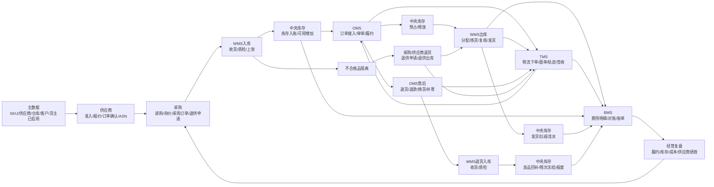
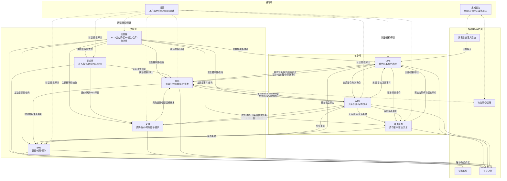

# 01-供应链系统业务总览

> 本文合并原业务流程总览、核心业务闭环与边界图、DDD 领域建模分析，作为供应链系统的统一业务地图和 DDD 总览。它先回答系统管什么、边界如何划、核心业务如何闭环、哪些地方必须守住不变量，再把详细流程、领域模型、功能设计、数据库设计和接口设计导向后续文档。

## 1. 总体定位

供应链系统的核心作用，是把商品从“主数据准备、采购寻源、供应商交付、仓库收发、库存承诺、订单履约、退货逆向、费用结算、经营复盘”这一整条链路数字化、流程化、可追踪化。

从经营视角看，它管理三类流：

| 类型  | 说明                                          | 典型承载                               |
| --- | ------------------------------------------- | ---------------------------------- |
| 信息流 | 商品、供应商、客户、货主、订单、库存、作业、运输、费用等信息如何创建、审批、同步、回传 | 主数据、供应商、采购、OMS、WMS、TMS、中央库存、BMS、权限 |
| 实物流 | 商品如何从供应商进入仓库，再从仓库发给客户，或在退货、调拨、退供中逆向流转       | 采购入库、销售出库、调拨、售后退货、供应商退货、盘点调整、运输在途  |
| 资金流 | 采购应付、客户账单、仓储费、操作费、物流费、对账、发票、付款如何闭环          | BMS、采购、供应商、OMS、WMS、TMS、财务系统        |

第一版系统以九个核心子系统为主：

| 子系统 | 定位 |
| --- | --- |
| 主数据系统 | 统一商品、供应商、客户、货主、仓库、库位、物流商等基础资料 |
| 供应商系统 | 支撑供应商准入、报价、订单确认、ASN、退供、对账、质量和评分 |
| 采购系统 | 管理请购、询价、比价、采购订单、到货跟踪和退供申请 |
| OMS 系统 | 管理销售订单、履约、库存预占、出库指令、取消和售后 |
| 中央库存系统 | 管理库存账户、可用、预占、释放、扣减、冻结、流水和对账 |
| WMS 系统 | 管理入库、收货、质检、上架、库位库存、拣货、复核、包装、发货和盘点 |
| TMS 系统 | 管理物流商接入、物流产品、运输任务、运单面单、发运交接、轨迹、签收、物流异常和物流费用来源事实 |
| BMS 系统 | 根据业务事实生成费用明细、对账单、账单、发票和财务交接 |
| 权限系统 | 提供单点登录、用户、角色、权限点、数据权限、Token 和操作审计 |


## 2. 最小业务闭环

第一版最小可运行闭环：

```text
主数据建档并启用
  -> 供应商准入和供应商商品维护
  -> 采购下单并供应商确认
  -> WMS 收货、质检、上架
  -> 中央库存入账并形成可用库存
  -> OMS 接入销售订单并请求库存预占
  -> OMS 下发出库指令
  -> TMS 创建运单/面单并跟踪运输
  -> WMS 拣货、复核、包装、发货交接
  -> 中央库存按发货事实扣减
  -> BMS 根据入库、出库、库存、运输、退货等事实计费和对账
  -> 售后退货、供应商退货、调拨、盘点继续修正库存和费用
```

核心闭环图：



## 3. 业务流程总览

| 业务流程  | 发起角色/系统                      | 参与子系统                       | 核心业务事实                                   |
| ----- | ---------------------------- | --------------------------- | ---------------------------------------- |
| 主数据建档 | 商品、采购、仓储、物流、财务、主数据人员         | 主数据、权限、各业务系统                | SKU已启用、供应商已启用、仓库已启用、货主已启用                |
| 采购入库  | 采购员、供应商、物流专员、收货员、质检员、上架员     | 采购、供应商、TMS、WMS、中央库存、BMS     | 采购订单已审核、ASN已提交、采购运输已发运/到仓、入库已上架、库存已增加    |
| 销售出库  | 渠道/客户、OMS、物流专员、拣货员、复核包装员、发货员 | OMS、中央库存、TMS、WMS、BMS        | 库存已预占、运单已创建、出库指令已下发、出库单已发货、库存已扣减、物流已签收   |
| 调拨    | 库存运营、仓库主管、物流专员               | 中央库存、WMS、TMS、BMS            | 调拨已出库、调拨运输在途、调拨已到达、调拨已入库、调拨差异已确认         |
| 售后退货  | 客户、客服、物流专员、仓库、财务             | OMS、TMS、WMS、中央库存、BMS        | 售后已审核、退货运单已创建、退货已到仓、退货已质检、良品已回补、退款/换货已处理 |
| 供应商退货 | 采购、质检、仓库、物流专员、供应商            | 采购、供应商、WMS、TMS、中央库存、BMS     | 退供申请已批准、退供出库已发货、供应商已签收、库存已扣减             |
| 盘点调整  | 仓库主管、盘点员、库存人员                | WMS、中央库存、BMS                | 盘点差异已确认、库存已调整                            |
| 计费对账  | BMS、财务、供应商/客户                | BMS、采购、供应商、OMS、WMS、TMS、中央库存 | 费用已生成、物流费用已采集、对账单已确认、账单已生成               |

## 4. DDD 总体对齐

| DDD 项 | 统一口径 |
| --- | --- |
| 文档层级 | 全局业务地图、端到端业务闭环、限界上下文总览、跨系统一致性基准 |
| 核心域 | OMS 履约、中央库存、WMS 仓储作业、调拨协同、逆向退货 |
| 支撑域 | 主数据、采购、供应商协同、TMS 运输协同、BMS 计费结算 |
| 通用域 | 权限、审计、通知、附件、枚举、OpenAPI、导入导出 |
| 主要限界上下文 | 主数据、供应商、采购、OMS、中央库存、WMS、TMS、BMS、权限 |
| 扩展候选上下文 | 售后、调拨、计划补货、财务、报表分析、集成平台 |
| 数据主权 | 每个上下文只修改自己拥有的聚合；跨上下文通过命令、领域事件、查询接口和快照协作 |
| 命令 | 请求目标上下文执行动作，如请求预占、创建出库单、确认发货、生成费用 |
| 领域事件 | 来源上下文已经发生的业务事实，如库存已预占、入库已上架、出库已发货 |
| 查询模型 | 列表、看板、追踪页、报表可跨上下文聚合，但不拥有业务事实 |
| 一致性策略 | 聚合内强一致；跨上下文最终一致，依赖幂等、重试、对账、补偿和人工处理 |

## 5. 子域划分

### 5.1 核心域

| 核心域   | 业务价值               | 主要上下文        | 深入建模重点                   |
| ----- | ------------------ | ------------ | ------------------------ |
| 库存可用性 | 防超卖、支撑一盘货、减少库存差异   | 中央库存         | 库存账户、预占、扣减、释放、冻结、流水、不变量  |
| 销售履约  | 订单准确、快速、低成本发出      | OMS、中央库存、WMS | 分仓、预占、出库指令、履约状态、取消补偿     |
| 仓内作业  | 提升收货、上架、拣货、复核、发货效率 | WMS          | 入库单、出库单、任务、容器、库位、批次、异常   |
| 调拨协同  | 平衡多仓库存，处理在途和差异     | 中央库存、WMS     | 调拨申请、调出、在途、调入、差异处理       |
| 逆向退货  | 决定售后体验和库存回收准确性     | OMS、WMS、中央库存 | 售后单、质检、良品/残次/报废、退款/换货、退供 |

### 5.2 支撑域

| 支撑域 | 主要上下文 | 设计重点 |
| --- | --- | --- |
| 主数据管理 | 主数据 | 类型、字段模板、编码、建档、审核、版本、发布、数据质量 |
| 采购管理 | 采购 | 请购、询价、比价、采购订单、到货跟踪、退供申请 |
| 供应商协同 | 供应商 | 准入、报价、订单确认、ASN、质量整改、评分、对账 |
| 结算计费 | BMS | 计费对象、规则、来源事件、费用明细、调整、对账、账单 |
| 运输协同 | TMS | 物流商、物流产品、运输任务、运单、面单、轨迹、签收、异常、物流费用来源事实 |

### 5.3 通用域

| 通用域 | 当前系统 | 设计策略 |
| --- | --- | --- |
| 权限认证 | 权限系统 | 标准用户、角色、权限、Token、操作日志、数据权限 |
| 枚举配置 | 各系统/主数据 | 允许配置标签、颜色、排序，核心状态值不随意配置 |
| 附件 | 各系统 | 通用附件模型，业务单据引用 |
| 消息通知 | 各系统 | 通用通知模板和发送记录 |
| 审批流 | 权限/流程能力 | 通用审批能力，审批结果必须回写业务聚合 |
| 集成接口 | OpenAPI/网关候选 | 统一鉴权、签名、幂等、日志、回调、重试 |

## 6. 限界上下文总览

| 限界上下文 | 负责范围                                                    | 不负责范围                   | 数据主权                                  | 主要生产事件                          |
| ----- | ------------------------------------------------------- | ----------------------- | ------------------------------------- | ------------------------------- |
| 主数据   | 商品、供应商、客户、货主、仓库、库位、物流商、组织等基础资料                          | 采购执行、库存余额、仓库作业          | 主数据类型、字段模板、主数据记录、版本、发布日志              | SKU已启用、供应商已启用、仓库已启用、货主已启用       |
| 供应商   | 供应商准入、报价、订单确认、ASN、质量整改、评分、对账确认、退供协同                     | 内部采购审批、仓库收货、财务付款        | 供应商协同事实、报价、ASN、评分、对账确认                | 供应商订单已确认、ASN已提交、供应商评分已发布        |
| 采购    | 请购、询价、比价、采购价格、采购订单、到货跟踪、退供申请                            | 仓内收货上架、库存余额、供应商门户操作     | 采购申请、询价单、比价结果、采购订单、退供申请               | 采购订单已审核、退供申请已批准                 |
| OMS   | 销售订单、履约、分仓、出库指令、取消、售后                                   | 仓内拣货、库位库存、全局库存余额        | 销售订单、履约单、OMS出库指令、售后单                  | 销售订单已审核、出库指令已下发、售后单已审核          |
| 中央库存  | 库存账户、预占、释放、扣减、冻结、调整、流水、对账                               | 库内作业、销售订单审核、商品建档        | 库存账户、库存预占、冻结单、库存流水、快照、对账单             | 库存已预占、库存已释放、库存已扣减、库存已增加         |
| WMS   | 入库、收货、质检、上架、库位库存、出库、波次、拣货、容器、复核包装、发货、盘点、仓内异常            | 销售审核、全局可售承诺、计费规则        | 入库单、收货单、质检单、上架任务、库内库存、出库单、拣货单、包裹、盘点计划 | 入库单已上架、拣货任务已完成、出库单已发货、盘点差异已确认   |
| TMS   | 物流商接入执行、物流产品、运输任务、运单面单、揽收/发运、轨迹、签收、拒收、延误、破损、丢失、物流费用来源事实 | 仓内拣货包装、库存扣减、订单审核、费用规则结算 | 运输任务、运单、面单、轨迹、签收记录、物流异常、物流费用来源        | 运单已创建、运输已发运、运输已到达、运输已签收、物流异常已登记 |
| BMS   | 计费对象、计费规则、费用来源事件、费用明细、费用调整、对账单、账单、发票交接、财务交接             | 创造入库/出库/物流业务事实、实际收付款    | 费用来源事件、费用明细、对账单、账单、发票交接               | 费用明细已生成、对账单已确认、账单已生成            |
| 权限    | SSO、用户、角色、权限点、数据权限、Token、审批实例、操作日志、安全策略                 | 判断业务状态是否允许流转            | 用户、角色、权限点、数据权限、Token、审批、操作日志          | 用户已登录、权限已变更、操作已记录               |

扩展候选上下文：

| 候选上下文 | 第一版建议 | 独立条件 |
| --- | --- | --- |
| 售后 | 先在 OMS 内保持售后聚合独立 | 退款、换货、补寄、维修、质检、财务联动复杂 |
| 调拨 | 先由中央库存 + WMS 协同，保留调拨模型 | 多级调拨、在途责任、差异赔付、跨组织结算复杂 |
| 计划补货 | 暂不进入 P0 | 需要预测、补货算法、采购建议、调拨建议自动化 |
| 财务 | 对接外部财务系统 | 需要在本系统内做应收应付、发票、付款、成本核算 |

## 7. 上下文边界图



## 8. 核心聚合与不变量

详细聚合设计见 [核心聚合与不变量总表](../03-核心业务模型/00-领域模型总览/01-核心聚合与不变量总表.md) 和各系统领域模型。总览层只保留核心口径：

| 上下文  | 核心聚合                                                  | 关键不变量                                                          |
| ---- | ----------------------------------------------------- | -------------------------------------------------------------- |
| 主数据  | 主数据记录、主数据版本、发布订阅、编码规则                                 | 编码唯一；已发布版本不可破坏性修改；下游引用必须可追溯版本                                  |
| 供应商  | 供应商、供应商商品、供应商报价、ASN、供应商评分、退供应商单                       | 未准入供应商不能参与采购；供应商商品必须关联有效 SKU；评分依据可追溯                           |
| 采购   | 采购申请、询价单、比价结果、采购价格、采购订单、退供申请                          | 采购订单数量不能小于已收货数量；价格必须有生效期；退供必须来源清晰                              |
| OMS  | 销售订单、履约单、OMS出库单、取消申请、售后单                              | 已出库订单不能直接取消；售后退款必须有可追溯原因；出库指令不能绕过库存预占                          |
| 中央库存 | 库存账户、库存预占、冻结单、库存调整单、库存快照、库存对账单                        | 可用不能被重复占用；扣减必须有预占或合法来源；流水幂等且不可随意修改                             |
| WMS  | 入库单、收货单、质检单、上架任务、库内库存、出库单、波次、拣货单、复核包装单、发货交接、盘点计划、仓内异常 | 实物移动必须有作业单；库位库存不能为负；不合格品必须隔离                                   |
| TMS  | 运输任务、运单、面单、物流轨迹、签收记录、物流异常、物流费用来源                      | 同一业务来源不能重复创建运单；轨迹必须按时间顺序追加；签收/拒收/丢失等终态不能随意回退；物流费用来源必须可追溯运单和承运商 |
| BMS  | 计费对象、计费规则、费用来源事件、费用明细、调整单、对账单、账单                      | 同一来源事件不能重复计费；账单确认后不能直接改明细；调账必须留痕                               |
| 权限   | 用户、角色、权限点、数据权限、会话Token、审批实例、操作日志                      | 未授权不能访问；写操作必须审计；Token 必须可校验和失效                                 |

## 9. 通用语言与高风险混淆

| 术语  | 容易混淆点            | 统一定义                                  |
| --- | ---------------- | ------------------------------------- |
| 库存  | 中央库存和 WMS 都叫库存   | 中央库存叫库存账户/可用/预占；WMS 叫库位库存/实物库存        |
| 出库单 | OMS、WMS 都有出库概念   | OMS 使用履约单/OMS出库指令；WMS 使用 WMS 出库单和拣货任务 |
| 入库  | 采购入库、退货入库、调拨入库不同 | 统一由 WMS 入库作业承载，用来源类型区分采购、售后、调拨、其他     |
| 可用  | 可销售、可预占、可拣选不是一回事 | 中央库存定义可预占库存，渠道定义可销售库存，WMS 定义可拣选库存     |
| 冻结  | 质检冻结、库存冻结、财务冻结不同 | 必须记录冻结原因、范围、来源和释放动作                   |
| 货主  | 自营业务可能不明显        | 单货主可默认企业自身；多客户仓储时货主必须成为库存和计费维度        |
| 批次  | 采购批次、生产批次、库存批次不同 | WMS/库存至少明确批次号、生产日期、效期、序列号规则           |
| 完成  | 各系统完成含义不同        | OMS 完成是履约完成，WMS 完成是作业完成，库存完成是流水入账完成   |

## 10. 命令、事件与查询模型

### 10.1 典型命令

| 命令         | 发起方               | 处理方  | 目标聚合    | 幂等键建议                                                       |
| ---------- | ----------------- | ---- | ------- | ----------------------------------------------------------- |
| 创建采购订单     | 采购员/02-采购系统          | 采购   | 采购订单    | `purchase_order_no`                                         |
| 发布采购订单给供应商 | 采购                | 供应商  | 采购订单确认  | `purchase_order_no + version`                               |
| 创建入库单      | 采购/供应商/OMS        | WMS  | 入库单     | `source_system + source_order_no + version`                 |
| 请求库存预占     | OMS               | 中央库存 | 库存预占    | `fulfillment_order_no + reserve_version`                    |
| 释放库存预占     | OMS               | 中央库存 | 库存预占    | `reservation_no + release_reason + source_event_id`         |
| 创建运输任务/运单  | OMS/采购/供应商/调拨/WMS | TMS  | 运输任务、运单 | `source_system + source_order_no + shipment_type + version` |
| 取消运输任务/运单  | OMS/采购/调拨/退供      | TMS  | 运输任务、运单 | `tracking_no + cancel_reason + source_event_id`             |
| 下发出库指令     | OMS/调拨/采购退供       | WMS  | 出库单     | `source_order_no + source_type + version`                   |
| 确认发货       | 发货员/WMS           | WMS  | 发货交接    | `outbound_order_no + shipment_no`                           |
| 生成费用明细     | BMS 事件消费者         | BMS  | 费用明细    | `source_event_id + fee_item_code`                           |

### 10.2 典型事件

| 领域事件 | 来源上下文 | 典型消费者 | 消费后变化 |
| --- | --- | --- | --- |
| `SkuEnabled` | 主数据 | 采购、供应商、OMS、WMS、库存、BMS | 保存 SKU 快照，允许新增业务引用 |
| `SupplierEnabled` | 主数据 | 采购、供应商 | 允许创建采购和供应商协同 |
| `PurchaseOrderApproved` | 采购 | 供应商、WMS、BMS | 供应商可确认，WMS 可准备入库，BMS 可采集采购事实 |
| `AsnSubmitted` | 供应商 | 采购、WMS | 采购更新到货预期，WMS 创建入库预约 |
| `InboundOrderPutawayCompleted` | WMS | 中央库存、采购、BMS | 库存增加，采购更新入库进度，BMS 计费 |
| `InventoryReserved` | 中央库存 | OMS | 履约进入可下发 WMS 状态 |
| `OutboundOrderShipped` | WMS | OMS、中央库存、BMS | OMS 更新发货，库存扣减，BMS 计费 |
| `WaybillCreated` | TMS | OMS、WMS、BMS | 运单已创建，WMS 可打单，BMS 可采集物流费用前置数据 |
| `TrackingAppended` | TMS | OMS、采购、调拨、供应商、BMS | 运输已发运或在途，业务单据更新在途状态 |
| `TransportArrived` | TMS | WMS、采购、调拨、OMS | 货物到达收货方，WMS 可准备到货登记 |
| `TransportSigned` | TMS | OMS、采购、供应商、BMS | 运输已签收，订单、退供、调拨可推进完成或结算 |
| `LogisticsExceptionRegistered` | TMS | OMS、采购、WMS、BMS | 运输延误、破损、丢失、拒收等异常进入补偿处理 |
| `AfterSaleApproved` | OMS | WMS、中央库存、BMS | 创建退货入库或退款/补寄后续处理 |
| `StocktakeDifferenceConfirmed` | WMS | 中央库存、BMS | 库存调整，生成盘点相关费用或审计 |
| `FeeDetailGenerated` | BMS | BMS/财务 | 形成对账和账单依据 |

### 10.3 查询模型边界

| 查询模型     | 数据来源                    | 用途                   | 边界                     |
| -------- | ----------------------- | -------------------- | ---------------------- |
| 订单履约追踪页  | OMS、中央库存、WMS、TMS        | 查看订单从审核到发货/签收的链路     | 不直接修改库存、WMS 作业或 TMS 运单 |
| 库存全链路追踪页 | 中央库存、WMS、OMS、采购、售后      | 追踪库存从入库到出库/退货的变化     | 以库存流水和业务单据为准           |
| 采购到货看板   | 采购、供应商、TMS、WMS          | 查看采购订单、ASN、运输在途、入库进度 | 不替代采购订单状态机             |
| 仓库作业看板   | WMS、OMS、采购              | 查看待收货、待上架、待拣货、待发货    | 不替代 WMS 作业命令           |
| 物流运输看板   | TMS、OMS、采购、WMS、供应商      | 查看运单、轨迹、签收、异常和承运商履约  | 不替代 OMS、采购、WMS 的业务状态机  |
| 费用对账看板   | BMS、WMS、TMS、OMS、库存、财务系统 | 查看费用明细、账单、差异         | 不直接改变业务事实              |

## 11. 边界规则

1. 主数据是基础资料权威来源，下游业务单据必须保留主数据快照或版本。
2. OMS 不直接扣减库存，只能请求预占、释放或响应扣减结果。
3. WMS 不直接修改中央库存余额，只发布收货、上架、发货、盘点等实物事实；是否同步调用库存接口由集成策略决定。
4. 中央库存不管理最细库位作业，只管理库存账户、预占、冻结、流水和可售。
5. TMS 不决定订单能否履约、库存能否扣减，也不执行仓内拣货包装；TMS 只拥有运输任务、运单、轨迹、签收和物流异常事实。
6. BMS 不创造入库、出库、履约、物流事实，只消费事实并生成费用、对账和账单。
7. 09-权限系统负责身份、授权和审计，不替业务上下文判断业务状态能否流转。
8. 报表分析可以汇总多上下文数据，但不能成为业务事实源。
9. 跨上下文命令必须有幂等键；跨上下文事件消费必须可重试、可幂等、可追溯。

## 12. 一致性、幂等与补偿

| 风险场景 | 影响 | 处理口径 |
| --- | --- | --- |
| 主数据变更影响历史单据 | 历史订单、库存、费用口径混乱 | 业务单据保存主数据快照和版本 |
| 采购订单重复下发 WMS | 重复收货或重复入库 | 入库指令使用来源系统 + 来源单号 + 版本幂等 |
| ASN 与实际收货不一致 | 采购进度和库存数量差异 | WMS 以实收实检为事实，采购记录差异 |
| OMS 预占库存失败 | 订单无法履约或超卖 | OMS 进入缺货、换仓、拆单、人工处理或取消 |
| 出库短拣 | 发货数量少于订单数量 | WMS 发布短拣事件，OMS 决策部分发货、换仓或取消 |
| 物流下单失败 | 出库、退货、调拨或退供无法继续运输 | TMS 返回失败原因；OMS/采购/调拨可换物流产品、重试或人工处理 |
| 物流轨迹延迟或丢失 | 订单、调拨、退供状态滞后 | TMS 轮询承运商、事件重放、人工轨迹补录，业务系统保留待确认状态 |
| 运输破损、丢失、拒收 | 实物责任和结算复杂 | TMS 登记异常，WMS/OMS/采购按收货或拒收结果处理，BMS 生成索赔或费用调整依据 |
| WMS 已发货但 OMS 未收到 | 履约状态不一致 | WMS 保留事实，事件重试，OMS 支持补偿查询 |
| 库存扣减失败 | 库存账实不一致 | 中央库存生成异常流水，进入对账和人工处理 |
| BMS 重复计费 | 客户账单错误 | 费用明细按来源事件 ID 幂等，支持红冲和重算 |
| 退货质检结果变更 | 退款和库存回补错误 | 质检结果变更需要审批、流水和补偿事件 |
| 权限缓存未刷新 | 用户可见或可操作范围错误 | 权限变更事件 + Token 校验 + 缓存失效 |

## 13. 第一版建设蓝图

| 阶段     | 建设重点                       | 目标                         |
| ------ | -------------------------- | -------------------------- |
| 第 1 阶段 | 主数据、权限、采购、供应商、基础库存、简单入库/出库 | 跑通采购入库和销售出库最小闭环            |
| 第 2 阶段 | WMS 入库、出库、库位、盘点、调拨         | 仓库作业可执行、可追踪                |
| 第 3 阶段 | OMS、中央库存、分仓预占、一盘货          | 支撑多渠道订单履约，避免超卖             |
| 第 4 阶段 | 供应商协同、采购对账、供应商评分           | 提升采购协同效率                   |
| 第 5 阶段 | TMS、物流下单、面单、轨迹、签收、物流异常     | 让采购收货、销售发货、退货、退供和调拨具备运输可视化 |
| 第 6 阶段 | BMS、费用明细、对账、账单、财务交接        | 完成经营费用闭环，接入 TMS 物流费用来源事实   |
| 第 7 阶段 | OpenAPI、监控预警、报表            | 支撑外部接入和规模化运营               |

## 14. 后续文档深化顺序

后续不建议直接从数据库表开始，应按以下顺序逐层深化：

```text
业务地图
  -> 限界上下文
  -> 核心聚合
  -> 聚合状态机
  -> 命令和领域事件
  -> 字段模型
  -> 接口契约
  -> 页面和权限
  -> 数据库 DDL
```

已形成的承接文档：

| 文档 | 作用 |
| --- | --- |
| [核心聚合与不变量总表](../03-核心业务模型/00-领域模型总览/01-核心聚合与不变量总表.md) | 快速查看各上下文核心聚合和不变量 |
| [采购入库业务流程](../02-业务流程/02-采购入库业务流程.md) | 分析采购入库中的角色、系统、数据状态和时序 |
| [销售出库业务流程](../02-业务流程/05-销售出库业务流程.md) | 分析销售履约出库中的角色、系统、数据状态和时序 |
| [调拨业务流程](../02-业务流程/04-调拨业务流程.md) | 分析调拨的调出、在途、调入和差异处理 |
| [售后退货业务流程](../02-业务流程/06-售后退货业务流程.md) | 分析售后退货入库、质检、库存和退款 |
| [供应商退货业务流程](../02-业务流程/01-供应商退货业务流程.md) | 分析退供申请、预占、出库、发运和库存扣减 |
| [上下文映射与领域事件目录](../06-子系统接口设计/00-上下文映射与领域事件目录.md) | 统一跨上下文命令、事件、幂等和补偿 |

## 15. 设计边界与建设结论

| 设计项             | 当前结论                                    |
| --------------- | --------------------------------------- |
| TMS 建模与协同       | 已提升为正式子系统，覆盖运输任务、运单、面单、轨迹、签收、物流异常、费用来源，并与 OMS、WMS、采购、供应商、中央库存、BMS 对齐 |
| 售后是否独立          | 第一版在 OMS 内建模售后聚合；规则复杂后拆分                |
| 调拨是否独立          | 第一版由库存和 WMS 协同，保留调拨模型；复杂后拆分             |
| 计划补货            | 不进入 P0，后续可基于库存、采购、销售预测扩展                |
| 财务              | BMS 做业务计费对账，正式财务处理对接财务系统                |
| 主数据事件版本         | 已在主数据流程和接口事件目录中补充版本、快照、补偿拉取口径           |
| 出库指令与 WMS 出库单映射 | 已在 OMS、WMS 领域模型和 WMS 接口设计中继续细化          |
| 库存预占失败和短拣补偿     | 已在库存流程、WMS 接口和 OMS/WMS 领域模型中补充          |

## 16. 当前结论与待决问题

当前结论：供应链系统不是一个单独应用，而是一组围绕商品流转、库存承诺、仓储执行、运输履约、订单履约和费用结算协作的限界上下文。第一版设计应以“主数据 + 供应商 + 采购 + OMS + 中央库存 + WMS + TMS + BMS + 权限”为核心，财务、计划补货、报表和集成平台按复杂度逐步扩展。

关键假设：当前设计目标是端到端供应链平台；业务系统采用当前状态表 + 流水/历史表 + 事件日志 + 操作日志，不强制事件溯源。

待决问题：

| 问题             | 当前建议                                   |
| -------------- | -------------------------------------- |
| TMS 是否独立       | 需要独立。TMS 拥有运输任务、运单、轨迹、签收、物流异常和物流费用来源事实 |
| 售后是否拆出 OMS     | 第一版不拆，售后规则复杂后独立                        |
| 调拨是否独立服务       | 第一版不独立，保留调拨模型和状态机                      |
| 是否引入独立集成平台     | 如果外部系统接入多、回调多、失败补偿复杂，应建设独立集成能力         |
| 是否支持多货主/多组织/多仓 | 当前按支持设计；单货主场景可以默认企业自身为货主               |
