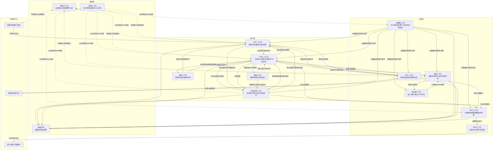
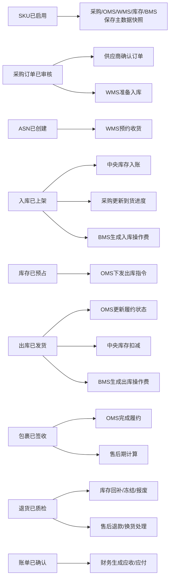

# 02 供应链系统核心业务闭环与边界图

> 本文承接 [01-供应链系统业务流程总览](./01-供应链系统业务流程总览.md)，用 DDD 视角重构供应链核心闭环和子系统边界。本文重点说明：哪些上下文负责业务事实，哪些动作是命令，哪些结果是领域事件，哪些数据不能跨上下文直接修改。

## 1. 文档定位

这不是详细流程设计，也不是接口字段设计，而是供应链系统的“边界地图”。它用于指导后续：

- 业务泳道图。
- 时序图。
- 状态机。
- 字段模型。
- 接口契约。
- 页面权限。
- 数据库 DDL。

本文要解决三个问题：

| 问题 | 输出 |
| --- | --- |
| 核心业务如何闭环 | 用事件链说明从主数据、采购入库、库存、销售履约、出库、物流、结算到复盘的闭环 |
| 子系统边界如何划分 | 用限界上下文说明每个系统负责什么、不负责什么、拥有什么数据 |
| 跨系统如何协作 | 用命令、领域事件、查询模型、补偿原则说明协作方式 |

## 2. DDD 对齐说明

| DDD 项 | 对齐口径 |
| --- | --- |
| 文档层级 | 业务总览 / 领域地图 / 上下文边界图 |
| 适用范围 | 端到端供应链平台的主业务闭环和子系统边界 |
| 核心域 | 订单履约、中央库存、仓储作业、调拨、逆向退货 |
| 支撑域 | 主数据、采购、供应商协同、物流、BMS、财务 |
| 通用域 | 权限、审计、OpenAPI、通知、字典、附件 |
| 主要限界上下文 | 主数据、供应商、采购、OMS、中央库存、WMS、TMS、BMS、售后、权限、集成 |
| 核心聚合 | SKU、供应商、采购订单、履约单、库存账户、库存预占、入库单、出库单、调拨单、售后单、费用明细、账单 |
| 数据主权 | 每个上下文只修改自己拥有的聚合；跨上下文通过命令、事件、查询接口和快照协作 |
| 命令 | 请求目标上下文执行业务动作，目标上下文可以接受、拒绝或返回失败原因 |
| 领域事件 | 来源上下文已经发生的业务事实，下游只能消费和响应，不能改变事实本身 |
| 查询模型 | 列表、看板、追踪页、报表可以跨上下文聚合数据，但不拥有核心业务状态 |
| 一致性策略 | 聚合内强一致；跨上下文最终一致，依赖幂等、重试、对账、补偿和人工处理 |

## 3. 核心业务闭环图

供应链主闭环不是简单的“系统 A 调系统 B”，而是多个限界上下文围绕业务事实持续推进。

```mermaid
flowchart LR
  MD["主数据上下文<br/>SKU/供应商/仓库/客户/物流已启用"] --> PLAN["计划/补货<br/>识别采购或调拨需求"]
  PLAN --> PUR["采购上下文<br/>采购订单已审核"]
  PUR --> SRM["供应商上下文<br/>订单已确认/ASN已创建"]
  SRM --> WMS_IN["WMS 入库<br/>已收货/已验收/已上架"]
  WMS_IN --> INV_IN["中央库存<br/>库存已入账"]
  INV_IN --> SELLABLE["可售库存<br/>可售库存已更新"]
  SELLABLE --> OMS["OMS 上下文<br/>履约单已创建/已审核"]
  OMS --> RESERVE["中央库存<br/>库存已预占"]
  RESERVE --> WMS_OUT["WMS 出库<br/>已拣货/已复核/已发货"]
  WMS_OUT --> INV_OUT["中央库存<br/>库存已扣减"]
  WMS_OUT --> TMS["TMS 上下文<br/>运单已创建/轨迹已更新"]
  TMS --> SIGN["履约完成<br/>包裹已签收"]
  SIGN --> BILL["BMS/财务<br/>费用已生成/账单已确认"]
  BILL --> BI["报表分析<br/>绩效/成本/库存周转反馈"]
  BI --> PLAN

  SIGN --> AFTER["售后上下文<br/>售后已申请/已审核"]
  AFTER --> RETURN_IN["WMS 退货入库<br/>退货已质检"]
  RETURN_IN --> INV_RETURN["中央库存<br/>良品回补/残次冻结/报废"]
  INV_RETURN --> BILL

  WMS_IN --> QUALITY["质检异常<br/>不合格品隔离"]
  QUALITY --> RTV["退供应商<br/>退供单已创建/已发运"]
  RTV --> INV_OUT
  RTV --> BILL
```



### 3.1 闭环阶段说明

| 阶段 | 核心动作 | 目标上下文 | 主要聚合 | 产生的业务事实 |
| --- | --- | --- | --- | --- |
| 主数据准备 | 创建并启用 SKU、供应商、仓库、客户、物流商 | 主数据 | SKU、供应商、仓库、物流商 | SKU已启用、供应商已启用、仓库已启用 |
| 采购计划 | 识别缺口，生成采购或调拨建议 | 计划/采购 | 采购申请、调拨建议 | 采购申请已创建、调拨建议已生成 |
| 采购下单 | 审核采购订单并通知供应商 | 采购 | 采购订单 | 采购订单已审核 |
| 供应商协同 | 供应商确认订单并预约送货 | 供应商 | 订单确认、ASN | 订单已确认、ASN已创建 |
| 入库执行 | 仓库收货、验收、上架 | WMS | 入库单、上架任务 | 入库已收货、入库已验收、入库已上架 |
| 库存入账 | 根据入库事实增加库存 | 中央库存 | 库存账户、库存流水 | 库存已入账、可用库存已增加 |
| 销售履约 | 审核订单、分仓、创建履约单 | OMS | 销售订单、履约单 | 履约单已创建、订单已审核 |
| 库存承诺 | 为履约单锁定可用库存 | 中央库存 | 库存预占 | 库存已预占、库存预占失败 |
| 出库执行 | 拣货、复核、打包、发货 | WMS | 出库单、拣货任务 | 出库已拣货、出库已发货 |
| 库存扣减 | 根据发货事实扣减库存 | 中央库存 | 库存账户、库存流水 | 库存已扣减 |
| 物流跟踪 | 下单、面单、轨迹、签收 | TMS | 运单、轨迹 | 运单已创建、包裹已签收 |
| 计费结算 | 根据业务事实生成费用和账单 | BMS/财务 | 费用明细、账单、应收应付 | 费用已生成、账单已确认 |
| 经营反馈 | 分析缺货、周转、履约、成本和绩效 | 报表分析 | 查询模型 | 指标已刷新、异常已预警 |

## 4. 上下文边界图

边界划分的核心原则：上下文拥有自己的模型和数据主权，其他上下文只能通过命令、事件或查询模型协作。



## 5. 限界上下文边界说明

| 限界上下文 | 负责范围 | 不负责范围 | 数据主权 | 主要命令 | 主要事件 |
| --- | --- | --- | --- | --- | --- |
| 主数据 | 商品、供应商、客户/货主、仓库、库位、物流商、组织等基础资料 | 采购、库存、仓库作业、订单履约 | SPU、SKU、供应商、客户、仓库、库位、物流商 | 创建SKU、启用供应商、停用仓库 | SKU已启用、供应商已变更、仓库已停用 |
| 采购 | 采购申请、询价、维价、采购订单、采购关单、退供申请 | 仓库实物收货、库存余额、供应商门户操作 | 采购申请、采购订单、采购价格 | 创建采购订单、审核采购订单、关闭采购订单 | 采购订单已审核、采购订单已关闭 |
| 供应商 | 准入、资质、报价、订单确认、ASN、绩效评分 | 内部采购决策、仓库收货、财务付款 | 供应商协同记录、报价、ASN、评分 | 提交报价、确认订单、创建ASN | 报价已提交、订单已确认、ASN已创建 |
| OMS | 销售订单、履约单、拆合单、分仓、发货指令、履约跟踪 | 仓内拣货、库位库存、全局库存余额 | 销售订单、履约单、发货指令 | 审核订单、请求预占、下发出库、取消履约 | 履约单已创建、订单已取消、订单已发货 |
| 中央库存 | 库存账户、预占、释放、扣减、冻结、可售库存、库存流水 | 库内作业、销售订单审核、商品建档 | 库存账户、库存预占、库存流水 | 预占库存、释放库存、扣减库存、冻结库存 | 库存已预占、库存已释放、库存已扣减 |
| WMS | 收货、验收、上架、拣货、复核、打包、发货、盘点、移库 | 销售审核、全局可售承诺、计费规则 | 入库单、出库单、库位库存、作业任务 | 创建入库单、创建出库单、确认上架、确认发货 | 入库已上架、出库已发货、盘点已完成 |
| 调拨 | 仓间调拨申请、调出、在途、调入、差异处理 | 具体库位拣货和上架动作、库存账户底层记账 | 调拨单、调拨计划、调拨差异 | 创建调拨单、确认调出、确认调入 | 调拨已出库、调拨已入库、调拨差异已确认 |
| 售后 | 退款、退货、换货、补寄、拒收、售后关闭 | 仓库质检执行、财务实际打款 | 售后单、退货申请、补寄单 | 审核售后、创建退货、创建补寄、关闭售后 | 售后已审核、退货已入库、售后已关闭 |
| TMS | 物流渠道、面单、运单、轨迹、物流异常、物流费用原始数据 | 仓库打包、订单审核、费用账单确认 | 运单、轨迹、物流渠道 | 创建运单、取消运单、同步轨迹 | 运单已创建、包裹已签收、物流异常已发生 |
| BMS | 计费规则、报价、费用明细、账单、对账 | 创造入库、出库、物流业务事实 | 计费规则、费用明细、账单、对账单 | 生成费用、生成账单、确认对账 | 费用已生成、账单已确认、对账差异已确认 |
| 财务 | 应收、应付、发票、付款、收款、成本核算 | 仓库作业、订单履约编排 | 应收单、应付单、发票、收付款 | 生成应收、生成应付、确认付款 | 应收已生成、应付已生成、付款已完成 |
| 权限 | 登录、用户、角色、功能权限、数据权限、审计日志 | 判断业务状态是否允许流转 | 用户、角色、权限、操作日志 | 登录、分配角色、授权、记录日志 | 用户已登录、权限已变更、操作已记录 |
| 集成 | 外部应用、鉴权、接口、Webhook、幂等、重试、接口日志 | 业务聚合内部规则 | 应用、凭证、接口日志、回调任务 | 调用接口、发送回调、重试任务 | 回调已发送、接口调用失败 |

## 6. 核心跨上下文事件图

这张图用于后续拆接口和事件目录。箭头代表“事件已经发生，下游响应”，不是直接改表。



## 7. 命令、事件与读模型边界

### 7.1 命令边界

命令表示“请求做某事”，目标上下文必须自己校验权限、状态、不变量，并决定是否接受。

| 命令 | 发起上下文 | 目标上下文 | 目标聚合 | 幂等键建议 |
| --- | --- | --- | --- | --- |
| 创建采购订单 | 采购员/计划 | 采购 | 采购订单 | `po_no` |
| 确认采购订单 | 采购 | 供应商 | 订单确认 | `po_no + supplier_id` |
| 创建入库指令 | 采购/供应商 | WMS | 入库单 | `inbound_order_no` |
| 请求库存预占 | OMS | 中央库存 | 库存预占 | `fulfillment_no + sku_id + warehouse_id` |
| 释放库存预占 | OMS | 中央库存 | 库存预占 | `release_request_no` |
| 下发出库单 | OMS/调拨/售后 | WMS | 出库单 | `outbound_order_no` |
| 创建运单 | OMS/WMS | TMS | 运单 | `package_no` |
| 生成费用明细 | WMS/TMS/库存事件消费者 | BMS | 费用明细 | `billing_source_event_id` |

### 7.2 事件边界

事件表示“事实已经发生”，消费者要做幂等处理，不能要求来源上下文回滚历史事实。

| 领域事件 | 来源上下文 | 来源聚合 | 典型消费者 | 消费后变化 |
| --- | --- | --- | --- | --- |
| SKU已启用 | 主数据 | SKU | 采购、OMS、WMS、库存、BMS | 保存 SKU 快照或映射 |
| 采购订单已审核 | 采购 | 采购订单 | 供应商、WMS | 供应商可确认，WMS 可准备入库 |
| ASN已创建 | 供应商 | ASN | WMS、采购 | 形成预约收货预期 |
| 入库已上架 | WMS | 入库单 | 中央库存、采购、BMS | 库存入账，采购更新进度，BMS计费 |
| 库存已预占 | 中央库存 | 库存预占 | OMS | 履约单进入可下发状态 |
| 出库已发货 | WMS | 出库单 | OMS、中央库存、BMS、TMS | OMS更新发货，库存扣减，BMS计费 |
| 包裹已签收 | TMS | 运单 | OMS、售后、报表 | 履约完成，进入售后期和评价 |
| 退货已质检 | WMS | 退货入库单 | 售后、中央库存、BMS | 退款/换货处理，库存按结果处理 |
| 账单已确认 | BMS | 账单 | 财务 | 生成应收/应付 |

### 7.3 查询模型边界

查询模型用于看数据，不用于承载核心业务规则。

| 查询模型 | 数据来源 | 用途 | 注意点 |
| --- | --- | --- | --- |
| 订单履约追踪页 | OMS、库存、WMS、TMS | 查看订单从审核到签收的链路 | 不直接修改库存或 WMS 作业 |
| 库存全链路追踪页 | 中央库存、WMS、OMS、采购、售后 | 追踪库存从入库到出库/退货的变化 | 以库存流水和业务单据为准 |
| 采购到货看板 | 采购、供应商、WMS | 查看采购订单、ASN、入库进度 | 不替代采购系统领域模型中的采购订单状态机 |
| 仓库作业看板 | WMS、OMS、采购 | 查看待收货、待上架、待拣货、待发货 | 不替代 WMS 作业命令 |
| 费用对账看板 | BMS、WMS、TMS、财务 | 查看费用明细、账单、差异 | 不直接改变业务事实 |

## 8. 边界规则与设计取舍

### 8.1 必须遵守的边界规则

1. OMS 不直接扣减库存，只能请求预占、释放、扣减，最终由中央库存保护库存不变量。
2. WMS 不直接修改中央库存余额，只发布入库、出库、盘点、调整等实物事实。
3. 中央库存不管理最细拣货任务和人员作业，只管理库存账户、预占、冻结、流水和可售。
4. BMS 不创造入库、出库、物流事实，只消费业务事实并生成费用。
5. 主数据是基础资料权威来源，下游业务单据必须保留主数据快照或版本。
6. 权限系统负责身份和授权，不替业务上下文判断业务状态能否流转。
7. 报表分析可以汇总多上下文数据，但不能成为业务事实源。

### 8.2 第一版设计取舍

| 取舍 | 第一版建议 | 原因 |
| --- | --- | --- |
| 中央库存与 WMS 库存 | 分开建模 | 中央库存负责承诺和全局可用，WMS 负责库位和实物作业 |
| OMS 与 WMS | 分开建模 | OMS 编排履约，WMS 执行仓内作业 |
| 售后上下文 | 可先放 OMS，模型上保持独立 | 退款、退货、换货会影响 OMS、库存、WMS、财务，复杂后可独立 |
| 调拨上下文 | 模型上独立，系统上可先放库存或 WMS | 调拨有调出、在途、调入和差异处理，不应只是库存调整 |
| TMS | 可先轻量，复杂后独立 | 简单快递只需面单轨迹，复杂物流需要渠道、计费、异常 |
| BMS | 有多货主/多客户/多报价时独立 | 计费和对账规则复杂，不能散落在 WMS/TMS |
| OpenAPI | 第一版就保留幂等、日志、重试 | 外部对接一旦上线，补救成本高 |

## 9. 一致性、幂等与补偿点

| 风险场景 | 影响 | DDD 处理口径 |
| --- | --- | --- |
| 主数据变更影响历史单据 | 历史订单、库存、费用口径混乱 | 业务单据保存主数据快照和版本 |
| 采购订单重复下发 WMS | 重复收货或重复入库 | 入库指令使用 `inbound_order_no` 幂等 |
| ASN 与实际收货不一致 | 采购进度和库存数量差异 | WMS 以实收实检为事实，采购记录差异 |
| OMS 预占库存失败 | 订单无法履约或超卖 | OMS 进入缺货、换仓、拆单、人工处理或取消 |
| 出库短拣 | 发货数量少于订单数量 | WMS 发布短拣事件，OMS 决策部分发货、换仓或取消 |
| WMS 已发货但 OMS 未收到 | 履约状态不一致 | WMS 保留事实，事件重试，OMS 支持补偿查询 |
| 库存扣减失败 | 库存账实不一致 | 中央库存生成异常流水，进入对账和人工处理 |
| 物流轨迹延迟或重复 | 客户看到状态不准确 | TMS 按运单号和轨迹节点幂等，允许补拉 |
| BMS 重复计费 | 客户账单错误 | 费用明细按来源事件 ID 幂等，支持红冲和重算 |
| 退货质检结果变更 | 退款和库存回补错误 | 质检结果变更需要审批、流水和补偿事件 |

## 10. 后续承接关系

本文后续应被以下文档引用：

| 后续文档 | 应承接的内容 |
| --- | --- |
| 采购入库泳道图 | 承接采购、供应商、WMS、中央库存、BMS 的命令和事件 |
| 销售履约出库泳道图 | 承接 OMS、中央库存、WMS、TMS、BMS 的命令和事件 |
| 库存预占/扣减/释放流程图 | 承接中央库存上下文的聚合不变量和补偿点 |
| 状态机文档 | 承接采购订单、出库单、调拨单、售后单等聚合生命周期 |
| 字段模型文档 | 承接数据主权、快照、幂等键、事件字段 |
| 接口与事件目录 | 承接本文的命令、领域事件、消费者和幂等要求 |
| 子系统详细设计 | 承接限界上下文边界、拥有数据、生产/消费事件 |

## 11. 当前结论

供应链核心闭环可以概括为：

```text
主数据发布语言
  -> 采购和供应商形成到货预期
  -> WMS 执行入库并发布实物事实
  -> 中央库存根据事实入账并提供库存承诺
  -> OMS 根据库存承诺编排履约
  -> WMS 执行出库并发布发货事实
  -> TMS 跟踪物流
  -> BMS/财务根据业务事实结算
  -> 报表反馈计划和运营优化
```

本文明确的第一原则是：每个限界上下文只拥有自己的业务事实；跨上下文协作使用命令和领域事件，不共享内部表，不绕过聚合修改数据。

## 12. 继续上下文

当前结论：本文已按 DDD 重构为核心闭环图、上下文边界图、跨上下文事件图，并明确命令、事件、查询模型、数据主权和补偿点。

关键假设：第一版仍以端到端供应链平台为目标，核心系统包括主数据、采购、供应商、OMS、中央库存、WMS、BMS、权限，TMS、售后、调拨可按复杂度逐步独立。

待决问题：调拨上下文和售后上下文在第一版是独立服务，还是先作为库存/OMS/WMS 的模块实现，需要后续结合复杂度判断。

下一步：继续细化 `03-1-采购入库业务流程` 和 `03-2-销售出库业务流程`，重点把每一步标成角色、系统、数据状态变化和异常处理。
