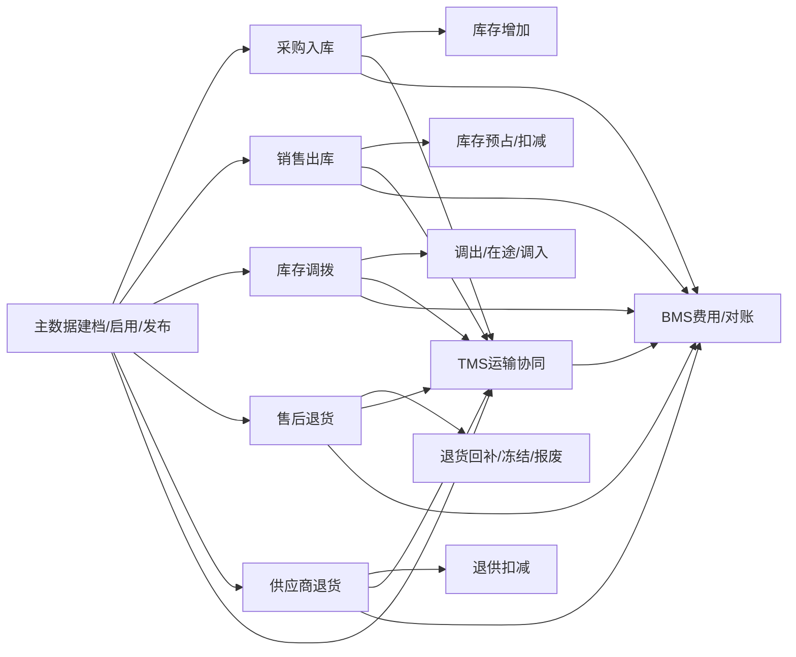

# 00 业务流程总览与查漏补缺

> 本文用于把 `docs/02-业务流程` 下的业务流程重新串起来，说明各流程之间的关系、数据主权、关键事件、费用来源和异常补偿。具体流程细节仍以各单篇流程文档为准。

## 1. 业务流程全景

供应链业务流程不是单独的采购、仓储、订单或物流动作，而是一组围绕“商品从供应商到客户，再从客户或仓库回流”的业务闭环。

## 2. 流程清单

| 文档 | 业务问题 | 主要事实源 | 关键输出 |
| --- | --- | --- | --- |
| `01-主数据系统业务流程` | 商品、供应商、客户、仓库、物流商等基础资料如何新增、审核、发布和使用 | 主数据系统 | 已启用主数据、版本、发布事件 |
| `03-1-采购入库业务流程` | 供应商发货后如何收货、质检、上架、增加库存和形成应付依据 | 采购、供应商、WMS、中央库存、TMS、BMS | 入库事实、库存增加、采购运输费用来源、应付依据 |
| `03-2-销售出库业务流程` | 客户订单如何预占库存、仓库发货、扣减库存、运输签收和生成费用 | OMS、WMS、中央库存、TMS、BMS | 发货事实、库存扣减、签收/异常、物流费用 |
| `05-库存预占扣减释放业务流程` | 中央库存如何统一处理预占、锁定、扣减、释放、在途和入账 | 中央库存、OMS、WMS、调拨、采购/退供 | 库存余额、库存流水、预占/锁定/在途结果 |
| `06-调拨业务流程` | 商品如何从调出仓转为在途，再进入调入仓 | 调拨系统、双仓 WMS、中央库存、TMS、BMS | 调出、在途、调入、调拨运输费用 |
| `07-1-售后退货业务流程` | 客户退货如何审核、运输、收货质检、回补或冻结库存、退款 | OMS/售后、TMS、WMS、中央库存、BMS | 售后结果、退货入库结果、退款和退货运费 |
| `07-2-供应商退货业务流程` | 不良品或可退商品如何退回供应商、扣减库存、签收和冲减应付 | 采购/退供、供应商、WMS、中央库存、TMS、BMS | 退供出库、库存扣减、供应商签收、索赔/冲减 |
| `08-TMS运输协同业务流程` | 各业务流程如何统一使用运输任务、运单、轨迹、签收、费用事实 | TMS | 运单、轨迹、签收、异常、物流费用来源 |
| `09-BMS费用结算业务流程` | BMS 如何把业务事实转为费用明细、对账、账单、索赔和冲减 | BMS、采购、OMS、WMS、TMS、中央库存 | 费用明细、对账单、账单、索赔/调整 |

## 3. 数据主权与修改边界

| 数据 | 权威系统 | 其它系统怎么用 | 禁止事项 |
| --- | --- | --- | --- |
| 主数据编码、状态、版本 | 主数据系统 | 缓存、引用、保存快照 | 子系统不能自行新增权威 SKU、仓库、物流产品 |
| 采购订单、采购进度 | 采购系统 | WMS/TMS/BMS 回传业务事实 | WMS 不能直接关闭采购订单 |
| 销售订单、履约单、售后单 | OMS/售后系统 | WMS/TMS/BMS 回传作业、物流和退款事实 | WMS/TMS 不能直接修改订单金额和售后策略 |
| 仓内入库、出库、质检、上架、拣货、复核、打包 | WMS | OMS/采购/库存消费仓内事实 | OMS 不能绕过 WMS 生成仓内作业完成事实 |
| 库存余额、预占、在途、流水 | 中央库存系统 | 各系统通过命令或事件触发库存变化 | 业务系统不能直接改库存余额 |
| 运输任务、运单、轨迹、签收、异常 | TMS | 业务系统消费物流事实推进单据 | WMS 发货交接不能当作客户或供应商已签收 |
| 费用来源、费用明细、对账、账单 | BMS | 采购/OMS/WMS/TMS 提供计费事实 | 业务单据不能直接生成最终账单 |

## 4. 跨流程关键事件

| 事件 | 生产方 | 主要消费者 | 用途 |
| --- | --- | --- | --- |
| 主数据已启用/已变更/已停用 | 主数据系统 | 采购、OMS、WMS、库存、TMS、BMS | 刷新本地缓存和引用校验 |
| 采购订单已审核 | 采购系统 | 供应商系统、WMS | 供应商确认，仓库形成到货预期 |
| ASN 已创建 | 供应商系统 | WMS、采购、TMS | 创建到货预告和采购运输任务 |
| 入库已上架 | WMS | 中央库存、采购、BMS | 库存入账、采购进度、入库费用 |
| 出库已发货 | WMS | OMS、中央库存、TMS、BMS | 订单发货、库存扣减、运输交接、作业费用 |
| 运单已签收/物流异常 | TMS | OMS、采购、调拨、供应商、BMS | 推进订单或退供状态，生成物流费用或索赔 |
| 调拨已出库/已入库 | WMS | 调拨系统、中央库存、BMS | 形成在途、调入库存、内部成本 |
| 退货已质检 | WMS | OMS/售后、中央库存、BMS | 决定回补、冻结、报废和退款 |
| 退供已出库/供应商已签收 | WMS/TMS/供应商系统 | 采购/退供、中央库存、BMS | 库存扣减、退供关闭、冲减应付 |
| 费用已生成/对账差异 | BMS | 采购、OMS、TMS、财务 | 单据费用闭环和异常处理 |

## 5. 查漏补缺后的统一规则

| 规则 | 说明 |
| --- | --- |
| 先有主数据，后有业务单据 | SKU、供应商、仓库、库位、客户、货主、物流商、物流产品必须启用后才能被引用 |
| 业务系统只发起命令，事实源系统产出事实 | OMS 可以请求预占，库存系统决定是否预占成功；WMS 可以发货，TMS 决定运输轨迹和签收事实 |
| 库存变化必须有流水 | 采购入库、销售出库、调拨、售后退货、退供应商都必须生成库存流水 |
| 运输变化必须有运单或轨迹 | 供应商收货、销售发货、退货收货、退供发货、调拨在途都要关联 TMS 运单 |
| 费用不能只靠业务单据生成 | BMS 要综合 WMS 作业事实、TMS 物流费用来源、采购/销售金额、合同和计费规则 |
| 发货不等于签收 | WMS 发货交接只表示仓库交给承运商；客户、供应商、调入仓签收以 TMS/承运商事实为准 |
| 取消要看所处阶段 | 未发货可释放预占或锁定；已发货必须走退回、反向流程、报损、索赔或异常关闭 |
| 异常必须保留责任方 | 少收、多收、短拣、破损、丢失、拒收、费用差异都要记录责任方和处理结果 |
| 跨系统消息必须幂等 | 幂等依据优先使用业务单号 + 行号 + 事件号/请求号，避免重复入账、重复扣减、重复计费 |
| 权限与审计贯穿全流程 | 审核、取消、异常关闭、库存调整、费用调整、退款、索赔必须记录操作人、时间、原因和前后值 |

## 6. 后续仍需细化的问题

| 问题               | 推荐默认值                                 | 后续落点          |
| ---------------- | ------------------------------------- | ------------- |
| 采购运输由供应商负责还是企业负责 | 第一版都支持，用费用责任方区分                       | TMS、BMS、采购合同  |
| 调拨运输是否需要签收       | 需要，调入仓到货/签收用于准备收货，但库存增加仍以 WMS 上架为准    | 调拨、WMS、TMS    |
| 售后退款是否必须等质检      | 退货退款默认等质检；仅退款可不等 WMS                  | OMS/售后、BMS    |
| 退供供应商拒收后怎么处理     | 默认异常挂起，按实物是否返回决定重新入库、索赔或异常关闭          | 采购/退供、TMS、WMS |
| 物流费用什么时候计费       | 默认 TMS 生成费用来源后 BMS 计费；签收、异常或账期可影响最终金额 | TMS、BMS       |
