# 主数据系统业务流程

> 本文合并原 `主数据支线流程`、`供应商与仓库库位主数据流程`、`客户货主与物流商主数据流程`，用于从业务流程角度理解主数据系统。领域模型、聚合、命令、事件、读模型以 [主数据领域模型](../../03-核心业务模型/07-主数据领域模型/01-主数据领域模型.md) 为准；表字段以 [主数据系统数据库设计](../../05-子系统数据库设计/07-主数据系统数据库设计.md) 为准。

## 1. 总体定位

主数据是供应链系统的共同语言。采购、供应商协同、OMS、WMS、TMS、中央库存、BMS、财务等系统能协同，是因为它们引用同一套商品、供应商、客户、货主、仓库、库位、物流商、物流产品、组织、税率、币种、单位和地址资料。

主数据系统不承接采购下单、仓内作业、库存记账、订单履约和财务入账，它负责基础资料的权威定义、审核、版本、发布和追溯。

```text
配置主数据类型和字段模板
  -> 配置编码规则、枚举和引用关系
  -> 创建主数据草稿
  -> 校验唯一性、必填、格式、引用和业务规则
  -> 提交审核或联调验收
  -> 启用并生成版本
  -> 发布主数据事件
  -> 子系统消费事件或按版本拉取
  -> 子系统引用主数据创建业务单据并保存快照
  -> 关键变更、冻结、停用、淘汰继续按版本发布
```

## 2. 业务目标与边界

| 项 | 说明 |
| --- | --- |
| 业务目标 | 让各子系统使用同一套基础资料，避免商品、供应商、仓库、客户、货主、物流商等口径不一致 |
| 核心价值 | 统一编码、统一状态、统一字段口径、统一版本、统一发布、统一数据质量治理 |
| 负责范围 | 主数据类型、字段模板、编码规则、SPU/SKU、供应商、客户、货主、仓库、库区、库位、物流商、组织、地址、税率、币种、单位、包装、发布订阅、导入导出、数据质量 |
| 不负责范围 | 不创建业务单据；不审批采购订单；不执行收货、上架、拣货、发货；不计算库存余额；不生成费用和账单 |
| 数据主权 | 主数据系统拥有基础资料权威口径；业务系统可以缓存和引用，但不能绕过主数据系统自行创造核心口径 |
| 一致性口径 | 主数据记录和版本强一致；主数据分发到子系统最终一致；子系统引用时保留关键字段快照 |

## 3. 主数据分类总览

| 主数据 | 解决的问题 | 主要使用系统 |
| --- | --- | --- |
| SPU | 商品概念层，表示商品款式、产品族或经营口径 | 商品、OMS、报表 |
| SKU | 可采购、可销售、可库存、可履约的最小商品单位 | 采购、供应商、OMS、WMS、库存、BMS |
| 商品类目/属性 | 决定商品属性模板、经营分类、仓储/物流规则 | 商品、OMS、WMS、BMS |
| 单位/包装 | 支撑采购单位、销售单位、库存单位、箱规、体积重量 | 采购、WMS、库存、BMS |
| 条码/编码 | 支撑仓库扫描、平台映射、外部系统识别 | WMS、OMS、开放接口 |
| 供应商 | 谁能供货、供什么、如何交付、如何结算 | 采购、供应商系统、WMS、BMS、财务 |
| 供应商商品 | 供应商能供哪些 SKU、供应商 SKU、MOQ、交期、价格 | 采购、供应商系统、计划 |
| 客户 | 卖给谁、谁结算、地址和信用规则是什么 | OMS、BMS、财务 |
| 货主 | 库存属于谁、谁付仓储物流费用、谁能看库存 | WMS、库存、OMS、BMS |
| 仓库 | 库存存放点、收发货点、作业组织边界 | WMS、库存、OMS、BMS |
| 库区/库位 | 仓内存储和作业位置 | WMS、库存、盘点 |
| 物流商/物流产品 | 谁运输、使用什么服务、如何打单、跟踪、签收、异常处理和结算 | OMS、WMS、TMS、BMS |
| 地址/区域 | 收发货地址、行政区划、配送区域、禁运区域 | OMS、WMS、TMS |
| 组织/公司 | 权限、财务主体、业务归属 | 全系统 |
| 税率/币种/结算规则 | 采购应付、销售应收、费用结算 | 采购、BMS、财务 |

## 4. 主数据通用生命周期

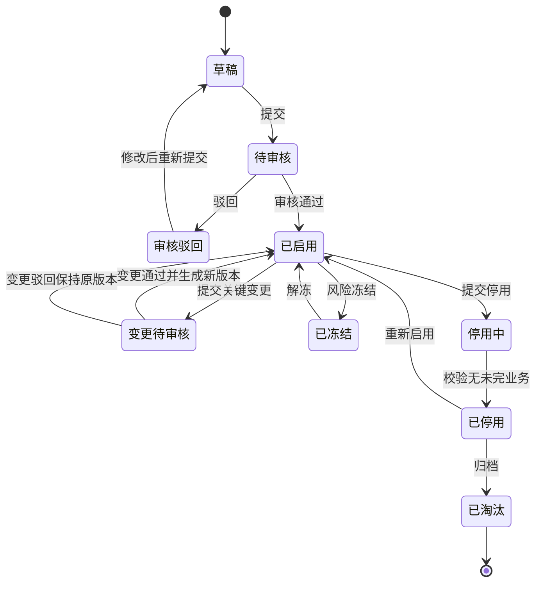

| 阶段 | 发起角色 | 系统动作 | 输出结果 |
| --- | --- | --- | --- |
| 建档 | 主数据专员、商品运营、采购、仓储、物流、财务 | 生成编码，填写资料，保存草稿 | 主数据草稿 |
| 校验 | 主数据系统 | 校验唯一、必填、枚举、引用、格式、有效期 | 校验通过或错误清单 |
| 审核/验收 | 业务、质量、财务、仓储、物流、系统管理员 | 对关键资料、资质、结算、接口、规则做审核 | 审核通过或驳回 |
| 启用 | 主数据系统 | 生成有效版本，推进状态 | 可被业务引用 |
| 发布 | 主数据系统 | 按订阅配置发布事件或 API 推送 | 子系统收到新增或变更事实 |
| 消费 | 采购、OMS、WMS、库存、BMS 等 | 更新本地缓存、读模型、引用校验规则 | 子系统可创建业务单据 |
| 变更 | 业务或主数据专员 | 识别关键字段，走审批和版本 | 新版本生效，历史快照不被改写 |
| 冻结/停用 | 管理员、风控、财务、质量 | 校验未完业务，限制新增引用 | 禁止新业务或仅保留历史追溯 |

## 5. 主数据事件风暴

| 阶段 | 命令 | 处理对象 | 领域事件 | 后续动作 |
| --- | --- | --- | --- | --- |
| 类型配置 | 创建主数据类型 | 主数据类型 | 主数据类型已启用 | 允许创建该类主数据 |
| 字段模板 | 发布字段模板 | 字段模板 | 字段模板已发布 | 建档表单和校验规则生效 |
| 编码 | 生成编码 | 编码规则 | 主数据编码已生成 | 写入草稿 |
| 建档 | 创建主数据记录 | 主数据记录 | 主数据草稿已创建 | 等待提交审核 |
| 审核 | 审核主数据 | 主数据记录 | 主数据已启用 / 主数据已驳回 | 通过后生成版本并发布 |
| 版本 | 生成主数据版本 | 主数据版本 | 主数据版本已生成 | 发布以版本为载荷 |
| 发布 | 发布主数据 | 发布订阅 | 主数据已发布 / 主数据发布失败 | 子系统消费或重试 |
| 变更 | 提交关键字段变更 | 主数据记录 | 主数据变更已提交 / 主数据变更已生效 | 新版本同步下游 |
| 冻结/停用 | 冻结或停用主数据 | 主数据记录 | 主数据已冻结 / 主数据已停用 | 禁止新增业务引用 |
| 数据质量 | 检测并处理问题 | 数据质量问题 | 数据质量问题已发现 / 已关闭 | 修复、合并、冻结或人工确认 |

## 6. 商品 SPU/SKU 主数据流程

### 6.1 何时新增或维护

| 场景        | 是否需要先建 SPU/SKU | 原因                          |
| --------- | -------------- | --------------------------- |
| 新品准备销售    | 需要             | OMS 和渠道需要可销售 SKU、图片、属性、价格   |
| 新品准备采购    | 需要             | 采购申请、询价、采购订单必须引用已启用 SKU     |
| 供应商新增可供商品 | 需要             | 供应商商品关系必须绑定 SKU             |
| 仓库首次收货    | 需要             | WMS 需要 SKU、条码、包装、批次、效期和上架规则 |
| 调拨已有商品    | 通常不需要          | 已有 SKU 可直接引用                |
| 售后退货      | 通常不需要          | 退货引用原销售 SKU                 |
| 组合品/套装品上线 | 需要新增或维护组合关系    | OMS 拆单、WMS 拣货、库存扣减需要组件关系    |
| 规格属性变化    | 视影响决定          | 若影响销售、库存或履约识别，通常应新建 SKU     |

### 6.2 建档内容

| 对象 | 关键内容 |
| --- | --- |
| SPU | SPU 编码、商品名称、品牌、类目、商品类型、生命周期、销售状态、类目属性、销售属性、图片、合规信息、关联 SKU |
| SKU | SKU 编码、名称、所属 SPU、规格属性、条码、外部编码、单位换算、包装、长宽高、重量、批次/效期/序列号规则、采购属性、销售属性、库存属性、财务属性、状态 |
| 组合品 | 组合 SKU、组件 SKU、组件数量、是否可替换、拆分履约规则 |
| 商品条码 | SKU、条码类型、条码值、包装层级、启停状态 |

### 6.3 商品建档流程

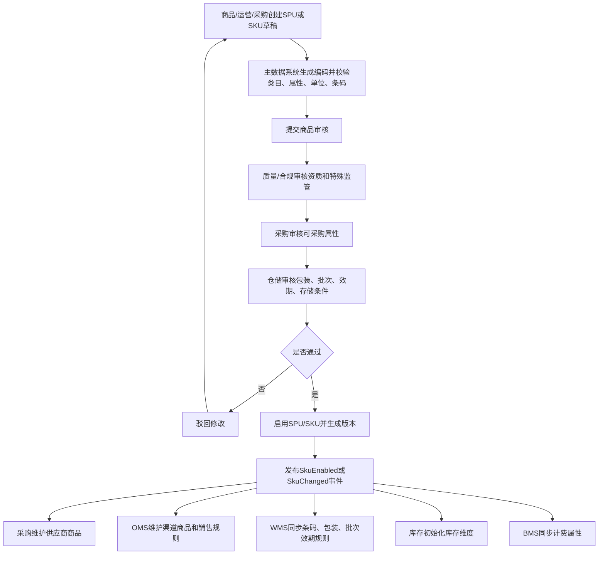

### 6.4 商品关键规则

| 规则 | 说明 |
| --- | --- |
| 没有启用 SKU 不允许采购 | 采购订单必须引用已启用 SKU |
| 没有启用 SKU 不允许入库 | WMS 无法收货、质检、上架和盘点 |
| 没有可销售 SKU 不允许上架销售 | OMS/渠道无法识别销售商品 |
| 单位换算变更高风险 | 已发生库存后不建议直接修改，应走新版本、换算补偿或新 SKU |
| 批次/效期规则变更高风险 | 会影响 WMS 收货、库存台账和出库先进先出 |
| 商品关键识别属性变化要慎重 | 颜色、尺码、型号、版本、包装规格影响履约识别时应新建 SKU |

## 7. 供应商主数据流程

### 7.1 何时新增或维护

| 场景          | 是否需要新增/维护 | 原因                    |
| ----------- | --------- | --------------------- |
| 新供应商准入      | 需要        | 采购、供应商系统、财务必须识别供应商主体  |
| 新品询价/寻源     | 需要        | 报价、样品、合同、资质都要绑定供应商    |
| 创建采购订单前     | 必须已启用     | 采购订单不能引用未启用供应商        |
| 供应商新增可供 SKU | 维护供应商商品   | 采购需要供应商 SKU、MOQ、价格、交期 |
| 资质到期        | 维护资质状态    | 影响是否可下单、收货和结算         |
| 收款账户变更      | 维护财务信息    | 影响付款安全，通常需要财务复核       |
| 退供应商业务      | 必须可引用供应商  | 退货单要回溯原供应商和采购关系       |

### 7.2 主体与内容

| 主体 | 作用 |
| --- | --- |
| 供应商档案 | 供应商基础身份、分类、状态、归属组织 |
| 供应商资质 | 营业执照、许可证、质量认证、有效期 |
| 供应商地址 | 注册地址、发货地址、退货地址、开票地址 |
| 供应商联系人 | 业务、财务、物流、质量联系人 |
| 供应商商品 | 可供 SKU、供应商 SKU、MOQ、采购倍数、交期、价格、税率 |
| 供应商合同 | 合同条款、账期、交付、质量、违约规则 |
| 供应商结算资料 | 税号、银行账户、币种、账期、发票类型 |
| 供应商绩效 | 交付、质量、价格、响应、异常指标 |

### 7.3 准入流程

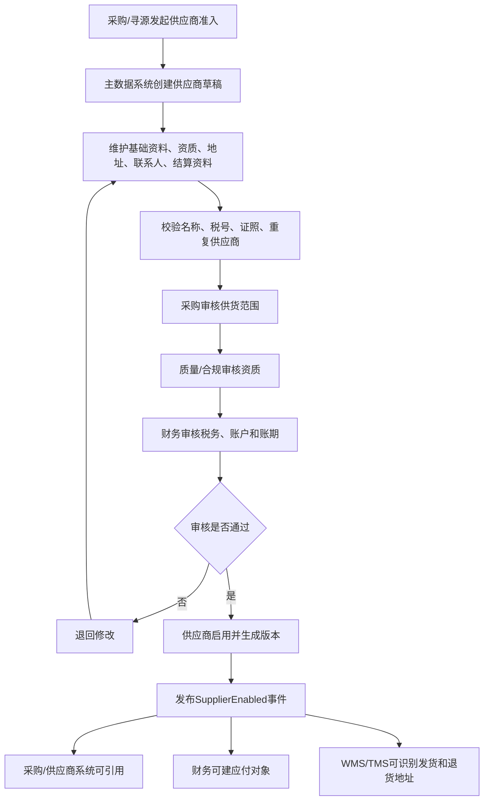

### 7.4 供应商商品维护流程

```text
供应商已启用
  -> 选择已启用 SKU
  -> 维护供应商 SKU 编码、采购单位、MOQ、采购倍数、交期、价格、税率
  -> 采购/供应商确认
  -> 启用供应商商品
  -> 采购询价、比价、采购订单引用
```

| 校验 | 说明 |
| --- | --- |
| SKU 必须已启用 | 避免供应商商品引用无效商品 |
| 供应商必须已启用 | 未准入供应商不能维护可供关系 |
| 采购单位要可换算到库存单位 | 入库后库存台账必须能按库存单位记账 |
| MOQ 和采购倍数参与下单校验 | 防止采购数量不符合供货条件 |
| 价格、税率、交期带生效期 | 新采购单按生效期取值，历史采购单不被改写 |

## 8. 仓库、库区、库位主数据流程

### 8.1 何时新增或维护

| 场景 | 是否需要新增/维护 | 原因 |
| --- | --- | --- |
| 新仓开仓 | 必须新增仓库、库区、库位 | 入库、出库、库存台账必须有库存地点 |
| 门店作为库存点 | 新增仓库或站点 | OMS 分仓、库存查询、调拨需要 |
| 海外仓/三方仓接入 | 新增仓库并配置接口 | WMS、TMS、库存同步需要 |
| 仓内布局调整 | 维护库区/库位 | 影响上架、拣货、补货、盘点 |
| 新增温区/特殊区域 | 新增库区或库位属性 | 冷藏、冻结、危险品、残次品隔离 |
| 货主入仓 | 维护仓库货主关系 | 多货主库存和计费需要 |
| 仓库停用/迁仓 | 变更状态并冻结新业务 | 先处理库存、在途、未完作业 |

### 8.2 仓库层级

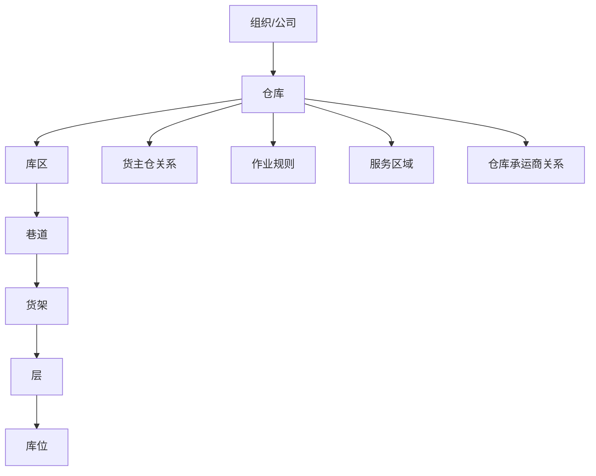

第一版可以先做三层：仓库、库区、库位。巷道、货架、层可作为库位编码或库位属性，不一定单独建表。

### 8.3 开仓流程

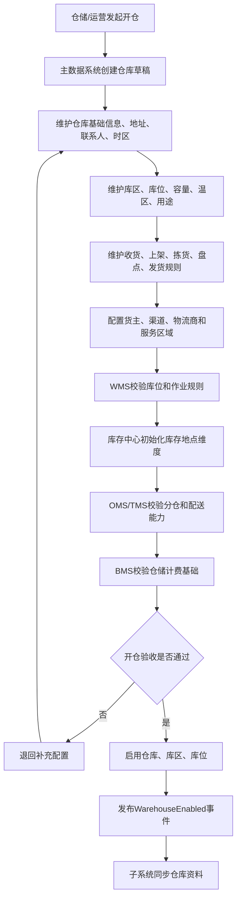

### 8.4 库区/库位状态

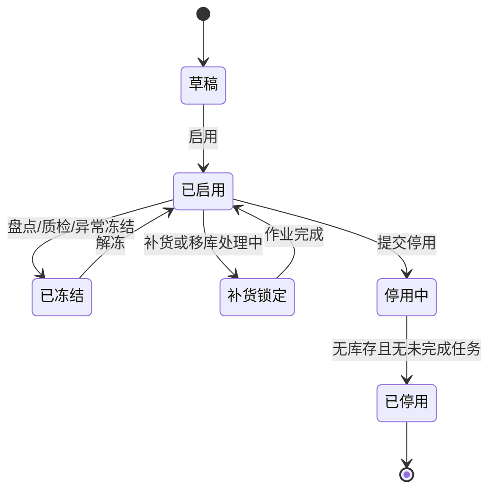

| 状态 | 是否允许入库 | 是否允许出库 | 说明 |
| --- | --- | --- | --- |
| 草稿 | 否 | 否 | 未启用 |
| 已启用 | 是 | 是 | 可正常作业 |
| 已冻结 | 否 | 通常否 | 可按冻结原因允许盘点、移库等特定作业 |
| 补货锁定 | 受限 | 受限 | 防止并发拣货、上架冲突 |
| 停用中 | 否 | 可清库存 | 只允许移出或盘清 |
| 已停用 | 否 | 否 | 仅保留历史追溯 |

## 9. 客户与货主主数据流程

客户和货主可以是同一个业务主体，也可以分开。

| 场景 | 客户 | 货主 |
| --- | --- | --- |
| 自营零售 | 下单消费者或企业客户 | 企业自己 |
| B2B 销售 | 经销商、门店、企业客户 | 企业自己 |
| 三方仓服务 | 货主客户的收货客户 | 入仓服务客户 |
| 平台仓配 | 平台买家或渠道客户 | 商家/品牌方 |

### 9.1 何时新增或维护

| 场景 | 是否需要新增/维护 | 原因 |
| --- | --- | --- |
| 新 B2B 客户签约 | 新增客户 | 销售订单、账期、发票、应收需要客户主体 |
| 新货主入仓 | 新增货主 | WMS、库存、BMS 要按货主隔离和计费 |
| 新渠道客户接入 | 新增客户或渠道客户映射 | OMS 接单、渠道编码、结算规则需要 |
| 客户新增收货地址 | 维护客户地址 | 销售履约、TMS 配送、售后退货需要 |
| 客户账期或信用变更 | 维护结算/信用资料 | 影响是否允许下单和发货 |
| 货主新增仓库服务 | 维护货主仓关系 | 决定货主能在哪些仓收发存 |
| 货主新增计费规则 | 维护服务合同/计费规则 | BMS 生成仓储费、操作费、物流费 |

### 9.2 主体与内容

| 主体 | 作用 |
| --- | --- |
| 客户档案 | 客户基础身份、类型、状态、归属组织 |
| 客户地址 | 收货、退货、开票、联系人地址 |
| 客户合同 | 价格、账期、服务条款、信用规则 |
| 客户信用 | 信用额度、账期、冻结规则 |
| 货主档案 | 库存货权主体、仓储服务对象、计费客户 |
| 货主仓关系 | 货主可用仓库、收发权限、计费启用 |
| 货主商品范围 | 货主可操作的 SKU 范围 |
| 货主计费规则 | 仓储费、操作费、耗材费、物流费规则 |
| 数据权限 | 客户/货主能看哪些订单、库存、账单 |

### 9.3 客户/货主建档流程

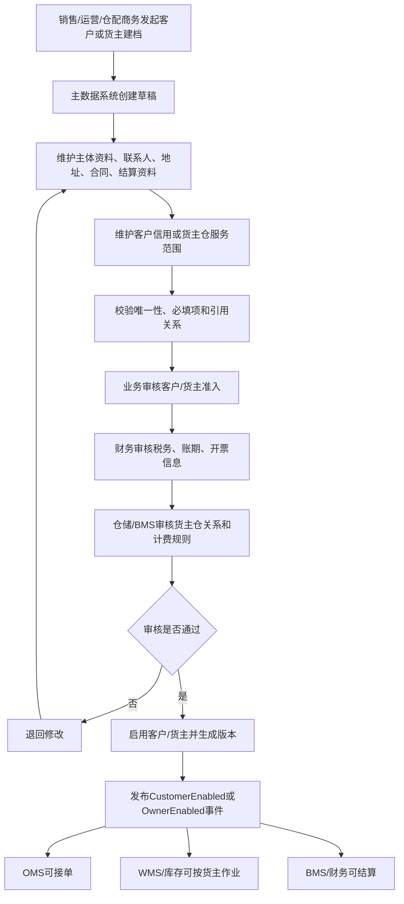

## 10. 物流商主数据流程

### 10.1 何时新增或维护

| 场景 | 是否需要新增/维护 | 原因 |
| --- | --- | --- |
| 接入新快递/三方物流 | 新增物流商 | 物流下单、面单、轨迹、结算需要 |
| 新增物流产品 | 维护物流渠道/产品 | 标快、特快、冷链、大件、同城等能力不同 |
| 新仓发货接入承运商 | 维护仓库承运商关系 | 决定哪个仓可以使用哪个物流服务 |
| 新区域配送 | 维护服务区域 | 影响 OMS 分仓和物流路由 |
| 运费合同变更 | 维护计费规则 | BMS/财务运费结算需要 |
| 面单或轨迹接口变化 | 维护接口配置 | 影响 WMS 打单和 TMS 跟踪 |
| 物流商停用 | 变更状态 | 停用前处理未发运、在途、未结费用 |

### 10.2 主体与内容

| 主体 | 作用 |
| --- | --- |
| 物流商档案 | 承运商基础身份、状态、类型，由主数据维护档案，由 TMS 执行下单和轨迹 |
| 物流产品/渠道 | 标快、冷链、大件、同城、海外尾程等，由 TMS 在运输任务中引用 |
| 服务区域 | 可达区域、禁运区域、偏远区域 |
| 仓库承运商关系 | 哪个仓可用哪些物流产品 |
| 面单配置 | 电子面单模板、账号、打印规则 |
| 轨迹接口配置 | 轨迹查询、订阅、回调规则 |
| 计费规则 | 首重续重、泡重、阶梯价、附加费 |
| 时效规则 | 承诺时效、截单时间、揽收时间窗 |
| 异常规则 | 丢件、破损、延误、拒收处理规则 |

### 10.3 物流商接入流程

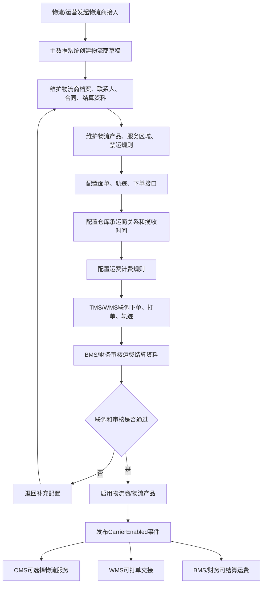

物流商状态机：

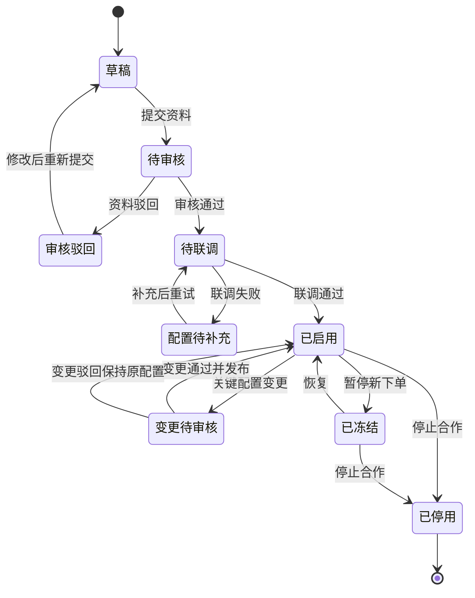

## 11. 组织、地址、单位、税率与枚举流程

原文档对这些通用主数据覆盖较少，这里补齐第一版需要的支撑流程。

| 主数据 | 新增时机 | 关键内容 | 使用系统 |
| --- | --- | --- | --- |
| 组织/公司 | 新公司、新部门、新业务线、新仓团队、新货主入驻 | 公司、组织、岗位、业务归属、财务主体、数据权限维度 | 全系统 |
| 地址/区域 | 新区域配送、新仓覆盖、行政区划更新 | 国家、省市区、邮编、经纬度、服务区域、偏远区域、禁运区域 | OMS、WMS、TMS |
| 单位/单位换算 | 新商品、新包装、新采购/销售单位 | 基础单位、采购单位、销售单位、库存单位、换算率、生效期 | 采购、OMS、WMS、库存、BMS |
| 包装规格 | 新商品包装、箱规、托盘规格变化 | 箱规、每箱数量、长宽高、重量、体积、包装层级 | WMS、TMS、BMS |
| 税率/币种 | 新税制、新币种、跨境业务 | 税率编码、税率值、币种、汇率来源、生效期 | 采购、BMS、财务 |
| 枚举字典 | 页面下拉、状态标签、业务类型扩展 | 枚举类型、枚举值、展示名、颜色、排序、启停 | 全系统 |

关键规则：

| 规则 | 说明 |
| --- | --- |
| 组织是权限和财务归属基础 | 组织变更会影响数据权限、审批流、费用归集 |
| 地址区域要可版本化 | 行政区划、偏远区域、禁运区域变化会影响新订单履约，不应改写历史订单 |
| 单位换算不能随意改 | 已有库存、采购、销售发生后，换算变更必须评估补偿 |
| 税率和币种必须带生效期 | 历史单据保留快照，新单按生效期取值 |
| 核心状态枚举不能随意增删 | 可配置展示名、颜色、排序，但状态机语义由领域模型控制 |

## 12. 主数据分发与子系统使用

### 12.1 分发方式

| 方式 | 适用场景 | 说明 |
| --- | --- | --- |
| 事件推送 | 新增、启用、停用、关键字段变更 | 主数据系统发布具体领域事件，如 `SkuEnabled`、`WarehouseEnabled` |
| API 拉取 | 子系统初始化、补偿同步、定时校验 | 子系统按类型、编码、版本或更新时间拉取 |
| 批量导入导出 | 历史数据迁移、大批量建档 | 需要模板、校验、错误报告和导入任务追溯 |
| 本地缓存 | 高频查询，如 SKU、仓库、地址、物流产品 | 子系统本地缓存，按事件刷新，按版本校验 |

推荐组合：

```text
主数据系统负责权威数据
  -> 事件推送保证及时
  -> API 拉取保证补偿
  -> 子系统本地缓存保证性能
  -> 版本号保证一致性和追溯
```

### 12.2 子系统如何使用

| 子系统 | 获取内容 | 使用方式 |
| --- | --- | --- |
| 采购系统 | 商品、供应商、供应商商品、单位、税率、币种 | 请购、询价、报价、比价、采购订单、退供应商 |
| 供应商系统 | 供应商、供应商商品、SKU、采购单位、地址 | 报价、订单确认、ASN、退供协同、质量整改 |
| OMS | 可销售 SKU、客户、地址、仓库、物流规则、渠道映射 | 接单、审单、拆合单、分仓、售后 |
| WMS | SKU、条码、包装、批次/效期规则、仓库、库区、库位、货主、物流商 | 收货、质检、上架、拣货、复核、包装、盘点 |
| 中央库存 | SKU、仓库、库位、货主、单位、批次规则 | 建库存维度、预占、释放、扣减、调拨、流水 |
| TMS | 物流商、物流产品、服务区域、地址、商品物流属性、包装重量体积 | 物流下单、面单、轨迹、签收、异常、禁运校验和物流费用来源 |
| BMS | 客户、货主、供应商、仓库、物流商、商品计费属性、税率 | 仓储费、操作费、物流费、对账和账单 |
| 财务 | 供应商、客户、税率、币种、组织、账户 | 应付、应收、发票、成本、付款 |
| 报表 | 全量主数据维度 | 统计分析、绩效、成本归因 |

## 13. 主数据变更规则

| 变更类型 | 处理建议 | 影响 |
| --- | --- | --- |
| 名称、描述、图片、联系人 | 可审批后同步 | 影响展示和沟通，不改历史快照 |
| 类目、品牌、业务分类 | 可变更但要审批 | 影响报表、规则和经营分析 |
| 条码 | 谨慎变更，保留历史条码 | 影响 WMS 扫码、外部平台映射 |
| 单位换算 | 高风险，已发生库存后不建议直接改 | 影响库存、采购、销售、计费数量 |
| 规格属性 | 若影响识别，应新建 SKU | 影响销售、库存、履约 |
| 重量/体积 | 可变更但要同步 WMS/TMS/BMS | 影响物流计费和仓储作业 |
| 批次/效期/序列号规则 | 高风险，需审批和生效期 | 影响收货、库存、出库、追溯 |
| 供应商税号/银行账户 | 严格审批，财务复核 | 影响开票和付款安全 |
| 客户信用/账期 | 财务审批 | 影响是否允许下单、发货和结算 |
| 货主仓关系 | 仓储和 BMS 共同确认 | 影响库存维度、作业权限、计费 |
| 仓库地址/库区用途/库位容量 | 仓储、OMS、TMS、BMS 联合校验 | 影响分仓、作业、运费、计费 |
| 物流服务区域/禁运规则 | 物流和 OMS/TMS 审核 | 影响可配送范围和合规风险 |
| 主数据状态 | 停用前校验未完业务 | 防止订单、库存、费用悬挂 |

## 14. 业务流程依赖矩阵

| 业务流程 | 必要主数据 |
| --- | --- |
| 采购入库 | SKU 已启用、供应商已启用、供应商商品已启用、采购单位可换算、收货仓/库区可用、质检规则可用 |
| 销售出库 | SKU 可销售、客户/地址可用、货主仓关系可用、发货仓可用、物流商/物流产品可用 |
| 调拨 | SKU 可库存、调出/调入仓可用、货主库存维度可用、在途规则可用、物流产品可用 |
| 售后退货 | 原销售 SKU、客户地址、退货仓、退货质检规则、货主归属 |
| 供应商退货 | 原供应商可识别、退货地址可用、待退供库存、退供出库仓、物流商可用 |
| 库存预占/扣减/释放 | SKU、仓库、货主、单位、批次规则、库存状态 |
| WMS 收货/上架/拣货/盘点 | SKU 条码、包装、批次/效期规则、仓库、库区、库位、货主 |
| BMS 计费/对账 | 客户/货主/供应商、仓库、物流商、计费规则、税率、币种、组织 |
| 财务结算 | 客户/供应商主体、税号、账户、账期、币种、发票规则 |

## 15. 数据质量、异常与补偿

| 场景 | 风险 | 处理策略 |
| --- | --- | --- |
| 重复供应商/客户 | 采购、对账和报表口径分裂 | 重复检测、合并建议、人工确认、保留历史映射 |
| SKU 重复或属性错误 | 库存和销售履约错误 | 建档校验、条码唯一、关键属性审批、必要时停用错误 SKU |
| 主数据发布失败 | 子系统无法引用最新资料 | Outbox 重试、失败看板、按版本补偿拉取 |
| 子系统消费失败 | 本地缓存不一致 | Inbox 幂等、重试、死信、人工重放 |
| 停用时仍有未完业务 | 订单、库存、费用悬挂 | 停用前调用或查询依赖检查，进入停用中 |
| 关键字段变更不兼容 | 历史单据与新规则冲突 | 新版本生效，历史单据保留快照，必要时新增 SKU/主体 |
| 外部平台编码冲突 | 渠道订单无法匹配 SKU | 建外部编码映射，冲突进入数据质量问题 |
| 资质/合同到期 | 违规下单、发货或结算 | 到期预警、自动冻结、补充资质后解冻 |

## 16. 第一版最小主数据清单

| 主数据对象 | P0 字段 |
| --- | --- |
| SPU | `spu_id`、`spu_code`、`spu_name`、`category_id`、`brand_id`、`status` |
| SKU | `sku_id`、`sku_code`、`sku_name`、`spu_id`、`category_id`、`uom`、`barcode`、`status`、`batch_enabled`、`expiry_enabled` |
| 供应商 | `supplier_id`、`supplier_code`、`supplier_name`、`supplier_type`、`status`、`owner_org_id` |
| 供应商商品 | `supplier_id`、`sku_id`、`supplier_sku_code`、`purchase_unit`、`moq`、`purchase_multiple`、`lead_time_days`、`status` |
| 客户 | `customer_id`、`customer_code`、`customer_name`、`customer_type`、`status`、`owner_org_id` |
| 货主 | `owner_id`、`owner_code`、`owner_name`、`owner_type`、`status`、`billing_customer_id` |
| 仓库 | `warehouse_id`、`warehouse_code`、`warehouse_name`、`warehouse_type`、`status`、`owner_org_id`、`timezone` |
| 库区 | `zone_id`、`warehouse_id`、`zone_code`、`zone_name`、`zone_type`、`temperature_type`、`status` |
| 库位 | `location_id`、`warehouse_id`、`zone_id`、`location_code`、`location_type`、`capacity_qty`、`capacity_volume`、`status` |
| 货主仓关系 | `owner_id`、`warehouse_id`、`inbound_enabled`、`outbound_enabled`、`transfer_enabled`、`billing_enabled`、`status` |
| 物流商 | `carrier_id`、`carrier_code`、`carrier_name`、`carrier_type`、`status`、`owner_org_id` |
| 物流产品 | `logistics_product_id`、`carrier_id`、`product_code`、`product_name`、`service_type`、`status` |
| 地址 | `address_id`、`owner_type`、`owner_id`、`address_type`、`country`、`province`、`city`、`detail_address`、`contact_name`、`contact_phone` |
| 单位换算 | `from_uom`、`to_uom`、`conversion_rate`、`effective_from`、`effective_to`、`status` |
| 税率/币种 | `tax_code`、`tax_rate`、`currency_code`、`effective_from`、`status` |

## 17. 关键时序图

### 17.1 主数据启用与分发

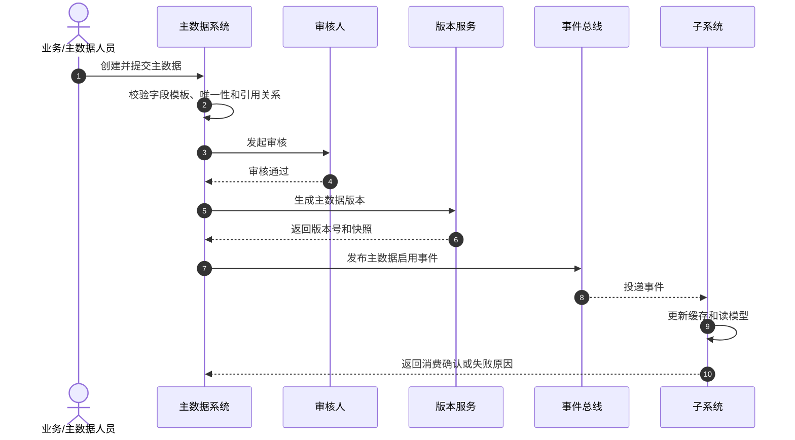

### 17.2 主数据关键变更

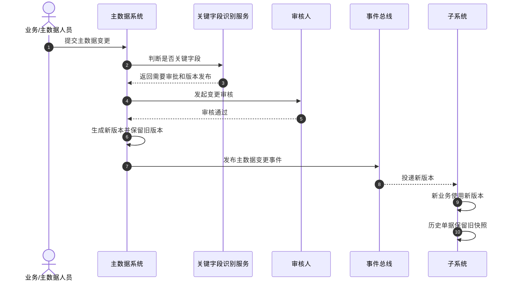

## 18. 查漏补缺说明

| 检查项  | 补充口径                                                                                               |
| ---- | -------------------------------------------------------------------------------------------------- |
| 上游前置 | 新业务上线前必须先完成商品、供应商、客户、货主、仓库、库位、物流商、组织、税率、币种、单位和地址等基础资料建档                                            |
| 核心边界 | 主数据系统拥有编码、状态、版本、发布和停用口径；业务系统拥有业务单据和业务事实；子系统缓存主数据但不能绕过主数据自造权威口径                                     |
| 关键事件 | 主数据草稿已创建、主数据已提交审核、主数据已启用、主数据已变更、主数据已停用、主数据已发布、主数据发布失败、子系统已消费                                       |
| 业务影响 | SKU 影响采购、销售、仓储、库存和计费；供应商影响采购和退供；仓库库位影响 WMS 和库存；物流商/物流产品影响 TMS 下单、轨迹、签收和费用；客户/货主影响 OMS、库存隔离和 BMS 计费 |
| 版本规则 | 历史业务单据保留创建时的主数据快照；新业务引用最新有效版本；高风险字段变更需要审批和发布版本                                                     |
| 停用规则 | 停用前必须检查未完成订单、在途运输、库存余额、未结费用和未关闭账单；有未完业务时进入停用中或禁止停用                                                 |
| 分发规则 | 事件推送保证及时性，API 拉取用于初始化和补偿，本地缓存用于高频查询；消费失败必须支持重放                                                     |
| 幂等规则 | 启用、变更、停用、发布、消费都按主数据编码 + 版本号 + 发布事件号幂等                                                              |
| 权限审计 | 建档、审核、启用、停用、字段模板修改、批量导入、合并、发布重试必须记录操作日志和前后值                                                        |

## 19. 领域驱动设计对齐说明

| 领域驱动设计项 | 对齐口径 |
| --- | --- |
| 限界上下文 | 主数据上下文 |
| 子域类型 | 核心域：类型、字段模板、记录、版本、发布；支撑域：数据质量；通用域：审批、权限、导入导出 |
| 核心聚合 | 主数据类型、字段模板、编码规则、主数据记录、主数据版本、发布订阅、导入任务、数据质量问题 |
| 数据主权 | 主数据系统拥有基础资料编码、字段、状态、版本、发布语言；子系统只缓存和引用 |
| 命令 | 创建、编辑、提交审核、审核通过、驳回、启用、变更、冻结、解冻、停用、淘汰、发布、重试发布、导入、治理 |
| 生产事件 | `SkuEnabled`、`SupplierEnabled`、`CustomerEnabled`、`OwnerEnabled`、`WarehouseEnabled`、`LocationChanged`、`CarrierEnabled`、`MasterDataChanged`、`MasterDataDisabled` |
| 消费事件 | 审批结果、联调结果、数据质量结果、外部系统资料导入结果 |
| 查询模型 | 主数据列表、审核待办、版本对比、发布日志、消费状态、数据质量看板 |
| 异常补偿 | 发布失败重试、消费失败重放、停用前依赖检查、重复主数据合并、关键字段兼容策略 |

## 20. 当前结论与待决问题

当前结论：主数据系统是供应链系统的上游发布语言，第一版必须把商品、供应商、客户、货主、仓库、库位、物流商、地址、单位、税率、组织这些资料纳入统一生命周期。业务系统可以缓存主数据，但新增业务引用必须基于已启用且版本有效的主数据。

关键假设：当前系统支持多仓、多货主、供应商协同、OMS 履约、WMS 作业、中央库存和 BMS 计费；暂不强制事件溯源，采用当前状态表 + 版本表 + 发布日志 + 消费日志。

待决问题：

| 问题                 | 当前建议                                                    |
| ------------------ | ------------------------------------------------------- |
| 客户与货主是否合并建模        | 业务上区分，技术上可共用主体表 + 类型；货主必须单独支持库存和计费隔离                    |
| 仓库是否管理到巷道/货架/层     | 第一版库位编码承载，后续仓储复杂度提升再独立建模                                |
| 物流商是否由主数据还是 TMS 维护 | 主数据拥有档案、物流产品、服务区域和发布口径；TMS 拥有运输任务、运单、面单、轨迹、签收、异常和物流费用来源 |
| 单位换算变更如何处理历史库存     | 历史库存保留原单位快照；高风险变更建议新版本或新 SKU，并做库存换算补偿                   |
| 主数据发布失败如何保证一致      | Outbox/Inbox + 版本号 + 补偿拉取 + 发布失败看板                      |
