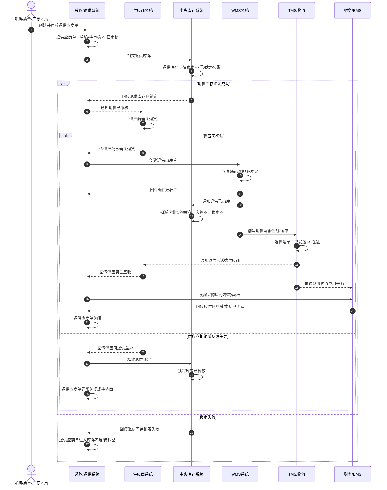

# 01-供应商退货业务流程

> 本文只分析企业向供应商退货业务，不引入领域驱动设计术语。目标是先把“为什么退供应商、谁发起、哪些系统参与、库存如何锁定和扣减、供应商如何确认、财务如何冲减应付”讲清楚，方便后续再做字段、接口、状态机和系统功能设计。

## 1. 流程目标

供应商退货的目标是：企业把验收不合格、库存不良、滞销可退、供应商召回或售后质检可退供的商品退回供应商，并完成库存扣减、供应商签收、应付冲减、索赔或扣款。

```text
创建退供申请 -> 审核退供单 -> 锁定待退库存 -> 供应商确认 -> 仓库退供出库 -> 供应商签收 -> 应付冲减/索赔 -> 退供关闭
```

供应商退货不是创建退供单就扣库存。只有 WMS 实际退供出库后，企业库存才减少；供应商签收和对账后，财务才进行应付冲减、索赔或扣款。

## 2. 业务范围

本文包含：

1. 因采购验收不合格、库存不良、滞销退供、供应商召回、售后可退供创建退供应商单。
2. 采购/质量/库存人员审核退供原因、供应商、SKU、批次和数量。
3. 中央库存校验并锁定待退库存。
4. 供应商确认退货数量、责任、退货地址和处理方式。
5. WMS 退供出库、拣货、复核、打包、交接。
6. TMS 退供运输和供应商签收。
7. 财务应付冲减、红字发票、索赔、扣款和退供对账。
8. 供应商拒绝、库存不足、退供出库缺货、供应商拒收、运输丢失破损等异常。

本文不展开：

1. 供应商质量评分算法。
2. 采购合同中的退货条款细节。
3. 红字发票税务细节。
4. 索赔法律流程。
5. 数据库表结构。

## 3. 参与系统

| 系统 | 参与原因 | 主要处理内容 | 主要数据变化 |
| --- | --- | --- | --- |
| 采购系统 | 管理退供应商申请 | 创建退供单、审核退供、关联原采购订单、跟踪供应商确认和退供关闭 | 退供应商单、退供明细、退供状态 |
| 01-供应商系统/SRM | 供应商协同 | 供应商接收退货通知、确认数量、责任、地址、签收或拒收 | 供应商确认、签收记录、差异反馈 |
| WMS 系统 | 仓库退供出库执行 | 创建退供出库单、分配库位、拣货、复核、打包、发货交接 | 退供出库单、拣货任务、复核记录、发货记录 |
| 中央库存系统 | 控制待退库存和库存扣减 | 校验可退库存、锁定库存、退供出库后扣减库存、记录流水 | 库存锁定、库存余额、库存流水 |
| TMS/物流系统 | 退供运输 | 创建退供运输任务和运单，跟踪在途、到达、供应商签收、拒收、破损、丢失，并生成物流费用来源 | 运输任务、运单、物流轨迹、签收记录、物流异常、物流费用来源 |
| BMS/财务系统 | 应付冲减和索赔 | 生成采购应付冲减、红字发票、索赔、扣款、退供对账，并根据 TMS 物流费用来源生成退供运费 | 应付冲减、索赔单、物流费用、费用明细、对账状态 |
| 主数据系统 | 提供基础资料 | 提供供应商、SKU、仓库、批次、质检结果、退供原因等资料 | 主数据通常只被引用或快照 |
| 权限系统 | 控制操作范围 | 校验采购、质量、仓库、财务和供应商人员权限 | 操作日志、审计记录 |

## 4. 参与角色

| 角色 | 所属方 | 主要动作 | 使用系统 |
| --- | --- | --- | --- |
| 采购员 | 企业 | 创建退供应商单，和供应商沟通退货 | 采购系统、供应商系统 |
| 质量人员 | 企业 | 确认不合格原因、责任方、质检证据 | 采购系统、WMS 系统 |
| 库存管理员 | 企业 | 确认待退库存状态和批次，处理库存锁定异常 | 中央库存系统 |
| 采购主管/质量主管 | 企业 | 审核退供申请和异常处理方案 | 采购系统 |
| 供应商业务员 | 供应商 | 确认退货数量、地址、责任、签收结果 | 01-供应商系统/SRM |
| 仓库主管 | 企业仓库 | 安排退供出库作业 | WMS 系统 |
| 拣货员 | 企业仓库 | 从指定库位拣出待退商品 | WMS 系统、PDA |
| 复核员 | 企业仓库 | 复核 SKU、数量、批次、供应商、箱号 | WMS 系统 |
| 发货员 | 企业仓库 | 打包贴标、物流交接、确认退供出库 | WMS 系统、TMS |
| 物流专员/承运商 | 企业或物流商 | 创建退供运输任务，回传轨迹和签收 | TMS/物流系统 |
| 财务/结算专员 | 企业 | 做应付冲减、红字发票、索赔、扣款和对账 | BMS/财务系统 |

## 5. 关键业务数据

| 数据对象 | 谁创建 | 谁修改 | 关键字段 | 主要状态 |
| --- | --- | --- | --- | --- |
| 退供应商单 | 采购员/质量人员/系统 | 采购、质量、供应商、系统 | 退供单号、供应商、来源单据、SKU、批次、数量、原因、责任方 | 草稿、待审核、已审核、已驳回、已锁定、待供应商确认、待出库、已出库、已签收、已关闭 |
| 退供明细 | 采购员/系统 | 采购、WMS、系统 | SKU、批次、应退数量、实退数量、签收数量、差异数量 | 待处理、已锁定、部分出库、已出库、已签收、差异待处理 |
| 供应商确认 | 供应商业务员 | 供应商业务员、采购员 | 确认数量、退货地址、责任结论、差异原因 | 待确认、已确认、差异待处理、已拒绝 |
| 退供库存锁定 | 中央库存系统 | 中央库存系统 | 锁定单号、退供单号、仓库、SKU、批次、锁定数量 | 待锁定、已锁定、已释放、已扣减、失败 |
| 退供出库单 | WMS | 仓库作业人员 | 出库单号、退供单号、供应商、仓库、SKU、应发数量、实发数量 | 待分配、待拣货、待复核、待发货、已发货、异常 |
| 拣货任务 | WMS | 拣货员 | 库区库位、SKU、批次、应拣数量、实拣数量 | 待拣货、拣货中、已完成、短拣、异常 |
| 复核记录 | 复核员 | 复核员 | SKU、批次、数量、箱号、复核结果、异常原因 | 待复核、通过、异常 |
| 运输任务/运单 | TMS/物流系统 | 物流专员、承运商 | 运单号、发货仓、供应商地址、承运商、预计到达、签收时间、轨迹、异常原因 | 待发运、已发运、在途、已到达、已签收、拒收、异常 |
| 物流费用来源 | TMS | TMS、BMS | 退供单号、运单号、承运商、物流产品、重量、体积、费用项、责任方 | 待采集、已采集、已推送、已计费、差异 |
| 库存余额 | 中央库存系统 | 中央库存系统 | 仓库、SKU、批次、库存状态、锁定数量、可用数量 | 锁定增加、出库后库存减少 |
| 库存流水 | 中央库存系统 | 中央库存系统 | 来源退供单、来源出库单、变动类型、数量、变动前后数量 | 已记录 |
| 应付冲减/索赔单 | BMS/财务系统 | 财务/结算专员 | 供应商、退供单、采购订单、冲减金额、索赔金额、发票信息 | 待生成、已生成、待对账、已确认、已完成 |

## 6. 主流程

```mermaid
flowchart LR
  A["采购/质量/库存创建退供应商单"] --> B["确认供应商、SKU、批次、数量、原因和责任"]
  B --> C["采购主管/质量主管审核退供单"]
  C --> D{"审核通过？"}
  D -- "否" --> D1["退供单驳回或取消"]
  D -- "是" --> E["中央库存校验可退库存"]
  E --> F{"库存可退？"}
  F -- "否" --> F1["锁定失败：改数量/换批次/转异常处理"]
  F -- "是" --> G["中央库存锁定退供库存"]
  G --> H["供应商接收退货通知"]
  H --> I["供应商确认数量、责任和退货地址"]
  I --> J{"供应商接受？"}
  J -- "否" --> J1["供应商差异反馈，采购重新协商或取消"]
  J -- "是" --> K["WMS 创建退供出库单"]
  K --> L["WMS 分配库位和批次"]
  L --> M{"分配成功？"}
  M -- "否" --> M1["分配异常：重新分配或释放锁定"]
  M -- "是" --> N["拣货员拣出待退商品"]
  N --> O{"是否短拣？"}
  O -- "是" --> O1["记录短拣，调整实退数量或补拣"]
  O -- "否" --> P["复核员复核 SKU/数量/批次"]
  O1 --> P
  P --> Q{"复核通过？"}
  Q -- "否" --> Q1["复核异常，回退拣货或调整"]
  Q -- "是" --> R["打包贴退供标签并物流交接"]
  R --> S["WMS 确认退供出库"]
  S --> T["中央库存扣减企业库存并记录流水"]
  S --> U["TMS 创建退供运输任务并跟踪在途"]
  U --> V{"供应商是否签收？"}
  V -- "拒收/异常" --> V1["记录拒收、破损、丢失或差异"]
  V -- "签收" --> W["01-供应商系统回传签收"]
  U --> U1["TMS 生成退供物流费用来源"]
  W --> X["BMS/财务生成应付冲减、红字发票、索赔或扣款"]
  U1 --> X
  X --> Y["退供对账完成"]
  Y --> Z["退供应商单关闭"]
```



## 7. 分步骤数据变化

| 步骤 | 发起角色/系统 | 处理系统 | 被修改的数据 | 数据如何变化 |
| --- | --- | --- | --- | --- |
| 创建退供单 | 采购/质量/库存 | 采购系统 | 退供应商单、退供明细 | 新增退供单，记录供应商、SKU、批次、数量、原因和责任 |
| 审核退供单 | 采购主管/质量主管 | 采购系统 | 退供应商单 | 待审核变为已审核；驳回则变为已驳回 |
| 校验可退库存 | 系统自动 | 中央库存系统 | 库存余额 | 查询库存状态、批次和可退数量，不直接扣减 |
| 锁定退供库存 | 系统自动 | 中央库存系统 | 退供库存锁定、库存余额、库存流水 | 待退库存被锁定，防止继续销售、调拨或消耗 |
| 供应商确认 | 供应商业务员 | 01-供应商系统/SRM、采购系统 | 供应商确认、退供应商单 | 接受则进入待出库；拒绝或差异则进入差异待处理 |
| 创建退供出库单 | 系统自动/仓库主管 | WMS | 退供出库单 | 新增出库单，状态为待分配 |
| 分配库位批次 | WMS | WMS | 分配明细、退供出库单 | 指定从哪些库位、批次拣出待退商品 |
| 拣货 | 拣货员 | WMS | 拣货任务、退供出库单行 | 写入实拣数量，短拣时记录差异 |
| 复核 | 复核员 | WMS | 复核记录、退供出库单 | 核对 SKU、数量、批次、供应商和箱号 |
| 打包发货 | 发货员 | WMS、TMS | 装箱记录、发货记录、运输任务、运单 | 记录箱号、重量、承运商、运单号，出库单变为已发货，TMS 运单进入已发运 |
| 库存扣减 | 系统自动 | 中央库存系统 | 库存余额、库存流水、退供库存锁定 | 锁定库存转扣减，企业库存减少，生成退供出库流水 |
| 运输跟踪 | 物流专员/承运商 | TMS/物流系统 | 运输任务、轨迹记录 | 更新发运、在途、签收、拒收、破损、丢失等状态 |
| 供应商签收 | 供应商业务员/物流/TMS | TMS、供应商系统、采购系统 | 签收记录、退供应商单 | 记录签收数量、签收时间、拒收或差异 |
| 物流费用采集 | TMS/BMS | BMS/财务系统 | 物流费用来源、费用明细 | 根据退供运单、责任方、重量体积、物流产品生成退供物流费用或索赔依据 |
| 财务处理 | 财务/结算专员 | BMS/财务系统 | 应付冲减、索赔单、红字发票、对账单 | 根据退供事实和物流费用来源生成冲减、索赔、扣款或对账 |
| 关闭退供单 | 系统自动/采购 | 采购系统 | 退供应商单 | 出库、签收、差异和财务处理完成后关闭 |

## 8. 库存变化过程

| 业务节点 | 可用库存 | 不可售/冻结库存 | 退供锁定 | 企业实物库存 | 说明 |
| --- | --- | --- | --- | --- | --- |
| 创建退供单 | 不变 | 不变 | 不变 | 不变 | 申请不影响库存 |
| 退供审核通过 | 不变 | 不变 | 不变 | 不变 | 审核只是业务批准 |
| 锁定退供库存 | 减少或冻结 | 可从不可售转锁定 | 增加 | 不变 | 防止待退商品被其他业务占用 |
| 退供出库完成 | 不变 | 减少 | 减少 | 减少 | 商品离开企业仓库，库存扣减 |
| 供应商签收 | 不变 | 不变 | 不变 | 不变 | 不再改变库存，主要影响退供状态和财务 |
| 供应商拒收退回 | 视重新入库结果增加 | 视质检结果增加 | 不变 | 退回入库后增加 | 需要走退回入库或异常处理 |
| 运输丢失/破损 | 不变 | 不变 | 不变 | 已减少 | 走索赔、报损或异常关闭 |
| 取消未出库退供 | 恢复 | 恢复 | 减少 | 不变 | 释放退供库存锁定 |

## 9. 关键数据状态变化

| 数据对象 | 典型状态变化 | 业务含义 |
| --- | --- | --- |
| 退供应商单 | 草稿 -> 待审核 -> 已审核 -> 已锁定 -> 待供应商确认 -> 待出库 -> 已出库 -> 已签收 -> 已关闭/异常关闭 | 退供从申请到完成 |
| 退供明细 | 待处理 -> 已锁定 -> 部分出库/已出库 -> 已签收/差异待处理 | 每个 SKU 的退供进度 |
| 供应商确认 | 待确认 -> 已确认/差异待处理/已拒绝 | 供应商是否接受退货 |
| 退供库存锁定 | 待锁定 -> 已锁定 -> 已扣减/已释放 | 待退库存先锁定，出库后扣减，取消时释放 |
| 退供出库单 | 待分配 -> 待拣货 -> 待复核 -> 待发货 -> 已发货/异常 | WMS 退供出库执行过程 |
| 运输任务 | 待发运 -> 已发运 -> 在途 -> 已到达 -> 已签收/拒收/异常 | 退供运输过程 |
| 物流费用来源 | 待采集 -> 已采集 -> 已推送 -> 已计费/差异 | TMS 将退供运输事实转为 BMS 计费或索赔依据 |
| 库存余额 | 锁定增加 -> 企业库存扣减 | 待退商品从企业库存中移出 |
| 应付冲减/索赔单 | 待生成 -> 已生成 -> 待对账 -> 已确认/已完成 | 财务根据退供事实处理结算 |

## 10. 异常场景

| 异常 | 发生位置 | 影响数据 | 处理方式 |
| --- | --- | --- | --- |
| 退供审核驳回 | 采购系统 | 退供应商单 | 修改后重新提交，或取消退供 |
| 可退库存不足 | 中央库存系统 | 退供库存锁定、退供明细 | 改数量、换批次、等待库存处理或取消 |
| 库存锁定失败 | 中央库存系统 | 退供单、库存余额 | 查明库存状态，释放异常占用或转人工处理 |
| 供应商拒绝退货 | 01-供应商系统/SRM | 供应商确认、退供单 | 采购重新协商、取消退供、转索赔或内部处理 |
| 供应商确认差异 | 01-供应商系统/SRM | 供应商确认、退供明细 | 调整数量、责任、地址或退供价格 |
| 出库分配失败 | WMS | 退供出库单、分配明细 | 重新分配、盘点、释放锁定或人工处理 |
| 退供短拣 | WMS | 拣货任务、退供明细 | 按实发退供，差异部分释放锁定或补拣 |
| 复核异常 | WMS | 复核记录、退供出库单 | 回退拣货或调整，禁止直接发货 |
| 运输丢失 | TMS/物流系统 | 运输任务、退供单、索赔单 | 走物流索赔、报损或异常关闭 |
| 运输破损 | TMS/供应商 | 签收记录、差异记录 | 按供应商签收结果处理索赔、扣款或争议 |
| 供应商拒收 | 01-供应商系统/SRM | 签收记录、退供单 | 退回企业重新入库、重新协商、索赔或异常关闭 |
| 退供物流费用差异 | TMS/BMS | 物流费用来源、费用明细 | BMS 标记差异，TMS 和承运商对账后调整 |
| 应付冲减失败 | BMS/财务系统 | 应付冲减、对账单 | 重试生成、人工补录或财务调整 |
| 重复扣减库存 | 中央库存系统 | 库存余额、库存流水 | 按退供出库单和事件编号幂等 |

## 11. 业务理解要点

1. 退供应商单创建和审核都不扣库存，只表示业务上允许退供。
2. 退供前必须锁定库存，避免待退商品继续被销售、调拨或其他业务占用。
3. 只有 WMS 确认退供出库后，企业实物库存才减少。
4. 供应商签收主要影响退供闭环和财务结算，不应再重复扣减库存。
5. TMS 负责退供运输事实，01-供应商系统负责供应商确认和签收协同；两者要通过退供单号和运单号关联。
6. 供应商拒收、运输丢失、运输破损不能简单恢复库存，要按实物是否返回和责任归属处理。
7. 退供通常会影响供应商质量、采购应付、物流费用、索赔扣款和供应商评分。

## 12. 供应商退货时序图



### 12.1 供应商退货动作链

| 顺序 | 动作 | 来源 | 目标 | 主要数据变化 | 幂等依据 |
| --- | --- | --- | --- | --- | --- |
| 1 | 审核退供应商单 | 采购/质量 | 采购/退供系统 | 退供应商单：待审核 -> 已审核 | 退供单号 + 审核请求号 |
| 2 | 锁定退供库存 | 采购/退供系统 | 中央库存系统 | 退供库存：待锁定 -> 已锁定 | 退供单号 + 行号 + SKU + 仓库 |
| 3 | 创建退供出库单 | 采购/退供系统 | WMS | 退供出库单：无 -> 待分配 | 退供出库单号 |
| 4 | 回传退供已出库 | WMS | 采购/退供系统、中央库存、TMS、BMS | 退供应商单：待出库 -> 已出库 | 退供出库事件号 |
| 5 | 扣减企业库存 | WMS/库存系统 | 中央库存系统 | 企业实物库存减少，退供锁定减少 | 退供出库事件号 |
| 6 | 创建退供运输任务 | WMS/采购/退供系统 | TMS、供应商系统、BMS | 运单：无 -> 已发运/在途 | 退供单号 + 运单号 |
| 7 | 回传供应商签收/拒收 | TMS/01-供应商系统 | 采购/退供系统、BMS | 退供应商单：已出库 -> 已签收/异常 | 运单号 + 签收事件号 |
| 8 | 回传应付已冲减/索赔已确认 | 财务/BMS | 采购/退供系统 | 退供应商单：待结算 -> 已关闭 | 退供结算事件号 |

## 13. 业务规则与协同边界

| 检查项 | 设计口径 |
| ---- | -------------------------------------------------------------------------------------- |
| 上游前置 | 供应商、SKU、采购订单或质检来源、不合格库存、退供原因、供应商退货地址和物流产品必须可用                                          |
| 核心边界 | 采购/退供系统负责退供申请、审核、协商和关闭；01-供应商系统负责确认和签收协同；WMS 负责退供出库；中央库存负责锁定和扣减；TMS 负责运输；BMS 负责应付冲减、索赔和运费 |
| 关键事件 | 退供单已审核、退供库存已锁定、供应商已确认、退供已出库、库存已扣减、退供运输已发运、供应商已签收/拒收、应付已冲减、退供物流费用来源已生成                  |
| 库存规则 | 审核退供不扣库存；锁定只冻结可退库存；WMS 退供出库后中央库存才扣减；供应商签收不再重复扣减                                        |
| 拒收规则 | 供应商拒收后不能简单恢复库存，必须根据实物是否退回企业、是否破损、责任方和质检结果决定重新入库、报损、索赔或异常关闭                             |
| 费用规则 | 退供可能产生退供运费、索赔、扣款、红字发票或应付冲减，BMS 要能区分供应商责任和企业责任                                          |
| 幂等规则 | 库存锁定、退供出库、库存扣减、运单创建、签收回传、应付冲减、费用生成必须按退供单/出库单/运单/事件号幂等                                  |
| 权限审计 | 退供审核、供应商差异确认、强制出库、拒收处理、索赔确认、应付冲减和异常关闭必须审计                                              |
