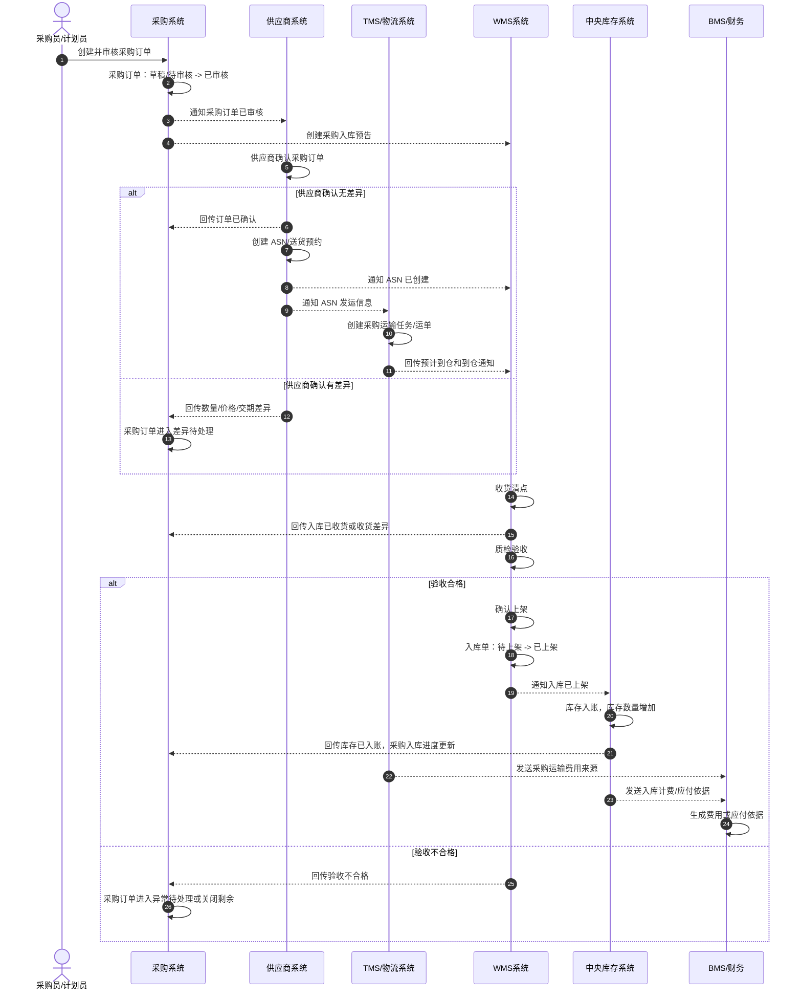

# 03-1 采购入库业务流程

> 本文只分析采购入库业务，不引入领域驱动设计术语。目标是先把“谁参与、哪个系统处理、哪些数据变化、业务如何流转、异常如何处理”讲清楚，方便后续再做字段、接口、状态机和系统功能设计。

## 1. 流程目标

采购入库的目标是：企业向供应商采购商品，供应商按约定送货到仓库，仓库完成收货、质检、上架，系统最终增加库存，并形成后续供应商对账、付款和仓储计费依据。

```text
采购下单 -> 供应商确认 -> 供应商送货 -> 仓库收货质检 -> 合格品上架 -> 库存增加 -> 形成结算依据
```

## 2. 参与系统

| 系统 | 参与原因 | 主要处理内容 | 主要数据变化 |
| --- | --- | --- | --- |
| 主数据系统 | 采购和入库依赖基础资料 | 提供 SKU、供应商、仓库、库区库位、单位、税率等资料 | 主数据一般不在本流程中修改，只被引用或快照 |
| 采购系统 | 管理采购需求和采购订单 | 创建采购申请、审核采购申请、创建采购订单、审核采购订单、跟踪入库进度 | 采购申请、采购订单、采购订单行、入库进度 |
| 供应商系统 | 供应商协同 | 接收采购订单、确认数量/价格/交期、创建送货预约或 ASN | 订单确认、送货预约、ASN、供应商发货信息 |
| TMS/物流系统 | 采购运输跟踪 | 根据 ASN 或供应商发货信息创建运输任务、记录承运商、运单、在途、到仓和异常 | 采购运输任务、运单、物流轨迹、到仓通知、运输异常 |
| WMS 系统 | 仓库执行 | 创建入库单、到货登记、收货清点、质检、生成上架任务、确认上架 | 入库单、收货记录、质检记录、上架任务、库内库存 |
| 中央库存系统 | 统一库存账本 | 根据 WMS 上架结果增加库存，记录库存流水 | 库存余额、可用库存、库存流水 |
| BMS/财务系统 | 费用和应付依据 | 根据入库、上架、采购价格和 TMS 采购运输费用来源生成费用或应付依据 | 费用明细、应付依据、采购运输费、对账状态 |
| 权限系统 | 控制人员操作范围 | 校验采购、供应商、仓库人员是否有操作权限 | 操作日志、审计记录 |

## 3. 参与角色

| 角色 | 所属方 | 主要动作 | 使用系统 |
| --- | --- | --- | --- |
| 采购员 | 企业 | 创建采购申请、创建采购订单、处理供应商确认差异、跟踪入库 | 采购系统 |
| 采购主管 | 企业 | 审核采购申请、审核采购订单、审批异常处理 | 采购系统 |
| 供应商业务员 | 供应商 | 确认采购订单、反馈交期、创建 ASN、填写发货信息 | 供应商系统 |
| 物流专员/承运商 | 企业或物流商 | 接收 ASN 发运信息、创建运单、跟踪在途、回传到仓或异常 | TMS/物流系统 |
| 仓库收货员 | 企业仓库 | 到货登记、核对单据、收货清点 | WMS 系统 |
| 质检员 | 企业仓库或质检部门 | 对到货商品做质量验收，记录合格和不合格数量 | WMS 系统 |
| 上架员 | 企业仓库 | 按系统推荐库位或人工指定库位完成上架 | WMS 系统 |
| 库存管理员 | 企业 | 查看库存入账结果，处理库存异常 | 中央库存系统、WMS 系统 |
| 财务/结算专员 | 企业 | 查看入库应付依据，进行供应商对账 | BMS/财务系统 |

## 4. 关键业务数据

| 数据对象 | 谁创建 | 谁修改 | 关键字段 | 主要状态 |
| --- | --- | --- | --- | --- |
| 采购申请 | 采购员 | 采购员、采购主管 | 申请单号、申请人、SKU、数量、期望到货日期、申请原因 | 草稿、待审核、已审核、已驳回、已取消 |
| 采购订单 | 采购员 | 采购员、采购主管 | 采购订单号、供应商、采购仓、SKU、采购数量、采购价、税率、交期 | 草稿、待审核、已审核、待供应商确认、已确认、部分入库、已入库、已关闭 |
| 订单确认 | 供应商 | 供应商、采购员 | 确认数量、确认价格、确认交期、差异原因 | 待确认、已确认、差异待处理、已拒绝 |
| ASN/送货预约 | 供应商 | 供应商、WMS | ASN 号、采购订单号、预计到货时间、发货数量、箱数、物流信息 | 草稿、已提交、已预约、已到货、已取消 |
| 采购运输任务/运单 | TMS/物流系统 | TMS、承运商 | 运单号、ASN 号、采购订单号、发货地址、收货仓、承运商、预计到仓、轨迹 | 待发运、已发运、在途、已到仓、异常 |
| 入库单 | WMS | 收货员、质检员、上架员 | 入库单号、来源单号、供应商、仓库、SKU、应收数量、实收数量、合格数量、不合格数量 | 待收货、收货中、待质检、待上架、已上架、异常待处理 |
| 收货记录 | 收货员 | 收货员 | 到货时间、实收数量、包装情况、差异原因 | 已记录、已确认 |
| 质检记录 | 质检员 | 质检员 | 检验数量、合格数量、不合格数量、不合格原因、处理方式 | 待质检、合格、不合格、部分合格 |
| 上架任务 | WMS | 上架员 | 推荐库位、实际上架库位、上架数量、容器、批次 | 待上架、上架中、已完成、异常 |
| 库存余额 | 中央库存系统 | 中央库存系统 | SKU、仓库、库位或库存维度、批次、库存数量、可用数量 | 数量增加 |
| 库存流水 | 中央库存系统 | 中央库存系统 | 来源单据、来源行、变动类型、变动数量、变动前后数量 | 已记录 |
| 物流费用来源 | TMS | TMS、BMS | ASN、采购订单、运单号、物流商、物流产品、重量、体积、费用项、责任方 | 待采集、已采集、已推送、已计费、差异 |
| 费用明细/应付依据 | BMS/财务系统 | 财务/结算专员 | 供应商、采购订单、入库单、计费项、金额、税率 | 待生成、已生成、待对账、已确认 |

## 5. 主流程

```mermaid
flowchart LR
  A["采购员创建采购申请"] --> B["采购主管审核采购申请"]
  B --> C{"审核通过？"}
  C -- "否" --> C1["采购申请驳回或取消"]
  C -- "是" --> D["采购员创建采购订单"]
  D --> E["采购主管审核采购订单"]
  E --> F{"采购订单通过？"}
  F -- "否" --> D
  F -- "是" --> G["供应商接收采购订单"]
  G --> H["供应商确认数量/价格/交期"]
  H --> I{"是否有确认差异？"}
  I -- "有差异" --> I1["采购员处理差异：改单/重新确认/取消"]
  I1 --> D
  I -- "无差异" --> J["供应商创建 ASN 或送货预约"]
  J --> K["TMS 创建采购运输任务/运单"]
  K --> K1["供应商发货，TMS 跟踪在途"]
  K1 --> K2{"运输是否异常？"}
  K2 -- "异常" --> K3["记录延误/破损/丢失，通知采购和仓库"]
  K2 -- "正常到仓" --> L["WMS 到货登记"]
  K3 --> L
  L --> M["收货员清点实收数量"]
  M --> N{"实收是否异常？"}
  N -- "异常" --> N1["记录少到/多到/错货/破损"]
  N1 --> O["质检员验收"]
  N -- "正常" --> O
  O --> P{"质检是否合格？"}
  P -- "不合格" --> P1["放入不合格区，等待退供或异常处理"]
  P -- "合格/部分合格" --> Q["WMS 生成上架任务"]
  Q --> R["上架员确认上架"]
  R --> S["中央库存入账，库存增加"]
  S --> T["采购订单更新入库进度"]
  K1 --> U["TMS 生成采购运输费用来源"]
  R --> U1["BMS/财务生成费用或应付依据"]
  U --> U1
```



## 6. 分步骤数据变化

| 步骤 | 发起角色/系统 | 处理系统 | 被修改的数据 | 数据如何变化 |
| --- | --- | --- | --- | --- |
| 创建采购申请 | 采购员 | 采购系统 | 采购申请 | 新增采购申请，状态为草稿或待审核 |
| 审核采购申请 | 采购主管 | 采购系统 | 采购申请 | 待审核变为已审核；驳回则变为已驳回 |
| 创建采购订单 | 采购员 | 采购系统 | 采购订单、采购订单行 | 新增采购订单，记录供应商、SKU、数量、价格、交期 |
| 审核采购订单 | 采购主管 | 采购系统 | 采购订单 | 待审核变为已审核；通过后可通知供应商 |
| 供应商确认订单 | 供应商业务员 | 供应商系统 | 订单确认、采购订单确认状态 | 无差异则变为已确认；有差异则变为差异待处理 |
| 创建 ASN | 供应商业务员 | 供应商系统 | ASN、发货信息 | 新增 ASN，记录预计到货时间、发货数量、箱数、物流信息 |
| 创建采购运输任务 | 供应商/TMS | TMS/物流系统 | 采购运输任务、运单 | 根据 ASN 创建运单，记录承运商、发货地址、收货仓和预计到仓时间 |
| 运输在途跟踪 | 承运商/TMS | TMS/物流系统 | 运单、物流轨迹 | 更新已发运、在途、到仓、延误、破损、丢失等状态 |
| 到货登记 | 收货员 | WMS | 入库单、到货记录 | 入库单进入待收货或收货中，记录实际到货时间 |
| 收货清点 | 收货员 | WMS | 入库单行、收货记录 | 写入实收数量；差异时记录少到、多到、错货、破损 |
| 质检验收 | 质检员 | WMS | 质检记录、入库单行 | 写入合格数量、不合格数量、不合格原因 |
| 生成上架任务 | WMS | WMS | 上架任务、库位建议 | 根据仓库规则生成目标库区库位和上架数量 |
| 确认上架 | 上架员 | WMS | 上架任务、入库单、库内库存 | 上架任务完成，入库单变为已上架或部分上架 |
| 库存入账 | 中央库存系统 | 中央库存系统 | 库存余额、库存流水 | 合格上架数量增加库存，生成入库流水 |
| 更新采购入库进度 | 系统自动 | 采购系统 | 采购订单、采购订单行 | 更新已入库数量、未入库数量，必要时变为部分入库或已入库 |
| 采集采购运输费用 | TMS/BMS | BMS/财务系统 | 物流费用来源、费用明细 | 根据采购运单、物流商、物流产品、重量体积和责任方生成运输费用 |
| 生成费用/应付依据 | WMS/TMS/BMS | BMS/财务系统 | 费用明细、应付依据 | 根据入库事实、采购价格、仓储作业费用或采购运输费用生成待对账数据 |

## 7. 关键数据状态变化

| 数据对象 | 典型状态变化 | 业务含义 |
| --- | --- | --- |
| 采购申请 | 草稿 -> 待审核 -> 已审核 | 采购需求被批准，可以进入采购下单 |
| 采购订单 | 草稿 -> 待审核 -> 已审核 -> 已确认 -> 部分入库 -> 已入库 -> 已关闭 | 企业和供应商之间的采购约定逐步被履行 |
| ASN | 草稿 -> 已提交 -> 已预约 -> 已到货 | 供应商已经计划或实际送货到仓 |
| 采购运输任务/运单 | 待发运 -> 已发运 -> 在途 -> 已到仓/异常 | 供应商发货后的运输状态由 TMS 负责 |
| 入库单 | 待收货 -> 收货中 -> 待质检 -> 待上架 -> 已上架 | 仓库完成从到货到商品放入库位的执行过程 |
| 质检记录 | 待质检 -> 合格/不合格/部分合格 | 判断商品能否进入可用库存 |
| 上架任务 | 待上架 -> 上架中 -> 已完成 | 商品从收货暂存区移动到正式库位 |
| 库存余额 | 原库存数量 -> 原库存数量 + 合格上架数量 | 中央库存确认库存增加 |
| 库存流水 | 无 -> 新增入库流水 | 记录库存为什么增加，来源是哪张入库单 |
| 费用明细 | 待生成 -> 已生成 -> 待对账 | 入库事实可以作为仓储计费或供应商应付依据 |
| 物流费用来源 | 待采集 -> 已采集 -> 已推送 -> 已计费/差异 | 采购运输事实可以作为物流费用依据 |

## 8. 异常场景

| 异常 | 发生位置 | 影响数据 | 处理方式 |
| --- | --- | --- | --- |
| 采购订单审核驳回 | 采购系统 | 采购订单状态 | 采购员修改后重新提交，或取消订单 |
| 供应商确认差异 | 供应商系统、采购系统 | 订单确认、采购订单 | 采购员决定接受差异、修改订单、重新确认或取消 |
| 供应商少发 | WMS、采购系统 | ASN、入库单、采购订单入库进度 | 按实收数量入库，剩余数量等待补发或关闭 |
| 供应商多发 | WMS、采购系统 | 入库单、异常记录 | 按业务规则决定让步接收、拒收或补采购单 |
| 采购运输延误 | TMS/物流系统 | 运单、ASN、采购订单到货预期 | 更新预计到仓时间，通知采购、供应商和收货仓 |
| 采购运输破损/丢失 | TMS/WMS/采购系统 | 运单、收货记录、质检记录、采购订单 | 到仓后按实收实检处理；未到仓则进入索赔、补发或采购异常 |
| 错货 | WMS | 收货记录、质检记录 | 暂存异常区，通知采购和供应商处理 |
| 破损 | WMS | 收货记录、质检记录 | 记录破损数量，进入质检或拒收流程 |
| 质检不合格 | WMS、采购系统 | 质检记录、入库单、采购订单 | 不合格品放入不合格区，后续退供应商或让步接收 |
| 上架库位异常 | WMS | 上架任务 | 重新推荐库位或人工指定库位 |
| 库存入账失败 | 中央库存系统 | 库存余额、库存流水 | 重试入账，必要时人工对账补偿 |
| 费用生成失败 | BMS/财务系统 | 费用明细、应付依据 | 重试生成，或由结算人员人工补录 |
| 采购运输费用差异 | TMS/BMS | 物流费用来源、费用明细 | BMS 标记差异，TMS 与承运商对账后调整 |

## 9. 业务理解要点

1. 采购订单只是采购承诺，不代表库存已经增加。
2. 供应商发货也不代表库存增加，只有仓库完成合格品上架后，中央库存才增加。
3. 供应商发货后的运输在途、到仓、延误、破损、丢失由 TMS 负责记录，WMS 只以实际到仓收货为准。
4. 实收数量、合格数量、上架数量可能不同，系统必须分别记录。
5. 不合格品不能进入可用库存，应进入不合格区，后续做退供应商或异常处理。
6. 采购系统关注采购订单履约进度，TMS 关注运输事实，WMS 关注仓库作业事实，中央库存关注库存数量变化，BMS/财务关注结算依据。
7. 所有库存增加都必须有来源单据和库存流水，方便追溯和对账。

## 10. 采购入库时序图



### 10.1 采购入库动作链

| 顺序 | 动作 | 来源 | 目标 | 主要数据变化 | 幂等依据 |
| --- | --- | --- | --- | --- | --- |
| 1 | 审核采购订单 | 采购员 | 采购系统 | 采购订单：待审核 -> 已审核 | 采购订单号 + 审核请求号 |
| 2 | 通知采购订单已审核 | 采购系统 | 供应商系统、WMS | 供应商可确认，WMS 可准备入库 | 采购订单审核事件号 |
| 3 | 创建 ASN | 供应商 | 供应商系统 | ASN：草稿 -> 已提交 | ASN 号 |
| 4 | 通知 ASN 已创建 | 供应商系统 | WMS、采购系统 | WMS 形成到货预期 | ASN 创建事件号 |
| 5 | 创建采购运输任务 | 供应商系统/TMS | TMS/物流系统、WMS | 运单：无 -> 已创建/在途/到仓 | ASN 号 + 运单号 |
| 6 | 确认上架 | 上架员 | WMS | 入库单：待上架 -> 已上架 | 上架任务号 |
| 7 | 库存入账 | WMS/库存系统 | 中央库存系统 | 库存余额增加，生成入库流水 | 入库单号 + 上架任务号 |
| 8 | 采集采购运输费用 | TMS | BMS/财务系统 | 物流费用来源：已采集 -> 已计费/差异 | 运单号 + 费用项 |

## 11. 查漏补缺说明

| 检查项 | 补充口径 |
| --- | --- |
| 上游前置 | SKU、供应商、供应商商品、采购单位、税率、收货仓、库位、物流商和物流产品必须已启用 |
| 核心边界 | 采购系统负责采购订单履约进度；供应商系统负责确认和 ASN；TMS 负责运输事实；WMS 负责收货质检上架；中央库存负责库存入账；BMS 负责费用和应付依据 |
| 关键事件 | 采购订单已审核、供应商已确认、ASN 已创建、采购运输已到仓、入库已收货、入库已质检、入库已上架、库存已入账、采购运输费用来源已生成 |
| 库存规则 | 供应商发货、TMS 到仓、WMS 收货都不增加可用库存；只有合格品上架并由中央库存入账后库存增加 |
| 费用规则 | 采购价格形成应付基础，WMS 入库/上架形成仓储作业费用，TMS 采购运输形成运输费用来源，BMS 汇总生成对账依据 |
| 补偿规则 | 供应商少发关闭剩余或等待补发；多发需让步接收、拒收或补采购；质检不合格进入不合格区并触发退供或异常处理 |
| 幂等规则 | ASN 创建、运单创建、收货、质检、上架、库存入账、费用生成都要按来源单号 + 行号 + 事件号幂等 |
| 权限审计 | 采购审核、差异处理、让步接收、不合格处理、手工入账补偿、费用调整必须记录操作人、原因和前后值 |
