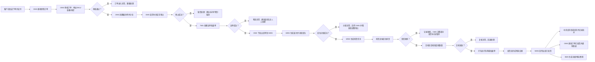
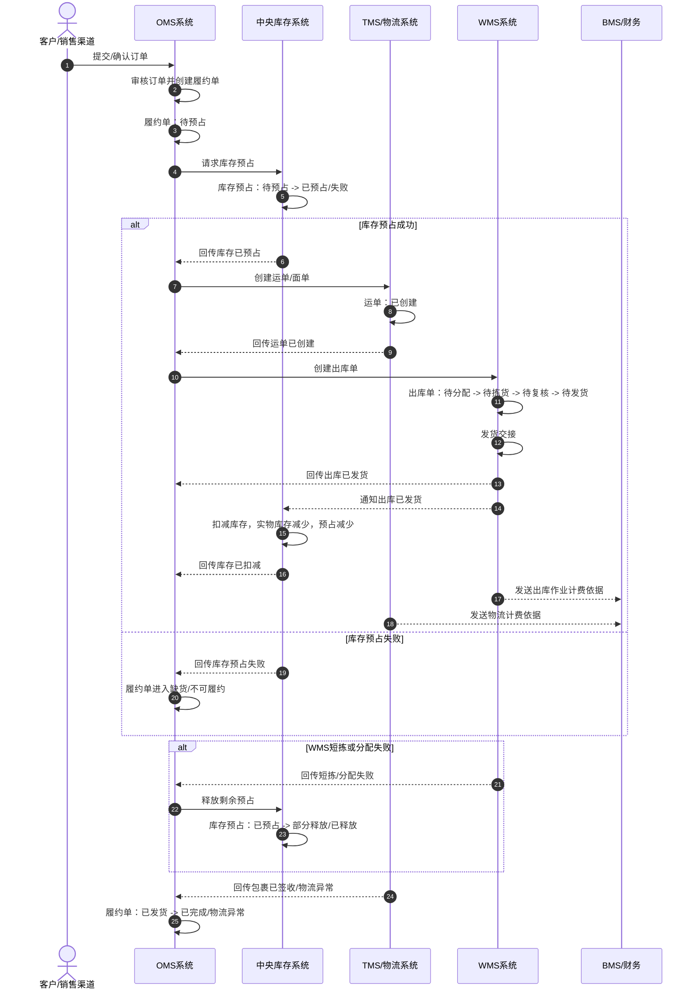

# 03-2 销售出库业务流程

> 本文只分析销售出库业务，不引入领域驱动设计术语。目标是先把“客户订单如何变成仓库出库任务，库存如何被锁定和扣减，仓库如何拣货、复核、打包、发货”讲清楚。

## 1. 流程目标

销售出库的目标是：客户下单后，系统完成订单审核、库存预占、仓库出库、物流发货，并在发货后扣减库存、回传发货结果、形成费用依据。

```text
客户下单 -> OMS 审单 -> 中央库存预占 -> WMS 拣货复核打包 -> 发货 -> 中央库存扣减 -> 物流和费用跟踪
```

## 2. 参与系统

| 系统 | 参与原因 | 主要处理内容 | 主要数据变化 |
| --- | --- | --- | --- |
| 销售渠道/商城 | 客户下单入口 | 提交订单、支付、接收发货通知 | 渠道订单、支付状态、发货状态 |
| OMS 系统 | 销售履约编排 | 接收订单、审核订单、拆合单、分仓、请求预占、下发出库、回传发货 | 销售订单、履约单、出库指令、订单状态 |
| 主数据系统 | 提供基础资料 | 提供 SKU、客户、地址、仓库、物流商等资料 | 主数据通常只被引用或快照 |
| 中央库存系统 | 控制库存承诺和扣减 | 查询可用库存、预占库存、释放库存、发货扣减 | 库存余额、预占记录、库存流水 |
| TMS/物流系统 | 运输履约 | 匹配物流渠道、创建运单、生成面单、同步轨迹 | 运单、面单、物流轨迹 |
| WMS 系统 | 仓库出库执行 | 接收出库单、波次、分配库位、拣货、复核、打包、发货交接 | 出库单、拣货任务、包裹、库内库存 |
| BMS/财务系统 | 费用依据 | 根据出库作业、包裹、重量、物流生成费用 | 费用明细、对账状态 |
| 权限系统 | 控制人员操作范围 | 校验客服、运营、仓库人员权限，记录操作日志 | 操作日志、审计记录 |

## 3. 参与角色

| 角色 | 所属方 | 主要动作 | 使用系统 |
| --- | --- | --- | --- |
| 客户 | 外部客户 | 下单、支付、查看发货和物流 | 销售渠道/商城 |
| 客服/订单专员 | 企业 | 处理订单异常、地址异常、取消、人工审核 | OMS 系统 |
| 运营人员 | 企业 | 查看履约进度、处理缺货和拆单策略 | OMS 系统 |
| 库存管理员 | 企业 | 查看预占、扣减、释放和库存异常 | 中央库存系统 |
| 仓库主管 | 仓库 | 安排波次、查看作业进度、处理仓内异常 | WMS 系统 |
| 拣货员 | 仓库 | 按拣货任务从库位拿取商品 | WMS 系统、PDA |
| 复核员 | 仓库 | 核对商品、数量、批次、订单 | WMS 系统 |
| 打包员 | 仓库 | 打包、称重、贴面单、生成包裹 | WMS 系统 |
| 发货员 | 仓库 | 与物流交接包裹，确认发货 | WMS 系统、物流系统 |
| 物流专员 | 企业或物流商 | 处理物流渠道、运单异常和轨迹 | TMS/物流系统 |
| 财务/结算专员 | 企业 | 查看出库和物流费用，对账结算 | BMS/财务系统 |

## 4. 关键业务数据

| 数据对象 | 谁创建 | 谁修改 | 关键字段 | 主要状态 |
| --- | --- | --- | --- | --- |
| 销售订单 | 渠道/OMS | OMS、客服 | 订单号、客户、收货地址、SKU、数量、金额、支付状态 | 待审核、已审核、异常、已取消、履约中、已发货、已完成 |
| 履约单 | OMS | OMS | 履约单号、销售订单号、仓库、履约数量、履约策略 | 待预占、已预占、已下发、已发货、异常、已取消 |
| 库存预占 | 中央库存系统 | 中央库存系统 | 预占单号、SKU、仓库、预占数量、来源单据 | 待预占、已预占、已释放、已扣减、失败 |
| 运单/面单 | TMS/物流系统 | TMS/物流系统、WMS | 运单号、物流商、物流产品、收寄信息、面单状态 | 待创建、已创建、已揽收、运输中、已签收、异常 |
| 出库单 | OMS/WMS | WMS | 出库单号、来源履约单、仓库、SKU、应发数量、实发数量 | 待分配、待拣货、待复核、待打包、待发货、已发货、异常 |
| 拣货任务 | WMS | 拣货员 | 拣货任务号、库区库位、SKU、批次、应拣数量、实拣数量 | 待拣货、拣货中、已完成、短拣、异常 |
| 包裹 | WMS | 打包员 | 包裹号、出库单号、SKU、数量、重量、体积、面单号 | 待打包、已打包、已交接、已发货 |
| 库存余额 | 中央库存系统 | 中央库存系统 | SKU、仓库、批次、现货数量、可用数量、预占数量 | 预占数量增加、发货后现货数量减少 |
| 库存流水 | 中央库存系统 | 中央库存系统 | 来源单据、变动类型、变动数量、变动前后数量 | 已记录 |
| 费用明细 | BMS/财务系统 | 财务/结算专员 | 费用类型、来源单据、物流商、仓库、金额 | 已生成、待对账、已确认 |

## 5. 主流程



## 6. 分步骤数据变化

| 步骤 | 发起角色/系统 | 处理系统 | 被修改的数据 | 数据如何变化 |
| --- | --- | --- | --- | --- |
| 客户下单 | 客户/渠道 | 渠道、OMS | 渠道订单、销售订单 | 生成销售订单，记录客户、地址、商品、数量、金额 |
| 订单审核 | OMS/订单专员 | OMS | 销售订单 | 待审核变为已审核；异常订单进入异常状态 |
| 创建履约单 | OMS | OMS | 履约单 | 按仓库、库存、物流策略生成履约单 |
| 请求库存预占 | OMS | 中央库存系统 | 库存预占、库存余额 | 可用库存减少，预占数量增加；失败则不允许下发仓库 |
| 创建运单 | OMS/TMS | TMS/物流系统 | 运单、面单 | 生成运单号和面单信息 |
| 下发出库单 | OMS | WMS | 出库单 | 创建 WMS 出库单，状态为待分配 |
| 波次和库位分配 | 仓库主管/WMS | WMS | 波次、出库单、分配明细 | 指定从哪些库区库位、批次拿货 |
| 拣货 | 拣货员 | WMS | 拣货任务、出库单行 | 记录实拣数量；短拣时记录差异 |
| 复核 | 复核员 | WMS | 复核记录、出库单 | 核对商品、数量、批次，通过后进入打包 |
| 打包 | 打包员 | WMS | 包裹、重量、体积、面单 | 生成包裹信息，绑定运单或面单 |
| 发货交接 | 发货员 | WMS、物流系统 | 出库单、包裹、物流交接记录 | 出库单变为已发货，包裹交给物流 |
| 发货回传 | WMS | OMS、渠道 | 销售订单、履约单 | OMS 更新已发货并通知渠道 |
| 库存扣减 | 中央库存系统 | 中央库存系统 | 库存余额、库存流水 | 预占转扣减，现货数量减少，生成出库流水 |
| 生成费用 | BMS/财务系统 | BMS/财务系统 | 费用明细 | 根据出库作业、包裹、重量、物流费用生成费用 |

## 7. 关键数据状态变化

| 数据对象 | 典型状态变化 | 业务含义 |
| --- | --- | --- |
| 销售订单 | 待审核 -> 已审核 -> 履约中 -> 已发货 -> 已完成 | 客户订单从接收到履约完成 |
| 履约单 | 待预占 -> 已预占 -> 已下发 -> 已发货 | OMS 把订单转成可执行的仓库履约任务 |
| 库存预占 | 待预占 -> 已预占 -> 已扣减/已释放 | 先锁住库存，发货后扣减，取消或失败时释放 |
| 运单 | 待创建 -> 已创建 -> 已揽收 -> 已签收 | 物流从下单到配送完成 |
| 出库单 | 待分配 -> 待拣货 -> 待复核 -> 待打包 -> 已发货 | WMS 仓内执行过程 |
| 拣货任务 | 待拣货 -> 拣货中 -> 已完成/短拣 | 拣货员按库位实际拿货 |
| 包裹 | 待打包 -> 已打包 -> 已交接 -> 已发货 | 商品完成打包并交给物流 |
| 库存余额 | 可用数量减少、预占数量增加 -> 发货后库存数量减少 | 库存先承诺，后实扣 |
| 库存流水 | 无 -> 新增预占流水、扣减流水或释放流水 | 记录库存为什么变化 |
| 费用明细 | 待生成 -> 已生成 -> 待对账 | 出库和物流事实可用于计费 |

## 8. 异常场景

| 异常 | 发生位置 | 影响数据 | 处理方式 |
| --- | --- | --- | --- |
| 订单审核失败 | OMS | 销售订单 | 客服修改、取消或人工审核 |
| 库存预占失败 | 中央库存系统 | 履约单、库存预占 | 换仓、拆单、等货、取消或人工处理 |
| 物流下单失败 | TMS/物流系统 | 运单、履约单 | 更换物流渠道、重试或人工处理 |
| 出库单重复下发 | OMS/WMS | 出库单 | WMS 按出库单号幂等处理，避免重复作业 |
| 库位分配失败 | WMS | 出库单、分配明细 | 重新分配、库存盘点、回传 OMS 处理 |
| 拣货短拣 | WMS | 拣货任务、出库单、履约单 | OMS 决定部分发货、补发、换仓或取消 |
| 复核异常 | WMS | 复核记录、出库单 | 回退拣货或异常处理，禁止发货 |
| 打包异常 | WMS | 包裹、出库单 | 重新打包、换箱、调整重量体积 |
| 发货回传失败 | WMS、OMS | 出库单、销售订单 | 事件重试或人工补偿查询 |
| 库存扣减失败 | 中央库存系统 | 库存余额、库存流水 | 重试扣减，生成异常记录，人工对账 |
| 费用生成失败 | BMS/财务系统 | 费用明细 | 重试生成或人工补录 |

## 9. 业务理解要点

1. 销售订单已审核不代表能发货，必须先完成库存预占。
2. 库存预占不等于库存扣减，只有仓库实际发货后才扣减库存。
3. OMS 负责履约编排，WMS 负责仓内执行，中央库存负责库存数量，TMS 负责物流事实。
4. 拣货、复核、打包、发货都可能产生差异，系统必须记录每一步的实际结果。
5. 一个 OMS 订单可能拆成多个履约单，也可能生成多个出库单和多个包裹。
6. 发货后要同时影响订单状态、库存余额、物流轨迹和费用明细。

## 10. 销售出库时序图



### 10.1 销售出库动作链

| 顺序 | 动作 | 来源 | 目标 | 主要数据变化 | 幂等依据 |
| --- | --- | --- | --- | --- | --- |
| 1 | 请求库存预占 | OMS | 中央库存系统 | 库存预占：待预占 -> 已预占/失败 | 履约单号 + 行号 + SKU + 仓库 |
| 2 | 回传库存已预占 | 中央库存系统 | OMS | 履约单：待预占 -> 已预占 | 预占单号 |
| 3 | 创建出库单 | OMS | WMS | 出库单：无 -> 待分配 | 出库单号 |
| 4 | 回传出库已发货 | WMS | OMS、中央库存、BMS | 订单发货、库存扣减、费用生成 | 发货事件号 |
| 5 | 扣减库存 | WMS/库存系统 | 中央库存系统 | 实物库存减少，预占消耗 | 发货事件号 |
| 6 | 释放预占 | OMS/WMS | 中央库存系统 | 预占释放或部分释放 | 释放请求号 |
