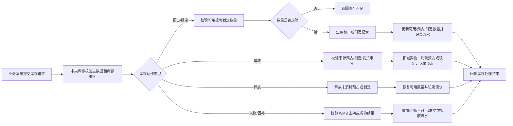

# 03-库存预占扣减释放业务流程

> 本文用于统一说明中央库存如何处理可用库存、预占库存、锁定库存、在途库存和库存流水。销售出库、调拨、退供应商都依赖该流程；采购入库和售后退货则主要触发库存增加或库存状态转换。

## 1. 流程目标

库存流程的目标是：让业务系统可以可靠承诺库存，仓库作业完成后准确扣减或增加库存，并通过库存流水追溯每一次数量变化。

```text
业务系统请求库存动作
  -> 中央库存校验库存维度和可用数量
  -> 生成预占/锁定/扣减/释放/入账结果
  -> 记录库存流水
  -> 回传业务系统推进单据
```

## 2. 适用场景

| 场景 | 发起系统 | 库存动作 | 业务结果 |
| --- | --- | --- | --- |
| 销售出库 | OMS | 预占、扣减、释放 | 保证订单履约不超卖 |
| 调拨出库 | 调拨系统/WMS | 调拨预占、调出扣减、在途增加 | 商品从调出仓进入在途 |
| 调拨入库 | WMS | 在途减少、调入库存增加 | 商品进入调入仓 |
| 采购入库 | WMS | 入库增加 | 合格品上架后增加库存 |
| 售后退货 | WMS/OMS | 回补可用、增加不可售、冻结或报废 | 按质检结果处理退货库存 |
| 供应商退货 | 采购/退供系统、WMS | 退供锁定、退供扣减、锁定释放 | 不良品或可退库存退回供应商 |

## 3. 参与系统

| 系统 | 参与原因 | 主要处理内容 | 主要数据变化 |
| --- | --- | --- | --- |
| 主数据系统 | 提供库存维度基础 | SKU、仓库、货主、批次、单位、库存状态 | 主数据被引用或校验 |
| OMS/售后系统 | 销售履约和退货决策 | 请求预占、释放、退货库存处理 | 履约单、售后单状态 |
| 调拨系统 | 调拨库存编排 | 请求调拨预占、调出、调入 | 调拨单状态 |
| 采购/退供系统 | 退供库存处理 | 请求退供锁定、释放和扣减 | 退供应商单状态 |
| WMS 系统 | 仓库作业事实来源 | 回传上架、发货、收货、质检结果 | 入库单、出库单、质检记录 |
| 中央库存系统 | 库存事实源 | 校验、预占、锁定、扣减、释放、入账、流水 | 库存余额、库存流水、预占/锁定记录 |
| BMS/报表 | 费用和库存成本 | 消费库存事实生成成本、费用或报表 | 成本依据、库存报表 |

## 4. 关键业务数据

| 数据对象 | 谁创建 | 谁修改 | 关键字段 | 主要状态 |
| --- | --- | --- | --- | --- |
| 库存余额 | 中央库存系统 | 中央库存系统 | SKU、仓库、货主、批次、库存状态、现货、可用、预占、锁定、在途 | 按数量变化 |
| 库存预占 | 中央库存系统 | 中央库存系统 | 预占单号、来源单、SKU、仓库、数量、过期时间 | 待预占、已预占、已释放、已扣减、失败 |
| 库存锁定 | 中央库存系统 | 中央库存系统 | 锁定单号、来源单、锁定原因、数量 | 已锁定、已释放、已消耗 |
| 库存在途 | 中央库存系统 | 中央库存系统 | 调拨单号、调出仓、调入仓、SKU、数量 | 在途、已入库、差异关闭 |
| 库存流水 | 中央库存系统 | 中央库存系统 | 来源单据、来源行、变动类型、变动前后数量、事件号 | 已记录 |

## 5. 主流程



## 6. 分步骤数据变化

| 步骤 | 发起角色/系统 | 处理系统 | 被修改的数据 | 数据如何变化 |
| --- | --- | --- | --- | --- |
| 请求库存动作 | OMS/调拨/采购/WMS | 中央库存 | 库存请求记录 | 新增请求，记录来源单据、行号、SKU、仓库、数量 |
| 预占库存 | OMS/调拨系统 | 中央库存 | 库存余额、库存预占、库存流水 | 可用减少，预占增加，生成预占流水 |
| 释放预占 | OMS/WMS/调拨系统 | 中央库存 | 库存余额、库存预占、库存流水 | 预占减少，可用恢复，生成释放流水 |
| 发货扣减 | WMS | 中央库存 | 库存余额、库存预占、库存流水 | 实物减少，预占消耗，生成出库流水 |
| 退供锁定 | 采购/退供系统 | 中央库存 | 库存余额、库存锁定、库存流水 | 可用减少，锁定增加 |
| 退供扣减 | WMS | 中央库存 | 库存余额、库存锁定、库存流水 | 实物减少，锁定消耗 |
| 调拨在途 | 调出仓 WMS | 中央库存 | 库存余额、在途库存、库存流水 | 调出仓减少，在途增加 |
| 调拨入库 | 调入仓 WMS | 中央库存 | 库存余额、在途库存、库存流水 | 在途减少，调入仓增加 |
| 入库增加 | WMS | 中央库存 | 库存余额、库存流水 | 合格上架数量增加可用库存 |
| 退货处理 | WMS | 中央库存 | 库存余额、库存状态、库存流水 | 按质检结果增加可用、不可售、冻结或报废 |

## 7. 异常场景

| 异常 | 发生位置 | 影响数据 | 处理方式 |
| --- | --- | --- | --- |
| 库存不足 | 预占/锁定 | 业务单据、预占记录 | 返回失败，业务系统换仓、拆单、等货或取消 |
| 重复预占 | 中央库存 | 库存预占 | 按来源单据 + 行号 + 请求号幂等返回原结果 |
| 发货扣减失败 | 中央库存 | 库存余额、出库单 | 重试扣减，失败进入库存异常看板 |
| 释放失败 | 中央库存 | 预占、可用 | 重试释放，人工核对预占状态 |
| WMS 回传重复 | WMS/中央库存 | 库存流水 | 按事件号幂等，不重复入账或扣减 |
| 调拨在途差异 | 调拨/WMS | 在途库存、差异记录 | 按实收处理，走报损、索赔、反向调拨或异常关闭 |
| 库存状态错误 | WMS/库存 | 可用、不可售、冻结 | 通过库存调整或质检复判流程修正，保留审计 |

## 8. 业务规则与协同边界

| 检查项 | 设计口径 |
| --- | --- |
| 上游前置 | SKU、仓库、货主、批次规则、库存状态、单位换算必须已启用 |
| 核心边界 | 中央库存拥有库存余额、预占、锁定、在途和流水；业务系统不能直接修改库存数量 |
| 关键事件 | 库存已预占、库存预占失败、库存已释放、库存已扣减、库存已入账、库存已锁定、库存已转在途、库存差异已记录 |
| 不变量 | 可用数量不能小于 0；预占/锁定/在途必须可追溯来源单；每次数量变化必须有库存流水 |
| 幂等规则 | 所有库存动作必须使用来源系统 + 来源单号 + 行号 + 动作类型 + 请求号或事件号幂等 |
| 权限审计 | 人工库存调整、异常关闭、差异处理、冻结解冻、报损必须记录操作人、原因和前后数量 |

