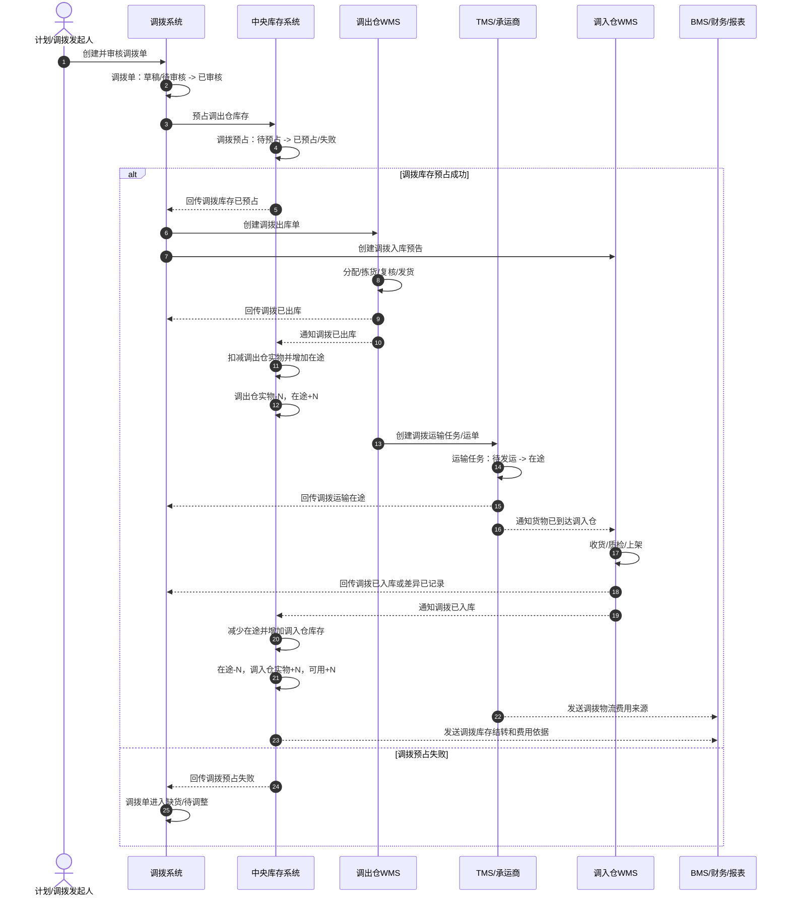

# 04-调拨业务流程

> 本文只分析调拨业务，不引入领域驱动设计术语。目标是先把“为什么调拨、谁发起、哪些系统参与、哪些数据发生变化、库存如何从调出仓转到调入仓、异常如何处理”讲清楚，方便后续再做字段、接口、状态机和系统功能设计。

## 1. 流程目标

调拨的目标是：把商品从一个仓库、门店或库存地点转移到另一个仓库、门店或库存地点，用来解决库存不均衡、区域备货、门店补货、滞销转移和库存归集等问题。

```text
提出调拨需求 -> 审核调拨单 -> 锁定调出仓库存 -> 调出仓拣货发货 -> 形成在途 -> 调入仓收货上架 -> 调入仓库存增加 -> 调拨关闭
```

调拨不是简单地做一条库存调整。因为商品会经历“调出仓、运输在途、调入仓”三个阶段，每个阶段都可能出现数量差异和状态变化。

## 2. 业务范围

本文包含：

1. 调拨申请、调拨单审核。
2. 调出仓库存校验和调拨预占。
3. 调出仓创建调拨出库单、拣货、复核、装箱、发货。
4. TMS 创建调拨运输任务、运单、面单或发运凭证，并跟踪在途、到达、签收和异常。
5. 调入仓创建调拨入库预告、收货、质检、上架。
6. 中央库存记录调出、在途、调入的库存变化。
7. 调拨相关仓储作业费、运输费或内部成本转移。
8. 少发、少收、多收、运输破损、运输丢失、调拨取消等异常。

本文不展开：

1. 调拨补货算法。
2. 仓网规划和调拨策略优化。
3. 运输线路成本计算细节。
4. 调拨单数据库表结构。
5. 复杂多段运输和跨境调拨。

## 3. 参与系统

| 系统 | 参与原因 | 主要处理内容 | 主要数据变化 |
| --- | --- | --- | --- |
| 主数据系统 | 调拨依赖基础资料 | 提供 SKU、仓库、库区库位、单位、批次规则、物流商等资料 | 主数据一般不在调拨流程中修改，只被引用或快照 |
| 调拨系统/库存运营系统 | 管理调拨需求和调拨单 | 创建调拨申请、审核调拨单、跟踪调拨进度、处理差异、关闭调拨 | 调拨单、调拨明细、差异记录、调拨状态 |
| 中央库存系统 | 控制库存承诺和库存账本 | 校验调出仓可用库存、预占调拨库存、记录调出、在途、调入和差异流水 | 库存余额、调拨预占、在途库存、库存流水 |
| 调出仓 WMS | 执行调拨出库 | 创建调拨出库单、分配库位、拣货、复核、装箱、发货 | 调拨出库单、拣货任务、装箱记录、出库记录 |
| TMS/物流系统 | 管理调拨运输 | 创建运输任务、生成运单、记录发运、到达、签收、拒收、延误、破损、丢失等轨迹，生成物流费用来源 | 运输任务、运单、运输轨迹、签收记录、异常记录、物流费用来源 |
| 调入仓 WMS | 执行调拨入库 | 创建调拨入库预告、到货登记、收货清点、质检、上架 | 调拨入库单、收货记录、质检记录、上架任务、库内库存 |
| BMS/财务系统 | 费用和成本 | 生成内部仓储作业费、运输费、成本转移或内部结算依据 | 费用明细、成本转移记录、对账状态 |
| 权限系统 | 控制操作范围 | 校验调拨申请、审批、仓库作业、异常处理权限 | 操作日志、审计记录 |

## 4. 参与角色

| 角色 | 所属方 | 主要动作 | 使用系统 |
| --- | --- | --- | --- |
| 库存运营/计划员 | 企业 | 发起调拨需求，填写调出仓、调入仓、SKU、数量和期望到货时间 | 调拨系统/库存运营系统 |
| 调拨审批人 | 企业 | 审核调拨是否合理，确认库存、成本和业务必要性 | 调拨系统/库存运营系统 |
| 调出仓主管 | 调出仓 | 接收调拨出库任务，安排波次和人员 | 调出仓 WMS |
| 调出仓拣货员 | 调出仓 | 按任务从指定库位拣货 | 调出仓 WMS、PDA |
| 调出仓复核员 | 调出仓 | 复核商品、数量、批次、箱号 | 调出仓 WMS |
| 调出仓发货员 | 调出仓 | 装箱、交接物流、确认调拨出库 | 调出仓 WMS、TMS |
| 物流专员/承运商 | 企业或物流商 | 创建运输任务、跟踪运输、处理延误、破损、丢失 | TMS/物流系统 |
| 调入仓收货员 | 调入仓 | 到货登记、收货清点、记录差异 | 调入仓 WMS |
| 调入仓质检员 | 调入仓 | 对调入商品做质检，记录合格和不合格数量 | 调入仓 WMS |
| 调入仓上架员 | 调入仓 | 把合格商品放到指定库位 | 调入仓 WMS |
| 库存管理员 | 企业 | 查看调拨库存变化，处理在途和账实异常 | 中央库存系统 |
| 财务/结算专员 | 企业 | 查看调拨费用、运输费、内部成本转移 | BMS/财务系统 |

## 5. 关键业务数据

| 数据对象 | 谁创建 | 谁修改 | 关键字段 | 主要状态 |
| --- | --- | --- | --- | --- |
| 调拨申请/调拨单 | 库存运营/计划员 | 计划员、审批人、系统 | 调拨单号、调出仓、调入仓、SKU、数量、期望到货时间、调拨原因 | 草稿、待审核、已审核、已驳回、已取消、调出中、在途、调入中、已完成、异常关闭 |
| 调拨明细 | 库存运营/计划员 | 系统、异常处理人 | SKU、批次要求、调拨数量、实发数量、实收数量、差异数量 | 待处理、部分发出、已发出、部分入库、已入库、差异待处理 |
| 调拨预占 | 中央库存系统 | 中央库存系统 | 预占单号、调拨单号、调出仓、SKU、预占数量 | 待预占、已预占、已释放、已消耗、失败 |
| 调拨出库单 | 调出仓 WMS | 调出仓作业人员 | 出库单号、调拨单号、调出仓、SKU、应发数量、实发数量 | 待分配、待拣货、待复核、待发货、已发货、异常 |
| 拣货任务 | 调出仓 WMS | 拣货员 | 库区库位、SKU、批次、应拣数量、实拣数量 | 待拣货、拣货中、已完成、短拣、异常 |
| 装箱/发货记录 | 调出仓 WMS | 复核员、发货员 | 箱号、SKU、数量、重量、体积、承运商、运单号 | 待装箱、已装箱、已交接、已发货 |
| 运输任务/运单 | TMS/物流系统 | 物流专员、承运商 | 运单号、起运仓、目的仓、承运商、预计到达时间、签收时间、轨迹、异常原因 | 待发运、已发运、在途、已到达、已签收、拒收、异常 |
| 调拨入库单 | 调入仓 WMS | 收货员、质检员、上架员 | 入库单号、调拨单号、调入仓、应收数量、实收数量、合格数量、不合格数量 | 待到货、收货中、待质检、待上架、已上架、异常 |
| 调拨差异记录 | 系统或异常处理人 | 异常处理人 | 差异类型、差异数量、原因、责任方、处理方式 | 待处理、处理中、已确认、已关闭 |
| 库存余额 | 中央库存系统 | 中央库存系统 | 仓库、SKU、批次、可用数量、预占数量、在途数量 | 调出仓可用减少、在途增加、调入仓库存增加 |
| 库存流水 | 中央库存系统 | 中央库存系统 | 来源单据、变动类型、变动数量、变动前后数量 | 已记录 |
| 物流费用来源 | TMS | TMS、BMS | 调拨单号、运单号、物流商、物流产品、重量、体积、线路、费用项 | 待采集、已采集、已推送、已计费、差异 |
| 费用明细/成本转移 | BMS/财务系统 | 财务/结算专员 | 调拨单号、仓库、物流商、费用类型、金额 | 待生成、已生成、待对账、已确认 |

## 6. 主流程

```mermaid
flowchart LR
  A["库存运营/计划员创建调拨单"] --> B["调拨审批人审核调拨单"]
  B --> C{"审核通过？"}
  C -- "否" --> C1["调拨单驳回或取消"]
  C -- "是" --> D["中央库存校验调出仓可用库存"]
  D --> E{"库存是否足够？"}
  E -- "否" --> E1["预占失败：改数量/换调出仓/取消"]
  E -- "是" --> F["中央库存预占调拨库存"]
  F --> G["调出仓 WMS 创建调拨出库单"]
  G --> H["调出仓 WMS 分配库位和批次"]
  H --> I{"分配成功？"}
  I -- "否" --> I1["分配异常：重新分配或释放预占"]
  I -- "是" --> J["拣货员按库位拣货"]
  J --> K{"是否短拣？"}
  K -- "是" --> K1["记录短拣，按实发或补拣处理"]
  K -- "否" --> L["复核员复核商品/数量/批次"]
  K1 --> L
  L --> M{"复核通过？"}
  M -- "否" --> M1["复核异常，回退拣货或调整"]
  M -- "是" --> N["装箱并与物流交接"]
  N --> O["调出仓确认调拨出库"]
  O --> P["中央库存：调出仓库存减少，在途库存增加"]
  O --> Q["TMS 创建运输任务/运单并跟踪在途"]
  Q --> R{"运输是否异常？"}
  R -- "是" --> R1["记录延误/破损/丢失，进入异常处理"]
  R -- "否" --> S["TMS 回传货物到达调入仓"]
  S --> T["调入仓 WMS 到货登记和收货清点"]
  T --> U{"实收是否一致？"}
  U -- "否" --> U1["记录少收/多收/破损/错货差异"]
  U1 --> V["质检员验收"]
  U -- "是" --> V
  V --> W{"质检是否合格？"}
  W -- "否" --> W1["不合格品进入异常区，等待处理"]
  W -- "是/部分合格" --> X["WMS 生成上架任务"]
  X --> Y["上架员确认上架"]
  Y --> Z["中央库存：在途减少，调入仓库存增加"]
  Z --> ZA["调拨单更新入库进度，差异处理后关闭"]
  Q --> ZB["BMS/财务采集运输费来源"]
  O --> ZB
  Y --> ZB
```



## 7. 分步骤数据变化

| 步骤 | 发起角色/系统 | 处理系统 | 被修改的数据 | 数据如何变化 |
| --- | --- | --- | --- | --- |
| 创建调拨单 | 库存运营/计划员 | 调拨系统/库存运营系统 | 调拨单、调拨明细 | 新增调拨单，记录调出仓、调入仓、SKU、数量和原因 |
| 审核调拨单 | 调拨审批人 | 调拨系统/库存运营系统 | 调拨单 | 待审核变为已审核；驳回则变为已驳回 |
| 校验库存 | 系统自动 | 中央库存系统 | 库存余额 | 查询调出仓可用库存，不直接修改库存 |
| 调拨预占 | 系统自动 | 中央库存系统 | 调拨预占、库存余额、库存流水 | 调出仓可用数量减少，调拨预占数量增加，生成预占流水 |
| 创建调拨出库单 | 系统自动或仓库主管 | 调出仓 WMS | 调拨出库单 | 新增调拨出库单，状态为待分配 |
| 分配库位批次 | 调出仓 WMS | 调出仓 WMS | 调拨出库单、分配明细 | 指定从哪些库区、库位、批次出货 |
| 拣货 | 拣货员 | 调出仓 WMS | 拣货任务、调拨出库单行 | 写入实拣数量，短拣时记录差异 |
| 复核 | 复核员 | 调出仓 WMS | 复核记录、调拨出库单 | 复核商品、数量、批次，通过后进入装箱 |
| 装箱发货 | 发货员 | 调出仓 WMS、TMS | 装箱记录、发货记录、运输任务、运单 | 记录箱号、重量、承运商、运单号，出库单变为已发货，TMS 运单进入已发运 |
| 调出库存变化 | 系统自动 | 中央库存系统 | 库存余额、调拨预占、库存流水 | 调出仓实物库存减少，调拨预占消耗或释放，在途库存增加 |
| 在途跟踪 | 物流专员/承运商 | TMS/物流系统 | 运输任务、轨迹记录 | 更新发运、在途、到达、延误、破损、丢失等状态 |
| 到达/签收回传 | 承运商/TMS | TMS、调拨系统、调入仓 WMS | 运单、调拨单、调拨入库单 | TMS 回传已到达或已签收，调入仓可准备到货登记 |
| 到货登记 | 收货员 | 调入仓 WMS | 调拨入库单、到货记录 | 记录实际到货时间，入库单进入收货中 |
| 收货清点 | 收货员 | 调入仓 WMS | 收货记录、调拨入库单行 | 写入实收数量，少收、多收、破损、错货时记录差异 |
| 质检验收 | 质检员 | 调入仓 WMS | 质检记录、调拨入库单行 | 写入合格数量、不合格数量和原因 |
| 上架 | 上架员 | 调入仓 WMS | 上架任务、调拨入库单、库内库存 | 合格品放入目标库位，入库单变为已上架或部分上架 |
| 调入库存变化 | 系统自动 | 中央库存系统 | 库存余额、在途库存、库存流水 | 在途库存减少，调入仓库存增加，生成调拨入库流水 |
| 调拨进度更新 | 系统自动 | 调拨系统/库存运营系统 | 调拨单、调拨明细、差异记录 | 更新实发、在途、实收、上架和差异数量；满足条件后关闭 |
| 费用/成本处理 | WMS/TMS/BMS | BMS/财务系统 | 物流费用来源、费用明细、成本转移记录 | 根据出库、运输、入库事实生成费用或内部成本转移 |

## 8. 库存变化过程

| 业务节点 | 调出仓可用库存 | 调出仓实物库存 | 调拨预占 | 调拨在途 | 调入仓库存 | 说明 |
| --- | --- | --- | --- | --- | --- | --- |
| 创建调拨单 | 不变 | 不变 | 不变 | 不变 | 不变 | 调拨申请不影响库存 |
| 调拨预占成功 | 减少 | 不变 | 增加 | 不变 | 不变 | 防止调出仓库存被其他业务占用 |
| 调出仓发货 | 不变 | 减少 | 减少 | 增加 | 不变 | 商品离开调出仓，进入在途 |
| 运输在途 | 不变 | 不变 | 不变 | 保持 | 不变 | 商品尚未进入调入仓可用库存 |
| 调入仓收货未上架 | 不变 | 不变 | 不变 | 通常保持 | 不变 | 建议上架后再减少在途并增加调入仓库存 |
| 调入仓上架 | 不变 | 不变 | 不变 | 减少 | 增加 | 调拨完成库存转移 |
| 未发货取消 | 增加 | 不变 | 减少 | 不变 | 不变 | 释放调拨预占 |
| 已发货异常关闭 | 不变 | 已减少 | 已消耗 | 按差异处理 | 按实收或报损处理 | 不能简单把库存还原 |

## 9. 关键数据状态变化

| 数据对象 | 典型状态变化 | 业务含义 |
| --- | --- | --- |
| 调拨单 | 草稿 -> 待审核 -> 已审核 -> 已预占 -> 调出中 -> 在途 -> 调入中 -> 已完成/异常关闭 | 调拨从申请到关闭的端到端进度 |
| 调拨明细 | 待处理 -> 部分发出/已发出 -> 部分入库/已入库 -> 差异待处理/已完成 | 每个 SKU 的实际调拨进度 |
| 调拨预占 | 待预占 -> 已预占 -> 已消耗/已释放 | 调出仓库存先被锁定，发货后消耗，取消时释放 |
| 调拨出库单 | 待分配 -> 待拣货 -> 待复核 -> 待发货 -> 已发货/异常 | 调出仓仓内作业进度 |
| 运输任务 | 待发运 -> 已发运 -> 在途 -> 已到达/异常 | 调拨运输过程 |
| 调拨入库单 | 待到货 -> 收货中 -> 待质检 -> 待上架 -> 已上架/异常 | 调入仓仓内作业进度 |
| 调拨差异记录 | 待处理 -> 处理中 -> 已确认 -> 已关闭 | 少发、少收、多收、破损、丢失等差异的处理进度 |
| 库存流水 | 无 -> 预占流水、调出流水、在途流水、调入流水、差异流水 | 记录库存为什么变化 |
| 物流费用来源 | 待采集 -> 已采集 -> 已推送 -> 已计费/差异 | TMS 将调拨运输事实转为计费依据 |
| 费用明细 | 待生成 -> 已生成 -> 待对账 -> 已确认 | 调拨作业、运输和内部成本可追溯 |

## 10. 异常场景

| 异常 | 发生位置 | 影响数据 | 处理方式 |
| --- | --- | --- | --- |
| 调拨审核驳回 | 调拨系统 | 调拨单 | 修改后重新提交，或取消调拨 |
| 调出仓库存不足 | 中央库存系统 | 调拨单、调拨预占 | 预占失败，改数量、换调出仓、等待补货或取消 |
| 调出仓库位分配失败 | 调出仓 WMS | 调拨出库单、分配明细 | 重新分配、盘点库存、释放预占或人工处理 |
| 调出仓短拣 | 调出仓 WMS | 拣货任务、调拨明细 | 按实发进入在途，剩余数量释放预占或安排补发 |
| 调出仓多发 | 调出仓 WMS | 调拨出库单、差异记录 | 异常审批，补调拨明细、退回多发或库存调整 |
| 复核异常 | 调出仓 WMS | 复核记录、调拨出库单 | 回退拣货或调整装箱，禁止直接发货 |
| 运输延误 | TMS/物流系统 | 运输任务、调拨单进度 | 更新预计到达时间，通知调入仓和计划人员 |
| 运输破损 | TMS/调入仓 WMS | 运输任务、收货记录、差异记录 | 按实收和质检结果处理，可能报损、索赔或退回 |
| 运输丢失 | TMS/调拨系统 | 在途库存、差异记录 | 差异挂起，走索赔、报损、补发或成本调整 |
| TMS 到达回传失败 | TMS/调入仓 WMS | 运输任务、调拨入库单 | TMS 重放到达事件，调入仓可按运单号人工到货登记 |
| 调入仓少收 | 调入仓 WMS | 调拨入库单、调拨明细、在途库存 | 按实收上架，差异待处理，不静默补库存 |
| 调入仓多收 | 调入仓 WMS | 收货记录、差异记录 | 暂存异常区，确认来源后入账、退回或调整 |
| 调入质检不合格 | 调入仓 WMS | 质检记录、库存状态 | 放入不合格区，冻结、报损、退回调出仓或异常处理 |
| 未发货取消 | 调拨系统、中央库存 | 调拨单、调拨预占 | 取消调拨并释放调拨预占 |
| 已发货取消 | 调拨系统、WMS、库存 | 调拨单、在途库存、差异记录 | 不能直接取消，需要退回、收货后反向调拨或异常关闭 |
| 库存流水重复生成 | 中央库存系统 | 库存流水、库存余额 | 按来源单据和事件编号做幂等，避免重复增减 |
| 费用生成失败 | BMS/财务系统 | 费用明细 | 重试生成或人工补录 |

## 11. 业务理解要点

1. 调拨申请不影响库存，只有审核通过并预占成功后，调出仓可用库存才减少。
2. 调拨预占不等于调出仓实物减少，只有调出仓确认发货后，调出仓实物库存才减少。
3. 调出仓发货后，库存不能凭空消失，应进入调拨在途。
4. 调入仓到货和收货不等于可用库存增加，通常要等质检合格并上架后才增加可用库存。
5. 调拨过程必须分别记录调拨数量、实发数量、在途数量、实收数量、合格数量、上架数量和差异数量。
6. 已发货调拨不能简单取消，必须通过退回、反向调拨、报损、索赔或异常关闭处理。
7. 调拨在途有两个视角：中央库存记录库存责任在途，TMS 记录运输轨迹在途，两者要通过调拨单号和运单号关联。
8. 调拨同时影响调出仓、在途、调入仓、运输、费用和报表，不能只做一条库存调整流水。

## 12. 调拨时序图



### 12.1 调拨动作链

| 顺序 | 动作 | 来源 | 目标 | 主要数据变化 | 幂等依据 |
| --- | --- | --- | --- | --- | --- |
| 1 | 审核调拨单 | 调拨发起人/审批人 | 调拨系统 | 调拨单：待审核 -> 已审核 | 调拨单号 + 审核请求号 |
| 2 | 预占调出仓库存 | 调拨系统 | 中央库存系统 | 调拨预占：待预占 -> 已预占 | 调拨单号 + 行号 + 调出仓 + SKU |
| 3 | 回传调拨已出库 | 调出仓 WMS | 调拨系统、中央库存系统、TMS、BMS | 调拨单：调出中 -> 在途 | 调拨出库事件号 |
| 4 | 增加调拨在途 | 中央库存系统 | 中央库存系统 | 调出仓实物减少，在途增加 | 调拨出库事件号 |
| 5 | 创建调拨运输任务 | 调出仓 WMS/调拨系统 | TMS、调入仓 WMS、BMS | 运单：无 -> 已发运/在途 | 调拨单号 + 运单号 |
| 6 | 回传到达/签收 | TMS | 调拨系统、调入仓 WMS、BMS | 调拨单：在途 -> 调入中；物流费用来源生成 | 运单号 + 到达事件号 |
| 7 | 回传调拨已入库 | 调入仓 WMS | 调拨系统、中央库存系统、BMS | 调拨单：调入中 -> 已完成/差异待处理 | 调拨入库事件号 |
| 8 | 增加调入仓库存 | 中央库存系统 | 中央库存系统 | 在途减少，调入仓库存增加 | 调拨入库事件号 |

## 13. 业务规则与协同边界

| 检查项 | 设计口径 |
| --- | --- |
| 上游前置 | 调出仓、调入仓、SKU、批次规则、货主、库位、物流商、物流产品和仓间调拨权限必须可用 |
| 核心边界 | 调拨系统负责需求、审批、进度和差异闭环；中央库存负责调出、在途、调入账本；双仓 WMS 负责出入库作业；TMS 负责运输在途；BMS 负责运输费、作业费和内部成本 |
| 关键事件 | 调拨单已审核、调拨库存已预占、调拨已出库、调拨运输已发运、调拨到达/签收、调拨已入库、调拨差异已确认、调拨费用来源已生成 |
| 库存规则 | 调出仓发货后形成中央库存的在途；调入仓上架后在途减少并增加调入仓库存；运输到达不直接增加库存 |
| 差异规则 | 少发按实发进入在途并释放剩余；少收/多收/破损按差异记录处理；已发货调拨不能直接取消 |
| 费用规则 | 调拨费用可能包含调出作业、调入作业、运输费和内部成本转移，BMS 要能区分承担组织和成本中心 |
| 幂等规则 | 调拨预占、出库、在途增加、到达回传、入库、在途转入库和费用生成必须以调拨单/出入库单/运单/事件号幂等 |
| 权限审计 | 调拨审批、跨仓操作、异常关闭、差异确认、库存报损、费用调整必须记录操作人、原因和前后值 |
