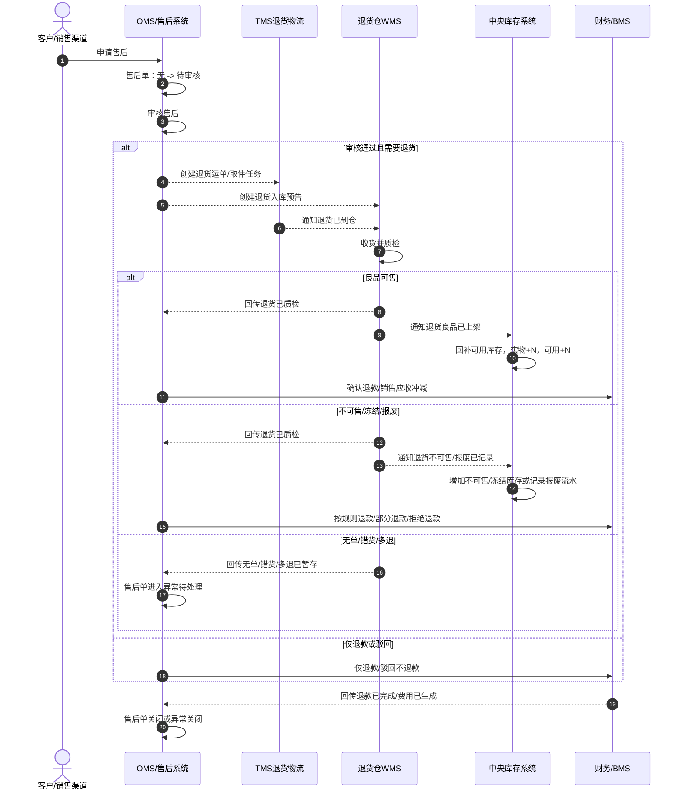

# 07-1 售后退货业务流程

> 本文只分析客户售后退货业务，不引入领域驱动设计术语。目标是先把“客户为什么退货、谁审核、哪些系统参与、退回商品如何收货质检、库存和退款如何变化”讲清楚，方便后续再做字段、接口、状态机和系统功能设计。

## 1. 流程目标

售后退货的目标是：客户因质量问题、错发漏发、七天无理由、拒收、换货等原因发起售后，企业完成售后审核、退货物流、仓库收货质检、库存处理、退款或换货，最终关闭售后。

```text
客户申请售后 -> 售后审核 -> 客户退货 -> 仓库收货质检 -> 库存处理 -> 退款/换货/拒绝 -> 售后关闭
```

售后退货不是“客户申请就退款”，也不是“商品到仓就回补库存”。是否退款、是否回补可用库存，要看售后规则、物流结果和仓库质检结果。

## 2. 业务范围

本文包含：

1. 客户发起退货、退款、换货、拒收等售后申请。
2. 售后/客服审核订单、商品、金额、售后期和凭证。
3. 创建退货单、退货入库预告和退货物流。
4. WMS 到货登记、扫描 RMA/原订单、收货、质检。
5. 根据质检结果回补可售库存、进入不可售/冻结、报废、索赔或转退供应商。
6. 财务退款、销售应收冲减、售后费用归集。
7. 无单退货、错货、多退、客户未寄回、物流丢失、验收不通过等异常。

本文不展开：

1. 售后规则引擎细节。
2. 退款支付渠道对接细节。
3. 换货补寄的完整销售出库链路。
4. 复杂责任判定和赔付算法。
5. 数据库表结构。

## 3. 参与系统

| 系统 | 参与原因 | 主要处理内容 | 主要数据变化 |
| --- | --- | --- | --- |
| 销售渠道/商城 | 客户发起售后入口 | 提交售后申请、上传凭证、展示审核和退款进度 | 渠道售后单、客户凭证、售后状态 |
| OMS/售后系统 | 售后业务编排 | 创建售后单、校验订单、审核售后、创建退货单、决策退款/换货/拒绝 | 售后单、退货单、退款申请、售后状态 |
| TMS/物流系统 | 退货运输 | 创建退货运单、上门取件、跟踪退货在途和到仓 | 退货运单、物流轨迹、物流异常 |
| WMS 系统 | 退货入库执行 | 创建退货入库单、到货登记、收货清点、质检、上架或异常暂存 | 退货入库单、收货记录、质检记录、上架任务 |
| 中央库存系统 | 处理退货库存结果 | 根据 WMS 质检和上架结果增加可用、不可售、冻结或报废库存 | 库存余额、库存流水、库存状态 |
| BMS/财务系统 | 退款和费用 | 生成退款、销售应收冲减、售后物流费、补偿费 | 退款单、费用明细、应收冲减 |
| 主数据系统 | 提供基础资料 | 提供 SKU、仓库、客户、物流商、退货原因、质检结果枚举 | 主数据通常只被引用或快照 |
| 权限系统 | 控制操作范围 | 校验客服、售后、仓库、财务人员操作权限 | 操作日志、审计记录 |

## 4. 参与角色

| 角色 | 所属方 | 主要动作 | 使用系统 |
| --- | --- | --- | --- |
| 客户 | 外部客户 | 发起售后、上传凭证、寄回商品、查看退款 | 销售渠道/商城 |
| 客服/售后专员 | 企业 | 审核售后、联系客户、处理无单/错货/争议 | OMS/售后系统 |
| 售后主管 | 企业 | 审批高金额退款、异常赔付、争议售后 | OMS/售后系统 |
| 物流专员/承运商 | 企业或物流商 | 创建退货运单、取件、运输、回传轨迹 | TMS/物流系统 |
| 仓库收货员 | 退货仓 | 到货登记、扫描 RMA、核对原订单和 SKU | WMS 系统 |
| 质检员 | 退货仓 | 检查商品状态，判断良品、不可售、破损、缺件等 | WMS 系统 |
| 上架员 | 退货仓 | 将可售良品上架，将异常品放到指定区域 | WMS 系统 |
| 库存管理员 | 企业 | 查看退货库存回补、冻结、报废和异常 | 中央库存系统 |
| 财务/结算专员 | 企业 | 审核退款、处理应收冲减和售后费用 | BMS/财务系统 |

## 5. 关键业务数据

| 数据对象 | 谁创建 | 谁修改 | 关键字段 | 主要状态 |
| --- | --- | --- | --- | --- |
| 售后单 | 客户/渠道/客服 | 客服、售后主管、系统 | 售后单号、原销售订单、客户、SKU、数量、原因、申请金额、凭证 | 待审核、已审核、已驳回、待退货、退货在途、待质检、待退款、已关闭 |
| 退货单/RMA | OMS/售后系统 | OMS/售后系统、WMS | RMA 号、售后单号、原订单号、退货 SKU、应退数量、退货仓 | 待寄回、已寄回、已到仓、已收货、已质检、已关闭 |
| 退货运单 | TMS/物流系统 | TMS/物流系统、承运商 | 运单号、取件地址、退货仓、承运商、轨迹 | 待取件、已揽收、在途、已到仓、异常 |
| 退货入库单 | WMS | 收货员、质检员、上架员 | 入库单号、RMA 号、原订单、SKU、应收数量、实收数量、质检结果 | 待到货、收货中、待质检、已质检、已上架、异常 |
| 质检记录 | 质检员 | 质检员 | 外观、包装、配件、批次、合格数量、不合格数量、处理方式 | 待质检、良品可售、不可售、报废、待索赔、可退供 |
| 库存余额 | 中央库存系统 | 中央库存系统 | SKU、仓库、库存状态、批次、数量 | 可用增加、不可售增加、冻结增加、报废减少 |
| 库存流水 | 中央库存系统 | 中央库存系统 | 来源售后单、来源入库单、变动类型、数量、变动前后数量 | 已记录 |
| 退款单 | OMS/售后系统或财务 | 财务、系统 | 退款单号、售后单号、退款金额、退款渠道、退款原因 | 待生成、待审核、已确认、已退款、已驳回 |
| 费用明细 | BMS/财务系统 | 财务/结算专员 | 售后单、物流费、补偿费、处理费、责任方 | 待生成、已生成、待对账、已确认 |

## 6. 主流程

```mermaid
flowchart LR
  A["客户发起售后申请"] --> B["OMS/售后系统校验订单、商品、金额、售后期"]
  B --> C["客服/规则审核售后"]
  C --> D{"审核通过？"}
  D -- "否" --> D1["售后驳回或要求补充资料"]
  D -- "是" --> E["创建退货单/RMA"]
  E --> F["创建退货运单或客户自行寄回"]
  F --> G["客户寄回商品"]
  G --> H{"退货物流是否正常到仓？"}
  H -- "否" --> H1["记录物流异常：延误/丢失/破损"]
  H -- "是" --> I["WMS 到货登记并扫描 RMA/原订单"]
  I --> J{"单货是否匹配？"}
  J -- "否" --> J1["无单/错货/多退暂存异常区"]
  J -- "是" --> K["收货员清点实收数量"]
  K --> L["质检员验收商品状态"]
  L --> M{"质检结果"}
  M -- "良品可售" --> N["上架员上架良品"]
  N --> O["中央库存回补可用库存"]
  M -- "不可售/冻结" --> P["进入不可售或冻结库存"]
  P --> Q["中央库存增加不可售/冻结库存"]
  M -- "报废/索赔/可退供" --> R["进入报废/索赔/退供待处理"]
  R --> S["记录异常库存和处理结论"]
  O --> T["OMS/售后系统接收质检结果"]
  Q --> T
  S --> T
  T --> U{"是否满足退款/换货条件？"}
  U -- "否" --> U1["拒绝退款、部分退款或退回客户"]
  U -- "是" --> V["财务/BMS 生成退款或应收冲减"]
  V --> W["退款完成或换货/补寄创建"]
  W --> X["售后单关闭"]
```



## 7. 分步骤数据变化

| 步骤 | 发起角色/系统 | 处理系统 | 被修改的数据 | 数据如何变化 |
| --- | --- | --- | --- | --- |
| 发起售后 | 客户/渠道 | 销售渠道、OMS/售后系统 | 售后单 | 新增售后单，记录原因、SKU、数量、金额和凭证 |
| 审核售后 | 客服/规则/主管 | OMS/售后系统 | 售后单 | 待审核变为已审核、已驳回或待补充资料 |
| 创建退货单 | OMS/售后系统 | OMS/售后系统 | 退货单/RMA | 生成 RMA，绑定原订单、售后单、退货仓和应退数量 |
| 创建退货物流 | 客户/OMS/TMS | TMS/物流系统 | 退货运单 | 生成退货运单，记录取件、运输和到仓轨迹 |
| 到货登记 | 收货员 | WMS | 退货入库单、到货记录 | 记录到仓时间，扫描 RMA、原订单和 SKU |
| 单货匹配 | 收货员/WMS | WMS | 退货入库单、异常记录 | 匹配则进入收货；不匹配则暂存异常区 |
| 收货清点 | 收货员 | WMS | 收货记录、退货入库单行 | 写入实收数量，多退、少退、错货时记录差异 |
| 质检验收 | 质检员 | WMS | 质检记录、退货入库单 | 写入质检结果、合格数量、不合格数量和处理方式 |
| 良品上架 | 上架员 | WMS | 上架任务、退货入库单、库内库存 | 良品放入可售库位，入库单更新为已上架或部分上架 |
| 库存回补 | 系统自动 | 中央库存系统 | 库存余额、库存流水 | 可售良品增加可用库存，生成退货入库流水 |
| 不可售/冻结处理 | 系统自动 | 中央库存系统 | 库存余额、库存流水 | 不可售、冻结、报废或待索赔库存增加或调整 |
| 质检结果回传 | WMS | OMS/售后系统 | 售后单、退货单 | 售后单进入待退款、待换货、拒绝或异常处理 |
| 退款/换货处理 | 财务/售后系统 | BMS/财务、OMS | 退款单、售后单、补寄单 | 生成退款、应收冲减或换货补寄任务 |
| 售后关闭 | 系统自动/客服 | OMS/售后系统 | 售后单 | 退款完成、换货完成或异常结论确认后关闭 |

## 8. 库存变化过程

| 业务节点 | 可用库存 | 不可售/冻结库存 | 异常库存 | 说明 |
| --- | --- | --- | --- | --- |
| 客户申请售后 | 不变 | 不变 | 不变 | 申请不代表商品已退回 |
| 客户寄回在途 | 不变 | 不变 | 不变 | 退货仍在物流途中 |
| 退货到仓未质检 | 不变 | 可选进入待检作业口径 | 可选暂存 | 未质检不能回补可售 |
| 质检良品并上架 | 增加 | 不变 | 不变 | 合格良品可重新销售 |
| 质检不可售 | 不变 | 增加 | 不变 | 破损、缺件、包装损坏等不能进入可售 |
| 无单/错货/多退 | 不变 | 不变 | 增加 | 暂存异常区，人工确认后再处理 |
| 报废 | 不变 | 减少或转报废 | 增加报废记录 | 不进入可售库存 |
| 可退供应商 | 不变 | 冻结或转待退供 | 可选增加退供待处理 | 后续创建供应商退货流程 |

## 9. 关键数据状态变化

| 数据对象 | 典型状态变化 | 业务含义 |
| --- | --- | --- |
| 售后单 | 待审核 -> 已审核/已驳回 -> 待退货 -> 退货在途 -> 待质检 -> 待退款/待换货 -> 已关闭 | 客户售后从申请到处理完成 |
| 退货单/RMA | 待寄回 -> 已寄回 -> 已到仓 -> 已收货 -> 已质检 -> 已关闭 | 退货实物回仓进度 |
| 退货运单 | 待取件 -> 已揽收 -> 在途 -> 已到仓/异常 | 客户退货物流进度 |
| 退货入库单 | 待到货 -> 收货中 -> 待质检 -> 已质检 -> 已上架/异常 | WMS 退货入库执行过程 |
| 质检记录 | 待质检 -> 良品可售/不可售/报废/待索赔/可退供 | 决定库存和退款处理策略 |
| 库存余额 | 不变 -> 可用增加/不可售增加/冻结增加/报废处理 | 退货商品进入不同库存状态 |
| 退款单 | 待生成 -> 待审核 -> 已确认 -> 已退款/已驳回 | 财务退款进度 |
| 费用明细 | 待生成 -> 已生成 -> 待对账 -> 已确认 | 售后物流费、补偿费等费用归集 |

## 10. 异常场景

| 异常 | 发生位置 | 影响数据 | 处理方式 |
| --- | --- | --- | --- |
| 售后审核驳回 | OMS/售后系统 | 售后单 | 驳回并说明原因，客户可补充资料后重新申请 |
| 客户未寄回 | 客户/TMS | 售后单、退货单 | 超时提醒，超过期限自动关闭或人工处理 |
| 退货物流丢失 | TMS/物流系统 | 退货运单、售后单 | 判断责任方，可能退款、补偿或向物流索赔 |
| 退货物流破损 | TMS/WMS | 退货运单、质检记录 | 质检记录破损原因，进入索赔、部分退款或拒绝 |
| 无单退货 | WMS | 异常记录、退货入库单 | 暂存异常区，客服人工匹配订单或联系客户 |
| 退错商品 | WMS | 异常记录、质检记录 | 不自动退款，不回补可售，人工确认后退回客户或转异常 |
| 多退商品 | WMS | 收货记录、异常库存 | 暂存异常区，确认是否补售后单或退回客户 |
| 少退商品 | WMS/售后系统 | 售后单、收货记录 | 按实收退款、部分退款或要求客户补寄 |
| 质检不通过 | WMS/售后系统 | 质检记录、售后单 | 拒绝退款、部分退款、补偿或退回客户 |
| 重复退款 | 财务/BMS | 退款单 | 按退款请求号幂等，避免重复打款 |
| 库存重复回补 | 中央库存系统 | 库存余额、库存流水 | 按退货入库单和质检记录幂等，避免重复增加库存 |

## 11. 业务理解要点

1. 售后申请不等于退款，退款要结合订单、规则、物流和质检结果。
2. 退货到仓不等于可售，必须质检并上架后才能回补可用库存。
3. 良品可售、不可售、报废、索赔、可退供是不同库存处理结果，不能混在一起。
4. 无单、错货、多退不能自动入账，也不能自动退款。
5. 售后流程同时影响客户体验、库存准确性、财务退款和费用归集。
6. 如果质检结果是可退供应商，售后流程结束后可能继续触发供应商退货流程。

## 12. 售后退货时序图



### 12.1 售后退货动作链

| 顺序 | 动作 | 来源 | 目标 | 主要数据变化 | 幂等依据 |
| --- | --- | --- | --- | --- | --- |
| 1 | 申请售后 | 客户/渠道 | OMS/售后系统 | 售后单：无 -> 待审核 | 售后单号 |
| 2 | 创建退货入库预告 | OMS/售后系统 | WMS | 退货入库单：无 -> 待到货 | 退货入库单号 |
| 3 | 回传退货已质检 | WMS | OMS/售后系统、中央库存系统、BMS | 售后单：待质检 -> 已质检 | 退货质检事件号 |
| 4 | 回补/冻结库存 | WMS/库存系统 | 中央库存系统 | 可用增加、不可售增加或冻结增加 | 退货库存事件号 |
| 5 | 确认退款 | OMS/售后系统 | 财务/BMS | 退款单：待退款 -> 已确认 | 退款请求号 |
| 6 | 回传退款已完成 | 财务/BMS | OMS/售后系统、渠道 | 售后单：待退款 -> 可关闭 | 退款事件号 |
