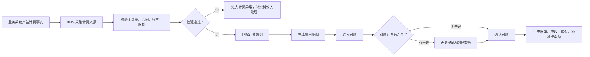

# 08-BMS费用结算业务流程

> 本文用于统一说明 BMS 如何消费采购、销售出库、调拨、售后退货、供应商退货、WMS 作业和 TMS 物流费用来源，生成费用明细、对账、账单、应收应付和索赔依据。

## 1. 流程目标

BMS 的目标是：把业务事实转换为可对账、可结算、可追溯的费用结果，避免只看订单金额或只看物流单费用导致账务不完整。

```text
业务事实产生
  -> BMS 采集计费来源
  -> 匹配合同/计费规则/税率/账期
  -> 生成费用明细
  -> 对账确认
  -> 形成账单、应收、应付、索赔或冲减
```

## 2. 适用场景

| 场景 | 计费来源 | BMS 输出 |
| --- | --- | --- |
| 采购入库 | 采购价格、入库上架事实、采购运输费用来源 | 采购应付、入库作业费、采购运输费 |
| 销售出库 | 出库作业事实、包裹重量体积、销售运单费用来源 | 出库作业费、销售物流费、客户费用 |
| 调拨 | 调出作业、调入作业、调拨运输费用来源 | 内部成本、仓储作业费、调拨运费 |
| 售后退货 | 退款结果、退货质检结果、退货运输费用来源 | 退款、应收冲减、退货运费、补偿费 |
| 供应商退货 | 退供出库、供应商签收、退供物流费用来源 | 应付冲减、索赔、扣款、退供运费 |
| TMS 物流 | 运单、轨迹、签收、异常、费用来源 | 承运商对账、索赔、赔付、费用调整 |

## 3. 参与系统

| 系统 | 参与原因 | 主要处理内容 | 主要数据变化 |
| --- | --- | --- | --- |
| 主数据系统 | 提供计费基础 | 客户、货主、供应商、仓库、物流商、税率、币种、计费属性 | 计费规则引用和快照 |
| 采购系统 | 提供采购价格和退供结果 | 采购应付、退供冲减、索赔 | 应付依据 |
| OMS/售后系统 | 提供销售、退款和售后结果 | 应收、退款、补偿 | 销售费用和退款依据 |
| WMS 系统 | 提供仓内作业事实 | 入库、出库、拣货、打包、上架、退货质检 | 作业计费来源 |
| TMS 系统 | 提供物流费用来源 | 运单、重量体积、线路、签收、异常、责任方 | 物流费用来源 |
| 中央库存系统 | 提供库存变化和成本依据 | 入库、出库、调拨、报损 | 成本和库存账务依据 |
| BMS 系统 | 费用事实源 | 采集、计费、对账、账单、冲减、索赔 | 费用明细、对账单、账单 |

## 4. 关键业务数据

| 数据对象 | 谁创建 | 谁修改 | 关键字段 | 主要状态 |
| --- | --- | --- | --- | --- |
| 计费来源 | 采购/OMS/WMS/TMS/库存 | BMS | 来源系统、来源单号、费用场景、业务发生时间、数量/重量/金额 | 待采集、已采集、异常 |
| 费用明细 | BMS | BMS/财务 | 费用项、计费对象、金额、税率、币种、责任方 | 待生成、已生成、待对账、已调整 |
| 对账单 | BMS | 结算专员、对方系统 | 对账对象、账期、费用明细、差异金额 | 待对账、对账中、有差异、已确认 |
| 账单 | BMS | 财务 | 应收/应付对象、金额、税额、账期 | 待开票、已开票、已结算 |
| 索赔/扣款 | BMS | 结算专员 | 责任方、原因、关联运单/单据、金额 | 待确认、已确认、已冲减、已关闭 |

## 5. 主流程



## 6. 分步骤数据变化

| 步骤 | 发起角色/系统 | 处理系统 | 被修改的数据 | 数据如何变化 |
| --- | --- | --- | --- | --- |
| 采集计费来源 | 采购/OMS/WMS/TMS/库存 | BMS | 计费来源 | 新增来源记录，保存来源系统、来源单号、数量金额和业务时间 |
| 校验计费基础 | BMS | BMS | 计费来源 | 校验客户、货主、供应商、物流商、合同、税率、币种 |
| 生成费用明细 | BMS | BMS | 费用明细 | 按规则计算金额、税额、责任方和账期 |
| 对账 | 结算专员/对方系统 | BMS | 对账单、费用明细 | 汇总账期费用，标记确认或差异 |
| 差异处理 | 结算专员 | BMS、TMS、WMS、采购/OMS | 差异记录、费用明细 | 调整金额、发起索赔、退回重算或关闭差异 |
| 生成账单 | BMS/财务 | BMS/财务 | 账单、应收、应付 | 确认账单金额，进入开票或付款流程 |

## 7. 异常场景

| 异常 | 发生位置 | 影响数据 | 处理方式 |
| --- | --- | --- | --- |
| 计费来源缺失 | BMS | 费用明细 | 按来源单补拉或人工补录 |
| 主数据缺失 | BMS/主数据 | 计费来源 | 补充客户、供应商、物流商、税率或计费属性后重算 |
| 合同规则缺失 | BMS | 费用明细 | 暂停计费，补合同或配置默认规则 |
| 物流费用差异 | TMS/BMS | 物流费用来源、费用明细 | 和承运商对账，调整、索赔或赔付 |
| 作业数量差异 | WMS/BMS | 作业费用 | 按 WMS 作业事实重算或人工确认 |
| 重复计费 | BMS | 费用明细 | 按来源单号 + 费用项 + 账期幂等，冲销重复费用 |
| 账单已确认后发现差异 | BMS/财务 | 账单、调整单 | 生成调整单、红冲、补收或补付 |

## 8. 业务规则与协同边界

| 检查项 | 设计口径 |
| --- | --- |
| 上游前置 | 客户、货主、供应商、仓库、物流商、商品计费属性、税率、币种、合同、账期必须可用 |
| 核心边界 | BMS 拥有费用明细、对账单和账单；业务系统只提供计费事实，不直接生成最终账单 |
| 关键事件 | 计费来源已采集、费用已生成、费用生成失败、对账已确认、对账差异已发生、账单已生成、索赔已确认 |
| 费用规则 | 同一业务事实可产生多类费用，但每类费用都必须有来源单据、费用项、责任方和账期 |
| 幂等规则 | 费用生成按来源系统 + 来源单号 + 来源行 + 费用项 + 账期幂等 |
| 权限审计 | 费用调整、差异确认、索赔确认、账单作废、红冲、人工补录必须记录操作人、原因和前后金额 |

