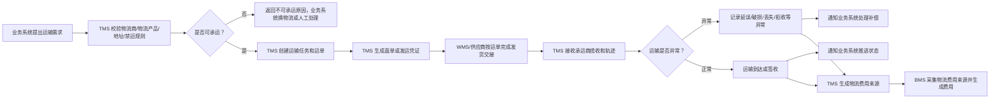
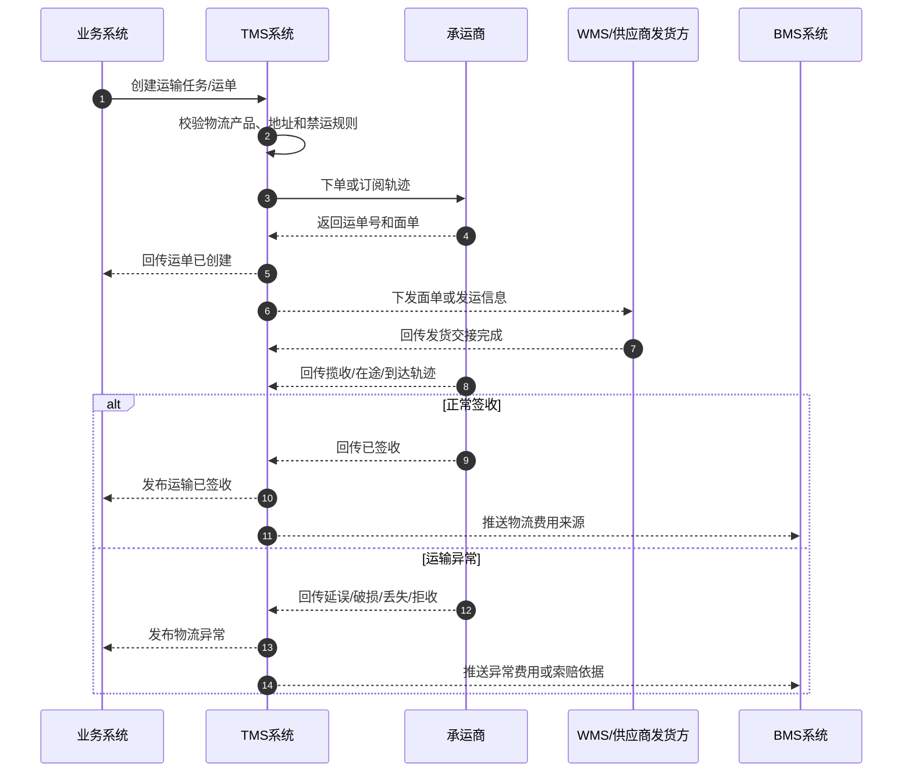

# 08 TMS运输协同业务流程

> 本文用于统一说明 TMS 在供应链主流程中的位置。采购收货、销售发货、售后退货、供应商退货、调拨、物流费用都需要运输信息。TMS 是运输事实源，负责运输任务、运单、面单、轨迹、签收、异常和物流费用来源事实；OMS、采购、供应商、WMS、中央库存、BMS 不能直接修改 TMS 拥有的运输事实。

## 1. 流程目标

TMS 的目标是：把业务系统的“需要运输”转换成可执行、可追踪、可结算的运输任务，让系统能够知道货物从哪里发出、由谁承运、当前在哪里、是否到达、是否签收、是否异常，以及物流费用依据是什么。

```text
业务系统提出运输需求
  -> TMS 校验物流商、物流产品、地址和禁运规则
  -> 创建运输任务和运单
  -> WMS 或供应商按运单发货交接
  -> TMS 跟踪揽收、在途、到达、签收或异常
  -> 业务系统根据运输事实推进状态
  -> BMS 根据物流费用来源事实生成费用明细
```

## 2. 适用场景

| 场景      | 发起方        | TMS 处理内容                                    | 回传给谁                     |
| ------- | ---------- | ------------------------------------------- | ------------------------ |
| 采购入库运输  | 供应商系统、采购系统 | 根据 ASN 或发货信息创建采购运输任务，跟踪供应商到仓                | 采购、WMS、BMS               |
| 销售出库配送  | OMS、WMS    | 创建销售运单和面单，接收包裹交接，跟踪揽收、签收和异常                 | OMS、WMS、BMS、渠道           |
| 售后退货运输  | OMS/售后系统   | 创建退货取件或客户寄回运单，跟踪退货到仓                        | OMS、WMS、BMS              |
| 供应商退货运输 | 采购系统、WMS   | 创建退供运单，跟踪供应商签收、拒收、破损、丢失                     | 采购、供应商系统、WMS、BMS         |
| 调拨运输    | 调拨系统、WMS   | 创建仓间调拨运输任务，跟踪在途和到达                          | 调拨系统、调出仓 WMS、调入仓 WMS、BMS |
| 物流费用采集  | TMS        | 生成物流费用来源事实，包含承运商、物流产品、重量、体积、线路、计费里程、签收或异常结果 | BMS                      |

## 3. 参与系统

| 系统 | 参与原因 | 主要处理内容 | 主要数据变化 |
| --- | --- | --- | --- |
| 主数据系统 | 提供物流基础资料 | 物流商、物流产品、服务区域、地址、禁运规则、包装重量体积 | TMS 缓存物流主数据版本 |
| OMS 系统 | 销售履约和售后编排 | 发起销售配送、退货取件、物流取消、轨迹查询 | 订单物流快照、签收状态、物流异常 |
| 采购系统 | 采购到货和退供编排 | 发起采购送货跟踪、退供运输、供应商签收确认 | 采购到货进度、退供状态 |
| 供应商系统 | 供应商发货和退供协同 | 提供 ASN 发运信息，接收退供签收和差异 | ASN 发运信息、供应商签收结果 |
| WMS 系统 | 发货交接和到货接收 | 打印面单、包裹交接、称重体积、到货登记 | 包裹、发货交接、到货记录 |
| TMS 系统 | 运输执行事实源 | 创建运输任务、运单、面单、轨迹、签收、异常、费用来源 | 运输任务、运单、轨迹、签收记录、物流异常、费用来源 |
| BMS 系统 | 物流费用结算 | 消费物流费用来源事实，生成费用明细、对账和账单 | 物流费用明细、承运商对账 |

## 4. 关键业务数据

| 数据对象 | 谁创建 | 谁修改 | 关键字段 | 主要状态 |
| --- | --- | --- | --- | --- |
| 运输任务 | TMS | TMS、物流专员 | 运输任务号、来源系统、来源单号、运输场景、起点、终点、承运商、物流产品 | 待创建运单、已创建、已取消、异常关闭 |
| 运单 | TMS | TMS、承运商回调 | 运单号、承运商、物流产品、寄件地址、收件地址、预计到达时间、费用归属 | 待发运、已发运、已揽收、在途、已到达、已签收、拒收、异常 |
| 面单 | TMS | TMS、WMS | 面单号、运单号、面单模板、打印状态、打印次数 | 待生成、已生成、已打印、已作废 |
| 物流轨迹 | 承运商/TMS | TMS | 运单号、轨迹节点、轨迹时间、地点、说明、来源 | 已追加 |
| 签收记录 | 承运商/TMS | TMS | 运单号、签收时间、签收人、签收凭证、签收数量 | 已签收、拒收、部分签收 |
| 物流异常 | TMS | TMS、物流专员 | 异常类型、责任方、影响单据、处理方案、赔付状态 | 待处理、处理中、已处理、已关闭 |
| 物流费用来源 | TMS | TMS、BMS | 运单号、承运商、物流产品、重量、体积、件数、线路、费用项、费用归属 | 待采集、已采集、已推送、已计费 |

## 5. 主流程



## 6. 分步骤数据变化

| 步骤 | 发起角色/系统 | 处理系统 | 被修改的数据 | 数据如何变化 |
| --- | --- | --- | --- | --- |
| 提出运输需求 | OMS/采购/供应商/WMS/调拨系统 | TMS | 运输任务 | 新增运输任务，记录来源系统、来源单号和运输场景 |
| 校验承运能力 | TMS | TMS | 运输任务 | 校验物流商、产品、地址、禁运、时效，失败则记录原因 |
| 创建运单/面单 | TMS | TMS | 运单、面单 | 生成运单号、面单号、承运商、预计到达时间 |
| 发货交接 | WMS/供应商 | WMS、TMS | 包裹、运单 | 包裹绑定运单，运单进入已发运或已揽收 |
| 轨迹回传 | 承运商/TMS | TMS | 物流轨迹、运单 | 追加轨迹节点，更新在途、到达、签收或异常状态 |
| 异常登记 | TMS/承运商 | TMS | 物流异常、运单 | 记录延误、破损、丢失、拒收、地址异常等 |
| 签收回传 | 承运商/TMS | TMS | 签收记录、运单 | 运单进入已签收、拒收或部分签收 |
| 费用来源生成 | TMS | TMS、BMS | 物流费用来源 | 根据重量、体积、件数、线路、物流产品生成费用来源 |
| 费用生成 | BMS | BMS | 费用明细 | 按物流费用来源匹配计费规则，生成物流费用明细 |

## 7. TMS 和其它系统的协作

| 业务系统 | 何时调用 TMS | TMS 回传什么 | 业务系统如何处理 |
| --- | --- | --- | --- |
| 采购系统 | 采购订单确认、ASN 发运、采购到货跟踪 | 采购运单、到仓、延误、破损、丢失 | 更新采购到货预期和异常状态 |
| 供应商系统 | 供应商创建 ASN、供应商接收退供 | 发运确认、退供到达、供应商签收 | 更新 ASN 发货、退供签收或差异 |
| OMS 系统 | 销售履约、退货取件、换货补寄 | 运单、面单、签收、物流异常 | 更新订单、履约单、售后单物流状态 |
| WMS 系统 | 打单、发货交接、到货登记 | 面单、运单、到仓通知 | 打印面单、绑定包裹、准备收货 |
| 中央库存系统 | 通常不直接调用 TMS | 可订阅签收/到达用于看板，不直接改库存 | 库存仍以 WMS 上架/发货事实入账 |
| BMS 系统 | 物流费用采集、承运商对账 | 物流费用来源、签收、异常、责任方 | 生成物流费、索赔、赔付或费用调整 |

## 8. 异常场景

| 异常 | 发生位置 | 影响数据 | 处理方式 |
| --- | --- | --- | --- |
| 不可承运 | TMS | 运输任务、业务单据 | 返回原因，业务系统换物流产品、换仓、人工处理或取消 |
| 运单创建失败 | TMS/承运商接口 | 运单、履约单、调拨单、退供单 | 重试、切换承运商、人工录入运单 |
| 面单生成失败 | TMS/WMS | 面单、包裹 | 重试生成，换面单模板，人工补打 |
| 轨迹回传延迟 | 承运商/TMS | 运单、业务单据状态 | TMS 轮询补拉，业务系统保留在途状态 |
| 运输延误 | 承运商/TMS | 运单、订单、调拨单、采购到货 | 更新预计到达时间，通知相关人员 |
| 运输破损 | 承运商/TMS/WMS | 运单、收货记录、质检记录、费用 | 到仓按实收实检处理，BMS 记录索赔或扣款 |
| 运输丢失 | 承运商/TMS | 运单、订单、在途库存、退供单 | 进入索赔、补发、退款、报损或异常关闭 |
| 拒收/退回 | 客户/供应商/承运商 | 运单、销售订单、退供单 | OMS/采购决定退回入库、重发、取消或索赔 |
| 物流费用异常 | TMS/BMS | 费用来源、费用明细 | BMS 标记差异，和 TMS/承运商对账后调整 |

## 9. 业务理解要点

1. WMS 发货交接不等于客户、供应商或调入仓已签收；签收事实由 TMS 负责。
2. TMS 不决定库存增减，库存仍以 WMS 上架、发货和中央库存流水为准。
3. TMS 不决定订单能否履约，但物流不可承运会影响 OMS、采购、调拨和退供能否继续推进。
4. 物流费用不应只靠 WMS 包裹重量生成，还要结合 TMS 的承运商、物流产品、线路、轨迹和签收异常。
5. 运输异常会影响客户体验、采购到货、调拨在途、供应商退货闭环和 BMS 索赔结算。

## 10. 运输协同时序图



## 11. TMS 动作链

| 顺序 | 动作 | 来源 | 目标 | 主要数据变化 | 幂等依据 |
| --- | --- | --- | --- | --- | --- |
| 1 | 创建运输任务 | OMS/采购/供应商/WMS/调拨 | TMS | 运输任务：无 -> 待创建运单 | 来源系统 + 来源单号 + 运输场景 + 版本 |
| 2 | 创建运单/面单 | TMS | TMS/承运商 | 运单：无 -> 已创建；面单：无 -> 已生成 | 来源单号 + 物流产品 + 请求号 |
| 3 | 发货交接 | WMS/供应商 | TMS | 运单：已创建 -> 已发运/已揽收 | 运单号 + 交接批次 |
| 4 | 追加轨迹 | 承运商 | TMS | 轨迹新增，运单进入在途/到达/异常 | 运单号 + 轨迹节点 + 发生时间 |
| 5 | 回传签收 | 承运商 | TMS/业务系统 | 运单：在途 -> 已签收/拒收/部分签收 | 运单号 + 签收时间 |
| 6 | 生成物流费用来源 | TMS | BMS | 物流费用来源：待采集 -> 已推送 | 运单号 + 费用项 + 账期 |

## 12. 查漏补缺说明

| 检查项 | 补充口径 |
| --- | --- |
| 上游前置 | 物流商、物流产品、服务区域、禁运规则、地址、包装重量体积、费用合同和回调配置必须已启用 |
| 核心边界 | TMS 拥有运输任务、运单、面单、轨迹、签收、物流异常和物流费用来源；业务系统只消费运输事实推进自身单据 |
| 关键事件 | 运输任务已创建、运单已创建、面单已生成、包裹已交接、运输轨迹已追加、运输已签收、运输异常已发生、物流费用来源已生成 |
| 状态规则 | 运单创建不代表已发运；WMS/供应商交接后才进入已发运/已揽收；签收、拒收、破损、丢失以承运商/TMS 回传为准 |
| 费用规则 | 物流费用来源不是最终账单，BMS 还要根据合同、账期、重量体积、线路、责任方和异常结果生成费用明细 |
| 补偿规则 | 下单失败可重试或换承运商；轨迹延迟要补拉；重复回调要幂等；无法自动判责的破损、丢失、拒收进入人工处理 |
| 幂等规则 | 创建任务、创建运单、面单生成、轨迹追加、签收回传、费用来源生成必须按来源单号/运单号/轨迹节点/请求号幂等 |
| 权限审计 | 手工换承运商、取消运单、补录轨迹、异常关闭、费用调整和索赔处理必须记录操作日志 |
