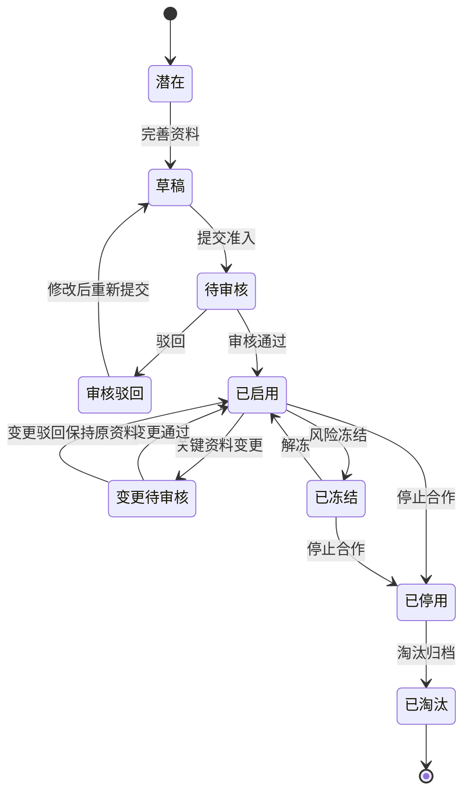
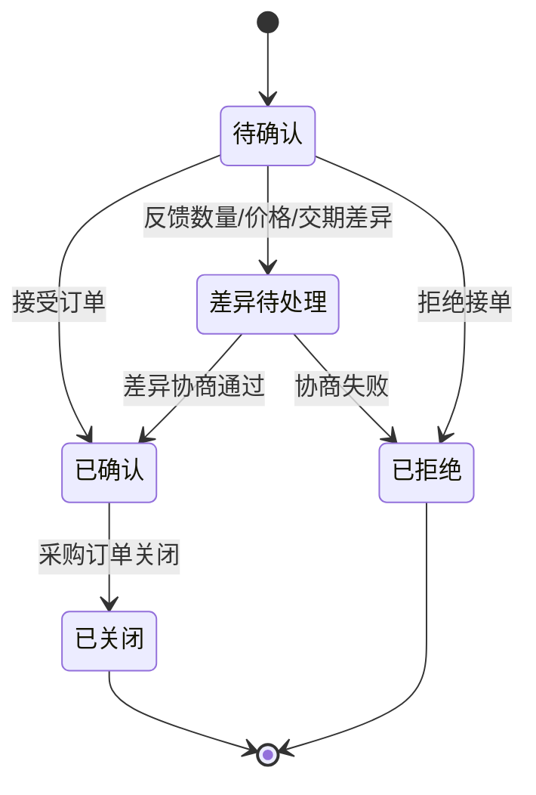
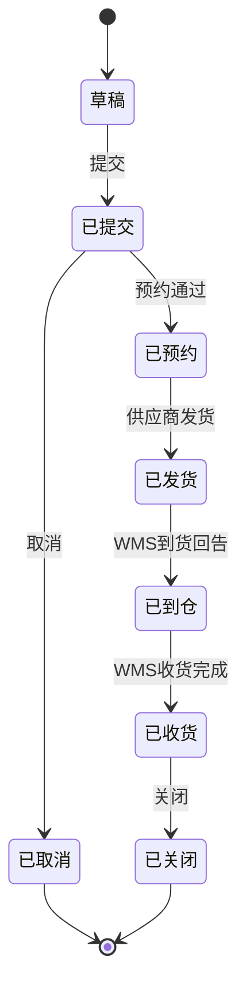
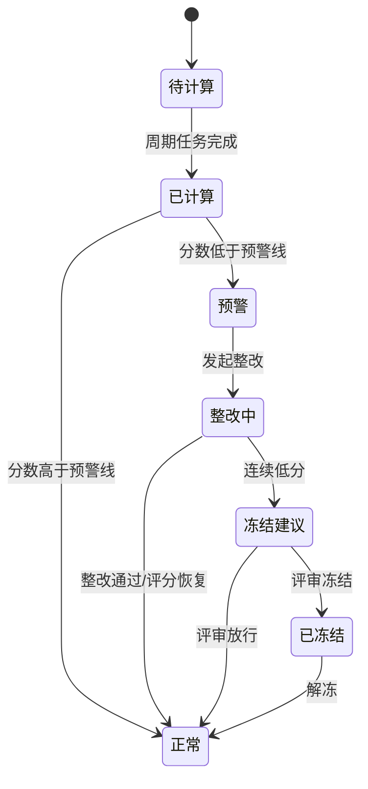
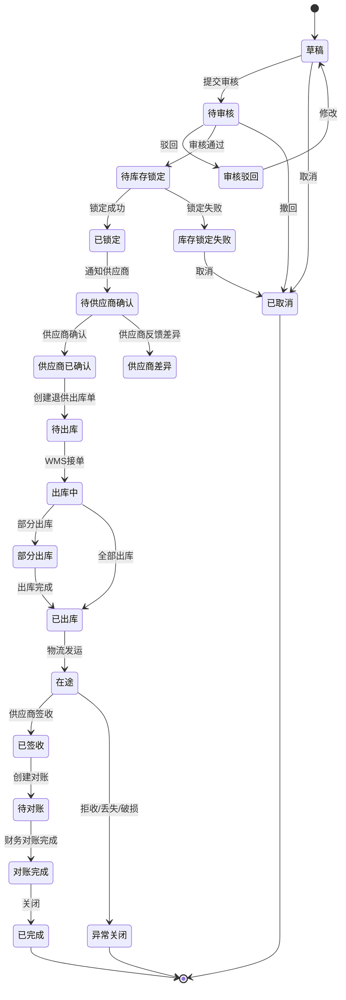

# 01 供应商领域模型

> 本文用于供应商相关领域模型设计，承接 [主数据系统业务流程总览](../../02-业务流程/01-主数据系统业务流程.md)、供应商系统产品功能设计、采购系统产品功能设计和 [供应商退货业务流程](../../02-业务流程/07-2-供应商退货业务流程.md)。本文不只覆盖供应商退货，而是覆盖供应商从准入、供货、协同、交付、质量、结算、评分到退出的完整生命周期。

## 1. 事件风暴

事件风暴先从“已经发生的业务事实”开始，再反推命令、角色、聚合、策略、读模型和异常。

### 1.1 业务目标

供应商领域解决的是：企业如何选择、准入、维护、协同、评价和退出供应商，并保证采购、收货、质量、结算、退供等业务都能使用同一套可追溯的供应商语言。

完整供应商生命周期：

```text
供应商寻源
  -> 供应商准入
  -> 供应商档案/资质/结算资料启用
  -> 维护供货关系、报价、合同和供货条件
  -> 采购订单协同
  -> ASN/送货协同
  -> 收货质检和质量协同
  -> 对账、发票和结算协同
  -> 绩效评分、整改、冻结或淘汰
  -> 必要时退供应商
```

### 1.2 事件风暴总表

| 阶段 | 角色/系统 | 命令 | 处理对象 | 领域事件 | 策略/后续动作 | 读模型 | 异常 |
| --- | --- | --- | --- | --- | --- | --- | --- |
| 寻源 | 采购/寻源人员 | 创建潜在供应商 | 供应商候选 | 潜在供应商已创建 | 进入资料收集 | 供应商池 | 重复供应商、黑名单 |
| 准入 | 采购/质量/财务 | 提交供应商准入 | 供应商档案 | 供应商准入已提交 | 触发采购、质量、财务审核 | 准入审批列表 | 资质缺失、税号重复、账户风险 |
| 审核 | 采购主管/质量/财务 | 审核供应商 | 供应商档案、资质、结算资料 | 供应商已启用 / 供应商准入已驳回 | 启用后发布主数据事件 | 供应商档案 | 审核不通过、资料退回 |
| 资料变更 | 供应商/采购/财务 | 申请供应商资料变更 | 供应商档案 | 供应商资料变更已提交 / 供应商资料变更已生效 | 关键资料需重新审核 | 供应商变更记录 | 银行账户变更风险 |
| 供货关系 | 采购员 | 启用供应商商品 | 供应商商品关系 | 供应商商品已启用 | 采购可选该供应商和 SKU | 可供 SKU 列表 | SKU 未启用、MOQ 不合法 |
| 报价 | 供应商/采购 | 提交报价、确认价格 | 供应商报价/价格协议 | 供应商报价已提交 / 采购价格已确认 | 价格用于采购订单 | 报价比价看板 | 价格过期、币种税率不一致 |
| 合同 | 采购/法务/供应商 | 签署供应商合同 | 供应商合同 | 供应商合同已生效 | 合同条款约束采购、交付、结算、质量 | 合同台账 | 合同到期、条款缺失 |
| 订单协同 | 供应商业务员 | 确认采购订单 | 采购订单确认 | 供应商订单已确认 / 供应商订单差异已反馈 / 供应商订单已拒绝 | 采购系统处理确认或差异 | 订单协同看板 | 数量、价格、交期差异 |
| ASN | 供应商业务员 | 创建 ASN/送货预约 | ASN | ASN 已提交 / ASN 已发货 / ASN 已取消 | WMS 准备收货 | ASN 看板 | 超量发货、预约失败、重复 ASN |
| 收货质检 | WMS/质量 | 回传收货和质检结果 | 绩效事实、质量问题 | 收货已完成 / 质检已完成 / 质量异常已产生 | 写入评分事实，必要时发起整改或退供 | 质量看板 | 不合格、短收、超收、错货 |
| 质量整改 | 质量人员/供应商 | 发起整改、提交整改 | 质量问题/整改单 | 供应商整改已发起 / 供应商整改已通过 | 更新供应商质量状态和评分 | 整改看板 | 逾期未整改、整改无效 |
| 对账 | BMS/供应商财务 | 确认对账、上传发票 | 供应商对账 | 供应商对账已确认 / 供应商发票已上传 / 对账差异已反馈 | 财务处理应付和付款 | 对账看板 | 金额差异、发票异常 |
| 评分 | 评分任务/采购经理 | 计算供应商评分 | 供应商评分 | 供应商评分已更新 / 供应商评分预警已产生 | 低分触发整改、冻结建议或评审 | 评分看板 | 数据不足、权重配置错误 |
| 退供 | 采购/质量/库存 | 创建退供应商单 | 退供应商单 | 退供已审核 / 退供已出库 / 供应商已签收 | 库存扣减，应付冲减或索赔 | 退供追踪 | 拒收、运输丢失、对账争议 |
| 冻结退出 | 采购经理/风控 | 冻结、停用、淘汰供应商 | 供应商档案 | 供应商已冻结 / 供应商已停用 / 供应商已淘汰 | 禁止新业务，保留存量处理 | 风险供应商看板 | 未完订单、未结算、未退供 |

### 1.3 通用语言

| 术语 | 定义 | 所属上下文 |
| --- | --- | --- |
| 供应商 | 可以向企业提供商品或服务的外部主体 | 供应商主数据 |
| 潜在供应商 | 尚未准入，只处于寻源或资料收集阶段的供应商 | 供应商准入 |
| 准入 | 供应商通过采购、质量、财务等审核并可被业务引用的过程 | 供应商准入 |
| 供应商商品 | 某供应商可供某 SKU 的关系和供货条件 | 供货关系 |
| 报价 | 供应商对 SKU、数量、交期、税率、币种的价格承诺 | 报价/价格 |
| 价格协议 | 经采购确认后可用于下单的价格规则 | 报价/价格 |
| 采购订单确认 | 供应商对采购订单数量、价格、交期的确认或差异反馈 | 订单协同 |
| ASN | 供应商发货前提交的到货预告或送货预约 | ASN 协同 |
| 供应商绩效 | 基于质量、价格、交付、响应、异常、对账等事实计算的评价结果 | 绩效评分 |
| 退供应商 | 企业把不良、滞销、召回或可退供商品退回供应商的过程 | 退供协同 |

## 2. 子域、限界上下文、上下文映射、核心域

### 2.1 子域划分

| 子域 | 类型 | 说明 | 建模策略 |
| --- | --- | --- | --- |
| 供应商准入与主数据 | 核心域 | 决定谁能成为供应商、能否启用、资料是否可信 | 深入建模供应商档案、资质、状态、变更审批 |
| 供应商供货关系 | 核心域 | 决定供应商能供哪些 SKU、MOQ、交期、采购单位、供货状态 | 深入建模供应商商品和价格协议 |
| 供应商协同 | 核心域 | 供应商确认采购订单、创建 ASN、反馈差异、处理退供和对账 | 深入建模订单确认、ASN、退供确认、对账确认 |
| 供应商绩效与风险 | 核心域 | 根据质量、价格、交付、响应、异常计算评分，支持冻结和淘汰 | 深入建模评分、评分事实、整改、风险状态 |
| 采购 | 支撑域 | 发起询价、采购订单和退供申请 | 与供应商领域通过命令和事件协作 |
| 仓储/WMS | 支撑域 | 提供收货、质检、退供出库等实物事实 | 供应商领域消费其事实生成绩效和协同状态 |
| BMS/财务 | 支撑域 | 供应商对账、发票、应付、索赔和付款 | 财务事实不由供应商领域直接创造 |
| 主数据、权限、消息 | 通用域 | 编码、组织、用户、权限、通知、附件、日志 | 复用通用能力 |

### 2.2 限界上下文模板

```markdown
上下文名称：供应商领域上下文
子域类型：核心域
业务目标：管理供应商从寻源、准入、供货、协同、质量、绩效、结算协作到冻结退出的完整生命周期。
负责范围：供应商档案生命周期、供应商资质、供应商商品、报价/价格协议、采购订单确认、ASN 协同、质量整改、绩效评分、退供协同、对账确认协同、冻结停用。
不负责范围：不创建采购需求和采购订单；不执行仓内收货/上架/出库；不持有库存余额；不生成财务凭证和付款；不维护商品主数据。
核心角色：采购员、采购经理、供应商业务员、供应商财务、供应商质量、质量人员、财务人员、系统管理员。
通用语言：供应商、准入、资质、供应商商品、报价、价格协议、采购订单确认、ASN、质量问题、整改、绩效评分、退供确认、对账确认、冻结、停用。
核心聚合：供应商、供应商商品、供应商报价、供应商合同、采购订单确认、ASN、供应商质量问题、供应商评分、供应商对账确认、退供应商单。
数据主权：供应商协同状态、供应商评分、供应商整改、供应商系统内的协同结果和供应商资料快照。
上游上下文：主数据、采购、WMS、BMS/财务、TMS、质量。
下游上下文：采购、WMS、BMS/财务、报表、权限、消息通知。
同步命令/接口：提交准入、审核供应商、维护供货关系、提交报价、确认采购订单、提交 ASN、提交整改、确认对账、确认退供。
生产事件：供应商已启用、供应商商品已启用、供应商报价已提交、供应商订单已确认、ASN已提交、供应商整改已提交、供应商评分已更新、供应商对账已确认、供应商已冻结。
消费事件：SKU已启用、采购订单已发布、WMS收货已完成、质检已完成、退供已出库、对账单已生成、应付已完成。
一致性要求：供应商聚合内部强一致；跨采购、库存、仓储、财务上下文最终一致；协同结果通过事件反馈。
异常补偿：准入驳回、资料变更驳回、订单差异、ASN取消、质量整改逾期、对账差异、退供拒收、低分冻结。
主要风险：供应商资料不可信、低质供应商继续下单、报价与订单价格不一致、重复 ASN、评分不可追溯、冻结后存量业务中断。
```

### 2.3 上下文映射

| 上游上下文 | 下游上下文 | 映射关系 | 协作方式 | 说明 |
| --- | --- | --- | --- | --- |
| 主数据 | 供应商领域 | 遵奉者、防腐层 | 供应商领域消费供应商、SKU、组织、仓库等主数据事件，并保存必要快照 | 主数据是基础资料权威 |
| 供应商领域 | 采购 | 合作关系、发布语言 | 供应商确认、拒绝、报价、评分、退供确认以事件反馈采购 | 采购不直接修改供应商协同结果 |
| 采购 | 供应商领域 | 客户/供应商关系 | 采购发布订单、询价、退供请求，供应商领域生成待办 | 采购是采购意图权威 |
| 供应商领域 | WMS | 客户/供应商关系 | 供应商提交 ASN，WMS 消费形成收货预期；WMS 回传收货质检事实 | WMS 是实物事实权威 |
| WMS/质量 | 供应商领域 | 发布语言 | 收货、质检、不良、退供出库事件进入绩效和质量协同 | 评分必须可追溯事实来源 |
| BMS/财务 | 供应商领域 | 客户/供应商关系 | BMS 发布对账单，供应商确认或反馈差异 | 财务是应付和发票事实权威 |
| 供应商领域 | 权限系统 | 遵奉者 | 供应商用户账号和角色来自权限系统，供应商领域校验绑定关系 | 供应商只能访问自己的数据 |

### 2.4 核心域精炼

供应商领域的核心复杂度集中在：

1. 供应商是否可信：准入、资质、收款账户、状态、黑名单、冻结。
2. 供应商能供什么：供应商商品、MOQ、交期、价格、合同、供货状态。
3. 供应商如何协同：订单确认、差异反馈、ASN、退供、对账、发票。
4. 供应商表现如何：质量、价格、交付、响应、异常、对账的评分和整改。
5. 供应商风险如何控制：低分预警、整改、冻结、停用、淘汰和存量业务处理。

## 3. 实体、值对象、聚合

### 3.1 实体

| 实体 | 身份 | 生命周期 | 关键字段 | 说明 |
| --- | --- | --- | --- | --- |
| 供应商 | `supplier_id` / `supplier_code` | 潜在 -> 待准入 -> 已启用 -> 冻结 -> 停用/淘汰 | 名称、税号、类型、等级、状态、版本 | 供应商生命周期聚合根 |
| 供应商资质 | `qualification_id` | 待提交 -> 待审核 -> 有效 -> 即将到期 -> 已过期/驳回 | 证照类型、证照号、有效期、附件 | 供应商聚合内部实体 |
| 供应商联系人 | `contact_id` | 启用/停用 | 姓名、角色、手机、邮箱 | 业务、财务、质量、物流联系人 |
| 供应商地址 | `address_id` | 启用/停用 | 地址类型、联系人、电话、详细地址 | 注册、发货、退货、开票地址 |
| 供应商结算资料 | `settlement_id` | 待审核 -> 已启用 -> 变更待审 -> 停用 | 税号、银行账户、账期、发票类型 | 财务敏感信息 |
| 供应商商品 | `supplier_sku_id` | 待启用 -> 可供 -> 暂停 -> 停供 | SKU、供应商 SKU、MOQ、交期、供货状态 | 表示供应商供货能力 |
| 供应商报价 | `quotation_id` | 草稿 -> 已提交 -> 已采纳/已拒绝/已过期 | SKU、价格、税率、币种、有效期 | 供应商报价事实 |
| 价格协议 | `price_agreement_id` | 待生效 -> 生效中 -> 已失效 | SKU、价格、税率、生效期 | 采购下单价格依据 |
| 采购订单确认 | `confirm_id` | 待确认 -> 已确认/差异/拒绝 -> 已关闭 | PO、确认数量、交期、差异原因 | 供应商订单协同 |
| ASN | `asn_id` / `asn_no` | 草稿 -> 已提交 -> 已预约 -> 已发货 -> 已到仓 -> 已收货/已取消 | PO、SKU、数量、ETA、运单 | 到货预告 |
| 质量问题 | `quality_issue_id` | 待处理 -> 整改中 -> 已验证/关闭 | 问题类型、责任、证据、截止时间 | 供应商质量协同 |
| 供应商评分 | `score_id` | 待计算 -> 已计算 -> 预警/正常 -> 整改中/冻结建议 | 周期、维度分、综合分、等级 | 供应商绩效结果 |
| 供应商对账确认 | `recon_confirm_id` | 待确认 -> 已确认/差异 -> 已关闭 | 对账单、金额、发票、差异 | 供应商财务协同 |
| 退供应商单 | `supplier_return_no` | 草稿 -> 已审核 -> 已锁定 -> 已出库 -> 已签收 -> 已关闭 | 退供原因、数量、签收、对账 | 退供协同 |

### 3.2 值对象

| 值对象 | 字段 | 校验规则 | 说明 |
| --- | --- | --- | --- |
| 供应商编码 | 编码 | 全局唯一，不可随意变更 | 供应商业务身份 |
| 税务身份 | 主体名称、税号、发票类型 | 税号唯一性校验 | 财务和发票识别 |
| 地址 | 省市区、详细地址、联系人、电话 | 地址类型必须明确 | 发货、退货、开票 |
| 联系方式 | 姓名、手机号、邮箱、角色 | 手机/邮箱格式校验 | 协同通知 |
| 资质有效期 | 生效日、失效日、预警天数 | 失效日不能早于生效日 | 资质到期预警 |
| 供货条件 | MOQ、MPQ、交期、采购单位 | 数量非负，单位可换算 | 下单校验 |
| 价格 | 金额、币种、税率、生效期 | 金额非负，生效期有效 | 报价和价格协议 |
| 评分 | 总分、维度分、等级 | 分值 0 到 100 | 绩效评分 |
| 责任判定 | 责任方、原因、证据 | 责任方枚举 | 质量、退供、索赔 |

### 3.3 聚合总览

| 聚合 | 聚合根 | 内部实体 | 主要不变量 |
| --- | --- | --- | --- |
| 供应商聚合 | 供应商 | 资质、联系人、地址、结算资料 | 未启用不能新建采购业务；关键资料变更需审核；冻结后禁止新业务但允许存量处理 |
| 供应商商品聚合 | 供应商商品 | 供货条件、价格快照 | 供应商和 SKU 必须有效；MOQ/MPQ/交期必须合法；停供后不能新下单 |
| 供应商报价聚合 | 供应商报价 | 报价行、价格协议 | 报价有效期内才可采纳；已采纳价格不能被静默覆盖 |
| 采购订单确认聚合 | 采购订单确认 | 确认行、差异记录 | 确认数量不能超过订单数量；差异只反馈，不直接改采购订单 |
| ASN 聚合 | ASN | ASN 行、包装/物流信息 | ASN 数量不能超过订单剩余可发数量；已发货 ASN 不能直接删除 |
| 供应商质量问题聚合 | 质量问题 | 整改记录、附件、验证记录 | 整改关闭必须有验证结论；逾期影响评分 |
| 供应商评分聚合 | 供应商评分 | 评分明细、绩效事实、整改建议 | 评分必须可追溯来源事实；人工修正必须留痕 |
| 供应商对账确认聚合 | 供应商对账确认 | 差异记录、发票附件 | 对账确认不直接生成付款；差异需反馈财务 |
| 退供应商单聚合 | 退供应商单 | 退供行、供应商确认、发运、对账、差异 | 未锁定不能出库；出库后扣库存；签收和对账闭环后关闭 |

## 4. 聚合根、领域服务、资源库、领域事件

### 4.1 聚合模板：供应商聚合

```markdown
聚合根：供应商
所属上下文：供应商领域上下文
业务职责：管理供应商准入、档案、资质、联系人、地址、结算资料、合作状态、冻结停用和历史版本。
唯一标识：supplier_id / supplier_code
内部实体：供应商资质、供应商联系人、供应商地址、供应商结算资料、供应商变更记录。
值对象：供应商编码、税务身份、地址、联系方式、资质有效期。
生命周期状态：潜在、草稿、待审核、审核驳回、已启用、变更待审核、已冻结、已停用、已淘汰。
对外行为：提交准入、审核通过、审核驳回、申请资料变更、审核资料变更、冻结、解冻、停用、淘汰。
业务不变量：未启用不能新下单；关键资料变更必须审批；冻结不能新建业务；停用前必须处理未完订单、未结算、未退供。
生产事件：供应商准入已提交、供应商已启用、供应商资料变更已生效、供应商已冻结、供应商已停用。
消费事件：供应商黑名单已命中、供应商评分预警已产生、供应商资质即将到期。
资源库：供应商资源库。
并发控制：supplier_id + version_no。
异常处理：资料驳回、资质过期、账户风险、重复供应商、冻结后存量业务处理。
```

### 4.2 聚合模板：供应商商品聚合

```markdown
聚合根：供应商商品
所属上下文：供应商领域上下文
业务职责：管理供应商和 SKU 的供货关系、供应商 SKU、MOQ、MPQ、交期、供货状态和生效期。
唯一标识：supplier_sku_id
内部实体：供货条件、供货状态变更记录。
值对象：供货条件、SKU 快照、供应商编码。
生命周期状态：待启用、可供、暂停、停供、已失效。
对外行为：启用供货关系、修改供货条件、暂停供货、恢复供货、停供。
业务不变量：供应商必须启用；SKU 必须启用；MOQ/MPQ 不能小于 0；采购单位必须可换算库存单位。
生产事件：供应商商品已启用、供应商商品供货条件已变更、供应商商品已暂停、供应商商品已停供。
消费事件：SKU已启用、SKU已停用、供应商已冻结、供应商已停用。
资源库：供应商商品资源库。
并发控制：supplier_sku_id + version_no。
异常处理：SKU 停用后暂停供货；供应商冻结后禁止新业务。
```

### 4.3 聚合模板：采购订单确认聚合

```markdown
聚合根：采购订单确认
所属上下文：供应商领域上下文
业务职责：管理供应商对采购订单的确认、拒绝、数量/价格/交期差异反馈。
唯一标识：confirm_no
内部实体：确认行、差异记录。
值对象：数量、交期、差异原因。
生命周期状态：待确认、已确认、差异待处理、已拒绝、已关闭。
对外行为：确认订单、拒绝订单、反馈差异、关闭确认。
业务不变量：确认数量不能超过采购订单数量；差异反馈不能直接修改采购订单；关闭后不能再确认。
生产事件：供应商订单已确认、供应商订单已拒绝、供应商订单差异已反馈。
消费事件：采购订单已发布、采购订单已取消、采购订单已关闭。
资源库：采购订单确认资源库。
并发控制：confirm_no + version_no；来源采购订单版本号。
异常处理：订单取消关闭待办；重复确认按幂等处理。
```

### 4.4 聚合模板：ASN 聚合

```markdown
聚合根：ASN
所属上下文：供应商领域上下文
业务职责：管理供应商送货预告、预约、发货、取消和 WMS 收货回告。
唯一标识：asn_no
内部实体：ASN 行、包装信息、物流信息。
值对象：数量、预计到仓时间、包装、运单。
生命周期状态：草稿、已提交、已预约、已发货、已到仓、已收货、已取消、已关闭。
对外行为：创建草稿、提交 ASN、修改 ASN、取消 ASN、确认发货、记录到仓和收货结果。
业务不变量：ASN 数量不能超过采购订单剩余可发数量；已发货后不能直接取消；ASN 必须绑定已确认采购订单。
生产事件：ASN已提交、ASN已取消、ASN已发货。
消费事件：采购订单已确认、WMS到货已登记、WMS收货已完成。
资源库：ASN资源库。
并发控制：asn_no + version_no。
异常处理：预约失败退回修改；WMS 实收差异进入绩效事实。
```

### 4.5 聚合模板：供应商评分聚合

```markdown
聚合根：供应商评分
所属上下文：供应商领域上下文
业务职责：汇总质量、价格、交付、响应、异常、对账等事实，计算供应商周期评分和风险等级。
唯一标识：score_id
内部实体：评分明细、绩效事实、人工修正、整改建议。
值对象：评分、评分周期、评分权重、评分等级。
生命周期状态：待计算、已计算、正常、预警、整改中、冻结建议、已冻结。
对外行为：采集事实、计算评分、人工修正、发起整改、生成冻结建议。
业务不变量：评分必须可追溯来源事实；权重合计必须有效；人工修正必须有审批和原因。
生产事件：供应商评分已更新、供应商评分预警已产生、供应商整改已发起。
消费事件：质检已完成、收货已完成、采购价格已确认、退供已关闭、对账已确认、订单已完成。
资源库：供应商评分资源库。
并发控制：supplier_id + score_period + version_no。
异常处理：数据不足使用基准分；低分触发整改或冻结建议。
```

### 4.6 聚合模板：退供应商单聚合

```markdown
聚合根：退供应商单
所属上下文：供应商领域上下文 / 退供协同子上下文
业务职责：管理退供申请、审核、库存锁定、供应商确认、退供出库、签收、对账、差异和关闭。
唯一标识：supplier_return_no
内部实体：退供行、供应商确认、退供发运、退供对账、退供差异。
值对象：退供原因、数量、金额、供应商退货地址、SKU 快照、批次属性、责任判定。
生命周期状态：草稿、待审核、已驳回、待库存锁定、库存锁定失败、已锁定、待供应商确认、供应商差异、供应商已确认、待出库、出库中、部分出库、已出库、在途、已签收、待对账、对账完成、已完成、已取消、异常关闭。
对外行为：提交审核、审核通过、记录库存锁定结果、记录供应商确认、创建退供出库、记录出库结果、记录签收结果、完成对账、异常关闭。
业务不变量：审核不扣库存；未锁定不能出库；实发不能超过锁定；已出库不能取消，只能异常闭环；对账必须基于签收或争议结论。
生产事件：退供应商单已审核、供应商已确认退货、供应商退供差异已反馈、退供已出库、供应商已签收、退供对账已完成、退供应商单已关闭。
消费事件：退供库存已锁定、退供库存锁定失败、退供出库已完成、退供运输异常已发生、应付已冲减、索赔已确认。
资源库：退供应商单资源库。
并发控制：supplier_return_no + version_no。
异常处理：锁定失败调整数量；供应商拒绝释放锁定；已出库拒收走退回入库、索赔、报损或异常关闭。
```

## 5. 领域服务

| 领域服务 | 业务职责 | 为什么不属于单个聚合 | 输入 | 输出 |
| --- | --- | --- | --- | --- |
| 供应商准入判定服务 | 判断供应商是否允许进入准入审核 | 需要综合税号、黑名单、重复主体、资质、财务账户 | 供应商资料、资质、税务身份、黑名单结果 | 可准入/不可准入、原因 |
| 供应商可采购判定服务 | 判断某供应商是否允许被采购订单引用 | 需要综合供应商状态、资质、供货关系、评分风险 | supplier_id、sku_id、采购日期 | 可采购/需审批/禁止 |
| 供应商评分计算服务 | 计算质量、价格、交付、响应、异常、对账分 | 来源事实分散在 WMS、采购、BMS、退供 | 绩效事实、评分规则、周期 | 维度分、总分、等级 |
| 供应商风险控制服务 | 判断是否预警、整改、冻结、淘汰 | 需要综合评分、质量问题、财务风险、资质状态 | 评分、质量问题、资质、未完业务 | 风险等级、建议动作 |
| 退供资格判定服务 | 判断指定商品是否可退供 | 需要质量、库存、采购来源、供应商协议 | SKU、批次、库存状态、退供原因 | 可退/不可退、建议处理 |
| 供应商选择建议服务 | 为采购选供应商提供参考 | 需要价格、评分、交期、质量、历史表现 | SKU、数量、期望交期 | 推荐供应商列表和原因 |

## 6. 资源库

| 资源库 | 面向聚合根 | 主要能力 | 不负责 |
| --- | --- | --- | --- |
| 供应商资源库 | 供应商 | 加载/保存供应商聚合，按版本更新，检查编码唯一性 | 不做供应商列表报表 |
| 供应商商品资源库 | 供应商商品 | 加载/保存供货关系，按供应商+SKU 查询当前有效关系 | 不直接查询商品主数据详情 |
| 供应商报价资源库 | 供应商报价 | 保存报价、采纳报价、查询有效价格协议 | 不做比价报表聚合 |
| 采购订单确认资源库 | 采购订单确认 | 保存供应商确认结果和差异 | 不修改采购订单 |
| ASN资源库 | ASN | 保存 ASN、行、包装和物流信息 | 不修改 WMS 入库单 |
| 供应商评分资源库 | 供应商评分 | 保存周期评分、评分明细和人工修正 | 不直接计算报表 |
| 退供应商单资源库 | 退供应商单 | 保存退供聚合和差异 | 不修改库存余额 |

## 7. 领域事件模板

```markdown
事件名称：供应商已启用
事件含义：供应商已通过准入审核，可以被采购、SRM、财务等业务引用。
来源上下文：供应商领域上下文 / 主数据上下文
来源聚合：供应商
触发动作：审核通过供应商准入
发生时间：启用时间
事件版本：v1
业务主键：supplier_id / supplier_code
事件载荷：供应商编码、名称、类型、等级、状态、联系人、地址、结算资料版本、资质摘要
消费者：采购、SRM、BMS/财务、WMS、TMS、报表
幂等键：supplier_id + version_no
失败处理：事件重试；消费者按版本更新快照
兼容策略：新增字段只追加，历史事件不修改
```

```markdown
事件名称：供应商订单已确认
事件含义：供应商已确认采购订单的供货数量和交期。
来源上下文：供应商领域上下文
来源聚合：采购订单确认
触发动作：供应商确认采购订单
发生时间：确认时间
事件版本：v1
业务主键：confirm_no / purchase_order_no
事件载荷：供应商、采购订单、确认行、确认数量、确认交期、备注
消费者：采购系统、计划、报表、供应商绩效
幂等键：confirm_no + version_no
失败处理：采购系统消费失败可重试；重复确认按版本号忽略
兼容策略：确认行字段可追加，确认数量不可静默覆盖
```

```markdown
事件名称：ASN已提交
事件含义：供应商已提交送货预告，WMS 可以形成入库预期。
来源上下文：供应商领域上下文
来源聚合：ASN
触发动作：提交 ASN
发生时间：提交时间
事件版本：v1
业务主键：asn_no
事件载荷：ASN号、供应商、采购订单、目的仓、预计到仓时间、SKU、数量、批次、包装、物流信息
消费者：WMS、采购系统、报表、供应商绩效
幂等键：asn_no + version_no
失败处理：WMS 创建入库预告失败时返回异常，ASN 进入待处理
兼容策略：包装和物流字段允许追加
```

```markdown
事件名称：供应商评分已更新
事件含义：某评分周期的供应商评分已计算完成。
来源上下文：供应商领域上下文
来源聚合：供应商评分
触发动作：周期评分计算
发生时间：计算完成时间
事件版本：v1
业务主键：supplier_id + score_period
事件载荷：供应商、评分周期、综合分、等级、质量分、价格分、交付分、响应分、异常扣分、评分明细摘要
消费者：采购系统、供应商门户、报表、风控
幂等键：supplier_id + score_period + version_no
失败处理：事件重试；消费者保留最新版本评分
兼容策略：新增维度要带规则版本
```

```markdown
事件名称：退供已出库
事件含义：WMS 已完成退供出库，企业实物库存应被扣减。
来源上下文：WMS 上下文
来源聚合：退供出库单
触发动作：确认退供出库
发生时间：出库确认时间
事件版本：v1
业务主键：supplier_return_no / outbound_order_no
事件载荷：退供单号、出库单号、仓库、SKU、批次、实发数量、箱号、运单号、操作人、出库时间
消费者：供应商领域、中央库存、TMS、BMS/财务、报表、供应商绩效
幂等键：rts_shipped_event_id
失败处理：库存扣减失败进入异常流水并重试；退供单进度可通过补偿查询修复
兼容策略：数量字段不可变更，只能用冲正事件修正
```

## 8. 状态机模板

### 8.1 供应商生命周期状态机

```markdown
实体/聚合：供应商
状态列表：潜在、草稿、待审核、审核驳回、已启用、变更待审核、已冻结、已停用、已淘汰。
初始状态：潜在或草稿
终态：已停用、已淘汰
动作：创建潜在供应商、提交准入、审核通过、审核驳回、提交资料变更、审核资料变更、冻结、解冻、停用、淘汰。
状态迁移：见状态机图。
前置条件：准入资料完整；资质有效；税号和银行账户通过校验；停用前无阻塞性未完业务。
后置结果：供应商资料版本更新，发布供应商启用/冻结/停用事件。
产生事件：供应商准入已提交、供应商已启用、供应商资料变更已生效、供应商已冻结、供应商已停用。
禁止动作：未启用不能维护可供关系；已停用不能新建采购业务；冻结不能新确认订单或提交 ASN。
异常状态：审核驳回、变更待审核、已冻结。
```



### 8.2 采购订单确认状态机



### 8.3 ASN 状态机



### 8.4 供应商评分状态机



### 8.5 退供应商单状态机



## 9. 领域字段归属

本文不展开最终数据库 DDL，但给出领域字段归属，后续表结构应从这些对象映射。

| 对象 | 核心字段 |
| --- | --- |
| 供应商 | 供应商编码、名称、税号、类型、等级、合作状态、准入状态、风险状态、资料版本、创建时间、启用时间、停用时间 |
| 供应商资质 | 资质类型、证照号、有效期、审核状态、附件、预警时间 |
| 供应商商品 | 供应商、SKU、供应商 SKU、MOQ、MPQ、供货周期、供货状态、生效期 |
| 供应商报价 | 报价单号、SKU、数量阶梯、价格、税率、币种、有效期、报价状态 |
| 价格协议 | 协议号、供应商、SKU、价格、税率、生效期、失效原因 |
| 采购订单确认 | 协同单号、采购订单、确认状态、确认数量、确认交期、差异类型、原因 |
| ASN | ASN号、采购订单、目的仓、预计到仓、发货数量、包装、承运商、运单号、状态 |
| 质量问题 | 问题单号、SKU、问题类型、责任、证据、整改期限、整改状态 |
| 供应商评分 | 评分周期、综合分、质量分、价格分、交付分、响应分、异常扣分、等级、规则版本 |
| 供应商对账确认 | 对账单号、金额、税额、差异金额、发票号、确认状态 |
| 退供应商单 | 退供单号、供应商、退供原因、锁定数量、实发数量、签收数量、对账数量、退供状态 |

## 10. 当前结论

供应商领域不能只建模退货。退供应商只是供应商生命周期里的一个逆向协同场景。完整供应商领域应围绕 `供应商可信度`、`供应商供货能力`、`供应商协同效率`、`供应商履约质量`、`供应商财务协作` 和 `供应商风险控制` 建模。

## 11. 继续上下文

当前结论：本文是完整“供应商领域模型”，覆盖供应商准入、主数据、资质、供货关系、报价价格、合同、采购订单协同、ASN、质量整改、绩效评分、对账确认、退供协同、冻结停用。

关键假设：供应商领域拥有供应商生命周期和协同结果；采购拥有采购订单；WMS 拥有实物收发和质检事实；中央库存拥有库存余额和流水；BMS/财务拥有对账、应付、付款和发票事实。

待决问题：供应商主数据权威来源是主数据系统还是供应商领域本身，需要后续结合系统边界决定；如果主数据系统是权威，供应商领域应保存快照并消费主数据事件。

下一步：可继续按同一模板重构采购领域模型、库存领域模型、仓储领域模型和 OMS 领域模型。

## 聚合审计补充

本轮已按聚合/聚合根补充 CQRS 落地文档，覆盖命令、应用服务、领域服务、读模型、生产事件和订阅事件：

- [供应商聚合 CQRS 设计](./02-供应商聚合CQRS设计.md)
- [供应商商品聚合 CQRS 设计](./03-供应商商品聚合CQRS设计.md)
- [供应商报价聚合 CQRS 设计](./04-供应商报价聚合CQRS设计.md)
- [供应商合同聚合 CQRS 设计](./05-供应商合同聚合CQRS设计.md)
- [采购订单确认聚合 CQRS 设计](./06-采购订单确认聚合CQRS设计.md)
- [ASN聚合 CQRS 设计](./07-ASN聚合CQRS设计.md)
- [供应商质量问题聚合 CQRS 设计](./08-供应商质量问题聚合CQRS设计.md)
- [供应商评分聚合 CQRS 设计](./09-供应商评分聚合CQRS设计.md)
- [供应商对账确认聚合 CQRS 设计](./10-供应商对账确认聚合CQRS设计.md)
- [退供应商单聚合 CQRS 设计](./11-退供应商单聚合CQRS设计.md)
