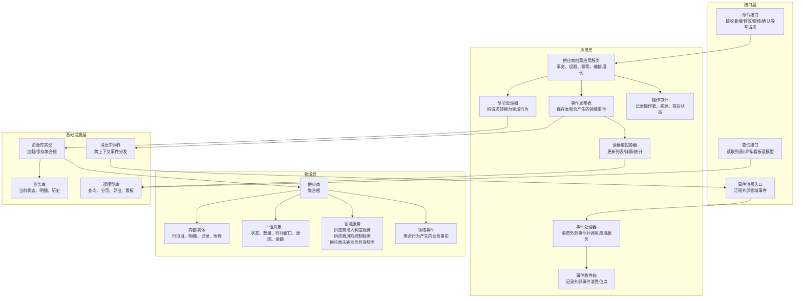
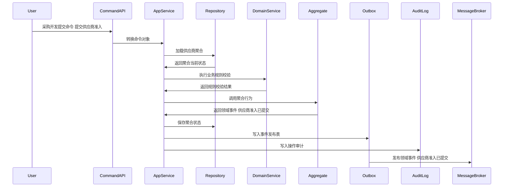
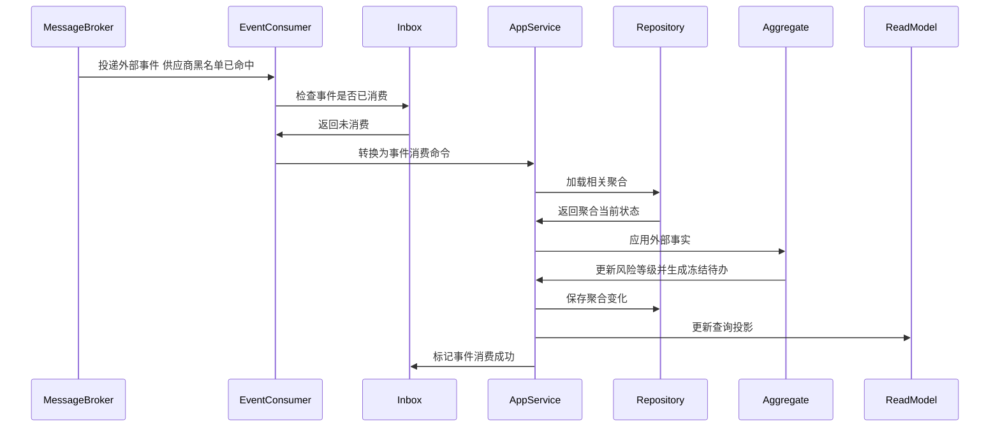
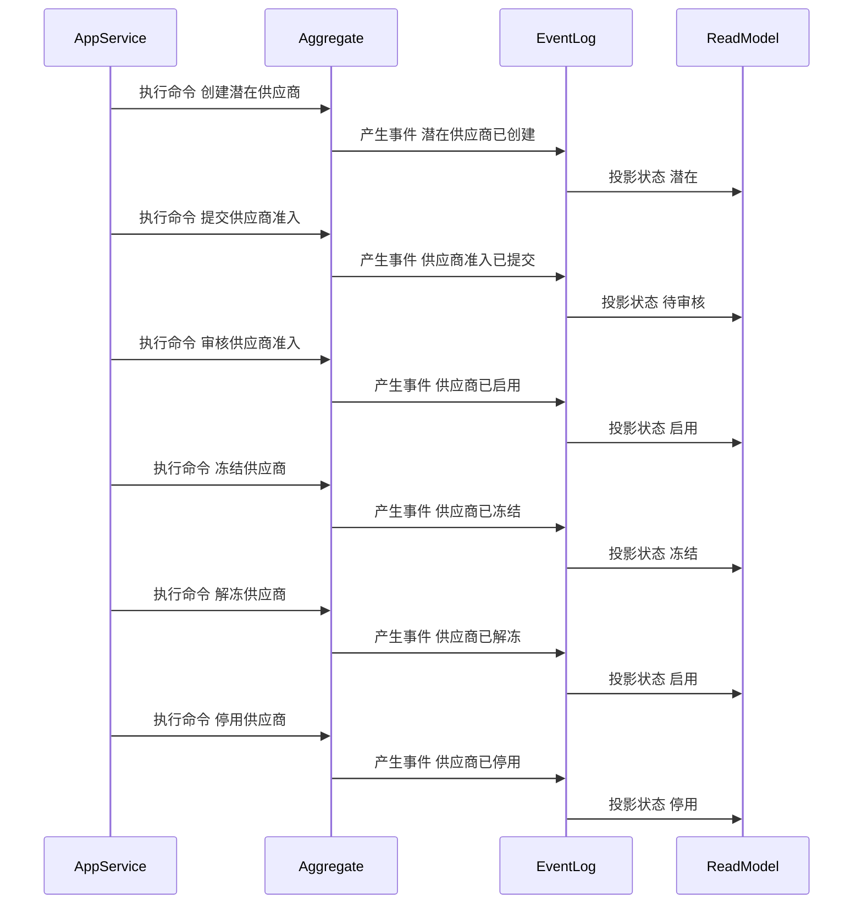

# 02-供应商聚合CQRS设计

> 所属上下文：供应商领域。本文按 DDD + CQRS 深入到聚合属性、命令处理、应用服务编排、领域服务规则、事件产生和事件消费逻辑。后续字段设计、接口设计、测试用例可以直接从本文拆解。

## 1. 业务目标分析

管理供应商从潜在、准入、启用、变更、冻结、解冻、停用到淘汰的全生命周期，保证采购、报价、合同、订单协同只能使用合规可用的供应商。

| 设计项 | 结论 |
| --- | --- |
| 限界上下文 | 供应商领域 |
| 子域类型 | 支撑域，靠近核心采购协同能力 |
| 聚合根 | 供应商 |
| 数据主权 | 本上下文拥有 `供应商` 的生命周期、状态、业务规则和领域事件；外部系统只能通过命令或事件协作，不能直接修改聚合数据 |
| 主要使用角色 | 采购开发、采购经理、供应商管理员、质控经理、财务结算人员、系统风控策略 |
| 核心不变量 | 外部只能通过聚合根修改内部实体；状态流转必须合法；每个写命令必须具备幂等键、操作者、来源系统和审计信息 |

## 2. 角色、场景与流程分析

| 场景 | 发起角色 | 业务意图 | 聚合响应 | 结果事件 |
| --- | --- | --- | --- | --- |
| 创建潜在供应商 | 采购开发 | 推进 `供应商` 业务状态或业务属性 | 校验名称/税号唯一，生成编码，状态=潜在 | 潜在供应商已创建 |
| 提交供应商准入 | 采购开发 | 推进 `供应商` 业务状态或业务属性 | 校验证照、联系人、结算资料完整，状态潜在->待审核 | 供应商准入已提交 |
| 审核供应商准入 | 采购经理 | 推进 `供应商` 业务状态或业务属性 | 通过则待审核->启用；驳回则待审核->潜在并记录原因 | 供应商已启用/供应商准入已驳回 |
| 申请供应商资料变更 | 供应商管理员 | 推进 `供应商` 业务状态或业务属性 | 生成待审批变更单，聚合记录变更快照，主档不立即覆盖 | 供应商资料变更已提交 |
| 审核供应商资料变更 | 采购经理/财务 | 推进 `供应商` 业务状态或业务属性 | 审批通过后覆盖允许变更字段，记录历史 | 供应商资料变更已生效 |
| 冻结供应商 | 采购经理/风控策略 | 推进 `供应商` 业务状态或业务属性 | 启用->冻结，写入冻结原因、范围和恢复条件 | 供应商已冻结 |

## 3. 领域边界与分层架构

领域事件的位置要明确区分三层含义：

- 领域层：聚合行为成功后产生领域事件对象，事件表达已经发生的业务事实。
- 应用层：应用服务在同一事务内保存聚合状态、保存事件发布表、记录审计日志。
- 基础设施层：事件发布器把发布表事件投递到消息中间件；事件消费者通过收件箱保证幂等消费，并更新本地聚合或读模型。

## 4. 聚合属性设计

这些属性是写模型的核心属性，不等同于数据库表字段。字段设计时可以按聚合根、内部实体、值对象、历史表、读模型分别落表。

| 属性 | 业务含义 | 模型归属 | 是否可变 | 主要修改命令 | 变化规则 |
| --- | --- | --- | --- | --- | --- |
| supplierId | 供应商ID | 聚合根 | 否 | 创建潜在供应商 | 全局唯一，创建后不可变 |
| supplierCode | 供应商编码 | 值对象 | 否 | 创建潜在供应商 | 按编码规则生成，不允许重复 |
| supplierName | 供应商名称 | 聚合根 | 是 | 申请资料变更 | 启用后变更需要审批生效 |
| supplierType | 供应商类型 | 值对象 | 是 | 申请资料变更 | 生产商、贸易商、服务商等，可配置枚举 |
| lifecycleStatus | 生命周期状态 | 值对象 | 是 | 提交准入/审核/冻结/停用 | 潜在、待审核、启用、冻结、停用、淘汰 |
| qualificationList | 资质清单 | 内部实体集合 | 是 | 提交准入/申请资料变更 | 必须校验有效期、证照类型和附件 |
| contactList | 联系人清单 | 内部实体集合 | 是 | 申请资料变更 | 至少一个有效业务联系人 |
| settlementProfile | 结算资料 | 内部实体 | 是 | 申请资料变更 | 税号、开户行、账期、币种变更需审批 |
| riskLevel | 风险等级 | 值对象 | 是 | 冻结/评分预警消费 | 低、中、高、黑名单 |
| version | 聚合版本号 | 技术字段 | 是 | 所有写命令 | 乐观锁控制并发 |

## 5. 命令与应用服务逻辑

应用服务不承载核心业务规则，主要负责编排：权限校验、幂等校验、加载聚合、调用领域行为或领域服务、保存聚合、写事件发布表、写审计日志。

| 命令        | 发起者       | 应用服务处理逻辑                   | 参与领域服务      | 成功后领域事件         |
| --------- | --------- | -------------------------- | ----------- | --------------- |
| 创建潜在供应商   | 采购开发      | 校验名称/税号唯一，生成编码，状态=潜在       | 无或准入初筛服务    | 潜在供应商已创建        |
| 提交供应商准入   | 采购开发      | 校验证照、联系人、结算资料完整，状态潜在->待审核  | 供应商准入判定服务   | 供应商准入已提交        |
| 审核供应商准入   | 采购经理      | 通过则待审核->启用；驳回则待审核->潜在并记录原因 | 供应商准入判定服务   | 供应商已启用/供应商准入已驳回 |
| 申请供应商资料变更 | 供应商管理员    | 生成待审批变更单，聚合记录变更快照，主档不立即覆盖  | 资料变更差异判定    | 供应商资料变更已提交      |
| 审核供应商资料变更 | 采购经理/财务   | 审批通过后覆盖允许变更字段，记录历史         | 供应商准入判定服务   | 供应商资料变更已生效      |
| 冻结供应商     | 采购经理/风控策略 | 启用->冻结，写入冻结原因、范围和恢复条件      | 供应商风险控制服务   | 供应商已冻结          |
| 解冻供应商     | 采购经理      | 冻结->启用，必须满足整改、资质、未完异常条件    | 供应商风险控制服务   | 供应商已解冻          |
| 停用或淘汰供应商  | 采购经理      | 确认无未完订单/退供/对账后，状态->停用/淘汰   | 供应商未完业务检查服务 | 供应商已停用/供应商已淘汰   |

### 5.1 应用服务通用处理模板

1. 接口层接收请求，校验必填参数和传输格式，生成命令对象。
2. 应用层根据用户、角色、组织、供应商范围做权限校验。
3. 应用层使用 `来源系统 + 业务单号 + 命令类型 + 幂等键` 做幂等检查。
4. 应用层通过资源库加载 `供应商` 聚合根；新建场景则先校验唯一性和外部事实快照。
5. 聚合根执行业务行为，必要时调用领域服务判断跨实体规则。
6. 聚合根修改自身属性、内部实体和值对象，并产生领域事件。
7. 应用层在同一事务中保存聚合、事件发布表、操作审计。
8. 事件发布器异步投递事件，读模型投影器更新查询模型。

### 5.2 关键命令处理细节

| 关键命令 | 前置校验 | 聚合行为 | 异常/补偿处理 |
| --- | --- | --- | --- |
| 提交供应商准入 | 供应商状态必须是潜在或准入驳回；资质、联系人、结算资料完整 | 生成准入快照；状态改为待审核；锁定本次提交材料版本 | 资料不完整返回缺失项；重复提交返回已有准入单 |
| 审核供应商准入 | 审批人具备采购经理权限；供应商处于待审核；审批意见完整 | 通过则启用供应商；驳回则回到潜在并记录驳回原因 | 状态不匹配拒绝；审批流重复回调按幂等处理 |
| 冻结供应商 | 供应商处于启用；冻结原因、冻结范围、恢复条件明确 | 状态改为冻结；写入风险标签；发布冻结事件阻断采购协同 | 存在紧急未完业务时可冻结下单但保留退供/对账处理 |
| 停用或淘汰供应商 | 确认无未完采购订单、ASN、退供、对账、索赔阻塞 | 状态改为停用或淘汰；保留历史追溯；禁止新供货关系 | 若存在未完业务，生成停用阻塞待办而不改状态 |

## 6. 领域服务逻辑

| 领域服务 | 解决的问题 | 输入 | 输出 | 不能放在单个实体中的原因 |
| --- | --- | --- | --- | --- |
| 供应商准入判定服务 | 判断 `供应商` 在当前业务场景下是否允许执行关键动作 | 聚合当前状态、命令参数、必要外部事实快照、策略配置 | 可执行/不可执行、原因码、建议动作 | 规则涉及多个内部实体、外部事实快照或可配置策略，不属于单一实体的自然职责 |
| 供应商风险控制服务 | 判断 `供应商` 在当前业务场景下是否允许执行关键动作 | 聚合当前状态、命令参数、必要外部事实快照、策略配置 | 可执行/不可执行、原因码、建议动作 | 规则涉及多个内部实体、外部事实快照或可配置策略，不属于单一实体的自然职责 |
| 供应商未完业务检查服务 | 判断 `供应商` 在当前业务场景下是否允许执行关键动作 | 聚合当前状态、命令参数、必要外部事实快照、策略配置 | 可执行/不可执行、原因码、建议动作 | 规则涉及多个内部实体、外部事实快照或可配置策略，不属于单一实体的自然职责 |

### 6.1 领域服务设计原则

- 领域服务必须使用业务语言命名，返回业务判断结果，不直接操作数据库、消息队列或远程接口。
- 领域服务可以读取应用层传入的外部事实快照，但不能绕过聚合根直接修改聚合状态。
- 如果规则只依赖聚合自身属性，应优先放回聚合根方法；只有跨实体、跨策略、跨事实的规则才放入领域服务。

### 6.2 领域服务关键规则

| 领域服务 | 核心逻辑 |
| --- | --- |
| 供应商准入判定服务 | 校验证照类型、有效期、税务资料、联系人、结算资料、重复供应商、黑名单命中；输出准入通过、驳回或补资料建议。 |
| 供应商风险控制服务 | 综合评分预警、质量风险、黑名单、资质到期、重大客诉；判断冻结范围是全局冻结、品类冻结还是只生成风险待办。 |
| 供应商未完业务检查服务 | 查询采购、ASN、退供、BMS的未完事实快照；只有不存在待收货、待退供、待对账、待索赔时才允许停用或淘汰。 |

## 7. 事件产生逻辑

| 领域事件 | 触发命令 | 关键载荷 | 主要消费者 |
| --- | --- | --- | --- |
| 潜在供应商已创建 | 创建潜在供应商 | supplierId、supplierCode、名称、创建人 | 供应商列表读模型、审计 |
| 供应商准入已提交 | 提交供应商准入 | supplierId、资质摘要、提交人 | 待办中心、审批流 |
| 供应商已启用 | 审核供应商准入 | supplierId、supplierCode、启用时间 | 采购系统、供应商商品、合同、权限/账号开通 |
| 供应商资料变更已生效 | 审核资料变更 | supplierId、变更字段、前后值摘要 | 采购、BMS、主数据缓存 |
| 供应商已冻结 | 冻结供应商 | supplierId、冻结原因、冻结范围 | 采购下单控制、报价、合同、供应商商品 |
| 供应商已停用 | 停用供应商 | supplierId、停用原因 | 采购、合同、BMS、读模型 |

### 7.1 事件生成规则

- 事件名称必须使用过去式，表达业务事实已经发生。
- 事件由聚合根在业务行为成功后产生，应用服务只负责收集和发布。
- 事件载荷必须包含事件编号、事件版本、发生时间、来源上下文、聚合ID、聚合版本、操作者和业务关键字段。
- 同一命令如果因为幂等重复提交被识别为已处理，不能重复产生领域事件。
- 事件发布采用发布表模式，保证聚合状态和待发布事件在同一事务内落库。

## 8. 事件订阅与消费逻辑

| 订阅事件 | 处理应用服务 | 消费后数据变化 | 幂等键 |
| --- | --- | --- | --- |
| 供应商黑名单已命中 | 风险事件消费服务 | 风险等级=黑名单，若启用则自动冻结或生成冻结待办 | 来源上下文+事件编号+supplierId |
| 供应商资质即将到期 | 资质预警消费服务 | 写入资质预警状态，影响准入和解冻判定 | 来源上下文+事件编号+qualificationId |
| 供应商评分预警已产生 | 评分预警消费服务 | 风险等级上调，可能触发冻结建议 | 来源上下文+事件编号+supplierId+period |
| 供应商未完业务已清理 | 停用前置消费服务 | 解除停用阻塞，允许执行停用命令 | 来源上下文+事件编号+supplierId |

### 8.1 消费规则

- 消费外部事件时，先写入或检查事件收件箱，幂等键为 `来源上下文 + 事件编号 + 业务主键`。
- 外部事件不能直接修改本聚合内部字段，必须转换成本上下文的事件消费命令，再由应用服务加载聚合并调用聚合行为。
- 消费成功后要记录消费位点；消费失败要保留错误原因、重试次数和人工处理入口。
- 如果外部事件到达顺序不确定，应按外部业务版本号或发生时间做乱序保护。

## 9. 关键时序图

### 9.1 命令处理、聚合变更与事件发布

### 9.2 典型业务命令一

### 9.3 典型业务命令二

### 9.4 事件订阅、幂等消费与本地状态变化

### 9.5 聚合状态推进时序

## 10. 不变量、异常补偿、权限与审计

| 类型 | 规则 |
| --- | --- |
| 聚合不变量 | `供应商` 的状态只能按本文状态流转推进；内部实体不能脱离聚合根单独被外部修改 |
| 数量/金额/时间不变量 | 涉及数量、金额、有效期、截止时间、交期、结算周期时，必须用值对象封装校验，避免散落在接口层 |
| 幂等 | 所有命令必须携带幂等键；所有消费事件必须进入收件箱；重复处理返回原结果 |
| 并发 | 聚合保存使用版本号乐观锁；并发冲突时应用服务重新加载聚合并返回可重试错误 |
| 补偿 | 事件发布失败走发布表重试；消费失败走收件箱重试；跨上下文部分成功通过补偿命令或人工待办处理 |
| 权限 | 按角色、组织、供应商范围和动作类型控制；供应商用户只能处理归属供应商的数据 |
| 审计 | 写命令记录操作者、来源系统、请求摘要、前状态、后状态、领域事件编号和失败原因 |

## 11. 读模型设计

读模型服务于查询和页面展示，不参与聚合不变量保护。写入决策必须回到应用服务、聚合根和领域服务。

| 读模型 | 使用场景 | 主要字段 |
| --- | --- | --- |
| 供应商列表读模型 | 供应商管理列表、分页、条件筛选 | supplierId、编码、名称、类型、状态、风险等级、最近更新时间 |
| 供应商详情读模型 | 详情页聚合展示 | 主档、资质、联系人、结算资料、状态历史、操作日志 |
| 供应商准入待办读模型 | 审批人员处理准入 | 供应商、提交人、提交时间、缺失项、审批状态 |
| 供应商风险看板读模型 | 采购经理查看冻结/预警 | 评分、质量问题、资质到期、冻结次数、未完异常 |

## 12. 设计结论与待确认问题

### 12.1 设计结论

- `供应商` 是供应商领域内独立保护业务不变量的聚合根。
- 命令处理属于应用层用例编排；核心业务判断属于聚合根和领域服务；事件发布和消费通过发布表、收件箱和读模型投影落地。
- 事件处于领域层产生、应用层持久化与编排、基础设施层投递和消费的位置，不能把消息队列事件直接当成领域模型本身。

### 12.2 待确认问题

| 问题 | 默认建议 |
| --- | --- |
| 是否需要多组织、多采购组织、多供应商账号隔离 | 建议从一开始保留组织、供应商、用户权限范围字段 |
| 是否允许人工越权修改终态单据 | 默认不允许；如确需修正，应做红冲、作废、补偿单或管理员审计命令 |
| 事件保留多久 | 领域事件和审计日志建议长期保留；发布表可归档但不能影响追溯 |
| 是否需要事件溯源 | 当前阶段不建议全量事件溯源，优先当前状态表 + 历史表 + 事件日志 |
