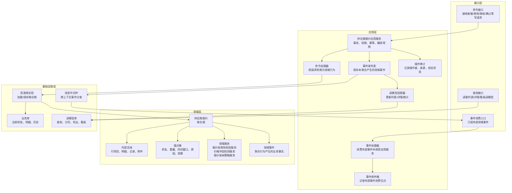
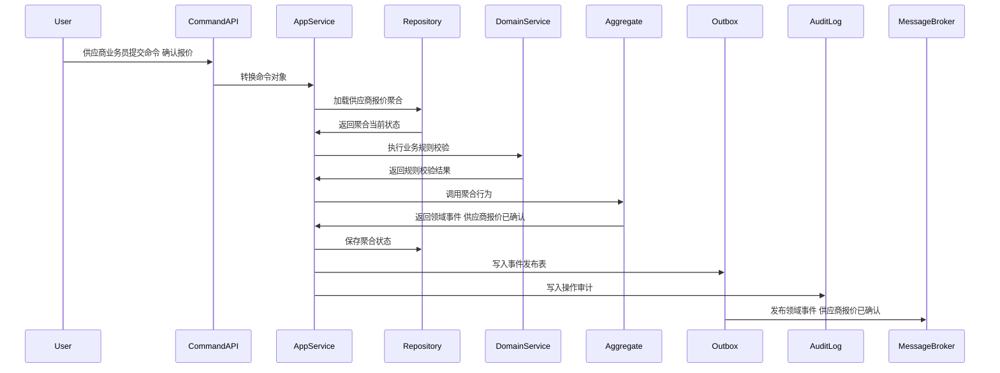
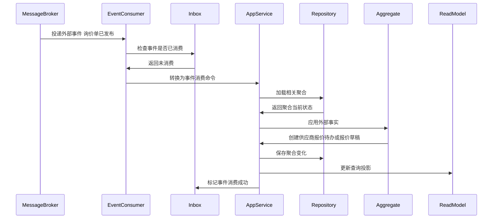
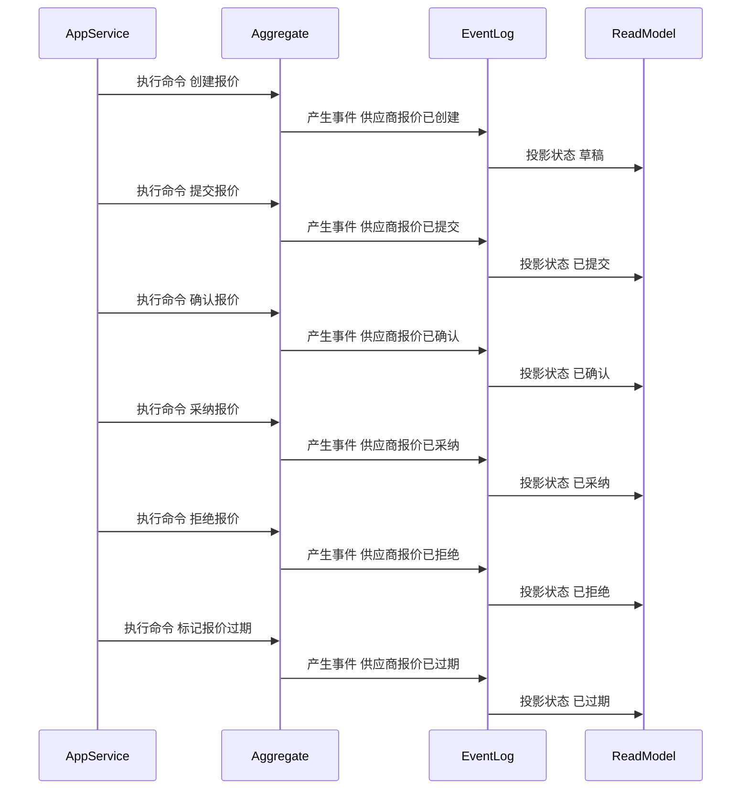

# 04-供应商报价聚合CQRS设计

> 所属上下文：供应商领域。本文按 DDD + CQRS 深入到聚合属性、命令处理、应用服务编排、领域服务规则、事件产生和事件消费逻辑。后续字段设计、接口设计、测试用例可以直接从本文拆解。

## 1. 业务目标分析

管理供应商针对SKU或询价需求提交的报价，控制报价有效期、阶梯价、币种税率、采纳状态和价格协议生效过程。

| 设计项 | 结论 |
| --- | --- |
| 限界上下文 | 供应商领域 |
| 子域类型 | 支撑域，影响采购成本和可采购价格 |
| 聚合根 | 供应商报价 |
| 数据主权 | 本上下文拥有 `供应商报价` 的生命周期、状态、业务规则和领域事件；外部系统只能通过命令或事件协作，不能直接修改聚合数据 |
| 主要使用角色 | 供应商业务员、采购员、采购经理、价格审批人、系统价格策略 |
| 核心不变量 | 外部只能通过聚合根修改内部实体；状态流转必须合法；每个写命令必须具备幂等键、操作者、来源系统和审计信息 |

## 2. 角色、场景与流程分析

| 场景 | 发起角色 | 业务意图 | 聚合响应 | 结果事件 |
| --- | --- | --- | --- | --- |
| 创建报价 | 供应商业务员/采购员 | 推进 `供应商报价` 业务状态或业务属性 | 创建草稿，校验供应商商品关系和SKU范围 | 供应商报价已创建 |
| 提交报价 | 供应商业务员 | 推进 `供应商报价` 业务状态或业务属性 | 草稿->已提交，校验报价行完整、有效期、阶梯价 | 供应商报价已提交 |
| 确认报价 | 采购员 | 推进 `供应商报价` 业务状态或业务属性 | 已提交->已确认，确认报价可进入采纳或比价 | 供应商报价已确认 |
| 采纳报价 | 采购经理 | 推进 `供应商报价` 业务状态或业务属性 | 已确认->已采纳，校验价格冲突并生成价格协议引用 | 供应商报价已采纳 |
| 拒绝报价 | 采购员 | 推进 `供应商报价` 业务状态或业务属性 | 已提交/已确认->已拒绝，记录拒绝原因 | 供应商报价已拒绝 |
| 作废报价 | 采购员/系统策略 | 推进 `供应商报价` 业务状态或业务属性 | 非已采纳报价可作废；已采纳需走价格协议终止 | 供应商报价已作废 |

## 3. 领域边界与分层架构

领域事件的位置要明确区分三层含义：

- 领域层：聚合行为成功后产生领域事件对象，事件表达已经发生的业务事实。
- 应用层：应用服务在同一事务内保存聚合状态、保存事件发布表、记录审计日志。
- 基础设施层：事件发布器把发布表事件投递到消息中间件；事件消费者通过收件箱保证幂等消费，并更新本地聚合或读模型。

## 4. 聚合属性设计

这些属性是写模型的核心属性，不等同于数据库表字段。字段设计时可以按聚合根、内部实体、值对象、历史表、读模型分别落表。

| 属性 | 业务含义 | 模型归属 | 是否可变 | 主要修改命令 | 变化规则 |
| --- | --- | --- | --- | --- | --- |
| quoteId | 报价ID | 聚合根 | 否 | 创建报价 | 全局唯一 |
| supplierId | 供应商ID | 外部事实快照 | 否 | 创建报价 | 供应商必须可报价 |
| quoteStatus | 报价状态 | 值对象 | 是 | 提交/确认/采纳/拒绝/作废 | 草稿、已提交、已确认、已采纳、已拒绝、已作废、已过期 |
| quoteLineList | 报价行 | 内部实体集合 | 是 | 创建/修改报价 | 每行包含SKU、价格、税率、币种、阶梯数量 |
| validPeriod | 有效期 | 值对象 | 是 | 创建/修改报价 | 开始时间必须早于结束时间 |
| currency | 币种 | 值对象 | 是 | 创建/修改报价 | 与合同或采购组织币种策略匹配 |
| taxRate | 税率 | 值对象 | 是 | 创建/修改报价 | 税率枚举可配置 |
| adoptionRecord | 采纳记录 | 内部实体 | 是 | 采纳报价 | 记录采纳人、价格协议、采纳范围 |
| priceAgreementRef | 价格协议引用 | 值对象 | 是 | 采纳报价 | 采纳后生成或关联价格协议 |

## 5. 命令与应用服务逻辑

应用服务不承载核心业务规则，主要负责编排：权限校验、幂等校验、加载聚合、调用领域行为或领域服务、保存聚合、写事件发布表、写审计日志。

| 命令 | 发起者 | 应用服务处理逻辑 | 参与领域服务 | 成功后领域事件 |
| --- | --- | --- | --- | --- |
| 创建报价 | 供应商业务员/采购员 | 创建草稿，校验供应商商品关系和SKU范围 | 报价有效性校验服务 | 供应商报价已创建 |
| 提交报价 | 供应商业务员 | 草稿->已提交，校验报价行完整、有效期、阶梯价 | 报价有效性校验服务 | 供应商报价已提交 |
| 确认报价 | 采购员 | 已提交->已确认，确认报价可进入采纳或比价 | 价格冲突检测服务 | 供应商报价已确认 |
| 采纳报价 | 采购经理 | 已确认->已采纳，校验价格冲突并生成价格协议引用 | 报价采纳策略服务 | 供应商报价已采纳 |
| 拒绝报价 | 采购员 | 已提交/已确认->已拒绝，记录拒绝原因 | 报价有效性校验服务 | 供应商报价已拒绝 |
| 作废报价 | 采购员/系统策略 | 非已采纳报价可作废；已采纳需走价格协议终止 | 价格冲突检测服务 | 供应商报价已作废 |
| 标记报价过期 | 系统任务 | 超过有效期且未采纳，状态->已过期 | 报价有效性校验服务 | 供应商报价已过期 |

### 5.1 应用服务通用处理模板

1. 接口层接收请求，校验必填参数和传输格式，生成命令对象。
2. 应用层根据用户、角色、组织、供应商范围做权限校验。
3. 应用层使用 `来源系统 + 业务单号 + 命令类型 + 幂等键` 做幂等检查。
4. 应用层通过资源库加载 `供应商报价` 聚合根；新建场景则先校验唯一性和外部事实快照。
5. 聚合根执行业务行为，必要时调用领域服务判断跨实体规则。
6. 聚合根修改自身属性、内部实体和值对象，并产生领域事件。
7. 应用层在同一事务中保存聚合、事件发布表、操作审计。
8. 事件发布器异步投递事件，读模型投影器更新查询模型。

### 5.2 关键命令处理细节

| 关键命令 | 前置校验 | 聚合行为 | 异常/补偿处理 |
| --- | --- | --- | --- |
| 提交报价 | 报价为草稿；报价行SKU有效；价格、税率、币种、有效期完整 | 状态改为已提交；锁定报价版本；生成采购员待办 | 报价行缺失或有效期冲突时拒绝提交 |
| 确认报价 | 报价已提交；采购员确认报价可用于比价；供应商未冻结 | 状态改为已确认；进入采纳或比价流程 | 发现异常价格时生成价格风险待办而不是直接采纳 |
| 采纳报价 | 报价已确认；价格不与同供应商SKU有效价格冲突；审批通过 | 状态改为已采纳；生成价格协议引用；发布报价采纳事件 | 若同期间已有有效协议，要求先终止或指定替换策略 |
| 标记报价过期 | 当前日期超过报价有效期结束日；报价未采纳 | 状态改为已过期；从可用价格读模型移除 | 已采纳报价过期应由价格协议有效期控制，不直接改报价 |

## 6. 领域服务逻辑

| 领域服务 | 解决的问题 | 输入 | 输出 | 不能放在单个实体中的原因 |
| --- | --- | --- | --- | --- |
| 报价有效性校验服务 | 判断 `供应商报价` 在当前业务场景下是否允许执行关键动作 | 聚合当前状态、命令参数、必要外部事实快照、策略配置 | 可执行/不可执行、原因码、建议动作 | 规则涉及多个内部实体、外部事实快照或可配置策略，不属于单一实体的自然职责 |
| 价格冲突检测服务 | 判断 `供应商报价` 在当前业务场景下是否允许执行关键动作 | 聚合当前状态、命令参数、必要外部事实快照、策略配置 | 可执行/不可执行、原因码、建议动作 | 规则涉及多个内部实体、外部事实快照或可配置策略，不属于单一实体的自然职责 |
| 报价采纳策略服务 | 判断 `供应商报价` 在当前业务场景下是否允许执行关键动作 | 聚合当前状态、命令参数、必要外部事实快照、策略配置 | 可执行/不可执行、原因码、建议动作 | 规则涉及多个内部实体、外部事实快照或可配置策略，不属于单一实体的自然职责 |

### 6.1 领域服务设计原则

- 领域服务必须使用业务语言命名，返回业务判断结果，不直接操作数据库、消息队列或远程接口。
- 领域服务可以读取应用层传入的外部事实快照，但不能绕过聚合根直接修改聚合状态。
- 如果规则只依赖聚合自身属性，应优先放回聚合根方法；只有跨实体、跨策略、跨事实的规则才放入领域服务。

### 6.2 领域服务关键规则

| 领域服务 | 核心逻辑 |
| --- | --- |
| 报价有效性校验服务 | 校验价格大于0、阶梯价区间不重叠、税率/币种合法、有效期合法、供应商商品关系可用。 |
| 价格冲突检测服务 | 按供应商+SKU+采购组织+币种+时间段检测有效报价或价格协议重叠，给出替换、并存或拒绝建议。 |
| 报价采纳策略服务 | 结合供应商评分、合同、历史价格、交期、MOQ判断报价是否可采纳，并生成价格协议引用。 |

## 7. 事件产生逻辑

| 领域事件 | 触发命令 | 关键载荷 | 主要消费者 |
| --- | --- | --- | --- |
| 供应商报价已创建 | 创建报价 | quoteId、供应商、报价行摘要 | 报价读模型 |
| 供应商报价已提交 | 提交报价 | quoteId、报价行、有效期 | 采购员待办、比价看板 |
| 供应商报价已确认 | 确认报价 | quoteId、确认人、确认时间 | 价格审批或采纳待办 |
| 供应商报价已采纳 | 采纳报价 | quoteId、采纳行、价格协议引用 | 供应商商品、采购系统、合同 |
| 供应商报价已拒绝 | 拒绝报价 | quoteId、拒绝原因 | 供应商协同门户 |
| 供应商报价已过期 | 标记报价过期 | quoteId、过期时间 | 采购可用价格读模型 |

### 7.1 事件生成规则

- 事件名称必须使用过去式，表达业务事实已经发生。
- 事件由聚合根在业务行为成功后产生，应用服务只负责收集和发布。
- 事件载荷必须包含事件编号、事件版本、发生时间、来源上下文、聚合ID、聚合版本、操作者和业务关键字段。
- 同一命令如果因为幂等重复提交被识别为已处理，不能重复产生领域事件。
- 事件发布采用发布表模式，保证聚合状态和待发布事件在同一事务内落库。

## 8. 事件订阅与消费逻辑

| 订阅事件 | 处理应用服务 | 消费后数据变化 | 幂等键 |
| --- | --- | --- | --- |
| 询价单已发布 | 询价事件消费服务 | 创建供应商报价待办或草稿 | 来源上下文+事件编号+rfqId+supplierId |
| 询价已截标 | 询价事件消费服务 | 未提交报价自动作废或禁止提交 | 来源上下文+事件编号+rfqId |
| 供应商商品已启用 | 供货关系消费服务 | 允许对该供应商SKU创建报价 | 来源上下文+事件编号+supplierSkuId |
| 供应商已冻结 | 供应商状态消费服务 | 暂停未确认报价，禁止采纳 | 来源上下文+事件编号+supplierId |

### 8.1 消费规则

- 消费外部事件时，先写入或检查事件收件箱，幂等键为 `来源上下文 + 事件编号 + 业务主键`。
- 外部事件不能直接修改本聚合内部字段，必须转换成本上下文的事件消费命令，再由应用服务加载聚合并调用聚合行为。
- 消费成功后要记录消费位点；消费失败要保留错误原因、重试次数和人工处理入口。
- 如果外部事件到达顺序不确定，应按外部业务版本号或发生时间做乱序保护。

## 9. 关键时序图

### 9.1 命令处理、聚合变更与事件发布

### 9.2 典型业务命令一

### 9.3 典型业务命令二

### 9.4 事件订阅、幂等消费与本地状态变化

### 9.5 聚合状态推进时序

## 10. 不变量、异常补偿、权限与审计

| 类型 | 规则 |
| --- | --- |
| 聚合不变量 | `供应商报价` 的状态只能按本文状态流转推进；内部实体不能脱离聚合根单独被外部修改 |
| 数量/金额/时间不变量 | 涉及数量、金额、有效期、截止时间、交期、结算周期时，必须用值对象封装校验，避免散落在接口层 |
| 幂等 | 所有命令必须携带幂等键；所有消费事件必须进入收件箱；重复处理返回原结果 |
| 并发 | 聚合保存使用版本号乐观锁；并发冲突时应用服务重新加载聚合并返回可重试错误 |
| 补偿 | 事件发布失败走发布表重试；消费失败走收件箱重试；跨上下文部分成功通过补偿命令或人工待办处理 |
| 权限 | 按角色、组织、供应商范围和动作类型控制；供应商用户只能处理归属供应商的数据 |
| 审计 | 写命令记录操作者、来源系统、请求摘要、前状态、后状态、领域事件编号和失败原因 |

## 11. 读模型设计

读模型服务于查询和页面展示，不参与聚合不变量保护。写入决策必须回到应用服务、聚合根和领域服务。

| 读模型 | 使用场景 | 主要字段 |
| --- | --- | --- |
| 报价列表读模型 | 报价查询、分页、筛选 | 供应商、SKU、价格、有效期、状态、提交时间 |
| 比价读模型 | 同SKU多供应商横向比较 | 价格、税率、交期、MOQ、评分、历史采纳记录 |
| 可用价格读模型 | 采购下单价格来源 | 只投影已采纳且未过期价格 |

## 12. 设计结论与待确认问题

### 12.1 设计结论

- `供应商报价` 是供应商领域内独立保护业务不变量的聚合根。
- 命令处理属于应用层用例编排；核心业务判断属于聚合根和领域服务；事件发布和消费通过发布表、收件箱和读模型投影落地。
- 事件处于领域层产生、应用层持久化与编排、基础设施层投递和消费的位置，不能把消息队列事件直接当成领域模型本身。

### 12.2 待确认问题

| 问题                     | 默认建议                               |
| ---------------------- | ---------------------------------- |
| 是否需要多组织、多采购组织、多供应商账号隔离 | 建议从一开始保留组织、供应商、用户权限范围字段            |
| 是否允许人工越权修改终态单据         | 默认不允许；如确需修正，应做红冲、作废、补偿单或管理员审计命令    |
| 事件保留多久                 | 领域事件和审计日志建议长期保留；发布表可归档但不能影响追溯      |
| 是否需要事件溯源               | 当前阶段不建议全量事件溯源，优先当前状态表 + 历史表 + 事件日志 |
