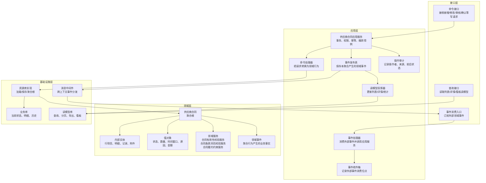
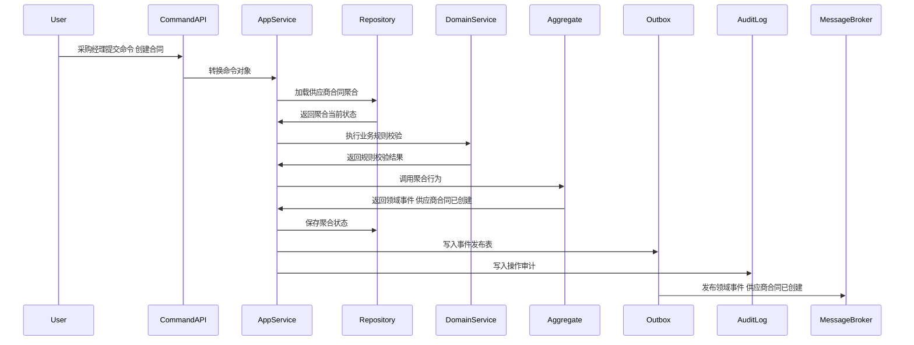
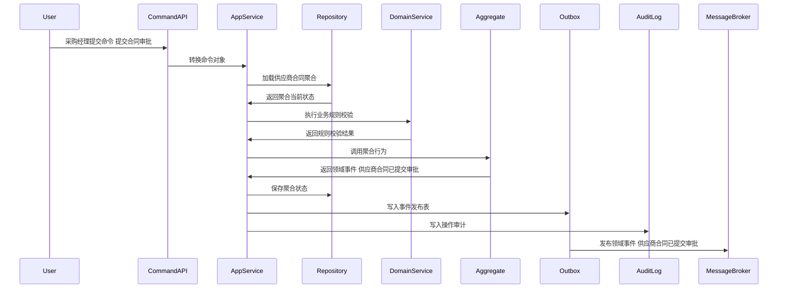
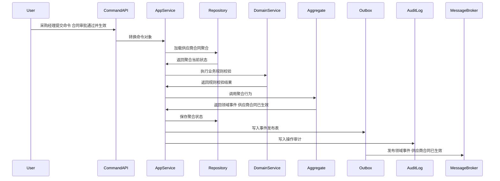
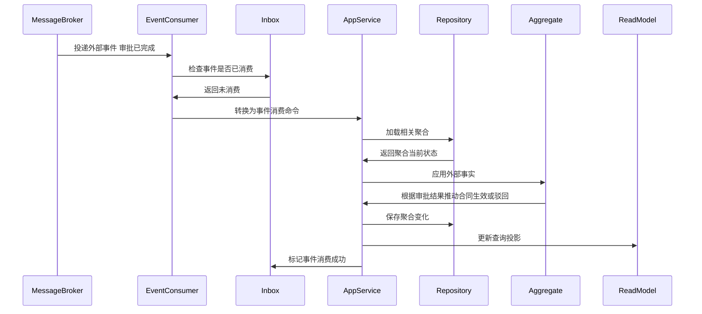
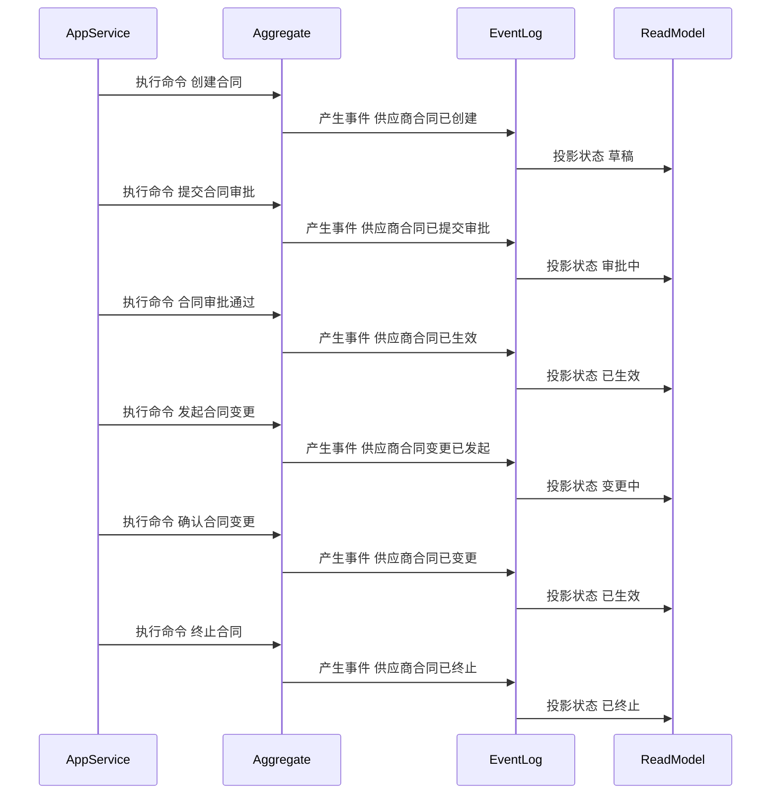

# 05-供应商合同聚合CQRS设计

> 所属上下文：供应商领域。本文按 DDD + CQRS 深入到聚合属性、命令处理、应用服务编排、领域服务规则、事件产生和事件消费逻辑。后续字段设计、接口设计、测试用例可以直接从本文拆解。

## 1. 业务目标分析

管理供应商合作合同、框架协议、价格条款、账期条款、质量条款和履约条款，确保采购协同和结算有可追溯的合同依据。

| 设计项 | 结论 |
| --- | --- |
| 限界上下文 | 供应商领域 |
| 子域类型 | 支撑域，承载供应商交易约束和法务约束 |
| 聚合根 | 供应商合同 |
| 数据主权 | 本上下文拥有 `供应商合同` 的生命周期、状态、业务规则和领域事件；外部系统只能通过命令或事件协作，不能直接修改聚合数据 |
| 主要使用角色 | 采购经理、法务、财务、供应商管理员、合同审批人、系统到期任务 |
| 核心不变量 | 外部只能通过聚合根修改内部实体；状态流转必须合法；每个写命令必须具备幂等键、操作者、来源系统和审计信息 |

## 2. 角色、场景与流程分析

| 场景 | 发起角色 | 业务意图 | 聚合响应 | 结果事件 |
| --- | --- | --- | --- | --- |
| 创建合同 | 采购经理 | 推进 `供应商合同` 业务状态或业务属性 | 创建草稿，绑定供应商和合同类型 | 供应商合同已创建 |
| 提交合同审批 | 采购经理 | 推进 `供应商合同` 业务状态或业务属性 | 草稿->审批中，校验条款、附件、供应商状态 | 供应商合同已提交审批 |
| 合同审批通过并生效 | 审批系统 | 推进 `供应商合同` 业务状态或业务属性 | 审批中->已生效，记录生效时间和审批结果 | 供应商合同已生效 |
| 发起合同变更 | 采购经理/法务 | 推进 `供应商合同` 业务状态或业务属性 | 已生效->变更中，冻结待变更字段，生成变更版本 | 供应商合同变更已发起 |
| 确认合同变更生效 | 审批系统 | 推进 `供应商合同` 业务状态或业务属性 | 变更中->已生效，新版本覆盖可变条款 | 供应商合同已变更 |
| 续签合同 | 采购经理 | 推进 `供应商合同` 业务状态或业务属性 | 延长有效期或生成新版本，记录续签依据 | 供应商合同已续签 |

## 3. 领域边界与分层架构

领域事件的位置要明确区分三层含义：

- 领域层：聚合行为成功后产生领域事件对象，事件表达已经发生的业务事实。
- 应用层：应用服务在同一事务内保存聚合状态、保存事件发布表、记录审计日志。
- 基础设施层：事件发布器把发布表事件投递到消息中间件；事件消费者通过收件箱保证幂等消费，并更新本地聚合或读模型。

## 4. 聚合属性设计

这些属性是写模型的核心属性，不等同于数据库表字段。字段设计时可以按聚合根、内部实体、值对象、历史表、读模型分别落表。

| 属性 | 业务含义 | 模型归属 | 是否可变 | 主要修改命令 | 变化规则 |
| --- | --- | --- | --- | --- | --- |
| contractId | 合同ID | 聚合根 | 否 | 创建合同 | 全局唯一 |
| supplierId | 供应商ID | 外部事实快照 | 否 | 创建合同 | 合同归属供应商 |
| contractNo | 合同编号 | 值对象 | 否 | 创建合同 | 按合同编码规则生成 |
| contractStatus | 合同状态 | 值对象 | 是 | 提交审批/生效/变更/终止 | 草稿、审批中、已生效、变更中、已终止、已到期 |
| contractType | 合同类型 | 值对象 | 是 | 创建/变更合同 | 框架、采购、质量、服务等 |
| effectivePeriod | 有效期 | 值对象 | 是 | 创建/续签/变更 | 采购和报价需在有效期内 |
| termList | 条款清单 | 内部实体集合 | 是 | 创建/变更合同 | 价格、账期、质保、违约、质量条款 |
| attachmentList | 附件清单 | 内部实体集合 | 是 | 创建/变更合同 | 合同扫描件、补充协议、审批材料 |
| approvalRecord | 审批记录 | 内部实体集合 | 是 | 提交审批/审批回调 | 记录审批流节点和结果 |

## 5. 命令与应用服务逻辑

应用服务不承载核心业务规则，主要负责编排：权限校验、幂等校验、加载聚合、调用领域行为或领域服务、保存聚合、写事件发布表、写审计日志。

| 命令 | 发起者 | 应用服务处理逻辑 | 参与领域服务 | 成功后领域事件 |
| --- | --- | --- | --- | --- |
| 创建合同 | 采购经理 | 创建草稿，绑定供应商和合同类型 | 合同有效性校验服务 | 供应商合同已创建 |
| 提交合同审批 | 采购经理 | 草稿->审批中，校验条款、附件、供应商状态 | 合同条款风险校验服务 | 供应商合同已提交审批 |
| 合同审批通过并生效 | 审批系统 | 审批中->已生效，记录生效时间和审批结果 | 合同履约约束服务 | 供应商合同已生效 |
| 发起合同变更 | 采购经理/法务 | 已生效->变更中，冻结待变更字段，生成变更版本 | 合同条款风险校验服务 | 供应商合同变更已发起 |
| 确认合同变更生效 | 审批系统 | 变更中->已生效，新版本覆盖可变条款 | 合同履约约束服务 | 供应商合同已变更 |
| 续签合同 | 采购经理 | 延长有效期或生成新版本，记录续签依据 | 合同有效性校验服务 | 供应商合同已续签 |
| 终止合同 | 采购经理/法务 | 确认未完采购、对账、索赔影响后终止 | 合同履约约束服务 | 供应商合同已终止 |

### 5.1 应用服务通用处理模板

1. 接口层接收请求，校验必填参数和传输格式，生成命令对象。
2. 应用层根据用户、角色、组织、供应商范围做权限校验。
3. 应用层使用 `来源系统 + 业务单号 + 命令类型 + 幂等键` 做幂等检查。
4. 应用层通过资源库加载 `供应商合同` 聚合根；新建场景则先校验唯一性和外部事实快照。
5. 聚合根执行业务行为，必要时调用领域服务判断跨实体规则。
6. 聚合根修改自身属性、内部实体和值对象，并产生领域事件。
7. 应用层在同一事务中保存聚合、事件发布表、操作审计。
8. 事件发布器异步投递事件，读模型投影器更新查询模型。

### 5.2 关键命令处理细节

| 关键命令 | 前置校验 | 聚合行为 | 异常/补偿处理 |
| --- | --- | --- | --- |
| 提交合同审批 | 合同草稿；供应商启用；条款、附件、有效期完整 | 状态草稿改审批中；锁定合同版本；发起审批 | 缺条款或高风险条款未确认时拒绝提交 |
| 合同审批通过并生效 | 审批回调通过；合同处于审批中；供应商未停用 | 状态改为已生效；生效条款进入采购和结算约束 | 重复审批回调按审批编号幂等处理 |
| 发起合同变更 | 合同已生效；变更字段属于允许变更范围 | 状态改为变更中；生成新版本草案；原版本继续约束已发生业务 | 涉及账期/价格/质量条款时必须重新审批 |
| 终止合同 | 合同已生效或变更中；确认未完业务影响 | 状态改为已终止；发布终止事件阻断新采购引用 | 若存在未完成PO或应付，允许终止新业务但保留历史结算依据 |

## 6. 领域服务逻辑

| 领域服务 | 解决的问题 | 输入 | 输出 | 不能放在单个实体中的原因 |
| --- | --- | --- | --- | --- |
| 合同有效性校验服务 | 判断 `供应商合同` 在当前业务场景下是否允许执行关键动作 | 聚合当前状态、命令参数、必要外部事实快照、策略配置 | 可执行/不可执行、原因码、建议动作 | 规则涉及多个内部实体、外部事实快照或可配置策略，不属于单一实体的自然职责 |
| 合同条款风险校验服务 | 判断 `供应商合同` 在当前业务场景下是否允许执行关键动作 | 聚合当前状态、命令参数、必要外部事实快照、策略配置 | 可执行/不可执行、原因码、建议动作 | 规则涉及多个内部实体、外部事实快照或可配置策略，不属于单一实体的自然职责 |
| 合同履约约束服务 | 判断 `供应商合同` 在当前业务场景下是否允许执行关键动作 | 聚合当前状态、命令参数、必要外部事实快照、策略配置 | 可执行/不可执行、原因码、建议动作 | 规则涉及多个内部实体、外部事实快照或可配置策略，不属于单一实体的自然职责 |

### 6.1 领域服务设计原则

- 领域服务必须使用业务语言命名，返回业务判断结果，不直接操作数据库、消息队列或远程接口。
- 领域服务可以读取应用层传入的外部事实快照，但不能绕过聚合根直接修改聚合状态。
- 如果规则只依赖聚合自身属性，应优先放回聚合根方法；只有跨实体、跨策略、跨事实的规则才放入领域服务。

### 6.2 领域服务关键规则

| 领域服务 | 核心逻辑 |
| --- | --- |
| 合同有效性校验服务 | 校验供应商状态、合同类型、有效期、合同编号唯一、必备附件和签章状态。 |
| 合同条款风险校验服务 | 识别账期过长、违约责任缺失、质保条款缺失、价格条款冲突等风险并输出审批要求。 |
| 合同履约约束服务 | 判断合同生效、变更、终止对采购下单、报价采纳、BMS结算的影响范围。 |

## 7. 事件产生逻辑

| 领域事件 | 触发命令 | 关键载荷 | 主要消费者 |
| --- | --- | --- | --- |
| 供应商合同已创建 | 创建合同 | contractId、supplierId、合同类型 | 合同列表读模型 |
| 供应商合同已提交审批 | 提交合同审批 | contractId、条款摘要、提交人 | 审批流、待办 |
| 供应商合同已生效 | 合同审批通过并生效 | contractId、有效期、条款摘要 | 采购系统、报价、BMS |
| 供应商合同已变更 | 确认合同变更生效 | contractId、版本号、变更字段 | 采购系统、BMS、审计 |
| 供应商合同已续签 | 续签合同 | contractId、新有效期 | 采购系统、到期预警 |
| 供应商合同已终止 | 终止合同 | contractId、终止原因 | 采购系统、报价、BMS |

### 7.1 事件生成规则

- 事件名称必须使用过去式，表达业务事实已经发生。
- 事件由聚合根在业务行为成功后产生，应用服务只负责收集和发布。
- 事件载荷必须包含事件编号、事件版本、发生时间、来源上下文、聚合ID、聚合版本、操作者和业务关键字段。
- 同一命令如果因为幂等重复提交被识别为已处理，不能重复产生领域事件。
- 事件发布采用发布表模式，保证聚合状态和待发布事件在同一事务内落库。

## 8. 事件订阅与消费逻辑

| 订阅事件 | 处理应用服务 | 消费后数据变化 | 幂等键 |
| --- | --- | --- | --- |
| 供应商已启用 | 供应商状态消费服务 | 允许创建和提交合同 | 来源上下文+事件编号+supplierId |
| 审批已完成 | 审批回调消费服务 | 根据审批结果推动合同生效或驳回 | 来源上下文+事件编号+approvalId |
| 供应商已冻结 | 供应商状态消费服务 | 合同继续有效但禁止新下单或生成风险待办 | 来源上下文+事件编号+supplierId |
| 合同即将到期任务已触发 | 到期任务消费服务 | 生成续签待办或到期预警状态 | 任务编号+contractId+period |

### 8.1 消费规则

- 消费外部事件时，先写入或检查事件收件箱，幂等键为 `来源上下文 + 事件编号 + 业务主键`。
- 外部事件不能直接修改本聚合内部字段，必须转换成本上下文的事件消费命令，再由应用服务加载聚合并调用聚合行为。
- 消费成功后要记录消费位点；消费失败要保留错误原因、重试次数和人工处理入口。
- 如果外部事件到达顺序不确定，应按外部业务版本号或发生时间做乱序保护。

## 9. 关键时序图

### 9.1 命令处理、聚合变更与事件发布

### 9.2 典型业务命令一

### 9.3 典型业务命令二

### 9.4 事件订阅、幂等消费与本地状态变化

### 9.5 聚合状态推进时序

## 10. 不变量、异常补偿、权限与审计

| 类型 | 规则 |
| --- | --- |
| 聚合不变量 | `供应商合同` 的状态只能按本文状态流转推进；内部实体不能脱离聚合根单独被外部修改 |
| 数量/金额/时间不变量 | 涉及数量、金额、有效期、截止时间、交期、结算周期时，必须用值对象封装校验，避免散落在接口层 |
| 幂等 | 所有命令必须携带幂等键；所有消费事件必须进入收件箱；重复处理返回原结果 |
| 并发 | 聚合保存使用版本号乐观锁；并发冲突时应用服务重新加载聚合并返回可重试错误 |
| 补偿 | 事件发布失败走发布表重试；消费失败走收件箱重试；跨上下文部分成功通过补偿命令或人工待办处理 |
| 权限 | 按角色、组织、供应商范围和动作类型控制；供应商用户只能处理归属供应商的数据 |
| 审计 | 写命令记录操作者、来源系统、请求摘要、前状态、后状态、领域事件编号和失败原因 |

## 11. 读模型设计

读模型服务于查询和页面展示，不参与聚合不变量保护。写入决策必须回到应用服务、聚合根和领域服务。

| 读模型 | 使用场景 | 主要字段 |
| --- | --- | --- |
| 合同列表读模型 | 合同查询、分页、状态筛选 | 合同编号、供应商、类型、状态、有效期 |
| 合同详情读模型 | 详情页展示 | 条款、附件、审批记录、版本历史、关联报价 |
| 合同到期预警读模型 | 采购经理处理续签 | 到期天数、供应商风险、未完业务影响 |

## 12. 设计结论与待确认问题

### 12.1 设计结论

- `供应商合同` 是供应商领域内独立保护业务不变量的聚合根。
- 命令处理属于应用层用例编排；核心业务判断属于聚合根和领域服务；事件发布和消费通过发布表、收件箱和读模型投影落地。
- 事件处于领域层产生、应用层持久化与编排、基础设施层投递和消费的位置，不能把消息队列事件直接当成领域模型本身。

### 12.2 待确认问题

| 问题 | 默认建议 |
| --- | --- |
| 是否需要多组织、多采购组织、多供应商账号隔离 | 建议从一开始保留组织、供应商、用户权限范围字段 |
| 是否允许人工越权修改终态单据 | 默认不允许；如确需修正，应做红冲、作废、补偿单或管理员审计命令 |
| 事件保留多久 | 领域事件和审计日志建议长期保留；发布表可归档但不能影响追溯 |
| 是否需要事件溯源 | 当前阶段不建议全量事件溯源，优先当前状态表 + 历史表 + 事件日志 |
