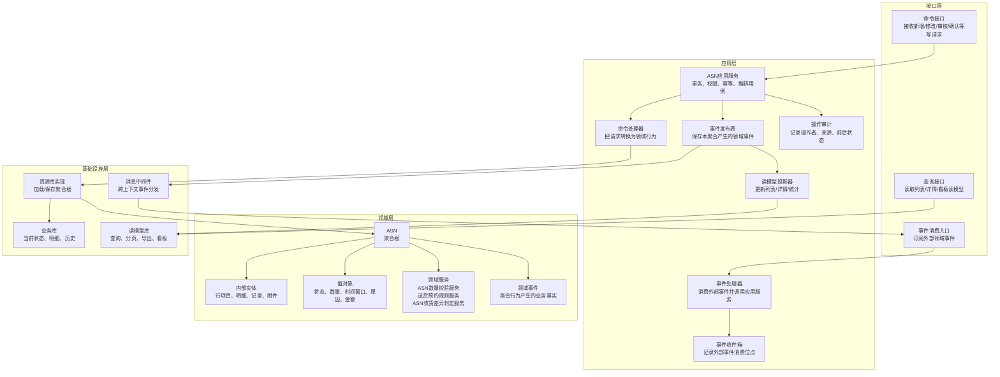
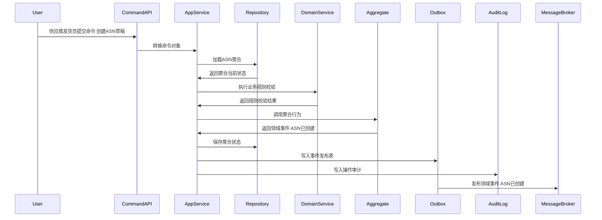
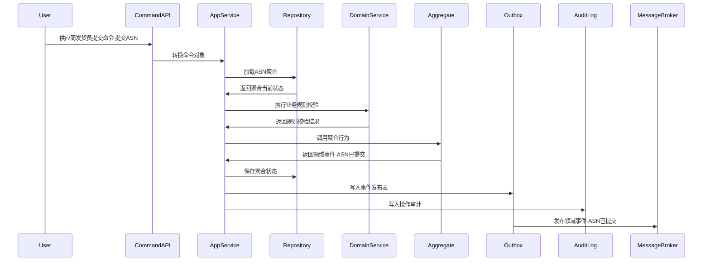
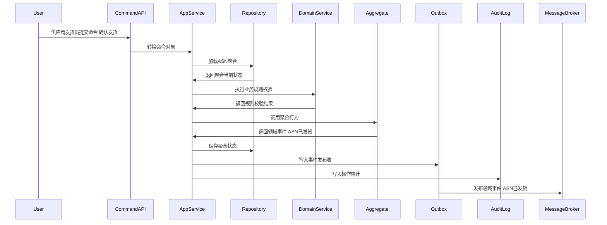
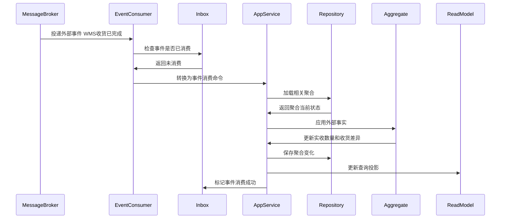
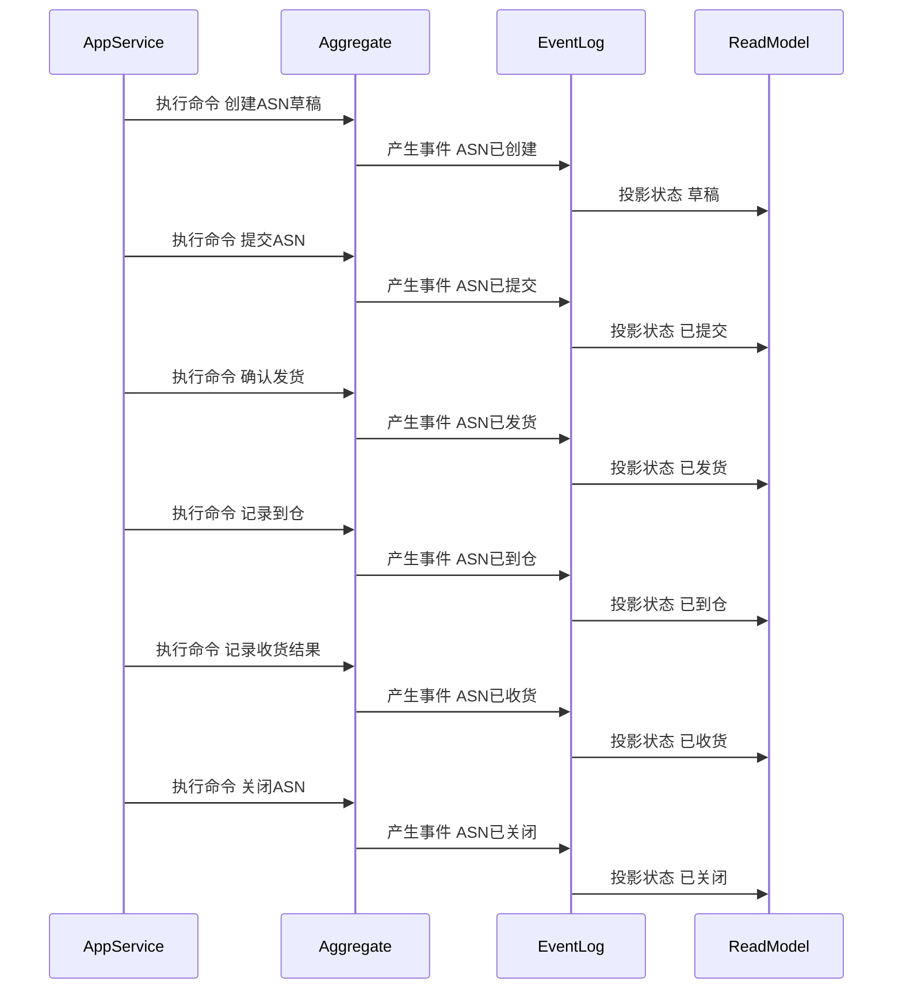

# ASN 聚合 CQRS 深度设计

> 所属上下文：供应商领域。本文按 DDD + CQRS 深入到聚合属性、命令处理、应用服务编排、领域服务规则、事件产生和事件消费逻辑。后续字段设计、接口设计、测试用例可以直接从本文拆解。

## 1. 业务目标分析

管理供应商发货通知、预约到仓、发货明细、到仓登记、收货质检回传和关闭，提前让仓库知道供应商将送什么、送多少、何时送达。

| 设计项 | 结论 |
| --- | --- |
| 限界上下文 | 供应商领域 |
| 子域类型 | 核心采购协同的执行支撑域，连接供应商发货与WMS收货 |
| 聚合根 | ASN |
| 数据主权 | 本上下文拥有 `ASN` 的生命周期、状态、业务规则和领域事件；外部系统只能通过命令或事件协作，不能直接修改聚合数据 |
| 主要使用角色 | 供应商发货员、采购员、仓库收货员、WMS、系统预约策略 |
| 核心不变量 | 外部只能通过聚合根修改内部实体；状态流转必须合法；每个写命令必须具备幂等键、操作者、来源系统和审计信息 |

## 2. 角色、场景与流程分析

| 场景 | 发起角色 | 业务意图 | 聚合响应 | 结果事件 |
| --- | --- | --- | --- | --- |
| 创建ASN草稿 | 供应商发货员 | 推进 `ASN` 业务状态或业务属性 | 从已确认采购订单创建草稿，复制可发货订单行 | ASN已创建 |
| 提交ASN | 供应商发货员 | 推进 `ASN` 业务状态或业务属性 | 草稿->已提交，校验通知数量不超可发货量、预约时间可用 | ASN已提交 |
| 修改ASN | 供应商发货员 | 推进 `ASN` 业务状态或业务属性 | 未发货前允许修改数量、批次、预约窗口 | ASN已修改 |
| 取消ASN | 供应商发货员/采购员 | 推进 `ASN` 业务状态或业务属性 | 未到仓前可取消，释放预约资源 | ASN已取消 |
| 确认发货 | 供应商发货员 | 推进 `ASN` 业务状态或业务属性 | 已提交->已发货，写入物流和车辆信息 | ASN已发货 |
| 记录到仓 | WMS到仓事件 | 推进 `ASN` 业务状态或业务属性 | 已发货/已提交->已到仓，记录到仓时间 | ASN已到仓 |

## 3. 领域边界与分层架构

领域事件的位置要明确区分三层含义：

- 领域层：聚合行为成功后产生领域事件对象，事件表达已经发生的业务事实。
- 应用层：应用服务在同一事务内保存聚合状态、保存事件发布表、记录审计日志。
- 基础设施层：事件发布器把发布表事件投递到消息中间件；事件消费者通过收件箱保证幂等消费，并更新本地聚合或读模型。

## 4. 聚合属性设计

这些属性是写模型的核心属性，不等同于数据库表字段。字段设计时可以按聚合根、内部实体、值对象、历史表、读模型分别落表。

| 属性 | 业务含义 | 模型归属 | 是否可变 | 主要修改命令 | 变化规则 |
| --- | --- | --- | --- | --- | --- |
| asnId | ASN ID | 聚合根 | 否 | 创建ASN | 全局唯一 |
| asnNo | ASN编号 | 值对象 | 否 | 创建ASN | 按规则生成 |
| purchaseOrderId | 采购订单ID | 外部事实快照 | 否 | 创建ASN | 必须来源于已确认采购订单 |
| supplierId | 供应商ID | 外部事实快照 | 否 | 创建ASN | 发货主体 |
| asnStatus | ASN状态 | 值对象 | 是 | 提交/发货/到仓/收货/关闭 | 草稿、已提交、已发货、已到仓、部分收货、已收货、已取消、已关闭 |
| asnLineList | ASN行 | 内部实体集合 | 是 | 创建/修改ASN | SKU、通知数量、批次、效期、包装信息 |
| appointmentWindow | 预约到仓时间窗 | 值对象 | 是 | 提交/修改ASN | 需满足仓库预约容量和业务日历 |
| shipmentInfo | 发运信息 | 内部实体 | 是 | 确认发货 | 承运商、车牌、司机、联系方式、运单号 |
| receiptResult | 收货结果 | 内部实体 | 是 | WMS收货事件消费 | 实收数量、拒收数量、质检状态、差异原因 |

## 5. 命令与应用服务逻辑

应用服务不承载核心业务规则，主要负责编排：权限校验、幂等校验、加载聚合、调用领域行为或领域服务、保存聚合、写事件发布表、写审计日志。

| 命令 | 发起者 | 应用服务处理逻辑 | 参与领域服务 | 成功后领域事件 |
| --- | --- | --- | --- | --- |
| 创建ASN草稿 | 供应商发货员 | 从已确认采购订单创建草稿，复制可发货订单行 | ASN数量校验服务 | ASN已创建 |
| 提交ASN | 供应商发货员 | 草稿->已提交，校验通知数量不超可发货量、预约时间可用 | 送货预约规则服务 | ASN已提交 |
| 修改ASN | 供应商发货员 | 未发货前允许修改数量、批次、预约窗口 | ASN数量校验服务 | ASN已修改 |
| 取消ASN | 供应商发货员/采购员 | 未到仓前可取消，释放预约资源 | 送货预约规则服务 | ASN已取消 |
| 确认发货 | 供应商发货员 | 已提交->已发货，写入物流和车辆信息 | 送货预约规则服务 | ASN已发货 |
| 记录到仓 | WMS到仓事件 | 已发货/已提交->已到仓，记录到仓时间 | 送货预约规则服务 | ASN已到仓 |
| 记录收货结果 | WMS收货事件 | 根据实收结果变更为部分收货或已收货 | ASN收货差异判定服务 | ASN已收货/ASN部分收货 |
| 关闭ASN | 采购员/系统 | 收货完成、取消或异常处理完成后关闭 | ASN收货差异判定服务 | ASN已关闭 |

### 5.1 应用服务通用处理模板

1. 接口层接收请求，校验必填参数和传输格式，生成命令对象。
2. 应用层根据用户、角色、组织、供应商范围做权限校验。
3. 应用层使用 `来源系统 + 业务单号 + 命令类型 + 幂等键` 做幂等检查。
4. 应用层通过资源库加载 `ASN` 聚合根；新建场景则先校验唯一性和外部事实快照。
5. 聚合根执行业务行为，必要时调用领域服务判断跨实体规则。
6. 聚合根修改自身属性、内部实体和值对象，并产生领域事件。
7. 应用层在同一事务中保存聚合、事件发布表、操作审计。
8. 事件发布器异步投递事件，读模型投影器更新查询模型。

### 5.2 关键命令处理细节

| 关键命令 | 前置校验 | 聚合行为 | 异常/补偿处理 |
| --- | --- | --- | --- |
| 提交ASN | ASN草稿；通知数量不超过订单可发货量；预约窗口可用 | 状态改已提交；锁定通知数量和预约资源 | 超过可发货量或预约容量不足时拒绝提交 |
| 修改ASN | ASN未发货；修改后仍满足数量和预约规则 | 更新ASN行、批次、预约窗口；发布修改事件给WMS | 已到仓或已收货不允许修改，只能走差异处理 |
| 确认发货 | ASN已提交；物流、车辆、运单信息完整 | 状态改已发货；写入发运信息 | 缺少必要物流信息时保持已提交 |
| 记录收货结果 | WMS回传收货事实；ASN已到仓或已发货 | 写入实收、拒收、差异；状态改部分收货或已收货 | 实收超过通知数量时生成超收差异，不直接覆盖通知数量 |

## 6. 领域服务逻辑

| 领域服务 | 解决的问题 | 输入 | 输出 | 不能放在单个实体中的原因 |
| --- | --- | --- | --- | --- |
| ASN数量校验服务 | 判断 `ASN` 在当前业务场景下是否允许执行关键动作 | 聚合当前状态、命令参数、必要外部事实快照、策略配置 | 可执行/不可执行、原因码、建议动作 | 规则涉及多个内部实体、外部事实快照或可配置策略，不属于单一实体的自然职责 |
| 送货预约规则服务 | 判断 `ASN` 在当前业务场景下是否允许执行关键动作 | 聚合当前状态、命令参数、必要外部事实快照、策略配置 | 可执行/不可执行、原因码、建议动作 | 规则涉及多个内部实体、外部事实快照或可配置策略，不属于单一实体的自然职责 |
| ASN收货差异判定服务 | 判断 `ASN` 在当前业务场景下是否允许执行关键动作 | 聚合当前状态、命令参数、必要外部事实快照、策略配置 | 可执行/不可执行、原因码、建议动作 | 规则涉及多个内部实体、外部事实快照或可配置策略，不属于单一实体的自然职责 |

### 6.1 领域服务设计原则

- 领域服务必须使用业务语言命名，返回业务判断结果，不直接操作数据库、消息队列或远程接口。
- 领域服务可以读取应用层传入的外部事实快照，但不能绕过聚合根直接修改聚合状态。
- 如果规则只依赖聚合自身属性，应优先放回聚合根方法；只有跨实体、跨策略、跨事实的规则才放入领域服务。

### 6.2 领域服务关键规则

| 领域服务 | 核心逻辑 |
| --- | --- |
| ASN数量校验服务 | 校验ASN通知数量、累计发货数量、订单剩余可发货数量、批次和效期要求。 |
| 送货预约规则服务 | 校验仓库、月台、时间窗、供应商预约容量、节假日和黑名单限制。 |
| ASN收货差异判定服务 | 根据通知数量、实收数量、拒收数量、质检结果识别短到、超到、拒收、批次不符。 |

## 7. 事件产生逻辑

| 领域事件 | 触发命令 | 关键载荷 | 主要消费者 |
| --- | --- | --- | --- |
| ASN已创建 | 创建ASN草稿 | asnId、purchaseOrderId、供应商 | ASN读模型 |
| ASN已提交 | 提交ASN | asnId、预约时间、通知数量 | WMS预约收货、采购系统 |
| ASN已修改 | 修改ASN | asnId、变更字段、通知数量 | WMS预约调整 |
| ASN已取消 | 取消ASN | asnId、取消原因 | WMS预约释放、采购系统 |
| ASN已发货 | 确认发货 | asnId、物流信息、发货时间 | WMS、采购跟踪 |
| ASN已到仓 | 记录到仓 | asnId、到仓时间 | 采购跟踪、供应商评分 |
| ASN已收货 | 记录收货结果 | asnId、实收数量、差异 | 采购系统、评分、质量问题 |

### 7.1 事件生成规则

- 事件名称必须使用过去式，表达业务事实已经发生。
- 事件由聚合根在业务行为成功后产生，应用服务只负责收集和发布。
- 事件载荷必须包含事件编号、事件版本、发生时间、来源上下文、聚合ID、聚合版本、操作者和业务关键字段。
- 同一命令如果因为幂等重复提交被识别为已处理，不能重复产生领域事件。
- 事件发布采用发布表模式，保证聚合状态和待发布事件在同一事务内落库。

## 8. 事件订阅与消费逻辑

| 订阅事件 | 处理应用服务 | 消费后数据变化 | 幂等键 |
| --- | --- | --- | --- |
| 采购订单已确认 | 订单确认事件消费服务 | 允许创建ASN，并建立可发货数量快照 | 来源上下文+事件编号+purchaseOrderId |
| WMS到货已登记 | 到仓事件消费服务 | ASN状态更新为已到仓，记录到仓时间 | WMS上下文+事件编号+asnId |
| WMS收货已完成 | 收货事件消费服务 | 更新实收、拒收和差异，状态部分收货/已收货 | WMS上下文+事件编号+receiptId |
| 质检已完成 | 质检事件消费服务 | 更新质检结果快照，为质量问题和评分提供事实 | WMS上下文+事件编号+qcId |
| 采购订单已取消 | 采购订单事件消费服务 | 未发货ASN自动取消或生成异常待办 | 采购上下文+事件编号+purchaseOrderId |

### 8.1 消费规则

- 消费外部事件时，先写入或检查事件收件箱，幂等键为 `来源上下文 + 事件编号 + 业务主键`。
- 外部事件不能直接修改本聚合内部字段，必须转换成本上下文的事件消费命令，再由应用服务加载聚合并调用聚合行为。
- 消费成功后要记录消费位点；消费失败要保留错误原因、重试次数和人工处理入口。
- 如果外部事件到达顺序不确定，应按外部业务版本号或发生时间做乱序保护。

## 9. 关键时序图

以下时序图使用 Mermaid 最小兼容语法，只保留基础参与者、基础消息和单向调用，避免旧版 Markdown 插件解析失败。

### 9.1 命令处理、聚合变更与事件发布

### 9.2 典型业务命令一

### 9.3 典型业务命令二

### 9.4 事件订阅、幂等消费与本地状态变化

### 9.5 聚合状态推进时序

## 10. 不变量、异常补偿、权限与审计

| 类型 | 规则 |
| --- | --- |
| 聚合不变量 | `ASN` 的状态只能按本文状态流转推进；内部实体不能脱离聚合根单独被外部修改 |
| 数量/金额/时间不变量 | 涉及数量、金额、有效期、截止时间、交期、结算周期时，必须用值对象封装校验，避免散落在接口层 |
| 幂等 | 所有命令必须携带幂等键；所有消费事件必须进入收件箱；重复处理返回原结果 |
| 并发 | 聚合保存使用版本号乐观锁；并发冲突时应用服务重新加载聚合并返回可重试错误 |
| 补偿 | 事件发布失败走发布表重试；消费失败走收件箱重试；跨上下文部分成功通过补偿命令或人工待办处理 |
| 权限 | 按角色、组织、供应商范围和动作类型控制；供应商用户只能处理归属供应商的数据 |
| 审计 | 写命令记录操作者、来源系统、请求摘要、前状态、后状态、领域事件编号和失败原因 |

## 11. 读模型设计

读模型服务于查询和页面展示，不参与聚合不变量保护。写入决策必须回到应用服务、聚合根和领域服务。

| 读模型 | 使用场景 | 主要字段 |
| --- | --- | --- |
| ASN列表读模型 | ASN查询、分页、状态筛选 | ASN编号、采购订单、供应商、预约时间、状态 |
| ASN详情读模型 | 展示发货、到仓、收货全过程 | ASN行、物流、预约、收货、质检、差异 |
| 到仓预约看板读模型 | 仓库查看供应商预约 | 仓库、时间窗、SKU件数、车辆、状态 |

## 12. 设计结论与待确认问题

### 12.1 设计结论

- `ASN` 是供应商领域内独立保护业务不变量的聚合根。
- 命令处理属于应用层用例编排；核心业务判断属于聚合根和领域服务；事件发布和消费通过发布表、收件箱和读模型投影落地。
- 事件处于领域层产生、应用层持久化与编排、基础设施层投递和消费的位置，不能把消息队列事件直接当成领域模型本身。

### 12.2 待确认问题

| 问题 | 默认建议 |
| --- | --- |
| 是否需要多组织、多采购组织、多供应商账号隔离 | 建议从一开始保留组织、供应商、用户权限范围字段 |
| 是否允许人工越权修改终态单据 | 默认不允许；如确需修正，应做红冲、作废、补偿单或管理员审计命令 |
| 事件保留多久 | 领域事件和审计日志建议长期保留；发布表可归档但不能影响追溯 |
| 是否需要事件溯源 | 当前阶段不建议全量事件溯源，优先当前状态表 + 历史表 + 事件日志 |
