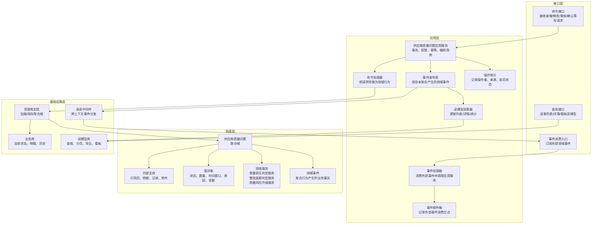
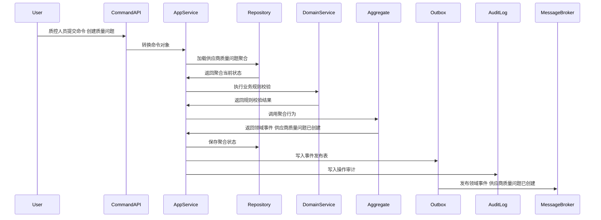
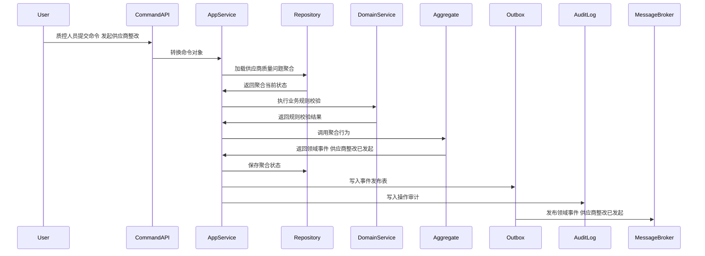
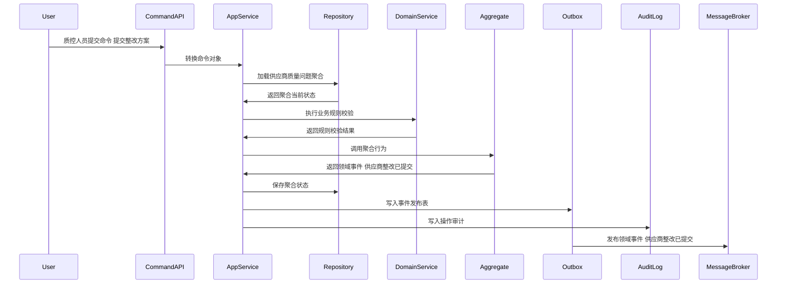
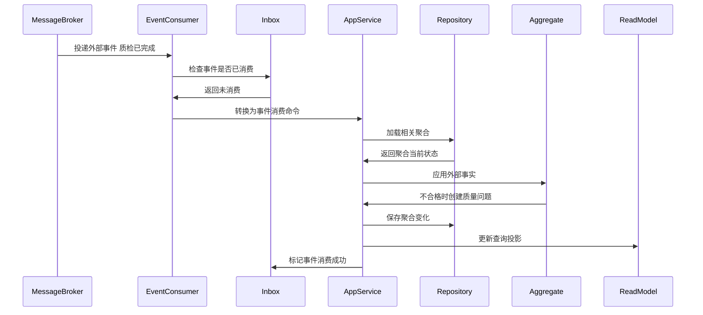
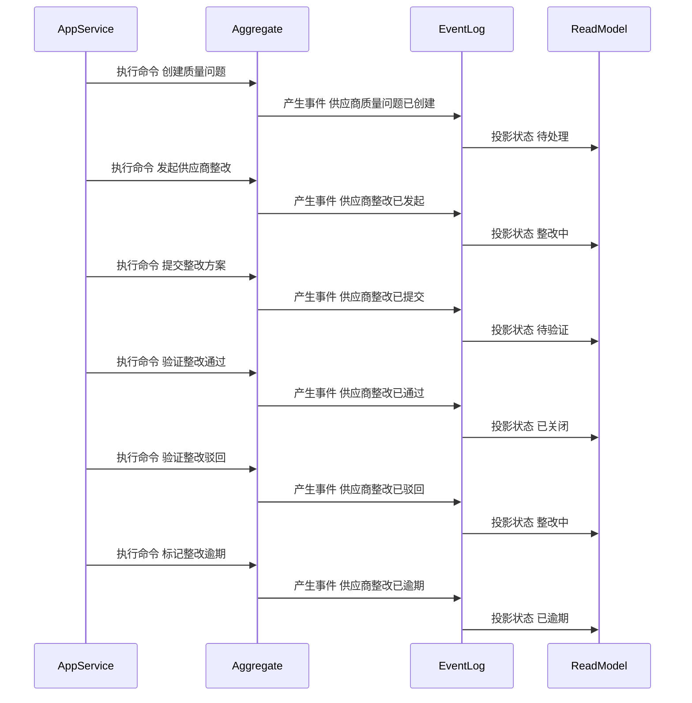

# 08-供应商质量问题聚合CQRS设计

> 所属上下文：供应商领域。本文按 DDD + CQRS 深入到聚合属性、命令处理、应用服务编排、领域服务规则、事件产生和事件消费逻辑。后续字段设计、接口设计、测试用例可以直接从本文拆解。

## 1. 业务目标分析

管理供应商因质检不合格、客诉、退货、包装异常等产生的质量问题，以及整改、验证、关闭和风险升级全过程。

| 设计项    | 结论                                                             |
| ------ | -------------------------------------------------------------- |
| 限界上下文  | 供应商领域                                                          |
| 子域类型   | 支撑域，影响供应商准入、评分、冻结和退供                                           |
| 聚合根    | 供应商质量问题                                                        |
| 数据主权   | 本上下文拥有 `供应商质量问题` 的生命周期、状态、业务规则和领域事件；外部系统只能通过命令或事件协作，不能直接修改聚合数据 |
| 主要使用角色 | 质控人员、采购员、供应商质量负责人、采购经理、系统逾期任务                                  |
| 核心不变量  | 外部只能通过聚合根修改内部实体；状态流转必须合法；每个写命令必须具备幂等键、操作者、来源系统和审计信息            |

## 2. 角色、场景与流程分析

| 场景 | 发起角色 | 业务意图 | 聚合响应 | 结果事件 |
| --- | --- | --- | --- | --- |
| 创建质量问题 | 质控人员/质检事件 | 推进 `供应商质量问题` 业务状态或业务属性 | 根据质检或客诉事实创建问题，判定严重等级 | 供应商质量问题已创建 |
| 发起供应商整改 | 质控人员 | 推进 `供应商质量问题` 业务状态或业务属性 | 待处理->整改中，设置整改要求和截止时间 | 供应商整改已发起 |
| 提交整改方案 | 供应商质量负责人 | 推进 `供应商质量问题` 业务状态或业务属性 | 整改中->待验证，提交原因分析和措施 | 供应商整改已提交 |
| 验证整改结果 | 质控人员 | 推进 `供应商质量问题` 业务状态或业务属性 | 待验证->已关闭或整改中，记录验证结论 | 供应商整改已通过/供应商整改已驳回 |
| 标记整改逾期 | 系统任务 | 推进 `供应商质量问题` 业务状态或业务属性 | 超过截止时间且未提交/未通过，状态->已逾期 | 供应商整改已逾期 |
| 升级质量风险 | 质控经理 | 推进 `供应商质量问题` 业务状态或业务属性 | 严重或多次逾期时状态->已升级，生成冻结或扣分建议 | 供应商质量风险已升级 |

## 3. 领域边界与分层架构

领域事件的位置要明确区分三层含义：

- 领域层：聚合行为成功后产生领域事件对象，事件表达已经发生的业务事实。
- 应用层：应用服务在同一事务内保存聚合状态、保存事件发布表、记录审计日志。
- 基础设施层：事件发布器把发布表事件投递到消息中间件；事件消费者通过收件箱保证幂等消费，并更新本地聚合或读模型。

## 4. 聚合属性设计

这些属性是写模型的核心属性，不等同于数据库表字段。字段设计时可以按聚合根、内部实体、值对象、历史表、读模型分别落表。

| 属性 | 业务含义 | 模型归属 | 是否可变 | 主要修改命令 | 变化规则 |
| --- | --- | --- | --- | --- | --- |
| qualityIssueId | 质量问题ID | 聚合根 | 否 | 创建质量问题 | 全局唯一 |
| supplierId | 供应商ID | 外部事实快照 | 否 | 创建质量问题 | 责任供应商 |
| sourceType | 来源类型 | 值对象 | 否 | 创建质量问题 | 质检、客诉、退供、抽检、审厂 |
| issueStatus | 问题状态 | 值对象 | 是 | 发起整改/提交整改/验证/关闭 | 待处理、整改中、待验证、已关闭、已逾期、已升级 |
| severity | 严重等级 | 值对象 | 是 | 创建/升级风险 | 轻微、一般、严重、致命 |
| issueLineList | 问题明细 | 内部实体集合 | 是 | 创建质量问题 | SKU、批次、数量、缺陷类型、照片附件 |
| correctionPlan | 整改方案 | 内部实体 | 是 | 提交整改 | 原因分析、纠正措施、预防措施、完成时间 |
| verificationRecord | 验证记录 | 内部实体集合 | 是 | 验证整改 | 验证人、结果、证据、结论 |
| deadline | 整改截止时间 | 值对象 | 是 | 发起整改 | 超过后触发逾期事件 |

## 5. 命令与应用服务逻辑

应用服务不承载核心业务规则，主要负责编排：权限校验、幂等校验、加载聚合、调用领域行为或领域服务、保存聚合、写事件发布表、写审计日志。

| 命令 | 发起者 | 应用服务处理逻辑 | 参与领域服务 | 成功后领域事件 |
| --- | --- | --- | --- | --- |
| 创建质量问题 | 质控人员/质检事件 | 根据质检或客诉事实创建问题，判定严重等级 | 质量责任判定服务 | 供应商质量问题已创建 |
| 发起供应商整改 | 质控人员 | 待处理->整改中，设置整改要求和截止时间 | 质量风险升级服务 | 供应商整改已发起 |
| 提交整改方案 | 供应商质量负责人 | 整改中->待验证，提交原因分析和措施 | 整改逾期判定服务 | 供应商整改已提交 |
| 验证整改结果 | 质控人员 | 待验证->已关闭或整改中，记录验证结论 | 质量责任判定服务 | 供应商整改已通过/供应商整改已驳回 |
| 标记整改逾期 | 系统任务 | 超过截止时间且未提交/未通过，状态->已逾期 | 整改逾期判定服务 | 供应商整改已逾期 |
| 升级质量风险 | 质控经理 | 严重或多次逾期时状态->已升级，生成冻结或扣分建议 | 质量风险升级服务 | 供应商质量风险已升级 |
| 关闭质量问题 | 质控经理 | 整改通过或无需整改后关闭 | 质量责任判定服务 | 供应商质量问题已关闭 |

### 5.1 应用服务通用处理模板

1. 接口层接收请求，校验必填参数和传输格式，生成命令对象。
2. 应用层根据用户、角色、组织、供应商范围做权限校验。
3. 应用层使用 `来源系统 + 业务单号 + 命令类型 + 幂等键` 做幂等检查。
4. 应用层通过资源库加载 `供应商质量问题` 聚合根；新建场景则先校验唯一性和外部事实快照。
5. 聚合根执行业务行为，必要时调用领域服务判断跨实体规则。
6. 聚合根修改自身属性、内部实体和值对象，并产生领域事件。
7. 应用层在同一事务中保存聚合、事件发布表、操作审计。
8. 事件发布器异步投递事件，读模型投影器更新查询模型。

### 5.2 关键命令处理细节

| 关键命令 | 前置校验 | 聚合行为 | 异常/补偿处理 |
| --- | --- | --- | --- |
| 创建质量问题 | 来源事实明确；供应商责任可初步判定；缺陷证据存在 | 创建待处理问题；记录来源、严重等级、问题明细 | 证据不足时生成待补证状态，不进入整改流程 |
| 发起供应商整改 | 问题待处理；整改要求、截止时间、责任人明确 | 状态改整改中；生成供应商整改待办 | 致命缺陷可同步生成冻结建议事件 |
| 提交整改方案 | 状态整改中；整改方案包含原因分析、措施、证据 | 状态改待验证；记录整改版本和提交时间 | 逾期提交仍可接收，但产生逾期事实用于评分 |
| 验证整改结果 | 状态待验证；验证结论和证据完整 | 通过则关闭；驳回则回整改中并记录驳回原因 | 多次驳回触发风险升级策略 |

## 6. 领域服务逻辑

| 领域服务 | 解决的问题 | 输入 | 输出 | 不能放在单个实体中的原因 |
| --- | --- | --- | --- | --- |
| 质量责任判定服务 | 判断 `供应商质量问题` 在当前业务场景下是否允许执行关键动作 | 聚合当前状态、命令参数、必要外部事实快照、策略配置 | 可执行/不可执行、原因码、建议动作 | 规则涉及多个内部实体、外部事实快照或可配置策略，不属于单一实体的自然职责 |
| 整改逾期判定服务 | 判断 `供应商质量问题` 在当前业务场景下是否允许执行关键动作 | 聚合当前状态、命令参数、必要外部事实快照、策略配置 | 可执行/不可执行、原因码、建议动作 | 规则涉及多个内部实体、外部事实快照或可配置策略，不属于单一实体的自然职责 |
| 质量风险升级服务 | 判断 `供应商质量问题` 在当前业务场景下是否允许执行关键动作 | 聚合当前状态、命令参数、必要外部事实快照、策略配置 | 可执行/不可执行、原因码、建议动作 | 规则涉及多个内部实体、外部事实快照或可配置策略，不属于单一实体的自然职责 |

### 6.1 领域服务设计原则

- 领域服务必须使用业务语言命名，返回业务判断结果，不直接操作数据库、消息队列或远程接口。
- 领域服务可以读取应用层传入的外部事实快照，但不能绕过聚合根直接修改聚合状态。
- 如果规则只依赖聚合自身属性，应优先放回聚合根方法；只有跨实体、跨策略、跨事实的规则才放入领域服务。

### 6.2 领域服务关键规则

| 领域服务 | 核心逻辑 |
| --- | --- |
| 质量责任判定服务 | 根据质检来源、SKU批次、缺陷类型、采购/仓储责任边界判断供应商是否承担责任。 |
| 整改逾期判定服务 | 根据整改截止时间、供应商等级、问题严重度判断逾期，并计算逾期天数和扣分建议。 |
| 质量风险升级服务 | 当严重缺陷、重复问题、逾期整改、验证失败累计达到阈值时，生成冻结或降级建议。 |

## 7. 事件产生逻辑

| 领域事件 | 触发命令 | 关键载荷 | 主要消费者 |
| --- | --- | --- | --- |
| 供应商质量问题已创建 | 创建质量问题 | qualityIssueId、supplierId、来源、严重等级 | 质量读模型、评分 |
| 供应商整改已发起 | 发起供应商整改 | qualityIssueId、整改要求、截止时间 | 供应商门户、待办 |
| 供应商整改已提交 | 提交整改方案 | qualityIssueId、整改方案摘要 | 质控待验证读模型 |
| 供应商整改已通过 | 验证整改结果 | qualityIssueId、验证结论 | 评分、供应商风险 |
| 供应商整改已驳回 | 验证整改结果 | qualityIssueId、驳回原因 | 供应商门户、待办 |
| 供应商整改已逾期 | 标记整改逾期 | qualityIssueId、逾期天数 | 评分、风险控制 |
| 供应商质量风险已升级 | 升级质量风险 | qualityIssueId、风险等级 | 供应商聚合、评分聚合 |

### 7.1 事件生成规则

- 事件名称必须使用过去式，表达业务事实已经发生。
- 事件由聚合根在业务行为成功后产生，应用服务只负责收集和发布。
- 事件载荷必须包含事件编号、事件版本、发生时间、来源上下文、聚合ID、聚合版本、操作者和业务关键字段。
- 同一命令如果因为幂等重复提交被识别为已处理，不能重复产生领域事件。
- 事件发布采用发布表模式，保证聚合状态和待发布事件在同一事务内落库。

## 8. 事件订阅与消费逻辑

| 订阅事件 | 处理应用服务 | 消费后数据变化 | 幂等键 |
| --- | --- | --- | --- |
| 质检已完成 | 质检事件消费服务 | 不合格或让步接收时创建质量问题 | WMS上下文+事件编号+qcId |
| 客诉已确认 | 客诉事件消费服务 | 供应商责任客诉创建质量问题 | OMS上下文+事件编号+complaintId |
| 退供已关闭 | 退供事件消费服务 | 补充退供数量、原因和损失金额 | 供应商上下文+事件编号+returnSupplierId |
| 供应商已冻结 | 供应商状态消费服务 | 质量问题仍可整改，但新问题标记高风险 | 供应商上下文+事件编号+supplierId |

### 8.1 消费规则

- 消费外部事件时，先写入或检查事件收件箱，幂等键为 `来源上下文 + 事件编号 + 业务主键`。
- 外部事件不能直接修改本聚合内部字段，必须转换成本上下文的事件消费命令，再由应用服务加载聚合并调用聚合行为。
- 消费成功后要记录消费位点；消费失败要保留错误原因、重试次数和人工处理入口。
- 如果外部事件到达顺序不确定，应按外部业务版本号或发生时间做乱序保护。

## 9. 关键时序图

### 9.1 命令处理、聚合变更与事件发布

### 9.2 典型业务命令一

### 9.3 典型业务命令二

### 9.4 事件订阅、幂等消费与本地状态变化

### 9.5 聚合状态推进时序

## 10. 不变量、异常补偿、权限与审计

| 类型 | 规则 |
| --- | --- |
| 聚合不变量 | `供应商质量问题` 的状态只能按本文状态流转推进；内部实体不能脱离聚合根单独被外部修改 |
| 数量/金额/时间不变量 | 涉及数量、金额、有效期、截止时间、交期、结算周期时，必须用值对象封装校验，避免散落在接口层 |
| 幂等 | 所有命令必须携带幂等键；所有消费事件必须进入收件箱；重复处理返回原结果 |
| 并发 | 聚合保存使用版本号乐观锁；并发冲突时应用服务重新加载聚合并返回可重试错误 |
| 补偿 | 事件发布失败走发布表重试；消费失败走收件箱重试；跨上下文部分成功通过补偿命令或人工待办处理 |
| 权限 | 按角色、组织、供应商范围和动作类型控制；供应商用户只能处理归属供应商的数据 |
| 审计 | 写命令记录操作者、来源系统、请求摘要、前状态、后状态、领域事件编号和失败原因 |

## 11. 读模型设计

读模型服务于查询和页面展示，不参与聚合不变量保护。写入决策必须回到应用服务、聚合根和领域服务。

| 读模型 | 使用场景 | 主要字段 |
| --- | --- | --- |
| 质量问题列表读模型 | 质控和采购查询 | 问题编号、供应商、来源、严重等级、状态、截止时间 |
| 整改待办读模型 | 供应商门户和质控待办 | 整改要求、截止时间、提交状态、验证状态 |
| 质量风险趋势读模型 | 供应商评分和风险分析 | 问题次数、严重等级分布、逾期次数、关闭周期 |

## 12. 设计结论与待确认问题

### 12.1 设计结论

- `供应商质量问题` 是供应商领域内独立保护业务不变量的聚合根。
- 命令处理属于应用层用例编排；核心业务判断属于聚合根和领域服务；事件发布和消费通过发布表、收件箱和读模型投影落地。
- 事件处于领域层产生、应用层持久化与编排、基础设施层投递和消费的位置，不能把消息队列事件直接当成领域模型本身。

### 12.2 待确认问题

| 问题 | 默认建议 |
| --- | --- |
| 是否需要多组织、多采购组织、多供应商账号隔离 | 建议从一开始保留组织、供应商、用户权限范围字段 |
| 是否允许人工越权修改终态单据 | 默认不允许；如确需修正，应做红冲、作废、补偿单或管理员审计命令 |
| 事件保留多久 | 领域事件和审计日志建议长期保留；发布表可归档但不能影响追溯 |
| 是否需要事件溯源 | 当前阶段不建议全量事件溯源，优先当前状态表 + 历史表 + 事件日志 |
