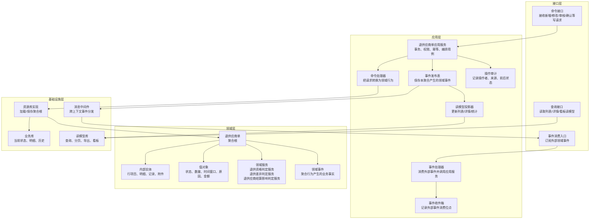
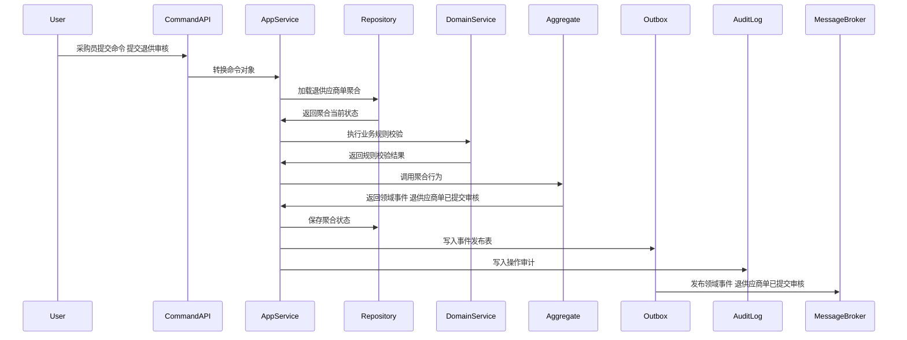
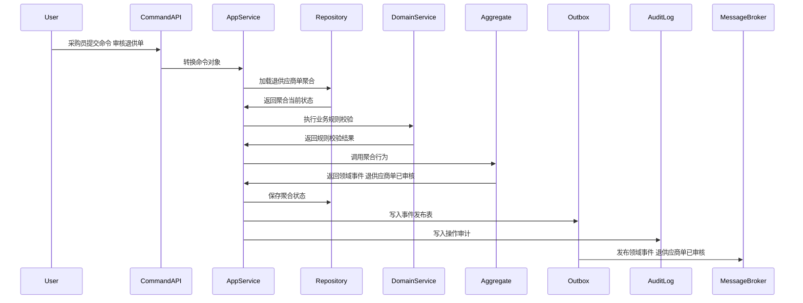
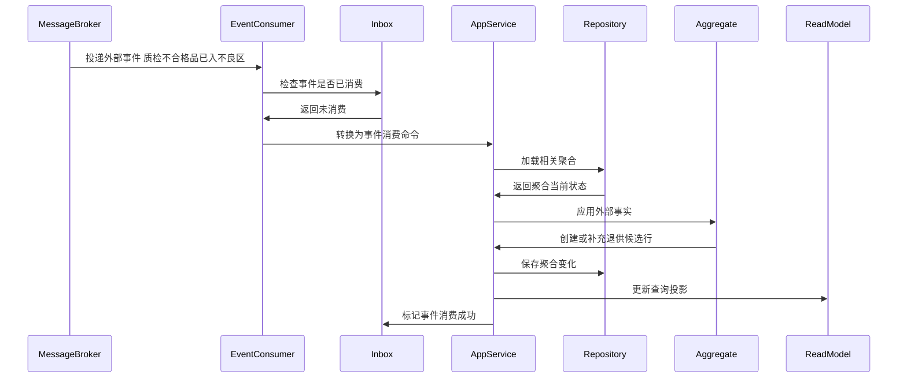
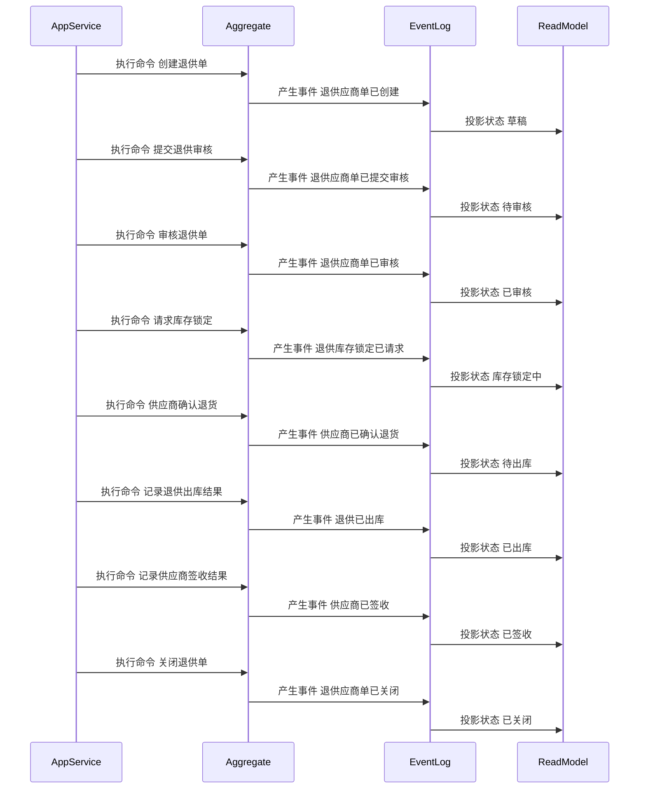

# 退供应商单聚合 CQRS 深度设计

> 所属上下文：供应商领域。本文按 DDD + CQRS 深入到聚合属性、命令处理、应用服务编排、领域服务规则、事件产生和事件消费逻辑。后续字段设计、接口设计、测试用例可以直接从本文拆解。

## 1. 业务目标分析

管理因质检不合格、库存异常、采购退货等产生的退供应商业务，从创建、审核、库存锁定、供应商确认、退供出库、签收、差异、对账到关闭。

| 设计项 | 结论 |
| --- | --- |
| 限界上下文 | 供应商领域 |
| 子域类型 | 核心执行协同的支撑域，连接质量、库存、WMS和BMS |
| 聚合根 | 退供应商单 |
| 数据主权 | 本上下文拥有 `退供应商单` 的生命周期、状态、业务规则和领域事件；外部系统只能通过命令或事件协作，不能直接修改聚合数据 |
| 主要使用角色 | 采购员、质控人员、仓库人员、供应商业务员、财务结算人员、系统库存/WMS/BMS事件 |
| 核心不变量 | 外部只能通过聚合根修改内部实体；状态流转必须合法；每个写命令必须具备幂等键、操作者、来源系统和审计信息 |

## 2. 角色、场景与流程分析

| 场景 | 发起角色 | 业务意图 | 聚合响应 | 结果事件 |
| --- | --- | --- | --- | --- |
| 创建退供单 | 采购员/质控人员 | 推进 `退供应商单` 业务状态或业务属性 | 根据不合格品、库存异常或协议退货创建草稿 | 退供应商单已创建 |
| 提交退供审核 | 采购员 | 推进 `退供应商单` 业务状态或业务属性 | 草稿->待审核，校验退供行、原因、证据 | 退供应商单已提交审核 |
| 审核退供单 | 采购经理/质控经理 | 推进 `退供应商单` 业务状态或业务属性 | 待审核->已审核或驳回，确定退供责任和数量 | 退供应商单已审核 |
| 请求库存锁定 | 退供应商单应用服务 | 推进 `退供应商单` 业务状态或业务属性 | 已审核->库存锁定中，向中央库存请求锁定退供库存 | 退供库存锁定已请求 |
| 记录库存锁定结果 | 库存事件消费者 | 推进 `退供应商单` 业务状态或业务属性 | 锁定成功则进入待供应商确认；失败则回到异常待处理 | 退供库存锁定结果已记录 |
| 请求供应商确认 | 采购员/系统 | 推进 `退供应商单` 业务状态或业务属性 | 待供应商确认状态下通知供应商确认退货 | 退供供应商确认已请求 |

## 3. 领域边界与分层架构

领域事件的位置要明确区分三层含义：

- 领域层：聚合行为成功后产生领域事件对象，事件表达已经发生的业务事实。
- 应用层：应用服务在同一事务内保存聚合状态、保存事件发布表、记录审计日志。
- 基础设施层：事件发布器把发布表事件投递到消息中间件；事件消费者通过收件箱保证幂等消费，并更新本地聚合或读模型。

## 4. 聚合属性设计

这些属性是写模型的核心属性，不等同于数据库表字段。字段设计时可以按聚合根、内部实体、值对象、历史表、读模型分别落表。

| 属性 | 业务含义 | 模型归属 | 是否可变 | 主要修改命令 | 变化规则 |
| --- | --- | --- | --- | --- | --- |
| returnSupplierId | 退供应商单ID | 聚合根 | 否 | 创建退供单 | 全局唯一 |
| returnSupplierNo | 退供单号 | 值对象 | 否 | 创建退供单 | 按规则生成 |
| supplierId | 供应商ID | 外部事实快照 | 否 | 创建退供单 | 退货接收方 |
| returnStatus | 退供状态 | 值对象 | 是 | 审核/锁定/确认/出库/签收/关闭 | 草稿、待审核、已审核、库存锁定中、待供应商确认、待出库、已出库、已签收、已关闭、异常关闭 |
| returnReason | 退供原因 | 值对象 | 是 | 创建/修改退供单 | 质检不合格、超收退回、库存异常、协议退货等 |
| returnLineList | 退供行 | 内部实体集合 | 是 | 创建/审核/出库回传 | SKU、批次、库存状态、申请数量、锁定数量、出库数量、签收数量 |
| inventoryLockRef | 库存锁定引用 | 内部实体 | 是 | 请求库存锁定/记录锁定结果 | 锁定单号、锁定数量、失败原因 |
| supplierConfirmRecord | 供应商确认记录 | 内部实体 | 是 | 供应商确认/反馈差异 | 确认结果、差异原因、确认时间 |
| outboundRef | 退供出库引用 | 内部实体 | 是 | 创建退供出库/记录出库结果 | 出库单号、出库状态、出库时间 |
| settlementImpact | 结算影响 | 内部实体 | 是 | 完成对账/应付冲减消费 | 冲减金额、索赔金额、对账状态 |

## 5. 命令与应用服务逻辑

应用服务不承载核心业务规则，主要负责编排：权限校验、幂等校验、加载聚合、调用领域行为或领域服务、保存聚合、写事件发布表、写审计日志。

| 命令 | 发起者 | 应用服务处理逻辑 | 参与领域服务 | 成功后领域事件 |
| --- | --- | --- | --- | --- |
| 创建退供单 | 采购员/质控人员 | 根据不合格品、库存异常或协议退货创建草稿 | 退供资格判定服务 | 退供应商单已创建 |
| 提交退供审核 | 采购员 | 草稿->待审核，校验退供行、原因、证据 | 退供资格判定服务 | 退供应商单已提交审核 |
| 审核退供单 | 采购经理/质控经理 | 待审核->已审核或驳回，确定退供责任和数量 | 退供资格判定服务 | 退供应商单已审核 |
| 请求库存锁定 | 退供应商单应用服务 | 已审核->库存锁定中，向中央库存请求锁定退供库存 | 退供资格判定服务 | 退供库存锁定已请求 |
| 记录库存锁定结果 | 库存事件消费者 | 锁定成功则进入待供应商确认；失败则回到异常待处理 | 退供差异判定服务 | 退供库存锁定结果已记录 |
| 请求供应商确认 | 采购员/系统 | 待供应商确认状态下通知供应商确认退货 | 退供差异判定服务 | 退供供应商确认已请求 |
| 供应商确认退货 | 供应商业务员 | 确认无差异则进入待出库；有差异则记录差异 | 退供差异判定服务 | 供应商已确认退货/供应商退供差异已反馈 |
| 创建退供出库 | 退供应商单应用服务 | 待出库状态下向WMS请求生成退供出库单 | 退供资格判定服务 | 退供出库已请求 |
| 记录退供出库结果 | WMS事件消费者 | 根据实际出库数量变更为已出库或部分异常 | 退供差异判定服务 | 退供已出库 |
| 记录供应商签收结果 | 供应商/WMS/物流事件 | 已出库->已签收，记录签收差异 | 退供差异判定服务 | 供应商已签收 |
| 完成退供对账 | BMS事件消费者 | 记录应付冲减或索赔结果，满足关闭条件 | 退供应商结算影响判定服务 | 退供对账已完成 |
| 关闭退供单 | 采购员/系统 | 签收和结算完成后关闭；异常场景可异常关闭 | 退供应商结算影响判定服务 | 退供应商单已关闭 |

### 5.1 应用服务通用处理模板

1. 接口层接收请求，校验必填参数和传输格式，生成命令对象。
2. 应用层根据用户、角色、组织、供应商范围做权限校验。
3. 应用层使用 `来源系统 + 业务单号 + 命令类型 + 幂等键` 做幂等检查。
4. 应用层通过资源库加载 `退供应商单` 聚合根；新建场景则先校验唯一性和外部事实快照。
5. 聚合根执行业务行为，必要时调用领域服务判断跨实体规则。
6. 聚合根修改自身属性、内部实体和值对象，并产生领域事件。
7. 应用层在同一事务中保存聚合、事件发布表、操作审计。
8. 事件发布器异步投递事件，读模型投影器更新查询模型。

### 5.2 关键命令处理细节

| 关键命令 | 前置校验 | 聚合行为 | 异常/补偿处理 |
| --- | --- | --- | --- |
| 提交退供审核 | 退供单草稿；退供原因、退供行、批次、证据完整 | 状态改待审核；锁定申请数量；生成审核待办 | 不良品未入指定区域或库存状态不符时拒绝提交 |
| 审核退供单 | 状态待审核；审核人具备权限；责任和数量明确 | 通过则已审核；驳回则返回草稿或异常关闭 | 退供责任不清时要求补充质检或采购证据 |
| 请求库存锁定 | 退供单已审核；退供行库存归属、批次、库位明确 | 状态改库存锁定中；发布库存锁定请求事件 | 库存不足或已被占用时等待库存锁定失败事件处理 |
| 供应商确认退货 | 状态待供应商确认；供应商收到退供明细 | 无差异则待出库；有差异则记录差异并生成采购待办 | 差异未处理前不能创建退供出库 |
| 记录退供出库结果 | WMS回传出库事实；状态待出库 | 写入实际出库数量和批次；状态改已出库或异常 | 实出小于锁定数量时保留差异并阻塞关闭 |
| 关闭退供单 | 供应商签收完成；结算冲减或索赔完成；差异已处理 | 状态改已关闭；释放流程待办；发布关闭事件 | 结算未完成时不能正常关闭，只能异常关闭并保留原因 |

## 6. 领域服务逻辑

| 领域服务 | 解决的问题 | 输入 | 输出 | 不能放在单个实体中的原因 |
| --- | --- | --- | --- | --- |
| 退供资格判定服务 | 判断 `退供应商单` 在当前业务场景下是否允许执行关键动作 | 聚合当前状态、命令参数、必要外部事实快照、策略配置 | 可执行/不可执行、原因码、建议动作 | 规则涉及多个内部实体、外部事实快照或可配置策略，不属于单一实体的自然职责 |
| 退供差异判定服务 | 判断 `退供应商单` 在当前业务场景下是否允许执行关键动作 | 聚合当前状态、命令参数、必要外部事实快照、策略配置 | 可执行/不可执行、原因码、建议动作 | 规则涉及多个内部实体、外部事实快照或可配置策略，不属于单一实体的自然职责 |
| 退供应商结算影响判定服务 | 判断 `退供应商单` 在当前业务场景下是否允许执行关键动作 | 聚合当前状态、命令参数、必要外部事实快照、策略配置 | 可执行/不可执行、原因码、建议动作 | 规则涉及多个内部实体、外部事实快照或可配置策略，不属于单一实体的自然职责 |

### 6.1 领域服务设计原则

- 领域服务必须使用业务语言命名，返回业务判断结果，不直接操作数据库、消息队列或远程接口。
- 领域服务可以读取应用层传入的外部事实快照，但不能绕过聚合根直接修改聚合状态。
- 如果规则只依赖聚合自身属性，应优先放回聚合根方法；只有跨实体、跨策略、跨事实的规则才放入领域服务。

### 6.2 领域服务关键规则

| 领域服务 | 核心逻辑 |
| --- | --- |
| 退供资格判定服务 | 校验退供原因、库存状态、批次、责任方、供应商是否可接收退货，以及是否满足合同或质量条款。 |
| 退供差异判定服务 | 识别申请数量、锁定数量、出库数量、供应商签收数量之间的差异，并判断是否需采购、仓库或供应商处理。 |
| 退供应商结算影响判定服务 | 根据退供原因、出库数量、签收结果、索赔规则判断应付冲减、索赔金额和关闭条件。 |

## 7. 事件产生逻辑

| 领域事件 | 触发命令 | 关键载荷 | 主要消费者 |
| --- | --- | --- | --- |
| 退供应商单已创建 | 创建退供单 | returnSupplierId、供应商、原因、申请数量 | 退供读模型 |
| 退供应商单已提交审核 | 提交退供审核 | returnSupplierId、提交人、证据摘要 | 审核待办 |
| 退供应商单已审核 | 审核退供单 | returnSupplierId、审核结果、责任方 | 中央库存、供应商门户 |
| 退供库存锁定已请求 | 请求库存锁定 | returnSupplierId、SKU、批次、数量 | 中央库存 |
| 退供供应商确认已请求 | 请求供应商确认 | returnSupplierId、退供行 | 供应商门户 |
| 供应商已确认退货 | 供应商确认退货 | returnSupplierId、确认时间 | WMS、采购系统 |
| 供应商退供差异已反馈 | 供应商确认退货 | returnSupplierId、差异类型、差异数量 | 采购员待办 |
| 退供出库已请求 | 创建退供出库 | returnSupplierId、仓库、退供行 | WMS |
| 退供已出库 | 记录退供出库结果 | returnSupplierId、实际出库数量 | BMS、评分、质量问题 |
| 供应商已签收 | 记录供应商签收结果 | returnSupplierId、签收数量、差异 | BMS、退供读模型 |
| 退供对账已完成 | 完成退供对账 | returnSupplierId、冲减金额、索赔金额 | 退供关闭策略 |
| 退供应商单已关闭 | 关闭退供单 | returnSupplierId、关闭原因 | 采购、供应商门户、评分 |

### 7.1 事件生成规则

- 事件名称必须使用过去式，表达业务事实已经发生。
- 事件由聚合根在业务行为成功后产生，应用服务只负责收集和发布。
- 事件载荷必须包含事件编号、事件版本、发生时间、来源上下文、聚合ID、聚合版本、操作者和业务关键字段。
- 同一命令如果因为幂等重复提交被识别为已处理，不能重复产生领域事件。
- 事件发布采用发布表模式，保证聚合状态和待发布事件在同一事务内落库。

## 8. 事件订阅与消费逻辑

| 订阅事件 | 处理应用服务 | 消费后数据变化 | 幂等键 |
| --- | --- | --- | --- |
| 质检不合格品已入不良区 | 质量/WMS事件消费服务 | 创建或补充退供候选行 | WMS上下文+事件编号+qcId |
| 退供库存已锁定 | 库存事件消费服务 | 记录锁定成功，状态进入待供应商确认 | 库存上下文+事件编号+lockId |
| 退供库存锁定失败 | 库存事件消费服务 | 记录失败原因，状态进入异常待处理 | 库存上下文+事件编号+lockId |
| 退供出库已完成 | WMS事件消费服务 | 记录实际出库数量和批次，状态进入已出库 | WMS上下文+事件编号+outboundId |
| 退供运输异常已发生 | 物流事件消费服务 | 记录运输异常，阻塞签收和关闭 | 物流上下文+事件编号+shipmentId |
| 应付已冲减 | BMS事件消费服务 | 记录结算影响，满足关闭条件 | BMS上下文+事件编号+payableOffsetId |
| 索赔已确认 | BMS事件消费服务 | 记录索赔结果，作为退供结算闭环依据 | BMS上下文+事件编号+claimId |

### 8.1 消费规则

- 消费外部事件时，先写入或检查事件收件箱，幂等键为 `来源上下文 + 事件编号 + 业务主键`。
- 外部事件不能直接修改本聚合内部字段，必须转换成本上下文的事件消费命令，再由应用服务加载聚合并调用聚合行为。
- 消费成功后要记录消费位点；消费失败要保留错误原因、重试次数和人工处理入口。
- 如果外部事件到达顺序不确定，应按外部业务版本号或发生时间做乱序保护。

## 9. 关键时序图

以下时序图使用 Mermaid 最小兼容语法，只保留基础参与者、基础消息和单向调用，避免旧版 Markdown 插件解析失败。

### 9.1 命令处理、聚合变更与事件发布

### 9.2 典型业务命令一

### 9.3 典型业务命令二

### 9.4 事件订阅、幂等消费与本地状态变化

### 9.5 聚合状态推进时序

## 10. 不变量、异常补偿、权限与审计

| 类型 | 规则 |
| --- | --- |
| 聚合不变量 | `退供应商单` 的状态只能按本文状态流转推进；内部实体不能脱离聚合根单独被外部修改 |
| 数量/金额/时间不变量 | 涉及数量、金额、有效期、截止时间、交期、结算周期时，必须用值对象封装校验，避免散落在接口层 |
| 幂等 | 所有命令必须携带幂等键；所有消费事件必须进入收件箱；重复处理返回原结果 |
| 并发 | 聚合保存使用版本号乐观锁；并发冲突时应用服务重新加载聚合并返回可重试错误 |
| 补偿 | 事件发布失败走发布表重试；消费失败走收件箱重试；跨上下文部分成功通过补偿命令或人工待办处理 |
| 权限 | 按角色、组织、供应商范围和动作类型控制；供应商用户只能处理归属供应商的数据 |
| 审计 | 写命令记录操作者、来源系统、请求摘要、前状态、后状态、领域事件编号和失败原因 |

## 11. 读模型设计

读模型服务于查询和页面展示，不参与聚合不变量保护。写入决策必须回到应用服务、聚合根和领域服务。

| 读模型 | 使用场景 | 主要字段 |
| --- | --- | --- |
| 退供单列表读模型 | 退供查询、分页、状态筛选 | 退供单号、供应商、原因、状态、数量、金额 |
| 退供执行跟踪读模型 | 查看锁定、供应商确认、出库、签收进度 | 库存锁定、确认记录、出库单、签收结果 |
| 退供差异处理读模型 | 处理供应商确认差异、出库差异、签收差异 | 差异类型、责任方、数量、金额、处理状态 |
| 退供结算影响读模型 | BMS冲减和索赔查看 | 冲减金额、索赔金额、应付状态、关闭条件 |

## 12. 设计结论与待确认问题

### 12.1 设计结论

- `退供应商单` 是供应商领域内独立保护业务不变量的聚合根。
- 命令处理属于应用层用例编排；核心业务判断属于聚合根和领域服务；事件发布和消费通过发布表、收件箱和读模型投影落地。
- 事件处于领域层产生、应用层持久化与编排、基础设施层投递和消费的位置，不能把消息队列事件直接当成领域模型本身。

### 12.2 待确认问题

| 问题 | 默认建议 |
| --- | --- |
| 是否需要多组织、多采购组织、多供应商账号隔离 | 建议从一开始保留组织、供应商、用户权限范围字段 |
| 是否允许人工越权修改终态单据 | 默认不允许；如确需修正，应做红冲、作废、补偿单或管理员审计命令 |
| 事件保留多久 | 领域事件和审计日志建议长期保留；发布表可归档但不能影响追溯 |
| 是否需要事件溯源 | 当前阶段不建议全量事件溯源，优先当前状态表 + 历史表 + 事件日志 |
