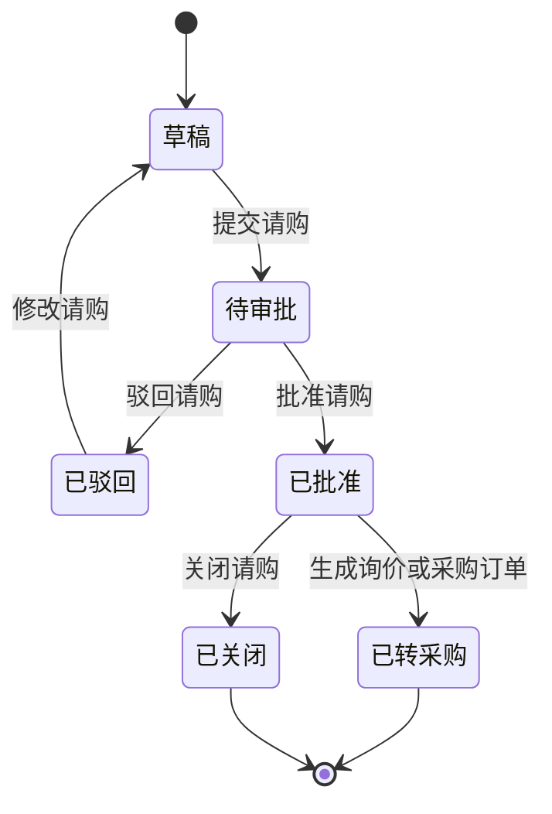
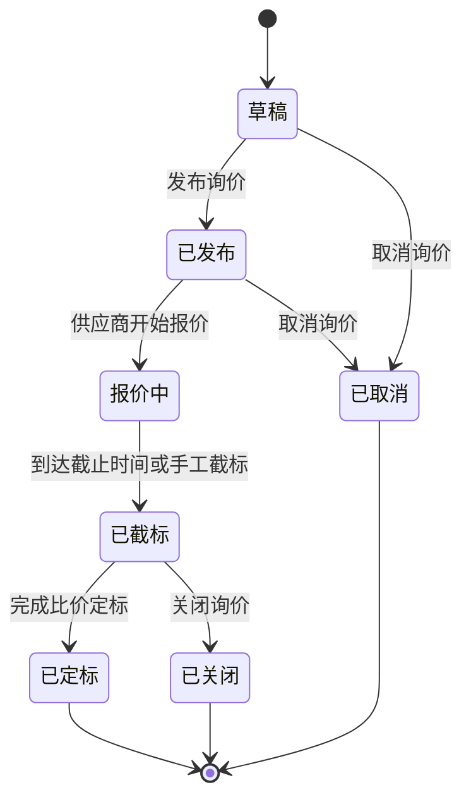
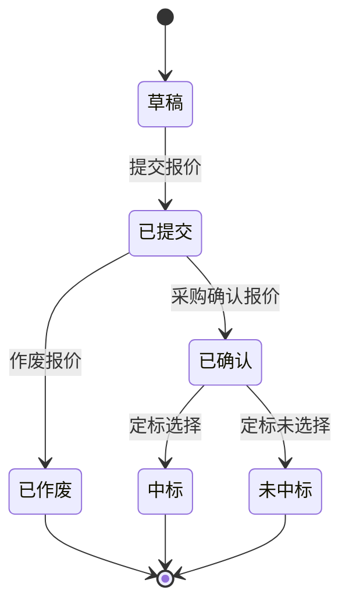
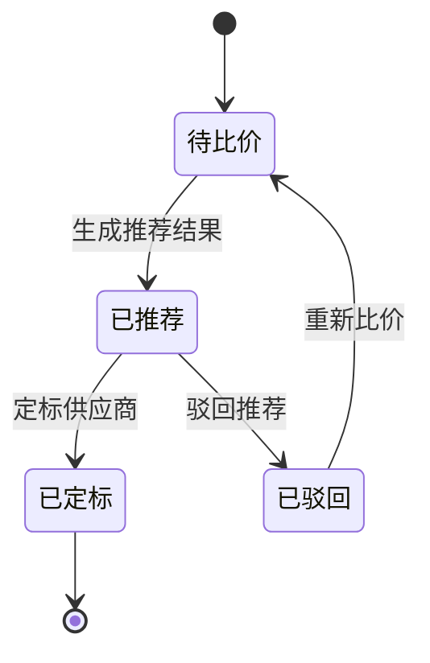
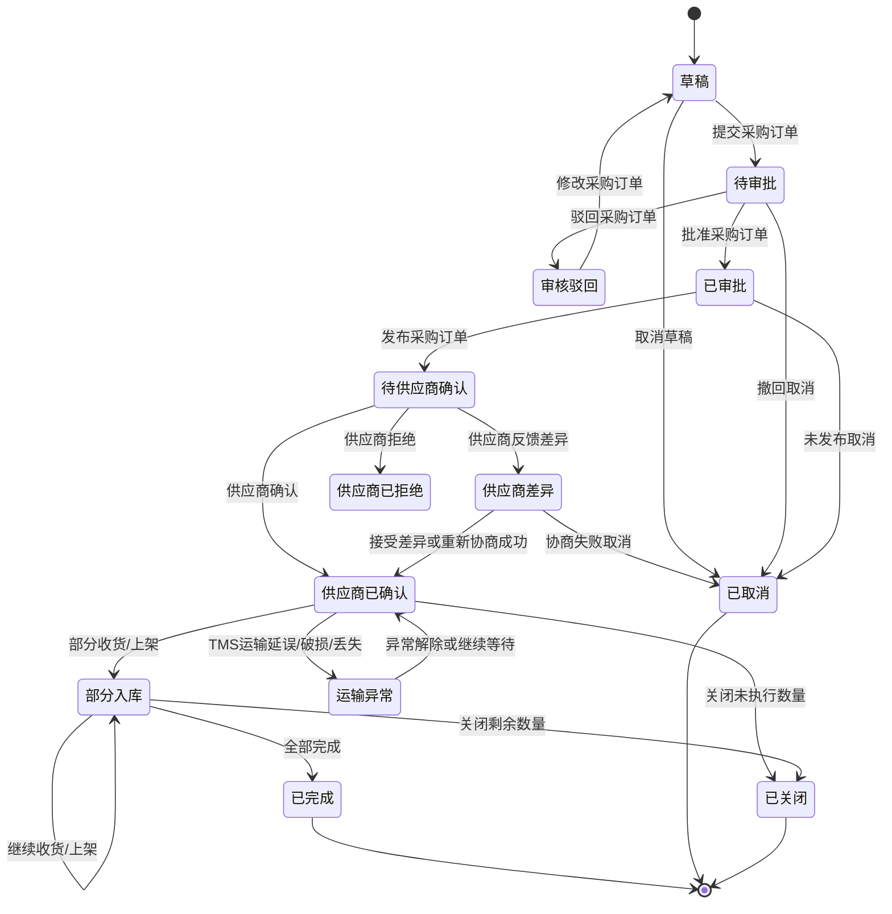
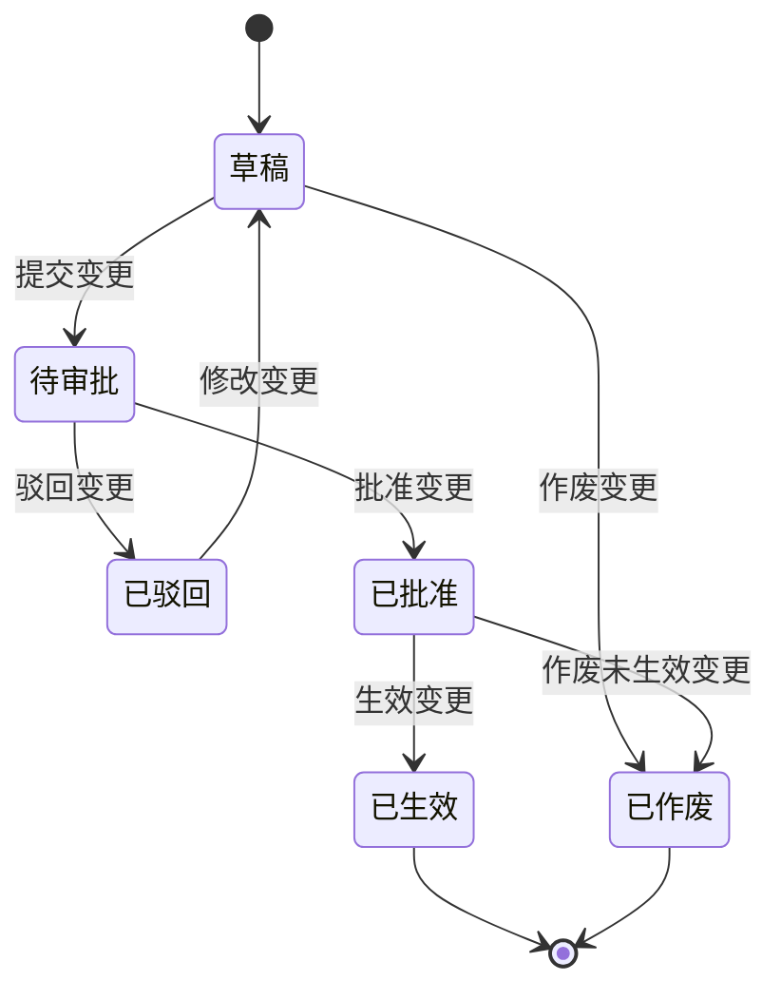
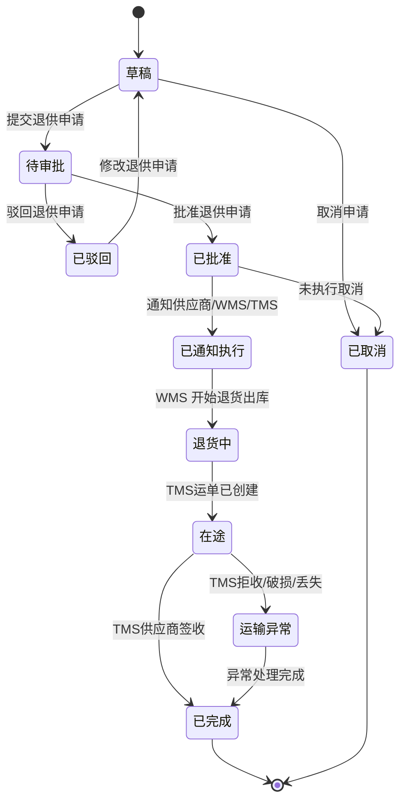

# 01-采购系统领域模型

> 本文用于采购系统领域模型设计，承接 [采购入库业务流程](../../02-业务流程/02-采购入库业务流程.md)、[供应商领域模型](../01-供应商领域模型/01-供应商领域模型.md)、[采购系统产品功能设计](../../04-子系统功能设计/02-采购系统/01-采购系统产品功能设计.md)、[采购系统接口设计](../../06-子系统接口设计/02-采购系统接口设计.md)、[中央库存领域模型](../04-中央库存领域模型/01-中央库存领域模型.md) 和 [核心聚合与不变量总表](../00-领域模型总览/01-核心聚合与不变量总表.md)。本文不只覆盖采购入库，而是覆盖02-采购系统从请购、寻源询价、比价定标、采购订单、供应商确认、到货跟踪、订单变更、退供申请到采购关闭的完整生命周期。

## 1. 事件风暴

事件风暴先从“已经发生的业务事实”开始，再反推命令、角色、聚合、策略、读模型和异常。

### 1.1 业务目标

02-采购系统解决的是：企业如何把内部采购需求转化为可执行的供应商采购承诺，并持续跟踪采购订单从审批、供应商确认、发货、收货、质检、上架到关闭的执行过程。

完整采购生命周期：

```text
采购需求产生
  -> 请购创建与审批
  -> 采购寻源/询价
  -> 供应商报价
  -> 比价定标
  -> 采购订单创建与审批
  -> 采购订单发布给供应商
  -> 供应商确认/差异反馈
  -> ASN、运输在途与到货跟踪
  -> TMS 到仓、WMS 收货、质检、上架进度回写
  -> 采购订单完成、关闭或取消
  -> 必要时发起退供应商申请
```

02-采购系统的核心不是“库存增加”，而是“采购意图、供应商义务和采购执行进度”的管理。库存增加由 WMS 上架事实和中央库存入库流水确认。

### 1.2 事件风暴总表

| 阶段 | 角色/系统 | 命令 | 处理对象 | 领域事件 | 策略/后续动作 | 读模型 | 异常 |
| --- | --- | --- | --- | --- | --- | --- | --- |
| 请购 | 需求部门 | 创建请购单 | 采购申请 | 采购申请已创建 | 进入提交审批 | 请购列表 | SKU 不可采购、预算不足 |
| 请购审批 | 采购经理/审批人 | 审批请购单 | 采购申请 | 采购申请已批准 / 采购申请已驳回 | 批准后可转询价或采购订单 | 请购审批看板 | 审批超时、数量调整 |
| 寻源询价 | 采购员 | 创建询价单、发布询价 | 询价单 | 询价单已发布 | 通知供应商报价 | 询价看板 | 供应商不足、询价截止 |
| 报价 | 供应商/采购员 | 录入或接收报价 | 供应商报价 | 供应商报价已提交 | 进入比价 | 报价列表 | 报价过期、币种税率不一致 |
| 比价定标 | 采购员/采购经理 | 生成比价、确定中标供应商 | 比价结果 | 比价已定标 | 可生成采购订单或价格协议 | 比价看板 | 低价但评分差、运输时效差、预估运费高、审批不通过 |
| 采购订单 | 采购员 | 创建采购订单 | 采购订单 | 采购订单已创建 | 提交审批 | 采购订单列表 | 价格失效、MOQ 不满足 |
| PO 审批 | 采购经理 | 审批采购订单 | 采购订单 | 采购订单已批准 / 采购订单已驳回 | 批准后可发布供应商 | 审批看板 | 金额超权限、供应商冻结 |
| PO 发布 | 采购员 | 发布采购订单 | 采购订单 | 采购订单已发布 | 01-供应商系统生成待确认任务 | 订单协同看板 | 发布失败、供应商停用 |
| 供应商确认 | 供应商系统 | 回传确认、拒绝或差异 | 供应商确认结果 | 供应商订单已确认 / 供应商订单差异已反馈 / 供应商订单已拒绝 | 采购处理差异或重新协商 | 差异待办 | 价格、数量、交期差异 |
| 订单变更 | 采购员 | 创建采购订单变更 | 采购订单变更 | 采购订单变更已生效 | 必要时重新发布供应商 | 变更记录 | 已收货行不能随意改价改量 |
| ASN 跟踪 | 供应商系统 | 提交 ASN | 入库跟踪 | ASN 已提交 | 采购更新通知数量，WMS 准备收货，TMS 可创建采购到货运输任务 | 到货看板 | 超通知、重复 ASN |
| 运输跟踪 | TMS | 回传运单、在途、到仓、异常 | 入库跟踪 | 采购运输信息已记录 / 采购货品已到仓 / 采购运输异常已登记 | 刷新预计到仓、到仓时间和异常待办，不直接确认收货 | 到货看板 | 运单延迟、破损、丢失、到仓未收货 |
| 收货质检 | WMS/质量 | 回传收货和质检结果 | 入库跟踪 | 采购货品已收货 / 采购质检已完成 | 累计收货、合格、不合格数量 | 到货跟踪 | 短收、超收、不合格 |
| 上架入库 | WMS/库存 | 回传上架和库存入库事实 | 入库跟踪、采购订单 | 采购货品已上架 / 采购订单已完成 | 判断 PO 行和单头是否完成 | 入库进度 | 上架数量大于合格数量 |
| 关闭取消 | 采购员/采购经理 | 关闭剩余、取消采购订单 | 采购订单 | 采购订单已关闭 / 采购订单已取消 | 结束未执行采购义务 | 关闭列表 | 已执行部分只能关闭剩余 |
| 退供申请 | 采购/质量/仓库 | 创建退供申请 | 退供申请 | 退供申请已提交 / 退供申请已批准 | 通知供应商、WMS 和 TMS 执行退供 | 退供跟踪 | 不合格归属争议、库存不足、退供运输异常 |

### 1.3 通用语言

| 术语 | 定义 | 所属上下文 |
| --- | --- | --- |
| 采购申请 | 需求部门提出的采购需求，说明要买什么、买多少、何时需要、为什么需要 | 采购上下文 |
| 请购 | 采购申请从草稿、审批到转采购的流程 | 采购上下文 |
| 询价单 | 采购员向一个或多个供应商询问价格、交期、供货条件的业务单据 | 采购上下文 |
| 供应商报价 | 供应商对询价内容给出的价格、税率、币种、交期和 MOQ 承诺 | 供应商/采购协同 |
| 比价定标 | 对报价、交期、质量、评分、历史表现进行比较并确定供应商 | 采购上下文 |
| 采购订单 | 企业向供应商发出的正式采购承诺，包含供应商、SKU、数量、价格、交期、目的仓 | 采购上下文 |
| 采购订单行 | 采购订单中针对某个 SKU 的采购数量、价格、税率、交期和执行进度 | 采购上下文 |
| 供应商确认 | 供应商对采购订单数量、价格和交期的接受、拒绝或差异反馈 | 供应商协同上下文 |
| 到货跟踪 | 02-采购系统跟踪 ASN、TMS 运输、WMS 收货、质检、上架的执行进度视图 | 采购上下文 |
| 退供申请 | 采购侧发起的把不良、错发、超收或可退商品退回供应商的申请 | 采购上下文 |

## 2. 子域、限界上下文、上下文映射、核心域

### 2.1 子域划分

| 子域 | 类型 | 说明 | 建模策略 |
| --- | --- | --- | --- |
| 采购需求与请购 | 核心域 | 决定采购为什么发生、由谁发起、是否被批准 | 深入建模采购申请、申请行、审批和转采购 |
| 采购寻源与询价 | 核心域 | 决定向哪些供应商询价、询价范围和报价截止 | 深入建模询价单、询价行和邀请供应商 |
| 比价定标 | 核心域 | 决定选择哪个供应商，平衡价格、交期、质量和评分 | 深入建模报价、比价结果、定标理由和审批 |
| 采购订单 | 核心域 | 决定供应商承担什么采购义务 | 深入建模采购订单、订单行、变更、取消、关闭 |
| 采购执行跟踪 | 核心域 | 跟踪供应商确认、ASN、收货、质检、上架和完成状态 | 采购保存执行进度快照，不抢占 WMS/库存主权 |
| 供应商协同 | 支撑域 | 供应商确认 PO、提交 ASN、反馈差异 | 通过01-供应商系统事件协作 |
| 仓储/WMS | 支撑域 | 执行收货、质检、上架和退供出库 | 采购消费 WMS 事实更新进度 |
| 中央库存 | 支撑域 | 管理库存余额、库存流水和库存入库事实 | 采购只消费库存事实，不直接记账 |
| 物流运输/TMS | 支撑域 | 管理采购到货、退供发运的运输任务、运单、轨迹、到仓、签收、拒收、运输异常和物流费用来源 | 采购只消费运输事实并保存执行进度快照，不维护轨迹明细和物流费用 |
| 主数据、权限、消息 | 通用域 | SKU、供应商、仓库、组织、用户、权限和通知 | 采购上下文消费主数据并保存快照 |

### 2.2 限界上下文模板

```markdown
上下文名称：02-采购系统上下文
子域类型：核心域
业务目标：管理采购需求、寻源询价、比价定标、采购订单、供应商确认结果、采购执行进度、订单变更、关闭取消和退供申请。
负责范围：采购申请、询价单、供应商报价采集、比价结果、采购订单、采购订单变更、供应商确认结果处理、到货跟踪、采购关闭、退供申请。
不负责范围：不维护供应商准入和评分主权；不执行仓库收货、质检、上架；不直接增加或扣减库存；不生成应付凭证和付款；不维护 SKU 主数据。
核心角色：需求部门用户、采购员、采购经理、质量人员、物流专员、财务人员、供应商协同系统、WMS、TMS、中央库存系统。
通用语言：采购申请、请购、询价、报价、比价、定标、采购订单、采购订单行、供应商确认、采购订单变更、到货跟踪、退供申请。
核心聚合：采购申请、询价单、供应商报价、比价结果、采购订单、采购订单变更、入库跟踪、退供申请、采购价格。
数据主权：采购意图、请购审批结果、询价和定标结果、采购订单承诺、采购订单变更、采购侧执行进度快照、退供申请。
上游上下文：主数据、供应商系统、WMS、TMS、中央库存、BMS/财务、权限系统。
下游上下文：供应商系统、WMS、TMS、中央库存、BMS/财务、报表系统。
同步命令/接口：提交请购、审批请购、发布询价、确认报价、定标、创建采购订单、审批采购订单、发布采购订单、处理供应商差异、变更采购订单、关闭采购订单、创建退供申请。
生产事件：采购申请已批准、询价单已发布、供应商报价已确认、比价已定标、采购订单已创建、采购订单已批准、采购订单已发布、采购订单变更已生效、采购订单已关闭、采购订单已取消、退供申请已批准、退供运输已请求。
消费事件：SKU已启用、供应商已启用、供应商商品已启用、供应商订单已确认、供应商订单差异已反馈、ASN已提交、运单已创建、运输已到达、运输已签收、运输已拒收、物流异常已登记、物流费用来源已生成、WMS收货已完成、质检已完成、WMS上架已完成、库存入库已完成、供应商已冻结。
一致性要求：采购订单聚合内部强一致；采购与供应商、WMS、TMS、库存、财务通过事件最终一致；外部事件消费必须幂等。
异常补偿：请购驳回、询价流标、报价过期、定标驳回、供应商拒单、交期差异、运输延误、到仓未收货、短收、超收、不合格、入库失败、已执行订单取消、退供争议、退供拒收。
主要风险：采购绕过审批、供应商不可用仍下单、报价与订单价格不一致、入库进度与 WMS 不一致、运输进度与 TMS 不一致、02-采购系统错误记库存或物流费用、已执行订单被硬取消。
```

### 2.3 上下文映射

| 上游上下文 | 下游上下文 | 映射关系 | 协作方式 | 说明 |
| --- | --- | --- | --- | --- |
| 主数据 | 采购 | 遵奉者、防腐层 | 采购消费 SKU、供应商、供应商商品、仓库、组织事件，并保存下单快照 | 主数据是基础资料权威 |
| 采购 | 供应商系统 | 客户/供应商关系、发布语言 | 采购发布询价、采购订单、退供申请；01-供应商系统生成待办 | 采购是采购意图权威 |
| 供应商系统 | 采购 | 合作关系、发布语言 | 供应商确认、拒绝、差异、ASN 以事件回传采购 | 采购保存协同结果，不直接管理供应商门户 |
| 采购 | WMS | 客户/供应商关系 | 采购订单或 ASN 形成 WMS 入库预期，WMS 回传收货质检上架事实 | WMS 是仓内作业事实权威 |
| WMS/中央库存 | 采购 | 发布语言 | 收货、质检、上架、库存入库事件更新采购执行进度 | 库存余额不由02-采购系统维护 |
| 采购 | TMS | 客户/供应商关系、发布语言 | 采购订单发布、ASN 发运和退供申请批准后，TMS 可创建采购到货或退供运输任务 | 采购拥有采购意图和执行跟踪，TMS 拥有运输任务、运单、轨迹、签收/拒收和物流费用来源 |
| TMS | 采购 | 发布语言 | 运单创建、运输到达、签收、拒收、物流异常、物流费用来源事件更新采购执行快照和异常待办 | 采购只保存运输快照和费用来源引用，不维护轨迹明细和费用结算 |
| 采购 | BMS/财务 | 发布语言 | PO、收货、入库、退供申请为对账计费提供业务依据 | BMS 是应付、发票、付款事实权威 |
| 权限系统 | 采购 | 遵奉者 | 用户、角色、权限、数据范围决定采购页面和命令可见性 | 09-权限系统不拥有采购业务状态 |

### 2.4 核心域精炼

02-采购系统的核心复杂度集中在：

1. 采购为什么发生：请购来源、预算、审批、需求优先级。
2. 向谁采购：供应商可用性、供应商商品、报价、评分、交期、历史运输时效、合同。
3. 按什么条件采购：价格、税率、币种、MOQ、单位换算、交期、目的仓。
4. 采购义务如何变更：PO 审批、发布、供应商确认、差异处理、变更、取消、关闭。
5. 执行进度如何可信：ASN、TMS 运单/到仓/异常、WMS 收货/质检/上架、库存入库事件的幂等消费和累计。
6. 异常如何闭环：拒单、运输延误、到仓未收货、短收、超收、不合格、退供、退供拒收、对账争议。

## 3. 实体、值对象、聚合

### 3.1 聚合总览

| 聚合 | 聚合根 | 内部实体 | 值对象 | 主要不变量 |
| --- | --- | --- | --- | --- |
| 采购申请 | 采购申请 | 采购申请行、审批记录 | 需求部门、用途、预算金额、期望到货日 | 未批准不能转采购；批准数量不能为负 |
| 询价单 | 询价单 | 询价行、邀请供应商 | 报价截止时间、质量要求、交付要求 | 已发布询价不能随意改核心范围 |
| 供应商报价 | 供应商报价 | 报价行、附件 | 报价金额、税率、币种、有效期、MOQ | 过期报价不能定标；税率币种必须明确 |
| 比价结果 | 比价结果 | 比价行、评分项 | 推荐理由、定标理由、供应商评分快照、运输时效快照、预估物流成本 | 定标必须来自有效报价或有效价格 |
| 采购订单 | 采购订单 | 采购订单行、供应商确认记录、执行进度快照、运输快照 | 供应商快照、SKU 快照、采购金额、税率、交期、目的仓 | 未审批不能发布；已执行不能硬取消；TMS 到仓不等于 WMS 收货；上架数量不能超过合格数量 |
| 采购订单变更 | 采购订单变更 | 变更明细 | 变更前快照、变更后快照、变更原因 | 已生效变更不可重复生效；已收货事实不能被覆盖 |
| 入库跟踪 | 入库跟踪 | 跟踪行、事件处理记录、运输快照 | ASN 号、运单号、预计到仓、收货数量、合格数量、上架数量 | 外部事件必须幂等；累计数量不能超过容差；运输轨迹只能由 TMS 事件刷新 |
| 退供申请 | 退供申请 | 退供申请行、审批记录、退供运输快照 | 退供原因、质量问题快照、仓库快照、运单号、签收/拒收结果 | 未审批不能通知执行；退供数量必须有来源依据；签收/拒收事实以 TMS 为准 |
| 采购价格 | 采购价格 | 价格行、价格版本 | 价格、税率、币种、生效期 | 同供应商同 SKU 同时间段不能存在冲突有效价 |

### 3.2 实体

| 实体 | 身份标识 | 生命周期 | 说明 |
| --- | --- | --- | --- |
| 采购申请 | 请购单号 | 草稿、待审批、已批准、已驳回、已转采购、已关闭 | 采购需求入口 |
| 采购申请行 | 请购行 ID | 跟随采购申请 | 记录 SKU、申请数量、批准数量 |
| 询价单 | 询价单号 | 草稿、已发布、报价中、已截标、已定标、已取消、已关闭 | 采购寻源入口 |
| 供应商报价 | 报价单号 | 草稿、已提交、已确认、已作废、未中标、中标 | 供应商价格承诺 |
| 比价结果 | 比价单号 | 待比价、已推荐、已定标、已驳回 | 采购选择供应商的决策记录 |
| 采购订单 | PO 单号 | 草稿、待审批、已审批、待确认、已确认、部分入库、已完成、已取消、已关闭 | 采购核心承诺 |
| 采购订单行 | PO 行 ID | 跟随采购订单 | 管理 SKU 级数量、价格、交期和进度 |
| 采购订单变更 | 变更单号 | 草稿、待审批、已批准、已生效、已作废 | 管理 PO 关键字段变更 |
| 入库跟踪 | 跟踪 ID | 已通知、已到货、已收货、已质检、已上架、异常 | 采购侧执行进度快照 |
| 退供申请 | 退供申请号 | 草稿、待审批、已批准、已通知、退货中、已完成、已取消 | 采购侧退供意图 |

### 3.3 值对象

| 值对象 | 字段 | 规则 |
| --- | --- | --- |
| 采购金额 | 未税金额、税额、含税金额、币种 | 金额不能为负，币种必须一致 |
| 采购数量 | 数量、单位、单位换算率 | 数量大于 0，换算率大于 0 |
| 交期 | 要求交期、承诺交期、预计到货日 | 承诺交期变化需要形成差异或变更 |
| 运输快照 | TMS运输任务号、运单号、承运商、运输状态、预计到仓、到仓时间、最新轨迹摘要、异常类型 | 只能由 TMS 事件刷新；采购不维护轨迹明细，不以到仓替代收货 |
| 物流费用来源引用 | 费用来源单号、费用类型、预估费用、实际费用、币种、责任方 | 费用来源来自 TMS，采购只用于采购成本分析和对账辅助 |
| 供应商快照 | 供应商 ID、编码、名称、等级、状态 | PO 发布时冻结快照 |
| SKU 快照 | SKU ID、编码、名称、规格、单位、质检要求 | 单据保存创建时快照 |
| 价格快照 | 价格类型、单价、税率、币种、生效期 | 下单后不能被价格主数据直接覆盖 |
| 质量要求 | 是否质检、检验标准、批次效期要求 | WMS 收货质检参考 |
| 执行数量快照 | 通知、收货、合格、不合格、上架、关闭数量 | 来自外部事件累计，不能手工覆盖事实 |

## 4. 聚合根、领域服务、资源库、领域事件

### 4.1 采购申请聚合模板

```markdown
聚合名称：采购申请
聚合根：PurchaseRequisition
业务目标：承载需求部门的采购需求，并经过审批后转化为采购动作。
内部实体：PurchaseRequisitionLine、ApprovalRecord
值对象：BudgetAmount、RequiredDate、Purpose、RequesterSnapshot
主要命令：创建请购、提交请购、审批请购、驳回请购、关闭请购、转采购
主要事件：采购申请已创建、采购申请已提交、采购申请已批准、采购申请已驳回、采购申请已转采购、采购申请已关闭
核心不变量：未批准不能转采购；已转采购不能修改申请行；批准数量不能超过规则允许范围；关闭后不能再转采购。
资源库：PurchaseRequisitionRepository
读模型：请购列表、请购审批看板、请购转采购跟踪
```

### 4.2 询价单聚合模板

```markdown
聚合名称：询价单
聚合根：PurchaseRfq
业务目标：组织采购询价范围、邀请供应商报价，并控制询价截止和截标。
内部实体：PurchaseRfqLine、InvitedSupplier
值对象：QuoteDeadline、DeliveryRequirement、QualityRequirement
主要命令：创建询价单、发布询价单、修改询价单、取消询价单、截标询价单、关闭询价单
主要事件：询价单已创建、询价单已发布、询价单已取消、询价已截标、询价单已关闭
核心不变量：已发布后不能删除关键询价行；报价截止后不能接收普通报价；邀请供应商必须可用。
资源库：PurchaseRfqRepository
读模型：询价列表、供应商报价进度、询价异常看板
```

### 4.3 供应商报价聚合模板

```markdown
聚合名称：供应商报价
聚合根：SupplierQuotation
业务目标：记录供应商针对询价或采购需求给出的价格、交期、税率和 MOQ 承诺。
内部实体：SupplierQuotationLine、QuotationAttachment
值对象：Money、TaxRate、Currency、ValidityPeriod、Moq
主要命令：录入报价、提交报价、确认报价、作废报价、标记中标、标记未中标
主要事件：供应商报价已提交、供应商报价已确认、供应商报价已作废、供应商报价已中标、供应商报价已失标
核心不变量：过期报价不能确认；同一报价行必须对应明确 SKU 和税率；已作废报价不能参与定标。
资源库：SupplierQuotationRepository
读模型：报价列表、报价比价表、报价历史
```

### 4.4 比价结果聚合模板

```markdown
聚合名称：比价结果
聚合根：PurchaseCompareResult
业务目标：在报价、价格、交期、质量、供应商评分、历史运输时效和预估物流成本之间做采购决策，并留下可审计的定标依据。
内部实体：CompareResultLine、CompareScoreItem
值对象：DecisionReason、SupplierScoreSnapshot、PriceScore、DeliveryScore、TransportPerformanceSnapshot、EstimatedFreightCost
主要命令：生成比价、推荐供应商、定标供应商、驳回定标
主要事件：比价已生成、供应商已推荐、比价已定标、定标已驳回
核心不变量：定标供应商必须来自有效报价或有效价格；定标理由必须记录；超过金额阈值必须审批。
资源库：PurchaseCompareResultRepository
读模型：比价定标页、供应商价格走势、定标审计记录
```

### 4.5 采购订单聚合模板

```markdown
聚合名称：采购订单
聚合根：PurchaseOrder
业务目标：形成对供应商的正式采购承诺，并跟踪供应商确认、运输到仓、收货、质检、上架和关闭。
内部实体：PurchaseOrderLine、SupplierConfirmResult、PurchaseProgressSnapshot、TransportSnapshot、OperationLog
值对象：SupplierSnapshot、SkuSnapshot、PurchaseAmount、TaxRate、DeliveryDate、WarehouseSnapshot
主要命令：创建采购订单、提交采购订单、审批采购订单、发布采购订单、处理供应商确认、处理供应商差异、记录运输事实、记录收货事实、记录质检事实、记录上架事实、取消采购订单、关闭采购订单
主要事件：采购订单已创建、采购订单已提交、采购订单已批准、采购订单已发布、供应商确认已处理、采购订单运输信息已记录、采购订单已部分入库、采购订单已完成、采购订单已取消、采购订单已关闭
核心不变量：未审批不能发布；供应商差异不能直接覆盖采购承诺；TMS 到仓不等于 WMS 收货；收货不等于入库；已入库不能取消，只能关闭剩余或退供；库存增加必须来自中央库存入库事实。
资源库：PurchaseOrderRepository
读模型：采购订单列表、采购执行进度、到货跟踪、供应商履约分析
```

### 4.6 采购订单变更聚合模板

```markdown
聚合名称：采购订单变更
聚合根：PurchaseOrderChange
业务目标：管理采购订单数量、价格、交期、目的仓、取消和关闭等关键变化，避免直接覆盖历史承诺。
内部实体：PurchaseOrderChangeLine、ChangeApprovalRecord
值对象：BeforeSnapshot、AfterSnapshot、ChangeReason
主要命令：创建变更、提交变更、审批变更、生效变更、作废变更
主要事件：采购订单变更已提交、采购订单变更已批准、采购订单变更已生效、采购订单变更已作废
核心不变量：变更必须基于 PO 当前版本；已生效变更不可重复生效；已发生收货或入库事实的数量不能被直接回退。
资源库：PurchaseOrderChangeRepository
读模型：PO 变更记录、变更审批列表、版本对比页
```

### 4.7 入库跟踪聚合模板

```markdown
聚合名称：入库跟踪
聚合根：PurchaseInboundTrack
业务目标：以采购视角汇总供应商 ASN、TMS 运输、WMS 收货、质检和上架进度。
内部实体：InboundTrackLine、ConsumedEventRecord、TransportSnapshot
值对象：AsnReference、WaybillReference、InboundOrderReference、ProgressQuantity
主要命令：记录 ASN、记录运单创建、记录运输到达、记录运输异常、记录收货、记录质检、记录上架、标记异常、关闭剩余
主要事件：采购到货已通知、采购运输信息已记录、采购货品已到仓、采购运输异常已登记、采购货品已收货、采购质检已完成、采购货品已上架、采购入库跟踪已异常、采购剩余已关闭
核心不变量：同一外部事件只能处理一次；累计通知、收货、合格、上架数量不能违反 PO 行容差；TMS 到仓不等于 WMS 收货；入库跟踪不是库存权威。
资源库：PurchaseInboundTrackRepository
读模型：到货跟踪页、采购入库进度页、异常待办
```

### 4.8 退供申请聚合模板

```markdown
聚合名称：退供申请
聚合根：SupplierReturnRequest
业务目标：采购侧发起把不良、错发、超收或可退商品退回供应商的申请，并把执行交给01-供应商系统、WMS、TMS 和库存系统。
内部实体：SupplierReturnRequestLine、ApprovalRecord、ReturnTransportSnapshot
值对象：ReturnReason、QualityIssueSnapshot、WarehouseSnapshot、SupplierSnapshot、WaybillReference
主要命令：创建退供申请、提交退供申请、审批退供申请、通知退供执行、记录退供运单、记录供应商签收/拒收、记录退供运输异常、取消退供申请、关闭退供申请
主要事件：退供申请已创建、退供申请已提交、退供申请已批准、退供申请已通知执行、退供运输信息已记录、退供供应商已签收、退供运输异常已登记、退供申请已取消、退供申请已关闭
核心不变量：未审批不能通知供应商、WMS 和 TMS；退供数量必须有库存、质检或业务依据；已执行出库后不能硬取消；退供签收、拒收和物流异常必须来自 TMS 事实。
资源库：SupplierReturnRequestRepository
读模型：退供申请列表、退供执行跟踪、质量退供分析
```

### 4.9 领域服务

| 领域服务 | 解决的问题 | 为什么不是单个聚合方法 |
| --- | --- | --- |
| 采购准入校验服务 | 校验 SKU、供应商、供应商商品、价格、税率、仓库、权限是否允许采购 | 依赖多个上下文快照和规则 |
| 采购定标推荐服务 | 综合报价、交期、供应商评分、历史质量、历史运输时效、预估物流成本、采购策略给出推荐供应商 | 需要跨报价、供应商评分、TMS运输表现、历史履约读模型 |
| 采购订单生成服务 | 从请购、定标、价格协议生成采购订单草稿 | 涉及请购、比价、价格和 PO 聚合协作 |
| 采购订单状态汇总服务 | 根据行状态、收货、质检、上架和关闭数量计算单头状态 | 单头状态由多行和外部事实汇总 |
| 采购执行进度服务 | 消费供应商、TMS、WMS、库存事件，幂等累计通知、运输、收货、合格、上架数量 | 外部事件进入采购上下文需要统一防重复和校验 |
| 退供申请生成服务 | 根据质检不合格、超收、错发和库存状态生成退供建议 | 需要质量、库存、PO 和供应商信息共同判断 |

### 4.10 资源库

| 资源库 | 面向聚合根 | 主要能力 |
| --- | --- | --- |
| `PurchaseRequisitionRepository` | 采购申请 | 按 ID 加载、保存、按来源查询 |
| `PurchaseRfqRepository` | 询价单 | 加载询价、保存询价、查询截止待处理询价 |
| `SupplierQuotationRepository` | 供应商报价 | 加载报价、保存报价、按询价查询有效报价 |
| `PurchaseCompareResultRepository` | 比价结果 | 加载比价、保存定标结果 |
| `PurchaseOrderRepository` | 采购订单 | 加载 PO、保存 PO、按 PO 号查询、版本控制 |
| `PurchaseOrderChangeRepository` | 采购订单变更 | 加载变更、保存变更、按 PO 查询变更历史 |
| `PurchaseInboundTrackRepository` | 入库跟踪 | 加载跟踪记录、保存进度、检查事件幂等 |
| `SupplierReturnRequestRepository` | 退供申请 | 加载退供申请、保存退供申请 |
| `PurchasePriceRepository` | 采购价格 | 查询有效价、保存价格版本、检查时间段冲突 |

### 4.11 领域事件模板

| 事件 | 所属聚合 | 发生时机 | 关键载荷 | 下游 |
| --- | --- | --- | --- | --- |
| `PurchaseRequisitionApproved` | 采购申请 | 请购审批通过 | 请购单号、需求部门、SKU、批准数量、期望到货日 | 采购系统、报表 |
| `PurchaseRfqReleased` | 询价单 | 询价发布 | 询价单号、供应商列表、询价行、截止时间 | 供应商系统、消息 |
| `SupplierQuotationConfirmed` | 供应商报价 | 报价被采购确认 | 报价单号、供应商、SKU、价格、税率、有效期 | 采购系统、价格管理 |
| `PurchaseCompareAwarded` | 比价结果 | 定标完成 | 比价单号、中标供应商、定标理由、评分快照 | 采购订单生成 |
| `PurchaseOrderApproved` | 采购订单 | PO 审批通过 | PO 单号、供应商、金额、审批人 | 采购系统、报表 |
| `PurchaseOrderReleased` | 采购订单 | PO 发布给供应商 | PO 单号、供应商、订单行、交期、目的仓、收货地址、运输要求 | 供应商系统、TMS |
| `PurchaseTransportRecorded` | 入库跟踪 | TMS 运单或到仓事实已消费 | PO 单号、ASN、运单号、承运商、运输状态、预计到仓、到仓时间 | 采购读模型、供应商履约分析 |
| `PurchaseOrderChanged` | 采购订单变更 | PO 变更生效 | PO 单号、变更类型、版本号、变更摘要 | 供应商系统、WMS、BMS |
| `PurchaseOrderCancelled` | 采购订单 | PO 取消 | PO 单号、取消原因、取消行 | 供应商系统、报表 |
| `PurchaseOrderClosed` | 采购订单 | PO 关闭剩余或完成关闭 | PO 单号、关闭原因、关闭数量 | 供应商系统、BMS |
| `SupplierReturnRequested` | 退供申请 | 退供申请审批通过 | 退供申请号、供应商、仓库、SKU、数量、原因、退货地址、运输要求 | 供应商系统、WMS、TMS、库存、BMS |

## 5. 状态机模板

### 5.1 采购申请状态机



### 5.2 询价单状态机



### 5.3 供应商报价状态机



### 5.4 比价结果状态机



### 5.5 采购订单状态机



### 5.6 采购订单变更状态机



### 5.7 退供申请状态机



## 6. 领域字段归属

### 6.1 聚合字段归属

| 聚合 | 核心字段 |
| --- | --- |
| 采购申请 | 请购单号、请购类型、需求部门、申请人、期望到货日、预算金额、用途、审批状态、请购状态 |
| 采购申请行 | SKU、申请数量、批准数量、单位、建议供应商、行状态 |
| 询价单 | 询价单号、询价类型、采购员、邀请供应商、报价截止时间、询价状态 |
| 询价行 | SKU、询价数量、单位、要求交期、质量要求 |
| 供应商报价 | 报价单号、询价单号、供应商、报价状态、总金额、币种、有效期、附件 |
| 报价行 | SKU、报价数量、未税单价、税率、含税单价、交期天数、MOQ |
| 比价结果 | 比价单号、询价单号、推荐供应商、定标供应商、定标理由、运输时效分、预估物流成本、比价状态 |
| 采购订单 | PO 单号、采购类型、供应商快照、采购员、采购组织、目的仓、金额、审批状态、订单状态、确认状态、版本号 |
| 采购订单行 | 来源请购行、SKU 快照、采购数量、确认数量、通知数量、在途数量、到仓数量、收货数量、合格数量、不合格数量、上架数量、价格、税率、交期、行状态 |
| 采购订单变更 | 变更单号、PO 单号、变更类型、变更前快照、变更后快照、变更原因、审批状态、生效状态 |
| 入库跟踪 | PO 单号、PO 行、ASN、TMS运单、承运商、运输状态、预计到仓、到仓时间、WMS 入库单、通知量、到仓量、收货量、合格量、不合格量、上架量、跟踪状态、外部事件 ID |
| 退供申请 | 退供申请号、供应商、来源 PO、退货仓、退供原因、TMS运单、签收/拒收结果、退供状态、审批状态 |
| 退供申请行 | SKU、退供数量、质量问题、批次、行状态 |
| 采购价格 | 供应商、SKU、价格类型、未税单价、税率、含税单价、币种、生效期、状态 |

### 6.2 字段设计原则

| 原则 | 说明 |
| --- | --- |
| 快照优先 | PO、报价、退供申请保存供应商、SKU、价格、仓库等关键快照，避免主数据变更影响历史事实 |
| 状态归聚合 | 审批状态、业务状态、行状态由聚合命令改变，不由页面直接改字段 |
| 外部事实留痕 | 供应商确认、ASN、收货、质检、上架事件必须记录事件 ID、来源系统和处理结果 |
| 运输事实留痕 | 运单创建、运输到达、签收、拒收、物流异常、物流费用来源必须记录 TMS 事件 ID、运单号和处理结果 |
| 库存不越界 | 采购订单保存进度快照，但不维护库存余额，不生成库存流水 |
| 金额可追溯 | 报价、定标、PO、变更都保留金额、税率、币种和版本 |

## 7. 应用服务与读模型

### 7.1 应用服务

| 应用服务 | 编排用例 | 主要步骤 |
| --- | --- | --- |
| 请购应用服务 | 创建、提交、审批、关闭请购 | 校验权限，加载采购申请聚合，执行命令，保存，发布事件 |
| 询价应用服务 | 创建、发布、截标、关闭询价 | 校验供应商和 SKU，保存询价，通知供应商 |
| 报价应用服务 | 录入、确认、作废报价 | 校验报价有效期、税率、币种和询价状态 |
| 比价应用服务 | 生成比价、推荐、定标 | 读取有效报价、供应商评分、历史运输时效和预估物流成本，调用定标推荐服务，保存结果 |
| 采购订单应用服务 | 创建、审批、发布、取消、关闭 PO | 校验供应商、价格、库存目的仓和审批规则，保存 PO，发布事件 |
| PO 变更应用服务 | 创建、审批、生效 PO 变更 | 加载 PO 和变更，检查版本和执行事实，生效后发布事件 |
| 采购执行事件处理器 | 消费供应商、TMS、WMS、库存事件 | 幂等检查，加载 PO/入库跟踪，累计运输、收货、质检、上架进度，保存并发布进度事件 |
| 退供申请应用服务 | 创建、审批、通知执行、取消退供申请 | 校验来源、库存、质量依据和运输要求，保存退供申请，发布事件 |

### 7.2 读模型

| 读模型 | 用途 | 数据来源 |
| --- | --- | --- |
| 采购工作台 | 待审批、待询价、待发布、供应商差异、到货异常 | 请购、询价、PO、入库跟踪、退供申请 |
| 请购列表 | 查询请购和审批进度 | 采购申请聚合投影 |
| 询价报价看板 | 查看供应商报价进度和截标情况 | 询价单、报价聚合投影 |
| 比价定标页 | 对比供应商价格、交期、评分、历史运输时效、预估物流成本和历史表现 | 报价、供应商评分、价格历史、TMS运输表现 |
| 采购订单列表 | 查询 PO 状态、金额、供应商、入库进度 | PO 聚合投影 |
| 到货跟踪页 | 查看 ASN、运输在途、到仓、收货、质检、上架进度 | 入库跟踪投影、TMS事件、WMS 事件 |
| 供应商差异待办 | 处理拒单、数量、价格、交期差异 | 供应商确认结果投影 |
| 退供申请列表 | 查询退供申请、退供运输和执行状态 | 退供申请聚合投影、TMS事件 |
| 采购分析报表 | 采购金额、交付周期、运输时效、价格趋势、供应商表现 | 采购、供应商、TMS、WMS、BMS 读模型 |

## 8. 关键不变量与补偿

| 场景 | 不变量 | 异常补偿 |
| --- | --- | --- |
| 请购转采购 | 未批准请购不能转采购 | 退回审批或关闭请购 |
| 询价发布 | 邀请供应商必须可用，询价行必须有 SKU 和数量 | 退回修改或减少供应商范围 |
| 报价确认 | 报价不能过期，币种税率必须明确 | 要求供应商重新报价 |
| 定标 | 定标供应商必须来自有效报价或有效价格 | 重新比价或发起特殊审批 |
| 运输成本参与定标 | 预估物流成本和运输时效只能作为决策快照，不能替代采购价格主权 | TMS 费用来源延迟时可先定标，但必须标记成本待确认 |
| PO 创建 | 供应商、SKU、价格、税率、目的仓必须有效 | 阻断创建或生成异常待办 |
| PO 发布 | 未审批 PO 不能发布供应商 | 退回审批 |
| 供应商差异 | 差异不能直接覆盖 PO 承诺 | 生成 PO 变更或重新协商 |
| TMS 到仓 | 到仓不等于收货，不能直接累计收货或入库数量 | 标记到仓待收货；超时未收货生成采购/WMS待办 |
| 收货上架 | 上架数量不能超过合格数量，收货不能超过容差 | 标记异常，人工确认超收或退供 |
| PO 取消 | 已收货、已上架的 PO 不能硬取消 | 关闭剩余、退供或走财务调整 |
| 外部事件消费 | 同一事件 ID 只能处理一次 | 幂等忽略、失败重试、人工补偿 |

## 9. 当前结论

02-采购系统不能只建模采购入库。采购入库只是采购订单执行过程中的后半段。完整采购领域应围绕 `采购需求`、`采购寻源`、`采购决策`、`采购承诺`、`供应商协同结果`、`运输到货事实`、`采购执行进度` 和 `采购异常闭环` 建模。TMS 拥有运输任务、运单、轨迹、签收/拒收、物流异常和物流费用来源，采购只保存采购决策和执行跟踪所需的运输快照。

## 10. 继续上下文

当前结论：本文是完整“02-采购系统领域模型”，覆盖请购、询价、报价、比价、定标、采购订单、采购订单变更、供应商确认处理、到货跟踪、退供申请、采购价格、关闭取消和异常补偿。

关键假设：02-采购系统拥有采购意图、采购承诺和采购侧执行进度快照；01-供应商系统拥有供应商协同过程；TMS 拥有运输任务、运单、轨迹、签收/拒收、物流异常和物流费用来源；WMS 拥有收货、质检、上架事实；中央库存拥有库存余额和库存流水；BMS/财务拥有应付、发票和付款事实。

待决问题：第一版是否必须完整实现询价、报价、比价定标，可以按业务阶段裁剪；但领域模型需要保留这些概念，避免后续把采购订单当成唯一采购模型。

下一步：可基于本文继续细化采购应用服务、接口契约和数据库表结构。

## 聚合审计补充

本轮已按聚合/聚合根补充 CQRS 落地文档，覆盖命令、应用服务、领域服务、读模型、生产事件和订阅事件：

- [采购申请聚合 CQRS 设计](./02-采购申请聚合CQRS设计.md)
- [询价单聚合 CQRS 设计](./03-询价单聚合CQRS设计.md)
- [供应商报价聚合 CQRS 设计](04-供应商报价聚合CQRS设计.md)
- [比价结果聚合 CQRS 设计](./05-比价结果聚合CQRS设计.md)
- [采购价格聚合 CQRS 设计](./06-采购价格聚合CQRS设计.md)
- [采购订单聚合 CQRS 设计](./07-采购订单聚合CQRS设计.md)
- [采购订单变更聚合 CQRS 设计](./08-采购订单变更聚合CQRS设计.md)
- [入库跟踪聚合 CQRS 设计](./09-入库跟踪聚合CQRS设计.md)
- [退供申请聚合 CQRS 设计](./10-退供申请聚合CQRS设计.md)
