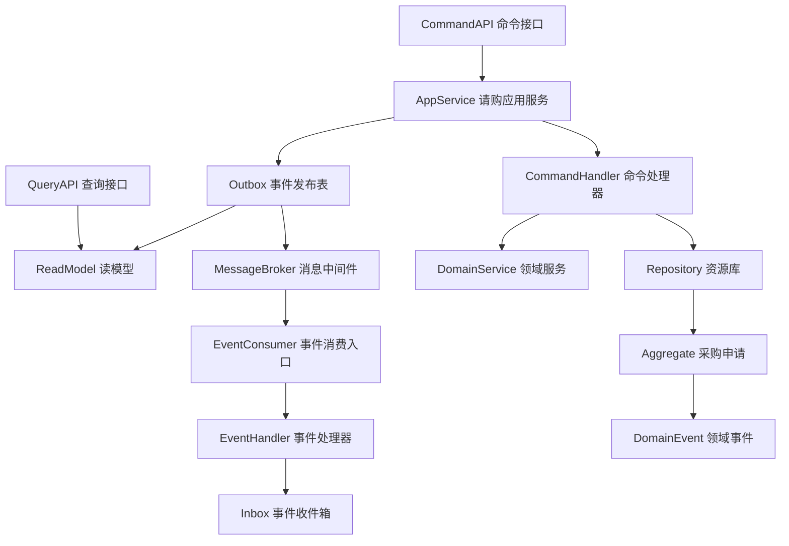
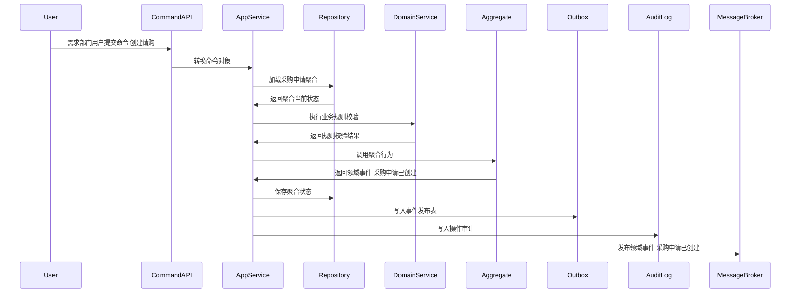
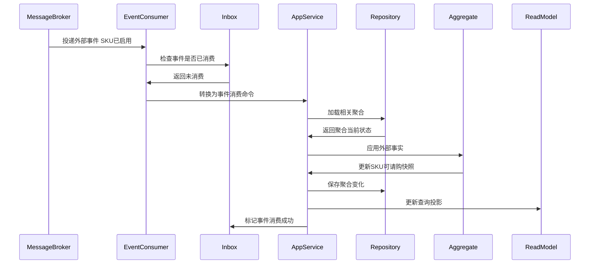
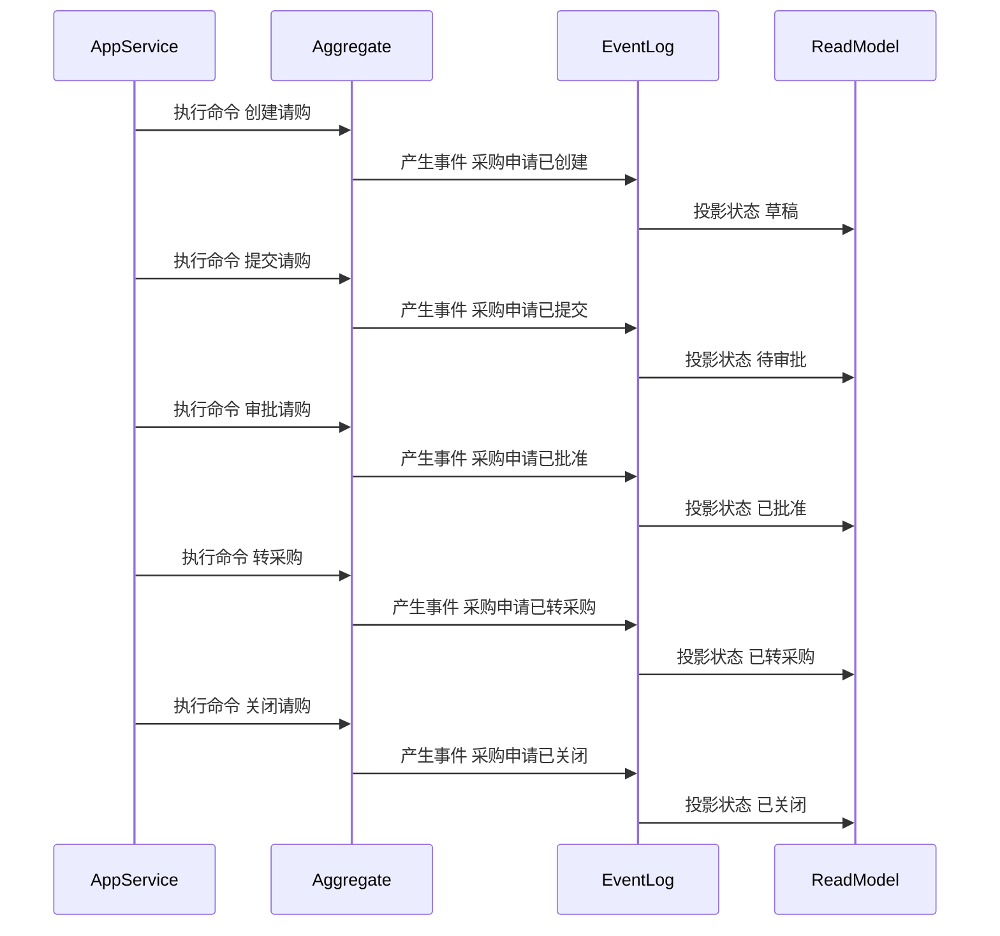

# 采购申请聚合 CQRS 深度设计

> 所属上下文：采购领域。本文按 DDD + CQRS 深入到聚合属性、命令处理、应用服务编排、领域服务规则、事件产生和事件消费逻辑。关键时序图使用 Mermaid 最小兼容语法，便于 VSCode Markdown 预览稳定渲染。

## 1. 业务目标分析

承载需求部门的采购需求，明确采购原因、SKU、数量、期望到货日、预算和审批结果，并在批准后转为询价或采购订单来源。

| 设计项 | 结论 |
| --- | --- |
| 限界上下文 | 采购系统上下文 |
| 子域类型 | 核心域，决定采购为什么发生 |
| 聚合根 | 采购申请 |
| 数据主权 | 采购上下文拥有 `采购申请` 的生命周期、状态、业务规则和领域事件；外部系统只能通过命令或事件协作 |
| 主要使用角色 | 需求部门用户、部门负责人、采购员、采购经理、预算系统 |
| 核心不变量 | 外部只能通过聚合根修改内部实体；状态流转必须合法；写命令和消费事件必须幂等 |

## 2. 角色、场景与流程分析

| 场景 | 发起角色 | 应用服务处理逻辑 | 领域服务 | 结果事件 |
| --- | --- | --- | --- | --- |
| 创建请购 | 需求部门用户 | 创建草稿，校验SKU、数量、期望到货日和预算信息 | 采购需求有效性校验服务 | 采购申请已创建 |
| 提交请购 | 需求部门用户 | 草稿或驳回状态提交审批，锁定申请版本 | 采购需求有效性校验服务 | 采购申请已提交 |
| 审批请购 | 部门负责人/采购经理 | 审批通过时记录批准数量和预算结论 | 预算与需求审批判定服务 | 采购申请已批准 |
| 驳回请购 | 审批人 | 记录驳回原因，状态回到已驳回 | 预算与需求审批判定服务 | 采购申请已驳回 |
| 转采购 | 采购员 | 已批准申请转为询价或采购订单来源 | 采购需求合并服务 | 采购申请已转采购 |
| 关闭请购 | 采购员/申请人 | 无采购必要或采购已完成时关闭 | 采购需求关闭判定服务 | 采购申请已关闭 |

## 3. 领域边界与分层架构

领域事件的位置要明确区分三层含义：领域层产生事件，应用层保存聚合与事件发布表，基础设施层投递消息并消费外部事件。

## 4. 聚合属性设计

| 属性 | 业务含义 | 模型归属 | 是否可变 | 主要修改命令 | 变化规则 |
| --- | --- | --- | --- | --- | --- |
| requisitionId | 采购申请ID | 聚合根 | 否 | 创建请购 | 全局唯一 |
| requisitionNo | 请购单号 | 值对象 | 否 | 创建请购 | 按规则生成 |
| status | 申请状态 | 值对象 | 是 | 提交/审批/转采购/关闭 | 草稿、待审批、已批准、已驳回、已转采购、已关闭 |
| requesterSnapshot | 申请人快照 | 值对象 | 否 | 创建请购 | 保存组织、部门、人员信息 |
| lineList | 请购行 | 内部实体集合 | 是 | 创建/修改/审批 | SKU、申请数量、批准数量、期望到货日 |
| budgetAmount | 预算金额 | 值对象 | 是 | 创建/审批 | 金额不能为负，币种一致 |
| purpose | 采购用途 | 值对象 | 是 | 创建/修改 | 必须明确业务用途和成本归属 |
| approvalRecord | 审批记录 | 内部实体集合 | 是 | 提交/审批 | 记录审批人、意见、时间、结果 |

## 5. 命令与应用服务逻辑

应用服务负责编排用例：校验权限、检查幂等、加载聚合、调用领域服务、执行聚合行为、保存聚合、写发布表、写审计日志。

| 命令 | 发起者 | 应用服务处理逻辑 | 参与领域服务 | 成功后领域事件 |
| --- | --- | --- | --- | --- |
| 创建请购 | 需求部门用户 | 创建草稿，校验SKU、数量、期望到货日和预算信息 | 采购需求有效性校验服务 | 采购申请已创建 |
| 提交请购 | 需求部门用户 | 草稿或驳回状态提交审批，锁定申请版本 | 采购需求有效性校验服务 | 采购申请已提交 |
| 审批请购 | 部门负责人/采购经理 | 审批通过时记录批准数量和预算结论 | 预算与需求审批判定服务 | 采购申请已批准 |
| 驳回请购 | 审批人 | 记录驳回原因，状态回到已驳回 | 预算与需求审批判定服务 | 采购申请已驳回 |
| 转采购 | 采购员 | 已批准申请转为询价或采购订单来源 | 采购需求合并服务 | 采购申请已转采购 |
| 关闭请购 | 采购员/申请人 | 无采购必要或采购已完成时关闭 | 采购需求关闭判定服务 | 采购申请已关闭 |

### 5.1 应用服务通用处理模板

1. 接口层接收请求并转换为命令对象。
2. 应用层校验用户、角色、组织、采购范围和数据权限。
3. 使用 `来源系统 + 业务单号 + 命令类型 + 幂等键` 做幂等检查。
4. 通过资源库加载 `采购申请` 聚合根，新建场景先校验业务唯一性。
5. 调用领域服务完成跨实体、跨策略或外部事实快照的规则判断。
6. 聚合根执行行为，修改属性、内部实体和值对象，并产生领域事件。
7. 同一事务保存聚合、事件发布表和操作审计。
8. 事件发布器异步投递事件，读模型投影器更新查询模型。

### 5.2 关键命令处理细节

| 关键命令 | 前置校验 | 聚合行为 | 异常或补偿处理 |
| --- | --- | --- | --- |
| 创建请购 | 采购申请状态允许执行，来源数据和权限有效 | 修改采购申请状态或明细并产生事件 采购申请已创建 | 状态不匹配则拒绝；外部协作失败进入待办或补偿流程 |
| 提交请购 | 采购申请状态允许执行，来源数据和权限有效 | 修改采购申请状态或明细并产生事件 采购申请已提交 | 状态不匹配则拒绝；外部协作失败进入待办或补偿流程 |
| 审批请购 | 采购申请状态允许执行，来源数据和权限有效 | 修改采购申请状态或明细并产生事件 采购申请已批准 | 状态不匹配则拒绝；外部协作失败进入待办或补偿流程 |

## 6. 领域服务逻辑

| 领域服务 | 核心逻辑 |
| --- | --- |
| 采购需求有效性校验服务 | 校验SKU是否启用、需求数量是否大于0、期望到货日是否合理、用途和预算归属是否完整。 |
| 预算与需求审批判定服务 | 结合预算余额、金额阈值、部门权限、紧急程度判断是否允许批准。 |
| 采购需求合并服务 | 按SKU、仓库、期望到货日、供应商策略判断多条请购是否可合并采购。 |
| 采购需求关闭判定服务 | 判断是否已转采购、已生成PO、是否仍有未处理需求，避免提前关闭。 |

## 7. 事件产生逻辑

| 领域事件 | 触发命令 | 关键载荷 | 主要消费者 |
| --- | --- | --- | --- |
| 采购申请已创建 | 创建请购 | requisitionId、申请人、申请行摘要 | 请购列表读模型 |
| 采购申请已提交 | 提交请购 | requisitionId、提交人、预算摘要 | 审批待办 |
| 采购申请已批准 | 审批请购 | requisitionId、批准数量、批准金额 | 采购员待办、询价单 |
| 采购申请已驳回 | 驳回请购 | requisitionId、驳回原因 | 申请人通知 |
| 采购申请已转采购 | 转采购 | requisitionId、转采购方式、目标单据 | 询价、采购订单、读模型 |
| 采购申请已关闭 | 关闭请购 | requisitionId、关闭原因 | 读模型、审计 |

### 7.1 事件生成规则

- 领域事件使用过去式命名，只表达已经发生的业务事实。
- 聚合根在业务行为成功后产生领域事件；应用服务负责收集、持久化和发布。
- 事件载荷必须包含事件编号、事件版本、发生时间、来源上下文、聚合ID、聚合版本、操作者和关键业务字段。
- 命令幂等命中时，返回原处理结果，不能重复产生事件。
- 外部事件消费必须先进入事件收件箱，再由应用服务加载聚合并执行本地业务行为。

## 8. 事件订阅与消费逻辑

| 订阅事件 | 处理应用服务 | 消费后数据变化 | 幂等键 |
| --- | --- | --- | --- |
| SKU已启用 | 主数据事件消费服务 | 更新SKU可请购快照 | 主数据上下文+事件编号+skuId |
| SKU已停用 | 主数据事件消费服务 | 未转采购申请行生成异常提示 | 主数据上下文+事件编号+skuId |
| 预算已冻结 | 预算事件消费服务 | 标记预算已占用，允许继续审批 | 预算上下文+事件编号+budgetId |
| 采购订单已创建 | 采购订单事件消费服务 | 记录请购已被PO引用 | 采购上下文+事件编号+purchaseOrderId |

## 9. 关键时序图

### 9.1 命令处理、聚合变更与事件发布

### 9.2 典型业务命令一

### 9.3 典型业务命令二

### 9.4 事件订阅、幂等消费与本地状态变化

### 9.5 聚合状态推进时序

## 10. 不变量、异常补偿、权限与审计

| 类型 | 规则 |
| --- | --- |
| 聚合不变量 | `采购申请` 的状态只能通过聚合根行为推进，内部实体不能被外部直接修改 |
| 数量和金额不变量 | 数量、金额、税率、币种、交期、有效期必须通过值对象校验 |
| 幂等 | 命令和事件消费都必须有幂等键，重复请求不能重复产生业务事实 |
| 并发 | 聚合保存使用版本号乐观锁，冲突时重新加载聚合并返回可重试错误 |
| 补偿 | 发布失败走事件发布表重试，消费失败走收件箱重试，业务阻塞进入人工待办 |
| 权限 | 按角色、组织、采购范围、供应商范围、金额阈值控制命令可执行性 |
| 审计 | 所有写命令记录操作者、来源、请求摘要、前后状态、事件编号和失败原因 |

## 11. 读模型设计

读模型服务于查询和页面展示，不参与聚合不变量保护。写入决策必须回到应用服务、聚合根和领域服务。

| 读模型 | 使用场景 | 主要字段 |
| --- | --- | --- |
| 请购列表读模型 | 请购查询、分页、筛选 | 单号、部门、申请人、状态、金额、期望日期 |
| 请购审批看板 | 审批人处理待办 | 待审批数量、金额、超时、审批节点 |
| 请购转采购跟踪 | 采购员跟踪需求转化 | 请购行、询价单、采购订单、转化状态 |

## 12. 设计结论与待确认问题

### 12.1 设计结论

- `采购申请` 是采购领域内独立保护业务规则和状态流转的聚合根。
- 命令处理属于应用层编排，核心规则属于聚合根和领域服务。
- 采购上下文不直接修改供应商、WMS、中央库存、BMS 的主权数据，只消费事实并保存采购侧快照。

### 12.2 待确认问题

| 问题 | 默认建议 |
| --- | --- |
| 是否多组织、多采购组织、多仓库 | 默认保留组织、采购组织、仓库、供应商数据范围 |
| 是否允许终态单据强制修改 | 默认不允许，需通过变更、关闭、作废或补偿单处理 |
| 是否需要事件溯源 | 当前阶段建议当前状态表 + 历史表 + 事件日志，不做全量事件溯源 |
