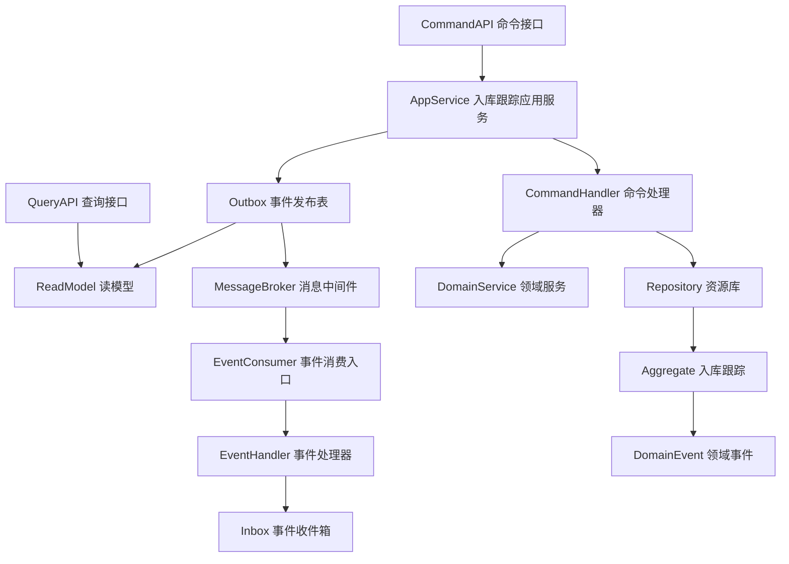
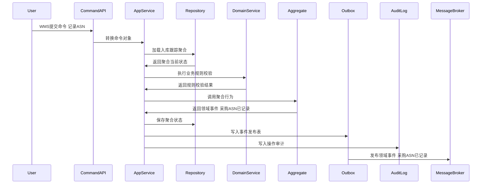
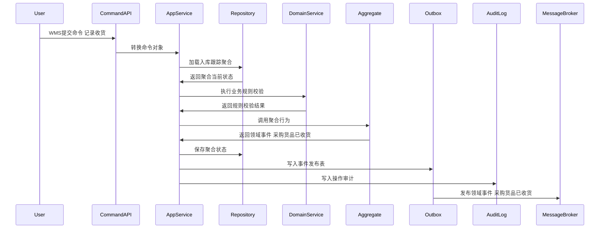
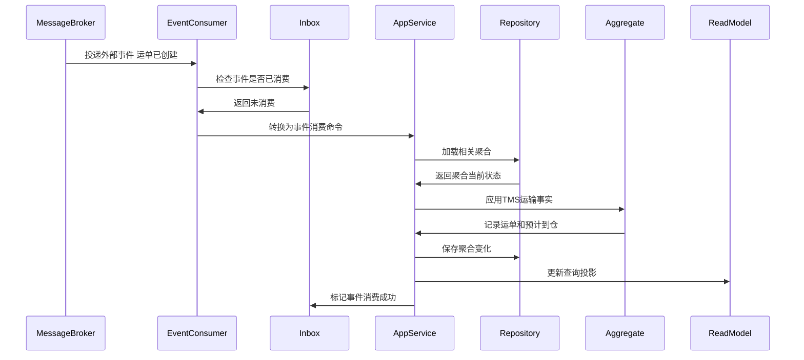
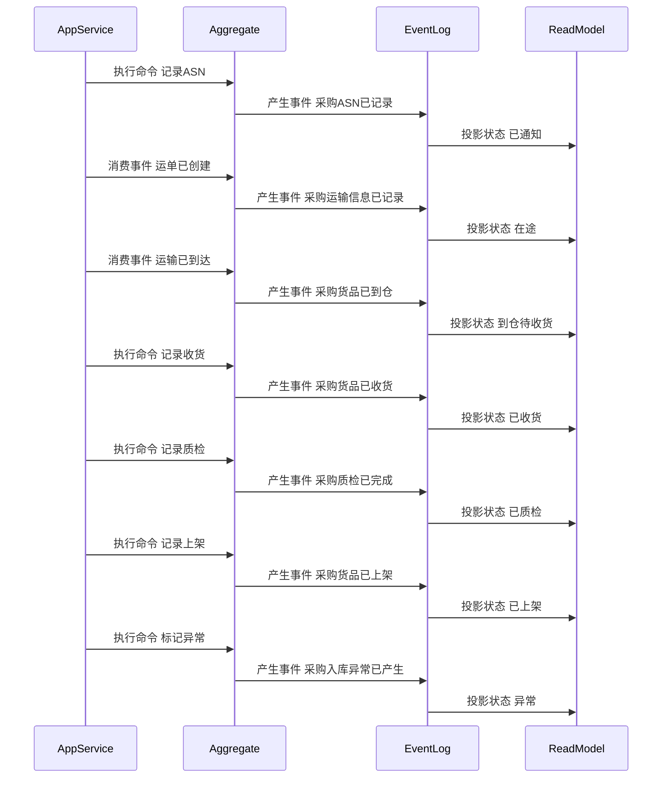

# 09-入库跟踪聚合CQRS设计

> 所属上下文：采购领域。本文按 DDD + CQRS 深入到聚合属性、命令处理、应用服务编排、领域服务规则、事件产生和事件消费逻辑。关键时序图使用 Mermaid 最小兼容语法，便于 VSCode Markdown 预览稳定渲染。

## 1. 业务目标分析

在采购侧保存 ASN、TMS 运输、WMS 收货、质检、上架和库存入库事实快照，用于跟踪采购执行进度，不直接维护运输轨迹明细和库存余额。

| 设计项 | 结论 |
| --- | --- |
| 限界上下文 | 02-采购系统上下文 |
| 子域类型 | 核心域，采购执行进度视图 |
| 聚合根 | 入库跟踪 |
| 数据主权 | 采购上下文拥有 `入库跟踪` 的生命周期、状态、业务规则和领域事件；TMS拥有运输任务、运单、轨迹、到仓和物流异常；外部系统只能通过命令或事件协作 |
| 主要使用角色 | 采购员、供应商系统、TMS、WMS、中央库存 |
| 核心不变量 | 外部只能通过聚合根修改内部实体；状态流转必须合法；写命令和消费事件必须幂等 |

## 2. 角色、场景与流程分析

| 场景 | 发起角色 | 应用服务处理逻辑 | 领域服务 | 结果事件 |
| --- | --- | --- | --- | --- |
| 记录ASN | WMS | 围绕入库跟踪执行记录ASN，校验状态、来源和业务规则 | 入库事件幂等服务 | 采购ASN已记录 |
| 记录运单创建 | TMS事件消费者 | 消费 TMS 运单创建事实，写入运单、承运商和预计到仓 | 运输事件幂等服务 | 采购运输信息已记录 |
| 记录运输到达 | TMS事件消费者 | 消费 TMS 到仓事实，标记到仓待收货 | 运输事件幂等服务 | 采购货品已到仓 |
| 记录运输异常 | TMS事件消费者 | 消费延误、破损、丢失等异常，生成采购异常待办 | 运输事件幂等服务 | 采购运输异常已登记 |
| 记录收货 | WMS | 围绕入库跟踪执行记录收货，校验状态、来源和业务规则 | 入库事件幂等服务 | 采购货品已收货 |
| 记录质检 | WMS | 围绕入库跟踪执行记录质检，校验状态、来源和业务规则 | 入库事件幂等服务 | 采购质检已完成 |
| 记录上架 | WMS | 围绕入库跟踪执行记录上架，校验状态、来源和业务规则 | 入库事件幂等服务 | 采购货品已上架 |
| 标记异常 | WMS | 围绕入库跟踪执行标记异常，校验状态、来源和业务规则 | 入库事件幂等服务 | 采购入库异常已产生 |

## 3. 领域边界与分层架构

领域事件的位置要明确区分三层含义：领域层产生事件，应用层保存聚合与事件发布表，基础设施层投递消息并消费外部事件。

## 4. 聚合属性设计

| 属性 | 业务含义 | 模型归属 | 是否可变 | 主要修改命令 | 变化规则 |
| --- | --- | --- | --- | --- | --- |
| 入库跟踪Id | 入库跟踪ID | 聚合根 | 否 | 记录ASN | 全局唯一 |
| 入库跟踪No | 入库跟踪单号 | 值对象 | 否 | 记录ASN | 按编码规则生成 |
| status | 业务状态 | 值对象 | 是 | 状态推进命令 | 必须按状态机流转 |
| lineList | 明细行 | 内部实体集合 | 是 | 创建或变更命令 | 记录SKU、数量、价格、交期等明细 |
| sourceRef | 来源引用 | 值对象 | 否 | 记录ASN | 记录请购、询价、报价、PO或外部事件来源 |
| snapshot | 业务快照 | 值对象 | 是 | 创建或事件消费 | 保存供应商、SKU、仓库、价格等外部事实快照 |
| transportSnapshot | 运输快照 | 内部实体 | 是 | 记录运单/到达/异常 | TMS运输任务号、运单号、承运商、运输状态、预计到仓、到仓时间、最新轨迹摘要、异常类型 |
| progressQuantity | 进度数量 | 值对象 | 是 | 记录ASN/运输/收货/质检/上架 | 通知量、在途量、到仓量、收货量、合格量、不合格量、上架量 |
| operationLog | 操作记录 | 内部实体集合 | 是 | 所有写命令 | 记录操作者、动作、原因、前后状态 |

## 5. 命令与应用服务逻辑

应用服务负责编排用例：校验权限、检查幂等、加载聚合、调用领域服务、执行聚合行为、保存聚合、写发布表、写审计日志。

| 命令 | 发起者 | 应用服务处理逻辑 | 参与领域服务 | 成功后领域事件 |
| --- | --- | --- | --- | --- |
| 记录ASN | WMS | 围绕入库跟踪执行记录ASN，校验状态、来源和业务规则 | 入库事件幂等服务 | 采购ASN已记录 |
| 记录运单创建 | TMS事件消费者 | 写入 TMS 运输任务、运单、承运商、预计到仓和在途状态 | 运输事件幂等服务 | 采购运输信息已记录 |
| 记录运输到达 | TMS事件消费者 | 写入到仓时间和到仓数量，状态进入到仓待收货 | 运输事件幂等服务 | 采购货品已到仓 |
| 记录运输异常 | TMS事件消费者 | 写入异常类型、影响范围和责任方，状态进入运输异常或异常待处理 | 运输事件幂等服务 | 采购运输异常已登记 |
| 记录收货 | WMS | 围绕入库跟踪执行记录收货，校验状态、来源和业务规则 | 入库事件幂等服务 | 采购货品已收货 |
| 记录质检 | WMS | 围绕入库跟踪执行记录质检，校验状态、来源和业务规则 | 入库事件幂等服务 | 采购质检已完成 |
| 记录上架 | WMS | 围绕入库跟踪执行记录上架，校验状态、来源和业务规则 | 入库事件幂等服务 | 采购货品已上架 |
| 标记异常 | WMS | 围绕入库跟踪执行标记异常，校验状态、来源和业务规则 | 入库事件幂等服务 | 采购入库异常已产生 |

### 5.1 应用服务通用处理模板

1. 接口层接收请求并转换为命令对象。
2. 应用层校验用户、角色、组织、采购范围和数据权限。
3. 使用 `来源系统 + 业务单号 + 命令类型 + 幂等键` 做幂等检查。
4. 通过资源库加载 `入库跟踪` 聚合根，新建场景先校验业务唯一性。
5. 调用领域服务完成跨实体、跨策略或外部事实快照的规则判断。
6. 聚合根执行行为，修改属性、内部实体和值对象，并产生领域事件。
7. 同一事务保存聚合、事件发布表和操作审计。
8. 事件发布器异步投递事件，读模型投影器更新查询模型。

### 5.2 关键命令处理细节

| 关键命令 | 前置校验 | 聚合行为 | 异常或补偿处理 |
| --- | --- | --- | --- |
| 记录ASN | 入库跟踪状态允许执行，来源数据和权限有效 | 修改入库跟踪状态或明细并产生事件 采购ASN已记录 | 状态不匹配则拒绝；外部协作失败进入待办或补偿流程 |
| 记录运单创建 | 来源为 TMS；事件未消费；ASN/PO/供应商/目的仓可匹配 | 写入运单、承运商、预计到仓，跟踪状态改在途 | 重复事件按 TMS eventId 幂等；运单与 ASN 不匹配进入异常事实池 |
| 记录运输到达 | 来源为 TMS；运单已记录；到仓地点匹配目的仓 | 写入到仓时间和到仓数量，状态改到仓待收货 | 到仓不等于收货；到仓后超时未收货生成采购/WMS待办 |
| 记录运输异常 | 来源为 TMS；异常与运单/ASN 可匹配 | 写入异常类型、责任方、影响数量，生成异常待办 | 破损/丢失不直接改收货数量，等待 WMS 收货/质检事实确认 |
| 记录收货 | 入库跟踪状态允许执行，来源数据和权限有效 | 修改入库跟踪状态或明细并产生事件 采购货品已收货 | 状态不匹配则拒绝；外部协作失败进入待办或补偿流程 |
| 记录质检 | 入库跟踪状态允许执行，来源数据和权限有效 | 修改入库跟踪状态或明细并产生事件 采购质检已完成 | 状态不匹配则拒绝；外部协作失败进入待办或补偿流程 |

## 6. 领域服务逻辑

| 领域服务 | 核心逻辑 |
| --- | --- |
| 入库事件幂等服务 | 围绕入库跟踪的状态、不变量、外部事实快照和策略配置进行业务判定。 |
| 运输事件幂等服务 | 校验 TMS 事件是否已消费、是否匹配 ASN/PO/目的仓，处理乱序运单、到达和异常事件。 |
| 入库数量累计服务 | 围绕入库跟踪的状态、不变量、外部事实快照和策略配置进行业务判定。 |
| 采购完成判定服务 | 汇总 TMS 到仓、WMS 收货质检上架和库存入库事实，判断采购执行是否完成；TMS 只影响到仓和异常，不直接完成入库。 |

## 7. 事件产生逻辑

| 领域事件 | 触发命令 | 关键载荷 | 主要消费者 |
| --- | --- | --- | --- |
| 采购ASN已记录 | 记录ASN | 入库跟踪ID、业务状态、关键明细摘要 | 本领域读模型、上下游协作系统、审计日志 |
| 采购运输信息已记录 | 记录运单创建 | 入库跟踪ID、ASN、TMS运输任务号、运单号、承运商、预计到仓 | 本领域读模型、采购订单、供应商履约分析 |
| 采购货品已到仓 | 记录运输到达 | 入库跟踪ID、ASN、运单号、到仓时间、到仓地点、到仓数量 | 本领域读模型、采购订单、WMS待办 |
| 采购运输异常已登记 | 记录运输异常 | 入库跟踪ID、ASN、运单号、异常类型、责任方、影响数量 | 采购异常看板、供应商履约分析 |
| 采购货品已收货 | 记录收货 | 入库跟踪ID、业务状态、关键明细摘要 | 本领域读模型、上下游协作系统、审计日志 |
| 采购质检已完成 | 记录质检 | 入库跟踪ID、业务状态、关键明细摘要 | 本领域读模型、上下游协作系统、审计日志 |
| 采购货品已上架 | 记录上架 | 入库跟踪ID、业务状态、关键明细摘要 | 本领域读模型、上下游协作系统、审计日志 |
| 采购入库异常已产生 | 标记异常 | 入库跟踪ID、业务状态、关键明细摘要 | 本领域读模型、上下游协作系统、审计日志 |

### 7.1 事件生成规则

- 领域事件使用过去式命名，只表达已经发生的业务事实。
- 聚合根在业务行为成功后产生领域事件；应用服务负责收集、持久化和发布。
- 事件载荷必须包含事件编号、事件版本、发生时间、来源上下文、聚合ID、聚合版本、操作者和关键业务字段。
- 命令幂等命中时，返回原处理结果，不能重复产生事件。
- 外部事件消费必须先进入事件收件箱，再由应用服务加载聚合并执行本地业务行为。

## 8. 事件订阅与消费逻辑

| 订阅事件 | 处理应用服务 | 消费后数据变化 | 幂等键 |
| --- | --- | --- | --- |
| ASN已提交 | 外部事件消费服务 | 创建或更新到货跟踪记录 | 来源上下文+事件编号+业务主键 |
| 运单已创建 | TMS事件消费服务 | 写入运单、承运商、预计到仓，状态进入在途 | TMS上下文+事件编号+waybillNo |
| 运输已到达 | TMS事件消费服务 | 写入到仓时间和到仓状态，等待 WMS 收货 | TMS上下文+事件编号+waybillNo |
| 物流异常已登记 | TMS事件消费服务 | 写入延误、破损、丢失等异常，生成采购异常待办 | TMS上下文+事件编号+exceptionNo |
| 供应商已冻结 | 供应商事件消费服务 | 标记供应商不可用并生成业务异常待办 | 供应商上下文+事件编号+supplierId |
| SKU已停用 | 主数据事件消费服务 | 标记相关明细不可继续执行 | 主数据上下文+事件编号+skuId |

## 9. 关键时序图

### 9.1 命令处理、聚合变更与事件发布

### 9.2 典型业务命令一

### 9.3 典型业务命令二

### 9.4 事件订阅、幂等消费与本地状态变化

### 9.5 聚合状态推进时序

## 10. 不变量、异常补偿、权限与审计

| 类型 | 规则 |
| --- | --- |
| 聚合不变量 | `入库跟踪` 的状态只能通过聚合根行为推进，内部实体不能被外部直接修改 |
| 数量和金额不变量 | 通知量、在途量、到仓量、收货量、合格量、上架量必须通过值对象校验；TMS到仓量不能直接转为收货量 |
| 幂等 | 命令和事件消费都必须有幂等键，重复请求不能重复产生业务事实 |
| 并发 | 聚合保存使用版本号乐观锁，冲突时重新加载聚合并返回可重试错误 |
| 补偿 | 发布失败走事件发布表重试，消费失败走收件箱重试；TMS事件乱序、轨迹延迟、到仓未收货、破损/丢失等业务阻塞进入人工待办 |
| 权限 | 按角色、组织、采购范围、供应商范围、金额阈值控制命令可执行性 |
| 审计 | 所有写命令记录操作者、来源、请求摘要、前后状态、事件编号和失败原因 |

## 11. 读模型设计

读模型服务于查询和页面展示，不参与聚合不变量保护。写入决策必须回到应用服务、聚合根和领域服务。

| 读模型 | 使用场景 | 主要字段 |
| --- | --- | --- |
| 入库跟踪列表读模型 | 查询、分页、筛选 | 单号、状态、供应商、ASN、运单号、运输状态、预计到仓、收货进度、更新时间 |
| 入库跟踪详情读模型 | 详情页展示 | 单头、明细、运输快照、收货质检上架进度、状态历史、事件历史、操作日志 |
| 入库跟踪异常读模型 | 异常处理看板 | 异常类型、运单号、责任人、影响数量、处理状态、阻塞原因 |

## 12. 设计结论与待确认问题

### 12.1 设计结论

- `入库跟踪` 是采购领域内独立保护业务规则和状态流转的聚合根。
- 命令处理属于应用层编排，核心规则属于聚合根和领域服务。
- 采购上下文不直接修改供应商、TMS、WMS、中央库存、BMS 的主权数据，只消费事实并保存采购侧快照；入库跟踪保存运输快照，但不维护轨迹明细。

### 12.2 待确认问题

| 问题 | 默认建议 |
| --- | --- |
| 是否多组织、多采购组织、多仓库 | 默认保留组织、采购组织、仓库、供应商数据范围 |
| 是否允许终态单据强制修改 | 默认不允许，需通过变更、关闭、作废或补偿单处理 |
| 是否需要事件溯源 | 当前阶段建议当前状态表 + 历史表 + 事件日志，不做全量事件溯源 |
