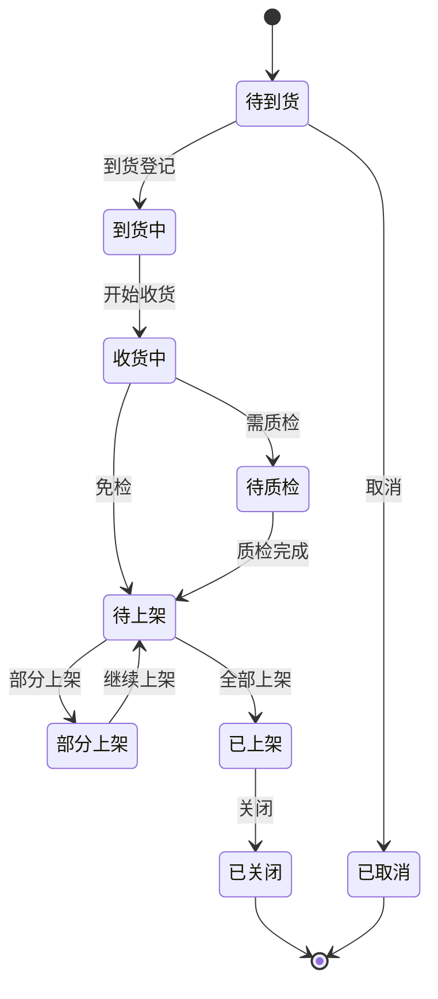
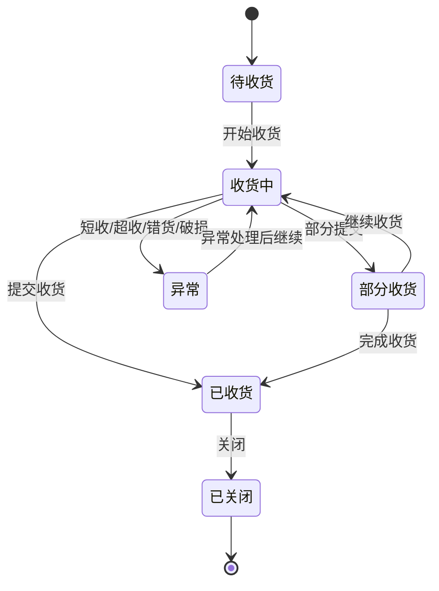
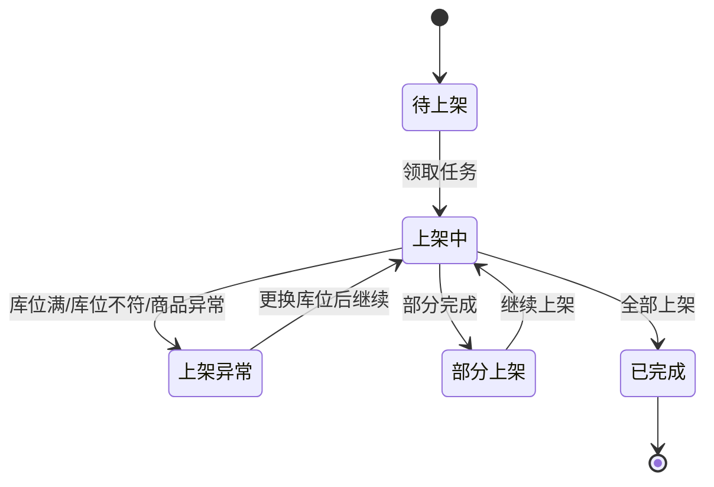
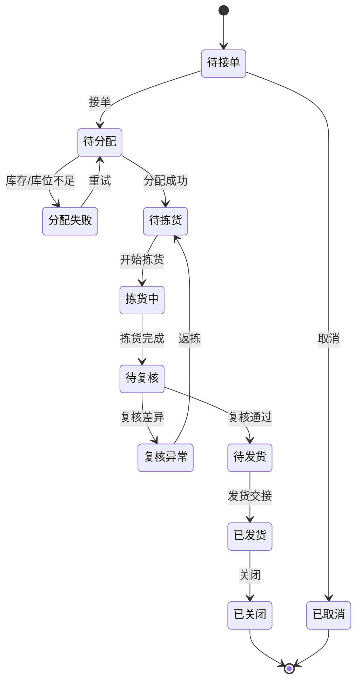
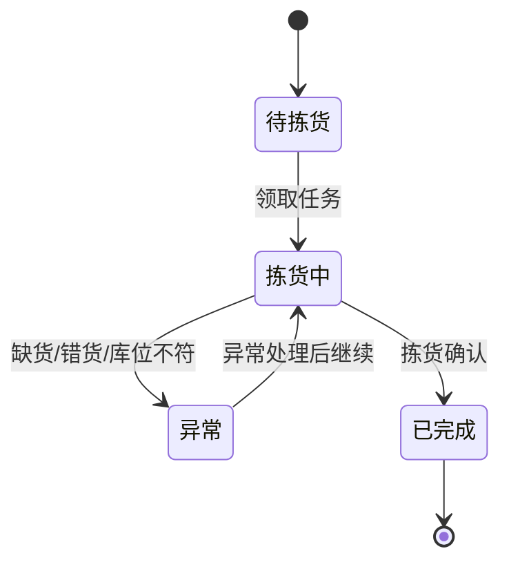
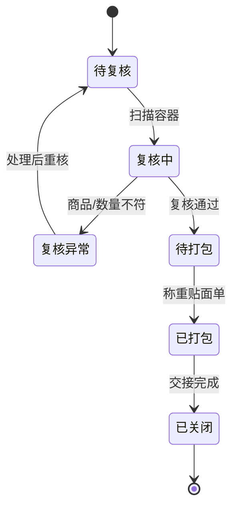
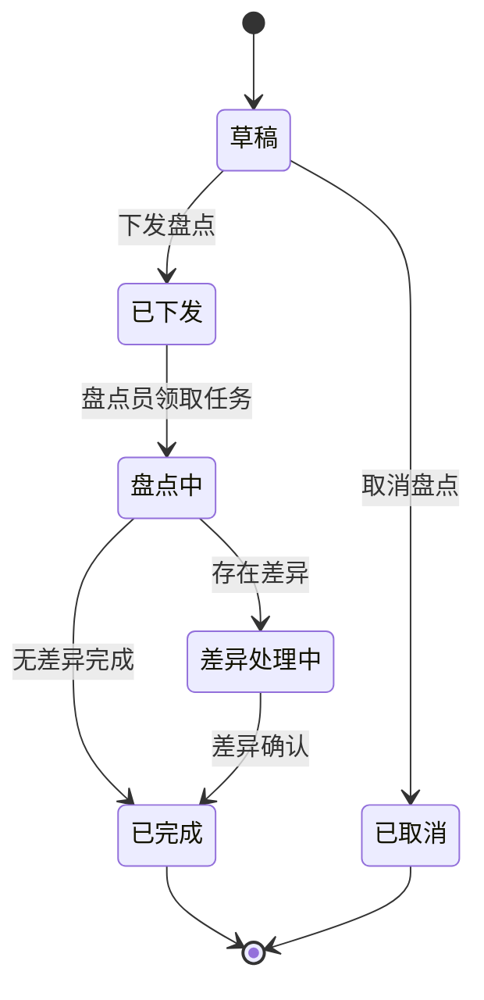

# 01 WMS 领域模型

> 本文用于 WMS 领域模型设计，承接 [WMS 系统功能设计](34-WMS系统功能设计.md)、[WMS 系统详细设计](43-WMS系统详细设计.md)、[采购入库业务流程](../../02-业务流程/03-1-采购入库业务流程.md)、[销售出库业务流程](../../02-业务流程/03-2-销售出库业务流程.md)、[调拨业务流程](../../02-业务流程/06-调拨业务流程.md)、[售后退货业务流程](../../02-业务流程/07-1-售后退货业务流程.md)、[供应商退货业务流程](../../02-业务流程/07-2-供应商退货业务流程.md)、[中央库存领域模型](../04-中央库存领域模型/01-中央库存领域模型.md) 和 [核心聚合与不变量总表](../00-领域模型总览/00-核心聚合与不变量总表.md)。本文不只覆盖调拨，而是覆盖 WMS 从入库、收货、质检、上架、库内库存、波次、拣货、容器、复核包装、发货、退货入库、不合格品、盘点到异常处理的完整仓内执行生命周期。

## 1. 事件风暴

事件风暴先从“已经发生的仓内事实”开始，再反推命令、角色、聚合、策略、读模型和异常。

### 1.1 业务目标

WMS 解决的是：仓库如何把外部业务指令转成可扫描、可分派、可追踪、可复核的实物作业任务，并把真实发生的收货、质检、上架、拣货、打包、发货、盘点差异等事实反馈给采购、OMS、中央库存、BMS 和供应商系统。

完整 WMS 生命周期：

```text
接收入库/出库/盘点/库内作业指令
  -> 创建 WMS 作业单
  -> 分派仓内任务
  -> 扫码执行收货、质检、上架、拣货、复核、包装、发货
  -> 记录库区、库位、SKU、批次、效期、容器、包裹和差异
  -> 产生仓内实物事实事件
  -> 中央库存、采购、OMS、BMS 等系统消费事件并更新各自模型
```

WMS 的核心不是“统一库存账本”，而是“仓内实物执行事实”。中央库存负责库存余额和流水，WMS 负责告诉外部：实际收了多少、合格多少、上架到哪里、从哪里拣了多少、发出了多少、盘点差异是多少。

### 1.2 事件风暴总表

| 阶段   | 角色/系统         | 命令             | 处理对象     | 领域事件            | 策略/后续动作            | 读模型   | 异常            |
| ---- | ------------- | -------------- | -------- | --------------- | ------------------ | ----- | ------------- |
| 入库接单 | 采购/供应商/OMS/调拨 | 创建入库单          | 入库单      | 入库单已接收          | 等待到货或收货            | 入库单列表 | 重复指令、仓库停用     |
| 到货登记 | 收货员           | 登记到货           | 入库单/收货单  | 到货已登记           | 生成或开启收货单           | 到货看板  | 无 ASN、提前/延迟到货 |
| 收货   | 收货员           | 扫描收货           | 收货单      | 收货已完成 / 收货差异已记录 | 进入质检或上架            | 收货作业页 | 短收、超收、错货、破损   |
| 质检   | 质检员           | 提交质检结果         | 质检单      | 质检已完成           | 合格生成上架任务，不合格生成暂存任务 | 质检看板  | 不合格、待判定、抽检异常  |
| 上架   | 上架员           | 确认上架           | 上架任务     | 上架已完成 / 不合格品已暂存 | 发布入库事实给库存和采购       | 上架任务页 | 库位满、库位不符、改库位  |
| 出库接单 | OMS/调拨/采购     | 创建出库单          | 出库单      | 出库单已接收          | 等待库存预占或库位分配        | 出库单列表 | 重复指令、取消冲突     |
| 库位分配 | 仓库主管/系统       | 分配库位批次         | 出库单      | 出库已分配 / 出库分配失败  | 成功后生成波次/拣货任务       | 分配看板  | 库位库存不足、批次不满足  |
| 波次   | 仓库主管/系统       | 生成并释放波次        | 波次单      | 波次已释放           | 生成拣货单              | 波次看板  | 策略不匹配、订单取消    |
| 拣货   | 拣货员           | 扫库位、扫商品、确认拣货   | 拣货单/拣货任务 | 拣货任务已完成         | 容器流转到复核台           | 拣货作业页 | 缺货、错货、库位不符    |
| 容器流转 | 拣货员/复核员       | 绑定、交接、清空容器     | 周转容器     | 容器已绑定 / 容器已交接复核 | 支撑多商品订单复核          | 容器看板  | 容器错绑、遗失、未清空   |
| 复核包装 | 复核/包装员        | 扫描复核、打包、称重、贴面单 | 复核包装单/包裹 | 包装已完成           | 等待发货交接             | 复核包装页 | 复核差异、重量异常     |
| 发货   | 发货员           | 扫包裹、交接承运商      | 出库单/包裹   | 出库已发货           | 通知 OMS、库存、BMS      | 发货交接页 | 包裹漏扫、承运商拒收    |
| 退货入库 | 收货员/质检员       | 验收客户退货         | 退货入库单    | 退货验收已完成         | 合格上架，不合格隔离         | 退货入库页 | 退错货、少件、破损     |
| 不合格品 | 质量/仓库         | 暂存、转待退、报废      | 不合格品库存   | 不合格品已暂存 / 已转待退供 | 等待采购退供或报废          | 不合格品页 | 责任不清、长期积压     |
| 盘点   | 仓库主管/盘点员      | 创建盘点、提交实盘      | 盘点计划/任务  | 盘点差异已创建         | 中央库存处理调整           | 盘点看板  | 账实不符、复盘争议     |
| 异常处理 | 仓库主管          | 分派、处理、关闭异常     | 异常记录     | 仓内异常已创建 / 已关闭   | 影响作业继续或补偿          | 异常处理页 | 责任争议、重复处理     |

### 1.3 通用语言

| 术语 | 定义 | 所属上下文 |
| --- | --- | --- |
| 入库单 | WMS 接收的入库作业指令，来源可以是采购、调拨、销售退货或其他 | WMS 上下文 |
| 收货单 | 收货员实际点收商品、批次、数量和差异的作业单 | WMS 上下文 |
| 质检单 | 对收货商品做合格、不合格、部分合格、免检判定的作业单 | WMS 上下文 |
| 上架任务 | 指导上架员把商品放到指定库区库位的任务 | WMS 上下文 |
| 库内库存 | WMS 视角下按仓库、库区、库位、SKU、批次、质量状态记录的实物库存 | WMS 上下文 |
| 出库单 | WMS 接收的出库作业指令，来源可以是销售、调拨、退供或其他 | WMS 上下文 |
| 波次单 | 为提升拣货效率，把多个出库单按策略合并形成的作业批次 | WMS 上下文 |
| 拣货单 | 给拣货员执行的拿货单，可按单单拣、批量拣、边拣边分生成 | WMS 上下文 |
| 拣货任务 | 拣货单中的库区、库位、SKU、批次、数量级任务 | WMS 上下文 |
| 周转容器 | 拣货到复核之间承载商品的实物流转载体，如周转箱、播种车、格口、托盘 | WMS 上下文 |
| 复核包装单 | 复核商品、打包、称重、贴面单的作业单 | WMS 上下文 |
| 包裹 | 已完成包装并可交给承运商的最小发货单元 | WMS 上下文 |
| 不合格品 | 质检或作业中发现不能进入可用库位的商品 | WMS 上下文 |
| 盘点任务 | 指导盘点员对指定库位或 SKU 实盘的任务 | WMS 上下文 |

## 2. 子域、限界上下文、上下文映射、核心域

### 2.1 子域划分

| 子域 | 类型 | 说明 | 建模策略 |
| --- | --- | --- | --- |
| 入库作业 | 核心域 | 承接采购、调拨、退货入库，完成到货、收货、质检、上架 | 深入建模入库单、收货单、质检单、上架任务 |
| 出库作业 | 核心域 | 承接销售、调拨、退供出库，完成分配、拣货、复核、包装、发货 | 深入建模出库单、波次、拣货、容器、包装、包裹 |
| 库内库存与库位作业 | 核心域 | 管理库位实物、批次、效期、冻结、移库、补货 | 深入建模库内库存、库存事务、库位作业任务 |
| 盘点与差异 | 核心域 | 对仓内实物做账实核对并产生盘点差异事实 | 深入建模盘点计划、盘点任务、差异记录 |
| 仓内异常 | 核心域 | 处理短收、超收、错货、破损、复核差异、库位不符 | 深入建模异常记录和处理闭环 |
| 中央库存 | 支撑域 | 根据 WMS 实物事实形成库存余额、预占、扣减、释放和流水 | WMS 只发布事实，不直接拥有中央库存账本 |
| 采购、OMS、供应商、调拨 | 支撑域 | 产生入库/出库业务指令，消费 WMS 执行结果 | 通过命令和事件协作 |
| 主数据、权限、消息 | 通用域 | 仓库库位、SKU、条码、货主、物流商、用户权限和通知 | WMS 消费主数据并保存作业快照 |

### 2.2 限界上下文模板

```markdown
上下文名称：WMS 上下文
子域类型：核心域
业务目标：把外部入库、出库、退货、调拨、盘点等业务指令转成可扫描、可分派、可追踪的仓内实物作业任务，并发布真实发生的仓内作业事实。
负责范围：入库接单、到货登记、收货、质检、上架、库内库存、移库、补货、出库接单、库位分配、波次、拣货、容器、复核包装、包裹、发货交接、退货入库、不合格品、盘点、异常处理、操作日志。
不负责范围：不做销售审单；不做采购审批；不维护供应商准入；不拥有中央库存统一账本；不生成财务应收应付；不决定 OMS 履约策略。
核心角色：收货员、质检员、上架员、拣货员、复核包装员、发货员、盘点员、仓库主管、系统管理员。
通用语言：入库单、收货单、质检单、上架任务、库内库存、出库单、波次、拣货单、拣货任务、容器、复核包装单、包裹、盘点计划、异常记录。
核心聚合：入库单、收货单、质检单、上架任务、库内库存、出库单、波次单、拣货单、周转容器、复核包装单、包裹、盘点计划、异常记录。
数据主权：仓内实物作业事实、库位级执行结果、任务执行状态、容器和包裹流转、盘点差异和仓内异常。
上游上下文：采购、供应商系统、OMS、调拨/库存、主数据、权限系统、物流商主数据。
下游上下文：中央库存、采购、OMS、供应商系统、BMS、报表系统。
同步命令/接口：接收入库单、开始收货、提交收货、提交质检、确认上架、接收出库单、分配库位、释放波次、确认拣货、确认包装、确认发货、创建盘点、提交盘点、处理异常。
生产事件：入库单已接收、收货已完成、质检已完成、上架已完成、不合格品已暂存、出库单已接收、出库已分配、拣货单已创建、拣货任务已完成、包装已完成、出库已发货、退货验收已完成、盘点差异已创建、仓内异常已创建。
消费事件：仓库已启用、库位已更新、SKU已启用、货主已启用、承运商已启用、ASN已提交、出库单已创建、调拨出库已创建、调拨入库已创建、退供申请已批准、库存已预占、出库取消已请求。
一致性要求：单个作业聚合内部强一致；WMS 与中央库存、采购、OMS、BMS 之间最终一致；外部指令和事件消费必须幂等。
异常补偿：重复接单、收货差异、质检不合格、上架库位满、分配失败、短拣、复核差异、发货漏扫、盘点差异、取消冲突。
主要风险：WMS 事实与中央库存不一致；不合格品进入可用库位；拣货无库位来源；包裹未交接但 OMS 已发货；盘点差异无审批直接调账。
```

### 2.3 上下文映射

| 上游上下文 | 下游上下文 | 映射关系 | 协作方式 | 说明 |
| --- | --- | --- | --- | --- |
| 主数据 | WMS | 遵奉者、防腐层 | WMS 消费仓库、库区、库位、SKU、条码、包装、批次规则、货主、承运商事件 | 主数据是基础资料权威 |
| 采购/供应商 | WMS | 客户/供应商关系 | ASN 或采购入库指令创建 WMS 入库单；WMS 回传收货、质检、上架事实 | WMS 是实物事实权威 |
| OMS | WMS | 客户/供应商关系 | OMS 下发出库单，WMS 执行拣货、复核、发货并回传事实 | OMS 是订单履约意图权威 |
| 调拨/库存 | WMS | 客户/供应商关系 | 调拨创建调出出库和调入入库作业；WMS 回传调出、调入事实 | 调拨业务状态不由 WMS 直接决定 |
| 采购 | WMS | 客户/供应商关系 | 退供申请创建退供应商出库作业；WMS 从待退供库存拣货发出 | 退供业务意图归采购/供应商领域 |
| WMS | 中央库存 | 发布语言 | WMS 发布收货、上架、拣货、发货、盘点差异等事实，库存系统记账 | 中央库存是余额和流水权威 |
| WMS | BMS | 发布语言 | WMS 作业事实可作为仓储操作费、出入库费、包装费、盘点费依据 | BMS 是费用和账单权威 |
| 权限系统 | WMS | 遵奉者 | 仓库、库区、角色、作业权限决定用户能看和能操作什么 | 权限不拥有 WMS 作业状态 |

### 2.4 核心域精炼

WMS 的核心复杂度集中在：

1. 作业可执行：外部单据必须拆成收货、质检、上架、拣货、复核、包装、发货等可执行任务。
2. 作业可追踪：每个关键动作要落到仓库、库区、库位、SKU、批次、效期、容器、包裹、操作人和时间。
3. 实物事实可信：中央库存和上下游只能基于 WMS 已发生事实更新自己的模型。
4. 差异可闭环：短收、超收、不合格、短拣、复核差异、盘点差异不能静默覆盖。
5. 合格与不合格隔离：不合格、冻结、待退供、待报废商品不能进入可拣可用链路。

## 3. 实体、值对象、聚合

### 3.1 聚合总览

| 聚合 | 聚合根 | 内部实体 | 值对象 | 主要不变量 |
| --- | --- | --- | --- | --- |
| 入库单 | 入库单 | 入库行、来源单快照 | 来源单、仓库、货主、供应商/客户快照 | 同来源单不能重复接单；已取消不能收货 |
| 收货单 | 收货单 | 收货行、差异记录 | 收货数量、批次、效期、条码 | 实收数量必须由扫描或人工修正产生；差异必须留痕 |
| 质检单 | 质检单 | 质检行、判定记录 | 抽检数量、合格数量、不合格原因 | 合格+不合格不能超过已收数量 |
| 上架任务 | 上架任务 | 上架行、改库位记录 | 目标库位、质量状态、上架数量 | 上架数量不能超过合格或待处理数量；不合格必须进隔离库位 |
| 库内库存 | 库内库存 | 仓内库存事务 | 库位、批次、库存状态、数量 | 库位数量不能为负；作业锁定不能超过库位数量 |
| 出库单 | 出库单 | 出库行、分配记录 | 来源单、优先级、物流商 | 未预占或未分配不能拣货；已发货不能取消 |
| 波次单 | 波次单 | 波次行、波次策略 | 拣货模式、订单集合 | 已释放波次不能随意移除已拣订单 |
| 拣货单 | 拣货单 | 拣货任务、容器绑定 | 库区、库位、批次、容器 | 拣货任务必须有库位来源；已拣数量不能超过应拣 |
| 周转容器 | 周转容器 | 容器绑定记录 | 容器类型、绑定对象、状态 | 一个容器同一时刻只能绑定一个主作业 |
| 复核包装单 | 复核包装单 | 复核行、包裹 | 重量、体积、面单、运单 | 复核通过才能打包；包裹交接前可取消，交接后不可静默取消 |
| 盘点计划 | 盘点计划 | 盘点任务、盘点差异 | 盘点范围、账面数、实盘数 | 差异必须复盘或审批后才通知库存调整 |
| 异常记录 | 异常记录 | 处理记录 | 异常类型、责任方、处理结果 | 异常关闭必须有处理结论和责任归属 |

### 3.2 实体

| 实体 | 身份标识 | 生命周期 | 说明 |
| --- | --- | --- | --- |
| 入库单 | 入库单号 | 待到货、到货中、收货中、待质检、待上架、部分上架、已上架、已关闭、已取消 | 入库作业入口 |
| 收货单 | 收货单号 | 待收货、收货中、部分收货、已收货、异常、已关闭 | 记录实收和差异 |
| 质检单 | 质检单号 | 待检、质检中、已完成、异常 | 记录质量判定 |
| 上架任务 | 上架任务号 | 待上架、上架中、部分上架、已完成、异常 | 指导库位上架 |
| 库内库存 | 库位库存 ID | 随库位数量变化 | WMS 库位级实物视图 |
| 出库单 | 出库单号 | 待接单、待分配、分配失败、待拣货、拣货中、待复核、待发货、已发货、已关闭、已取消 | 出库作业入口 |
| 波次单 | 波次号 | 草稿、已释放、拣货中、已完成、已取消 | 拣货效率优化 |
| 拣货单 | 拣货单号 | 待分配、待拣货、拣货中、部分拣货、已拣货、已交接复核 | 拣货员执行单 |
| 拣货任务 | 拣货任务 ID | 待拣货、拣货中、已完成、异常 | 库位级拿货任务 |
| 周转容器 | 容器编码 | 空闲、已绑定、拣货中、待复核、已清空、停用 | 实物流转载体 |
| 复核包装单 | 包装单号 | 待复核、复核中、复核异常、待打包、已打包、已关闭 | 发货前复核包装 |
| 包裹 | 包裹号 | 已打包、待交接、已交接、已取消 | 承运商交接单元 |
| 盘点计划 | 盘点计划号 | 草稿、已下发、盘点中、差异处理中、已完成、已取消 | 盘点作业入口 |
| 异常记录 | 异常单号 | 待处理、处理中、已关闭 | 仓内异常闭环 |

### 3.3 值对象

| 值对象 | 字段 | 规则 |
| --- | --- | --- |
| 仓库位置 | 仓库、库区、库位 | 仓库和库位必须启用，库位用途匹配作业 |
| 商品批次 | SKU、批次、生产日期、效期、序列号 | 批次/效期按 SKU 规则校验 |
| 作业数量 | 应收/实收/应拣/已拣/应上架/已上架 | 数量不能为负，差异必须可解释 |
| 质量状态 | 待检、合格、不合格、免检、待处理 | 不合格不能进入可拣库位 |
| 容器绑定 | 容器、绑定对象、绑定时间、状态 | 容器不能重复绑定冲突作业 |
| 包裹物流 | 包裹号、承运商、运单号、重量、体积 | 发货前必须有可追踪包裹 |
| 外部来源 | 来源系统、来源单号、来源行号、幂等键 | 同来源同幂等键只能接收一次 |
| 操作人快照 | 用户、角色、仓库、库区 | 作业权限和审计留痕 |

## 4. 聚合根、领域服务、资源库、领域事件

### 4.1 入库单聚合模板

```markdown
聚合名称：入库单
聚合根：WmsInboundOrder
业务目标：承接采购、调拨、销售退货等入库指令，并驱动到货、收货、质检、上架链路。
内部实体：InboundOrderLine、SourceOrderSnapshot
值对象：WarehouseLocation、OwnerSnapshot、SupplierSnapshot、CustomerSnapshot
主要命令：接收入库单、登记到货、取消入库单、关闭入库单
主要事件：入库单已接收、到货已登记、入库单已取消、入库单已关闭
核心不变量：同来源单不能重复接单；已开始收货后不能静默取消；入库来源类型必须明确。
资源库：WmsInboundOrderRepository
读模型：入库单列表、到货看板、入库进度
```

### 4.2 收货单聚合模板

```markdown
聚合名称：收货单
聚合根：WmsReceiptOrder
业务目标：记录仓库实际收到的 SKU、数量、批次、效期和收货差异。
内部实体：ReceiptLine、ReceiptDiff
值对象：SkuBatch、ReceiptQuantity、OperatorSnapshot
主要命令：开始收货、扫描收货、登记差异、提交收货、关闭收货
主要事件：收货已开始、收货已完成、收货差异已记录
核心不变量：实收数量不能为负；人工修正必须留原因；短收、超收、错货、破损必须形成差异记录。
资源库：WmsReceiptOrderRepository
读模型：收货作业页、收货差异看板
```

### 4.3 质检单聚合模板

```markdown
聚合名称：质检单
聚合根：WmsQcOrder
业务目标：对收货商品做质量判定，并决定后续进入合格上架或不合格隔离。
内部实体：QcLine、QcEvidence
值对象：QcResult、RejectReason、QualityQuantity
主要命令：创建质检单、提交质检结果、冻结不合格品、关闭质检单
主要事件：质检已创建、质检已完成、不合格品已判定
核心不变量：合格数量和不合格数量之和不能超过待检数量；不合格必须有原因或证据；质检完成后才能生成对应上架任务。
资源库：WmsQcOrderRepository
读模型：质检作业页、质量异常看板
```

### 4.4 上架任务聚合模板

```markdown
聚合名称：上架任务
聚合根：WmsPutawayTask
业务目标：指导上架员把合格品放到可用库位，把不合格品放到隔离区、待退供区或报废区。
内部实体：PutawayLine、LocationChangeRecord
值对象：TargetLocation、QualityStatus、PutawayQuantity
主要命令：生成上架任务、领取上架任务、确认上架、改库位、标记上架异常
主要事件：上架任务已创建、上架已完成、不合格品已暂存、上架异常已创建
核心不变量：上架数量不能超过来源数量；目标库位必须允许该质量状态；改库位必须记录原因。
资源库：WmsPutawayTaskRepository
读模型：上架任务页、库位占用看板
```

### 4.5 出库单聚合模板

```markdown
聚合名称：出库单
聚合根：WmsOutboundOrder
业务目标：承接销售、调拨、退供等出库指令，并驱动分配、波次、拣货、复核、包装、发货链路。
内部实体：OutboundLine、AllocationRecord
值对象：SourceOrderReference、CarrierSnapshot、Priority
主要命令：接收出库单、分配库位、取消出库单、关闭出库单、确认发货
主要事件：出库单已接收、出库已分配、出库分配失败、出库已发货、出库单已取消
核心不变量：未接单不能分配；未分配不能拣货；已发货不能取消；分配数量不能超过库位可作业数量。
资源库：WmsOutboundOrderRepository
读模型：出库单列表、出库进度、发货看板
```

### 4.6 拣货单聚合模板

```markdown
聚合名称：拣货单
聚合根：WmsPickingOrder
业务目标：把出库单按拣货策略拆成库位级任务，指导拣货员从指定库位拿货并放入指定容器。
内部实体：PickingTask、ContainerBinding
值对象：PickingMode、SkuBatch、LocationReference、PickingQuantity
主要命令：生成拣货单、分配拣货员、领取拣货、扫描库位、扫描商品、确认拣货、登记拣货异常、交接复核
主要事件：拣货单已创建、拣货任务已完成、拣货异常已创建、容器已交接复核
核心不变量：拣货任务必须明确库位、SKU、批次和数量；已拣数量不能超过应拣数量；容器必须与拣货单绑定。
资源库：WmsPickingOrderRepository
读模型：拣货单页、拣货任务页、拣货效率看板
```

### 4.7 复核包装聚合模板

```markdown
聚合名称：复核包装单
聚合根：WmsPackOrder
业务目标：复核拣货结果，完成打包、称重、贴面单并生成包裹。
内部实体：PackLine、Package
值对象：PackageMeasure、TrackingNo、CarrierProduct
主要命令：创建包装单、扫描容器、复核商品、登记复核差异、打包称重、打印面单、确认包装完成
主要事件：包装单已创建、复核异常已创建、包装已完成、包裹已创建
核心不变量：复核未通过不能打包；包裹必须关联出库单；重量和体积异常必须提示或拦截。
资源库：WmsPackOrderRepository
读模型：复核包装页、包裹查询页
```

### 4.8 盘点计划聚合模板

```markdown
聚合名称：盘点计划
聚合根：WmsCountPlan
业务目标：组织库位或 SKU 范围的实物盘点，并产生可审核的盘点差异。
内部实体：CountTask、CountDiff
值对象：CountScope、BookQuantity、ActualQuantity
主要命令：创建盘点计划、下发盘点任务、提交实盘、发起复盘、确认差异、取消盘点
主要事件：盘点计划已下发、盘点任务已完成、盘点差异已创建、盘点计划已完成
核心不变量：盘点范围必须明确；差异确认前不能直接调库存；复盘结果必须留痕。
资源库：WmsCountPlanRepository
读模型：盘点管理页、盘点差异页
```

### 4.9 领域服务

| 领域服务 | 解决的问题 | 为什么不是单个聚合方法 |
| --- | --- | --- |
| 入库接单校验服务 | 校验来源单、仓库、货主、SKU、供应商/客户是否可入库 | 依赖主数据和外部指令快照 |
| 上架库位推荐服务 | 根据 SKU、批次、温区、体积、质量状态、库位容量推荐目标库位 | 需要库位、库存、商品规则综合判断 |
| 出库库位分配服务 | 根据出库行、库位库存、批次效期、先进先出、波次策略分配库位 | 需要跨出库单、库位库存、策略计算 |
| 波次生成服务 | 把多个出库单按订单、库区、SKU、承运商、时效合并成波次 | 需要读取多个出库订单和作业能力 |
| 拣货路径优化服务 | 生成库位级拣货顺序，提高拣货效率 | 依赖仓库布局和任务集合 |
| 盘点差异判定服务 | 根据账面、实盘、复盘和容差判断是否形成差异 | 需要盘点任务和库位库存读模型 |
| 仓内异常归因服务 | 初步判断短收、破损、错货、复核差异责任方 | 依赖作业历史和来源业务信息 |

### 4.10 资源库

| 资源库 | 面向聚合根 | 主要能力 |
| --- | --- | --- |
| `WmsInboundOrderRepository` | 入库单 | 按来源单幂等加载、保存入库单、查询待到货 |
| `WmsReceiptOrderRepository` | 收货单 | 加载收货单、保存收货结果、查询收货差异 |
| `WmsQcOrderRepository` | 质检单 | 加载质检单、保存质检结果 |
| `WmsPutawayTaskRepository` | 上架任务 | 加载任务、保存上架结果、查询待上架 |
| `WmsLocationStockRepository` | 库内库存 | 加载库位库存、保存作业锁定、查询可拣库存 |
| `WmsOutboundOrderRepository` | 出库单 | 按来源单幂等加载、保存出库单、查询待分配 |
| `WmsPickingOrderRepository` | 拣货单 | 加载拣货单、保存拣货结果、查询拣货任务 |
| `WmsContainerRepository` | 周转容器 | 加载容器、保存绑定状态 |
| `WmsPackOrderRepository` | 复核包装单 | 加载包装单、保存复核和包裹结果 |
| `WmsCountPlanRepository` | 盘点计划 | 加载盘点计划、保存任务和差异 |
| `WmsExceptionRepository` | 异常记录 | 加载异常、保存处理结果 |

### 4.11 领域事件模板

| 事件 | 所属聚合 | 发生时机 | 关键载荷 | 下游 |
| --- | --- | --- | --- | --- |
| `InboundAccepted` | 入库单 | WMS 接收入库指令 | 入库单号、来源单号、来源类型、仓库 | 采购、OMS、报表 |
| `InboundReceived` | 收货单 | 收货完成或部分完成 | 入库单号、收货单号、SKU、批次、实收数量、差异 | 采购、供应商、中央库存 |
| `QcCompleted` | 质检单 | 质检提交 | 质检单号、SKU、合格数、不合格数、质检结果 | 采购、供应商、中央库存 |
| `InboundPutawayCompleted` | 上架任务 | 合格品上架完成 | 仓库、库区、库位、SKU、批次、上架数量 | 中央库存、采购、BMS |
| `InboundRejectedStored` | 上架任务 | 不合格品暂存完成 | 入库单号、供应商、SKU、批次、不合格数量、库位 | 采购、供应商、中央库存 |
| `OutboundAccepted` | 出库单 | WMS 接收出库指令 | 出库单号、来源单号、来源类型、仓库 | OMS、采购、调拨 |
| `OutboundAllocated` | 出库单 | 库位分配成功 | 出库单号、SKU、库位、分配数量 | OMS、中央库存 |
| `PickingOrderCreated` | 拣货单 | 拣货单生成 | 拣货单号、波次号、出库单号、任务数 | WMS 读模型 |
| `PickingTaskCompleted` | 拣货单 | 拣货任务完成 | 拣货任务号、库位、SKU、批次、容器、已拣数量 | WMS、中央库存 |
| `PackingCompleted` | 复核包装单 | 包装完成 | 包装单号、包裹号、重量、体积、运单号 | OMS、BMS |
| `OutboundShipped` | 出库单 | 发货交接完成 | 出库单号、包裹号、运单号、SKU、发货数量 | OMS、中央库存、BMS |
| `ReturnReceiptCompleted` | 入库单/收货单 | 售后退货验收完成 | 售后单号、SKU、验收数量、质量结果 | OMS、中央库存、BMS |
| `InventoryCountDiffCreated` | 盘点计划 | 盘点差异确认 | 盘点计划号、库位、SKU、账面数、实盘数、差异数 | 中央库存、报表 |
| `WmsExceptionCreated` | 异常记录 | 仓内异常创建 | 异常单号、来源、异常类型、责任方 | 相关业务系统、消息 |

## 5. 状态机模板

### 5.1 入库单状态机



### 5.2 收货单状态机



### 5.3 上架任务状态机



### 5.4 出库单状态机



### 5.5 拣货任务状态机



### 5.6 复核包装状态机



### 5.7 盘点计划状态机



## 6. 领域字段归属

### 6.1 聚合字段归属

| 聚合 | 核心字段 |
| --- | --- |
| 入库单 | 入库单号、来源类型、来源单号、仓库、货主、供应商/客户、入库状态、预计到仓、到货时间 |
| 收货单 | 收货单号、入库单号、仓库、收货员、收货状态、开始时间、完成时间 |
| 收货行 | SKU、条码、应收、实收、短收、超收、批次、生产日期、效期、质量状态 |
| 质检单 | 质检单号、收货行、SKU、抽检数、合格数、不合格数、质检结果、不合格原因、质检员 |
| 上架任务 | 上架任务号、入库单、收货行、质检单、仓库、目标库区、目标库位、SKU、批次、质量状态、应上架、已上架、任务状态 |
| 库内库存 | 仓库、库区、库位、货主、SKU、批次、库存状态、数量、作业锁定数量 |
| 出库单 | 出库单号、来源类型、来源单号、仓库、货主、优先级、出库状态、物流商、发货时间 |
| 出库行 | SKU、计划出库数量、分配数量、已拣数量、已发货数量、行状态 |
| 波次单 | 波次号、仓库、波次类型、订单数、SKU 数、波次状态、创建人、释放时间 |
| 拣货单 | 拣货单号、波次、仓库、作业库区、拣货模式、拣货状态、拣货员、开始时间、完成时间 |
| 拣货任务 | 拣货任务号、拣货单、出库单、库区、库位、SKU、批次、应拣、已拣、容器、任务状态、拣货员 |
| 周转容器 | 容器编码、容器类型、仓库、绑定对象、容器状态 |
| 复核包装单 | 包装单号、出库单、容器、复核员、打包员、包装状态、重量、体积 |
| 包裹 | 包裹号、包装单、出库单、承运商、运单号、重量、包裹状态、发货时间 |
| 盘点计划 | 盘点计划号、仓库、盘点类型、盘点范围、状态、创建人 |
| 异常记录 | 异常单号、来源、仓库、异常类型、责任方、状态、说明、创建时间、关闭时间 |

### 6.2 字段设计原则

| 原则 | 说明 |
| --- | --- |
| 作业位置必填 | 收货、上架、拣货、盘点必须能追溯到仓库、库区、库位 |
| 扫码事实留痕 | SKU、条码、批次、效期、容器、包裹关键动作应扫描或记录人工修正原因 |
| 来源单幂等 | 入库单和出库单必须记录来源系统、来源单号、来源行号、幂等键 |
| 质量状态隔离 | 合格、不合格、冻结、待退供、待报废必须区分，不允许混用库位 |
| WMS 不越界记账 | WMS 保存库位实物和作业事实，中央库存负责统一余额和流水 |
| 差异不覆盖事实 | 短收、超收、短拣、复核差异、盘点差异必须通过异常或差异记录闭环 |

## 7. 应用服务与读模型

### 7.1 应用服务

| 应用服务 | 编排用例 | 主要步骤 |
| --- | --- | --- |
| 入库应用服务 | 接收入库、登记到货、关闭入库 | 校验幂等和主数据，加载入库单，执行命令，保存并发布事件 |
| 收货应用服务 | 开始收货、扫描收货、提交收货 | 校验条码批次，保存收货事实，必要时创建异常 |
| 质检应用服务 | 创建质检、提交质检、冻结不合格 | 校验待检数量，保存质检结果，生成上架任务 |
| 上架应用服务 | 推荐库位、领取任务、确认上架 | 调用库位推荐，校验库位容量和质量状态，保存上架事实 |
| 出库应用服务 | 接收出库、分配库位、取消出库、确认发货 | 校验来源、库存预占和作业进度，保存出库状态 |
| 波次应用服务 | 生成波次、释放波次、取消波次 | 读取待拣出库单，调用波次策略，生成拣货单 |
| 拣货应用服务 | 领取、扫描、确认、异常、交接复核 | 校验库位、SKU、容器和数量，保存拣货事实 |
| 复核包装应用服务 | 复核、打包、称重、打印面单 | 校验容器和商品，生成包裹，保存包装事实 |
| 盘点应用服务 | 创建、下发、实盘、复盘、确认差异 | 锁定盘点范围，保存实盘，生成差异事件 |
| 异常处理应用服务 | 创建、分派、处理、关闭异常 | 记录责任、处理方式和结果，推动作业继续或补偿 |

### 7.2 读模型

| 读模型 | 用途 | 数据来源 |
| --- | --- | --- |
| WMS 工作台 | 待收货、待质检、待上架、待拣货、待复核、异常数量 | 入库、收货、质检、上架、出库、拣货、异常投影 |
| 入库进度看板 | 查看来源单到收货、质检、上架进度 | 入库单、收货单、质检单、上架任务 |
| 出库进度看板 | 查看接单、分配、拣货、复核、发货进度 | 出库单、波次、拣货、包装、包裹 |
| 库内库存查询 | 查询库位级 SKU、批次、质量状态和数量 | 库内库存投影 |
| 拣货任务看板 | 监控拣货任务状态、人员效率和异常 | 拣货单、拣货任务、容器 |
| 不合格品看板 | 管理不合格、待退供、待报废库存 | 质检、上架、不合格库位 |
| 盘点差异看板 | 查询盘点范围、实盘差异和处理状态 | 盘点计划、盘点任务、差异记录 |
| 作业绩效报表 | 收货效率、上架效率、拣货效率、复核差异率 | WMS 作业事件和操作日志 |

## 8. 关键不变量与补偿

| 场景 | 不变量 | 异常补偿 |
| --- | --- | --- |
| 入库接单 | 同来源单和幂等键只能创建一次入库单 | 幂等忽略、人工合并或关闭重复单 |
| 收货 | 实收数量、短收、超收必须可解释 | 创建收货异常，采购或供应商处理差异 |
| 质检 | 合格和不合格数量不能超过待检数量 | 退回质检、复检或异常冻结 |
| 上架 | 上架数量不能超过来源合格/待处理数量 | 更换库位、部分上架、创建上架异常 |
| 不合格品 | 不合格品不能进入可拣库位 | 上架到不合格区、待退供区或报废区 |
| 出库分配 | 分配数量不能超过库位可作业数量 | 分配失败，等待补货、换仓或取消 |
| 拣货 | 拣货任务必须有库位，已拣不能超过应拣 | 短拣异常、返拣、人工关闭剩余 |
| 复核包装 | 复核通过才能打包，包裹必须可追踪 | 复核异常、返拣、拆包重核 |
| 发货 | 发货交接必须扫描包裹并记录承运商 | 漏扫补扫、撤销交接、异常关闭 |
| 盘点 | 差异确认前不能直接调中央库存 | 复盘、审批、发布盘点差异事件 |
| 外部事件消费 | 外部指令和回调必须幂等 | 重复忽略、失败重试、人工补偿 |

## 9. 当前结论

WMS 不能只建模库存调拨。调拨只是 WMS 的一种出库来源和入库来源。完整 WMS 领域应围绕 `仓内实物作业`、`库位级执行`、`任务分派`、`扫码追踪`、`容器和包裹流转`、`质量隔离`、`盘点差异` 和 `仓内异常闭环` 建模。

## 10. 继续上下文

当前结论：本文是完整“WMS 领域模型”，覆盖入库接单、收货、质检、上架、库内库存、出库接单、库位分配、波次、拣货、容器、复核包装、发货交接、退货入库、不合格品、盘点、异常处理和操作日志。

关键假设：WMS 拥有仓内实物作业事实；中央库存拥有统一库存余额和库存流水；采购、OMS、供应商、调拨上下文拥有各自业务意图和状态；WMS 通过领域事件把实物结果反馈给它们。

待决问题：第一版是否完整实现波次、路径优化、容器、盘点复盘和自动补货，可以按仓库复杂度裁剪；但领域模型需要保留这些概念，避免后续只把 WMS 做成简单出入库记录。

下一步：可继续基于本文细化 WMS 应用服务、接口契约和数据库表结构。

## 聚合审计补充

本轮已按聚合/聚合根补充 CQRS 落地文档，覆盖命令、应用服务、领域服务、读模型、生产事件和订阅事件：

- [入库单聚合 CQRS 设计](./02-入库单聚合CQRS设计.md)
- [收货单聚合 CQRS 设计](./03-收货单聚合CQRS设计.md)
- [质检单聚合 CQRS 设计](./04-质检单聚合CQRS设计.md)
- [上架任务聚合 CQRS 设计](./05-上架任务聚合CQRS设计.md)
- [库内库存聚合 CQRS 设计](./06-库内库存聚合CQRS设计.md)
- [出库单聚合 CQRS 设计](./07-出库单聚合CQRS设计.md)
- [波次单聚合 CQRS 设计](./08-波次单聚合CQRS设计.md)
- [拣货单聚合 CQRS 设计](./09-拣货单聚合CQRS设计.md)
- [周转容器聚合 CQRS 设计](./10-周转容器聚合CQRS设计.md)
- [复核包装单聚合 CQRS 设计](./11-复核包装单聚合CQRS设计.md)
- [发货交接聚合 CQRS 设计](./12-发货交接聚合CQRS设计.md)
- [盘点计划聚合 CQRS 设计](./13-盘点计划聚合CQRS设计.md)
- [仓内异常聚合 CQRS 设计](./14-仓内异常聚合CQRS设计.md)
