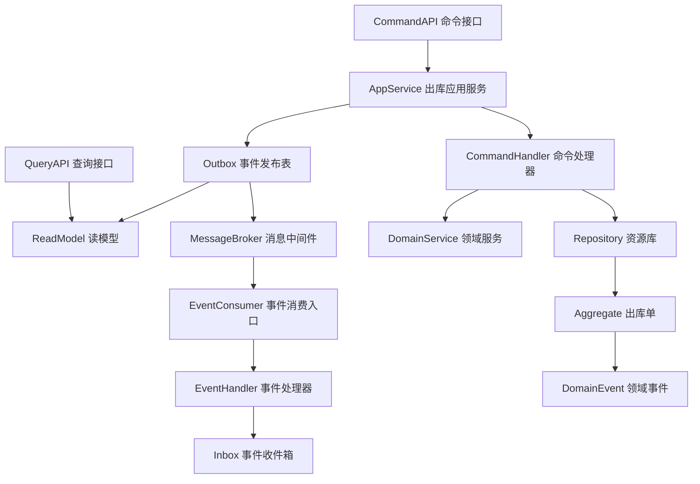
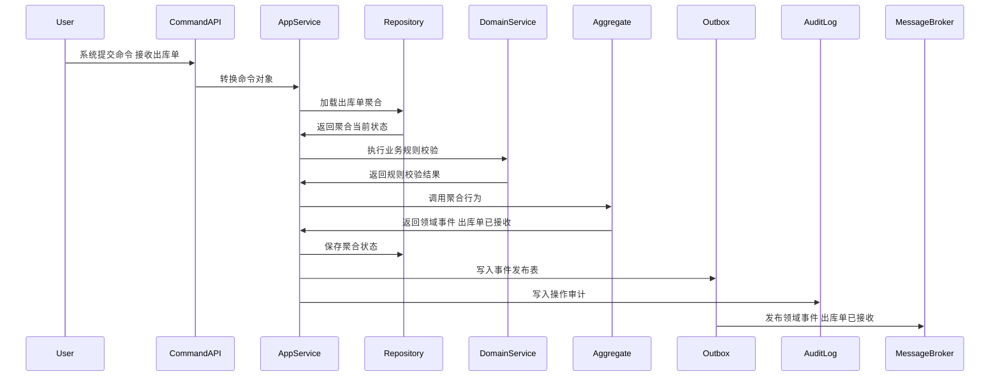
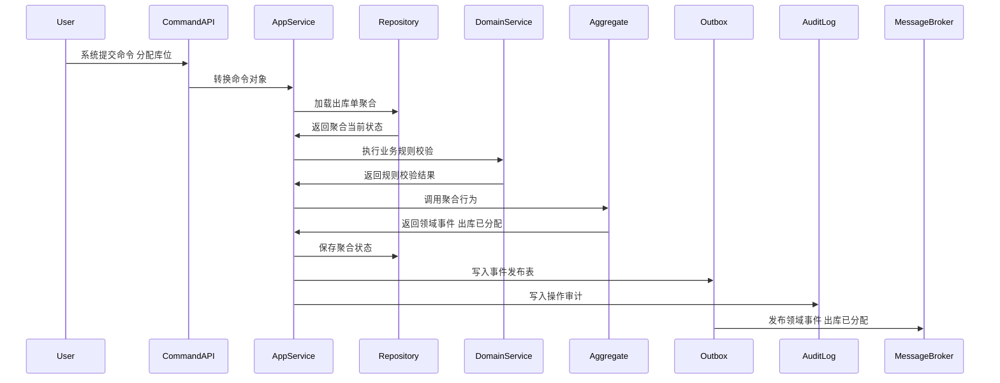
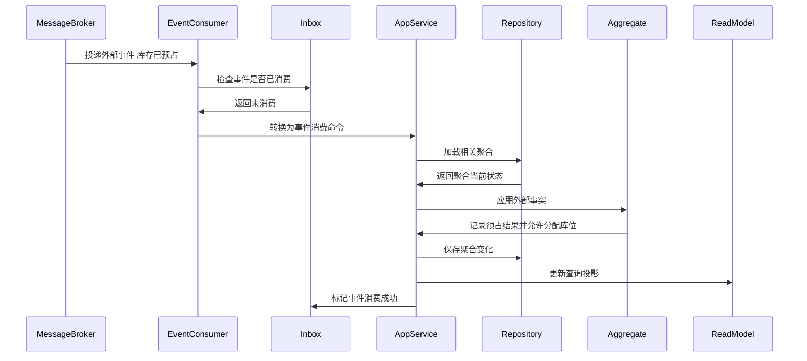
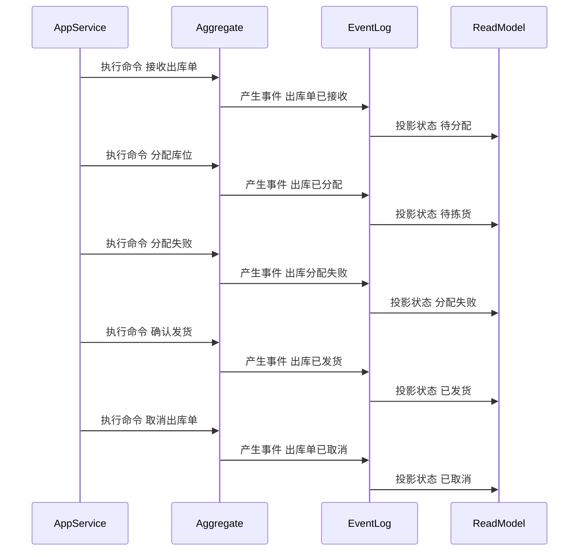

# 07-出库单聚合CQRS设计

> 所属上下文：WMS 领域。本文按 DDD + CQRS 深入到聚合属性、命令处理、应用服务编排、领域服务规则、事件产生和事件消费逻辑。关键时序图使用 Mermaid 最小兼容语法，便于 VSCode Markdown 预览稳定渲染。

## 1. 业务目标分析

承接销售、调拨、退供等出库指令和承运要求，并驱动库位分配、波次、拣货、复核、包装、面单绑定和发货交接。

| 设计项 | 结论 |
| --- | --- |
| 限界上下文 | WMS 上下文 |
| 子域类型 | 核心域，出库作业入口 |
| 聚合根 | 出库单 |
| 数据主权 | WMS 拥有 `出库单` 的仓内作业状态、作业事实、任务执行过程和领域事件；TMS 拥有运输任务、运单、面单、轨迹、签收和运输异常；外部系统只能通过命令或事件协作 |
| 主要使用角色 | OMS、调拨系统、采购系统、TMS、仓库主管、发货员 |
| 核心不变量 | 外部只能通过聚合根修改内部实体；数量、库位、批次、质量状态和容器关系必须可追溯；写命令和消费事件必须幂等 |

## 2. 角色、场景与流程分析

| 场景 | 发起角色 | 应用服务处理逻辑 | 领域服务 | 结果事件 |
| --- | --- | --- | --- | --- |
| 接收出库单 | 系统 | 围绕出库单执行接收出库单，校验状态、来源、仓库、库位、SKU、批次和作业权限 | 出库可执行校验服务 | 出库单已接收 |
| 记录运单面单 | TMS事件消费者 | 消费运单/面单生成事实，更新出库承运快照，供包装和交接使用 | 出库可执行校验服务 | 出库承运信息已记录 |
| 分配库位 | 系统 | 围绕出库单执行分配库位，校验状态、来源、仓库、库位、SKU、批次和作业权限 | 出库可执行校验服务 | 出库已分配 |
| 分配失败 | 系统 | 围绕出库单执行分配失败，校验状态、来源、仓库、库位、SKU、批次和作业权限 | 出库可执行校验服务 | 出库分配失败 |
| 确认发货 | 系统 | 围绕出库单执行确认发货，校验状态、来源、仓库、库位、SKU、批次和作业权限 | 出库可执行校验服务 | 出库已发货 |
| 取消出库单 | 系统 | 围绕出库单执行取消出库单，校验状态、来源、仓库、库位、SKU、批次和作业权限 | 出库可执行校验服务 | 出库单已取消 |

## 3. 领域边界与分层架构

WMS 领域事件的位置要明确区分三层含义：领域层产生仓内作业事实，应用层保存聚合与事件发布表，基础设施层投递消息并消费外部指令或事件。

## 4. 聚合属性设计

| 属性 | 业务含义 | 模型归属 | 是否可变 | 主要修改命令 | 变化规则 |
| --- | --- | --- | --- | --- | --- |
| 出库单Id | 出库单ID | 聚合根 | 否 | 接收出库单 | 全局唯一 |
| 出库单No | 出库单单号 | 值对象 | 否 | 接收出库单 | 按WMS单号规则生成 |
| warehouseId | 仓库ID | 外部事实快照 | 否 | 接收出库单 | 来源于主数据，作业过程中不可随意变更 |
| status | 作业状态 | 值对象 | 是 | 状态推进命令 | 必须按状态机流转 |
| lineList | 作业明细 | 内部实体集合 | 是 | 创建或执行命令 | 记录SKU、数量、批次、库位、质量状态 |
| shippingRequirement | 发运要求 | 值对象 | 是 | 接收出库单/记录运单面单 | 承运商、承运产品、时效要求、是否需要面单、收发货地址 |
| waybillSnapshot | 运单面单快照 | 值对象 | 是 | 记录运单面单 | TMS运输任务号、运单号、面单号、面单URL、承运商、承运产品、打印状态 |
| locationSnapshot | 库位快照 | 值对象 | 是 | 分配或执行命令 | 记录库区、库位、用途、容量、质量状态限制 |
| operatorSnapshot | 操作人快照 | 值对象 | 是 | 所有作业命令 | 记录用户、角色、仓库、操作时间 |
| operationLog | 操作记录 | 内部实体集合 | 是 | 所有写命令 | 记录动作、原因、前后状态和设备信息 |

## 5. 命令与应用服务逻辑

应用服务负责编排用例：校验权限、检查幂等、加载聚合、调用领域服务、执行聚合行为、保存聚合、写发布表、写审计日志。

| 命令 | 发起者 | 应用服务处理逻辑 | 参与领域服务 | 成功后领域事件 |
| --- | --- | --- | --- | --- |
| 接收出库单 | 系统 | 围绕出库单执行接收出库单，校验状态、来源、仓库、库位、SKU、批次和作业权限 | 出库可执行校验服务 | 出库单已接收 |
| 记录运单面单 | TMS事件消费者 | 绑定运单号、面单号、承运产品和打印状态，供复核包装引用 | 出库可执行校验服务 | 出库承运信息已记录 |
| 分配库位 | 系统 | 围绕出库单执行分配库位，校验状态、来源、仓库、库位、SKU、批次和作业权限 | 出库可执行校验服务 | 出库已分配 |
| 分配失败 | 系统 | 围绕出库单执行分配失败，校验状态、来源、仓库、库位、SKU、批次和作业权限 | 出库可执行校验服务 | 出库分配失败 |
| 确认发货 | 系统 | 围绕出库单执行确认发货，校验状态、来源、仓库、库位、SKU、批次和作业权限 | 出库可执行校验服务 | 出库已发货 |
| 取消出库单 | 系统 | 围绕出库单执行取消出库单，校验状态、来源、仓库、库位、SKU、批次和作业权限 | 出库可执行校验服务 | 出库单已取消 |

### 5.1 应用服务通用处理模板

1. 接口层接收请求并转换为命令对象。
2. 应用层校验用户、角色、仓库、库区、作业类型和数据权限。
3. 使用 `来源系统 + 来源单号 + 命令类型 + 幂等键` 做幂等检查。
4. 通过资源库加载 `出库单` 聚合根，新建场景先校验业务唯一性。
5. 调用领域服务完成库位、批次、质量状态、容器、数量和外部事实快照的规则判断。
6. 聚合根执行行为，修改属性、内部实体和值对象，并产生领域事件。
7. 同一事务保存聚合、事件发布表和操作审计。
8. 事件发布器异步投递事件，读模型投影器更新查询模型。

### 5.2 关键命令处理细节

| 关键命令 | 前置校验 | 聚合行为 | 异常或补偿处理 |
| --- | --- | --- | --- |
| 接收出库单 | 出库单状态允许执行，仓库、库位、SKU、批次、数量和权限有效 | 修改出库单状态或明细并产生事件 出库单已接收 | 状态不匹配则拒绝；作业差异进入仓内异常或人工待办 |
| 记录运单面单 | 来源为 TMS；出库单已接收；运单与来源单/包裹规则匹配 | 写入运单面单快照，不改变拣货和发货数量 | 面单缺失或承运商不匹配时阻塞包装完成并生成异常待办 |
| 分配库位 | 出库单状态允许执行，仓库、库位、SKU、批次、数量和权限有效 | 修改出库单状态或明细并产生事件 出库已分配 | 状态不匹配则拒绝；作业差异进入仓内异常或人工待办 |
| 分配失败 | 出库单状态允许执行，仓库、库位、SKU、批次、数量和权限有效 | 修改出库单状态或明细并产生事件 出库分配失败 | 状态不匹配则拒绝；作业差异进入仓内异常或人工待办 |

## 6. 领域服务逻辑

| 领域服务 | 核心逻辑 |
| --- | --- |
| 出库可执行校验服务 | 围绕出库单的作业状态、数量不变量、库位规则、批次质量状态和外部事实快照进行业务判定。 |
| 出库库位分配服务 | 围绕出库单的作业状态、数量不变量、库位规则、批次质量状态和外部事实快照进行业务判定。 |
| 出库取消判定服务 | 围绕出库单的作业状态、数量不变量、库位规则、批次质量状态和外部事实快照进行业务判定。 |

## 7. 事件产生逻辑

| 领域事件 | 触发命令 | 关键载荷 | 主要消费者 |
| --- | --- | --- | --- |
| 出库单已接收 | 接收出库单 | 出库单ID、仓库、SKU、批次、库位、数量、状态 | 中央库存、采购、OMS、BMS、读模型、审计日志 |
| 出库承运信息已记录 | 记录运单面单 | 出库单ID、TMS运输任务号、运单号、面单号、承运商、承运产品、打印状态 | 复核包装、发货交接、读模型 |
| 出库已分配 | 分配库位 | 出库单ID、仓库、SKU、批次、库位、数量、状态 | 中央库存、采购、OMS、BMS、读模型、审计日志 |
| 出库分配失败 | 分配失败 | 出库单ID、仓库、SKU、批次、库位、数量、状态 | 中央库存、采购、OMS、BMS、读模型、审计日志 |
| 出库已发货 | 确认发货 | 出库单ID、仓库、SKU、批次、库位、数量、状态 | 中央库存、采购、OMS、BMS、读模型、审计日志 |
| 出库单已取消 | 取消出库单 | 出库单ID、仓库、SKU、批次、库位、数量、状态 | 中央库存、采购、OMS、BMS、读模型、审计日志 |

### 7.1 事件生成规则

- 领域事件使用过去式命名，只表达已经发生的仓内作业事实。
- 聚合根在业务行为成功后产生领域事件；应用服务负责收集、持久化和发布。
- 事件载荷必须包含事件编号、事件版本、发生时间、来源上下文、仓库、聚合ID、聚合版本、操作者和关键作业字段。
- 命令幂等命中时，返回原处理结果，不能重复产生仓内事实。
- 外部事件消费必须先进入事件收件箱，再由应用服务加载聚合并执行本地业务行为。

## 8. 事件订阅与消费逻辑

| 订阅事件 | 处理应用服务 | 消费后数据变化 | 幂等键 |
| --- | --- | --- | --- |
| 库存已预占 | 外部事件消费服务 | 记录预占结果并允许分配库位 | 来源上下文+事件编号+业务主键 |
| 运单已创建 | TMS事件消费服务 | 记录运单和承运商，供包装和交接使用 | TMS上下文+事件编号+waybillNo |
| 面单已生成 | TMS事件消费服务 | 记录面单号、面单URL和打印状态，供包装使用 | TMS上下文+事件编号+labelNo |
| SKU已停用 | 主数据事件消费服务 | 标记相关作业明细不可继续执行并生成异常 | 主数据上下文+事件编号+skuId |
| 库位已更新 | 主数据事件消费服务 | 刷新库位用途、容量、启停用和质量状态限制 | 主数据上下文+事件编号+locationId |
| 仓库已停用 | 主数据事件消费服务 | 阻断新作业接单并保留已开始作业处理入口 | 主数据上下文+事件编号+warehouseId |

## 9. 关键时序图

### 9.1 命令处理、聚合变更与事件发布

### 9.2 典型业务命令一

### 9.3 典型业务命令二

### 9.4 事件订阅、幂等消费与本地状态变化

### 9.5 聚合状态推进时序

## 10. 不变量、异常补偿、权限与审计

| 类型 | 规则 |
| --- | --- |
| 聚合不变量 | `出库单` 的状态只能通过聚合根行为推进，内部实体不能被外部直接修改 |
| 数量不变量 | 应收、实收、应检、合格、不合格、应上架、已上架、应拣、已拣、已发数量不能为负，不能无原因超过来源数量 |
| 库位不变量 | 作业库位必须启用且用途匹配，质量状态不匹配的商品不能进入可用库位 |
| 批次和质量不变量 | 批次、效期、序列号、质量状态必须按SKU规则校验，不合格和冻结商品不能进入可拣链路 |
| 幂等 | 命令和事件消费都必须有幂等键，重复请求不能重复产生仓内事实 |
| 并发 | 聚合保存使用版本号乐观锁，库位库存类操作必须防止并发扣减或重复上账 |
| 补偿 | 发布失败走事件发布表重试，消费失败走收件箱重试；运单/面单缺失、承运商不匹配、出库取消与 TMS 运单冲突进入仓内异常闭环 |
| 权限 | 按角色、仓库、库区、作业类型、设备和班组控制命令可执行性 |
| 审计 | 所有写命令记录操作者、设备、来源、请求摘要、前后状态、事件编号和失败原因 |

## 11. 读模型设计

读模型服务于查询、作业页、看板和绩效统计，不参与聚合不变量保护。写入决策必须回到应用服务、聚合根和领域服务。

| 读模型 | 使用场景 | 主要字段 |
| --- | --- | --- |
| 出库单列表读模型 | 查询、分页、筛选 | 单号、仓库、状态、作业类型、承运商、运单号、数量、更新时间 |
| 出库单详情读模型 | 详情页和作业页展示 | 单头、明细、发运要求、运单面单快照、库位、批次、容器、状态历史、操作日志 |
| 出库单异常读模型 | 异常看板和主管处理 | 异常类型、责任人、阻塞原因、处理状态 |
| 出库单效率读模型 | 作业效率和绩效统计 | 操作人、开始时间、完成时间、件数、差异数 |

## 12. 设计结论与待确认问题

### 12.1 设计结论

- `出库单` 是 WMS 领域内独立保护仓内作业规则和状态流转的聚合根。
- 命令处理属于应用层编排，核心作业规则属于聚合根和领域服务。
- WMS 不拥有中央库存统一余额账本，也不拥有 TMS 运输轨迹和签收事实；WMS 只发布真实仓内作业、包装和交接事实。

### 12.2 待确认问题

| 问题 | 默认建议 |
| --- | --- |
| 是否多仓、多库区、多货主 | 默认保留仓库、库区、货主、批次、质量状态和操作人数据范围 |
| 是否允许终态作业单强制修改 | 默认不允许，需通过异常处理、补偿作业或盘点调整处理 |
| 是否需要事件溯源 | 当前阶段建议当前状态表 + 作业明细表 + 作业历史表 + 事件日志 |
