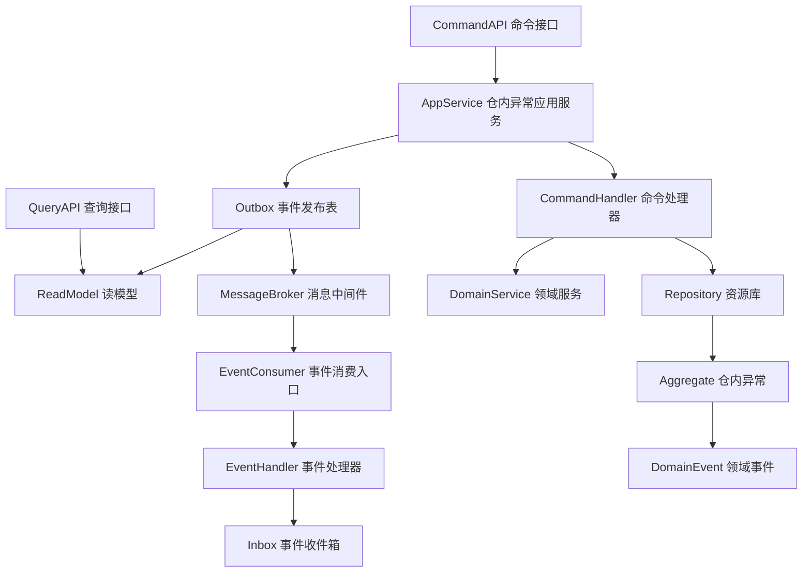
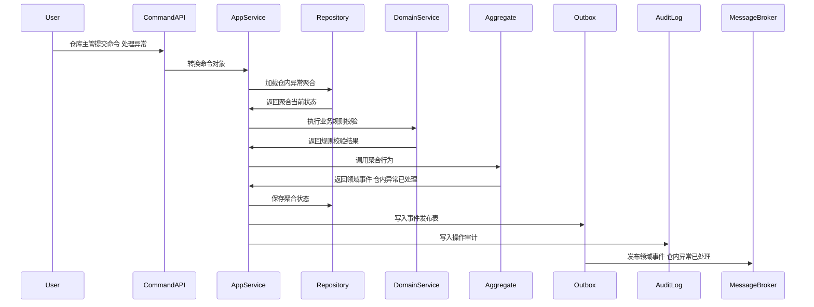
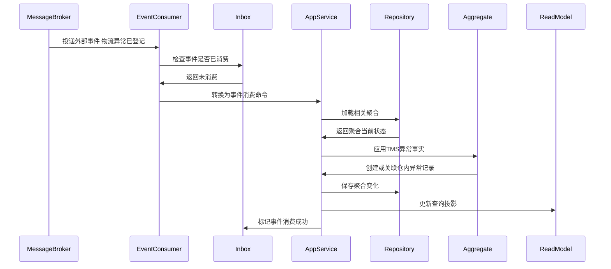
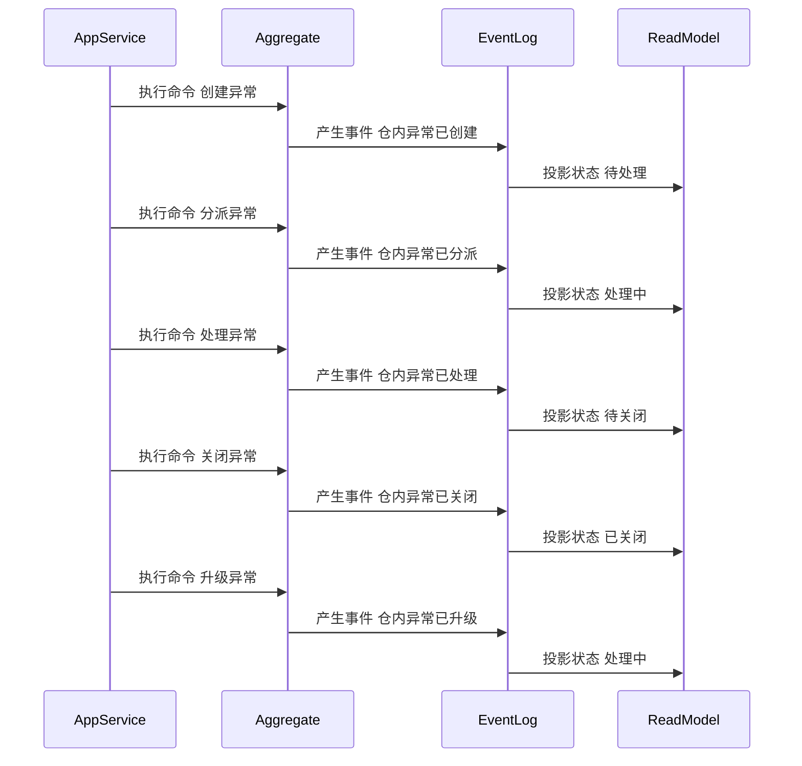

# 14-仓内异常聚合CQRS设计

> 所属上下文：WMS 领域。本文按 DDD + CQRS 深入到聚合属性、命令处理、应用服务编排、领域服务规则、事件产生和事件消费逻辑。关键时序图使用 Mermaid 最小兼容语法，便于 VSCode Markdown 预览稳定渲染。

## 1. 业务目标分析

处理短收、超收、错货、破损、库位不符、短拣、复核差异、面单异常、发货漏扫、承运商拒收、TMS 到仓未收货等异常，形成责任和处理闭环。

| 设计项 | 结论 |
| --- | --- |
| 限界上下文 | WMS 上下文 |
| 子域类型 | 核心域，仓内异常闭环 |
| 聚合根 | 仓内异常 |
| 数据主权 | WMS 拥有 `仓内异常` 的仓内作业状态、异常处理过程和处理结论；TMS 拥有运输异常、揽收拒收、签收拒收等运输事实；外部系统只能通过命令或事件协作 |
| 主要使用角色 | 仓库主管、收货员、质检员、拣货员、复核员、发货员、TMS事件消费者 |
| 核心不变量 | 外部只能通过聚合根修改内部实体；数量、库位、批次、质量状态和容器关系必须可追溯；写命令和消费事件必须幂等 |

## 2. 角色、场景与流程分析

| 场景 | 发起角色 | 应用服务处理逻辑 | 领域服务 | 结果事件 |
| --- | --- | --- | --- | --- |
| 创建异常 | 仓库主管 | 围绕仓内异常执行创建异常，校验状态、来源、仓库、库位、SKU、批次和作业权限 | 仓内异常归因服务 | 仓内异常已创建 |
| 消费运输异常 | TMS事件消费者 | 将到仓未收货、面单异常、揽收拒收、交接后运输异常转换为仓内异常或关联已有异常 | 仓内异常归因服务 | 仓内异常已创建 |
| 分派异常 | 仓库主管 | 围绕仓内异常执行分派异常，校验状态、来源、仓库、库位、SKU、批次和作业权限 | 仓内异常归因服务 | 仓内异常已分派 |
| 处理异常 | 仓库主管 | 围绕仓内异常执行处理异常，校验状态、来源、仓库、库位、SKU、批次和作业权限 | 仓内异常归因服务 | 仓内异常已处理 |
| 关闭异常 | 仓库主管 | 围绕仓内异常执行关闭异常，校验状态、来源、仓库、库位、SKU、批次和作业权限 | 仓内异常归因服务 | 仓内异常已关闭 |
| 升级异常 | 仓库主管 | 围绕仓内异常执行升级异常，校验状态、来源、仓库、库位、SKU、批次和作业权限 | 仓内异常归因服务 | 仓内异常已升级 |

## 3. 领域边界与分层架构

WMS 领域事件的位置要明确区分三层含义：领域层产生仓内作业事实，应用层保存聚合与事件发布表，基础设施层投递消息并消费外部指令或事件。

## 4. 聚合属性设计

| 属性 | 业务含义 | 模型归属 | 是否可变 | 主要修改命令 | 变化规则 |
| --- | --- | --- | --- | --- | --- |
| 仓内异常Id | 仓内异常ID | 聚合根 | 否 | 创建异常 | 全局唯一 |
| 仓内异常No | 仓内异常单号 | 值对象 | 否 | 创建异常 | 按WMS单号规则生成 |
| warehouseId | 仓库ID | 外部事实快照 | 否 | 创建异常 | 来源于主数据，作业过程中不可随意变更 |
| status | 作业状态 | 值对象 | 是 | 状态推进命令 | 必须按状态机流转 |
| lineList | 作业明细 | 内部实体集合 | 是 | 创建或执行命令 | 记录SKU、数量、批次、库位、质量状态 |
| externalEventRef | 外部事件引用 | 值对象 | 否 | 创建异常/消费运输异常 | 来源上下文、事件编号、运单号、包裹号、来源单号 |
| responsibilitySnapshot | 责任快照 | 值对象 | 是 | 处理异常/关闭异常 | 仓内、承运商、供应商、客户、系统、待判定 |
| locationSnapshot | 库位快照 | 值对象 | 是 | 分配或执行命令 | 记录库区、库位、用途、容量、质量状态限制 |
| operatorSnapshot | 操作人快照 | 值对象 | 是 | 所有作业命令 | 记录用户、角色、仓库、操作时间 |
| operationLog | 操作记录 | 内部实体集合 | 是 | 所有写命令 | 记录动作、原因、前后状态和设备信息 |

## 5. 命令与应用服务逻辑

应用服务负责编排用例：校验权限、检查幂等、加载聚合、调用领域服务、执行聚合行为、保存聚合、写发布表、写审计日志。

| 命令 | 发起者 | 应用服务处理逻辑 | 参与领域服务 | 成功后领域事件 |
| --- | --- | --- | --- | --- |
| 创建异常 | 仓库主管 | 围绕仓内异常执行创建异常，校验状态、来源、仓库、库位、SKU、批次和作业权限 | 仓内异常归因服务 | 仓内异常已创建 |
| 消费运输异常 | TMS事件消费者 | 按运单、包裹、入库单、出库单匹配仓内作业，创建或关联异常 | 仓内异常归因服务 | 仓内异常已创建 |
| 分派异常 | 仓库主管 | 围绕仓内异常执行分派异常，校验状态、来源、仓库、库位、SKU、批次和作业权限 | 仓内异常归因服务 | 仓内异常已分派 |
| 处理异常 | 仓库主管 | 围绕仓内异常执行处理异常，校验状态、来源、仓库、库位、SKU、批次和作业权限 | 仓内异常归因服务 | 仓内异常已处理 |
| 关闭异常 | 仓库主管 | 围绕仓内异常执行关闭异常，校验状态、来源、仓库、库位、SKU、批次和作业权限 | 仓内异常归因服务 | 仓内异常已关闭 |
| 升级异常 | 仓库主管 | 围绕仓内异常执行升级异常，校验状态、来源、仓库、库位、SKU、批次和作业权限 | 仓内异常归因服务 | 仓内异常已升级 |

### 5.1 应用服务通用处理模板

1. 接口层接收请求并转换为命令对象。
2. 应用层校验用户、角色、仓库、库区、作业类型和数据权限。
3. 使用 `来源系统 + 来源单号 + 命令类型 + 幂等键` 做幂等检查。
4. 通过资源库加载 `仓内异常` 聚合根，新建场景先校验业务唯一性。
5. 调用领域服务完成库位、批次、质量状态、容器、数量和外部事实快照的规则判断。
6. 聚合根执行行为，修改属性、内部实体和值对象，并产生领域事件。
7. 同一事务保存聚合、事件发布表和操作审计。
8. 事件发布器异步投递事件，读模型投影器更新查询模型。

### 5.2 关键命令处理细节

| 关键命令 | 前置校验 | 聚合行为 | 异常或补偿处理 |
| --- | --- | --- | --- |
| 创建异常 | 仓内异常状态允许执行，仓库、库位、SKU、批次、数量和权限有效 | 修改仓内异常状态或明细并产生事件 仓内异常已创建 | 状态不匹配则拒绝；作业差异进入仓内异常或人工待办 |
| 消费运输异常 | 来源为 TMS；事件未消费；运单/包裹/入库单/出库单可匹配 | 创建到仓未收货、面单异常、承运商拒收、揽收异常等仓内异常；记录责任待判定 | 无法匹配作业时进入异常事实池；重复事件按 TMS eventId 幂等 |
| 分派异常 | 仓内异常状态允许执行，仓库、库位、SKU、批次、数量和权限有效 | 修改仓内异常状态或明细并产生事件 仓内异常已分派 | 状态不匹配则拒绝；作业差异进入仓内异常或人工待办 |
| 处理异常 | 仓内异常状态允许执行，仓库、库位、SKU、批次、数量和权限有效 | 修改仓内异常状态或明细并产生事件 仓内异常已处理 | 状态不匹配则拒绝；作业差异进入仓内异常或人工待办 |

## 6. 领域服务逻辑

| 领域服务 | 核心逻辑 |
| --- | --- |
| 仓内异常归因服务 | 根据收货、拣货、复核、包装、交接、TMS 到达/揽收/拒收/异常等事实判断异常类型、影响作业、责任方和后续处理入口。 |
| 异常处理策略服务 | 围绕仓内异常的作业状态、数量不变量、库位规则、批次质量状态和外部事实快照进行业务判定。 |
| 异常关闭判定服务 | 围绕仓内异常的作业状态、数量不变量、库位规则、批次质量状态和外部事实快照进行业务判定。 |

## 7. 事件产生逻辑

| 领域事件 | 触发命令 | 关键载荷 | 主要消费者 |
| --- | --- | --- | --- |
| 仓内异常已创建 | 创建异常/消费运输异常 | 仓内异常ID、仓库、异常类型、来源上下文、运单号、包裹号、SKU、批次、库位、数量、责任方、状态 | 中央库存、采购、OMS、TMS、BMS、读模型、审计日志 |
| 仓内异常已分派 | 分派异常 | 仓内异常ID、仓库、SKU、批次、库位、数量、状态 | 中央库存、采购、OMS、BMS、读模型、审计日志 |
| 仓内异常已处理 | 处理异常 | 仓内异常ID、仓库、SKU、批次、库位、数量、状态 | 中央库存、采购、OMS、BMS、读模型、审计日志 |
| 仓内异常已关闭 | 关闭异常 | 仓内异常ID、仓库、SKU、批次、库位、数量、状态 | 中央库存、采购、OMS、BMS、读模型、审计日志 |
| 仓内异常已升级 | 升级异常 | 仓内异常ID、仓库、SKU、批次、库位、数量、状态 | 中央库存、采购、OMS、BMS、读模型、审计日志 |

### 7.1 事件生成规则

- 领域事件使用过去式命名，只表达已经发生的仓内作业事实。
- 聚合根在业务行为成功后产生领域事件；应用服务负责收集、持久化和发布。
- 事件载荷必须包含事件编号、事件版本、发生时间、来源上下文、仓库、聚合ID、聚合版本、操作者和关键作业字段。
- 命令幂等命中时，返回原处理结果，不能重复产生仓内事实。
- 外部事件消费必须先进入事件收件箱，再由应用服务加载聚合并执行本地业务行为。

## 8. 事件订阅与消费逻辑

| 订阅事件 | 处理应用服务 | 消费后数据变化 | 幂等键 |
| --- | --- | --- | --- |
| 收货差异已记录 | 外部事件消费服务 | 创建仓内异常记录 | 来源上下文+事件编号+业务主键 |
| 运输已到达 | TMS事件消费服务 | 到仓后超过收货准备时限仍未开始收货时创建到仓未收货异常 | TMS上下文+事件编号+waybillNo |
| 面单已生成失败 | TMS事件消费服务 | 创建面单异常，阻塞包装完成或发货交接 | TMS上下文+事件编号+labelNo |
| 运输已拒收 | TMS事件消费服务 | 创建承运商拒收或交接后拒收异常，关联发货交接和包裹 | TMS上下文+事件编号+waybillNo |
| 物流异常已登记 | TMS事件消费服务 | 记录运输异常摘要，关联入库到货、出库交接或包裹 | TMS上下文+事件编号+exceptionNo |
| SKU已停用 | 主数据事件消费服务 | 标记相关作业明细不可继续执行并生成异常 | 主数据上下文+事件编号+skuId |
| 库位已更新 | 主数据事件消费服务 | 刷新库位用途、容量、启停用和质量状态限制 | 主数据上下文+事件编号+locationId |
| 仓库已停用 | 主数据事件消费服务 | 阻断新作业接单并保留已开始作业处理入口 | 主数据上下文+事件编号+warehouseId |

## 9. 关键时序图

### 9.1 命令处理、聚合变更与事件发布

### 9.2 典型业务命令一

### 9.3 典型业务命令二

### 9.4 事件订阅、幂等消费与本地状态变化

### 9.5 聚合状态推进时序

## 10. 不变量、异常补偿、权限与审计

| 类型 | 规则 |
| --- | --- |
| 聚合不变量 | `仓内异常` 的状态只能通过聚合根行为推进，内部实体不能被外部直接修改 |
| 数量不变量 | 应收、实收、应检、合格、不合格、应上架、已上架、应拣、已拣、已发数量不能为负，不能无原因超过来源数量 |
| 库位不变量 | 作业库位必须启用且用途匹配，质量状态不匹配的商品不能进入可用库位 |
| 批次和质量不变量 | 批次、效期、序列号、质量状态必须按SKU规则校验，不合格和冻结商品不能进入可拣链路 |
| 幂等 | 命令和事件消费都必须有幂等键，重复请求不能重复产生仓内事实 |
| 并发 | 聚合保存使用版本号乐观锁，库位库存类操作必须防止并发扣减或重复上账 |
| 补偿 | 发布失败走事件发布表重试，消费失败走收件箱重试；TMS到仓未收货、面单异常、揽收拒收、运输异常进入仓内异常闭环 |
| 权限 | 按角色、仓库、库区、作业类型、设备和班组控制命令可执行性 |
| 审计 | 所有写命令记录操作者、设备、来源、请求摘要、前后状态、事件编号和失败原因 |

## 11. 读模型设计

读模型服务于查询、作业页、看板和绩效统计，不参与聚合不变量保护。写入决策必须回到应用服务、聚合根和领域服务。

| 读模型 | 使用场景 | 主要字段 |
| --- | --- | --- |
| 仓内异常列表读模型 | 查询、分页、筛选 | 单号、仓库、状态、异常类型、来源上下文、运单号、责任方、更新时间 |
| 仓内异常详情读模型 | 详情页和作业页展示 | 单头、明细、外部事件引用、责任快照、库位、批次、容器、状态历史、操作日志 |
| 仓内异常异常读模型 | 异常看板和主管处理 | 异常类型、责任人、运单号、包裹号、阻塞原因、处理状态 |
| 仓内异常效率读模型 | 作业效率和绩效统计 | 操作人、开始时间、完成时间、件数、差异数 |

## 12. 设计结论与待确认问题

### 12.1 设计结论

- `仓内异常` 是 WMS 领域内独立保护仓内作业规则和状态流转的聚合根。
- 命令处理属于应用层编排，核心作业规则属于聚合根和领域服务。
- WMS 不拥有中央库存统一余额账本，也不拥有 TMS 运输事实主权；仓内异常只负责把影响仓内作业的运输事实转成可处理的仓库异常闭环。

### 12.2 待确认问题

| 问题 | 默认建议 |
| --- | --- |
| 是否多仓、多库区、多货主 | 默认保留仓库、库区、货主、批次、质量状态和操作人数据范围 |
| 是否允许终态作业单强制修改 | 默认不允许，需通过异常处理、补偿作业或盘点调整处理 |
| 是否需要事件溯源 | 当前阶段建议当前状态表 + 作业明细表 + 作业历史表 + 事件日志 |
