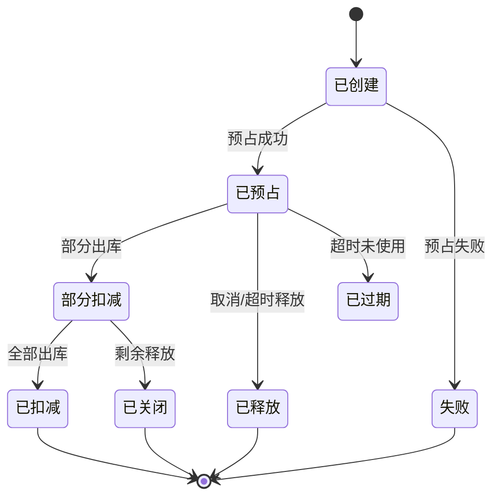
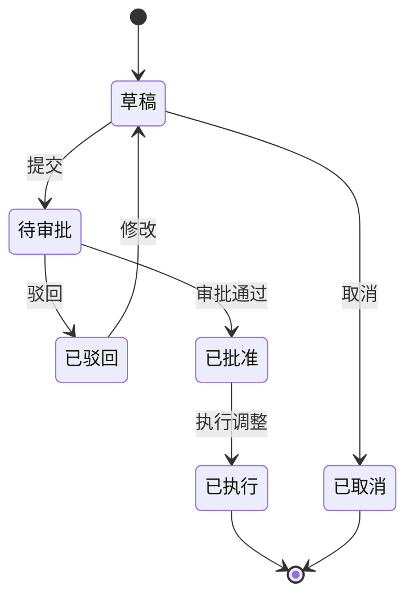

# 01 中央库存领域模型

> 本文用于中央库存领域模型设计，承接 [中央库存系统功能设计](33-中央库存系统功能设计.md)、[中央库存系统详细设计](44-中央库存系统详细设计.md)、[库存预占扣减释放流程图](../../02-业务流程/05-库存预占扣减释放流程图.md)、[库存接口设计](02-库存接口设计.md) 和 [核心聚合与不变量总表](../00-领域模型总览/00-核心聚合与不变量总表.md)。本文不只覆盖库存流水，而是覆盖中央库存从余额、可用、预占、释放、扣减、入库、冻结、调整、快照、对账到事件幂等的完整库存账本生命周期。

## 1. 事件风暴

### 1.1 业务目标

中央库存解决的是：企业如何用统一口径回答“现在有多少库存、能承诺多少库存、哪些业务占用了库存、库存为什么变化、库存是否和仓库一致”。

完整库存生命周期：

```text
主数据维度启用
  -> 初始化库存账户
  -> 查询可用/可售库存
  -> 销售/调拨/退供预占
  -> 取消/短拣/超时释放
  -> WMS 发货扣减
  -> WMS 上架入库
  -> 质检/盘点/风控冻结或解冻
  -> 盘盈盘亏/报废/纠错调整
  -> 生成库存流水、快照和对账差异
```

中央库存的核心不是仓库扫码作业，而是“数量账本”。WMS 告诉中央库存实物事实，中央库存把事实转成余额、预占、流水和可售变化。

### 1.2 事件风暴总表

| 阶段 | 角色/系统 | 命令/事件 | 处理对象 | 领域事件 | 策略/后续动作 | 读模型 | 异常 |
| --- | --- | --- | --- | --- | --- | --- | --- |
| 维度初始化 | 主数据系统 | SKU/仓库/货主启用 | 库存账户 | 库存维度已初始化 | 允许查询和入账 | 库存维度表 | 主数据缺失 |
| 可用查询 | OMS/采购/运营 | 查询可用/可售 | 库存读模型 | 无 | 返回 ATP 结果 | 可售库存页 | 口径不一致 |
| 预占 | OMS/调拨/采购 | 预占库存 | 库存预占 | 库存已预占 / 预占失败 | 成功后业务继续履约 | 预占管理页 | 可用不足、重复请求 |
| 释放 | OMS/调拨 | 释放预占 | 库存预占 | 预占已释放 | 恢复可用 | 预占管理页 | 超释放 |
| 出库扣减 | WMS | 出库已发货 | 库存账户、预占、流水 | 库存已扣减 | 通知 OMS/BMS | 单据轨迹 | 重复扣减、无预占 |
| 入库增加 | WMS | 上架已完成 | 库存账户、流水 | 库存已入库 | 通知采购/OMS/BMS | 库存余额页 | 重复入库、状态错误 |
| 冻结解冻 | 库存运营/质检/盘点 | 冻结/解冻库存 | 冻结单、库存账户 | 库存已冻结 / 已解冻 | 改变可用口径 | 冻结解冻页 | 可冻结不足 |
| 调整 | 库存运营/财务审计 | 执行库存调整 | 调整单、库存账户、流水 | 库存已调整 | 形成红冲或调整流水 | 调整单页 | 未审批、负库存 |
| 快照 | 系统任务 | 生成库存快照 | 快照 | 库存快照已生成 | 支撑日结月结和计费 | 快照页 | 快照失败 |
| 对账 | 库存运营/WMS | 生成对账 | 对账单 | 库存对账差异已创建 | 差异处理或调整 | 对账页 | WMS 和中央数不一致 |

### 1.3 通用语言

| 术语 | 定义 |
| --- | --- |
| 库存账户 | 按货主、仓库、SKU、批次、库存状态等维度维护当前数量的聚合 |
| 可用库存 | 可以被业务承诺的库存数量，通常等于实物减冻结、预占、不可售等 |
| 可售库存 | 面向销售渠道的 ATP 查询结果，可能扣除安全库存、渠道限售等策略 |
| 库存预占 | 业务在实物移动前对库存做的承诺锁定 |
| 库存流水 | 只追加的库存事实账本，解释数量为什么变化 |
| 库存事件 | 中央库存接收外部事实或内部命令后的处理记录 |
| 冻结 | 将库存从可用口径中隔离，用于质检、盘点、风控、异常 |
| 调整 | 经过审批后对库存余额做盘盈、盘亏、报废、红冲或纠错 |

## 2. 子域、限界上下文、上下文映射、核心域

### 2.1 子域划分

| 子域 | 类型 | 说明 | 建模策略 |
| --- | --- | --- | --- |
| 库存余额与可用 | 核心域 | 统一库存数量口径和 ATP 口径 | 深入建模库存账户、可用计算、库存状态 |
| 库存预占与释放 | 核心域 | 防止超卖，管理销售、调拨、退供库存承诺 | 深入建模库存预占状态机 |
| 库存流水账本 | 核心域 | 记录所有库存变化原因 | 只追加流水，错误用冲正或调整 |
| 冻结、调整和对账 | 核心域 | 支撑异常隔离、盘点差异、账实核对 | 深入建模冻结单、调整单、对账单 |
| 仓内作业 | 支撑域 | WMS 生产收货、上架、发货、盘点事实 | 中央库存消费 WMS 事件 |
| OMS/采购/调拨/退供 | 支撑域 | 发起预占、释放、入库或出库业务意图 | 通过命令和事件协作 |
| 主数据、权限、BMS | 通用/支撑域 | 提供维度、审批、审计、计费依据 | 消费或发布事件 |

### 2.2 限界上下文模板

```markdown
上下文名称：中央库存上下文
子域类型：核心域
业务目标：统一管理库存余额、可用库存、预占、释放、扣减、入库、冻结、调整、流水、快照和对账。
负责范围：库存账户、可用/可售查询、库存预占、预占释放、出库扣减、入库增加、冻结解冻、库存调整、库存流水、库存快照、库存对账、事件幂等。
不负责范围：不执行仓库收货/上架/拣货/发货；不做销售审单；不做采购审批；不做财务入账；不维护 SKU/仓库主数据权威。
核心角色：库存运营、仓储运营、OMS、WMS、采购、调拨、BMS、财务审计。
核心聚合：库存账户、库存预占、冻结单、库存调整单、库存对账单、库存快照。
数据主权：库存余额、可用口径、预占状态、库存流水、库存事件处理结果。
生产事件：库存已预占、预占已释放、库存已扣减、库存已入库、库存已冻结、库存已解冻、库存已调整、库存对账差异已创建、可售库存已变化。
消费事件：SKU已启用、仓库已启用、货主已启用、WMS上架已完成、WMS出库已发货、WMS盘点差异已创建、审批已通过。
一致性要求：库存账户、流水、预占同事务强一致；跨 OMS/WMS/采购/BMS 最终一致；所有命令和事件必须幂等。
异常补偿：预占失败、重复扣减、重复入库、超释放、负库存、对账差异、调整失败、事件处理失败。
```

### 2.3 上下文映射

| 上游上下文 | 下游上下文 | 映射关系 | 协作方式 |
| --- | --- | --- | --- |
| 主数据 | 中央库存 | 遵奉者 | 消费 SKU、仓库、货主、批次规则等维度事件 |
| OMS | 中央库存 | 客户/供应商关系 | OMS 请求销售预占、释放；库存发布结果事件 |
| WMS | 中央库存 | 发布语言 | WMS 发布上架、发货、盘点事实；库存记账 |
| 采购/调拨/退供 | 中央库存 | 客户/供应商关系 | 发起调拨预占、退供锁定、入库确认等 |
| 中央库存 | BMS | 发布语言 | 库存流水、快照、出入库事实用于计费和对账 |
| 权限系统 | 中央库存 | 遵奉者 | 库存调整、冻结、对账确认需要权限和审批 |

## 3. 实体、值对象、聚合

| 聚合 | 聚合根 | 内部实体 | 值对象 | 主要不变量 |
| --- | --- | --- | --- | --- |
| 库存账户 | InventoryAccount | InventoryBucket、LedgerLine | 库存维度、数量、批次属性 | 同维度唯一；数量不能无来源变化；余额和流水同事务 |
| 库存预占 | InventoryReservation | ReservationLine、ReleaseRecord、DeductionRecord | 来源单据、幂等键、过期时间 | 释放+扣减不能超过预占；已扣减不能释放 |
| 冻结单 | InventoryFreezeOrder | FreezeLine、UnfreezeRecord | 冻结原因、审批结果 | 冻结不能超过可冻结数量；解冻不能超过已冻结 |
| 库存调整单 | InventoryAdjustmentOrder | AdjustmentLine、ApprovalRecord | 调整原因、红冲来源 | 未审批不能执行；历史流水不能物理修改 |
| 库存对账单 | InventoryReconciliation | ReconciliationLine | 中央数量、WMS 数量、差异原因 | 差异确认后才能调整 |
| 库存快照 | InventorySnapshot | SnapshotLine | 快照日期、账期 | 同仓同日同类型只能有一个有效快照 |

## 4. 聚合根、领域服务、资源库、领域事件

### 4.1 聚合模板

```markdown
聚合名称：库存账户
聚合根：InventoryAccount
业务目标：维护某个库存维度下的当前数量。
主要命令：确认入库、确认出库、冻结、解冻、调整、生成流水
主要事件：库存已入库、库存已扣减、库存已冻结、库存已解冻、库存已调整
核心不变量：同维度唯一；可用不能小于 0；余额更新和流水追加必须同事务。
资源库：InventoryAccountRepository
```

```markdown
聚合名称：库存预占
聚合根：InventoryReservation
业务目标：管理销售、调拨、退供等业务对库存的承诺。
主要命令：预占库存、释放预占、扣减预占、关闭预占
主要事件：库存已预占、预占已释放、预占已扣减、预占已关闭
核心不变量：释放数量 + 扣减数量 <= 预占数量；已扣减部分不能释放。
资源库：InventoryReservationRepository
```

### 4.2 领域服务

| 领域服务 | 解决的问题 |
| --- | --- |
| 可用库存计算服务 | 统一可用、可售、ATP 计算口径 |
| 库存预占分配服务 | 按仓库、批次、状态、策略选择可预占账户 |
| 库存记账服务 | 将外部事实转为余额变化和流水批次 |
| 库存对账服务 | 比对中央库存、WMS 库位库存和库存流水 |
| 库存调整校验服务 | 校验审批、负库存、红冲来源和调整权限 |

### 4.3 资源库

| 资源库 | 聚合根 | 主要能力 |
| --- | --- | --- |
| `InventoryAccountRepository` | 库存账户 | 按维度加载、加锁更新、保存余额 |
| `InventoryReservationRepository` | 库存预占 | 按来源单加载、保存预占、检查幂等 |
| `InventoryFreezeRepository` | 冻结单 | 加载冻结单、保存冻结/解冻结果 |
| `InventoryAdjustmentRepository` | 调整单 | 加载调整单、保存执行结果 |
| `InventoryLedgerRepository` | 库存流水 | 追加流水、按单据追踪流水 |
| `InventoryEventRepository` | 库存事件 | 记录收件箱、处理状态和失败原因 |

### 4.4 领域事件

| 事件 | 所属聚合 | 关键载荷 | 下游 |
| --- | --- | --- | --- |
| `InventoryReserved` | 库存预占 | 预占单号、来源单、仓库、SKU、数量 | OMS、调拨、采购 |
| `InventoryReservationReleased` | 库存预占 | 预占单号、释放数量、原因 | OMS、调拨 |
| `InventoryDeducted` | 库存账户 | 来源单、流水批次、SKU、扣减数量 | OMS、BMS、报表 |
| `InventoryInboundConfirmed` | 库存账户 | 来源单、仓库、SKU、入库数量、状态 | 采购、OMS、BMS |
| `InventoryAdjusted` | 调整单 | 调整单、原因、数量、审批单 | WMS、财务、报表 |
| `SellableInventoryChanged` | 库存账户 | SKU、仓库、变化前后可售 | OMS、渠道 |

## 5. 状态机模板

### 5.1 库存预占状态机



### 5.2 库存调整状态机



## 6. 领域字段归属

| 聚合 | 核心字段 |
| --- | --- |
| 库存账户 | 货主、仓库、SKU、批次、库存状态、实物、可用、预占、冻结、在途、不可售、版本号 |
| 库存预占 | 预占单号、来源系统、来源单、预占类型、状态、过期时间、预占数量、释放数量、扣减数量 |
| 库存流水 | 流水号、流水批次、流水类型、变化方向、变化前后数量、来源单、事件 ID、幂等键 |
| 冻结单 | 冻结单号、冻结原因、审批状态、冻结状态、冻结数量、解冻数量 |
| 调整单 | 调整单号、调整类型、调整原因、审批状态、执行状态、红冲来源 |
| 对账单 | 对账单号、仓库、对账日期、中央数量、WMS 数量、差异数量、差异状态 |

## 7. 应用服务与读模型

| 应用服务 | 编排用例 |
| --- | --- |
| 库存查询应用服务 | 查询余额、可用、可售、单据轨迹 |
| 库存预占应用服务 | 校验幂等、加载账户、创建预占、追加流水、发布事件 |
| 库存出入库事件处理器 | 消费 WMS 上架/发货事件，更新账户和流水 |
| 冻结解冻应用服务 | 校验权限和数量，执行冻结/解冻 |
| 库存调整应用服务 | 校验审批，执行盘盈盘亏、红冲、报废 |
| 库存对账应用服务 | 拉取 WMS 数量，生成差异，推动调整 |

| 读模型 | 用途 |
| --- | --- |
| 库存余额页 | 查询当前库存 |
| 可用库存页 | 给 OMS、采购、调拨查询可承诺数量 |
| 预占管理页 | 查看预占、释放、扣减状态 |
| 库存流水页 | 追溯库存变化 |
| 单据库存轨迹 | 按来源单串起命令、事件、流水 |
| 库存对账页 | 对比中央库存和 WMS |

## 8. 关键不变量与补偿

| 场景 | 不变量 | 补偿 |
| --- | --- | --- |
| 预占 | 可用库存不能小于预占数量 | 预占失败，业务换仓、拆单或等待补货 |
| 释放 | 释放不能超过未扣减预占 | 幂等忽略或人工修正 |
| 出库扣减 | 实发不能超过可扣数量 | 事件失败、人工排查、补偿释放 |
| 入库增加 | 同一上架事实不能重复入账 | 幂等忽略或红冲 |
| 调整 | 未审批不能调整 | 驳回、补审批、追加反向流水 |
| 对账 | 差异不能静默覆盖 | 生成差异单，审批后调整 |

## 9. 当前结论

中央库存领域不能只建模库存流水。库存流水只是库存账本里的事实记录。完整中央库存领域应围绕 `库存账户`、`可用口径`、`库存预占`、`库存扣减`、`库存入库`、`冻结调整`、`库存流水`、`快照对账` 和 `事件幂等` 建模。

## 10. 继续上下文

当前结论：本文是完整“中央库存领域模型”，覆盖库存余额、可用库存、预占、释放、扣减、入库、冻结、调整、流水、快照、对账和库存事件。

关键假设：中央库存拥有统一库存数量账本；WMS 拥有仓内实物事实；OMS、采购、调拨、退供拥有业务意图；BMS 消费库存和仓储事实生成费用。

待决问题：第一版是否支持多货主、批次效期、寄售、渠道安全库存和事件溯源，需要按业务复杂度裁剪。

下一步：继续按同一模板落 OMS、BMS、主数据和权限领域模型。

## 聚合审计补充

本轮已按聚合/聚合根补充 CQRS 落地文档，覆盖命令、应用服务、领域服务、读模型、生产事件和订阅事件：

- [库存账户聚合 CQRS 设计](./02-库存账户聚合CQRS设计.md)
- [库存预占聚合 CQRS 设计](./03-库存预占聚合CQRS设计.md)
- [冻结单聚合 CQRS 设计](./04-冻结单聚合CQRS设计.md)
- [库存调整单聚合 CQRS 设计](./05-库存调整单聚合CQRS设计.md)
- [库存快照聚合 CQRS 设计](./06-库存快照聚合CQRS设计.md)
- [库存对账单聚合 CQRS 设计](./07-库存对账单聚合CQRS设计.md)
