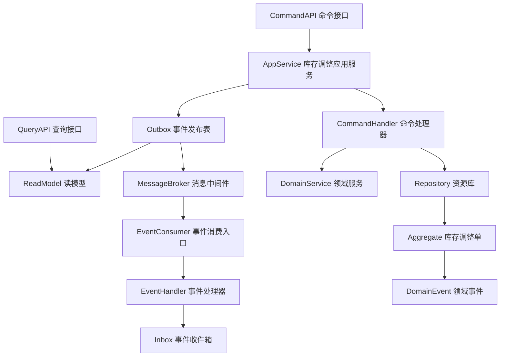
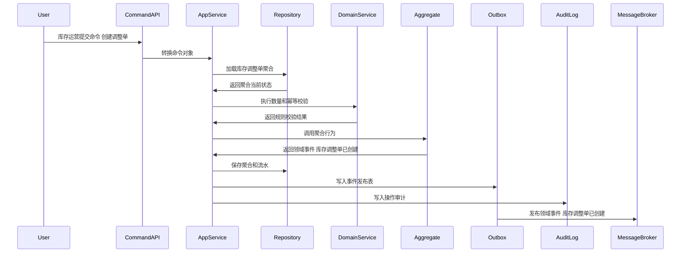
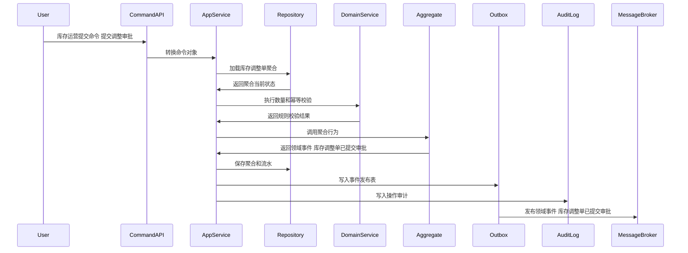
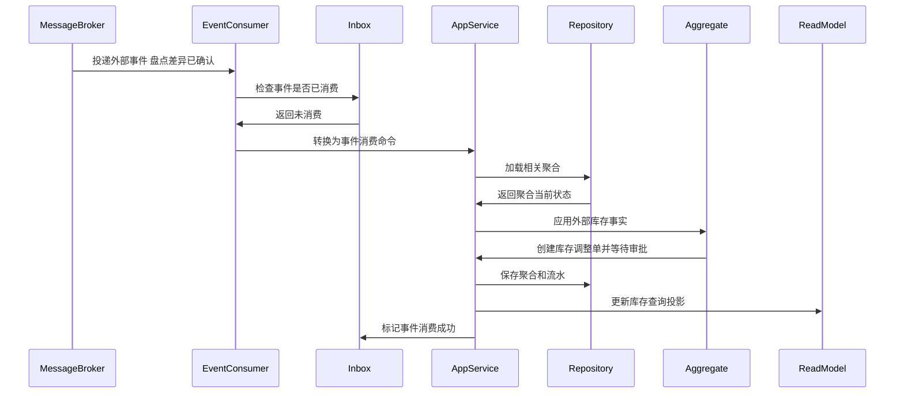
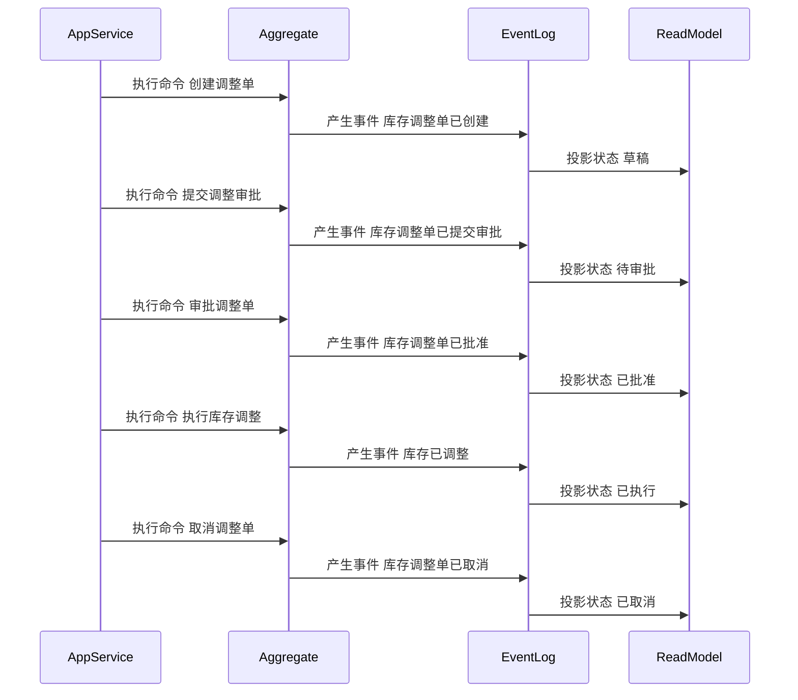

# 05-库存调整单聚合CQRS设计

> 所属上下文：中央库存领域。本文按 DDD + CQRS 深入到聚合属性、命令处理、应用服务编排、领域服务规则、事件产生和事件消费逻辑。关键时序图使用 Mermaid 最小兼容语法，便于 VSCode Markdown 预览稳定渲染。

## 1. 业务目标分析

对盘盈、盘亏、报废、红冲、纠错、运输丢失或运输破损等库存差异执行审批后调整，形成可追溯的调整流水。

| 设计项 | 结论 |
| --- | --- |
| 限界上下文 | 中央库存上下文 |
| 子域类型 | 核心域，库存纠错与审计 |
| 聚合根 | 库存调整单 |
| 数据主权 | 中央库存拥有 `库存调整单` 的数量口径、库存账本状态、库存流水、预占冻结调整结果和领域事件；TMS 运输异常只作为调整证据，不拥有库存调整权 |
| 主要使用角色 | 库存运营、仓库主管、财务审计、审批系统、TMS异常处理员 |
| 核心不变量 | 库存数量必须有来源；余额、预占、冻结、释放、扣减、调整和流水必须同事务或可补偿；命令和事件必须幂等 |

## 2. 角色、场景与流程分析

| 场景 | 发起角色 | 应用服务处理逻辑 | 领域服务 | 结果事件 |
| --- | --- | --- | --- | --- |
| 创建调整单 | 库存运营 | 围绕库存调整单执行创建调整单，校验库存维度、数量口径、来源单据、幂等键和权限 | 库存调整校验服务 | 库存调整单已创建 |
| 运输异常转调整 | 库存运营/财务审计 | 根据 TMS 丢失、破损、拒收异常和 WMS/业务确责结果创建调整单 | 运输异常调整校验服务 | 库存调整单已创建 |
| 提交调整审批 | 库存运营 | 围绕库存调整单执行提交调整审批，校验库存维度、数量口径、来源单据、幂等键和权限 | 库存调整校验服务 | 库存调整单已提交审批 |
| 审批调整单 | 库存运营 | 围绕库存调整单执行审批调整单，校验库存维度、数量口径、来源单据、幂等键和权限 | 库存调整校验服务 | 库存调整单已批准 |
| 执行库存调整 | 库存运营 | 围绕库存调整单执行执行库存调整，校验库存维度、数量口径、来源单据、幂等键和权限 | 库存调整校验服务 | 库存已调整 |
| 取消调整单 | 库存运营 | 围绕库存调整单执行取消调整单，校验库存维度、数量口径、来源单据、幂等键和权限 | 库存调整校验服务 | 库存调整单已取消 |

## 3. 领域边界与分层架构

中央库存领域事件的位置要明确区分三层含义：领域层产生库存账本事实，应用层保存聚合与事件发布表，基础设施层投递消息并消费外部库存事实。

## 4. 聚合属性设计

| 属性 | 业务含义 | 模型归属 | 是否可变 | 主要修改命令 | 变化规则 |
| --- | --- | --- | --- | --- | --- |
| 库存调整单Id | 库存调整单ID | 聚合根 | 否 | 创建调整单 | 全局唯一 |
| 库存调整单No | 库存调整单单号 | 值对象 | 否 | 创建调整单 | 按中央库存编码规则生成 |
| inventoryDimension | 库存维度 | 值对象 | 否 | 创建调整单 | 货主、仓库、SKU、批次、库存状态维度唯一 |
| status | 业务状态 | 值对象 | 是 | 状态推进命令 | 必须按状态机流转 |
| quantity | 数量对象 | 值对象 | 是 | 记账或调整命令 | 实物、可用、预占、冻结、调整数量不能无来源变化 |
| sourceRef | 来源引用 | 值对象 | 否 | 创建调整单 | 来源系统、来源单、来源行、幂等键 |
| transportExceptionRef | 运输异常引用 | 值对象 | 否 | 运输异常转调整 | 运单号、异常单号、异常类型、责任方、索赔单号、证明附件 |
| ledgerLineList | 库存流水 | 内部实体集合 | 是 | 所有记账命令 | 只追加，不物理修改历史流水 |
| operationLog | 操作记录 | 内部实体集合 | 是 | 所有写命令 | 记录操作者、原因、前后数量和事件编号 |

## 5. 命令与应用服务逻辑

应用服务负责编排用例：校验权限、检查幂等、加载聚合、调用领域服务、执行聚合行为、保存聚合和流水、写发布表、写审计日志。

| 命令 | 发起者 | 应用服务处理逻辑 | 参与领域服务 | 成功后领域事件 |
| --- | --- | --- | --- | --- |
| 创建调整单 | 库存运营 | 围绕库存调整单执行创建调整单，校验库存维度、数量口径、来源单据、幂等键和权限 | 库存调整校验服务 | 库存调整单已创建 |
| 运输异常转调整 | 库存运营/财务审计 | 校验 TMS 异常、WMS 确认、责任方、索赔依据和审批路径，创建待审批调整单 | 运输异常调整校验服务 | 库存调整单已创建 |
| 提交调整审批 | 库存运营 | 围绕库存调整单执行提交调整审批，校验库存维度、数量口径、来源单据、幂等键和权限 | 库存调整校验服务 | 库存调整单已提交审批 |
| 审批调整单 | 库存运营 | 围绕库存调整单执行审批调整单，校验库存维度、数量口径、来源单据、幂等键和权限 | 库存调整校验服务 | 库存调整单已批准 |
| 执行库存调整 | 库存运营 | 围绕库存调整单执行执行库存调整，校验库存维度、数量口径、来源单据、幂等键和权限 | 库存调整校验服务 | 库存已调整 |
| 取消调整单 | 库存运营 | 围绕库存调整单执行取消调整单，校验库存维度、数量口径、来源单据、幂等键和权限 | 库存调整校验服务 | 库存调整单已取消 |

### 5.1 应用服务通用处理模板

1. 接口层接收请求并转换为命令对象。
2. 应用层校验用户、角色、组织、货主、仓库、操作类型和数据权限。
3. 使用 `来源系统 + 来源单号 + 来源行号 + 命令类型 + 幂等键` 做幂等检查。
4. 通过资源库加载 `库存调整单` 聚合根，新建场景先校验库存维度和业务唯一性。
5. 调用领域服务完成数量、可用、冻结、预占、审批、来源事实的规则判断。
6. 聚合根执行行为，修改数量对象、内部实体和值对象，并产生领域事件。
7. 同一事务保存聚合、库存流水、事件发布表和操作审计。
8. 事件发布器异步投递事件，读模型投影器更新库存查询模型。

### 5.2 关键命令处理细节

| 关键命令 | 前置校验 | 聚合行为 | 异常或补偿处理 |
| --- | --- | --- | --- |
| 创建调整单 | 库存调整单状态允许执行，库存维度、数量、来源单据、幂等键和权限有效 | 修改库存调整单数量或状态并追加流水，产生事件 库存调整单已创建 | 状态不匹配则拒绝；数量不足则失败；重复事件按幂等返回原结果 |
| 运输异常转调整 | TMS 异常已登记，WMS 或业务系统已确认损失数量，审批路径有效 | 创建调整单并关联运单、异常单和责任方，等待审批 | 只有 TMS 异常但未确责时不能调整；重复异常按幂等关联原调整单 |
| 提交调整审批 | 库存调整单状态允许执行，库存维度、数量、来源单据、幂等键和权限有效 | 修改库存调整单数量或状态并追加流水，产生事件 库存调整单已提交审批 | 状态不匹配则拒绝；数量不足则失败；重复事件按幂等返回原结果 |
| 审批调整单 | 库存调整单状态允许执行，库存维度、数量、来源单据、幂等键和权限有效 | 修改库存调整单数量或状态并追加流水，产生事件 库存调整单已批准 | 状态不匹配则拒绝；数量不足则失败；重复事件按幂等返回原结果 |

## 6. 领域服务逻辑

| 领域服务 | 核心逻辑 |
| --- | --- |
| 库存调整校验服务 | 围绕库存调整单的库存维度、数量不变量、可用口径、来源幂等和审批权限进行业务判定。 |
| 负库存防护服务 | 围绕库存调整单的库存维度、数量不变量、可用口径、来源幂等和审批权限进行业务判定。 |
| 红冲来源校验服务 | 围绕库存调整单的库存维度、数量不变量、可用口径、来源幂等和审批权限进行业务判定。 |
| 运输异常调整校验服务 | 校验 TMS 异常类型、损失数量、WMS/业务确责、责任方和索赔单据，确保运输异常不能绕过审批直接改库存。 |

## 7. 事件产生逻辑

| 领域事件 | 触发命令 | 关键载荷 | 主要消费者 |
| --- | --- | --- | --- |
| 库存调整单已创建 | 创建调整单 | 库存调整单ID、库存维度、来源单、变化数量、变化前后数量、流水批次 | OMS、WMS、采购、调拨、BMS、读模型、审计日志 |
| 库存调整单已提交审批 | 提交调整审批 | 库存调整单ID、库存维度、来源单、变化数量、变化前后数量、流水批次 | OMS、WMS、采购、调拨、BMS、读模型、审计日志 |
| 库存调整单已批准 | 审批调整单 | 库存调整单ID、库存维度、来源单、变化数量、变化前后数量、流水批次 | OMS、WMS、采购、调拨、BMS、读模型、审计日志 |
| 库存已调整 | 执行库存调整 | 库存调整单ID、库存维度、来源单、变化数量、变化前后数量、流水批次 | OMS、WMS、采购、调拨、BMS、读模型、审计日志 |
| 库存调整单已取消 | 取消调整单 | 库存调整单ID、库存维度、来源单、变化数量、变化前后数量、流水批次 | OMS、WMS、采购、调拨、BMS、读模型、审计日志 |

### 7.1 事件生成规则

- 领域事件使用过去式命名，只表达已经发生的库存账本事实。
- 聚合根在业务行为成功后产生领域事件；应用服务负责收集、持久化和发布。
- 事件载荷必须包含事件编号、事件版本、发生时间、来源上下文、货主、仓库、SKU、批次、库存状态、聚合ID、聚合版本、数量变化和幂等键。
- 命令幂等命中时，返回原处理结果，不能重复改变余额、预占、冻结或流水。
- 外部事件消费必须先进入事件收件箱，再由应用服务加载聚合并执行本地记账行为。

## 8. 事件订阅与消费逻辑

| 订阅事件 | 处理应用服务 | 消费后数据变化 | 幂等键 |
| --- | --- | --- | --- |
| 盘点差异已确认 | 外部事件消费服务 | 创建库存调整单并等待审批 | 来源上下文+事件编号+业务主键 |
| TMS物流异常已登记 | 运输异常调整线索处理器 | 记录运输丢失、破损、拒收线索，等待 WMS/业务确责后生成调整单 | TMS上下文+事件编号+exceptionNo |
| SKU已启用 | 主数据事件消费服务 | 初始化或刷新SKU库存维度 | 主数据上下文+事件编号+skuId |
| 仓库已启用 | 主数据事件消费服务 | 初始化或刷新仓库库存维度 | 主数据上下文+事件编号+warehouseId |
| 审批已通过 | 审批事件消费服务 | 推进冻结、调整或对账处理 | 审批上下文+事件编号+approvalId |

## 9. 关键时序图

### 9.1 命令处理、聚合变更与事件发布

### 9.2 典型业务命令一

### 9.3 典型业务命令二

### 9.4 事件订阅、幂等消费与本地状态变化

### 9.5 聚合状态推进时序

## 10. 不变量、异常补偿、权限与审计

| 类型 | 规则 |
| --- | --- |
| 聚合不变量 | `库存调整单` 的数量、状态和内部实体只能通过聚合根行为推进 |
| 数量不变量 | 实物、可用、预占、冻结、释放、扣减、调整不能出现无来源变化；可用不能被预占到负数 |
| 流水不变量 | 库存流水只追加，错误通过红冲、反向流水或调整单处理，不能物理修改历史 |
| TMS边界 | TMS 丢失、破损、拒收只提供调整线索；库存调整必须经过 WMS/业务确责、审批和调整命令 |
| 幂等 | 命令和事件消费都必须有幂等键，重复请求不能重复改变库存数量 |
| 并发 | 库存账户和预占扣减必须使用版本号或行级锁，防止并发超卖、重复扣减、重复入库 |
| 补偿 | 发布失败走事件发布表重试，消费失败走收件箱重试，业务差异进入对账或调整流程 |
| 权限 | 按角色、组织、货主、仓库、操作类型、金额或数量阈值控制命令可执行性 |
| 审计 | 所有写命令记录操作者、来源、幂等键、前后数量、流水批次、事件编号和失败原因 |

## 11. 读模型设计

读模型服务于查询、库存可用、单据轨迹、快照和对账，不参与聚合不变量保护。写入决策必须回到应用服务、聚合根和领域服务。

| 读模型 | 使用场景 | 主要字段 |
| --- | --- | --- |
| 库存调整单列表读模型 | 查询、分页、筛选 | 单号、库存维度、状态、数量、来源单、更新时间 |
| 库存调整单详情读模型 | 详情页展示 | 单头、明细、流水、事件历史、操作日志、运单号、异常单号、责任方、索赔单号 |
| 库存余额读模型 | 库存余额和可用查询 | 货主、仓库、SKU、批次、实物、可用、预占、冻结 |
| 单据库存轨迹读模型 | 按来源单追溯库存变化 | 命令、事件、流水、预占、释放、扣减、调整 |

## 12. 设计结论与待确认问题

### 12.1 设计结论

- `库存调整单` 是中央库存领域内独立保护库存数量规则和状态流转的聚合根。
- 中央库存拥有统一库存数量账本和流水；WMS 拥有仓内实物事实；TMS 拥有运输异常事实；OMS、采购、调拨拥有业务意图。
- 运输丢失、破损、拒收不能由 TMS 事件直接改库存，必须沉淀为调整线索，并通过审批后的库存调整单落账。
- 命令处理属于应用层编排，核心数量规则属于聚合根和领域服务。

### 12.2 待确认问题

| 问题 | 默认建议 |
| --- | --- |
| 是否多货主、多仓、多批次、多库存状态 | 默认保留货主、仓库、SKU、批次、库存状态维度 |
| 是否允许负库存 | 默认不允许，特殊场景必须配置白名单并强审计 |
| 是否需要事件溯源 | 当前阶段建议当前状态表 + 库存流水表 + 事件日志，不做全量事件溯源 |
