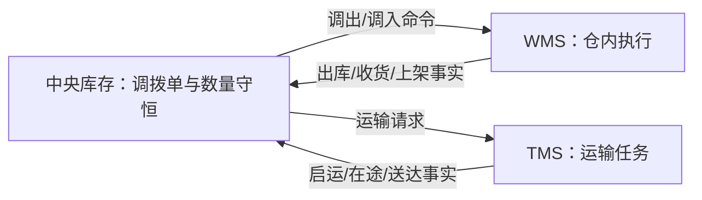
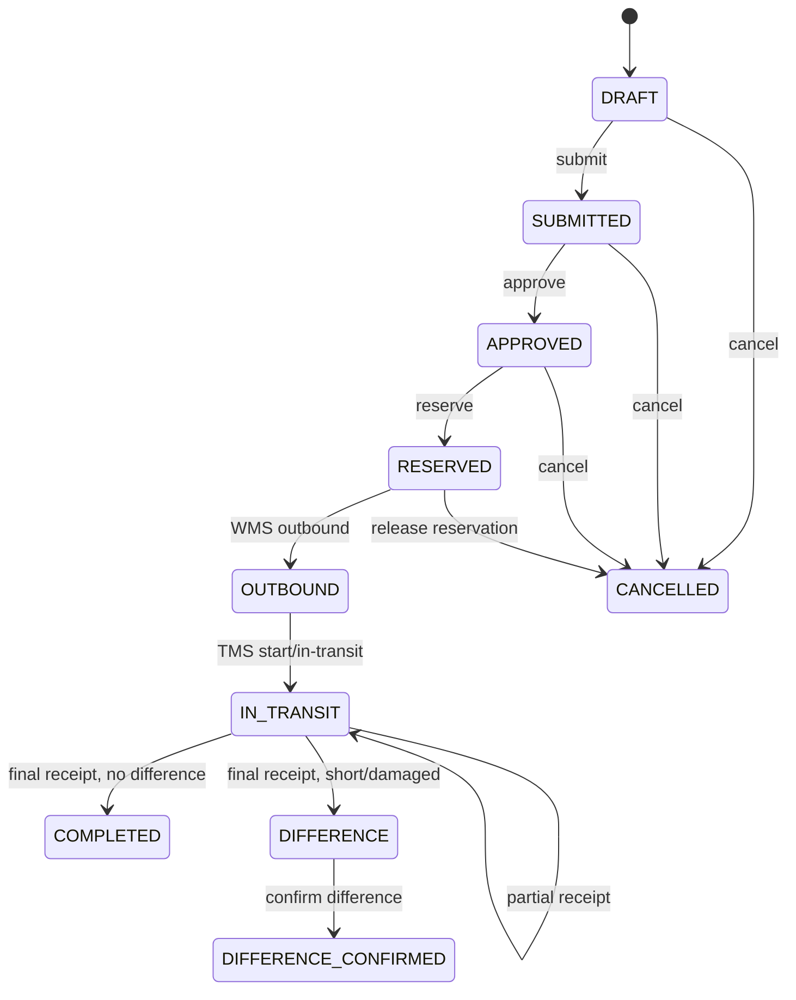

# 08-调拨单聚合 CQRS 设计

> 本文是 `DOC-REQ-002`、`TRF-REQ-001~003` 和 `INV-API-006` 的中央库存领域事实源。调拨单决定调拨生命周期和数量守恒；WMS 拥有仓内执行事实，TMS 拥有运输事实。

## 1. 领域驱动设计对齐说明

| 领域驱动设计项 | 对齐口径 |
| --- | --- |
| 限界上下文 | 中央库存 |
| 子域类型 | 核心域：库存数量账本与调拨守恒 |
| 聚合根 | `StockTransferAggregate`（调拨单） |
| 内部实体和值对象 | 首切片一个聚合对应一个 `SKU + 批次`；仓库引用、数量、来源事件引用、差异结论为值对象 |
| 数据主权 | 中央库存拥有调拨状态、申请/预占/出库/在途待处理/入库/差异数量；WMS 拥有仓内执行事实；TMS 拥有运输事实 |
| 命令 | 创建、提交、审批、预占、记录出库、标记在途、记录入库、确认差异、取消 |
| 生产事件 | `TransferCreated/Submitted/Approved/StockReserved/OutboundCompleted/InTransit/PartiallyReceived/Completed/DifferenceRaised/DifferenceConfirmed/Cancelled` |
| 消费事件 | WMS `TransferOutboundCompleted/TransferReceived/TransferCancellationCompensated`，TMS `TransferInTransit/TransferDelivered` |
| 查询模型 | 调拨列表、详情、进度、在途、差异待办、双仓可见调拨 |
| 幂等与补偿 | 创建用请求幂等键；外部事实用 `sourceSystem + eventId`；未出库取消释放预占，出库后只允许退回、差异或异常关闭 |

## 2. 业务目标与边界

调拨聚合解决“源仓减少、运输在途、目标仓增加”异步执行时每一单位库存的位置可解释。中央库存只根据 WMS 实物事实记账；TMS 到达或签收不能直接增加目标仓库存，目标仓必须完成 WMS 收货、质检和上架后才增加相应质量状态库存。

## 3. 聚合属性与可变性

| 属性 | 类型/含义 | 来源与可变规则 |
| --- | --- | --- |
| `transferNo` | 调拨业务编号 | 创建时生成，终身不可变 |
| `ownerId` | 货主 | 创建命令，终身不可变 |
| `sourceWarehouseId/targetWarehouseId` | 调出/调入仓 | 创建命令；必须不同，提交后不可变 |
| `sku/batchNo` | 商品和批次 | 创建命令；首切片单 SKU+批次，提交后不可变 |
| `requestedQty` | 申请量 | 创建命令；必须大于零，提交后不可变 |
| `reservedQty` | 已预占量 | 预占成功后改变；取消释放后归零 |
| `outboundQty` | 源仓实际出库量 | 仅 WMS 出库事实改变 |
| `receivedQty` | 目标仓已完成入库记账量 | 仅 WMS 最终收货/上架事实累计改变 |
| `differenceQty` | 最终确认差异量 | 最终收货产生候选差异，确认命令锁定 |
| `status/version` | 生命周期/乐观锁版本 | 只能由聚合行为推进 |

`inTransitPendingQty` 是可推导量，不由 TMS 回调覆盖：`outboundQty - receivedQty - confirmedDifferenceQty`。

## 4. 数量不变量

1. 所有数量非负，`requestedQty >= reservedQty >= outboundQty`。
2. 出库前 `receivedQty = 0` 且 `differenceQty = 0`。
3. 未完成阶段满足 `outboundQty >= receivedQty + confirmedDifferenceQty`。
4. 完成或差异确认终态满足 `outboundQty = receivedQty + confirmedDifferenceQty`。
5. TMS 在途事实只推进运输阶段，不改变库存账户、入库量或差异量。
6. 目标仓可用量只能由 WMS 上架/处置事实驱动；运输送达、到仓登记和普通收货扫描均不能提前增加可用量。
7. 同一 WMS 事件只累计一次；累计入库超过出库时拒绝并进入事件失败待办，禁止用负差异冲平。

## 5. 状态机

`COMPLETED`、`DIFFERENCE_CONFIRMED`、`CANCELLED` 为终态。`OUTBOUND` 后禁止直接取消；送错仓、拒收、破损或丢失通过退回、差异确认和库存调整补偿。乱序收到收货事实时 Inbox 保持待重放/失败，不跨级推进。

## 6. 命令、事件与应用编排

| 命令/外部事实 | 前置条件与聚合行为 | 产生事件 | 幂等键 |
| --- | --- | --- | --- |
| `CreateTransfer` | 双仓不同、数量大于零、货主/SKU有效 | `TransferCreated` | `Idempotency-Key` |
| `SubmitTransfer` | `DRAFT -> SUBMITTED` | `TransferSubmitted` | `transferNo:submit:version` |
| `ApproveTransfer` | 审批策略通过 | `TransferApproved` | `transferNo:approve:version` |
| `ReserveTransferStock` | 仅 APPROVED；记录预占号 | `TransferStockReserved` | `transferNo:reserve` |
| WMS `TransferOutboundCompleted` | 数量不超预占；源仓扣减与预占关闭同事务 | `TransferOutboundCompleted` | `WMS:eventId` |
| TMS `TransferInTransit` | 已出库；只推进运输阶段 | `TransferInTransit` | `TMS:eventId` |
| WMS `TransferReceived` | 累计入库不超出库；最终收货计算差异 | `TransferPartiallyReceived/Completed/DifferenceRaised` | `WMS:eventId` |
| `ConfirmTransferDifference` | 仅 DIFFERENCE；记录原因、责任方和证据 | `TransferDifferenceConfirmed` | `transferNo:difference:version` |
| `CancelTransfer` | 仅出库前；已预占先释放 | `TransferCancelled` | `transferNo:cancel:version` |

应用服务负责双仓权限、Inbox/Outbox、事务和资源库；调拨聚合负责状态与数量；库存账户聚合负责余额和流水。跨聚合记账由同一用例编排，不把账户字段塞入调拨聚合。

## 7. 权限、审计与查询模型

- 查询按源仓或目标仓并集可见；审批、预占、取消、差异确认按双仓交集授权，并校验货主范围。
- 内部入口校验应用身份、声明来源和事件信封来源一致。
- 审计记录命令幂等键、事件号、操作人、双仓、前后状态、数量快照、差异原因/责任方和版本。
- 读模型包括调拨列表/详情/进度、在途、差异待办和事件失败待办。

## 8. 测试与实现差异门禁

必须覆盖同仓拒绝、越级状态、并发审批/取消、预占失败、取消释放、重复/乱序事实、部分收货、短收、破损、多收拒绝、终态守恒、TMS 事实不记账、上架前可用量不增加和双仓权限。

当前实现已有聚合、应用服务、事件入口和基础测试；`INV-NEXT-002` 仍需核验在途待处理量推导、乱序待重放、多收拒绝、差异责任证据、双仓写权限和上架前不增加可用量。
