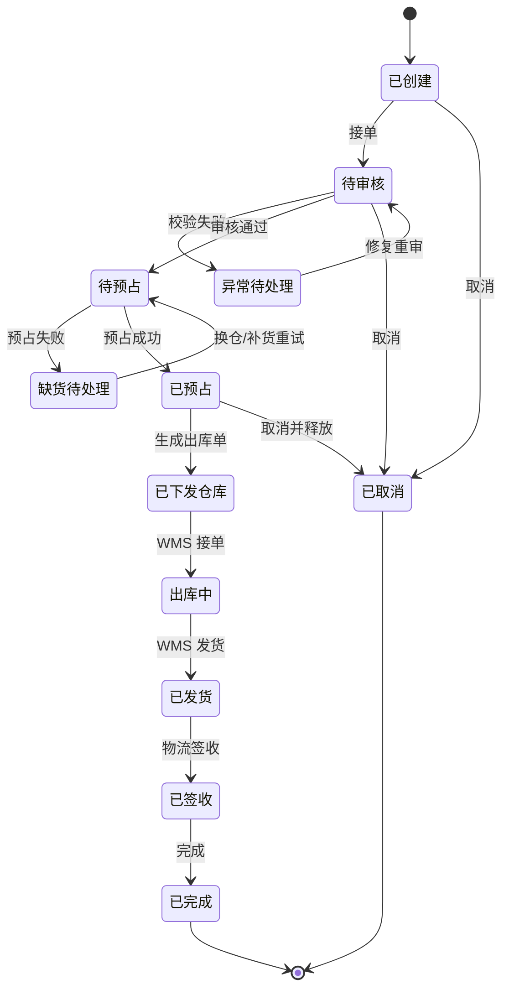
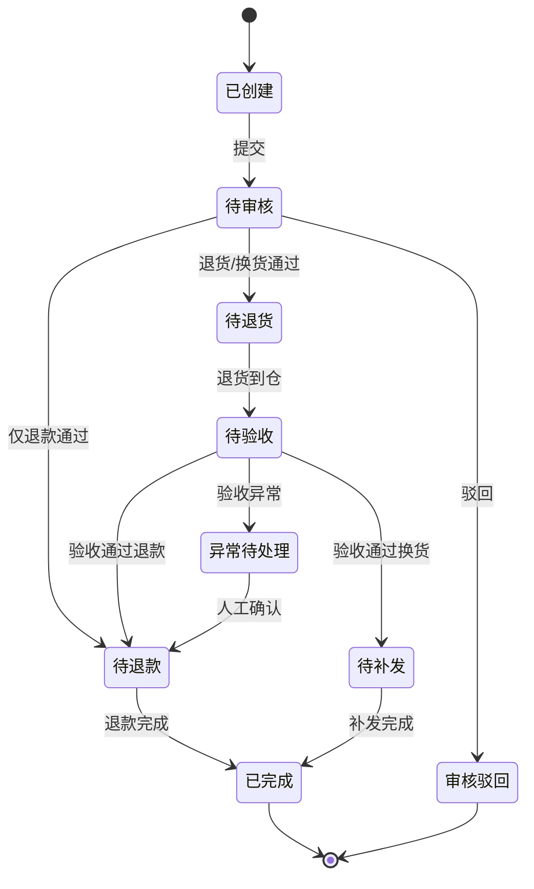

# 01 OMS 领域模型

> 本文用于 OMS 领域模型设计，承接 [OMS 系统功能设计](../../05-子系统设计/OMS系统/32-OMS系统功能设计.md)、[OMS 系统详细设计](../../05-子系统设计/OMS系统/42-OMS系统详细设计.md)、[销售出库业务流程](../../02-业务流程/03-2-销售出库业务流程.md)、[售后退货业务流程](../../02-业务流程/07-1-售后退货业务流程.md)、[中央库存领域模型](../04-中央库存领域模型/01-中央库存领域模型.md)、[WMS 领域模型](../03-WMS领域模型/01-WMS领域模型.md) 和 [核心聚合与不变量总表](../00-领域模型总览/00-核心聚合与不变量总表.md)。本文不只覆盖出库单或售后单，而是覆盖 OMS 从订单接入、审单、分仓履约、库存预占、出库指令、取消拦截、发货签收到售后退款/退货/换货补发的完整订单履约生命周期。

## 1. 事件风暴

### 1.1 业务目标

OMS 解决的是：企业如何把渠道订单变成可履约的内部订单，编排库存、仓库、物流、售后和退款协作，并持续维护客户订单状态。

完整 OMS 生命周期：

```text
渠道订单接入
  -> 订单幂等和映射
  -> 商品/客户/地址/价格/风控审单
  -> 分仓、拆单、生成履约单
  -> 请求中央库存预占
  -> 生成并下发 WMS 出库指令
  -> 跟踪 WMS 接单、拣货、发货
  -> 物流签收和订单完成
  -> 取消、拦截、缺货、异常处理
  -> 售后仅退款、退货退款、换货补发
```

OMS 的核心不是仓内作业，也不是库存账本，而是“订单履约编排”。OMS 负责决定订单能不能履约、从哪里履约、履约到哪一步、逆向怎么处理。

### 1.2 事件风暴总表

| 阶段 | 角色/系统 | 命令/事件 | 处理对象 | 领域事件 | 策略/后续动作 | 读模型 | 异常 |
| --- | --- | --- | --- | --- | --- | --- | --- |
| 订单接入 | 渠道/API/客服 | 接收订单 | 销售订单 | 销售订单已创建 | 幂等去重，进入审单 | 渠道接入页 | 重复订单、字段缺失 |
| 审单 | 订单运营/系统 | 审核订单 | 销售订单、审单结果 | 订单已审核 / 订单已拦截 | 通过后分仓 | 审单页 | 地址不可达、风控、价格异常 |
| 分仓履约 | 系统/运营 | 分仓、拆单、合单 | 履约单 | 履约单已创建 | 请求库存预占 | 分仓履约页 | 无可发仓、拆单失败 |
| 库存预占 | OMS/中央库存 | 请求预占 | 预占引用 | 库存预占已请求 / 库存已预占 / 预占失败 | 成功后生成出库单 | 预占页 | 缺货、重复预占 |
| 出库指令 | OMS | 创建并下发出库单 | 出库单 | 出库单已创建 / 已下发 WMS | WMS 接单作业 | 出库单页 | WMS 拒单、重复下发 |
| 仓库执行 | WMS | 接单、发货事件 | 出库进度 | WMS 已接单 / 订单已发货 | 更新订单和履约状态 | 履约监控 | 短拣、复核差异 |
| 签收完成 | TMS/WMS | 签收事件 | 销售订单 | 订单已签收 / 订单已完成 | 完成履约 | 订单详情 | 物流异常 |
| 取消 | 客户/客服/渠道 | 发起取消 | 取消申请 | 取消申请已创建 / 订单已取消 | 未发货释放库存，已发货转售后 | 取消管理页 | WMS 取消失败、已发货 |
| 售后申请 | 客户/客服 | 创建售后 | 售后单 | 售后单已创建 | 进入审核 | 售后管理页 | 超售后期、商品不可退 |
| 售后审核 | 客服/财务/系统 | 审核售后 | 售后单 | 售后已审核 / 售后已驳回 | 仅退款、退货、补发 | 售后待办 | 金额异常、责任争议 |
| 退货验收 | WMS | 退货验收完成 | 售后单 | 退货已验收 | 退款或补发 | 售后跟踪 | 少件、损坏、错货 |
| 退款/补发 | BMS/OMS | 退款完成、补发请求 | 售后单、履约单 | 退款已完成 / 补发已创建 | 售后完成 | 售后详情 | 退款失败、补发缺货 |

### 1.3 通用语言

| 术语 | 定义 |
| --- | --- |
| 销售订单 | OMS 内部承载客户购买意图的订单 |
| 渠道订单 | 外部平台或渠道传入的原始订单 |
| 审单 | 对商品、客户、地址、价格、风控、信用等履约条件进行校验 |
| 履约单 | OMS 依据仓库、物流和库存策略拆分出的履约执行单元 |
| 出库单 | OMS 下发给 WMS 的仓库出库指令 |
| 取消申请 | 客户、渠道或客服在发货前终止订单履约的请求 |
| 售后单 | 发货后或履约异常后的退款、退货退款、换货补发处理单 |
| 补发 | 售后或异常处理中重新发出商品的履约动作 |

## 2. 子域、限界上下文、上下文映射、核心域

### 2.1 子域划分

| 子域 | 类型 | 说明 | 建模策略 |
| --- | --- | --- | --- |
| 订单接入与审单 | 核心域 | 统一渠道订单，判断是否可履约 | 深入建模销售订单、审单结果、异常 |
| 分仓履约 | 核心域 | 决定从哪个仓、如何拆单、承诺时效 | 深入建模履约单和履约策略 |
| 出库指令 | 核心域 | 驱动 WMS 出库并追踪仓库执行结果 | 深入建模出库单和出库行 |
| 取消与拦截 | 核心域 | 发货前取消、释放库存、取消 WMS 作业 | 深入建模取消申请 |
| 售后逆向 | 核心域 | 仅退款、退货退款、换货补发 | 深入建模售后单 |
| 中央库存/WMS/BMS | 支撑域 | 分别负责库存账本、仓内事实、退款结算 | 通过命令和事件协作 |
| 主数据、权限、物流 | 通用/支撑域 | 提供客户、SKU、仓库、承运商和权限 | OMS 消费其发布语言 |

### 2.2 限界上下文模板

```markdown
上下文名称：OMS 上下文
子域类型：核心域
业务目标：管理销售订单从接入、审单、履约、出库、签收到取消和售后的完整生命周期。
负责范围：渠道订单映射、销售订单、审单、分仓、履约单、库存预占引用、出库单、取消申请、售后单、补发履约、订单异常。
不负责范围：不维护中央库存余额；不执行仓内拣货/包装/发货；不承运物流；不做财务入账；不维护商品/客户/仓库主数据权威。
核心角色：客服、订单运营、渠道运营、仓配运营、财务/风控、系统管理员。
核心聚合：销售订单、履约单、出库单、取消申请、售后单、OMS 规则配置。
数据主权：订单状态、履约编排、出库指令、取消和售后入口。
生产事件：销售订单已创建、订单已审核、履约单已创建、库存预占已请求、出库单已创建、订单已取消、售后单已创建、补发已请求。
消费事件：SKU已启用、客户已启用、仓库已启用、库存已预占、预占失败、WMS已接单、WMS已发货、退货验收已完成、退款已完成。
一致性要求：订单聚合内部强一致；与库存、WMS、BMS、物流最终一致；出库和售后事件消费必须幂等。
异常补偿：缺货、取消失败、WMS 拒单、短拣、已发货取消、退款失败、补发缺货。
```

### 2.3 上下文映射

| 上游上下文 | 下游上下文 | 映射关系 | 协作方式 |
| --- | --- | --- | --- |
| 主数据 | OMS | 遵奉者 | OMS 消费 SKU、客户、仓库、物流商事件并保存订单快照 |
| OMS | 中央库存 | 客户/供应商关系 | OMS 请求预占和释放，库存发布结果 |
| OMS | WMS | 客户/供应商关系 | OMS 下发出库单和取消请求，WMS 回传作业事实 |
| WMS | OMS | 发布语言 | 接单、发货、退货验收事件更新订单和售后状态 |
| OMS | BMS | 发布语言 | 售后退款请求、订单费用依据进入 BMS |
| BMS | OMS | 发布语言 | 退款完成事件更新售后状态 |
| 权限系统 | OMS | 遵奉者 | 控制客服、运营、财务、管理员能操作的订单范围 |

## 3. 实体、值对象、聚合

| 聚合 | 聚合根 | 内部实体 | 值对象 | 主要不变量 |
| --- | --- | --- | --- | --- |
| 销售订单 | SalesOrder | 订单行、审单结果、渠道映射 | 客户快照、地址、金额、渠道单号 | 渠道订单幂等；已发货不能普通取消 |
| 履约单 | FulfillmentOrder | 履约行、预占引用 | 仓库、物流产品、承诺时效 | 同一有效履约单只能生成一个有效出库指令 |
| 出库单 | OutboundOrder | 出库行、WMS 状态快照 | WMS 单号、发货数量 | 未预占不能下发；已发货不能取消 |
| 取消申请 | CancelRequest | 取消行、处理记录 | 取消原因、WMS 取消状态、库存释放状态 | 已发货取消必须转售后 |
| 售后单 | AfterSaleOrder | 售后行、验收结果、退款/补发记录 | 售后类型、退款金额、退货仓 | 售后数量不能超过可售后数量 |
| OMS 规则 | OmsRuleConfig | 规则条件、规则动作 | 审单规则、分仓规则、取消规则 | 已发布规则变更要版本化 |

## 4. 聚合根、领域服务、资源库、领域事件

### 4.1 聚合模板

```markdown
聚合名称：销售订单
聚合根：SalesOrder
业务目标：承载客户订单并维护订单主状态。
主要命令：接收订单、审核订单、标记异常、取消订单、确认发货、确认签收、完成订单
主要事件：销售订单已创建、订单已审核、订单已发货、订单已签收、订单已完成、订单已取消
核心不变量：渠道订单幂等；订单金额和商品快照不可被主数据直接覆盖；已发货不可普通取消。
资源库：SalesOrderRepository
```

```markdown
聚合名称：售后单
聚合根：AfterSaleOrder
业务目标：处理仅退款、退货退款、换货补发等逆向权益。
主要命令：创建售后、审核售后、确认退货验收、发起退款、创建补发、关闭售后
主要事件：售后单已创建、售后已审核、退货已验收、退款已请求、补发已请求、售后已完成
核心不变量：售后数量不能超过可售后数量；未审核不能退款或补发；退货验收结果决定库存和退款路径。
资源库：AfterSaleOrderRepository
```

### 4.2 领域服务

| 领域服务 | 解决的问题 |
| --- | --- |
| 订单审单服务 | 商品、客户、地址、价格、风控、信用校验 |
| 分仓履约服务 | 根据仓库范围、库存、物流时效、拆单策略生成履约单 |
| 订单状态汇总服务 | 从订单行、履约单、出库单、售后结果汇总单头状态 |
| 取消可行性判断服务 | 判断是否可取消、需 WMS 拦截还是转售后 |
| 售后权益校验服务 | 校验售后期限、商品、数量、退款金额和责任规则 |

### 4.3 资源库

| 资源库 | 聚合根 | 主要能力 |
| --- | --- | --- |
| `SalesOrderRepository` | 销售订单 | 按渠道单幂等加载、保存订单状态 |
| `FulfillmentOrderRepository` | 履约单 | 保存分仓履约和预占引用 |
| `OutboundOrderRepository` | 出库单 | 保存出库指令和 WMS 状态 |
| `CancelRequestRepository` | 取消申请 | 保存取消处理状态 |
| `AfterSaleOrderRepository` | 售后单 | 保存售后审核、退货、退款、补发结果 |
| `OmsRuleRepository` | OMS 规则 | 加载审单、分仓、取消、售后规则 |

### 4.4 领域事件

| 事件 | 所属聚合 | 关键载荷 | 下游 |
| --- | --- | --- | --- |
| `SalesOrderCreated` | 销售订单 | 订单号、渠道、客户、订单行 | OMS、报表 |
| `SalesOrderApproved` | 销售订单 | 订单号、审单结果 | 分仓履约 |
| `StockReservationRequested` | 履约单 | 履约单、仓库、SKU、数量 | 中央库存 |
| `OutboundOrderCreated` | 出库单 | 出库单、仓库、SKU、数量 | WMS |
| `SalesOrderCancelled` | 销售订单 | 订单号、取消原因、释放结果 | 库存、BMS |
| `AfterSaleCreated` | 售后单 | 售后单、订单、类型、退款金额 | WMS、BMS |
| `ReshipmentRequested` | 售后单 | 补发履约单、SKU、数量 | OMS、库存、WMS |

## 5. 状态机模板

### 5.1 销售订单状态机



### 5.2 售后单状态机



## 6. 领域字段归属

| 聚合 | 核心字段 |
| --- | --- |
| 销售订单 | 订单号、渠道、外部单号、客户快照、支付状态、审单状态、订单状态、履约状态、金额、收货地址 |
| 销售订单行 | SKU 快照、下单数量、预占数量、出库数量、发货数量、退货数量、行状态 |
| 履约单 | 履约单号、发货仓、物流商、承诺发货/送达时间、履约状态、拆单原因 |
| 库存预占引用 | 预占号、仓库、SKU、请求数量、成功数量、状态、失败原因、幂等号 |
| 出库单 | 出库单号、销售订单、履约单、仓库、WMS 单号、出库类型、状态、下发时间、发货时间 |
| 取消申请 | 取消单号、订单号、取消来源、原因、取消状态、WMS 取消状态、库存释放状态 |
| 售后单 | 售后单号、订单号、售后类型、原因、退款金额、退货仓、售后状态 |

## 7. 应用服务与读模型

| 应用服务 | 编排用例 |
| --- | --- |
| 订单接入应用服务 | 渠道订单幂等、创建销售订单、发布事件 |
| 审单应用服务 | 执行审单规则，生成审单结果和异常 |
| 履约应用服务 | 分仓拆单、请求库存预占、生成履约单 |
| 出库应用服务 | 创建出库单、下发 WMS、处理 WMS 回传 |
| 取消应用服务 | 校验可取消、请求 WMS 取消、释放库存 |
| 售后应用服务 | 创建、审核、退款、退货验收、补发 |

| 读模型 | 用途 |
| --- | --- |
| OMS 工作台 | 待审、缺货、待下发、异常、售后待办 |
| 销售订单列表 | 查询订单主状态 |
| 履约链路追踪 | 串起订单、履约、预占、出库、发货 |
| 售后管理页 | 查询售后审核、退货、退款、补发状态 |
| 异常处理页 | 处理缺货、地址、风控、仓库拒单等 |

## 8. 关键不变量与补偿

| 场景 | 不变量 | 补偿 |
| --- | --- | --- |
| 订单接入 | 渠道订单必须幂等 | 重复订单忽略或合并 |
| 审单 | 未通过审单不能履约 | 修复后重审或关闭 |
| 预占 | 未预占成功不能下发出库 | 换仓、拆单、等待补货 |
| 出库 | 同一有效履约单只能有一个有效出库单 | 重复下发幂等忽略 |
| 取消 | 已发货不能普通取消 | 转售后 |
| 售后 | 售后数量不能超过可售后数量 | 驳回或人工审批 |
| 退款/补发 | 未审核售后不能退款或补发 | 阻断并记录异常 |

## 9. 当前结论

OMS 不能只建模出库单或售后单。出库和售后分别是正向履约与逆向履约的一部分。完整 OMS 领域应围绕 `订单接入`、`审单`、`分仓履约`、`库存预占`、`出库指令`、`取消拦截`、`发货签收` 和 `售后逆向` 建模。

## 10. 继续上下文

当前结论：本文是完整“OMS 领域模型”，覆盖销售订单、履约单、出库单、取消申请、售后单、补发、异常处理和规则配置。

关键假设：OMS 拥有订单和履约编排状态；中央库存拥有库存数量账本；WMS 拥有仓内实物事实；BMS/财务拥有退款、发票和入账事实。

待决问题：预售、组合品、多渠道拆单、部分发货和换仓补发策略可在后续细化。

下一步：继续按同一模板落 BMS、主数据和权限领域模型。

## 聚合审计补充

本轮已按聚合/聚合根补充 CQRS 落地文档，覆盖命令、应用服务、领域服务、读模型、生产事件和订阅事件：

- [销售订单聚合 CQRS 设计](./02-销售订单聚合CQRS设计.md)
- [履约单聚合 CQRS 设计](./03-履约单聚合CQRS设计.md)
- [出库单聚合 CQRS 设计](./04-出库单聚合CQRS设计.md)
- [取消申请聚合 CQRS 设计](./05-取消申请聚合CQRS设计.md)
- [售后单聚合 CQRS 设计](./06-售后单聚合CQRS设计.md)
- [OMS规则配置聚合 CQRS 设计](./07-OMS规则配置聚合CQRS设计.md)
