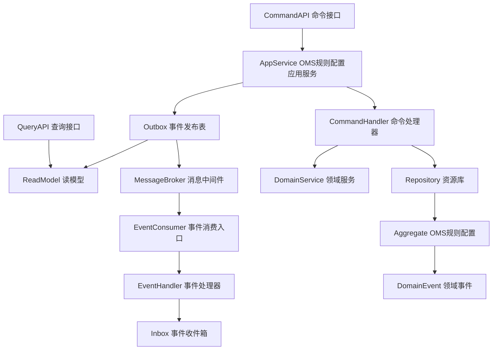
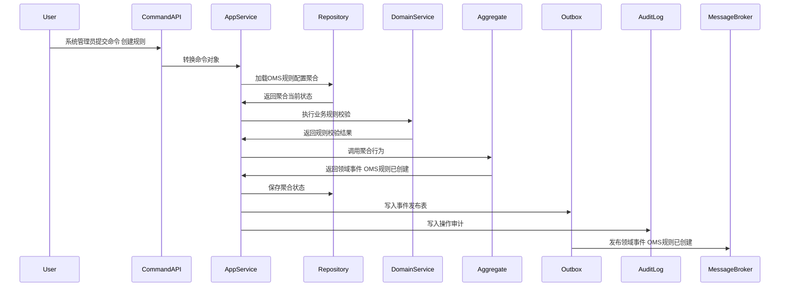
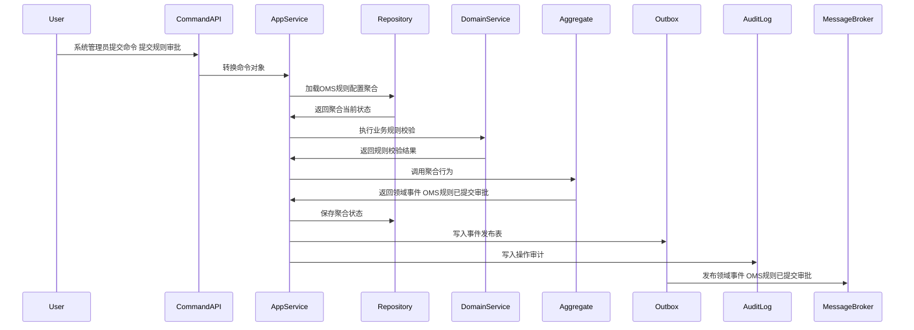
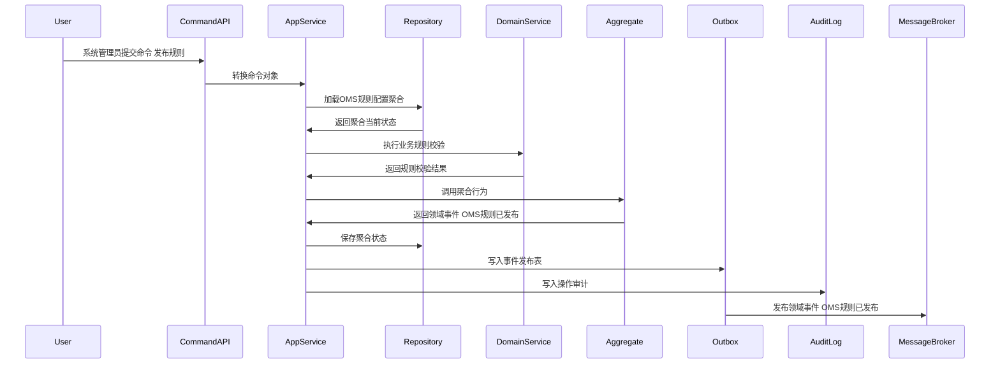
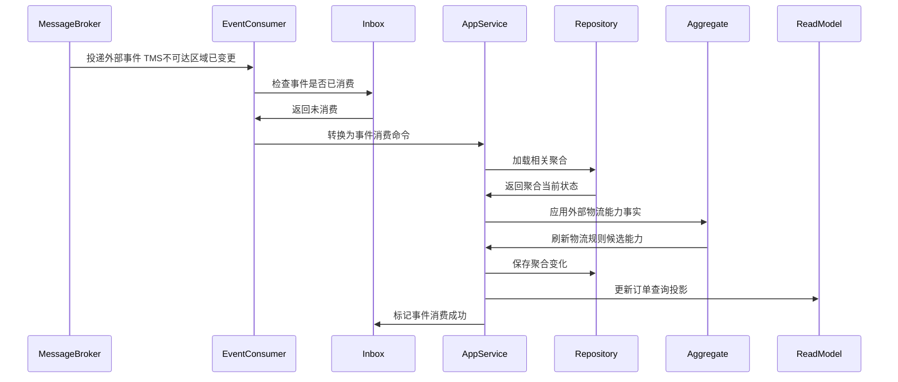
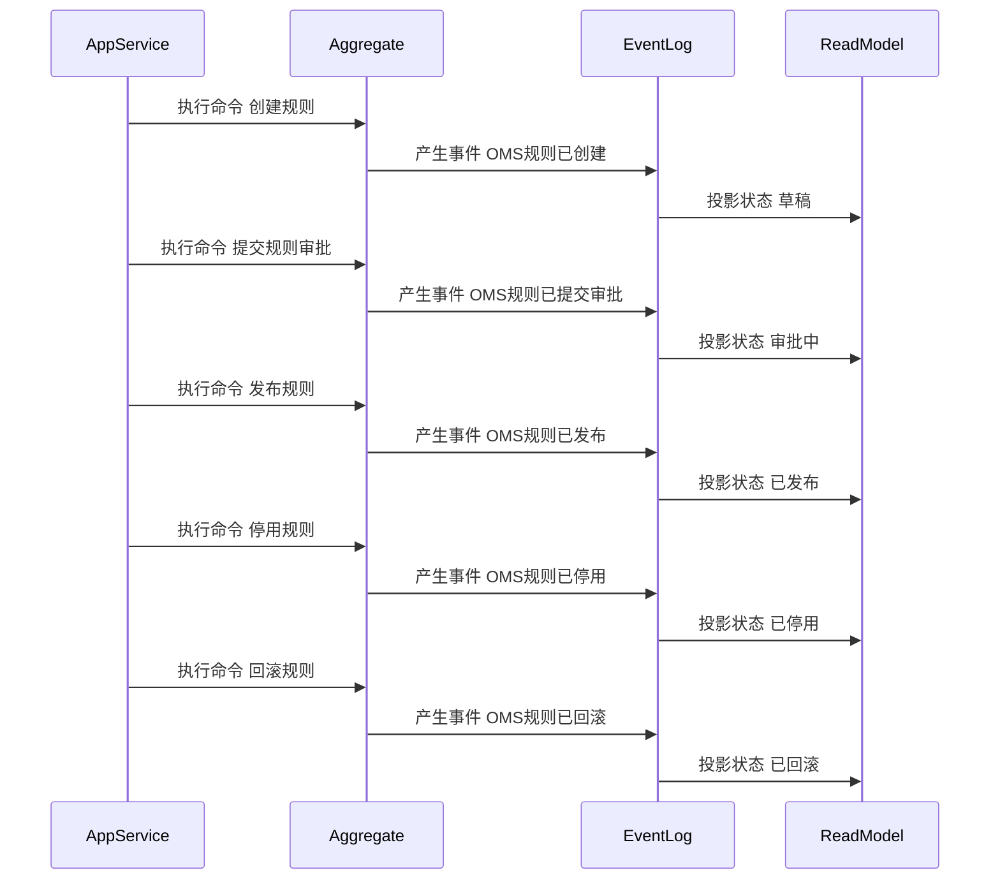

# 07-OMS规则配置聚合CQRS设计

> 所属上下文：OMS 领域。本文按 DDD + CQRS 深入到聚合属性、命令处理、应用服务编排、领域服务规则、事件产生和事件消费逻辑。关键时序图使用 Mermaid 最小兼容语法，便于 VSCode Markdown 预览稳定渲染。

## 1. 业务目标分析

维护审单、分仓、拆单、取消、售后、物流选择、不可达处理、拒收处理、退货取件等规则配置，支持版本化发布和回滚。

| 设计项 | 结论 |
| --- | --- |
| 限界上下文 | OMS 上下文 |
| 子域类型 | 支撑域，履约规则配置 |
| 聚合根 | OMS规则配置 |
| 数据主权 | OMS 拥有 `OMS规则配置` 的审单、分仓、物流选择、取消、售后策略和领域事件；TMS 拥有物流商能力、轨迹规则和运力事实 |
| 主要使用角色 | 系统管理员、订单运营、仓配运营、客服主管、物流运营 |
| 核心不变量 | 外部只能通过聚合根修改内部实体；订单、履约、出库、取消、售后状态必须合法；命令和消费事件必须幂等 |

## 2. 角色、场景与流程分析

| 场景 | 发起角色 | 应用服务处理逻辑 | 领域服务 | 结果事件 |
| --- | --- | --- | --- | --- |
| 创建规则 | 系统管理员 | 围绕OMS规则配置执行创建规则，校验订单、客户、SKU、金额、履约状态、幂等键和权限 | 规则版本校验服务 | OMS规则已创建 |
| 提交规则审批 | 系统管理员 | 围绕OMS规则配置执行提交规则审批，校验订单、客户、SKU、金额、履约状态、幂等键和权限 | 规则版本校验服务 | OMS规则已提交审批 |
| 发布规则 | 系统管理员 | 围绕OMS规则配置执行发布规则，校验订单、客户、SKU、金额、履约状态、幂等键和权限 | 规则版本校验服务 | OMS规则已发布 |
| 刷新物流能力 | TMS/主数据 | 消费物流商、线路、服务产品、不可达区域事件，刷新规则可选物流产品范围 | 物流规则适配服务 | OMS物流规则能力已刷新 |
| 停用规则 | 系统管理员 | 围绕OMS规则配置执行停用规则，校验订单、客户、SKU、金额、履约状态、幂等键和权限 | 规则版本校验服务 | OMS规则已停用 |
| 回滚规则 | 系统管理员 | 围绕OMS规则配置执行回滚规则，校验订单、客户、SKU、金额、履约状态、幂等键和权限 | 规则版本校验服务 | OMS规则已回滚 |

## 3. 领域边界与分层架构

OMS 领域事件的位置要明确区分三层含义：领域层产生订单履约事实，应用层保存聚合与事件发布表，基础设施层投递消息并消费库存、WMS、BMS 等外部事实。

## 4. 聚合属性设计

| 属性 | 业务含义 | 模型归属 | 是否可变 | 主要修改命令 | 变化规则 |
| --- | --- | --- | --- | --- | --- |
| OMS规则配置Id | OMS规则配置ID | 聚合根 | 否 | 创建规则 | 全局唯一 |
| OMS规则配置No | OMS规则配置单号 | 值对象 | 否 | 创建规则 | 按OMS编码规则生成 |
| orderRef | 订单引用 | 值对象 | 否 | 创建规则 | 关联销售订单、渠道单、履约单或售后来源 |
| status | 业务状态 | 值对象 | 是 | 状态推进命令 | 必须按状态机流转 |
| lineList | 明细行 | 内部实体集合 | 是 | 创建或执行命令 | 记录SKU、数量、金额、履约数量、售后数量 |
| customerSnapshot | 客户快照 | 值对象 | 是 | 接单或售后创建 | 保存客户、地址、联系方式和渠道身份 |
| fulfillmentSnapshot | 履约快照 | 值对象 | 是 | 履约或出库事件消费 | 保存仓库、物流、预占、WMS状态 |
| logisticsRuleSet | 物流规则集 | 内部实体集合 | 是 | 创建规则/发布规则/刷新物流能力 | 物流商选择、服务产品、不可达区域、拒收策略、取件失败处理、补发策略 |
| operationLog | 操作记录 | 内部实体集合 | 是 | 所有写命令 | 记录操作者、原因、前后状态和事件编号 |

## 5. 命令与应用服务逻辑

应用服务负责编排用例：校验权限、检查幂等、加载聚合、调用领域服务、执行聚合行为、保存聚合、写发布表、写审计日志。

| 命令 | 发起者 | 应用服务处理逻辑 | 参与领域服务 | 成功后领域事件 |
| --- | --- | --- | --- | --- |
| 创建规则 | 系统管理员 | 围绕OMS规则配置执行创建规则，校验订单、客户、SKU、金额、履约状态、幂等键和权限 | 规则版本校验服务 | OMS规则已创建 |
| 提交规则审批 | 系统管理员 | 围绕OMS规则配置执行提交规则审批，校验订单、客户、SKU、金额、履约状态、幂等键和权限 | 规则版本校验服务 | OMS规则已提交审批 |
| 发布规则 | 系统管理员 | 围绕OMS规则配置执行发布规则，校验订单、客户、SKU、金额、履约状态、幂等键和权限 | 规则版本校验服务 | OMS规则已发布 |
| 刷新物流能力 | TMS/主数据事件消费者 | 按物流商、线路、服务产品和不可达区域刷新规则候选项，不直接改已发布规则版本 | 物流规则适配服务 | OMS物流规则能力已刷新 |
| 停用规则 | 系统管理员 | 围绕OMS规则配置执行停用规则，校验订单、客户、SKU、金额、履约状态、幂等键和权限 | 规则版本校验服务 | OMS规则已停用 |
| 回滚规则 | 系统管理员 | 围绕OMS规则配置执行回滚规则，校验订单、客户、SKU、金额、履约状态、幂等键和权限 | 规则版本校验服务 | OMS规则已回滚 |

### 5.1 应用服务通用处理模板

1. 接口层接收请求并转换为命令对象。
2. 应用层校验用户、角色、渠道、店铺、订单范围、金额权限和数据权限。
3. 使用 `来源系统 + 来源单号 + 命令类型 + 幂等键` 做幂等检查。
4. 通过资源库加载 `OMS规则配置` 聚合根，新建场景先校验业务唯一性。
5. 调用领域服务完成订单、库存、仓库、物流、售后权益和规则配置的判断。
6. 聚合根执行行为，修改属性、内部实体和值对象，并产生领域事件。
7. 同一事务保存聚合、事件发布表和操作审计。
8. 事件发布器异步投递事件，读模型投影器更新订单查询模型。

### 5.2 关键命令处理细节

| 关键命令 | 前置校验 | 聚合行为 | 异常或补偿处理 |
| --- | --- | --- | --- |
| 创建规则 | OMS规则配置状态允许执行，订单、客户、SKU、数量、金额、来源和权限有效 | 修改OMS规则配置状态或明细并产生事件 OMS规则已创建 | 状态不匹配则拒绝；外部协作失败进入待办或补偿流程 |
| 提交规则审批 | OMS规则配置状态允许执行，订单、客户、SKU、数量、金额、来源和权限有效 | 修改OMS规则配置状态或明细并产生事件 OMS规则已提交审批 | 状态不匹配则拒绝；外部协作失败进入待办或补偿流程 |
| 发布规则 | OMS规则配置状态允许执行，订单、客户、SKU、数量、金额、来源和权限有效 | 修改OMS规则配置状态或明细并产生事件 OMS规则已发布 | 状态不匹配则拒绝；外部协作失败进入待办或补偿流程 |
| 刷新物流能力 | TMS 或主数据事件有效，物流商、线路、产品或不可达区域发生变化 | 刷新候选物流能力快照，产生事件 OMS物流规则能力已刷新 | 已发布规则不被自动改写；需要影响评估后发布新版本 |

## 6. 领域服务逻辑

| 领域服务 | 核心逻辑 |
| --- | --- |
| 规则版本校验服务 | 围绕OMS规则配置的订单状态、履约约束、客户权益、库存结果、WMS事实和规则配置进行业务判定。 |
| 规则冲突检测服务 | 检查审单、分仓、物流选择、取消、拒收、售后、退货取件规则之间是否互相冲突。 |
| 物流规则适配服务 | 将 TMS 物流商能力、服务产品、线路时效和不可达区域转成 OMS 可选择的履约策略候选项。 |
| 规则发布影响评估服务 | 评估规则发布对待审订单、待履约订单、面单生成、拒收处理和售后取件的影响。 |

## 7. 事件产生逻辑

| 领域事件 | 触发命令 | 关键载荷 | 主要消费者 |
| --- | --- | --- | --- |
| OMS规则已创建 | 创建规则 | OMS规则配置ID、订单号、渠道、客户、SKU、数量、金额、状态 | 中央库存、WMS、BMS、读模型、审计日志、报表 |
| OMS规则已提交审批 | 提交规则审批 | OMS规则配置ID、订单号、渠道、客户、SKU、数量、金额、状态 | 中央库存、WMS、BMS、读模型、审计日志、报表 |
| OMS规则已发布 | 发布规则 | OMS规则配置ID、订单号、渠道、客户、SKU、数量、金额、状态 | 中央库存、WMS、BMS、读模型、审计日志、报表 |
| OMS物流规则能力已刷新 | 刷新物流能力 | 物流商、服务产品、线路、不可达区域、影响规则版本 | 订单运营、物流运营、读模型、审计日志 |
| OMS规则已停用 | 停用规则 | OMS规则配置ID、订单号、渠道、客户、SKU、数量、金额、状态 | 中央库存、WMS、BMS、读模型、审计日志、报表 |
| OMS规则已回滚 | 回滚规则 | OMS规则配置ID、订单号、渠道、客户、SKU、数量、金额、状态 | 中央库存、WMS、BMS、读模型、审计日志、报表 |

### 7.1 事件生成规则

- 领域事件使用过去式命名，只表达已经发生的订单履约事实。
- 聚合根在业务行为成功后产生领域事件；应用服务负责收集、持久化和发布。
- 事件载荷必须包含事件编号、事件版本、发生时间、来源上下文、订单号、聚合ID、聚合版本、操作者、业务关键字段和幂等键。
- 命令幂等命中时，返回原处理结果，不能重复推进订单、履约、出库、取消或售后状态。
- 外部事件消费必须先进入事件收件箱，再由应用服务加载聚合并执行本地履约行为。

## 8. 事件订阅与消费逻辑

| 订阅事件 | 处理应用服务 | 消费后数据变化 | 幂等键 |
| --- | --- | --- | --- |
| 仓库已启用 | 外部事件消费服务 | 刷新规则可选仓库范围 | 来源上下文+事件编号+业务主键 |
| 物流商已启用 | 物流规则事件处理器 | 刷新规则可选承运商和服务产品 | 主数据上下文+事件编号+carrierId |
| TMS服务产品已变更 | 物流规则事件处理器 | 刷新线路时效、费用等级和不可达区域候选项 | TMS上下文+事件编号+serviceProductId |
| TMS不可达区域已变更 | 物流规则事件处理器 | 更新地址不可达、换承运商、转人工处理规则候选项 | TMS上下文+事件编号+regionRuleId |
| 库存已预占 | 库存事件消费服务 | 记录预占成功并推进履约 | 库存上下文+事件编号+reservationId |
| 预占失败 | 库存事件消费服务 | 标记缺货或生成换仓待办 | 库存上下文+事件编号+reservationId |
| 退款已完成 | BMS事件消费服务 | 更新售后和订单退款状态 | BMS上下文+事件编号+refundId |

## 9. 关键时序图

### 9.1 命令处理、聚合变更与事件发布

### 9.2 典型业务命令一

### 9.3 典型业务命令二

### 9.4 事件订阅、幂等消费与本地状态变化

### 9.5 聚合状态推进时序

## 10. 不变量、异常补偿、权限与审计

| 类型 | 规则 |
| --- | --- |
| 聚合不变量 | `OMS规则配置` 的状态只能通过聚合根行为推进，内部实体不能被外部直接修改 |
| 履约不变量 | 未审单不能履约；未预占不能下发出库；已发货不能普通取消，只能进入售后路径 |
| TMS边界 | TMS 物流能力变化只能刷新候选能力和影响评估，不能直接改写已发布 OMS 规则版本 |
| 数量和金额不变量 | 下单数量、履约数量、出库数量、售后数量、退款金额不能超过业务允许范围 |
| 幂等 | 渠道订单、库存回调、WMS回传、BMS退款回调必须幂等处理 |
| 并发 | 聚合保存使用版本号乐观锁，取消、发货、售后并发时按状态机拒绝非法转换 |
| 补偿 | 库存预占失败走换仓或缺货待办；WMS取消失败转售后；退款失败进入财务待办 |
| 权限 | 按角色、渠道、店铺、组织、金额、订单归属和售后类型控制命令可执行性 |
| 审计 | 所有写命令记录操作者、来源、请求摘要、前后状态、事件编号和失败原因 |

## 11. 读模型设计

读模型服务于查询、工作台、履约链路、异常处理和售后管理，不参与聚合不变量保护。写入决策必须回到应用服务、聚合根和领域服务。

| 读模型 | 使用场景 | 主要字段 |
| --- | --- | --- |
| OMS规则配置列表读模型 | 查询、分页、筛选 | 单号、渠道、客户、状态、金额、更新时间 |
| OMS规则配置详情读模型 | 详情页展示 | 单头、明细、状态历史、事件历史、操作日志、物流选择规则、不可达规则、拒收处理规则 |
| 履约链路追踪读模型 | 串起订单、履约、预占、出库、发货、售后 | 订单号、履约单、预占号、出库单、售后单、当前节点 |
| 异常处理读模型 | 处理缺货、取消失败、仓库拒单、面单失败、不可达、拒收、退款失败 | 异常类型、责任人、处理状态、阻塞原因 |

## 12. 设计结论与待确认问题

### 12.1 设计结论

- `OMS规则配置` 是 OMS 领域内独立保护订单履约规则和状态流转的聚合根。
- OMS 拥有订单履约编排状态和履约规则；中央库存拥有库存数量账本；WMS 拥有仓内作业事实；TMS 拥有物流能力、运单和轨迹事实；BMS 拥有退款和入账事实。
- 命令处理属于应用层编排，核心订单履约规则属于聚合根和领域服务。

### 12.2 待确认问题

| 问题 | 默认建议 |
| --- | --- |
| 是否多渠道、多店铺、多货主、多仓 | 默认保留渠道、店铺、货主、仓库、组织和数据范围 |
| 是否允许发货后取消 | 默认不允许普通取消，必须进入售后或拦截异常流程 |
| 是否需要事件溯源 | 当前阶段建议当前状态表 + 状态历史表 + 事件日志，不做全量事件溯源 |
