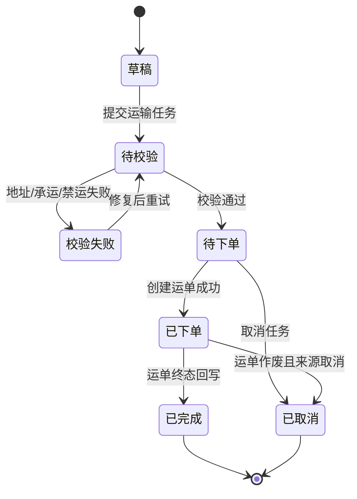
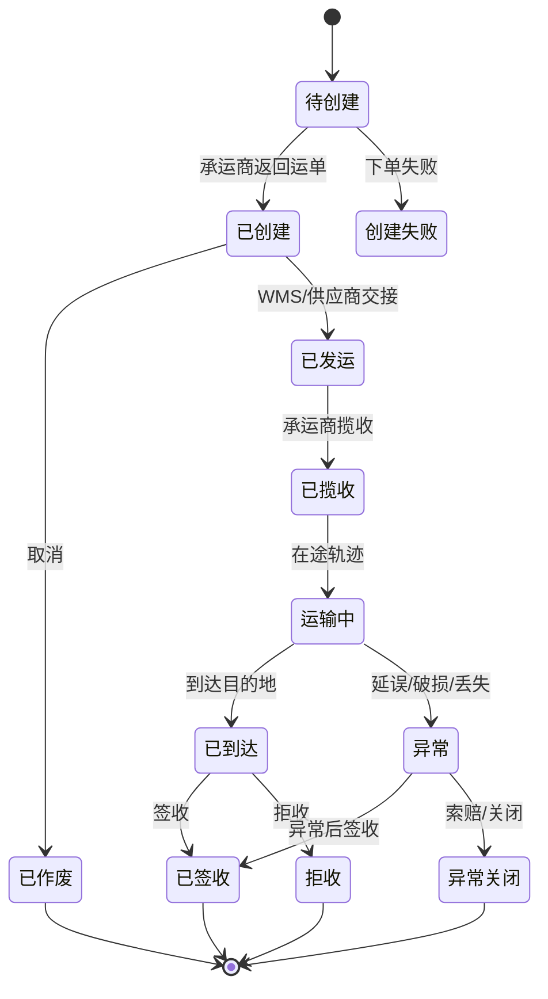
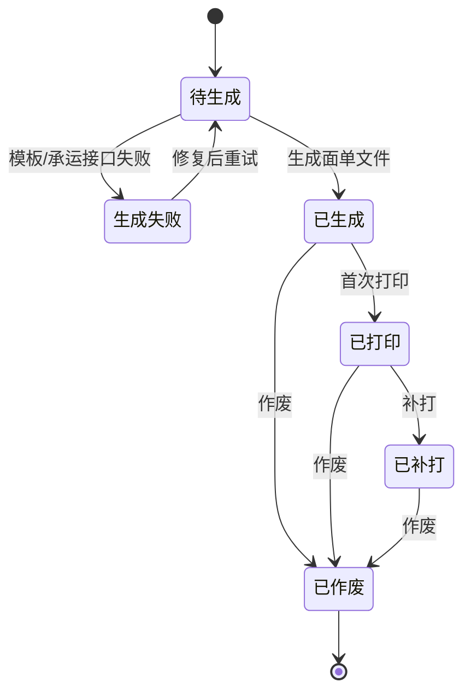
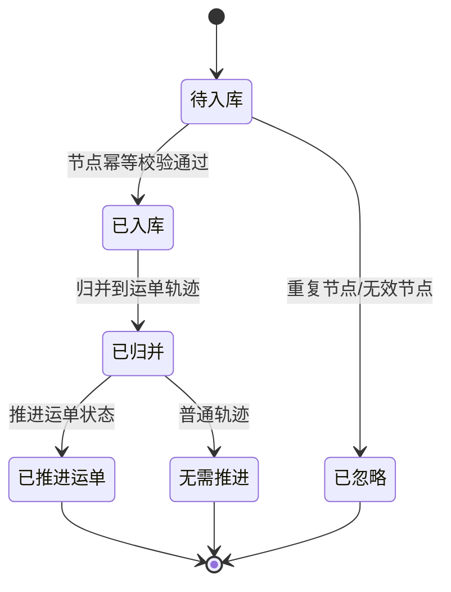
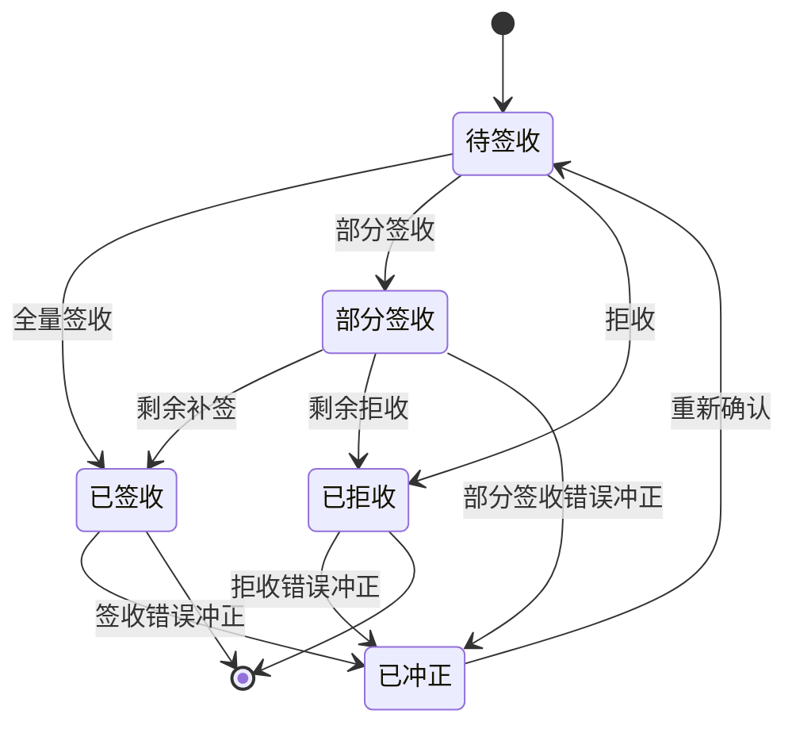
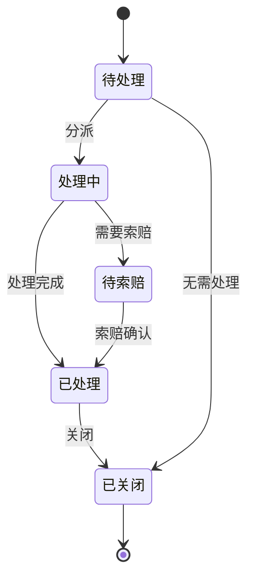
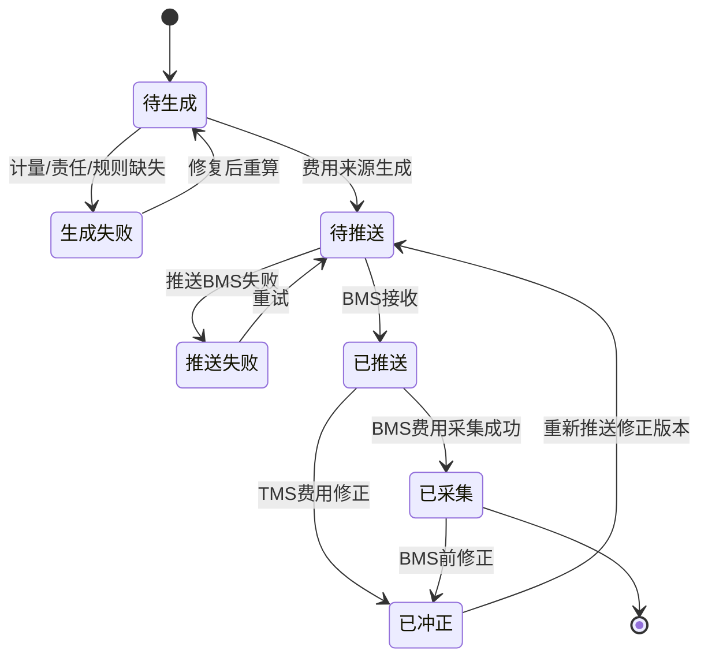

# 01-TMS领域模型

> 本文用于 TMS 领域模型设计，承接 [TMS运输协同业务流程](../../02-业务流程/07-TMS运输协同业务流程.md)、[采购入库业务流程](../../02-业务流程/02-采购入库业务流程.md)、[销售出库业务流程](../../02-业务流程/05-销售出库业务流程.md)、[调拨业务流程](../../02-业务流程/04-调拨业务流程.md)、[售后退货业务流程](../../02-业务流程/06-售后退货业务流程.md)、[供应商退货业务流程](../../02-业务流程/01-供应商退货业务流程.md) 和 [核心聚合与不变量总表](../00-领域模型总览/01-核心聚合与不变量总表.md)。TMS 是运输事实源，不拥有订单、库存、仓内作业和最终账单主权。

## 1. 事件风暴

### 1.1 业务目标

TMS 解决的是：供应链业务发生运输需求后，如何把采购送货、销售配送、售后退货、供应商退货、仓间调拨转成可下单、可打单、可跟踪、可签收、可异常处理、可计费的运输事实。

完整 TMS 生命周期：

```text
业务系统提出运输需求
  -> 校验物流商、物流产品、地址、禁运、时效和费用责任
  -> 创建运输任务
  -> 创建运单和面单
  -> WMS/供应商完成包裹或货物交接
  -> 承运商回传揽收、在途、到达、签收或异常
  -> TMS 生成物流费用来源
  -> 业务系统和 BMS 消费运输事实
```

### 1.2 事件风暴总表

| 阶段   | 角色/系统             | 命令/事件        | 处理对象    | 领域事件                        | 策略/后续动作                  | 读模型    | 异常             |
| ---- | ----------------- | ------------ | ------- | --------------------------- | ------------------------ | ------ | -------------- |
| 运输请求 | OMS/采购/供应商/WMS/调拨 | 创建运输任务       | 运输任务    | 运输任务已创建                     | 校验承运能力                   | 运输任务列表 | 地址缺失、不可承运      |
| 承运校验 | TMS               | 校验物流产品和地址    | 运输任务    | 承运能力已确认 / 承运校验失败            | 失败回传业务系统                 | 下单异常看板 | 禁运、超重、超范围      |
| 创建运单 | TMS/承运商           | 创建运单         | 运单      | 运单已创建 / 运单创建失败              | 下发面单或发运凭证                | 运单列表   | 承运商接口失败        |
| 面单生成 | TMS               | 生成面单         | 面单      | 面单已生成 / 面单已作废               | WMS 打印贴标                 | 面单打印页  | 模板错误、重复打印      |
| 发货交接 | WMS/供应商           | 回传交接         | 运输任务、运单 | 运输已发运 / 包裹已交接               | 等待揽收轨迹                   | 交接看板   | 漏扫、承运商拒收       |
| 轨迹追加 | 承运商               | 回传轨迹         | 物流轨迹、运单 | 物流轨迹已追加                     | 更新在途状态                   | 轨迹页    | 轨迹延迟、重复轨迹      |
| 签收   | 承运商/TMS           | 回传签收         | 签收记录、运单 | 运输已签收 / 运输已拒收 / 部分签收已发生     | 通知业务系统闭环                 | 签收看板   | 拒收、签收差异        |
| 异常   | 承运商/TMS/业务系统      | 登记异常         | 物流异常    | 物流异常已登记 / 物流异常已关闭           | 进入补偿、索赔或重发               | 异常看板   | 破损、丢失、延误       |
| 费用来源 | TMS/BMS           | 生成、推送、采集费用来源 | 物流费用来源  | 物流费用来源已生成 / 已推送 / 已采集 / 已修正 | BMS 计算运费、索赔和对账，TMS保留来源事实 | 费用来源页  | 费用缺失、推送失败、责任争议 |

### 1.3 通用语言

| 术语 | 定义 | 所属上下文 |
| --- | --- | --- |
| 运输任务 | 业务系统提出的一次运输需求，说明来源单据、运输场景、起点、终点、费用责任 | TMS |
| 运单 | TMS 与承运商创建的可追踪运输单据，承载承运商单号和运输状态 | TMS |
| 面单 | 承运商要求贴在包裹或货物上的运输凭证 | TMS |
| 物流轨迹 | 承运商或 TMS 追加的运输节点事实，只追加不覆盖 | TMS |
| 签收记录 | 收件方签收、拒收或部分签收的运输终态事实 | TMS |
| 物流异常 | 延误、破损、丢失、拒收、地址异常、承运商拒收等运输异常处理单 | TMS |
| 物流费用来源 | TMS 根据运单、重量、体积、线路、签收和异常结果生成的计费来源事实 | TMS/BMS 协作 |

## 2. 子域、限界上下文、上下文映射、核心域

### 2.1 子域划分

| 子域 | 类型 | 说明 | 建模策略 |
| --- | --- | --- | --- |
| 运输任务编排 | 核心域 | 把采购、销售、退货、退供、调拨需求转成运输任务 | 深入建模运输任务、来源单据、运输场景和费用责任 |
| 运单与面单 | 核心域 | 对接承运商下单、生成运单和面单 | 深入建模运单、面单、承运商回执和失败补偿 |
| 轨迹与签收 | 核心域 | 追加轨迹、确认到达、签收、拒收和部分签收 | 深入建模轨迹、签收记录和终态约束 |
| 物流异常 | 核心域 | 处理延误、破损、丢失、拒收、地址异常和索赔依据 | 深入建模异常记录、责任方和处理结果 |
| 物流费用来源 | 核心域/支撑域 | 把运输事实转成 BMS 可计费来源 | 深入建模费用来源，最终金额归 BMS |
| OMS/采购/WMS/供应商/调拨 | 支撑域 | 发起运输需求或消费运输结果 | 通过命令和事件协作 |
| 中央库存 | 支撑域 | 消费调拨、采购、销售退货等在途/到达/拒收事实，维护在途库存和异常占用 | 只消费运输事实，不修改TMS运单状态 |
| 主数据、BMS、权限 | 通用/支撑域 | 提供物流商、地址、计费、数据范围、审批和审计能力 | TMS 遵奉主数据和权限，BMS 消费并确认 TMS 费用来源 |

### 2.2 限界上下文模板

```markdown
上下文名称：TMS 上下文
子域类型：核心域/支撑域
业务目标：管理运输任务、运单、面单、轨迹、签收、物流异常和物流费用来源，让供应链业务可以跟踪货物运输过程。
负责范围：运输任务、承运校验、运单创建、面单生成、发货交接接收、轨迹追加、到达通知、签收/拒收、签收冲正、物流异常、费用来源生成/推送/修正、承运商回调幂等。
不负责范围：不决定销售订单是否成立；不执行仓内拣货/上架；不修改中央库存余额；不决定采购订单关闭；不生成最终账单和财务凭证；不维护物流商主数据权威。
核心角色：物流专员、承运商、OMS、采购、供应商系统、WMS、调拨系统、BMS。
核心聚合：运输任务、运单、面单、物流轨迹、签收记录、物流异常、物流费用来源。
数据主权：运输任务状态、运单状态、面单状态、物流轨迹、签收事实、运输异常、物流费用来源事实。
生产事件：运输任务已创建、承运能力已确认、承运校验失败、运输任务已取消、运单已创建、运单创建失败、运单已作废、面单已生成、面单已打印、面单已作废、运输已发运、运输已揽收、物流轨迹已追加、轨迹已补录、运输已到达、运输已签收、运输已拒收、部分签收已发生、签收记录已冲正、物流异常已登记、物流异常已关闭、物流费用来源已生成、物流费用来源已推送、物流费用来源推送失败、物流费用来源已修正、物流费用来源已采集。
消费事件：物流商已启用、物流产品已启用、地址已变更、OMS履约单已创建、WMS包装已完成、WMS出库已发货、ASN已提交、退供已出库、调拨已出库、售后退货已审核、权限审批已通过、权限审批已拒绝、BMS费用来源已采集、BMS对账差异已发生。
一致性要求：运单、轨迹、签收、异常在 TMS 内强约束；与 OMS、采购、WMS、中央库存、BMS 最终一致；承运商回调必须幂等。
异常补偿：不可承运、运单创建失败、面单生成失败、重复轨迹、签收冲突、运输丢失、费用来源失败、费用来源已被BMS采集后的修正冲突、承运商回调超时。
```

### 2.3 上下文映射

| 上游上下文 | 下游上下文 | 映射关系 | 协作方式 | 说明 |
| --- | --- | --- | --- | --- |
| 主数据 | TMS | 遵奉者 | TMS 消费物流商、物流产品、地址、服务区域、禁运规则、包装重量体积 | 主数据是物流基础资料权威 |
| OMS | TMS | 客户/供应商关系 | OMS 请求销售配送、退货取件、换货补发运单；TMS 回传运单和签收 | OMS 是订单履约意图权威 |
| 采购/供应商 | TMS | 客户/供应商关系 | ASN 或采购发货信息触发采购运输任务；TMS 回传到仓、异常和费用来源 | 采购不拥有运输轨迹 |
| WMS | TMS | 合作关系 | WMS 获取面单，回传包裹交接、重量体积；TMS 更新发运和轨迹 | WMS 发货交接不是签收事实 |
| 调拨系统 | TMS | 客户/供应商关系 | 调拨出库后创建调拨运输任务，TMS 回传到达和异常 | 调拨在途库存归中央库存 |
| TMS | 中央库存 | 发布语言 | TMS 发布发运、到达、签收、拒收、异常关闭等运输事实 | 中央库存据此维护调拨在途、退货在途和异常占用，不反向修改运单 |
| TMS | BMS | 发布语言 | TMS 发布物流费用来源、异常责任、签收结果；BMS 回传费用来源已采集、对账差异 | BMS 拥有最终费用明细和账单 |
| 权限系统 | TMS | 遵奉者 | 控制物流下单、取消、异常关闭、签收冲正、费用调整权限，并返回审批、数据范围、审计要求 | TMS 记录操作审计并遵守权限系统结论 |

## 3. 实体、值对象、聚合

### 3.1 聚合总览

| 聚合 | 聚合根 | 内部实体 | 值对象 | 主要不变量 |
| --- | --- | --- | --- | --- |
| 运输任务 | 运输任务 | 运输任务行、来源单快照、费用责任记录 | 运输场景、起止地址、时间窗口、费用责任方 | 同一来源单同场景不能重复创建有效运输任务 |
| 运单 | 运单 | 运单行、承运商回执、运单状态记录 | 承运商、物流产品、运单号、收寄地址 | 运单号必须唯一；已签收/拒收/异常关闭后不能重新发运 |
| 面单 | 面单 | 面单打印记录、作废记录 | 面单模板、打印次数、面单文件 | 作废面单不能继续打印；重复打印必须留痕 |
| 物流轨迹 | 物流轨迹 | 轨迹节点 | 轨迹时间、地点、节点类型、来源 | 轨迹只追加；同承运商节点幂等去重 |
| 签收记录 | 签收记录 | 签收明细、凭证附件 | 签收人、签收时间、签收结果 | 签收终态与运单终态一致；拒收必须有原因 |
| 物流异常 | 物流异常 | 处理记录、索赔记录 | 异常类型、责任方、处理方案 | 异常关闭必须有处理结果和责任归属 |
| 物流费用来源 | 物流费用来源 | 费用项明细 | 重量体积、线路、账期、责任方 | 必须绑定运单、承运商和费用项；同费用项不能重复推送 |

### 3.2 值对象

| 值对象 | 字段 | 规则 |
| --- | --- | --- |
| 来源单据 | 来源系统、来源单号、来源行号、业务场景 | 来源系统和单号必填，用作幂等关键字段 |
| 运输场景 | 采购入库、销售出库、售后退货、退供应商、调拨、补发 | 决定回传目标和费用责任口径 |
| 地址快照 | 省市区、详细地址、联系人、电话、经纬度 | 下单后保存快照，主数据变更不覆盖历史运单 |
| 承运产品 | 承运商、物流产品、时效、服务区域 | 必须来自已启用主数据或 TMS 可用配置 |
| 包裹计量 | 重量、体积、件数、箱数 | 由 WMS/供应商/TMS 采集，影响费用来源 |
| 签收结果 | 已签收、拒收、部分签收、异常签收 | 终态事实，必须保留发生时间和凭证 |
| 费用责任 | 责任方、费用类型、账期、结算对象 | 支撑 BMS 计费和索赔 |

## 4. 领域服务、资源库、领域事件

### 4.1 领域服务

| 领域服务 | 解决的问题 |
| --- | --- |
| 承运能力校验服务 | 校验物流产品、地址、禁运、重量体积、服务区域和时效 |
| 运单幂等服务 | 防止同来源单、同场景、同物流产品重复下单 |
| 轨迹归并服务 | 识别承运商重复轨迹、乱序轨迹和状态推进规则 |
| 签收终态判定服务 | 根据签收、拒收、部分签收、丢失等事实推进运单终态 |
| 物流费用来源生成服务 | 根据运单、计量、线路、签收和异常责任生成费用来源 |
| 物流异常责任判定服务 | 判定延误、破损、丢失、拒收的责任方和处理路径 |

### 4.2 资源库

| 资源库 | 聚合根 | 主要能力 |
| --- | --- | --- |
| `TransportTaskRepository` | 运输任务 | 按来源单幂等加载和保存任务 |
| `WaybillRepository` | 运单 | 保存运单、承运商回执和状态 |
| `ShippingLabelRepository` | 面单 | 保存面单文件、打印和作废记录 |
| `TrackingRepository` | 物流轨迹 | 追加轨迹、按运单查询轨迹 |
| `DeliveryReceiptRepository` | 签收记录 | 保存签收、拒收和凭证 |
| `LogisticsExceptionRepository` | 物流异常 | 保存异常处理和索赔记录 |
| `LogisticsFeeSourceRepository` | 物流费用来源 | 保存费用来源并发布给 BMS |

### 4.3 领域事件

| 事件 | 所属聚合 | 关键载荷 | 下游 |
| --- | --- | --- | --- |
| `TransportTaskCreated` | 运输任务 | 任务号、来源系统、来源单、场景、起止地址 | OMS、采购、WMS、供应商、调拨、读模型 |
| `CarrierCapabilityConfirmed` / `CarrierValidationFailed` | 运输任务 | 任务号、承运商、物流产品、校验结果、失败原因 | OMS、采购、WMS、供应商、调拨 |
| `TransportTaskCanceled` | 运输任务 | 任务号、来源单、取消原因、操作者 | OMS、采购、WMS、供应商、调拨 |
| `WaybillCreated` / `WaybillCreateFailed` | 运单 | 运单号、承运商、物流产品、来源单、面单状态、失败原因 | OMS、WMS、采购、供应商、BMS |
| `WaybillVoided` | 运单 | 运单号、作废原因、审批ID、操作者 | OMS、采购、WMS、供应商、BMS |
| `ShippingLabelGenerated` / `ShippingLabelPrinted` / `ShippingLabelVoided` | 面单 | 面单号、运单号、模板、打印状态、设备、作废原因 | WMS、供应商系统 |
| `TransportShipped` / `TransportPickedUp` | 运单 | 运单号、交接时间、包裹、重量体积、揽收时间 | OMS、采购、调拨、中央库存、BMS |
| `TrackingAppended` / `TrackingSupplemented` | 物流轨迹 | 运单号、节点、时间、地点、状态、来源、补录原因 | OMS、采购、WMS、中央库存、读模型 |
| `TransportArrived` | 物流轨迹 | 运单号、到达节点、目的地 | WMS、调拨、采购、中央库存 |
| `TransportSigned` / `TransportRejected` / `PartialSigned` / `DeliveryReceiptCorrected` | 签收记录 | 运单号、签收时间、签收人、签收结果、拒收原因、冲正原因 | OMS、采购、供应商、中央库存、BMS |
| `LogisticsExceptionRegistered` / `LogisticsExceptionClosed` | 物流异常 | 运单号、异常类型、责任方、影响单据、处理结果 | OMS、采购、WMS、中央库存、BMS |
| `LogisticsFeeSourceGenerated` / `LogisticsFeeSourcePushed` / `LogisticsFeeSourcePushFailed` / `LogisticsFeeSourceCorrected` / `LogisticsFeeSourceCollected` | 物流费用来源 | 运单号、承运商、费用项、计量、责任方、账期、采集结果 | BMS、财务读模型、审计 |

## 5. 状态机模板

状态机必须归属于明确实体或聚合根。TMS 中不是只有运单有状态，运输任务、面单、轨迹节点、签收记录、物流异常、物流费用来源也都有独立生命周期；否则后续接口、事件、数据库字段会混用一个“物流状态”，导致采购、OMS、WMS、BMS 无法判断到底是运输任务、运单、签收还是费用已经完成。

### 5.1 运输任务状态机

适用实体：运输任务聚合根 `TransportTask`。

| 状态 | 含义 | 主要进入动作 | 可产生事件 |
| --- | --- | --- | --- |
| 草稿 | 来源单据已生成运输需求，但还未确认承运方案 | 创建运输任务 | `TransportTaskCreated` |
| 待校验 | 等待校验承运能力、地址、重量体积、禁运规则 | 提交运输任务 | `TransportTaskSubmitted` |
| 校验失败 | 承运能力或主数据不满足 | 承运能力校验失败 | `CarrierValidationFailed` |
| 待下单 | 承运能力通过，等待创建运单 | 承运能力校验通过 | `CarrierCapabilityConfirmed` |
| 已下单 | 已向承运商或内部运输资源下单 | 创建运单成功 | `WaybillCreated` |
| 已取消 | 来源单取消或人工取消运输需求 | 取消运输任务 | `TransportTaskCanceled` |
| 已完成 | 关联运单已签收、拒收或异常关闭，任务闭环 | 运单终态回写 | `TransportTaskCompleted` |



关键约束：

- 同一来源单、同一运输场景、同一有效版本只能存在一个有效运输任务。
- 运输任务取消不能直接代表运单已作废；已下单后必须联动运单作废或保留人工补偿任务。
- 已完成任务不能再创建新运单；若需要重发，应创建新运输任务版本。

### 5.2 运单状态机

适用实体：运单聚合根 `Waybill`。



关键约束：

- 运单是承运商履约事实载体，终态包括已签收、拒收、已作废、异常关闭。
- 已签收、拒收、异常关闭后不能重新发运；如业务需要补发，应由 OMS、采购、调拨等来源系统重新发起运输任务。
- 已到达只表示运输到达目的地，不等于 WMS 收货或采购入库完成。

### 5.3 面单状态机

适用实体：面单聚合根 `ShippingLabel`。



关键约束：

- 作废面单不能继续打印，补打必须记录打印人、设备、次数和原因。
- 面单模板版本来自主数据，面单生成时必须保存模板版本快照。

### 5.4 物流轨迹节点状态机

适用实体：物流轨迹聚合 `Tracking` 内部实体 `TrackingNode`。



关键约束：

- 轨迹节点只追加，不覆盖历史；承运商重复推送按承运商节点 ID、发生时间、节点类型幂等去重。
- 乱序轨迹可以入库，但不能把运单从终态回退到非终态。

### 5.5 签收记录状态机

适用实体：签收记录聚合根 `DeliveryReceipt`。



关键约束：

- 签收、部分签收、拒收必须保存凭证、发生时间、签收人或拒收原因。
- 签收冲正必须有审批或系统补偿依据，并生产 `DeliveryReceiptCorrected`。
- 签收记录终态会推动运单终态，但不能直接修改采购、OMS 或库存的业务完成状态。

### 5.6 物流异常状态机

适用实体：物流异常聚合根 `LogisticsException`。



关键约束：

- 异常关闭必须有处理结果、责任方和影响单据；涉及赔付或减免时必须生成费用来源或调整依据。
- 异常处理完成不必然代表运单完成，运单仍要等待签收、拒收或异常关闭事实。

### 5.7 物流费用来源状态机

适用实体：物流费用来源聚合根 `LogisticsFeeSource`。



关键约束：

- 同一运单、费用项、责任方、版本不能重复推送有效费用来源。
- 已被 BMS 采集的费用来源不能物理修改，只能生成冲正或修正版本。

## 6. 应用服务与读模型

| 应用服务 | 编排用例 |
| --- | --- |
| 运输任务应用服务 | 创建任务、校验承运能力、取消任务 |
| 运单应用服务 | 创建运单、作废运单、接收承运商回执 |
| 面单应用服务 | 生成、打印、补打、作废面单 |
| 轨迹应用服务 | 消费承运商轨迹、归并轨迹、推进运单状态 |
| 签收应用服务 | 处理签收、拒收、部分签收和签收冲突 |
| 物流异常应用服务 | 登记、分派、处理、关闭异常 |
| 费用来源应用服务 | 生成物流费用来源并发布给 BMS |

| 读模型 | 用途 |
| --- | --- |
| TMS 工作台 | 待下单、下单失败、在途异常、待签收、待处理异常 |
| 运输任务列表 | 按来源系统、业务场景、仓库、承运商查询 |
| 运单详情 | 展示运单、面单、轨迹、签收、异常和费用来源 |
| 物流轨迹页 | 客服、采购、仓配查看在途过程 |
| 物流异常看板 | 处理延误、破损、丢失、拒收和索赔 |
| 物流费用来源页 | 查看已推送 BMS 的费用来源和差异状态 |

## 7. 关键不变量与补偿

| 场景 | 不变量 | 补偿 |
| --- | --- | --- |
| 创建运输任务 | 同一来源单、场景、有效版本不能重复创建有效任务 | 幂等返回原任务或创建新版本 |
| 创建运单 | 同一有效运输任务不能重复创建有效运单 | 作废旧运单后重下单 |
| 面单打印 | 作废面单不能继续打印，补打必须留痕 | 重新生成或补打记录 |
| 轨迹追加 | 轨迹只追加，不覆盖历史；重复节点幂等忽略 | 轨迹补拉或人工补录 |
| 签收 | 已签收、拒收、异常关闭是终态，不能普通回退 | 用异常记录或冲正事件处理 |
| 异常关闭 | 必须有处理结果、责任方和影响单据 | 人工分派、索赔、重发、退款或异常关闭 |
| 费用来源 | 必须绑定运单、承运商、费用项和账期；BMS已采集后不能直接覆盖，只能冲正或新版本修正 | 失败重试，差异交 BMS 对账，已采集后通过修正事件闭环 |

## 8. 当前结论

TMS 是运输事实源，既不是 OMS 的物流字段，也不是 WMS 的发货交接附属表。采购入库、销售出库、售后退货、供应商退货和调拨都应通过 TMS 的运输任务、运单、轨迹、签收、异常和物流费用来源协作。

## 9. 继续上下文

当前结论：TMS 领域新增为独立限界上下文，核心聚合为运输任务、运单、面单、物流轨迹、签收记录、物流异常和物流费用来源。

关键假设：第一版 TMS 对接承运商接口，也允许人工录入运单和轨迹；最终费用明细和账单仍归 BMS。
