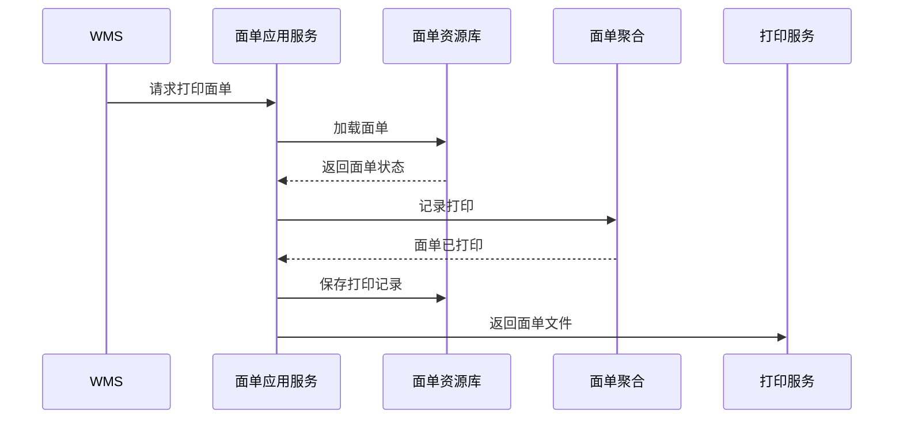

# 04-面单聚合CQRS设计

## 1. 业务目标

面单聚合管理承运商面单生成、打印、补打、作废和模板版本，支撑 WMS 打包贴标和供应商发货。面单打印和补打要受权限系统审计约束，作废面单要联动 WMS/供应商停止继续使用。

| 设计项 | 结论 |
| --- | --- |
| 限界上下文 | TMS 上下文 |
| 聚合根 | 面单 |
| 数据主权 | TMS 拥有面单文件、模板版本、打印状态和作废记录 |
| 核心不变量 | 作废面单不能继续打印；补打必须记录原因和次数 |

## 2. 命令与事件

| 命令 | 发起者 | 应用服务逻辑 | 成功事件 |
| --- | --- | --- | --- |
| 生成面单 | 运单应用服务 | 根据运单、承运商模板、收寄地址生成面单 | 面单已生成 |
| 打印面单 | WMS/供应商 | 校验面单有效，记录打印人和次数 | 面单已打印 |
| 补打面单 | WMS/供应商 | 记录补打原因、设备和操作人 | 面单已补打 |
| 作废面单 | TMS/物流专员 | 运单作废或重新下单时作废面单 | 面单已作废 |

## 3. 聚合属性

| 属性 | 业务含义 | 模型归属 | 是否可变 | 主要命令 | 变化规则 |
| --- | --- | --- | --- | --- | --- |
| labelId | 面单 ID | 聚合根 | 否 | 生成面单 | 全局唯一 |
| labelNo | 面单号 | 值对象 | 否 | 生成面单 | 与运单绑定 |
| waybillRef | 运单引用 | 值对象 | 否 | 生成面单 | 面单必须绑定运单 |
| templateVersion | 模板版本 | 值对象 | 否 | 生成面单 | 历史面单不随模板变化 |
| printRecords | 打印记录 | 内部实体 | 是 | 打印/补打 | 记录次数、设备、人员 |
| labelStatus | 面单状态 | 值对象 | 是 | 生成/打印/作废 | 待生成、已生成、已打印、已作废 |

## 4. 事件订阅

| 订阅事件 | 消费后变化 | 幂等键 |
| --- | --- | --- |
| 运单已创建 | 自动生成面单 | 运单号 + 模板版本 |
| 运单已作废 | 作废面单 | 运单号 + 作废事件号 |
| WMS包装已完成 | 可触发打印面单 | 包裹号 + 打印请求号 |
| 权限审批已通过 | 放行批量补打或作废面单等高危动作 | 审批事件号 + 面单号 + 操作类型 |

## 5. 关键时序图

