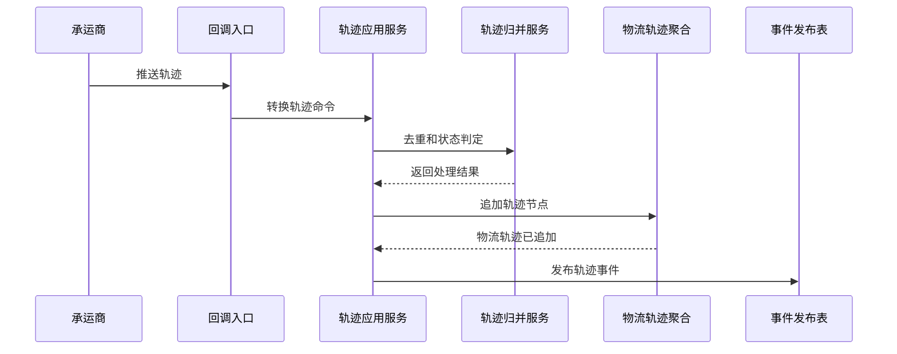

# 05-物流轨迹聚合CQRS设计

## 1. 业务目标

物流轨迹聚合只追加承运商或人工补录的运输节点，支撑在途展示、到达通知、异常判定、中央库存在途视图和签收前状态推进。人工补录轨迹属于敏感操作，必须记录权限、审批和原因。

| 设计项 | 结论 |
| --- | --- |
| 限界上下文 | TMS 上下文 |
| 聚合根 | 物流轨迹 |
| 数据主权 | TMS 拥有轨迹节点、轨迹来源和归并结果 |
| 核心不变量 | 轨迹只能追加，不能覆盖历史；重复节点按幂等键忽略 |

## 2. 命令与事件

| 命令 | 发起者 | 应用服务逻辑 | 领域服务 | 成功事件 |
| --- | --- | --- | --- | --- |
| 追加轨迹 | 承运商回调 | 校验运单、节点、时间和幂等键 | 轨迹归并服务 | 物流轨迹已追加 |
| 补录轨迹 | 物流专员 | 人工补录必须记录原因和操作人 | 轨迹归并服务 | 物流轨迹已补录 |
| 标记到达 | 轨迹应用服务 | 识别到达节点并推进运单 | 到达判定服务 | 运输已到达 |
| 标记轨迹异常 | 轨迹应用服务 | 识别延误、异常节点 | 物流异常责任判定服务 | 物流异常已登记 |

## 3. 事件订阅

| 订阅事件 | 消费后变化 | 幂等键 |
| --- | --- | --- |
| 承运商轨迹回调 | 追加轨迹节点 | 承运商 + 运单号 + 节点编码 + 轨迹时间 |
| 运单已创建 | 初始化轨迹容器 | 运单号 |
| 运单已作废 | 阻断后续普通轨迹 | 运单号 + 作废事件号 |
| 权限审批已通过 | 放行人工补录、删除错误草稿轨迹等高危动作 | 审批事件号 + 运单号 + 操作类型 |

## 4. 关键时序图

## 5. 读模型

| 读模型 | 用途 |
| --- | --- |
| 运单轨迹时间线 | 展示节点、时间、地点、说明 |
| 轨迹异常看板 | 查延误、重复、缺失、乱序轨迹 |
| 到达通知投影 | 支撑 WMS/调拨/采购准备收货，并供中央库存更新调拨在途到达视图 |
