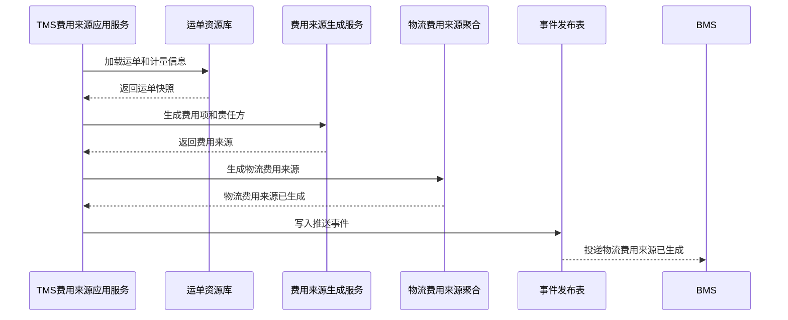

# 08-物流费用来源聚合CQRS设计

## 1. 业务目标

物流费用来源聚合把 TMS 的运单、重量体积、线路、签收、异常、责任方转为 BMS 可消费的费用来源事实。它不是最终费用明细，最终计费、对账和账单归 BMS。BMS 已采集后，TMS 不能覆盖原来源，只能标记采集结果、登记差异或生成修正版本。

| 设计项 | 结论 |
| --- | --- |
| 限界上下文 | TMS 上下文 |
| 聚合根 | 物流费用来源 |
| 数据主权 | TMS 拥有物流费用来源事实；BMS 拥有费用明细、对账和账单 |
| 核心不变量 | 费用来源必须绑定运单、承运商、物流产品、费用项、计量和账期；同一费用项不能重复推送 |

## 2. 聚合属性

| 属性 | 业务含义 | 模型归属 | 是否可变 | 主要命令 | 变化规则 |
| --- | --- | --- | --- | --- | --- |
| feeSourceId | 费用来源 ID | 聚合根 | 否 | 生成费用来源 | 全局唯一 |
| waybillRef | 运单引用 | 值对象 | 否 | 生成费用来源 | 必须绑定有效运单 |
| carrierRef | 承运商引用 | 值对象 | 否 | 生成费用来源 | 来自主数据快照 |
| measurement | 计量信息 | 值对象 | 是 | 采集计量/修正 | 重量、体积、件数、线路 |
| feeItemList | 费用项 | 内部实体 | 是 | 生成/调整来源 | 运费、取件费、派送费、赔付、索赔 |
| responsibility | 责任方 | 值对象 | 是 | 异常判定/调整 | 企业、客户、供应商、承运商 |
| pushStatus | 推送状态 | 值对象 | 是 | 推送 BMS | 待推送、已推送、推送失败、已采集 |

## 3. 命令与事件

| 命令 | 发起者 | 应用服务逻辑 | 领域服务 | 成功事件 |
| --- | --- | --- | --- | --- |
| 生成物流费用来源 | TMS | 校验运单、计量、费用项、责任方 | 物流费用来源生成服务 | 物流费用来源已生成 |
| 推送费用来源 | TMS | 写 Outbox 并投递 BMS | 费用来源去重服务 | 物流费用来源已推送 |
| 标记推送失败 | 系统 | 记录失败原因，等待重试 | 推送补偿服务 | 物流费用来源推送失败 |
| 修正费用来源 | 物流专员 | 未被 BMS 确认前允许修正，留痕 | 费用责任判定服务 | 物流费用来源已修正 |
| 标记BMS已采集 | BMS事件消费 | 记录采集时间、账期、BMS来源编号 | 费用来源去重服务 | 物流费用来源已采集 |

## 4. 事件订阅

| 订阅事件 | 消费后变化 | 幂等键 |
| --- | --- | --- |
| 运输已发运 | 可生成基础运费来源 | 运单号 + 发运事件号 |
| 运输已签收 | 补充签收结果并推送 BMS | 运单号 + 签收事件号 |
| 物流异常已登记 | 生成索赔、赔付或异常费用来源 | 运单号 + 异常事件号 |
| WMS包装已完成 | 补充重量体积和件数 | 包裹号 + 包装事件号 |
| BMS费用来源已采集 | 标记推送状态为已采集，冻结直接修改 | BMS事件号 + 费用来源号 |
| BMS对账差异已发生 | 标记费用来源差异，必要时触发物流异常或修正版本 | BMS事件号 + 费用来源号 |
| 权限审批已通过 | 放行费用来源修正、责任方修正或重推 | 审批事件号 + 费用来源号 + 操作类型 |

## 5. 关键时序图

## 6. 读模型

| 读模型 | 用途 |
| --- | --- |
| 费用来源列表 | 查询待推送、失败、已采集、差异、待审批修正 |
| 运单费用来源详情 | 查看费用项、计量、责任方、账期 |
| 承运商费用来源看板 | 对账前查看承运商维度费用来源 |
