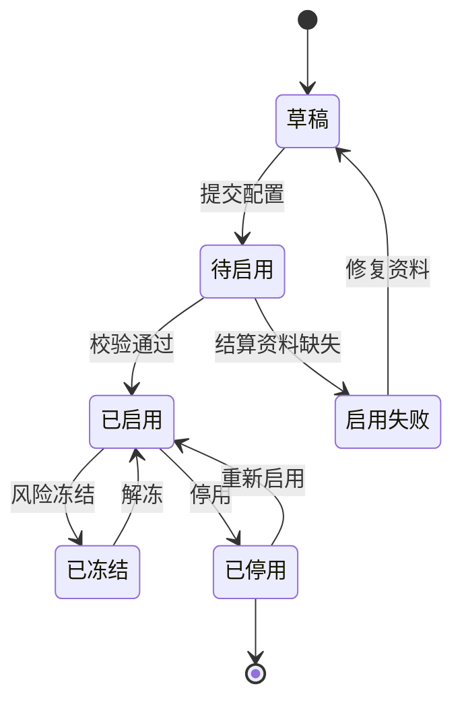
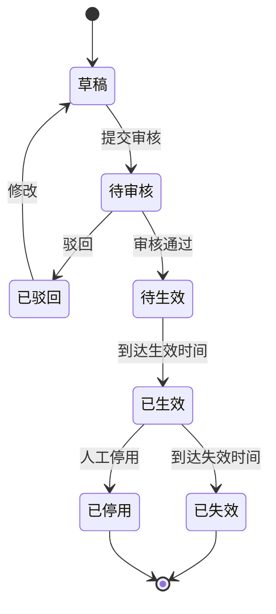
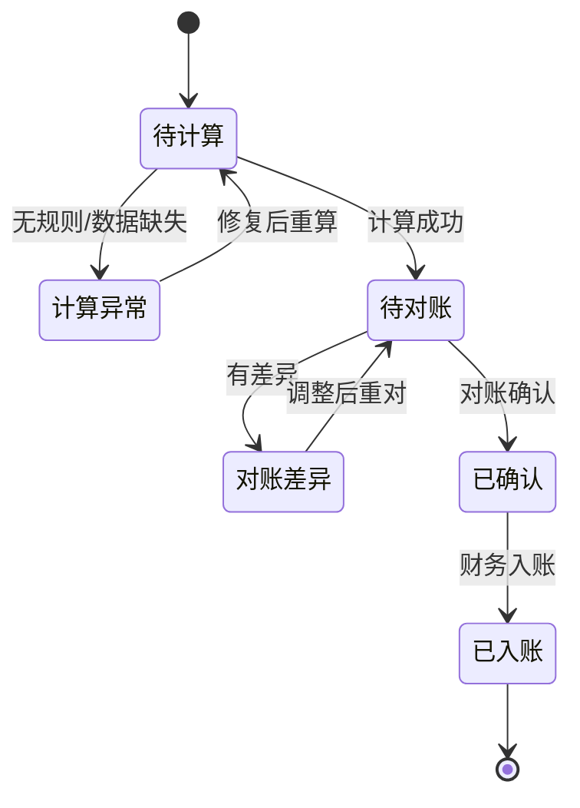
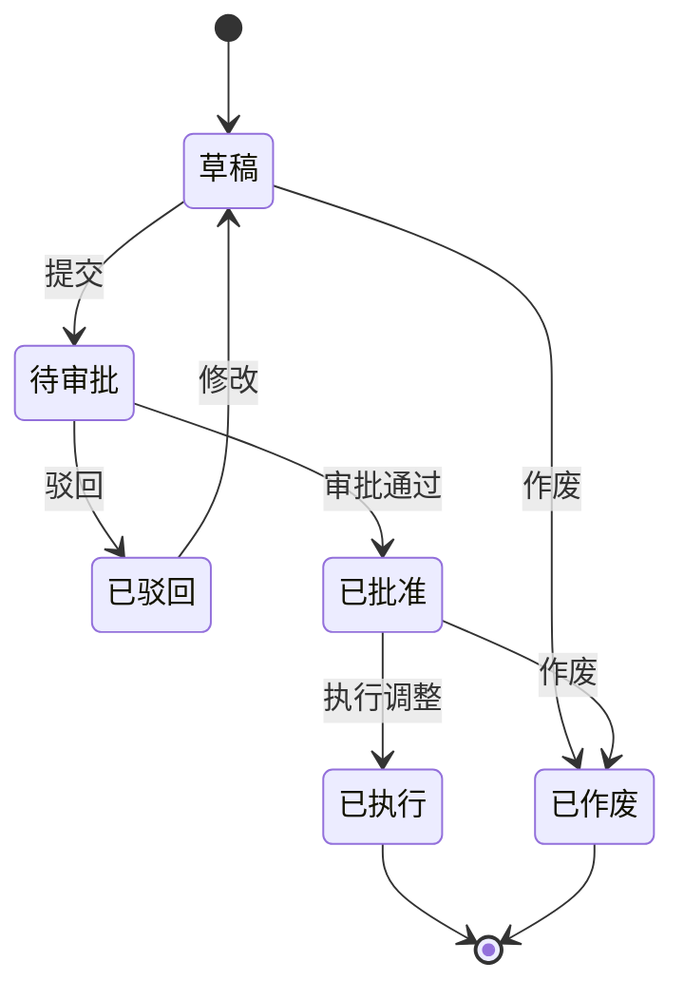
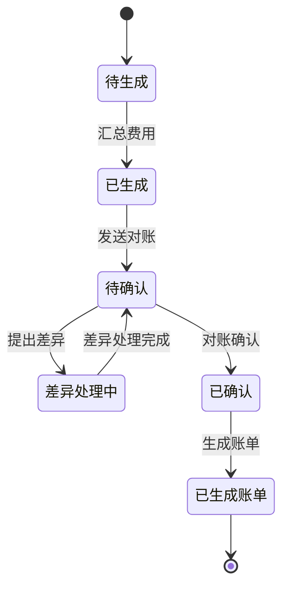
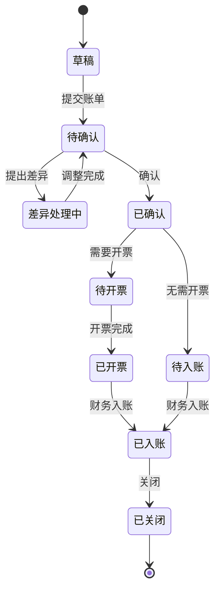
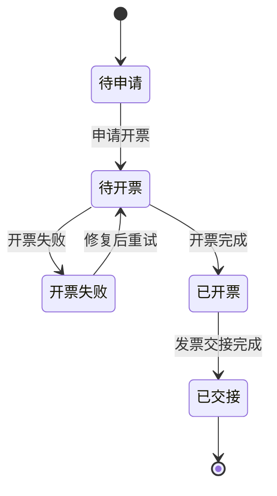
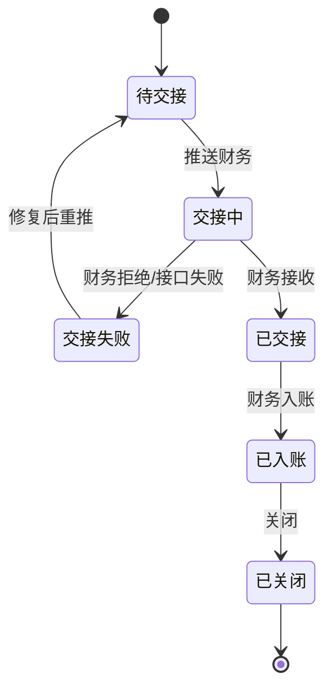

# 01-BMS领域模型

> 本文用于 BMS 领域模型设计，承接 [BMS系统产品功能设计](../../04-子系统功能设计/07-BMS系统/01-BMS系统产品功能设计.md)、[BMS系统接口设计](../../06-子系统接口设计/07-BMS系统接口设计.md)、[WMS 领域模型](../03-WMS领域模型/01-WMS领域模型.md)、[中央库存领域模型](../04-中央库存领域模型/01-中央库存领域模型.md) 和 [OMS 领域模型](../05-OMS领域模型/01-OMS领域模型.md)。本文覆盖 BMS 从计费对象、计费规则、费用采集、费用计算、调整、对账、账单、发票交接到财务交接的完整结算生命周期。

## 1. 事件风暴

### 1.1 业务目标

BMS 解决的是：供应链业务发生后，如何把入库、出库、存储、运输、退货、售后、增值服务等业务事实转成可追溯、可对账、可开票、可交财务的费用和账单。

完整 BMS 生命周期：

```text
计费对象建档
  -> 计费规则发布
  -> 消费 WMS/OMS/库存/TMS 业务事实事件
  -> 匹配对象和规则
  -> 生成费用明细
  -> 对账确认或差异调整
  -> 生成账单
  -> 发票交接
  -> 财务交接和入账回填
```

### 1.2 事件风暴总表

| 阶段 | 角色/系统 | 命令/事件 | 处理对象 | 领域事件 | 策略/后续动作 | 读模型 | 异常 |
| --- | --- | --- | --- | --- | --- | --- | --- |
| 对象建档 | 结算运营/主数据 | 启用计费对象 | 计费对象 | 计费对象已启用 | 可匹配规则 | 计费对象页 | 结算资料缺失 |
| 规则配置 | 管理员/结算运营 | 发布计费规则 | 计费规则 | 计费规则已发布 | 后续费用按版本计算 | 规则页 | 规则冲突 |
| 费用采集 | WMS/OMS/库存/TMS | 业务事实事件、物流费用来源 | 费用来源事件 | 费用来源已采集 | 匹配规则 | 费用采集页 | 重复事件、数据缺失、运单费用缺失 |
| 费用计算 | BMS | 计算费用 | 费用明细 | 费用明细已生成 | 进入待对账 | 费用明细页 | 无规则、金额异常 |
| 调整 | 结算运营/审批人 | 创建调整单 | 调整单 | 费用已调整 | 回到对账 | 调整单页 | 未审批调整、物流丢损索赔未确责 |
| 对账 | 客户/供应商/物流商/财务 | 生成并确认对账单 | 对账单 | 对账单已确认 | 生成账单 | 对账单页 | 运费差异、重量体积差异、异常责任争议 |
| 账单 | 结算运营 | 生成账单 | 账单 | 账单已生成 / 已确认 | 开票或交财务 | 账单页 | 金额不平 |
| 发票交接 | 财务 | 请求/回填发票 | 发票交接 | 发票已开具 | 准备入账 | 发票页 | 发票作废 |
| 财务交接 | 财务 | 交接入账 | 财务交接 | 财务交接已完成 | 账单关闭 | 财务交接页 | 凭证失败 |

### 1.3 通用语言

| 术语 | 定义 |
| --- | --- |
| 计费对象 | 需要收款或付款的客户、货主、供应商、物流商 |
| 计费规则 | 某类业务事实如何计费的规则，含价格、税率、生效期和版本 |
| 费用来源事件 | 从 WMS、OMS、库存、TMS 等系统消费的可计费业务事实 |
| 费用明细 | 单条业务事实按规则计算出的费用结果 |
| 对账单 | 按账期和计费对象汇总费用并供双方确认的单据 |
| 账单 | 对账确认后的正式结算依据 |
| 调整单 | 对费用进行减免、补收、冲减或修正的审批单 |
| 物流费用来源 | TMS 产生的可计费运输事实，如运费、取件费、派送费、退回费、保价费、签收费、赔付或索赔 |
| 运单费用口径 | 按运单、物流产品、线路、重量、体积、件数、签收/拒收结果和异常责任计算费用的口径 |

## 2. 子域、限界上下文、上下文映射、核心域

### 2.1 子域划分

| 子域 | 类型 | 说明 | 建模策略 |
| --- | --- | --- | --- |
| 计费规则 | 核心域 | 决定什么事实按什么方式计费 | 深入建模规则、版本、生效期 |
| 费用计算 | 核心域 | 把业务事实转成费用明细 | 深入建模费用来源事件和费用明细 |
| 对账账单 | 核心域 | 与对账方确认费用并形成账单 | 深入建模对账单和账单 |
| 调整与差异 | 核心域 | 差异、减免、补收、冲减 | 深入建模调整单 |
| 发票和财务交接 | 支撑域 | 将账单交给财务系统处理 | BMS 保存交接状态，不替代财务总账 |
| WMS/OMS/库存/TMS | 支撑域 | 提供可计费业务事实，TMS 提供运单、轨迹、签收、拒收、异常和物流费用来源 | BMS 消费事件 |
| 主数据/权限 | 通用域 | 提供计费对象、税率、角色权限 | BMS 遵奉 |

### 2.2 限界上下文模板

```markdown
上下文名称：BMS 上下文
子域类型：核心域/支撑域
业务目标：把供应链业务事实转化为费用、对账单、账单、发票交接和财务交接依据。
负责范围：计费对象、计费规则、费用来源事件、费用明细、调整单、对账单、账单、发票交接、财务交接、结算报表。
不负责范围：不执行仓库作业；不改库存余额；不决定订单履约；不承运物流；不维护运单轨迹和物流费用来源权威；不做资金支付；不替代财务总账。
核心聚合：计费对象、计费规则、费用明细、调整单、对账单、账单、发票交接、财务交接。
数据主权：费用、对账、账单、调整和结算交接事实。
生产事件：费用明细已生成、费用已调整、对账单已确认、账单已生成、账单已确认、发票已请求、财务交接已完成。
消费事件：货主已启用、客户已启用、供应商已启用、物流商已启用、WMS上架已完成、WMS出库已发货、库存快照已生成、退款已完成、TMS物流费用来源已生成、TMS物流费用来源已修正、TMS运输已签收、TMS运输已拒收、TMS物流异常已登记。
一致性要求：费用明细和规则版本强关联；已确认费用不能直接重算，只能调整；外部事件消费幂等。
异常补偿：无规则、重复计费、运单费用缺失、物流重量体积差异、拒收退回费用争议、物流丢损索赔未确责、对账差异、调整未审批、发票作废、财务交接失败。
```

### 2.3 上下文映射

| 上游上下文 | 下游上下文 | 映射关系 | 协作方式 |
| --- | --- | --- | --- |
| 主数据 | BMS | 遵奉者 | 消费客户、货主、供应商、物流商、税率、结算资料 |
| WMS | BMS | 发布语言 | 入库、出库、包装、盘点等作业事实生成操作费 |
| 中央库存 | BMS | 发布语言 | 库存快照和流水支撑存储费、库存成本对账 |
| OMS | BMS | 发布语言 | 订单、售后、退款请求或结果进入结算 |
| TMS | BMS | 发布语言 | 运单、物流费用来源、签收、拒收、物流异常和费用修正事件进入费用采集、对账和索赔调整 |
| BMS | 财务系统 | 客户/供应商关系 | 提交账单、发票、凭证交接数据 |
| 权限系统 | BMS | 遵奉者 | 控制规则、调整、对账确认、账单交接权限 |

## 3. 实体、值对象、聚合

| 聚合 | 聚合根 | 内部实体 | 值对象 | 主要不变量 |
| --- | --- | --- | --- | --- |
| 计费对象 | BillingObject | 结算资料 | 结算方向、账期、税率、币种、物流商结算资料 | 停用对象不能生成新费用；物流商结算资料缺失不能生成应付运费 |
| 计费规则 | BillingRule | 规则版本、价格项 | 生效期、计价方式、税率、物流计价口径 | 同对象同费用类型生效期不能冲突 |
| 费用明细 | BillingItem | 费用来源、计算快照 | 金额、税额、规则版本、运单费用快照 | 已确认费用不能直接重算 |
| 调整单 | BillingAdjustment | 调整行、审批记录 | 调整金额、原因、物流异常责任 | 未审批不能执行 |
| 对账单 | ReconciliationOrder | 对账行、差异记录 | 账期、对账金额、差异金额、运单对账口径 | 对账确认后才能生成账单 |
| 账单 | Bill | 账单行 | 应收/应付方向、税额、状态、物流费用汇总 | 已入账账单不能改金额 |
| 发票交接 | InvoiceHandover | 发票附件 | 发票号、开票金额 | 开票金额不能超过账单口径 |
| 财务交接 | FinanceHandover | 凭证记录 | 凭证号、入账时间 | 财务交接完成后只能关闭 |

## 4. 聚合根、领域服务、资源库、领域事件

### 4.1 聚合模板

```markdown
聚合名称：费用明细
聚合根：BillingItem
业务目标：记录某个业务事实按某个规则版本计算出的费用。
主要命令：采集费用来源、计算费用、重算费用、作废费用、确认费用
主要事件：费用明细已生成、费用计算失败、费用已确认、费用已作废
核心不变量：费用必须能追溯来源事件和规则版本；已确认费用不能直接改写。
资源库：BillingItemRepository
```

```markdown
聚合名称：账单
聚合根：Bill
业务目标：形成可交财务处理的正式结算依据。
主要命令：生成账单、确认账单、申请开票、交接财务、关闭账单
主要事件：账单已生成、账单已确认、开票已请求、财务交接已完成、账单已关闭
核心不变量：账单金额来自已确认对账结果；已入账账单不能改金额。
资源库：BillRepository
```

### 4.2 领域服务

| 领域服务 | 解决的问题 |
| --- | --- |
| 计费对象匹配服务 | 根据业务事实找到客户、货主、供应商或物流商 |
| 计费规则匹配服务 | 根据费用类型、对象、生效期、规则优先级匹配规则 |
| 费用计算服务 | 按件、重量、体积、天数、阶梯、固定价、首重续重、线路、签收/拒收结果计算金额和税额 |
| 物流费用归因服务 | 根据运单、物流产品、重量体积、签收/拒收、异常责任判断物流费用、赔付、索赔和减免归属 |
| 对账汇总服务 | 按账期、对象和运单维度汇总待对账费用 |
| 账单生成服务 | 从已确认对账单生成账单和账单行 |

### 4.3 资源库与领域事件

| 资源库 | 聚合根 |
| --- | --- |
| `BillingObjectRepository` | 计费对象 |
| `BillingRuleRepository` | 计费规则 |
| `BillingItemRepository` | 费用明细 |
| `BillingAdjustmentRepository` | 调整单 |
| `ReconciliationRepository` | 对账单 |
| `BillRepository` | 账单 |

| 事件 | 所属聚合 | 下游 |
| --- | --- | --- |
| `BillingItemCreated` | 费用明细 | 对账、报表 |
| `BillingItemAdjusted` | 调整单 | 对账、账单 |
| `ReconciliationConfirmed` | 对账单 | 账单 |
| `BillConfirmed` | 账单 | 财务、客户/供应商门户 |
| `InvoiceRequested` | 发票交接 | 财务 |
| `FinanceHandoverCompleted` | 财务交接 | BMS、报表 |

## 5. 状态机模板

状态机必须说明对应实体。BMS 中费用明细、计费规则、调整单、对账单、账单、发票交接、财务交接都有独立生命周期，不能只用一个“费用状态”或“账单状态”覆盖所有对象。

### 5.1 计费对象状态机

适用实体：计费对象聚合根 `BillingObject`。



关键约束：停用或冻结的计费对象不能生成新费用；历史费用、对账单、账单仍保留对象快照。

### 5.2 计费规则状态机

适用实体：计费规则聚合根 `BillingRule`。



关键约束：同计费对象、费用类型、线路或场景的有效期不能冲突；费用明细必须保存命中的规则版本快照。

### 5.3 费用明细状态机

适用实体：费用明细聚合根 `BillingItem`。



关键约束：已确认费用不能直接重算；如果 TMS、WMS、OMS 或库存事实发生修正，应生成调整单或冲正费用。

### 5.4 调整单状态机

适用实体：调整单聚合根 `BillingAdjustment`。



关键约束：调整单未审批不能影响费用明细或对账单；已执行调整不能撤回，只能再发起反向调整。

### 5.5 对账单状态机

适用实体：对账单聚合根 `ReconciliationOrder`。



关键约束：只有已确认对账单才能生成账单；对账差异必须关联费用明细、调整单或物流费用来源。

### 5.6 账单状态机

适用实体：账单聚合根 `Bill`。



关键约束：账单金额来自已确认对账结果；已入账账单不能改金额，只能通过后续调整单或红冲账单处理。

### 5.7 发票交接状态机

适用实体：发票交接聚合根 `InvoiceHandover`。



关键约束：开票金额不能超过账单可开票金额；发票号、税率、开票主体必须可追溯。

### 5.8 财务交接状态机

适用实体：财务交接聚合根 `FinanceHandover`。



关键约束：财务交接完成后 BMS 不能再改账单金额；凭证号、入账时间和财务返回结果必须写入审计。

## 6. 领域字段归属

| 聚合 | 核心字段 |
| --- | --- |
| 计费对象 | 对象编码、对象类型、结算方向、账期、税率、币种、状态 |
| 计费规则 | 规则编码、费用类型、计价方式、价格配置、税率、生效期、版本、状态 |
| 费用明细 | 费用单号、计费对象、来源事件、费用类型、规则版本、数量、单价、金额、税额、账期、状态 |
| 调整单 | 调整单号、计费对象、调整类型、金额、原因、审批状态、执行状态、运单号、异常责任 |
| 对账单 | 对账单号、计费对象、方向、账期、金额、税额、差异金额、状态、运单数量、物流差异金额 |
| 账单 | 账单号、来源对账单、计费对象、方向、账期、金额、税额、是否开票、状态、物流费用汇总 |
| 发票交接 | 账单、发票类型、发票号、开票金额、发票状态、附件 |
| 财务交接 | 账单、交接状态、凭证号、入账时间 |

## 7. 应用服务与读模型

| 应用服务 | 编排用例 |
| --- | --- |
| 费用采集应用服务 | 消费 WMS/OMS/库存/TMS 业务事实，幂等落库，触发计费 |
| 费用计算应用服务 | 匹配对象和规则，生成费用明细 |
| 调整应用服务 | 提交、审批、执行费用调整 |
| 对账应用服务 | 按账期生成对账单，处理差异 |
| 账单应用服务 | 生成账单、确认、开票、交财务 |

| 读模型 | 用途 |
| --- | --- |
| BMS 工作台 | 异常费用、待对账、待开票、待入账 |
| 费用明细页 | 查询和重算未确认费用 |
| 对账单页 | 对账确认和差异处理 |
| 账单页 | 正式账单确认和关闭 |
| 结算报表 | 收入、成本、物流成本、毛利、差异分析 |

## 8. 关键不变量与补偿

| 场景 | 不变量 | 补偿 |
| --- | --- | --- |
| 费用采集 | 同一来源事件不能重复计费 | 幂等忽略或作废重复费用 |
| 费用计算 | 必须保存规则版本、价格快照和运单费用快照 | 修复规则或 TMS 修正费用后重算 |
| 对账 | 已确认费用才能入账单 | 差异处理或调整 |
| 调整 | 未审批不能执行 | 驳回或补审批 |
| 账单 | 已入账不能改金额 | 追加调整或冲减 |
| 发票 | 发票金额不能超过账单口径 | 作废重开或差异调整 |
| 物流费用 | TMS 费用来源不能直接改已确认费用、对账单或账单 | 生成修正来源事件，走重算、调整、差异或冲减补差 |

## 9. 当前结论

BMS 不是财务总账，也不是仓储、订单或运输执行系统。完整 BMS 领域应围绕 `计费对象`、`计费规则`、`费用来源事件`、`费用明细`、`调整`、`对账`、`账单`、`发票交接` 和 `财务交接` 建模；TMS 只提供物流费用来源、运单轨迹和异常证据，BMS 负责费用、对账和账单事实。

## 10. 继续上下文

当前结论：本文是完整“BMS 领域模型”，覆盖费用生成、对账、账单、调整、开票和财务交接。

关键假设：BMS 消费 WMS、OMS、中央库存、TMS 等业务事实；BMS 拥有费用和账单事实；TMS 拥有物流费用来源、运单、签收和物流异常事实；财务系统拥有凭证、资金和总账事实。

## 聚合审计补充

本轮已按聚合/聚合根补充 CQRS 落地文档，覆盖命令、应用服务、领域服务、读模型、生产事件和订阅事件：

- [计费对象聚合 CQRS 设计](02-计费对象聚合CQRS设计.md)
- [计费规则聚合 CQRS 设计](03-计费规则聚合CQRS设计.md)
- [费用来源事件聚合 CQRS 设计](04-费用来源事件聚合CQRS设计.md)
- [费用明细聚合 CQRS 设计](05-费用明细聚合CQRS设计.md)
- [费用调整单聚合 CQRS 设计](06-费用调整单聚合CQRS设计.md)
- [对账单聚合 CQRS 设计](07-对账单聚合CQRS设计.md)
- [账单聚合 CQRS 设计](08-账单聚合CQRS设计.md)
- [发票交接聚合 CQRS 设计](09-发票交接聚合CQRS设计.md)
- [财务交接聚合 CQRS 设计](10-财务交接聚合CQRS设计.md)
