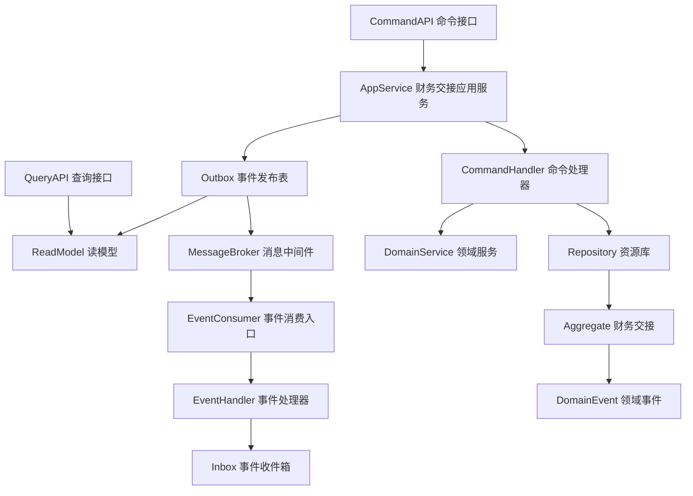
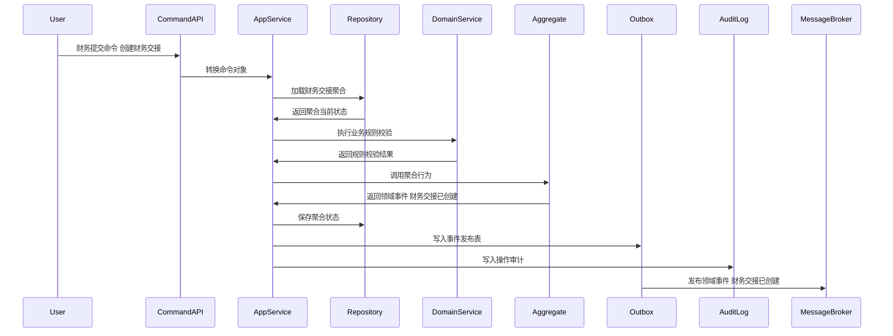
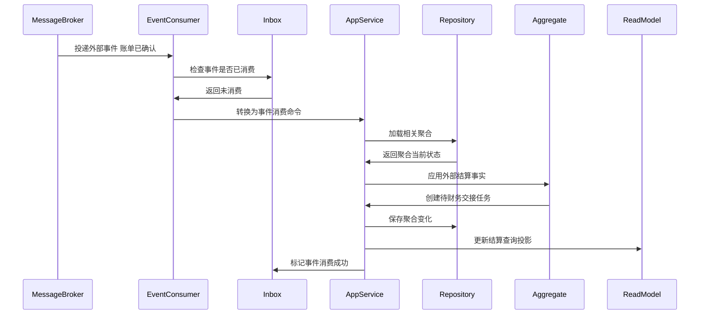
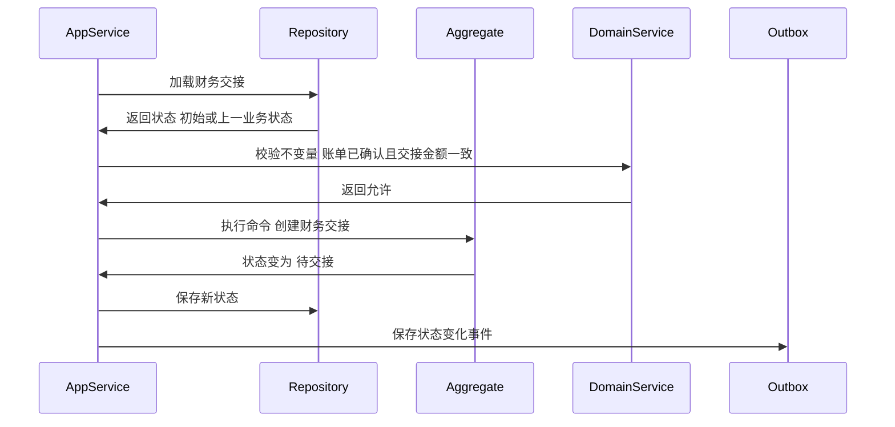

# 10-财务交接聚合CQRS设计

> 所属上下文：BMS 领域。本文按 DDD + CQRS 深入到聚合属性、命令处理、应用服务编排、领域服务规则、事件产生和事件消费逻辑。关键时序图使用 Mermaid 最小兼容语法，便于 VSCode Markdown 预览稳定渲染。

## 1. 业务目标分析

将账单、发票和结算金额交接给财务系统，记录凭证、入账结果、失败原因和关闭状态；物流费用交接要把运费收入、承运商应付、索赔赔付、退回费用和税额映射到财务科目，但凭证和资金入账仍由财务系统拥有最终主权。

| 设计项 | 结论 |
| --- | --- |
| 限界上下文 | BMS 上下文 |
| 子域类型 | 支撑域，财务系统交接 |
| 聚合根 | 财务交接 |
| 数据主权 | BMS 拥有计费对象、计费规则、费用来源、费用明细、调整、对账、账单、发票交接和财务交接事实；TMS 拥有运单、轨迹、签收、拒收、物流异常和承运商账单原始导入事实；BMS 不拥有仓库作业、订单履约、库存余额、资金支付和财务总账凭证的最终主权。 |
| 主要使用角色 | 财务、结算运营、财务系统 |
| 核心不变量 | 财务交接完成后只能关闭或冲正，不能直接改写交接金额；外部只能通过聚合根修改内部实体；命令和消费事件必须幂等 |

## 2. 角色、场景与流程分析

| 场景 | 发起角色 | 应用服务处理逻辑 | 领域服务 | 结果事件 |
| --- | --- | --- | --- | --- |
| 创建财务交接 | 财务 | 围绕财务交接执行创建财务交接，校验计费对象、账期、费用类型、金额、税率、状态、幂等键和权限 | 财务交接校验服务 | 财务交接已创建 |
| 创建物流财务交接 | 财务 | 基于已确认物流账单和票据信息生成财务交接，校验运费收入、承运商应付、索赔赔付、税额和科目映射 | 物流财务科目映射服务 | 财务交接已创建 |
| 提交财务交接 | 财务 | 围绕财务交接执行提交财务交接，校验计费对象、账期、费用类型、金额、税率、状态、幂等键和权限 | 财务交接校验服务 | 财务交接已提交 |
| 回填入账结果 | 财务 | 围绕财务交接执行回填入账结果，校验计费对象、账期、费用类型、金额、税率、状态、幂等键和权限 | 财务交接校验服务 | 财务交接已完成 |
| 标记交接失败 | 财务 | 围绕财务交接执行标记交接失败，校验计费对象、账期、费用类型、金额、税率、状态、幂等键和权限 | 财务交接校验服务 | 财务交接已失败 |
| 关闭财务交接 | 财务 | 围绕财务交接执行关闭财务交接，校验计费对象、账期、费用类型、金额、税率、状态、幂等键和权限 | 财务交接校验服务 | 财务交接已关闭 |

## 3. 领域边界与分层架构

BMS 事件的位置要明确区分三层含义：领域层产生结算事实，应用层保存聚合与事件发布表，基础设施层投递消息并消费 WMS、OMS、库存、主数据和财务系统的外部事实。

## 4. 聚合属性设计

| 属性 | 业务含义 | 模型归属 | 是否可变 | 主要修改命令 | 变化规则 |
| --- | --- | --- | --- | --- | --- |
| financeHandoverId | 财务交接ID | 聚合根 | 否 | 创建财务交接 | 全局唯一 |
| financeHandoverNo | 财务交接单号或编码 | 值对象 | 否 | 创建财务交接 | 按BMS编码规则生成 |
| billingObjectRef | 计费对象引用 | 值对象 | 是 | 创建或匹配命令 | 关联客户、货主、供应商或物流商结算主体 |
| period | 账期 | 值对象 | 是 | 创建、汇总、确认命令 | 账期关闭后不能直接改写 |
| amountSnapshot | 金额快照 | 值对象 | 是 | 计算、调整、确认命令 | 保存未税金额、税额、含税金额、币种和汇率 |
| sourceSnapshot | 来源事实快照 | 值对象 | 是 | 采集或生成命令 | 保存来源上下文、来源单号、业务发生时间和幂等键 |
| logisticsFinanceRef | 物流财务引用 | 值对象 | 是 | 创建财务交接、提交财务交接 | 保存物流账单号、发票号、承运商、客户、费用方向、索赔赔付类型、财务科目和TMS账单批次 |
| status | 业务状态 | 值对象 | 是 | 状态推进命令 | 必须按状态机流转 |
| lineList | 明细行 | 内部实体集合 | 是 | 生成、调整、确认命令 | 记录费用类型、数量、单价、税率、金额和差异 |
| operationLog | 操作记录 | 内部实体集合 | 是 | 所有写命令 | 记录操作者、原因、前后状态和事件编号 |

## 5. 命令与应用服务逻辑

应用服务负责编排结算用例：校验权限、检查幂等、加载聚合、调用领域服务、执行聚合行为、保存聚合、写发布表、写审计日志。

| 命令 | 发起者 | 应用服务处理逻辑 | 参与领域服务 | 成功后领域事件 |
| --- | --- | --- | --- | --- |
| 创建财务交接 | 财务 | 加载财务交接聚合，校验状态、金额口径、来源事实、规则版本、审批权限和幂等键，执行聚合行为并写入事件发布表 | 财务交接校验服务 | 财务交接已创建 |
| 创建物流财务交接 | 财务 | 加载财务交接聚合，校验物流账单已确认、票据信息满足入账要求、物流科目映射存在，执行聚合行为并写入事件发布表 | 物流财务科目映射服务 | 财务交接已创建 |
| 提交财务交接 | 财务 | 加载财务交接聚合，校验状态、金额口径、来源事实、规则版本、审批权限和幂等键，执行聚合行为并写入事件发布表 | 财务交接校验服务 | 财务交接已提交 |
| 回填入账结果 | 财务 | 加载财务交接聚合，校验状态、金额口径、来源事实、规则版本、审批权限和幂等键，执行聚合行为并写入事件发布表 | 财务交接校验服务 | 财务交接已完成 |
| 标记交接失败 | 财务 | 加载财务交接聚合，校验状态、金额口径、来源事实、规则版本、审批权限和幂等键，执行聚合行为并写入事件发布表 | 财务交接校验服务 | 财务交接已失败 |
| 关闭财务交接 | 财务 | 加载财务交接聚合，校验状态、金额口径、来源事实、规则版本、审批权限和幂等键，执行聚合行为并写入事件发布表 | 财务交接校验服务 | 财务交接已关闭 |

### 5.1 应用服务通用处理模板

1. 接口层接收请求、回调或事件，并转换为命令对象。
2. 应用层校验用户、角色、组织、计费对象、账期、金额权限和数据权限。
3. 使用 `来源上下文 + 来源单号 + 命令类型 + 幂等键` 做幂等检查。
4. 通过资源库加载 `财务交接` 聚合根，新建场景先校验业务唯一性。
5. 调用领域服务完成计费对象、规则版本、金额、税额、账期和外部事实的判断。
6. 聚合根执行行为，修改属性、内部实体和值对象，并产生领域事件。
7. 同一事务保存聚合、事件发布表和操作审计。
8. 事件发布器异步投递事件，读模型投影器更新结算查询模型。

### 5.2 关键命令处理细节

| 关键命令 | 前置校验 | 聚合行为 | 异常或补偿处理 |
| --- | --- | --- | --- |
| 创建财务交接 | 财务交接处于允许状态，计费对象有效，金额口径一致，账期未关闭，命令未重复 | 修改财务交接状态为`待交接`，记录计算或确认快照，产生`财务交接已创建` | 状态不匹配则拒绝；金额不平进入差异处理；外部交接失败进入补偿待办 |
| 创建物流财务交接 | 物流账单已确认，发票或收票信息满足财务规则，科目映射完整，命令未重复 | 修改财务交接状态为`待交接`，记录物流财务引用，产生`财务交接已创建` | 财务拒绝入账后回写失败并生成补偿待办；TMS 后续修正不能直接改凭证，必须走账单调整和财务冲正 |
| 提交财务交接 | 财务交接处于允许状态，计费对象有效，金额口径一致，账期未关闭，命令未重复 | 修改财务交接状态为`交接中`，记录计算或确认快照，产生`财务交接已提交` | 状态不匹配则拒绝；金额不平进入差异处理；外部交接失败进入补偿待办 |
| 回填入账结果 | 财务交接处于允许状态，计费对象有效，金额口径一致，账期未关闭，命令未重复 | 修改财务交接状态为`已入账`，记录计算或确认快照，产生`财务交接已完成` | 状态不匹配则拒绝；金额不平进入差异处理；外部交接失败进入补偿待办 |
| 标记交接失败 | 财务交接处于允许状态，计费对象有效，金额口径一致，账期未关闭，命令未重复 | 修改财务交接状态为`失败`，记录计算或确认快照，产生`财务交接已失败` | 状态不匹配则拒绝；金额不平进入差异处理；外部交接失败进入补偿待办 |

## 6. 领域服务逻辑

| 领域服务 | 核心逻辑 |
| --- | --- |
| 财务交接校验服务 | 处理财务交接中跨对象、跨规则、跨账期或跨来源事实的结算判断，保证金额、税额、状态和版本口径一致。 |
| 凭证结果同步服务 | 处理财务交接中跨对象、跨规则、跨账期或跨来源事实的结算判断，保证金额、税额、状态和版本口径一致。 |
| 交接失败补偿服务 | 处理财务交接中跨对象、跨规则、跨账期或跨来源事实的结算判断，保证金额、税额、状态和版本口径一致。 |
| 物流财务科目映射服务 | 根据物流费用方向、承运商应付、客户运费应收、索赔赔付和税率，把 BMS 已确认账单映射为财务可识别的科目、辅助核算和摘要。 |

## 7. 事件产生逻辑

| 领域事件 | 触发命令 | 关键载荷 | 主要消费者 |
| --- | --- | --- | --- |
| 财务交接已创建 | 创建财务交接、创建物流财务交接 | 聚合ID、单号、计费对象、账期、费用类型、方向、金额、税额、状态`待交接`、规则版本、来源事件、物流财务引用、幂等键 | BMS读模型、对账、账单、发票交接、财务交接、审计日志、报表 |
| 财务交接已提交 | 提交财务交接 | 聚合ID、单号、计费对象、账期、费用类型、方向、金额、税额、状态`交接中`、规则版本、来源事件、幂等键 | BMS读模型、对账、账单、发票交接、财务交接、审计日志、报表 |
| 财务交接已完成 | 回填入账结果 | 聚合ID、单号、计费对象、账期、费用类型、方向、金额、税额、状态`已入账`、规则版本、来源事件、幂等键 | BMS读模型、对账、账单、发票交接、财务交接、审计日志、报表 |
| 财务交接已失败 | 标记交接失败 | 聚合ID、单号、计费对象、账期、费用类型、方向、金额、税额、状态`失败`、规则版本、来源事件、幂等键 | BMS读模型、对账、账单、发票交接、财务交接、审计日志、报表 |
| 财务交接已关闭 | 关闭财务交接 | 聚合ID、单号、计费对象、账期、费用类型、方向、金额、税额、状态`已关闭`、规则版本、来源事件、幂等键 | BMS读模型、对账、账单、发票交接、财务交接、审计日志、报表 |

### 7.1 事件生成规则

- 领域事件使用过去式命名，只表达已经发生的结算事实。
- 聚合根在业务行为成功后产生领域事件；应用服务负责收集、持久化和发布。
- 事件载荷必须包含事件编号、事件版本、发生时间、来源上下文、聚合ID、聚合版本、计费对象、账期、金额口径、操作者和幂等键。
- 命令幂等命中时，返回原处理结果，不能重复生成费用、调整、对账、账单、发票或财务交接事实。
- 外部事件消费必须先进入事件收件箱，再由应用服务加载聚合并执行本地结算行为。

## 8. 事件订阅与消费逻辑

| 订阅事件 | 处理应用服务 | 消费后数据变化 | 幂等键 |
| --- | --- | --- | --- |
| 账单已确认 | 财务交接应用服务 | 根据账单业务类型创建普通财务交接或物流财务交接待办，等待票据或直接交接策略判断 | 来源上下文+事件编号+业务主键 |
| 发票已开具 | 财务交接应用服务 | 补全交接所需发票信息 | 来源上下文+事件编号+业务主键 |
| 计费对象已启用 | 计费对象同步服务 | 更新计费对象快照或创建结算待办 | 主数据上下文+事件编号+对象编码 |
| 财务交接失败 | 财务交接补偿服务 | 标记交接异常并生成补偿任务 | 财务上下文+事件编号+交接单号 |

## 9. 关键时序图

### 9.1 命令处理、聚合变更与事件发布

### 9.2 典型业务命令一

### 9.3 典型业务命令二

### 9.4 事件订阅、幂等消费与本地状态变化

### 9.5 聚合状态推进时序

## 10. 异常、补偿、幂等、权限、审计

| 类型 | 设计 |
| --- | --- |
| 异常 | 账单未确认、发票缺失、凭证创建失败、财务回调重复、入账金额不一致、交接超时、物流费用科目缺失、承运商应付与票据不一致、索赔赔付无法匹配责任方。 |
| 补偿 | 允许在未确认或未入账前重算、作废、调整；已确认或已入账后必须通过调整单、冲减单或补差单处理 |
| 幂等 | 命令幂等键使用来源上下文、来源单号、命令类型和请求流水；事件消费幂等使用事件编号和业务主键 |
| 权限 | 按角色、组织、计费对象、账期、金额阈值、审批节点和数据范围控制 |
| 审计 | 所有写命令记录请求摘要、操作者、原因、前后状态、金额变化、事件编号和外部回调编号 |

## 11. 读模型设计

| 读模型 | 用途 | 数据来源 | 刷新方式 |
| --- | --- | --- | --- |
| 财务交接列表读模型 | 列表查询、条件筛选、分页和导出 | 聚合事件投影 + 主数据快照 | 事件投影更新 |
| 财务交接详情读模型 | 查看明细行、金额、税额、来源、状态和操作记录 | 聚合当前状态 + 操作日志 | 写命令后同步刷新 |
| 物流财务交接读模型 | 按物流账单、承运商、客户、费用方向、科目、凭证状态和失败原因查询交接 | 财务交接事件 + 物流账单/发票快照 | 事件投影更新 |
| BMS工作台读模型 | 展示待计算、待对账、待开票、待交财务和异常数量 | 多聚合事件汇总 | 异步投影 |
| 结算报表读模型 | 收入、成本、毛利、差异、账龄和开票进度分析 | 费用、对账、账单、财务交接事件 | 定时汇总 + 事件增量 |

## 12. 当前结论与待确认问题

当前结论：`财务交接` 是 BMS 结算生命周期中的关键聚合，写侧必须以聚合根保护金额、账期、规则版本、状态和幂等不变量，读侧使用投影支撑列表、详情、工作台和报表。

关键假设：BMS 消费业务事实并生成费用和账单，TMS 提供物流事实和承运商账单证据，BMS 提供财务交接事实，财务系统拥有最终凭证和资金入账事实。

待确认问题：是否需要支持多币种汇率重估、跨月补差、红冲发票、部分开票、供应商应付和客户应收在同一账期内抵扣。这些会影响字段模型和状态机细化。
