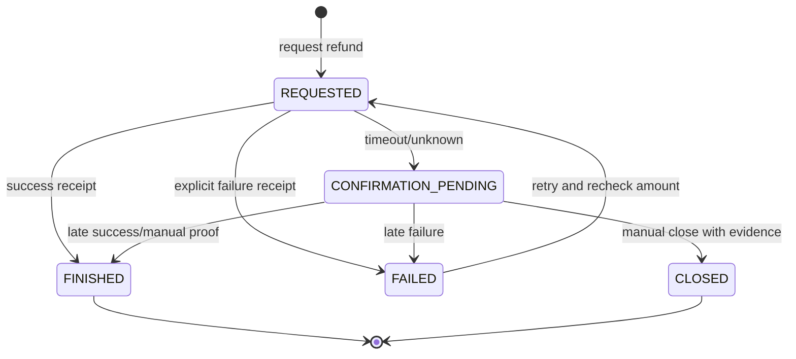

# 11-退款结算聚合 CQRS 设计

> 本文是 `BMS-REQ-003/004`、`DOC-REQ-002` 和 `BMS-API-005` 的 BMS 领域事实源。退款结算是独立聚合，不是财务交接聚合的内部实体：退款拥有独立生命周期、支付回执幂等和并发金额上限；财务交接只承接已确定的支付/会计结果。

## 1. 领域驱动设计对齐说明

| 领域驱动设计项 | 对齐口径 |
| --- | --- |
| 限界上下文 | BMS 计费结算 |
| 子域类型 | 支撑域：退款支付协同与金额守恒 |
| 聚合根 | `RefundSettlementAggregate`（退款结算） |
| 内部对象 | 退款金额、失败原因、支付尝试引用为值对象；支付回执是聚合外不可变 Inbox/幂等事实 |
| 数据主权 | OMS 拥有售后退款决策；BMS 拥有退款累计、结算状态和回执应用结果；支付平台拥有支付执行事实 |
| 命令 | 请求退款、应用支付回执、标记超时待确认、重试、人工完成、人工关闭 |
| 生产事件 | `RefundSettlementRequested/RefundCompleted/RefundFailed/RefundConfirmationPending/RefundRetryRequested/RefundManuallyClosed` |
| 消费事件 | OMS `RefundRequested`，支付平台成功/失败/未知回执 |
| 查询模型 | 退款列表/详情、账单退款累计、超时待确认、支付回执审计 |

## 2. 聚合边界与金额不变量

退款结算聚合按 `refundNo` 管理单笔退款；账单锁或退款额度行在创建用例中保护跨退款累计。这样避免把历史退款塞入超大账单聚合，同时保持金额强一致。

1. `refundAmount > 0`，币种与原账单一致。
2. 创建时锁定账单/额度行：`本次退款 <= 账单可退金额 - Σ(REQUESTED, CONFIRMATION_PENDING, FINISHED)`。
3. `FAILED/CLOSED` 不占用额度；失败重试回到 `REQUESTED` 前必须重新锁定并校验额度。
4. 同一 `receiptNo` 全局只能绑定一个 `refundNo`；重复回执返回原结果，不再次改状态、累计或发事件。
5. 成功/失败回执只能推进待处理状态；冲突或乱序回执进入人工待办，不能覆盖完成事实。
6. 超时表示结果未知而非失败；`CONFIRMATION_PENDING` 继续占额，防止迟到成功造成超额退款。

## 3. 状态机

`FINISHED`、`CLOSED` 为终态。人工完成/关闭必须记录支付流水、凭证、双人复核和原因，不能借普通完成接口静默处理。

## 4. 命令、事件、幂等与补偿

| 命令/事实 | 聚合行为 | 事件 | 幂等键 |
| --- | --- | --- | --- |
| `RequestRefund` | 校验账单、币种、累计，创建 REQUESTED | `RefundSettlementRequested` | `afterSaleNo:refundSequence` 或请求幂等键 |
| `ApplyRefundReceipt` | 声明回执号后应用成功/失败 | `RefundCompleted/RefundFailed` | 全局 `receiptNo` |
| `MarkRefundConfirmationPending` | 支付超时且结果未知 | `RefundConfirmationPending` | `refundNo:timeout:attemptNo` |
| `RetryRefund` | 仅 FAILED；重校额度并生成新支付尝试 | `RefundRetryRequested` | `refundNo:retry:version` |
| `CompleteRefundManually` | 仅待确认；凭证与双人复核齐全 | `RefundCompleted` | `refundNo:manual-complete:version` |
| `CloseRefundManually` | 仅待确认；确认未付款并释放额度 | `RefundManuallyClosed` | `refundNo:manual-close:version` |

支付调用明确失败进入 FAILED；网络超时或结果未知进入 `CONFIRMATION_PENDING`，先主动查单再人工处理。回执、退款状态、累计投影和 Outbox 在同一事务提交；发布失败由 Outbox 重试。

## 5. 权限、审计与读模型

- OMS 内部命令只能为自身售后单请求退款；管理接口按财务组织、账单归属授权。
- 回执入口必须验签、防重放并校验 `refundNo/amount/currency/merchantNo` 与本地快照一致。
- 人工完成/关闭使用 `bms:refund:manual-resolve` 并默认双人复核；普通退款操作员不能自审。
- 审计保存回执摘要、支付流水、尝试次数、请求/回执时间、前后状态、累计金额快照、操作者和复核者。
- 查询模型展示退款进度、支付尝试/回执、已请求/已完成/可退金额、超时待确认和失败待重试。

## 6. 测试与实现差异门禁

必须覆盖并发创建不超额、失败释放额度、重试重新占额、回执重复/串单/乱序、迟到成功、超时保持占额、人工完成/关闭双人复核、回执与 Outbox 原子性。

当前实现已有独立聚合、累计退款校验、回执唯一表和失败重试；`BMS-NEXT-002` 仍需补 `CONFIRMATION_PENDING/CLOSED`、主动查单、人工双人复核、回执金额/币种校验和创建请求幂等键持久化约束。
