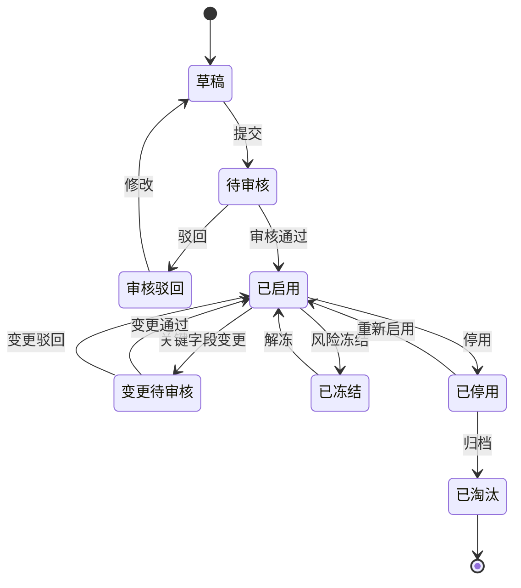
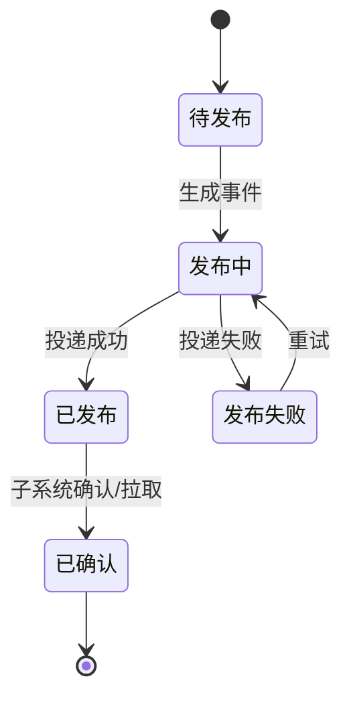

# 01 主数据领域模型

> 本文用于主数据领域模型设计，承接 [主数据系统业务流程总览](../../02-业务流程/01-主数据系统业务流程.md)、主数据系统产品功能设计，以及数据库设计中的商品、供应商、客户、货主、仓库、库位、物流商字段落地口径。本文覆盖主数据从类型定义、字段模板、编码、建档、审核、版本、发布、分发、导入导出到数据质量治理的完整生命周期。

## 1. 事件风暴

### 1.1 业务目标

主数据系统解决的是：供应链中所有系统如何使用同一套商品、供应商、客户、货主、仓库、库位、物流商、组织、税率和币种等基础资料，并保证这些资料可审核、可版本化、可分发、可追溯。

完整主数据生命周期：

```text
定义主数据类型和字段模板
  -> 配置编码规则和枚举
  -> 创建主数据草稿
  -> 校验唯一性、必填、引用关系
  -> 提交审核
  -> 启用并生成版本
  -> 发布 MasterDataChanged
  -> 子系统消费或补偿拉取
  -> 关键字段变更、停用、冻结、淘汰
```

### 1.2 事件风暴总表

| 阶段 | 角色/系统 | 命令/事件 | 处理对象 | 领域事件 | 策略/后续动作 | 读模型 | 异常 |
| --- | --- | --- | --- | --- | --- | --- | --- |
| 类型配置 | 主数据管理员 | 创建主数据类型 | 主数据类型 | 主数据类型已启用 | 可建档 | 类型管理页 | 类型冲突 |
| 字段模板 | 主数据管理员 | 配置字段定义 | 字段模板 | 字段模板已发布 | 约束建档表单 | 字段模板页 | 字段删除影响历史 |
| 编码 | 系统/管理员 | 生成编码 | 编码规则 | 主数据编码已生成 | 写入草稿 | 编码规则页 | 编码重复 |
| 建档 | 主数据专员/业务人员 | 创建主数据 | 主数据记录 | 主数据草稿已创建 | 校验并提交 | 各主数据页 | 必填缺失、重复 |
| 审核 | 审批人 | 审核主数据 | 主数据记录 | 主数据已启用 / 已驳回 | 生成版本并发布 | 审核页 | 资料不完整 |
| 版本 | 系统 | 生成版本 | 主数据版本 | 主数据版本已生成 | 作为发布载荷 | 版本详情 | 快照缺失 |
| 发布 | 系统 | 发布主数据 | 发布日志 | 主数据已发布 | 子系统消费 | 发布页 | 投递失败 |
| 变更 | 业务人员 | 变更关键字段 | 主数据记录 | 主数据变更已提交 / 已生效 | 关键字段需审批 | 变更日志 | 子系统兼容 |
| 停用冻结 | 管理员/风控 | 停用或冻结 | 主数据记录 | 主数据已停用 / 已冻结 | 禁止新业务引用 | 主数据列表 | 有未完业务 |
| 数据质量 | 质量任务 | 检测问题 | 数据质量问题 | 数据质量问题已发现 | 修复、合并、冻结 | 治理看板 | 重复资料 |

### 1.3 通用语言

| 术语 | 定义 |
| --- | --- |
| 主数据类型 | 商品、SKU、供应商、仓库、客户、货主、物流商等基础资料类别 |
| 字段模板 | 某类主数据有哪些字段、是否必填、是否枚举、是否关键字段的定义 |
| 主数据记录 | 一个具体主数据对象，如某个 SKU、某个仓库、某个供应商 |
| 主数据版本 | 主数据启用或关键变更时生成的不可变快照 |
| 发布语言 | 主数据对外发布的事件和 API 契约 |
| 关键字段 | 影响库存、履约、结算、权限的数据字段，变更需要审批和发布 |

## 2. 子域、限界上下文、上下文映射、核心域

### 2.1 子域划分

| 子域 | 类型 | 说明 | 建模策略 |
| --- | --- | --- | --- |
| 主数据类型和字段模板 | 核心域 | 决定系统能管理哪些资料及字段规则 | 深入建模类型、字段定义和编码规则 |
| 主数据记录与版本 | 核心域 | 管理主数据建档、审核、启用、变更、停用 | 深入建模记录、版本、变更日志 |
| 发布分发 | 核心域 | 向采购、OMS、WMS、库存、BMS 等发布统一语言 | 深入建模订阅、发布日志、补偿拉取 |
| 数据质量治理 | 支撑域 | 重复、缺失、引用、过期和合并治理 | 建模质量问题和治理任务 |
| 子系统业务上下文 | 支撑域 | 采购、OMS、WMS、库存、BMS 消费主数据 | 子系统只缓存，不拥有核心口径 |
| 权限/审批 | 通用域 | 控制主数据维护、审核和发布权限 | 主数据遵奉审批结果 |

### 2.2 限界上下文模板

```markdown
上下文名称：主数据上下文
子域类型：核心域/通用域
业务目标：作为供应链基础资料权威来源，提供统一编码、字段口径、审核、版本和发布。
负责范围：主数据类型、字段模板、编码规则、SPU/SKU、供应商、客户、货主、仓库库位、物流商、组织、枚举、版本、发布订阅、导入导出、变更日志。
不负责范围：不执行业务单据；不记库存账；不做仓内作业；不处理订单履约；不做财务入账。
核心聚合：主数据类型、字段模板、主数据记录、主数据版本、发布订阅、编码规则、导入任务、数据质量问题。
数据主权：基础资料权威口径、编码、版本、发布状态和字段定义。
生产事件：主数据已启用、主数据已变更、SKU已启用、供应商已启用、仓库已启用、客户已启用、货主已启用、物流商已启用、主数据已停用。
消费事件：审批已完成、数据质量问题已发现、仓库联调已通过、物流产品联调已通过、财务结算资料已校验。
一致性要求：主数据记录和版本强一致；分发到子系统最终一致；子系统引用时保存必要快照。
异常补偿：发布失败、版本丢失、重复编码、关键字段变更驳回、子系统消费失败、主数据停用但存在未完业务。
```

### 2.3 上下文映射

| 上游上下文 | 下游上下文 | 映射关系 | 协作方式 |
| --- | --- | --- | --- |
| 主数据 | 采购/OMS/WMS/库存/BMS | 发布语言 | 发布 SKU、供应商、客户、仓库、货主、物流商等事件 |
| 权限/审批 | 主数据 | 遵奉者 | 审批结果驱动主数据启用、驳回、变更生效 |
| WMS/TMS/财务 | 主数据 | 合作关系 | 仓库、物流产品、结算资料联调或校验结果回写 |
| 子系统 | 主数据 | 开放主机服务 | 事件丢失时按类型、编码、版本 API 拉取 |

## 3. 实体、值对象、聚合

| 聚合 | 聚合根 | 内部实体 | 值对象 | 主要不变量 |
| --- | --- | --- | --- | --- |
| 主数据类型 | MasterDataType | 字段定义 | 类型编码、所属领域 | 类型编码唯一；停用前检查记录 |
| 字段模板 | MasterDataFieldTemplate | 字段定义、枚举引用 | 字段类型、必填、关键字段 | 已发布模板变更要兼容历史 |
| 主数据记录 | MasterDataRecord | 变更日志、审批记录 | 数据编码、状态、业务载荷 | 同类型编码唯一；关键变更需审批 |
| 主数据版本 | MasterDataVersion | 版本快照 | 版本号、变更摘要 | 版本只追加，不覆盖 |
| 发布订阅 | MasterDataSubscription | 发布日志 | 目标系统、主题、过滤规则 | 发布日志可追溯 |
| 编码规则 | CodeRule | 流水号段 | 前缀、日期、重置周期 | 生成编码唯一 |
| 导入任务 | ImportTask | 导入行结果 | 文件、模式、错误文件 | 导入结果可追溯 |

## 4. 聚合根、领域服务、资源库、领域事件

### 4.1 聚合模板

```markdown
聚合名称：主数据记录
聚合根：MasterDataRecord
业务目标：管理某个主数据对象的草稿、审核、启用、变更、冻结、停用和淘汰。
主要命令：创建记录、提交审核、审核通过、驳回、变更、冻结、停用、淘汰
主要事件：主数据草稿已创建、主数据已提交审核、主数据已启用、主数据已变更、主数据已停用
核心不变量：同类型编码唯一；关键字段变更必须生成新版本；已停用对象不能被新业务引用。
资源库：MasterDataRecordRepository
```

```markdown
聚合名称：主数据版本
聚合根：MasterDataVersion
业务目标：保存每次有效变更的不可变快照，支撑子系统引用和追溯。
主要命令：生成版本、发布版本、标记发布失败、重试发布
主要事件：主数据版本已生成、主数据版本已发布、主数据发布失败
核心不变量：版本号递增；版本快照不可修改；发布必须绑定版本号。
资源库：MasterDataVersionRepository
```

### 4.2 领域服务

| 领域服务 | 解决的问题 |
| --- | --- |
| 主数据校验服务 | 按字段模板校验必填、唯一、枚举、引用关系 |
| 编码生成服务 | 按编码规则生成唯一编码 |
| 关键字段识别服务 | 判断变更是否需要审批和版本发布 |
| 主数据发布服务 | 按订阅配置生成事件、API 推送或批量发布 |
| 数据质量治理服务 | 检测重复、缺失、过期、引用断裂和合并建议 |

### 4.3 资源库与领域事件

| 资源库 | 聚合根 |
| --- | --- |
| `MasterDataTypeRepository` | 主数据类型 |
| `FieldTemplateRepository` | 字段模板 |
| `MasterDataRecordRepository` | 主数据记录 |
| `MasterDataVersionRepository` | 主数据版本 |
| `MasterDataPublishRepository` | 发布订阅 |
| `CodeRuleRepository` | 编码规则 |
| `ImportTaskRepository` | 导入任务 |

| 事件 | 关键载荷 | 下游 |
| --- | --- | --- |
| `MasterDataChanged` | 类型、编码、版本、变更类型 | 全部订阅系统 |
| `SkuEnabled` | SKU、条码、单位、包装、批次规则 | 采购、OMS、WMS、库存 |
| `SupplierEnabled` | 供应商、状态、结算/资质摘要 | 采购、供应商系统、BMS |
| `WarehouseEnabled` | 仓库、库区、库位、货主仓关系 | WMS、库存、OMS |
| `CustomerEnabled` | 客户、地址、结算资料 | OMS、BMS |
| `OwnerEnabled` | 货主、仓库范围、结算关系 | WMS、库存、BMS |
| `CarrierEnabled` | 物流商、物流产品、服务区域 | OMS、WMS、BMS |

## 5. 状态机模板





## 6. 领域字段归属

| 聚合 | 核心字段 |
| --- | --- |
| 主数据类型 | 类型编码、类型名称、所属领域、上级类型、编码规则、是否审核、是否版本化、是否发布 |
| 字段模板 | 字段编码、字段名称、字段类型、必填、唯一、枚举、引用、关键字段、表单可见 |
| 主数据记录 | 类型、编码、名称、归属组织、业务载荷、状态、审批状态、当前版本、生效时间 |
| 主数据版本 | 记录 ID、版本号、快照、变更类型、变更摘要、生效时间 |
| 发布订阅 | 类型、目标系统、主题、发布方式、过滤规则、状态 |
| 发布日志 | 记录、版本、目标系统、事件 ID、发布状态、失败原因、重试次数 |
| 编码规则 | 规则编码、前缀、日期格式、流水长度、重置周期、当前流水 |
| 导入任务 | 类型、文件、导入模式、状态、总数、成功数、失败数、错误文件 |

## 7. 应用服务与读模型

| 应用服务 | 编排用例 |
| --- | --- |
| 主数据类型应用服务 | 配置类型、字段模板、编码规则 |
| 主数据记录应用服务 | 创建、编辑、提交、审核、启停主数据 |
| 主数据版本应用服务 | 生成版本、查询版本、版本对比 |
| 主数据发布应用服务 | 发布事件、重试、补偿拉取 |
| 导入导出应用服务 | 下载模板、导入校验、生成错误清单 |
| 数据质量应用服务 | 检测问题、生成治理任务、合并建议 |

| 读模型 | 用途 |
| --- | --- |
| 主数据列表 | 各类型主数据查询 |
| 主数据审核页 | 审核新增和关键变更 |
| 主数据发布页 | 查看发布状态和失败原因 |
| 版本对比页 | 查看字段变更 |
| 数据质量看板 | 查看重复、缺失、过期、引用问题 |

## 8. 关键不变量与补偿

| 场景 | 不变量 | 补偿 |
| --- | --- | --- |
| 建档 | 同类型编码唯一，必填和引用必须通过 | 返回错误清单 |
| 审核 | 未审核不能启用 | 驳回修改 |
| 版本 | 有效变更必须生成版本 | 补生成版本并重发 |
| 发布 | 发布必须绑定版本 | 重试、补偿拉取 |
| 停用 | 有未完业务时不能直接停用 | 冻结新业务，存量继续 |
| 字段模板 | 已发布字段变更要兼容历史 | 新增版本或迁移任务 |

## 9. 当前结论

主数据领域不是普通 CRUD。完整主数据领域应围绕 `类型定义`、`字段模板`、`编码规则`、`主数据记录`、`审核`、`版本`、`发布语言`、`分发补偿` 和 `数据质量治理` 建模。

## 10. 继续上下文

当前结论：本文是完整“主数据领域模型”，覆盖商品、供应商、客户、货主、仓库库位、物流商、组织和枚举等基础资料的统一治理。

关键假设：主数据是基础资料权威来源；子系统可以缓存和保存快照，但不能绕过主数据系统创造核心口径。

待决问题：枚举配置最终归主数据系统还是权限/平台配置，需要后续统一平台边界。

## 聚合审计补充

本轮已按聚合/聚合根补充 CQRS 落地文档，覆盖命令、应用服务、领域服务、读模型、生产事件和订阅事件：

- [主数据类型聚合 CQRS 设计](./02-主数据类型聚合CQRS设计.md)
- [字段模板聚合 CQRS 设计](./03-字段模板聚合CQRS设计.md)
- [编码规则聚合 CQRS 设计](./04-编码规则聚合CQRS设计.md)
- [主数据记录聚合 CQRS 设计](./05-主数据记录聚合CQRS设计.md)
- [主数据版本聚合 CQRS 设计](./06-主数据版本聚合CQRS设计.md)
- [发布订阅聚合 CQRS 设计](./07-发布订阅聚合CQRS设计.md)
- [导入任务聚合 CQRS 设计](./08-导入任务聚合CQRS设计.md)
- [数据质量问题聚合 CQRS 设计](./09-数据质量问题聚合CQRS设计.md)
