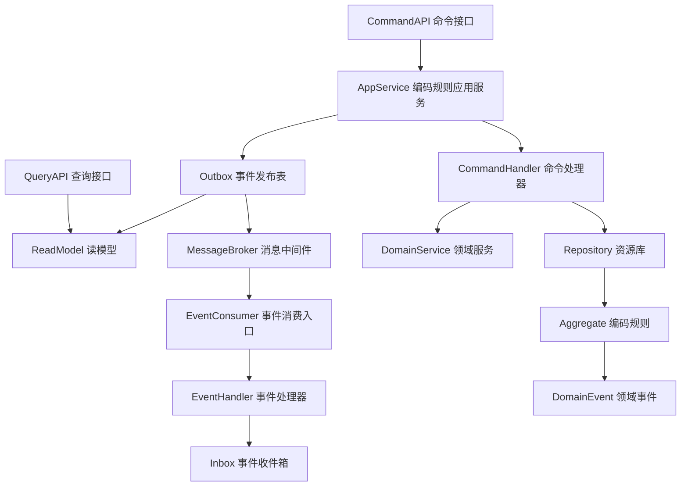
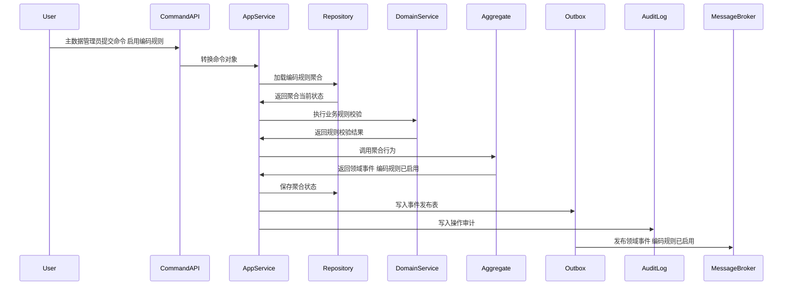
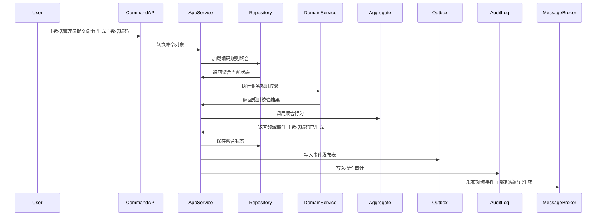
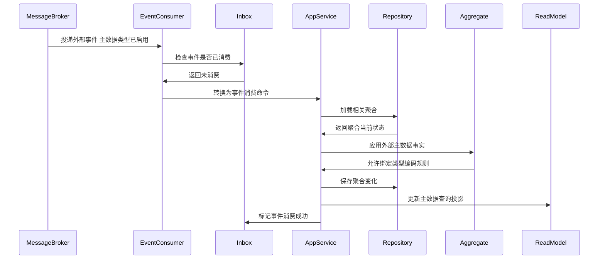
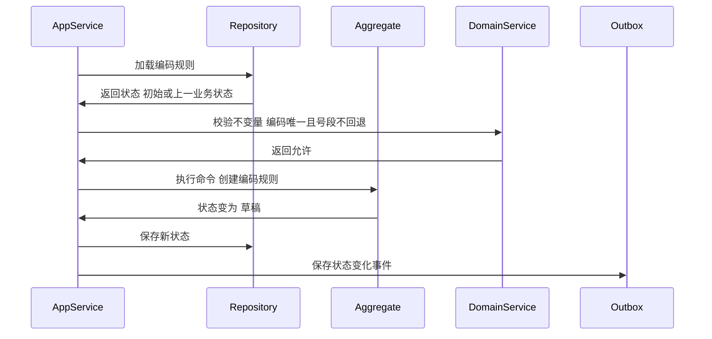

# 编码规则聚合 CQRS 深度设计

> 所属上下文：主数据领域。本文按 DDD + CQRS 深入到聚合属性、命令处理、应用服务编排、领域服务规则、事件产生和事件消费逻辑。关键时序图使用 Mermaid 最小兼容语法，便于 VSCode Markdown 预览稳定渲染。

## 1. 业务目标分析

为不同主数据类型配置编码前缀、日期格式、流水长度、重置周期和号段策略，保证系统内编码唯一且可追溯。

| 设计项 | 结论 |
| --- | --- |
| 限界上下文 | 主数据上下文 |
| 子域类型 | 核心域，编码生成与唯一性 |
| 聚合根 | 编码规则 |
| 数据主权 | 主数据上下文拥有类型定义、字段模板、编码、主数据记录、版本、发布订阅、导入结果和数据质量治理事实；采购、OMS、WMS、库存、BMS 只消费主数据事件、保存必要快照和本地引用，不拥有主数据权威口径。 |
| 主要使用角色 | 主数据管理员、系统管理员、导入任务 |
| 核心不变量 | 同一类型、同一编码规则下生成编码必须唯一；号段不能回退或重复使用；外部只能通过聚合根修改内部实体；命令和消费事件必须幂等 |

## 2. 角色、场景与流程分析

| 场景 | 发起角色 | 应用服务处理逻辑 | 领域服务 | 结果事件 |
| --- | --- | --- | --- | --- |
| 创建编码规则 | 主数据管理员 | 围绕编码规则执行创建编码规则，校验类型、字段、编码、引用、状态、幂等键、审批权限和发布范围 | 编码生成服务 | 编码规则已创建 |
| 启用编码规则 | 主数据管理员 | 围绕编码规则执行启用编码规则，校验类型、字段、编码、引用、状态、幂等键、审批权限和发布范围 | 编码生成服务 | 编码规则已启用 |
| 生成主数据编码 | 主数据管理员 | 围绕编码规则执行生成主数据编码，校验类型、字段、编码、引用、状态、幂等键、审批权限和发布范围 | 编码生成服务 | 主数据编码已生成 |
| 停用编码规则 | 主数据管理员 | 围绕编码规则执行停用编码规则，校验类型、字段、编码、引用、状态、幂等键、审批权限和发布范围 | 编码生成服务 | 编码规则已停用 |

## 3. 领域边界与分层架构

主数据事件的位置要明确区分三层含义：领域层产生权威主数据事实，应用层保存聚合与事件发布表，基础设施层投递消息并消费审批、联调、数据质量和下游回执等外部事实。

## 4. 聚合属性设计

| 属性 | 业务含义 | 模型归属 | 是否可变 | 主要修改命令 | 变化规则 |
| --- | --- | --- | --- | --- | --- |
| codeRuleId | 编码规则ID | 聚合根 | 否 | 创建编码规则 | 全局唯一 |
| codeRuleCode | 编码规则编码或单号 | 值对象 | 否 | 创建编码规则 | 按主数据编码规则生成或录入后校验唯一 |
| typeRef | 主数据类型引用 | 值对象 | 是 | 创建或配置命令 | 关联主数据类型和字段模板版本 |
| businessPayload | 业务载荷 | 值对象 | 是 | 创建、变更、导入命令 | 按字段模板校验必填、唯一、枚举、引用和关键字段 |
| status | 生命周期状态 | 值对象 | 是 | 状态推进命令 | 必须按状态机流转 |
| versionRef | 当前版本引用 | 值对象 | 是 | 启用、变更、发布命令 | 有效变更必须生成版本，版本快照不可覆盖 |
| publishScope | 发布范围 | 值对象 | 是 | 发布或订阅命令 | 定义目标系统、主题、过滤条件和补偿拉取策略 |
| operationLog | 操作记录 | 内部实体集合 | 是 | 所有写命令 | 记录操作者、原因、前后状态和事件编号 |

## 5. 命令与应用服务逻辑

应用服务负责编排主数据用例：校验权限、检查幂等、加载聚合、调用领域服务、执行聚合行为、保存聚合、写发布表、写审计日志。

| 命令 | 发起者 | 应用服务处理逻辑 | 参与领域服务 | 成功后领域事件 |
| --- | --- | --- | --- | --- |
| 创建编码规则 | 主数据管理员 | 加载编码规则聚合，校验字段模板、编码唯一、引用关系、生命周期状态、审批权限和幂等键，执行聚合行为并写入事件发布表 | 编码生成服务 | 编码规则已创建 |
| 启用编码规则 | 主数据管理员 | 加载编码规则聚合，校验字段模板、编码唯一、引用关系、生命周期状态、审批权限和幂等键，执行聚合行为并写入事件发布表 | 编码生成服务 | 编码规则已启用 |
| 生成主数据编码 | 主数据管理员 | 加载编码规则聚合，校验字段模板、编码唯一、引用关系、生命周期状态、审批权限和幂等键，执行聚合行为并写入事件发布表 | 编码生成服务 | 主数据编码已生成 |
| 停用编码规则 | 主数据管理员 | 加载编码规则聚合，校验字段模板、编码唯一、引用关系、生命周期状态、审批权限和幂等键，执行聚合行为并写入事件发布表 | 编码生成服务 | 编码规则已停用 |

### 5.1 应用服务通用处理模板

1. 接口层接收页面请求、导入任务、审批回调或下游回执，并转换为命令对象。
2. 应用层校验用户、角色、组织、主数据类型、字段权限、数据范围和审批权限。
3. 使用 `来源系统 + 来源单号 + 命令类型 + 幂等键` 做幂等检查。
4. 通过资源库加载 `编码规则` 聚合根，新建场景先校验业务唯一性。
5. 调用领域服务完成字段模板、编码规则、引用关系、关键字段、版本和发布范围的判断。
6. 聚合根执行行为，修改属性、内部实体和值对象，并产生领域事件。
7. 同一事务保存聚合、事件发布表和操作审计。
8. 事件发布器异步投递事件，读模型投影器更新主数据查询模型。

### 5.2 关键命令处理细节

| 关键命令 | 前置校验 | 聚合行为 | 异常或补偿处理 |
| --- | --- | --- | --- |
| 创建编码规则 | 编码规则处于允许状态，编码唯一，字段模板有效，引用关系存在，命令未重复 | 修改编码规则状态为`草稿`，记录快照或明细，产生`编码规则已创建` | 状态不匹配则拒绝；校验失败返回错误清单；发布失败进入重试或补偿拉取 |
| 启用编码规则 | 编码规则处于允许状态，编码唯一，字段模板有效，引用关系存在，命令未重复 | 修改编码规则状态为`已启用`，记录快照或明细，产生`编码规则已启用` | 状态不匹配则拒绝；校验失败返回错误清单；发布失败进入重试或补偿拉取 |
| 生成主数据编码 | 编码规则处于允许状态，编码唯一，字段模板有效，引用关系存在，命令未重复 | 修改编码规则状态为`已使用`，记录快照或明细，产生`主数据编码已生成` | 状态不匹配则拒绝；校验失败返回错误清单；发布失败进入重试或补偿拉取 |
| 停用编码规则 | 编码规则处于允许状态，编码唯一，字段模板有效，引用关系存在，命令未重复 | 修改编码规则状态为`已停用`，记录快照或明细，产生`编码规则已停用` | 状态不匹配则拒绝；校验失败返回错误清单；发布失败进入重试或补偿拉取 |

## 6. 领域服务逻辑

| 领域服务 | 核心逻辑 |
| --- | --- |
| 编码生成服务 | 处理编码规则中跨类型、跨字段模板、跨编码规则、跨引用对象或跨目标系统的业务判断，保证主数据口径、版本和发布契约一致。 |
| 号段冲突检查服务 | 处理编码规则中跨类型、跨字段模板、跨编码规则、跨引用对象或跨目标系统的业务判断，保证主数据口径、版本和发布契约一致。 |
| 编码规则兼容服务 | 处理编码规则中跨类型、跨字段模板、跨编码规则、跨引用对象或跨目标系统的业务判断，保证主数据口径、版本和发布契约一致。 |

## 7. 事件产生逻辑

| 领域事件 | 触发命令 | 关键载荷 | 主要消费者 |
| --- | --- | --- | --- |
| 编码规则已创建 | 创建编码规则 | 聚合ID、类型编码、主数据编码、版本号、状态`草稿`、变更摘要、目标系统、操作者、幂等键 | 采购、OMS、WMS、中央库存、BMS、供应商系统、读模型、审计日志 |
| 编码规则已启用 | 启用编码规则 | 聚合ID、类型编码、主数据编码、版本号、状态`已启用`、变更摘要、目标系统、操作者、幂等键 | 采购、OMS、WMS、中央库存、BMS、供应商系统、读模型、审计日志 |
| 主数据编码已生成 | 生成主数据编码 | 聚合ID、类型编码、主数据编码、版本号、状态`已使用`、变更摘要、目标系统、操作者、幂等键 | 采购、OMS、WMS、中央库存、BMS、供应商系统、读模型、审计日志 |
| 编码规则已停用 | 停用编码规则 | 聚合ID、类型编码、主数据编码、版本号、状态`已停用`、变更摘要、目标系统、操作者、幂等键 | 采购、OMS、WMS、中央库存、BMS、供应商系统、读模型、审计日志 |

### 7.1 事件生成规则

- 领域事件使用过去式命名，只表达已经发生的主数据事实。
- 聚合根在业务行为成功后产生领域事件；应用服务负责收集、持久化和发布。
- 事件载荷必须包含事件编号、事件版本、发生时间、来源上下文、聚合ID、聚合版本、主数据类型、主数据编码、变更摘要、操作者和幂等键。
- 命令幂等命中时，返回原处理结果，不能重复启用、发布、导入、生成版本或创建质量问题。
- 外部事件消费必须先进入事件收件箱，再由应用服务加载聚合并执行本地主数据行为。

## 8. 事件订阅与消费逻辑

| 订阅事件 | 处理应用服务 | 消费后数据变化 | 幂等键 |
| --- | --- | --- | --- |
| 主数据类型已启用 | 编码规则应用服务 | 允许绑定类型编码规则 | 来源上下文+事件编号+业务主键 |
| 导入任务已创建 | 编码规则应用服务 | 为缺失编码的导入行分配编码 | 来源上下文+事件编号+业务主键 |
| 审批已完成 | 审批结果消费服务 | 根据审批结果推进启用、驳回或变更生效 | 审批上下文+事件编号+审批单号 |
| 下游回执已返回 | 发布回执消费服务 | 更新发布日志、订阅状态和补偿任务 | 目标系统+事件编号+发布任务号 |

## 9. 关键时序图

以下时序图使用 Mermaid 最小兼容语法，只保留基础参与者、基础消息和单向调用，避免旧版 Markdown 插件解析失败。

### 9.1 命令处理、聚合变更与事件发布

### 9.2 典型业务命令一

### 9.3 典型业务命令二

### 9.4 事件订阅、幂等消费与本地状态变化

### 9.5 聚合状态推进时序

## 10. 异常、补偿、幂等、权限、审计

| 类型 | 设计 |
| --- | --- |
| 异常 | 前缀冲突、流水号耗尽、重置周期错误、并发生成重复、手工录入编码与规则冲突。 |
| 补偿 | 支持错误清单、重新提交、补生成版本、重试发布、下游补偿拉取、冻结新业务和人工治理 |
| 幂等 | 命令幂等键使用来源系统、来源单号、命令类型和请求流水；事件消费幂等使用事件编号和业务主键 |
| 权限 | 按角色、组织、主数据类型、字段、关键字段、审批节点和发布目标系统控制 |
| 审计 | 所有写命令记录请求摘要、操作者、原因、前后状态、字段差异、版本号、事件编号和下游回执编号 |

## 11. 读模型设计

| 读模型 | 用途 | 数据来源 | 刷新方式 |
| --- | --- | --- | --- |
| 编码规则列表读模型 | 列表查询、条件筛选、分页和导出 | 聚合事件投影 + 类型和字段模板快照 | 事件投影更新 |
| 编码规则详情读模型 | 查看字段、状态、版本、发布范围、错误明细和操作记录 | 聚合当前状态 + 操作日志 | 写命令后同步刷新 |
| 主数据工作台读模型 | 展示待审核、待发布、发布失败、质量问题和导入异常 | 多聚合事件汇总 | 异步投影 |
| 主数据变更追溯读模型 | 按类型、编码、版本、字段差异追溯历史 | 版本事件、发布日志、操作审计 | 事件增量 + 定时校准 |

## 12. 当前结论与待确认问题

当前结论：`编码规则` 是主数据权威口径治理中的关键聚合，写侧必须以聚合根保护编码、字段模板、版本、状态、发布和幂等不变量，读侧使用投影支撑列表、详情、工作台和追溯。

关键假设：主数据系统拥有基础资料权威口径；子系统只消费、缓存和引用，不能绕过主数据创建核心口径。

待确认问题：枚举、税率、币种、组织是否全部归主数据统一治理；如果部分归平台配置，需要在后续字段模型和上下文映射中拆开边界。
