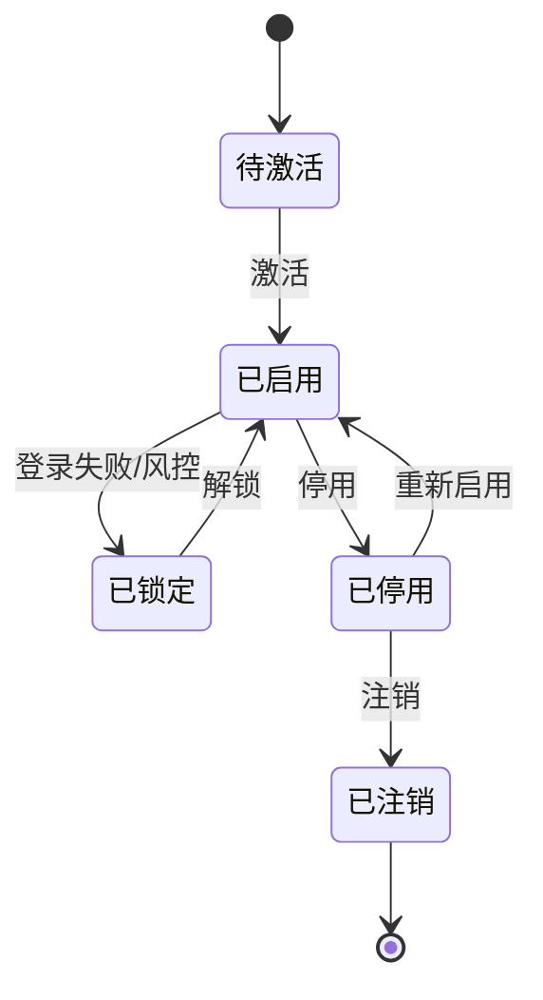
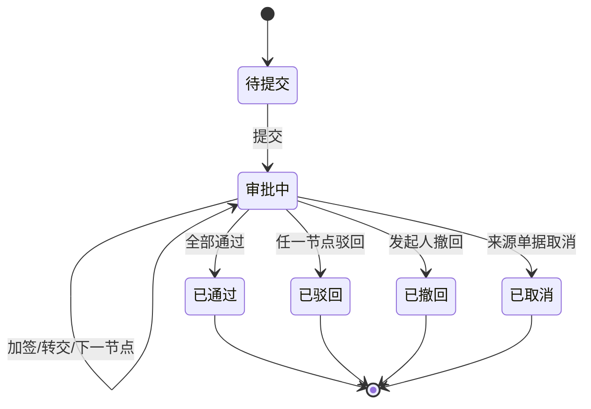

# 01 权限系统领域模型

> 本文用于权限系统领域模型设计，承接 [权限系统功能设计](37-权限系统功能设计.md) 和 [权限系统详细设计](38-权限系统详细设计.md)。本文覆盖权限系统从应用接入、单点登录、用户、组织、角色、权限点、数据权限、Token、审批、操作日志到安全策略的完整身份与授权生命周期。

## 1. 事件风暴

### 1.1 业务目标

权限系统解决的是：供应链各子系统中“谁可以登录、能看到哪些页面、能点击哪些按钮、能调用哪些 API、能看哪些业务数据、谁审批了什么、谁操作了什么”。

完整权限生命周期：

```text
应用接入 SSO
  -> 菜单页面和权限点注册
  -> 用户创建和组织绑定
  -> 角色创建和授权
  -> 用户分配角色和数据范围
  -> 用户登录获取 Token
  -> 子系统校验 Token 和权限
  -> 业务审批流转
  -> 记录登录、授权、审批、敏感操作日志
  -> 权限变更后刷新缓存和会话
```

### 1.2 事件风暴总表

| 阶段 | 角色/系统 | 命令/事件 | 处理对象 | 领域事件 | 策略/后续动作 | 读模型 | 异常 |
| --- | --- | --- | --- | --- | --- | --- | --- |
| 应用接入 | 管理员 | 创建应用/SSO 客户端 | 应用、客户端 | 应用已接入 | 可维护菜单和权限 | 应用管理页 | 回调地址非法 |
| 权限注册 | 管理员/子系统 | 创建菜单和权限点 | 菜单、权限点 | 权限点已注册 | 角色可授权 | 权限点页 | 权限编码重复 |
| 用户建档 | 管理员/HR | 创建用户 | 用户 | 用户已创建 | 待激活或启用 | 用户管理页 | 手机/账号重复 |
| 角色授权 | 管理员 | 给角色分配权限 | 角色 | 角色权限已变更 | 刷新权限版本 | 角色授权页 | 越权授权 |
| 用户授权 | 管理员 | 给用户分配角色和数据范围 | 用户角色、数据权限 | 用户权限已变更 | 子系统刷新缓存 | 用户角色页 | 角色冲突 |
| 登录 | 用户 | 登录 | 会话 Token | 用户已登录 | 返回 Token 和权限 | 会话管理页 | 密码错、锁定 |
| API 校验 | 子系统 | 校验 Token/权限 | Token、权限快照 | 权限校验已通过/拒绝 | 允许或拒绝 API | 审计日志 | Token 过期 |
| 审批 | 业务系统/审批人 | 提交/审批 | 审批实例 | 审批已开始 / 已完成 | 回写业务系统 | 待办中心 | 重复审批 |
| 审计 | 子系统 | 写入操作日志 | 操作日志 | 审计日志已创建 | 支撑追溯 | 操作日志页 | 日志缺失 |
| 安全 | 系统 | 锁定/停用/强制下线 | 用户、会话 | 用户已锁定 / 已下线 | 回收权限 | 安全看板 | 风险登录 |

### 1.3 通用语言

| 术语 | 定义 |
| --- | --- |
| 用户 | 可以登录系统或调用系统的身份主体 |
| 应用 | 接入 SSO 和权限体系的业务系统，如 OMS、WMS、采购、BMS |
| 角色 | 一组权限点和默认数据范围的集合 |
| 权限点 | 菜单、页面、按钮、API、字段等可授权资源 |
| 数据权限 | 用户能访问的组织、仓库、货主、供应商、客户等数据范围 |
| Token | 用户登录后的访问凭证 |
| 审批实例 | 某个业务审批请求的流程运行实例 |
| 审计日志 | 对登录、授权、审批、敏感写操作的只追加记录 |

## 2. 子域、限界上下文、上下文映射、核心域

### 2.1 子域划分

| 子域 | 类型 | 说明 | 建模策略 |
| --- | --- | --- | --- |
| 身份认证 | 通用域 | 登录、SSO、Token、MFA、会话 | 稳定建模用户和会话 |
| 授权模型 | 通用域/核心支撑 | 应用、菜单、权限点、角色、用户角色 | 深入建模权限点和角色授权 |
| 数据权限 | 核心支撑 | 组织、仓库、货主、供应商、客户等范围控制 | 深入建模数据范围和权限计算 |
| 审批流 | 支撑域 | 业务审批模板、实例、任务 | 建模审批实例和节点 |
| 审计与安全 | 通用域 | 登录日志、操作日志、安全策略 | 只追加日志，风险动作可拦截 |
| 业务系统 | 下游上下文 | 采购、OMS、WMS、BMS 等消费权限结果 | 子系统不各自创造角色体系 |

### 2.2 限界上下文模板

```markdown
上下文名称：权限上下文
子域类型：通用域/核心支撑域
业务目标：统一管理身份、登录、角色、权限点、数据权限、审批和审计。
负责范围：应用接入、SSO 客户端、用户、组织岗位、角色、权限点、菜单、角色授权、用户授权、数据权限、Token 会话、审批实例、待办、操作日志、安全策略。
不负责范围：不执行业务单据；不改业务状态；不记库存账；不生成费用；不维护业务主数据事实。
核心聚合：应用、用户、角色、权限点、数据权限、会话 Token、审批实例、操作日志、安全策略。
数据主权：身份、授权、权限版本、数据范围、审批结果、审计日志。
生产事件：用户已创建、用户权限已变更、角色权限已变更、用户已停用、审批已开始、审批已完成、审计日志已创建。
消费事件：员工已入职、员工已离职、主数据已变更、审批请求已提交、审批请求已取消、敏感操作已发生。
一致性要求：用户授权和权限版本强一致；子系统权限缓存最终一致；审计日志只追加不可改。
异常补偿：Token 过期、权限缓存未刷新、越权访问、审批重复、日志写入失败、离职权限未回收。
```

### 2.3 上下文映射

| 上游上下文 | 下游上下文 | 映射关系 | 协作方式 |
| --- | --- | --- | --- |
| 权限系统 | 业务子系统 | 开放主机服务 | 提供登录、Token 校验、权限查询、数据范围查询 |
| 主数据 | 权限系统 | 遵奉者 | 权限系统消费组织、仓库、货主、供应商、客户作为数据权限对象 |
| HR/组织系统 | 权限系统 | 发布语言 | 入职创建用户，离职停用用户 |
| 业务系统 | 权限系统 | 客户/供应商关系 | 提交审批请求、写入审计日志、校验权限 |
| 权限系统 | 业务系统 | 发布语言 | 用户权限变更、角色变更、审批完成通知 |

## 3. 实体、值对象、聚合

| 聚合 | 聚合根 | 内部实体 | 值对象 | 主要不变量 |
| --- | --- | --- | --- | --- |
| 应用 | SysApp | SSO 客户端、菜单 | 应用编码、回调地址 | 停用应用不能登录 |
| 用户 | User | 用户角色、登录凭证、MFA 设置 | 用户状态、绑定对象 | 停用用户不能登录；账号唯一 |
| 角色 | Role | 角色权限 | 角色类型、应用范围 | 停用角色不再授权 |
| 权限点 | Permission | API 绑定、字段绑定 | 权限编码、动作类型 | 权限编码全局唯一 |
| 数据权限 | DataScope | 数据范围项 | 组织/仓库/货主/供应商/客户范围 | 有功能权限也必须满足数据权限 |
| 会话 | UserSession | Token、刷新记录 | 过期时间、客户端 | Token 过期不可用 |
| 审批实例 | ApprovalInstance | 审批节点、审批任务 | 业务类型、版本、结果 | 同业务单据同版本只有一个有效审批 |
| 操作日志 | OperationLog | 日志扩展 | 操作对象、结果、IP | 审计日志只追加不可改 |

## 4. 聚合根、领域服务、资源库、领域事件

### 4.1 聚合模板

```markdown
聚合名称：用户
聚合根：User
业务目标：管理登录身份、用户状态、绑定组织和外部主体。
主要命令：创建用户、激活用户、锁定用户、停用用户、分配角色、取消角色
主要事件：用户已创建、用户已激活、用户已锁定、用户已停用、用户权限已变更
核心不变量：账号唯一；停用和注销用户不能登录；外部用户必须绑定对应供应商/客户/货主。
资源库：UserRepository
```

```markdown
聚合名称：角色
聚合根：Role
业务目标：把一组菜单、按钮、API、字段权限组合成可分配的授权包。
主要命令：创建角色、编辑角色、启停角色、分配权限、取消权限
主要事件：角色已创建、角色权限已变更、角色已停用
核心不变量：停用角色不参与权限计算；授权动作必须记录授权人和时间。
资源库：RoleRepository
```

```markdown
聚合名称：审批实例
聚合根：ApprovalInstance
业务目标：承接业务系统审批请求并产出审批结果。
主要命令：发起审批、审批通过、审批驳回、加签、转交、撤回、取消
主要事件：审批已开始、审批任务已创建、审批已通过、审批已驳回、审批已取消
核心不变量：同一业务单据同一审批版本只能有一个有效审批实例。
资源库：ApprovalInstanceRepository
```

### 4.2 领域服务

| 领域服务 | 解决的问题 |
| --- | --- |
| 权限计算服务 | 组合用户、角色、权限点、数据范围形成最终权限 |
| Token 签发校验服务 | 登录后签发 Token，校验会话、过期和状态 |
| 数据范围判定服务 | 判断用户能访问哪些组织、仓库、货主、供应商、客户 |
| 审批路由服务 | 根据业务类型、金额、组织、角色匹配审批模板和节点 |
| 安全风控服务 | 判断登录失败、异地登录、敏感操作风险 |

### 4.3 资源库与领域事件

| 资源库 | 聚合根 |
| --- | --- |
| `UserRepository` | 用户 |
| `RoleRepository` | 角色 |
| `PermissionRepository` | 权限点 |
| `DataScopeRepository` | 数据权限 |
| `SessionRepository` | 会话 |
| `ApprovalInstanceRepository` | 审批实例 |
| `OperationLogRepository` | 操作日志 |

| 事件 | 关键载荷 | 下游 |
| --- | --- | --- |
| `UserCreated` | 用户、组织、状态 | 子系统、审计 |
| `UserPermissionChanged` | 用户、角色、数据范围、权限版本 | 子系统刷新缓存 |
| `RoleChanged` | 角色、权限点、版本 | 子系统刷新缓存 |
| `UserDisabled` | 用户、原因 | 子系统强制下线 |
| `ApprovalStarted` | 审批实例、业务单据 | 待办中心 |
| `ApprovalCompleted` | 审批实例、业务单据、结果 | 业务系统 |
| `AuditLogCreated` | 操作人、对象、动作、结果 | 审计查询 |

## 5. 状态机模板





## 6. 领域字段归属

| 聚合 | 核心字段 |
| --- | --- |
| 应用 | 应用编码、名称、类型、首页地址、状态、排序 |
| SSO 客户端 | 客户端编码、密钥哈希、回调地址、授权类型、Token 有效期 |
| 用户 | 账号、姓名、手机号、邮箱、用户类型、组织、绑定供应商/客户/货主、MFA、状态 |
| 角色 | 角色编码、名称、类型、适用应用、默认数据范围、状态 |
| 权限点 | 应用、页面、权限编码、权限类型、动作类型、API 方法、API 路径、字段编码 |
| 用户角色 | 用户、角色、授权类型、生效时间、失效时间、授权人 |
| 角色权限 | 角色、权限点、授权状态、授权人、取消授权人 |
| 数据权限 | 用户/角色、范围类型、范围对象、授权来源、状态 |
| 会话 | 用户、客户端、Token、过期时间、登录 IP、状态 |
| 审批实例 | 业务类型、业务 ID、审批版本、当前节点、审批状态、结果 |
| 操作日志 | 操作人、对象类型、对象 ID、动作、结果、失败原因、IP、时间 |

## 7. 应用服务与读模型

| 应用服务 | 编排用例 |
| --- | --- |
| 登录应用服务 | 校验账号、密码/MFA、签发 Token、写登录日志 |
| 用户应用服务 | 用户 CRUD、启停、重置密码、分配角色 |
| 角色应用服务 | 角色 CRUD、分配/取消权限 |
| 权限点应用服务 | 注册菜单、按钮、API、字段权限 |
| 权限校验应用服务 | Token 校验、权限计算、数据范围返回 |
| 审批应用服务 | 发起审批、处理节点、发布审批完成 |
| 审计应用服务 | 写入和查询登录、授权、敏感操作日志 |

| 读模型 | 用途 |
| --- | --- |
| 用户权限视图 | 子系统渲染菜单和按钮 |
| 角色授权树 | 管理员给角色授权 |
| 用户角色视图 | 管理员给用户分配角色 |
| 数据权限视图 | 查看组织、仓库、货主、供应商、客户范围 |
| 待办中心 | 审批人处理审批 |
| 审计日志查询 | 审计人员追溯敏感操作 |

## 8. 关键不变量与补偿

| 场景 | 不变量 | 补偿 |
| --- | --- | --- |
| 登录 | 停用、锁定、注销用户不能登录 | 拒绝登录，记录失败日志 |
| 授权 | 权限编码唯一，授权人必须有管理权限 | 拦截越权授权 |
| 数据权限 | 有功能权限不代表有数据权限 | API 返回 403 并记录拒绝日志 |
| Token | Token 过期或权限版本失效必须重新校验 | 刷新缓存或强制下线 |
| 审批 | 同业务单据同版本只能一个有效审批 | 幂等返回原实例 |
| 审计 | 日志只追加不可改 | 日志失败重试，必要时阻断敏感操作 |

## 9. 当前结论

权限系统不是简单用户表和角色表。完整权限领域应围绕 `身份认证`、`应用接入`、`菜单页面`、`权限点`、`角色授权`、`用户授权`、`数据权限`、`审批流`、`Token 会话` 和 `审计日志` 建模。

## 10. 继续上下文

当前结论：本文是完整“权限系统领域模型”，覆盖 SSO、用户、角色、权限点、菜单、数据权限、Token、审批、审计和安全策略。

关键假设：权限系统拥有身份、授权、审批和审计事实；业务系统只消费权限结果并执行业务命令。

待决问题：审批流是权限系统内部能力还是独立流程引擎，后续可根据复杂度拆出独立审批上下文。

## 聚合审计补充

本轮已按聚合/聚合根补充 CQRS 落地文档，覆盖命令、应用服务、领域服务、读模型、生产事件和订阅事件：

- [应用聚合 CQRS 设计](./02-应用聚合CQRS设计.md)
- [用户聚合 CQRS 设计](./03-用户聚合CQRS设计.md)
- [角色聚合 CQRS 设计](./04-角色聚合CQRS设计.md)
- [权限点聚合 CQRS 设计](./05-权限点聚合CQRS设计.md)
- [数据权限聚合 CQRS 设计](./06-数据权限聚合CQRS设计.md)
- [会话Token聚合 CQRS 设计](./07-会话Token聚合CQRS设计.md)
- [审批实例聚合 CQRS 设计](./08-审批实例聚合CQRS设计.md)
- [操作日志聚合 CQRS 设计](./09-操作日志聚合CQRS设计.md)
- [安全策略聚合 CQRS 设计](./10-安全策略聚合CQRS设计.md)
