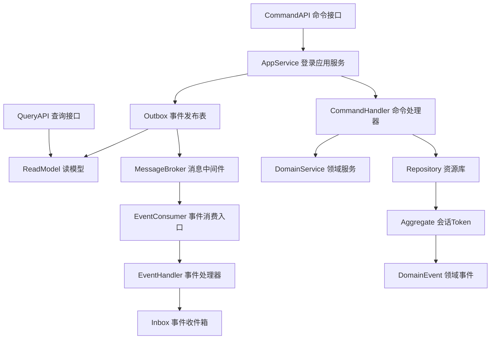
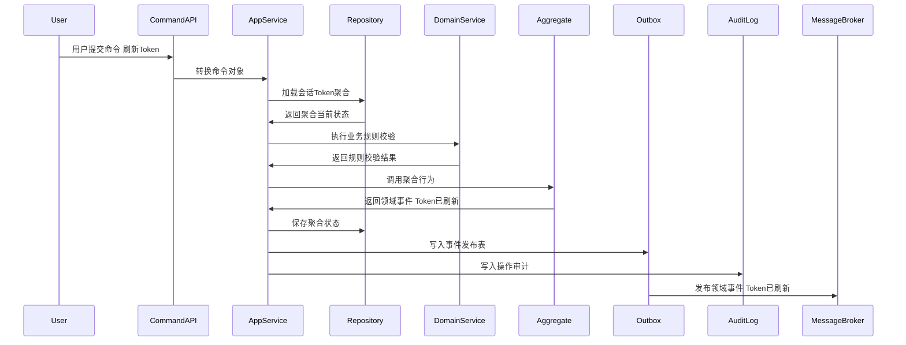
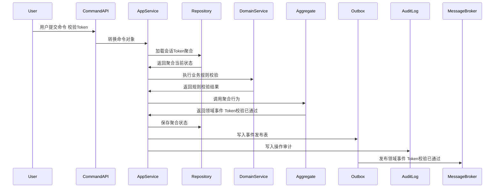
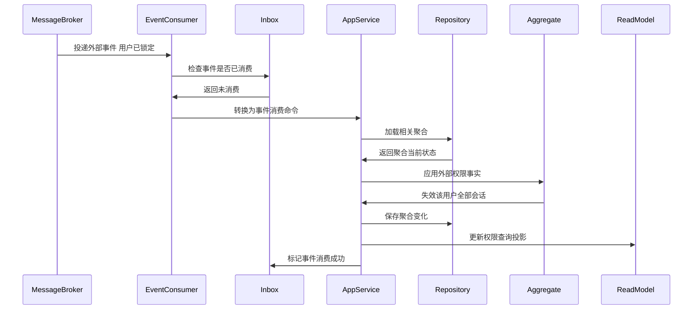
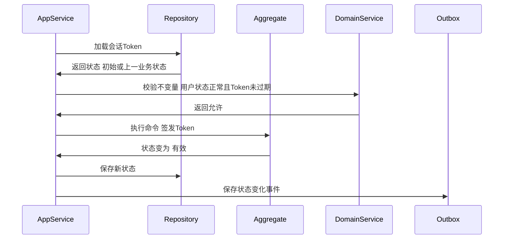

# 会话Token聚合 CQRS 深度设计

> 所属上下文：权限系统领域。本文按 DDD + CQRS 深入到聚合属性、命令处理、应用服务编排、领域服务规则、事件产生和事件消费逻辑。关键时序图使用 Mermaid 最小兼容语法，便于 VSCode Markdown 预览稳定渲染。

## 1. 业务目标分析

维护登录会话、访问令牌、刷新令牌、设备、过期时间、权限版本、失效和强制下线。

| 设计项 | 结论 |
| --- | --- |
| 限界上下文 | 权限上下文 |
| 子域类型 | 通用域，认证会话 |
| 聚合根 | 会话Token |
| 数据主权 | 权限上下文拥有应用接入、身份、角色、权限点、数据范围、会话、审批结果、审计日志和安全策略事实；业务系统只消费权限结果、提交审批请求、写入审计事件，不直接修改权限权威口径。 |
| 主要使用角色 | 用户、子系统、权限系统、安全风控 |
| 核心不变量 | Token 过期、用户停用、权限版本失效或会话被踢出时不可继续使用；外部只能通过聚合根修改内部实体；命令和消费事件必须幂等 |

## 2. 角色、场景与流程分析

| 场景 | 发起角色 | 应用服务处理逻辑 | 领域服务 | 结果事件 |
| --- | --- | --- | --- | --- |
| 签发Token | 用户 | 围绕会话Token执行签发Token，校验身份、应用、授权范围、状态、权限版本、幂等键和审计要求 | Token签发校验服务 | 用户已登录 |
| 刷新Token | 用户 | 围绕会话Token执行刷新Token，校验身份、应用、授权范围、状态、权限版本、幂等键和审计要求 | Token签发校验服务 | Token已刷新 |
| 校验Token | 用户 | 围绕会话Token执行校验Token，校验身份、应用、授权范围、状态、权限版本、幂等键和审计要求 | Token签发校验服务 | Token校验已通过 |
| 失效Token | 用户 | 围绕会话Token执行失效Token，校验身份、应用、授权范围、状态、权限版本、幂等键和审计要求 | Token签发校验服务 | Token已失效 |
| 踢出会话 | 用户 | 围绕会话Token执行踢出会话，校验身份、应用、授权范围、状态、权限版本、幂等键和审计要求 | Token签发校验服务 | 会话已踢出 |

## 3. 领域边界与分层架构

权限事件的位置要明确区分三层含义：领域层产生身份、授权、审批和审计事实，应用层保存聚合与事件发布表，基础设施层投递消息并消费 HR、主数据、业务系统和安全风控的外部事实。

## 4. 聚合属性设计

| 属性 | 业务含义 | 模型归属 | 是否可变 | 主要修改命令 | 变化规则 |
| --- | --- | --- | --- | --- | --- |
| sessionId | 会话TokenID | 聚合根 | 否 | 签发Token | 全局唯一 |
| tokenId | 会话Token编码或单号 | 值对象 | 否 | 签发Token | 全局唯一或在应用内唯一 |
| subjectRef | 身份主体引用 | 值对象 | 是 | 登录或授权命令 | 关联用户、外部主体、组织或客户端 |
| appRef | 应用引用 | 值对象 | 是 | 接入或授权命令 | 关联子系统、客户端、菜单、API 和回调地址 |
| permissionSnapshot | 权限快照 | 值对象 | 是 | 授权、登录、校验命令 | 保存角色、权限点、数据范围和权限版本 |
| status | 生命周期状态 | 值对象 | 是 | 状态推进命令 | 必须按状态机流转 |
| securitySnapshot | 安全快照 | 值对象 | 是 | 登录、风控、策略命令 | 保存 MFA、IP、设备、失败次数、风险等级和有效期 |
| operationLog | 操作记录 | 内部实体集合 | 是 | 所有写命令 | 记录操作者、原因、前后状态、权限版本和事件编号 |

## 5. 命令与应用服务逻辑

应用服务负责编排权限用例：校验权限、检查幂等、加载聚合、调用领域服务、执行聚合行为、保存聚合、写发布表、写审计日志。

| 命令 | 发起者 | 应用服务处理逻辑 | 参与领域服务 | 成功后领域事件 |
| --- | --- | --- | --- | --- |
| 签发Token | 用户 | 加载会话Token聚合，校验账号、应用、角色、权限点、数据范围、审批状态、风险策略和幂等键，执行聚合行为并写入事件发布表 | Token签发校验服务 | 用户已登录 |
| 刷新Token | 用户 | 加载会话Token聚合，校验账号、应用、角色、权限点、数据范围、审批状态、风险策略和幂等键，执行聚合行为并写入事件发布表 | Token签发校验服务 | Token已刷新 |
| 校验Token | 用户 | 加载会话Token聚合，校验账号、应用、角色、权限点、数据范围、审批状态、风险策略和幂等键，执行聚合行为并写入事件发布表 | Token签发校验服务 | Token校验已通过 |
| 失效Token | 用户 | 加载会话Token聚合，校验账号、应用、角色、权限点、数据范围、审批状态、风险策略和幂等键，执行聚合行为并写入事件发布表 | Token签发校验服务 | Token已失效 |
| 踢出会话 | 用户 | 加载会话Token聚合，校验账号、应用、角色、权限点、数据范围、审批状态、风险策略和幂等键，执行聚合行为并写入事件发布表 | Token签发校验服务 | 会话已踢出 |

### 5.1 应用服务通用处理模板

1. 接口层接收页面请求、SSO 请求、Token 校验请求、审批请求、审计写入或外部事件，并转换为命令对象。
2. 应用层校验用户、角色、应用、组织、数据范围、管理权限和敏感操作权限。
3. 使用 `来源系统 + 来源单号 + 命令类型 + 幂等键` 做幂等检查。
4. 通过资源库加载 `会话Token` 聚合根，新建场景先校验业务唯一性。
5. 调用领域服务完成账号状态、角色授权、权限点、数据范围、安全策略、审批状态和 Token 有效性的判断。
6. 聚合根执行行为，修改属性、内部实体和值对象，并产生领域事件。
7. 同一事务保存聚合、事件发布表和操作审计。
8. 事件发布器异步投递事件，读模型投影器更新权限查询模型和缓存版本。

### 5.2 关键命令处理细节

| 关键命令 | 前置校验 | 聚合行为 | 异常或补偿处理 |
| --- | --- | --- | --- |
| 签发Token | 会话Token处于允许状态，授权人有管理权限，权限范围合法，命令未重复 | 修改会话Token状态为`有效`，刷新权限版本或安全快照，产生`用户已登录` | 状态不匹配则拒绝；越权授权拦截；缓存失效后要求重新拉取权限 |
| 刷新Token | 会话Token处于允许状态，授权人有管理权限，权限范围合法，命令未重复 | 修改会话Token状态为`有效`，刷新权限版本或安全快照，产生`Token已刷新` | 状态不匹配则拒绝；越权授权拦截；缓存失效后要求重新拉取权限 |
| 校验Token | 会话Token处于允许状态，授权人有管理权限，权限范围合法，命令未重复 | 修改会话Token状态为`有效`，刷新权限版本或安全快照，产生`Token校验已通过` | 状态不匹配则拒绝；越权授权拦截；缓存失效后要求重新拉取权限 |
| 失效Token | 会话Token处于允许状态，授权人有管理权限，权限范围合法，命令未重复 | 修改会话Token状态为`已失效`，刷新权限版本或安全快照，产生`Token已失效` | 状态不匹配则拒绝；越权授权拦截；缓存失效后要求重新拉取权限 |

## 6. 领域服务逻辑

| 领域服务 | 核心逻辑 |
| --- | --- |
| Token签发校验服务 | 处理会话Token中跨用户、角色、应用、权限点、数据范围、安全策略或审批实例的判断，保证最终权限、安全状态和审计链路一致。 |
| Token风险判定服务 | 处理会话Token中跨用户、角色、应用、权限点、数据范围、安全策略或审批实例的判断，保证最终权限、安全状态和审计链路一致。 |
| 权限版本校验服务 | 处理会话Token中跨用户、角色、应用、权限点、数据范围、安全策略或审批实例的判断，保证最终权限、安全状态和审计链路一致。 |

## 7. 事件产生逻辑

| 领域事件 | 触发命令 | 关键载荷 | 主要消费者 |
| --- | --- | --- | --- |
| 用户已登录 | 签发Token | 聚合ID、应用、用户、角色、权限点、数据范围、权限版本、状态`有效`、操作者、原因、幂等键 | 业务子系统、权限缓存、审计日志、安全风控、待办中心、读模型 |
| Token已刷新 | 刷新Token | 聚合ID、应用、用户、角色、权限点、数据范围、权限版本、状态`有效`、操作者、原因、幂等键 | 业务子系统、权限缓存、审计日志、安全风控、待办中心、读模型 |
| Token校验已通过 | 校验Token | 聚合ID、应用、用户、角色、权限点、数据范围、权限版本、状态`有效`、操作者、原因、幂等键 | 业务子系统、权限缓存、审计日志、安全风控、待办中心、读模型 |
| Token已失效 | 失效Token | 聚合ID、应用、用户、角色、权限点、数据范围、权限版本、状态`已失效`、操作者、原因、幂等键 | 业务子系统、权限缓存、审计日志、安全风控、待办中心、读模型 |
| 会话已踢出 | 踢出会话 | 聚合ID、应用、用户、角色、权限点、数据范围、权限版本、状态`已踢出`、操作者、原因、幂等键 | 业务子系统、权限缓存、审计日志、安全风控、待办中心、读模型 |

### 7.1 事件生成规则

- 领域事件使用过去式命名，只表达已经发生的身份、授权、审批、安全或审计事实。
- 聚合根在业务行为成功后产生领域事件；应用服务负责收集、持久化和发布。
- 事件载荷必须包含事件编号、事件版本、发生时间、来源上下文、聚合ID、聚合版本、应用、用户、权限版本、操作者、原因和幂等键。
- 命令幂等命中时，返回原处理结果，不能重复授权、重复审批、重复签发会话或重复写入审计事实。
- 外部事件消费必须先进入事件收件箱，再由应用服务加载聚合并执行本地权限行为。

## 8. 事件订阅与消费逻辑

| 订阅事件 | 处理应用服务 | 消费后数据变化 | 幂等键 |
| --- | --- | --- | --- |
| 用户已锁定 | 登录应用服务 | 失效该用户全部会话 | 来源上下文+事件编号+业务主键 |
| 角色权限已变更 | 登录应用服务 | 标记相关会话权限版本过期 | 来源上下文+事件编号+业务主键 |
| 主数据已变更 | 权限对象同步服务 | 更新组织、仓库、货主、供应商、客户等数据范围对象快照 | 主数据上下文+事件编号+对象编码 |
| 安全风险已识别 | 安全风控消费服务 | 锁定账号、失效会话或要求重新认证 | 安全上下文+事件编号+风险编号 |

## 9. 关键时序图

以下时序图使用 Mermaid 最小兼容语法，只保留基础参与者、基础消息和单向调用，避免旧版 Markdown 插件解析失败。

### 9.1 命令处理、聚合变更与事件发布

### 9.2 典型业务命令一

### 9.3 典型业务命令二

### 9.4 事件订阅、幂等消费与本地状态变化

### 9.5 聚合状态推进时序

## 10. 异常、补偿、幂等、权限、审计

| 类型 | 设计 |
| --- | --- |
| 异常 | 密码错误、MFA 失败、Token 过期、刷新令牌复用、权限版本过期、异地登录风险、用户停用未下线。 |
| 补偿 | 支持权限缓存刷新、强制下线、重新认证、审批撤回、授权回滚、日志重试和人工安全复核 |
| 幂等 | 命令幂等键使用来源系统、来源单号、命令类型和请求流水；事件消费幂等使用事件编号和业务主键 |
| 权限 | 按应用、角色、权限点、数据范围、字段、金额阈值、审批节点和安全等级控制 |
| 审计 | 所有登录、授权、审批、Token、数据权限、敏感操作和失败拒绝都记录请求摘要、操作者、对象、前后状态、IP、设备和事件编号 |

## 11. 读模型设计

| 读模型 | 用途 | 数据来源 | 刷新方式 |
| --- | --- | --- | --- |
| 会话Token列表读模型 | 列表查询、条件筛选、分页和导出 | 聚合事件投影 + 用户应用快照 | 事件投影更新 |
| 会话Token详情读模型 | 查看授权、状态、版本、安全快照、审批节点和操作记录 | 聚合当前状态 + 操作日志 | 写命令后同步刷新 |
| 用户权限视图 | 子系统渲染菜单、按钮、API 和字段权限 | 用户、角色、权限点、数据权限事件汇总 | 授权事件增量刷新 |
| 权限审计视图 | 查询登录、授权、审批、拒绝访问和敏感操作 | 操作日志、会话、安全策略事件 | 只追加投影 |

## 12. 当前结论与待确认问题

当前结论：`会话Token` 是权限系统领域中的关键聚合，写侧必须以聚合根保护身份、授权、数据范围、审批、安全和审计不变量，读侧使用投影支撑权限计算、菜单渲染、数据过滤和审计追溯。

关键假设：权限系统拥有身份和授权权威口径；业务系统消费权限结果，但业务状态仍由各业务上下文自己拥有。

待确认问题：审批流是否长期留在权限系统内，还是后续拆成独立流程引擎；这会影响审批实例和业务系统之间的上下文映射。
