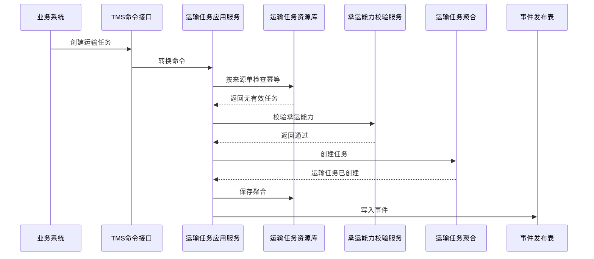

# 运输任务聚合 CQRS 设计

## 1. 业务目标

运输任务聚合承接 OMS、采购、供应商、WMS、调拨等系统的运输需求，统一校验来源单据、运输场景、起止地址、物流产品、费用责任和幂等键。

| 设计项 | 结论 |
| --- | --- |
| 限界上下文 | TMS 上下文 |
| 聚合根 | 运输任务 |
| 数据主权 | TMS 拥有运输任务状态、承运校验结果、费用责任和任务版本 |
| 核心不变量 | 同一来源系统 + 来源单号 + 运输场景 + 有效版本不能重复创建有效运输任务 |

## 2. 聚合属性

| 属性 | 业务含义 | 模型归属 | 是否可变 | 主要命令 | 变化规则 |
| --- | --- | --- | --- | --- | --- |
| transportTaskId | 运输任务 ID | 聚合根 | 否 | 创建运输任务 | 全局唯一 |
| transportTaskNo | 运输任务号 | 值对象 | 否 | 创建运输任务 | 按 TMS 编码规则生成 |
| sourceRef | 来源单据 | 值对象 | 否 | 创建运输任务 | 来源系统、来源单号、来源行、场景 |
| scenario | 运输场景 | 值对象 | 否 | 创建运输任务 | 采购入库、销售出库、售后退货、退供、调拨 |
| originAddress | 起点地址快照 | 值对象 | 是 | 创建/变更任务 | 下单后通常不可变，变更需新版本 |
| destinationAddress | 终点地址快照 | 值对象 | 是 | 创建/变更任务 | 影响承运校验和费用 |
| carrierProduct | 承运产品 | 值对象 | 是 | 分配承运商 | 必须来自已启用物流产品 |
| feeResponsibility | 费用责任 | 值对象 | 是 | 创建/调整责任 | 影响 BMS 计费对象 |
| status | 任务状态 | 值对象 | 是 | 状态推进 | 草稿、待下单、已下单、已取消、异常关闭 |

## 3. 命令与事件

| 命令 | 发起者 | 应用服务逻辑 | 领域服务 | 成功事件 |
| --- | --- | --- | --- | --- |
| 创建运输任务 | OMS/采购/WMS/调拨/供应商 | 校验幂等、来源单、主数据和地址，创建任务 | 承运能力校验服务 | 运输任务已创建 |
| 校验承运能力 | 系统 | 校验物流产品、地址、重量体积、禁运、服务区域 | 承运能力校验服务 | 承运能力已确认 / 承运校验失败 |
| 分配承运商 | 物流专员/系统 | 选择承运商和物流产品，写入任务 | 承运商选择服务 | 运输任务已分配承运商 |
| 取消运输任务 | 业务系统/物流专员 | 未下单可取消；已下单需先作废运单 | 取消可行性判定服务 | 运输任务已取消 |
| 异常关闭任务 | 物流专员 | 记录原因、责任方和影响单据 | 异常关闭判定服务 | 运输任务已异常关闭 |

## 4. 事件订阅

| 订阅事件 | 消费后变化 | 幂等键 |
| --- | --- | --- |
| OMS履约单已创建 | 可自动创建销售运输任务 | OMS + 事件号 + 履约单号 |
| 售后退货已审核 | 创建退货取件或客户寄回运输任务 | OMS + 事件号 + 售后单号 |
| ASN已提交 | 创建采购入库运输任务 | 供应商 + 事件号 + ASN号 |
| 调拨已出库 | 创建调拨运输任务 | WMS/调拨 + 事件号 + 调拨单号 |
| 退供已出库 | 创建退供运输任务 | WMS/采购 + 事件号 + 退供单号 |

## 5. 关键时序图

## 6. 读模型

| 读模型 | 用途 |
| --- | --- |
| 运输任务列表 | 按来源系统、场景、状态、仓库、承运商查询 |
| 运输任务详情 | 查看来源单、地址、承运产品、运单、轨迹和费用责任 |
| 下单异常看板 | 查看不可承运、下单失败和待人工处理任务 |

