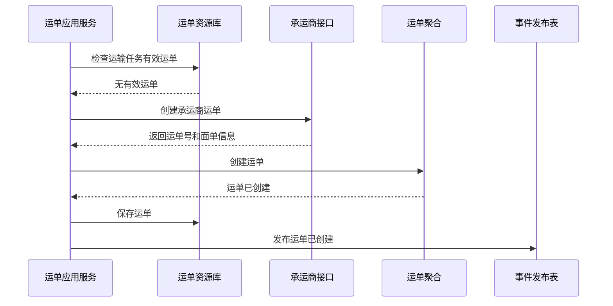

# 运单聚合 CQRS 设计

## 1. 业务目标

运单聚合管理承运商下单、运单号、运输状态、发运、揽收、到达、签收、拒收、作废和异常关闭。

| 设计项 | 结论 |
| --- | --- |
| 限界上下文 | TMS 上下文 |
| 聚合根 | 运单 |
| 数据主权 | TMS 拥有运单号、承运商回执、运输状态和终态 |
| 核心不变量 | 同一有效运输任务不能重复创建有效运单；终态运单不能普通回退 |

## 2. 聚合属性

| 属性 | 业务含义 | 模型归属 | 是否可变 | 主要命令 | 变化规则 |
| --- | --- | --- | --- | --- | --- |
| waybillId | 运单 ID | 聚合根 | 否 | 创建运单 | 全局唯一 |
| waybillNo | 运单号 | 值对象 | 否 | 承运商下单 | 承运商维度唯一 |
| transportTaskRef | 运输任务引用 | 值对象 | 否 | 创建运单 | 关联运输任务 |
| carrierRef | 承运商引用 | 值对象 | 否 | 创建运单 | 来自主数据快照 |
| packageList | 包裹/货物明细 | 内部实体 | 是 | 交接/修正 | 记录包裹、重量、体积、件数 |
| waybillStatus | 运单状态 | 值对象 | 是 | 状态推进 | 按运单状态机流转 |
| carrierReceipt | 承运商回执 | 值对象 | 是 | 创建/回调 | 保存接口返回码、原始摘要 |

## 3. 命令与事件

| 命令 | 发起者 | 应用服务逻辑 | 领域服务 | 成功事件 |
| --- | --- | --- | --- | --- |
| 创建运单 | TMS/物流专员 | 调用承运商或人工录入，保存回执 | 运单幂等服务 | 运单已创建 |
| 作废运单 | 物流专员/业务系统 | 未发运可作废，已揽收需异常处理 | 运单取消判定服务 | 运单已作废 |
| 确认发运 | WMS/供应商 | 接收交接事实，推进已发运 | 交接判定服务 | 运输已发运 |
| 标记揽收 | 承运商回调 | 轨迹驱动状态变更 | 轨迹归并服务 | 运输已揽收 |
| 标记到达 | 承运商回调 | 到达目的仓/客户/供应商 | 轨迹归并服务 | 运输已到达 |
| 标记终态 | 签收应用服务 | 根据签收/拒收/丢失推进终态 | 签收终态判定服务 | 运输已签收 / 运输已拒收 |

## 4. 事件订阅

| 订阅事件 | 消费后变化 | 幂等键 |
| --- | --- | --- |
| 运输任务已创建 | 可触发自动创建运单 | 运输任务号 + 物流产品 + 请求号 |
| WMS包装已完成 | 更新包裹重量体积，满足打单前置 | WMS事件号 + 包裹号 |
| WMS出库已发货 | 运单进入已发运或已揽收 | WMS事件号 + 运单号 |
| 物流轨迹已追加 | 根据节点推进运单在途/到达状态 | 运单号 + 轨迹节点 + 时间 |
| 运输已签收/拒收 | 运单进入终态 | 运单号 + 签收事件号 |

## 5. 关键时序图

## 6. 读模型

| 读模型 | 用途 |
| --- | --- |
| 运单列表 | 查询运单状态、承运商、来源单、运输场景 |
| 运单详情 | 查看任务、包裹、面单、轨迹、签收、异常、费用来源 |
| 运单异常看板 | 查看下单失败、作废失败、终态冲突 |

