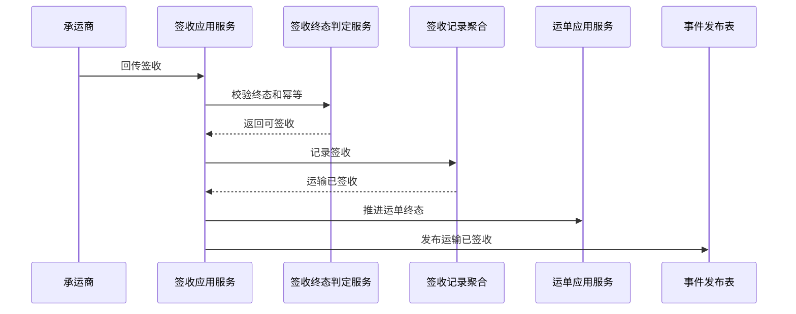

# 签收记录聚合 CQRS 设计

## 1. 业务目标

签收记录聚合保存客户、供应商、调入仓或退货仓的签收、拒收、部分签收和签收异常事实，并通知业务系统推进订单、退供、调拨或退货状态。

| 设计项 | 结论 |
| --- | --- |
| 限界上下文 | TMS 上下文 |
| 聚合根 | 签收记录 |
| 数据主权 | TMS 拥有签收、拒收、部分签收和签收凭证事实 |
| 核心不变量 | 同一运单只能有一个有效终态签收结果；拒收必须有原因和责任方 |

## 2. 命令与事件

| 命令 | 发起者 | 应用服务逻辑 | 领域服务 | 成功事件 |
| --- | --- | --- | --- | --- |
| 记录签收 | 承运商/TMS | 校验运单状态、签收时间和幂等键 | 签收终态判定服务 | 运输已签收 |
| 记录拒收 | 承运商/TMS | 记录拒收原因、责任方和凭证 | 签收终态判定服务 | 运输已拒收 |
| 记录部分签收 | 承运商/TMS | 保存签收数量和差异 | 签收差异判定服务 | 部分签收已发生 |
| 冲正签收 | 物流专员 | 仅异常审批后允许，生成冲正记录 | 签收冲突判定服务 | 签收记录已冲正 |

## 3. 事件订阅

| 订阅事件 | 消费后变化 | 幂等键 |
| --- | --- | --- |
| 承运商签收回调 | 创建签收记录并推进运单终态 | 运单号 + 签收时间 + 签收结果 |
| 物流异常已登记 | 判断是否阻塞签收 | 异常事件号 |
| 运单已作废 | 禁止普通签收 | 运单号 + 作废事件号 |

## 4. 关键时序图

## 5. 读模型

| 读模型 | 用途 |
| --- | --- |
| 签收记录列表 | 查询签收、拒收、部分签收 |
| 签收凭证详情 | 查看签收人、凭证、时间和责任方 |
| 签收异常看板 | 处理签收冲突、拒收、部分签收 |

