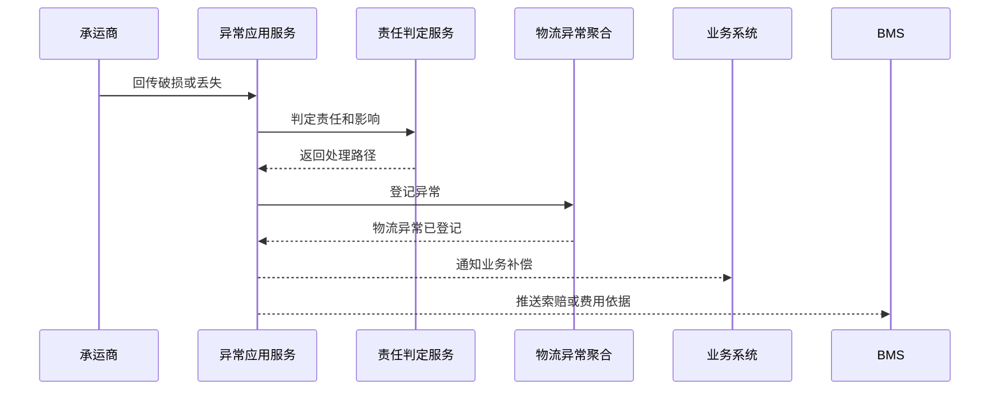

# 物流异常聚合 CQRS 设计

## 1. 业务目标

物流异常聚合处理运输延误、破损、丢失、拒收、承运商拒收、地址异常、费用争议等问题，形成业务补偿和 BMS 索赔依据。

| 设计项 | 结论 |
| --- | --- |
| 限界上下文 | TMS 上下文 |
| 聚合根 | 物流异常 |
| 数据主权 | TMS 拥有运输异常、责任判定、处理记录和索赔来源事实 |
| 核心不变量 | 异常关闭必须有处理结果、责任方和影响单据 |

## 2. 命令与事件

| 命令 | 发起者 | 应用服务逻辑 | 领域服务 | 成功事件 |
| --- | --- | --- | --- | --- |
| 登记物流异常 | 承运商/TMS/业务系统 | 校验运单和异常类型，创建异常 | 物流异常责任判定服务 | 物流异常已登记 |
| 分派异常 | 物流专员 | 指定处理人、时限和责任方 | 异常分派服务 | 物流异常已分派 |
| 处理异常 | 物流专员 | 记录处理方案、索赔、重发或关闭建议 | 补偿路径判定服务 | 物流异常已处理 |
| 关闭异常 | 物流主管 | 校验处理结论和影响单据 | 异常关闭判定服务 | 物流异常已关闭 |

## 3. 事件订阅

| 订阅事件 | 消费后变化 | 幂等键 |
| --- | --- | --- |
| 物流轨迹已追加 | 异常节点自动创建异常 | 运单号 + 轨迹节点 + 异常类型 |
| 运输已拒收 | 创建拒收异常或差异处理 | 运单号 + 签收事件号 |
| BMS对账差异已发生 | 生成费用争议异常 | BMS事件号 + 运单号 |

## 4. 关键时序图

## 5. 读模型

| 读模型 | 用途 |
| --- | --- |
| 物流异常看板 | 按异常类型、责任方、时效、状态处理 |
| 索赔处理页 | 查看破损、丢失、延误索赔依据 |
| 异常影响单据页 | 查看影响的订单、采购、调拨、退供、售后 |

