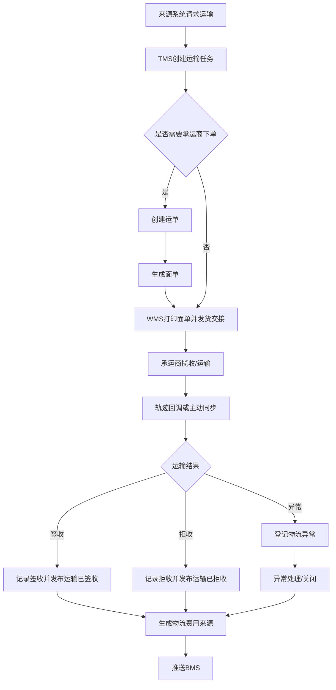

# TMS系统产品功能设计

## 1. 产品定位与设计边界

TMS 系统负责供应链中的运输执行、运单、面单、轨迹、签收、运输异常和物流费用来源管理。它让采购到货、销售发货、销售退货、退供应商、调拨运输都有统一的运输事实记录，避免物流信息分散在采购、OMS、WMS 或 BMS 中。

| 项目 | 设计口径 |
| --- | --- |
| 所属限界上下文 | TMS 运输管理上下文 |
| 子域类型 | 支撑域 |
| 数据主权 | 运输任务、运单、包裹、面单、物流轨迹、签收回单、物流异常、物流费用来源 |
| 负责范围 | 承运商选择、运输任务创建、运单创建、面单生成、发货交接、轨迹同步、签收/拒收、异常登记、物流费用来源生成 |
| 不负责范围 | 库存预占/扣减、仓内拣货/上架、订单履约状态主流程、采购订单主状态、应付/应收结算终审 |
| 核心原则 | TMS 记录运输事实；其它系统根据运输事实更新自己的读模型或推进本系统状态 |

## 2. 登录、登出与全局交互

TMS 不单独维护账号，统一接入权限系统的单点登录。

| 功能 | 页面/入口 | 操作逻辑 | 数据变化 |
| --- | --- | --- | --- |
| 登录 | `/login` | 用户输入账号密码或通过单点登录进入；权限系统签发访问令牌 | TMS 不保存密码，只缓存用户、角色、菜单和数据范围 |
| 登出 | 顶部用户菜单 | 清理本地令牌和菜单缓存 | 写入登出操作日志 |
| 菜单加载 | 登录后 | 根据权限系统返回的 TMS 菜单、按钮、数据权限展示页面 | 不改变业务数据 |
| API 校验 | 所有写接口和敏感查询 | 校验令牌、按钮权限、组织/仓库/物流商/场景数据范围 | 写入访问或操作日志 |

## 3. 角色、菜单权限与数据权限

| 角色 | 典型使用者 | 可用功能 |
| --- | --- | --- |
| 物流专员 | 物流运营人员 | 创建运输任务、创建运单、打印面单、查看轨迹、登记异常 |
| 物流主管 | 物流负责人 | 分配任务、取消运单、关闭异常、签收修正、费用来源重推 |
| 仓配运营 | 仓库发货/收货交接人员 | 获取面单、打印面单、发货交接、到货确认、包裹计量回传 |
| 客服/订单运营 | OMS 运营人员 | 查看销售发货轨迹、处理拒收、查看退货取件进度 |
| 采购/退供专员 | 采购和退供人员 | 查看采购到货运输、发起退供运输、跟踪退供签收 |
| 财务/结算专员 | 财务或结算人员 | 查看物流费用来源、费用生成状态、费用推送结果 |
| 承运商接口管理员 | 技术/运维人员 | 配置承运商接口、回调验签、轨迹同步策略 |
| 系统管理员 | 平台管理员 | 枚举配置、菜单授权、数据权限、操作日志查询 |

| 数据权限维度 | 用途 |
| --- | --- |
| 组织 | 控制用户可查看和操作的业务组织 |
| 仓库 | 控制仓库发货、入库到货、调拨运输相关数据 |
| 货主 | 控制多货主场景下的运输任务和费用 |
| 物流商 | 控制用户可维护或查看的承运商数据 |
| 运输场景 | 控制采购到货、销售发货、销售退货、退供应商、调拨等场景 |
| 单据归属 | 控制本人、部门、组织或全局范围 |

## 4. 左侧菜单与页面总览

| 一级菜单 | 二级菜单 | 路由 | 页面作用 |
| --- | --- | --- | --- |
| 工作台 | TMS工作台 | `/tms/workbench` | 查看待创建运单、待打印面单、运输异常、今日签收、费用待推送 |
| 运输执行 | 运输任务 | `/tms/transport-tasks` | 管理由 OMS、采购、WMS、调拨、退供等来源创建的运输需求 |
| 运输执行 | 运单管理 | `/tms/waybills` | 创建、取消、查询运单，维护承运商、物流产品和运输状态 |
| 运输执行 | 面单管理 | `/tms/shipping-labels` | 生成、打印、补打、作废电子面单 |
| 运输跟踪 | 轨迹查询 | `/tms/tracks` | 查看承运商轨迹、手工补录轨迹、同步失败重试 |
| 运输跟踪 | 签收管理 | `/tms/delivery-receipts` | 管理签收、拒收、部分签收、签收证明和修正 |
| 异常管理 | 物流异常 | `/tms/exceptions` | 登记、分派、处理、关闭延误、破损、丢失、拒收等异常 |
| 费用管理 | 物流费用来源 | `/tms/fee-sources` | 根据运单、重量、里程、服务类型生成 BMS 可结算费用来源 |
| 配置管理 | 承运商接口配置 | `/tms/carrier-integrations` | 维护接口地址、鉴权、回调、轨迹同步和面单模板参数 |
| 配置管理 | 物流产品规则 | `/tms/logistics-rules` | 配置运输场景、仓库、地区、重量段、承运商选择规则 |
| 系统管理 | 回调消息 | `/tms/callback-messages` | 查询承运商回调、验签、幂等、消费结果 |
| 系统管理 | 操作日志 | `/tms/operation-logs` | 查询用户写操作、敏感查询、异常处理和费用重推记录 |
| 系统管理 | 枚举配置 | `/tms/enums` | 配置运输状态、异常类型、物流产品类型、签收结果等枚举 |

### 4.1 通用页面交互规范

| 页面形态 | 设计要求 |
| --- | --- |
| 主页面 | 每个菜单默认进入列表页，顶部为查询区，中部为列表，底部为分页，右上为主操作按钮 |
| 查询 | 支持按业务编号、来源单号、状态、承运商、仓库、货主、时间范围组合查询；未选择条件时默认按用户数据权限过滤 |
| 排序 | 默认按更新时间倒序；运输任务、运单、异常、费用来源支持按创建时间、预计到达时间、签收时间、异常等级排序 |
| 分页 | 默认每页 20 条，可切换 20/50/100；导出需要受数据权限和导出权限控制 |
| 行操作 | 每条记录的可用操作根据状态、按钮权限、数据权限动态展示；终态记录只允许查看、导出、复制或补偿类操作 |
| 详情页 | 展示基础信息、来源单据、明细、状态流转、事件记录、接口日志、操作日志 |
| 新增页 | 校验必填、枚举、引用关系、地址完整性、承运商服务范围和禁运规则 |
| 修改页 | 只允许修改未生效或未终态数据；已下单、已发货、已签收记录必须通过取消、异常、修正或补偿流程处理 |

## 5. 页面详细设计

### 5.1 TMS工作台

| 区域 | 展示内容 | 操作 |
| --- | --- | --- |
| 待办指标 | 待创建运单、待打印面单、待交接、运输异常、轨迹同步失败、费用待推送 | 点击跳转对应列表并带入筛选条件 |
| 今日运输 | 今日发货、今日到货、今日签收、今日拒收 | 查看趋势和明细 |
| 异常看板 | 延误、破损、丢失、拒收、接口失败 | 分派处理、关闭异常 |
| 费用看板 | 待生成费用、待推送 BMS、推送失败 | 生成费用、重推 |

### 5.2 运输任务页面

| 设计项 | 内容 |
| --- | --- |
| 查询条件 | 运输任务号、来源系统、来源单号、运输场景、仓库、货主、承运商、运输状态、创建时间、预计发货时间、预计到达时间 |
| 列表字段 | 任务号、来源系统、来源单号、场景、发货地、收货地、仓库、货主、承运商、运输状态、包裹数、预计发货、预计到达、异常标记 |
| 主按钮 | 新增运输任务、批量创建运单、导入任务、导出 |
| 行操作 | 详情、修改、创建运单、取消、查看轨迹、登记异常 |
| 新增/修改字段 | 来源系统、来源单号、运输场景、发货方、收货方、地址、联系人、商品/包裹明细、重量体积、服务要求、备注 |
| 状态变化 | 待接单 -> 已接单 -> 已创建运单 -> 运输中 -> 已签收/已拒收/已取消 |
| 权限点 | `tms:transport_task:create`、`tms:transport_task:update`、`tms:transport_task:cancel`、`tms:transport_task:read` |

### 5.3 运单管理页面

| 设计项 | 内容 |
| --- | --- |
| 查询条件 | 运单号、承运商单号、运输任务号、来源单号、承运商、物流产品、运输状态、异常状态、发货时间、签收时间 |
| 列表字段 | 运单号、承运商单号、任务号、承运商、物流产品、发货地、收货地、状态、最新轨迹、计费重量、费用来源状态 |
| 主按钮 | 创建运单、批量取消、同步轨迹、导出 |
| 行操作 | 详情、取消、重新下单、查看面单、查看轨迹、登记异常、生成费用来源 |
| 详情展示 | 基本信息、包裹明细、轨迹时间线、签收信息、异常记录、费用来源、事件日志 |
| 状态变化 | 待下单 -> 已下单 -> 已揽收 -> 运输中 -> 已到达 -> 已签收/已拒收/已取消/异常中 |
| 权限点 | `tms:waybill:create`、`tms:waybill:cancel`、`tms:waybill:track_sync`、`tms:waybill:fee_generate` |

### 5.4 面单管理页面

| 设计项 | 内容 |
| --- | --- |
| 查询条件 | 面单号、运单号、来源单号、仓库、承运商、生成状态、打印状态、生成时间 |
| 列表字段 | 面单号、运单号、承运商单号、仓库、包裹号、生成状态、打印次数、最后打印人、最后打印时间 |
| 主按钮 | 批量生成面单、批量打印、导出 |
| 行操作 | 详情、打印、补打、作废、重新生成 |
| 状态变化 | 待生成 -> 已生成 -> 已打印 -> 已作废 |
| 权限点 | `tms:label:generate`、`tms:label:print`、`tms:label:void` |

### 5.5 轨迹查询页面

| 设计项 | 内容 |
| --- | --- |
| 查询条件 | 运单号、承运商单号、轨迹状态、轨迹节点、同步状态、更新时间 |
| 列表字段 | 运单号、承运商、最新节点、最新轨迹时间、同步状态、失败原因 |
| 主按钮 | 批量同步轨迹、批量补录轨迹 |
| 行操作 | 查看轨迹、同步、补录、查看回调消息 |
| 业务规则 | 承运商回调和主动拉取都要按运单号+轨迹节点时间幂等处理；补录轨迹必须写操作日志 |
| 权限点 | `tms:track:read`、`tms:track:sync`、`tms:track:append` |

### 5.6 签收管理页面

| 设计项 | 内容 |
| --- | --- |
| 查询条件 | 运单号、来源单号、承运商、签收结果、签收时间、签收人、异常类型 |
| 列表字段 | 运单号、来源单号、签收结果、签收人、签收时间、签收证明、拒收原因、同步状态 |
| 主按钮 | 导入签收、批量同步签收 |
| 行操作 | 详情、签收修正、上传证明、创建异常、通知来源系统 |
| 状态变化 | 待签收 -> 已签收/已拒收/部分签收 -> 已通知来源系统 |
| 权限点 | `tms:receipt:read`、`tms:receipt:correct`、`tms:receipt:proof_upload` |

### 5.7 物流异常页面

| 设计项 | 内容 |
| --- | --- |
| 查询条件 | 异常单号、运单号、异常类型、异常等级、处理状态、责任方、创建时间 |
| 列表字段 | 异常单号、运单号、来源单号、异常类型、等级、责任方、当前处理人、处理状态、关闭时间 |
| 主按钮 | 新增异常、批量分派、导出 |
| 行操作 | 详情、分派、处理、升级、关闭、关联费用 |
| 状态变化 | 已创建 -> 处理中 -> 已升级/已关闭 |
| 权限点 | `tms:exception:create`、`tms:exception:assign`、`tms:exception:close` |

### 5.8 物流费用来源页面

| 设计项 | 内容 |
| --- | --- |
| 查询条件 | 费用来源号、运单号、承运商、费用类型、费用状态、结算主体、生成时间、推送状态 |
| 列表字段 | 费用来源号、运单号、承运商、计费重量、基础运费、附加费、异常扣罚、币种、费用状态、BMS推送状态 |
| 主按钮 | 批量生成费用、批量推送BMS、导出 |
| 行操作 | 详情、重新计算、推送BMS、作废 |
| 业务规则 | TMS 只生成费用来源，不做最终应付审核；BMS 拥有账单、对账和付款状态 |
| 权限点 | `tms:fee_source:generate`、`tms:fee_source:recalculate`、`tms:fee_source:push_bms` |

### 5.9 承运商接口配置页面

| 设计项 | 内容 |
| --- | --- |
| 查询条件 | 承运商、接口类型、启用状态、最后测试结果 |
| 列表字段 | 承运商、接口类型、环境、鉴权方式、回调地址、启用状态、最后测试时间 |
| 主按钮 | 新增配置、批量启用、批量停用 |
| 行操作 | 详情、修改、测试连接、启用、停用、查看回调 |
| 权限点 | `tms:carrier_integration:create`、`tms:carrier_integration:update`、`tms:carrier_integration:test` |

### 5.10 物流产品规则页面

| 设计项 | 内容 |
| --- | --- |
| 查询条件 | 规则名称、运输场景、仓库、地区、承运商、物流产品、启用状态 |
| 列表字段 | 规则名称、场景、适用仓库、适用地区、重量段、承运商优先级、生效时间、状态 |
| 主按钮 | 新增规则、复制规则、批量启用、批量停用 |
| 行操作 | 详情、修改、启用、停用、删除 |
| 权限点 | `tms:logistics_rule:create`、`tms:logistics_rule:update`、`tms:logistics_rule:enable` |

## 6. 事件生产与消费

### 6.1 生产事件

| 事件 | 触发动作 | 主要载荷 | 消费方 |
| --- | --- | --- | --- |
| 运输任务已创建 | 创建运输任务 | taskId、sourceSystem、sourceOrderNo、scenario、warehouseId、ownerId | 来源系统、WMS、读模型 |
| 运单已创建 | 创建承运商运单成功 | waybillId、carrierId、carrierWaybillNo、sourceOrderNo、packages | OMS、WMS、采购、供应商系统 |
| 面单已生成 | 承运商返回面单 | labelId、waybillId、packageNo、labelUrl、printStatus | WMS |
| 运输已发出 | 仓库交接或承运商揽收 | waybillId、handoverTime、carrierId、warehouseId | OMS、采购、调拨、BMS |
| 轨迹已追加 | 回调或主动同步轨迹 | waybillId、trackNode、trackTime、trackDesc、location | OMS、采购、供应商系统、客服读模型 |
| 运输已到达 | 到达收货地或仓库 | waybillId、arrivalTime、location | WMS、采购、OMS |
| 运输已签收 | 签收成功 | waybillId、signedTime、signedBy、proofUrl | OMS、采购、供应商系统、BMS |
| 运输已拒收 | 客户或供应商拒收 | waybillId、rejectReason、rejectTime | OMS、采购、供应商系统、BMS |
| 物流异常已登记 | 自动或人工登记异常 | exceptionId、waybillId、exceptionType、level、responsibleParty | OMS、采购、WMS、BMS |
| 物流异常已关闭 | 异常处理完成 | exceptionId、closeResult、closeTime | 来源系统、BMS |
| 物流费用来源已生成 | 运单满足计费条件 | feeSourceId、waybillId、carrierId、feeItems、currency | BMS |
| 物流费用来源已推送 | 推送 BMS 成功 | feeSourceId、bmsReceiveNo、pushTime | BMS、TMS读模型 |

### 6.2 消费事件

| 事件 | 来源系统 | TMS处理逻辑 | 数据变化 |
| --- | --- | --- | --- |
| 销售配送已请求 | OMS | 创建销售发货运输任务 | 新增运输任务，状态为待接单 |
| 退货取件已请求 | OMS | 创建销售退货取件任务 | 新增运输任务，场景为销售退货 |
| ASN已提交 | 供应商系统/WMS | 生成采购到货运输跟踪读模型，必要时创建到货运输任务 | 更新预计到仓和供应商发运信息 |
| 供应商退货已发运 | WMS/采购 | 创建退供发货运输任务 | 新增运输任务，绑定退供单 |
| 调拨出库已发运 | WMS | 创建调拨运输任务或更新已存在任务 | 更新运输状态和调拨来源单 |
| 包装已完成 | WMS | 根据包裹信息创建或更新运单、面单 | 写入包裹重量、体积、件数 |
| 出库已交接 | WMS | 将运单推进到已发货/已揽收 | 运单状态变为运输中 |
| 物流商已启用 | 主数据系统 | 刷新承运商基础资料 | 更新承运商读模型 |
| 物流产品已启用 | 主数据系统 | 刷新物流产品和服务能力 | 更新物流产品规则可选项 |
| 地址区域已变更 | 主数据系统 | 更新地址解析和分区规则 | 影响承运商选择和费用计算 |

## 7. 状态、权限、审计与异常补偿

### 7.1 关键状态

| 对象 | 状态 | 说明 |
| --- | --- | --- |
| 运输任务 | 待接单、已接单、已创建运单、运输中、已签收、已拒收、已取消 | 描述来源系统运输需求的执行状态 |
| 运单 | 待下单、已下单、已揽收、运输中、已到达、已签收、已拒收、已取消、异常中 | 描述承运商运输事实 |
| 面单 | 待生成、已生成、已打印、已作废 | 描述电子面单生命周期 |
| 物流异常 | 已创建、处理中、已升级、已关闭 | 描述异常处理生命周期 |
| 费用来源 | 待生成、已生成、已推送、推送失败、已作废 | 描述 TMS 到 BMS 的费用来源状态 |

### 7.2 异常与补偿

| 场景 | 处理方式 |
| --- | --- |
| 承运商下单失败 | 保留运输任务，运单状态为下单失败，允许重试或换承运商 |
| 面单生成失败 | 记录失败原因，支持重新生成，不允许仓库打印空面单 |
| 回调重复 | 按承运商单号+轨迹节点+轨迹时间幂等去重 |
| 回调乱序 | 保留轨迹原始时间线，运单主状态只允许按状态机向前或进入异常 |
| 签收后又回调拒收 | 生成冲突异常，由物流主管修正，不自动覆盖签收事实 |
| 费用推送失败 | 费用来源保留为推送失败，支持人工重推，BMS 按 feeSourceId 幂等接收 |
| 运单取消失败 | 若承运商已揽收，不允许取消，转为异常处理或来源系统取消失败 |

### 7.3 操作日志

| 操作 | 日志内容 |
| --- | --- |
| 创建/修改/取消运输任务 | 用户、时间、任务号、来源单号、变更前后值、原因 |
| 创建/取消运单 | 用户、时间、承运商、承运商单号、请求报文摘要、响应结果 |
| 打印/补打面单 | 用户、时间、面单号、打印次数、打印设备 |
| 补录轨迹/修正签收 | 用户、时间、原值、新值、证明材料、审批结果 |
| 关闭异常 | 用户、时间、处理结果、责任方、费用影响 |
| 生成/重推费用来源 | 用户、时间、费用来源号、金额、BMS响应 |

## 8. 关键流程图

## 9. 与领域模型和数据库设计的对应关系

| 来源 | 使用方式 |
| --- | --- |
| `docs/03-核心业务模型/09-TMS领域模型` | 决定运输任务、运单、面单、轨迹、签收、异常、费用来源的状态和事件 |
| `docs/05-子系统数据库设计` | TMS 数据库设计待补；后续应根据本文补充运输任务、运单、包裹、轨迹、签收、异常、费用来源、接口日志表 |
| 权限系统 | 决定登录认证、菜单展示、按钮展示、API 校验和组织/仓库/货主/物流商数据范围 |

## 继续上下文

当前结论：TMS 是运输事实源，统一承接采购到货、销售发货、销售退货、退供应商和调拨运输信息。
关键假设：TMS 不做库存和结算终审；库存由中央库存/WMS 负责，账单由 BMS 负责。
待决问题：是否需要支持自有车队、干线/支线/末端多段运输、实时 GPS 和司机 App。
下一步：补充 TMS 数据库设计、接口设计、事件生产与消费设计。
