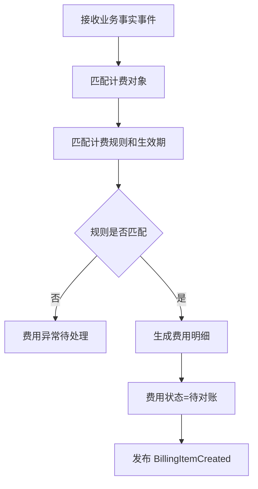
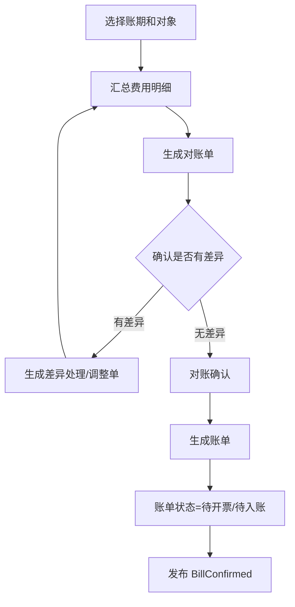
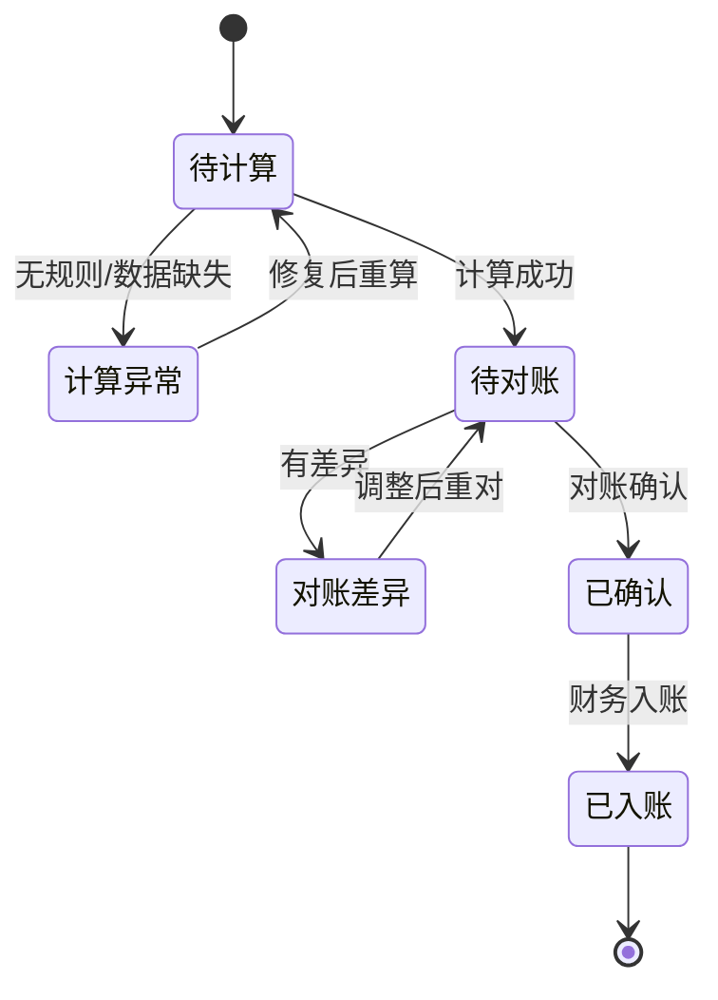
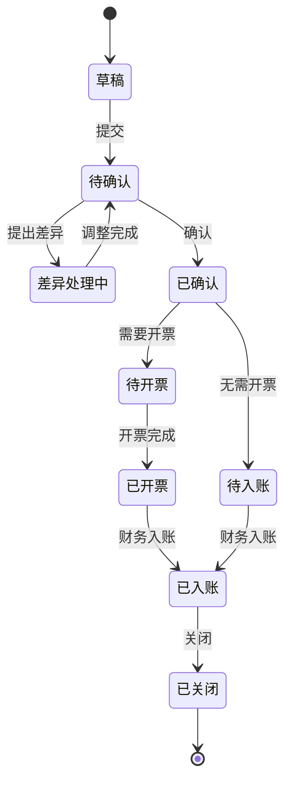

# 35 BMS 系统功能设计

> BMS 负责计费、对账、账单和结算交接。本文聚焦 BMS 自身功能、角色、状态和事件，不替代财务总账。

## 1. 系统定位

| 边界 | 说明 |
| --- | --- |
| 负责 | 仓储费、操作费、物流费、采购/退供对账、销售售后费用、账单生成 |
| 不负责 | 资金支付、总账凭证、仓库作业、库存记账 |
| 核心数据 | 计费对象、计费规则、计费明细、对账单、账单、发票交接状态 |

## 2. 使用角色

| 角色 | 使用功能 | 典型动作 |
| --- | --- | --- |
| 结算运营 | 计费、对账、账单 | 生成账单、处理差异 |
| 财务 | 发票、入账、收付款交接 | 确认账单、回填凭证 |
| 仓储运营 | 作业费用核对 | 核对入库、出库、存储费用 |
| 物流运营 | 运费核对 | 核对承运商账单 |
| 客户/货主 | 账单确认 | 查看账单、提出差异 |
| 管理员 | 计费规则配置 | 维护价格、周期、税率 |

## 3. 功能地图

| 模块 | 功能 | 说明 |
| --- | --- | --- |
| 计费规则 | 仓储、操作、物流、增值服务规则 | 带生效期 |
| 费用采集 | 采集入库、出库、存储、运单、退货事实 | 生成费用明细 |
| 费用计算 | 按规则计算应收/应付费用 | 支持重算 |
| 对账管理 | 客户、供应商、物流商对账 | 差异处理 |
| 账单管理 | 生成、确认、关闭账单 | 财务交接依据 |
| 发票交接 | 发票状态、凭证号 | 与财务对接 |
| 调整单 | 费用调整、减免、补收 | 审批后生效 |
| 报表 | 成本、收入、毛利、差异 | 经营分析 |

## 4. 核心操作流程

### 4.1 费用生成流程

### 4.2 对账账单流程

## 5. 数据状态机

### 5.1 费用明细状态

### 5.2 账单状态

## 6. 生产事件

| 事件 | 触发动作 | 关键载荷 |
| --- | --- | --- |
| `BillingItemCreated` | 费用明细生成 | `billing_item_id`、`biz_type`、`amount` |
| `BillingItemAdjusted` | 费用调整 | `adjustment_id`、`amount_delta`、`reason_code` |
| `ReconciliationCreated` | 生成对账单 | `reconciliation_id`、`counterparty_id`、`period` |
| `ReconciliationConfirmed` | 对账确认 | `reconciliation_id`、`confirmed_amount` |
| `BillCreated` | 生成账单 | `bill_id`、`amount`、`tax_amount` |
| `BillConfirmed` | 账单确认 | `bill_id`、`counterparty_id` |
| `InvoiceRequested` | 请求开票 | `bill_id`、`invoice_type`、`amount` |
| `FinanceHandoverCompleted` | 财务交接完成 | `bill_id`、`voucher_no` |

## 7. 消费事件

| 事件 | 来源 | 消费后数据变化 |
| --- | --- | --- |
| `OwnerEnabled` | 主数据系统 | 更新货主计费对象 |
| `CustomerEnabled` | 主数据系统 | 更新客户结算资料 |
| `CarrierEnabled` | 主数据系统 | 更新物流商和运费规则 |
| `InboundPutawayCompleted` | WMS | 生成入库操作费、可能生成仓储起算 |
| `OutboundShipped` | WMS | 生成出库操作费、耗材费 |
| `ShipmentSigned` | TMS/WMS | 生成物流费明细 |
| `StockDailySnapshotCreated` | 中央库存 | 生成存储费 |
| `SupplierReturnReceived` | 供应商系统/TMS | 生成应付冲减或索赔对账依据 |
| `RefundCompleted` | 财务/支付 | 更新售后费用和退款结果 |

## 8. 事件处理规则

| 规则 | 说明 |
| --- | --- |
| 费用幂等 | 来源业务单据 + 计费项 + 账期防止重复计费 |
| 规则版本 | 费用计算保存计费规则版本和价格快照 |
| 可重算 | 未确认费用可重算，已确认费用通过调整单修正 |
| 财务边界 | BMS 生成结算依据，财务系统完成凭证和资金 |

## DDD 对齐说明

本文属于 **BMS 上下文**。设计时应把页面、字段和流程统一回到该上下文的模型边界，避免跨上下文直接修改数据。

| DDD 项 | 对齐口径 |
| --- | --- |
| 限界上下文 | BMS 上下文 |
| 核心聚合 | FeeDetail、ReconciliationStatement、Bill |
| 数据主权 | 费用、对账和账单事实 |
| 生产事件 | 只发布本上下文已经发生的业务事实 |
| 消费事件 | 消费外部事实时必须记录 event_id、幂等键、处理状态和失败原因 |
| 查询模型 | 列表、看板、导出可使用读模型，不强行加载聚合 |

## 9. 继续上下文

当前结论：BMS 是计费和对账系统，消费业务事实事件并把它们转成费用明细、对账单和账单。

关键假设：BMS 不改变库存和订单执行状态，只回写结算状态和费用结果。
