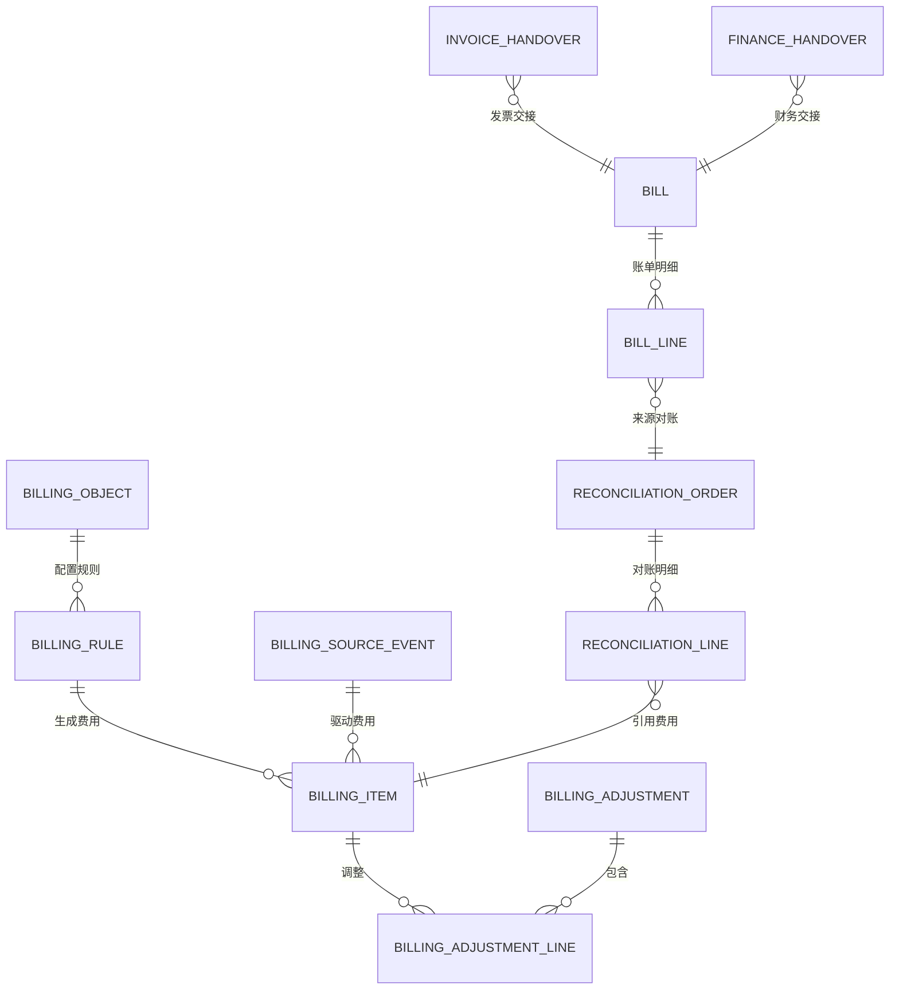
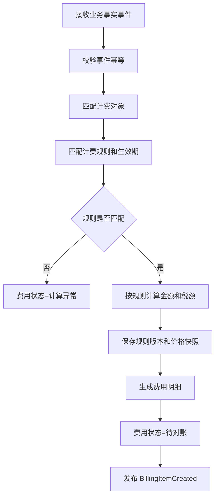
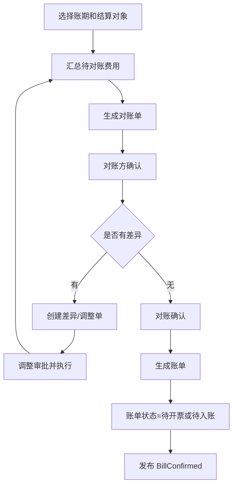
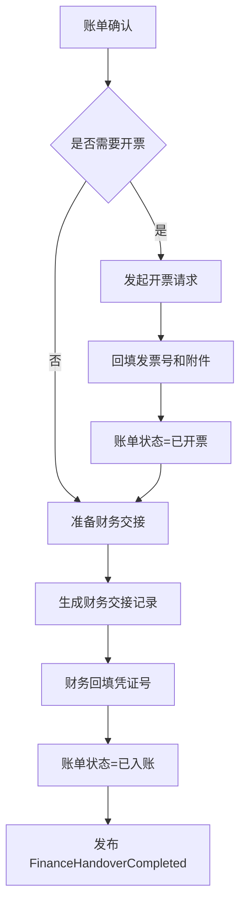
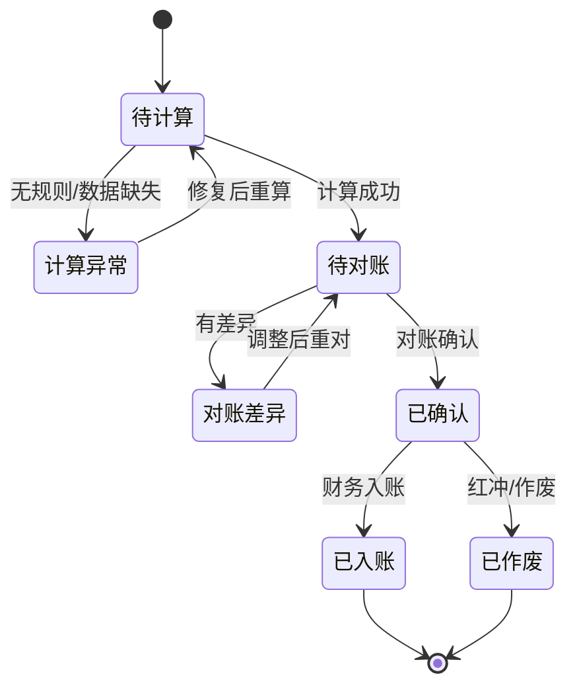
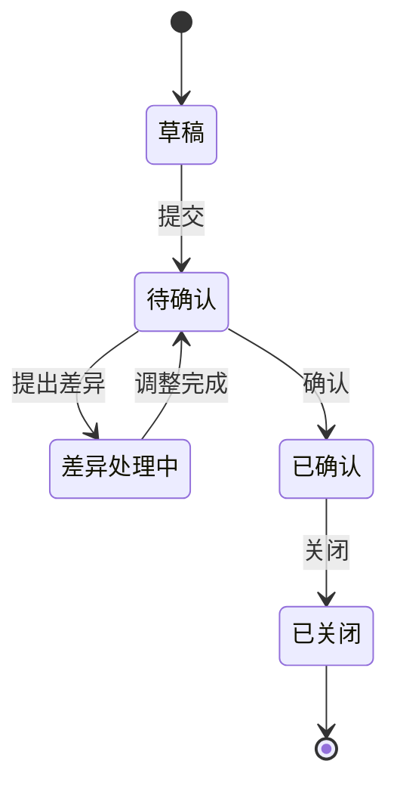
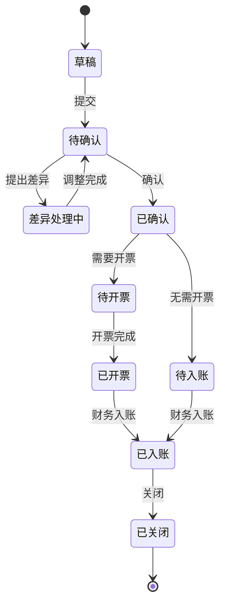

# 45 BMS 系统详细设计

> 本文承接 [BMS 系统功能设计](./35-BMS系统功能设计.md)，按 [权限系统详细设计](../权限系统/38-权限系统详细设计.md) 的模式细化计费对象、计费规则、费用采集、费用明细、调整单、对账单、账单、发票交接、财务交接、权限点、枚举、事件和操作日志。当前版本是系统设计级字段模型，不是最终数据库 DDL。

## 1. 设计目标

BMS 要统一回答五个问题：

| 问题 | 设计对象 |
| --- | --- |
| 向谁收钱或给谁结算 | 计费对象、客户、货主、供应商、物流商 |
| 因为什么业务事实计费 | 入库、出库、存储、运输、退货、增值服务 |
| 按什么规则计费 | 计费规则、价格、税率、生效期、规则版本 |
| 如何确认费用 | 费用明细、对账单、差异、调整单 |
| 如何交给财务 | 账单、发票、财务交接、凭证号 |

核心原则：

| 原则 | 说明 |
| --- | --- |
| BMS 是结算依据系统 | 负责费用、对账、账单，不替代财务总账 |
| 费用来源必须可追溯 | 每条费用明细要能追溯业务事实和计费规则版本 |
| 未确认可重算，已确认走调整 | 避免已对账账单被直接改写 |
| 应收应付都支持 | 面向客户/货主收款，也面向供应商/物流商付款或冲减 |
| 财务边界清晰 | BMS 交接账单、发票和凭证信息，资金支付由财务系统完成 |

## 2. 总体模型

## 3. 功能页面

| 页面 | 主要用途 | 展示字段 | 主要操作 |
| --- | --- | --- | --- |
| BMS 工作台 | 展示计费异常、待对账、待确认、待交财务 | 异常费用、待对账、差异、待开票、待入账 | 查看待办、进入处理 |
| 计费对象页 | 维护客户、货主、供应商、物流商结算对象 | 对象编码、对象类型、结算周期、税率、状态 | 新增、编辑、启停 |
| 计费规则页 | 配置仓储费、操作费、物流费、增值服务费 | 规则编码、费用类型、计价方式、生效期 | 新增、编辑、发布、停用 |
| 费用采集页 | 查看业务事实事件和匹配结果 | 事件 ID、业务类型、来源单、处理状态 | 重算、忽略、重放 |
| 费用明细页 | 查询和重算未确认费用 | 费用单号、对象、费用类型、金额、状态 | 重算、作废、导出 |
| 调整单页 | 费用减免、补收、冲减 | 调整单号、对象、金额、原因、审批状态 | 新增、提交、审批、执行 |
| 对账单页 | 按账期和对象生成对账 | 对账单号、对象、账期、金额、状态 | 生成、提交、确认、差异处理 |
| 账单页 | 从对账结果生成正式账单 | 账单号、对象、金额、税额、状态 | 生成、确认、关闭、交财务 |
| 发票交接页 | 管理开票请求、发票号、附件 | 账单号、发票类型、金额、发票号、状态 | 请求开票、回填、作废 |
| 财务交接页 | 将账单交给财务入账 | 账单号、交接状态、凭证号、入账时间 | 交接、回填凭证、关闭 |
| 结算报表页 | 分析收入、成本、毛利、差异 | 期间、对象、收入、成本、差异 | 查询、导出 |
| 操作日志页 | 查询 BMS 关键写操作 | 操作人、对象、动作、时间、结果 | 查询、导出 |
| 枚举配置页 | 维护 BMS 页面枚举项 | 枚举类型、枚举值、标签、状态 | 新增、编辑、排序、停用 |

## 4. 核心流程

### 4.1 费用生成流程

### 4.2 对账账单流程

### 4.3 财务交接流程

## 5. 字段模型

### 5.1 计费对象 `billing_object`

| 字段 | 类型 | 是否必填 | 枚举/约束 | 说明 |
| --- | --- | --- | --- | --- |
| `billing_object_id` | bigint | 是 | 主键 | 计费对象 ID |
| `object_code` | varchar(64) | 是 | 唯一 | 对象编码 |
| `object_name` | varchar(256) | 是 |  | 对象名称 |
| `object_type` | varchar(32) | 是 | `BILLING_OBJECT_TYPE` | 客户、货主、供应商、物流商 |
| `settlement_direction` | varchar(32) | 是 | `SETTLEMENT_DIRECTION` | 应收、应付 |
| `settlement_cycle` | varchar(32) | 是 | `SETTLEMENT_CYCLE` | 日结、周结、月结、单结 |
| `tax_rate` | decimal(8,4) | 否 | >= 0 | 默认税率 |
| `currency` | varchar(16) | 是 | `CURRENCY` | 币种 |
| `status` | varchar(32) | 是 | `COMMON_STATUS` | 启用、停用 |
| `created_at` | datetime | 是 |  | 创建时间 |

对应页面：`计费对象页`

展示字段：对象编码、对象名称、对象类型、结算方向、结算周期、税率、币种、状态。

### 5.2 计费规则 `billing_rule`

| 字段 | 类型 | 是否必填 | 枚举/约束 | 说明 |
| --- | --- | --- | --- | --- |
| `rule_id` | bigint | 是 | 主键 | 规则 ID |
| `rule_code` | varchar(64) | 是 | 唯一 | 规则编码 |
| `rule_name` | varchar(128) | 是 |  | 规则名称 |
| `billing_object_id` | bigint | 否 | 外键 | 指定对象，为空表示通用 |
| `fee_type` | varchar(32) | 是 | `FEE_TYPE` | 入库费、出库费、仓储费、物流费、耗材费、增值服务 |
| `pricing_method` | varchar(32) | 是 | `PRICING_METHOD` | 按件、按重量、按体积、按天、阶梯、固定价 |
| `price_config` | text | 是 | JSON | 价格配置 |
| `tax_rate` | decimal(8,4) | 否 | >= 0 | 税率 |
| `effective_from` | date | 是 |  | 生效日期 |
| `effective_to` | date | 否 |  | 失效日期 |
| `rule_version` | int | 是 | >= 1 | 规则版本 |
| `status` | varchar(32) | 是 | `RULE_STATUS` | 草稿、已发布、已停用 |

对应页面：`计费规则页`

展示字段：规则编码、规则名称、费用类型、计价方式、版本、生效期、状态。

### 5.3 费用来源事件 `billing_source_event`

| 字段 | 类型 | 是否必填 | 枚举/约束 | 说明 |
| --- | --- | --- | --- | --- |
| `source_event_id` | bigint | 是 | 主键 | 来源事件记录 ID |
| `event_id` | varchar(128) | 是 | 唯一 | 业务事件 ID |
| `event_name` | varchar(128) | 是 |  | 事件名称 |
| `source_system` | varchar(32) | 是 | `SOURCE_SYSTEM` | WMS、OMS、库存、TMS 等 |
| `source_order_no` | varchar(64) | 否 |  | 来源单号 |
| `biz_type` | varchar(32) | 是 | `BILLING_BIZ_TYPE` | 入库、出库、存储、运输、退货、售后 |
| `process_status` | varchar(32) | 是 | `EVENT_PROCESS_STATUS` | 待处理、成功、失败、已忽略 |
| `fail_reason` | varchar(1024) | 否 |  | 失败原因 |
| `received_at` | datetime | 是 |  | 接收时间 |
| `processed_at` | datetime | 否 |  | 处理时间 |

对应页面：`费用采集页`

展示字段：事件 ID、事件名称、来源系统、来源单号、业务类型、处理状态、失败原因。

### 5.4 费用明细 `billing_item`

| 字段 | 类型 | 是否必填 | 枚举/约束 | 说明 |
| --- | --- | --- | --- | --- |
| `billing_item_id` | bigint | 是 | 主键 | 费用明细 ID |
| `billing_item_no` | varchar(64) | 是 | 唯一 | 费用明细号 |
| `billing_object_id` | bigint | 是 | 外键 | 计费对象 |
| `settlement_direction` | varchar(32) | 是 | `SETTLEMENT_DIRECTION` | 应收、应付 |
| `fee_type` | varchar(32) | 是 | `FEE_TYPE` | 费用类型 |
| `source_event_id` | bigint | 是 | 外键 | 来源事件 |
| `source_order_no` | varchar(64) | 否 |  | 来源单号 |
| `rule_id` | bigint | 否 | 外键 | 命中规则 |
| `rule_version` | int | 否 |  | 规则版本 |
| `quantity` | decimal(18,4) | 是 | >= 0 | 计费数量 |
| `unit_price` | decimal(18,6) | 是 | >= 0 | 单价 |
| `amount` | decimal(18,2) | 是 | 可正可负 | 未税金额 |
| `tax_rate` | decimal(8,4) | 否 | >= 0 | 税率 |
| `tax_amount` | decimal(18,2) | 否 |  | 税额 |
| `tax_included_amount` | decimal(18,2) | 是 |  | 含税金额 |
| `billing_period` | varchar(32) | 是 |  | 账期，如 `2026-06` |
| `billing_status` | varchar(32) | 是 | `BILLING_ITEM_STATUS` | 待计算、计算异常、待对账、对账差异、已确认、已入账、已作废 |
| `created_at` | datetime | 是 |  | 创建时间 |

对应页面：`费用明细页`

展示字段：费用明细号、计费对象、方向、费用类型、来源单、数量、金额、税额、账期、状态。

### 5.5 调整单 `billing_adjustment`

| 字段 | 类型 | 是否必填 | 枚举/约束 | 说明 |
| --- | --- | --- | --- | --- |
| `adjustment_id` | bigint | 是 | 主键 | 调整单 ID |
| `adjustment_no` | varchar(64) | 是 | 唯一 | 调整单号 |
| `billing_object_id` | bigint | 是 | 外键 | 计费对象 |
| `adjustment_type` | varchar(32) | 是 | `BILLING_ADJUSTMENT_TYPE` | 减免、补收、冲减、修正 |
| `adjustment_amount` | decimal(18,2) | 是 | 可正可负 | 调整金额 |
| `adjustment_reason` | varchar(512) | 是 |  | 调整原因 |
| `approval_status` | varchar(32) | 是 | `APPROVAL_STATUS` | 草稿、待审批、已批准、已驳回 |
| `adjustment_status` | varchar(32) | 是 | `ADJUSTMENT_STATUS` | 草稿、待审批、已执行、已驳回、已取消 |
| `created_by` | bigint | 是 |  | 创建人 |
| `created_at` | datetime | 是 |  | 创建时间 |
| `executed_at` | datetime | 否 |  | 执行时间 |

对应页面：`调整单页`

展示字段：调整单号、计费对象、调整类型、金额、原因、审批状态、调整状态。

### 5.6 对账单 `reconciliation_order`

| 字段 | 类型 | 是否必填 | 枚举/约束 | 说明 |
| --- | --- | --- | --- | --- |
| `reconciliation_id` | bigint | 是 | 主键 | 对账单 ID |
| `reconciliation_no` | varchar(64) | 是 | 唯一 | 对账单号 |
| `billing_object_id` | bigint | 是 | 外键 | 计费对象 |
| `settlement_direction` | varchar(32) | 是 | `SETTLEMENT_DIRECTION` | 应收、应付 |
| `billing_period` | varchar(32) | 是 | 账期 | 账期 |
| `total_amount` | decimal(18,2) | 是 |  | 未税金额 |
| `tax_amount` | decimal(18,2) | 否 |  | 税额 |
| `tax_included_amount` | decimal(18,2) | 是 |  | 含税金额 |
| `diff_amount` | decimal(18,2) | 是 | 默认 0 | 差异金额 |
| `recon_status` | varchar(32) | 是 | `RECON_STATUS` | 草稿、待确认、差异处理中、已确认、已关闭 |
| `created_at` | datetime | 是 |  | 创建时间 |
| `confirmed_at` | datetime | 否 |  | 确认时间 |

对应页面：`对账单页`

展示字段：对账单号、计费对象、方向、账期、金额、税额、差异金额、状态。

### 5.7 账单 `bill`

| 字段 | 类型 | 是否必填 | 枚举/约束 | 说明 |
| --- | --- | --- | --- | --- |
| `bill_id` | bigint | 是 | 主键 | 账单 ID |
| `bill_no` | varchar(64) | 是 | 唯一 | 账单号 |
| `reconciliation_id` | bigint | 否 | 外键 | 来源对账单 |
| `billing_object_id` | bigint | 是 | 外键 | 计费对象 |
| `settlement_direction` | varchar(32) | 是 | `SETTLEMENT_DIRECTION` | 应收、应付 |
| `billing_period` | varchar(32) | 是 |  | 账期 |
| `total_amount` | decimal(18,2) | 是 |  | 未税金额 |
| `tax_amount` | decimal(18,2) | 否 |  | 税额 |
| `tax_included_amount` | decimal(18,2) | 是 |  | 含税金额 |
| `invoice_required` | boolean | 是 | true/false | 是否需要开票 |
| `bill_status` | varchar(32) | 是 | `BILL_STATUS` | 草稿、待确认、差异处理中、已确认、待开票、已开票、待入账、已入账、已关闭 |
| `created_at` | datetime | 是 |  | 创建时间 |
| `confirmed_at` | datetime | 否 |  | 确认时间 |

对应页面：`账单页`

展示字段：账单号、计费对象、方向、账期、金额、税额、是否开票、状态。

### 5.8 发票交接 `invoice_handover`

| 字段 | 类型 | 是否必填 | 枚举/约束 | 说明 |
| --- | --- | --- | --- | --- |
| `invoice_handover_id` | bigint | 是 | 主键 | 发票交接 ID |
| `bill_id` | bigint | 是 | 外键 | 账单 |
| `invoice_type` | varchar(32) | 是 | `INVOICE_TYPE` | 普票、专票、电子票 |
| `invoice_no` | varchar(128) | 否 |  | 发票号 |
| `invoice_amount` | decimal(18,2) | 是 |  | 开票金额 |
| `invoice_status` | varchar(32) | 是 | `INVOICE_STATUS` | 待申请、已申请、已开票、已作废 |
| `invoice_file_url` | varchar(512) | 否 |  | 发票附件 |
| `requested_at` | datetime | 否 |  | 申请时间 |
| `issued_at` | datetime | 否 |  | 开票时间 |

对应页面：`发票交接页`

展示字段：账单号、发票类型、发票号、金额、状态、申请时间、开票时间。

### 5.9 财务交接 `finance_handover`

| 字段 | 类型 | 是否必填 | 枚举/约束 | 说明 |
| --- | --- | --- | --- | --- |
| `handover_id` | bigint | 是 | 主键 | 交接 ID |
| `bill_id` | bigint | 是 | 外键 | 账单 |
| `handover_no` | varchar(64) | 是 | 唯一 | 交接单号 |
| `handover_status` | varchar(32) | 是 | `FINANCE_HANDOVER_STATUS` | 待交接、已交接、已入账、失败 |
| `voucher_no` | varchar(128) | 否 |  | 财务凭证号 |
| `handover_at` | datetime | 否 |  | 交接时间 |
| `posted_at` | datetime | 否 |  | 入账时间 |
| `fail_reason` | varchar(512) | 否 |  | 失败原因 |

对应页面：`财务交接页`

展示字段：交接单号、账单号、状态、凭证号、交接时间、入账时间、失败原因。

### 5.10 BMS 操作日志 `bms_operation_log`

| 字段 | 类型 | 是否必填 | 枚举/约束 | 说明 |
| --- | --- | --- | --- | --- |
| `log_id` | bigint | 是 | 主键 | 日志 ID |
| `operator_id` | bigint | 是 |  | 操作人 |
| `object_type` | varchar(64) | 是 | `BMS_OBJECT_TYPE` | 计费对象、规则、费用、调整、对账、账单、发票、财务交接 |
| `object_id` | bigint | 是 |  | 对象 ID |
| `action_type` | varchar(64) | 是 | `BMS_ACTION_TYPE` | 创建、计算、重算、确认、调整、开票、交接、关闭 |
| `before_snapshot` | text | 否 | JSON | 变更前摘要 |
| `after_snapshot` | text | 否 | JSON | 变更后摘要 |
| `result` | varchar(32) | 是 | `OPERATION_RESULT` | 成功、失败 |
| `fail_reason` | varchar(512) | 否 |  | 失败原因 |
| `created_at` | datetime | 是 |  | 操作时间 |

对应页面：`操作日志页`

展示字段：操作人、对象类型、对象 ID、动作、结果、失败原因、操作时间。

## 6. 枚举定义

| 枚举类型 | 枚举值 | 说明 |
| --- | --- | --- |
| `BILLING_OBJECT_TYPE` | `CUSTOMER`、`OWNER`、`SUPPLIER`、`CARRIER` | 计费对象类型 |
| `SETTLEMENT_DIRECTION` | `AR`、`AP` | 应收、应付 |
| `SETTLEMENT_CYCLE` | `DAILY`、`WEEKLY`、`MONTHLY`、`PER_ORDER` | 结算周期 |
| `FEE_TYPE` | `INBOUND`、`OUTBOUND`、`STORAGE`、`LOGISTICS`、`MATERIAL`、`VALUE_ADDED`、`RETURN`、`ADJUSTMENT` | 费用类型 |
| `PRICING_METHOD` | `PER_PIECE`、`PER_WEIGHT`、`PER_VOLUME`、`PER_DAY`、`TIERED`、`FIXED` | 计价方式 |
| `RULE_STATUS` | `DRAFT`、`PUBLISHED`、`DISABLED` | 规则状态 |
| `BILLING_BIZ_TYPE` | `INBOUND`、`OUTBOUND`、`STORAGE`、`SHIPMENT`、`RETURN`、`AFTER_SALE` | 计费业务类型 |
| `BILLING_ITEM_STATUS` | `PENDING_CALCULATE`、`CALCULATE_FAILED`、`PENDING_RECON`、`RECON_DIFF`、`CONFIRMED`、`POSTED`、`VOIDED` | 费用明细状态 |
| `BILLING_ADJUSTMENT_TYPE` | `DISCOUNT`、`SUPPLEMENT`、`OFFSET`、`FIX` | 调整类型 |
| `ADJUSTMENT_STATUS` | `DRAFT`、`PENDING_APPROVAL`、`EXECUTED`、`REJECTED`、`CANCELLED` | 调整状态 |
| `RECON_STATUS` | `DRAFT`、`PENDING_CONFIRM`、`DIFF_PROCESSING`、`CONFIRMED`、`CLOSED` | 对账状态 |
| `BILL_STATUS` | `DRAFT`、`PENDING_CONFIRM`、`DIFF_PROCESSING`、`CONFIRMED`、`PENDING_INVOICE`、`INVOICED`、`PENDING_POST`、`POSTED`、`CLOSED` | 账单状态 |
| `INVOICE_TYPE` | `NORMAL`、`SPECIAL_VAT`、`E_INVOICE` | 发票类型 |
| `INVOICE_STATUS` | `PENDING_REQUEST`、`REQUESTED`、`ISSUED`、`VOIDED` | 发票状态 |
| `FINANCE_HANDOVER_STATUS` | `PENDING`、`HANDED_OVER`、`POSTED`、`FAILED` | 财务交接状态 |
| `EVENT_PROCESS_STATUS` | `PENDING`、`SUCCESS`、`FAILED`、`IGNORED` | 事件处理状态 |
| `APPROVAL_STATUS` | `DRAFT`、`PENDING`、`APPROVED`、`REJECTED` | 审批状态 |
| `COMMON_STATUS` | `ENABLED`、`DISABLED` | 通用状态 |

枚举配置建议：费用类型、计价方式、调整类型、结算周期、发票类型可页面配置；费用明细、对账单、账单状态属于状态机枚举，只建议配置中文标签、颜色和排序。

## 7. 权限点设计

| 页面 | 路由建议 | 查询权限 | 操作权限 |
| --- | --- | --- | --- |
| BMS 工作台 | `/bms/workbench` | `bms:workbench:read` |  |
| 计费对象页 | `/bms/billing-objects` | `bms:billing_object:read` | `bms:billing_object:create`、`bms:billing_object:update`、`bms:billing_object:disable` |
| 计费规则页 | `/bms/billing-rules` | `bms:billing_rule:read` | `bms:billing_rule:create`、`bms:billing_rule:update`、`bms:billing_rule:publish`、`bms:billing_rule:disable` |
| 费用采集页 | `/bms/source-events` | `bms:source_event:read` | `bms:source_event:recalculate`、`bms:source_event:replay`、`bms:source_event:ignore` |
| 费用明细页 | `/bms/billing-items` | `bms:billing_item:read` | `bms:billing_item:recalculate`、`bms:billing_item:void`、`bms:billing_item:export` |
| 调整单页 | `/bms/adjustments` | `bms:adjustment:read` | `bms:adjustment:create`、`bms:adjustment:submit`、`bms:adjustment:approve`、`bms:adjustment:execute` |
| 对账单页 | `/bms/reconciliations` | `bms:recon:read` | `bms:recon:generate`、`bms:recon:submit`、`bms:recon:confirm`、`bms:recon:process_diff` |
| 账单页 | `/bms/bills` | `bms:bill:read` | `bms:bill:generate`、`bms:bill:confirm`、`bms:bill:close`、`bms:bill:handover` |
| 发票交接页 | `/bms/invoices` | `bms:invoice:read` | `bms:invoice:request`、`bms:invoice:update`、`bms:invoice:void` |
| 财务交接页 | `/bms/finance-handovers` | `bms:finance_handover:read` | `bms:finance_handover:handover`、`bms:finance_handover:update_voucher`、`bms:finance_handover:close` |
| 结算报表页 | `/bms/reports` | `bms:report:read` | `bms:report:export` |
| 操作日志页 | `/bms/operation-logs` | `bms:operation_log:read` | `bms:operation_log:export` |
| 枚举配置页 | `/bms/enums` | `bms:enum:read` | `bms:enum:create`、`bms:enum:update`、`bms:enum:disable` |

## 8. 生产事件

| 事件 | 触发动作 | 关键载荷 |
| --- | --- | --- |
| `BillingItemCreated` | 费用明细生成 | `billing_item_id`、`fee_type`、`amount`、`billing_period` |
| `BillingItemAdjusted` | 调整执行 | `adjustment_id`、`amount_delta`、`reason_code` |
| `ReconciliationCreated` | 生成对账单 | `reconciliation_id`、`billing_object_id`、`period` |
| `ReconciliationConfirmed` | 对账确认 | `reconciliation_id`、`confirmed_amount` |
| `BillCreated` | 生成账单 | `bill_id`、`billing_object_id`、`amount` |
| `BillConfirmed` | 账单确认 | `bill_id`、`billing_object_id` |
| `InvoiceRequested` | 请求开票 | `bill_id`、`invoice_type`、`amount` |
| `FinanceHandoverCompleted` | 财务交接完成 | `bill_id`、`voucher_no` |

## 9. 消费事件

| 事件 | 来源 | 消费后数据变化 |
| --- | --- | --- |
| `OwnerEnabled` | 主数据系统 | 创建或更新货主计费对象 |
| `CustomerEnabled` | 主数据系统 | 创建或更新客户结算资料 |
| `SupplierEnabled` | 主数据系统 | 创建或更新供应商应付结算对象 |
| `CarrierEnabled` | 主数据系统 | 创建或更新物流商结算对象和运费规则 |
| `InboundPutawayCompleted` | WMS | 生成入库操作费，可能触发仓储起算 |
| `OutboundShipped` | WMS | 生成出库操作费、耗材费 |
| `StockDailySnapshotCreated` | 中央库存 | 生成仓储费 |
| `ShipmentSigned` | TMS/WMS | 生成物流费明细 |
| `SupplierReturnConfirmed` | 供应商系统 | 更新退供对账依据 |
| `RefundCompleted` | 财务/支付 | 更新售后退款结果和费用状态 |

## 10. 状态机

### 10.1 费用明细状态

### 10.2 对账单状态

### 10.3 账单状态

## 11. 操作日志策略

必须记录日志的动作：

| 动作 | 日志内容 |
| --- | --- |
| 计费对象新增/停用 | 对象、结算方向、周期、税率、状态 |
| 计费规则发布/停用 | 规则版本、费用类型、计价方式、生效期 |
| 费用计算/重算/作废 | 来源事件、规则版本、金额、失败原因 |
| 调整单提交/审批/执行 | 调整金额、原因、审批结果、执行人 |
| 对账生成/确认/差异处理 | 账期、对象、差异金额、处理结果 |
| 账单生成/确认/关闭 | 账单金额、税额、状态变化 |
| 发票申请/回填/作废 | 发票号、金额、附件、状态变化 |
| 财务交接/凭证回填 | 交接单、凭证号、入账时间、失败原因 |

日志保留建议：计费、对账、账单、发票、财务交接日志至少保留 5 年或按财务合规要求延长。

## DDD 对齐说明

本文属于 **BMS 上下文**。设计时应把页面、字段和流程统一回到该上下文的模型边界，避免跨上下文直接修改数据。

| DDD 项 | 对齐口径 |
| --- | --- |
| 限界上下文 | BMS 上下文 |
| 核心聚合 | FeeDetail、ReconciliationStatement、Bill |
| 数据主权 | 费用、对账和账单事实 |
| 生产事件 | 只发布本上下文已经发生的业务事实 |
| 消费事件 | 消费外部事实时必须记录 event_id、幂等键、处理状态和失败原因 |
| 查询模型 | 列表、看板、导出可使用读模型，不强行加载聚合 |

## 12. 继续上下文

当前结论：BMS 详细设计围绕“业务事实 -> 计费规则 -> 费用明细 -> 对账 -> 账单 -> 发票/财务交接”展开，是结算依据系统，不替代财务总账。

关键假设：BMS 不改变订单、库存和仓内作业状态；未确认费用可重算，已确认费用通过调整单修正；财务系统负责凭证和资金。

下一步建议：进入数据库设计时，优先落 `billing_object`、`billing_rule`、`billing_item`、`reconciliation_order`、`bill` 五类核心表。
