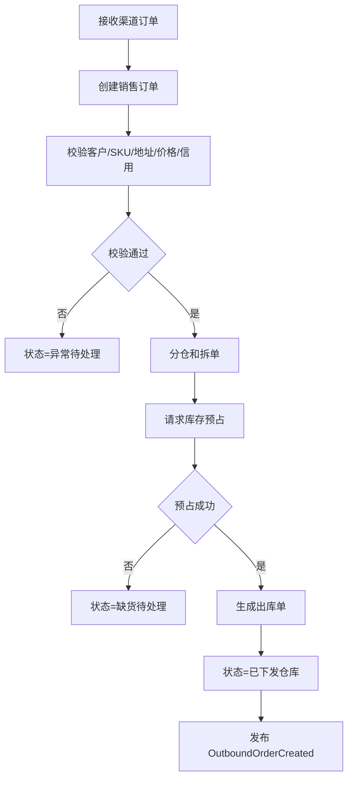
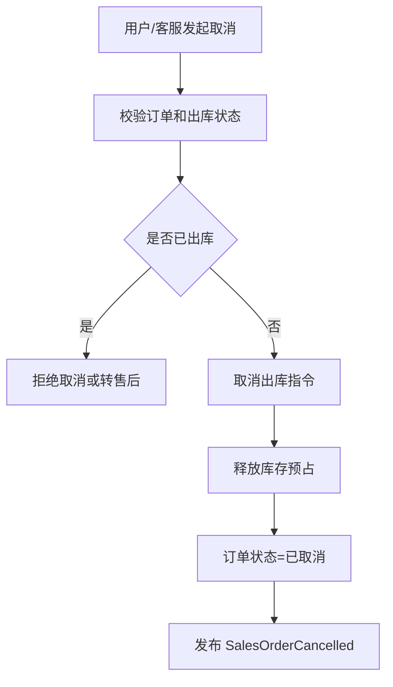
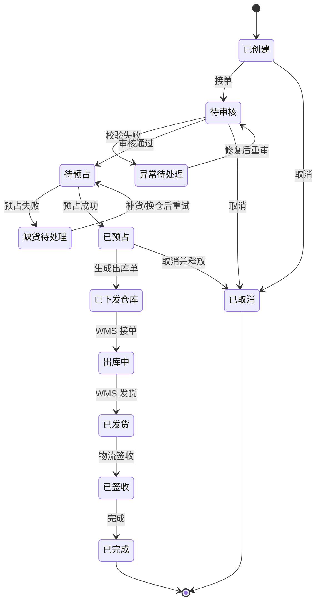
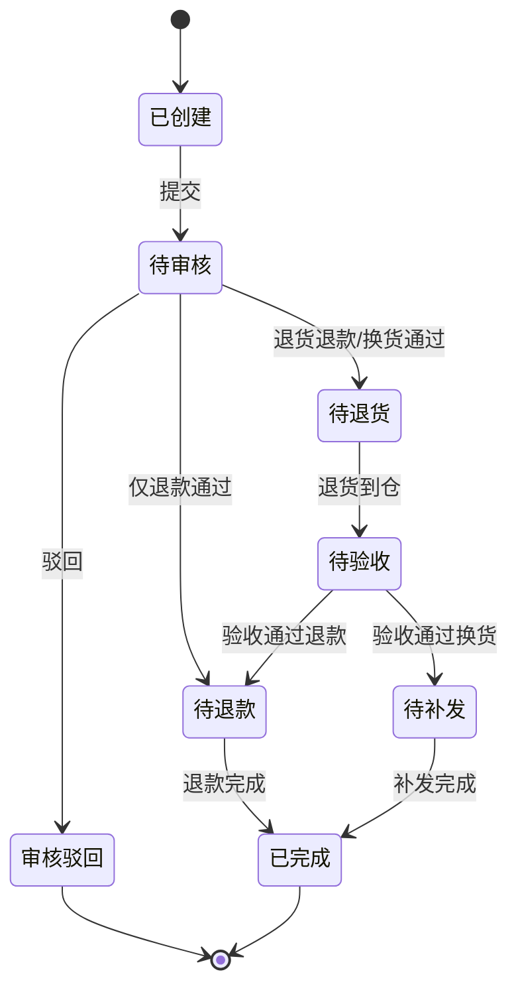

# 32 OMS 系统功能设计

> OMS 负责订单履约编排：接单、校验、拆合单、分仓、库存预占、出库指令、取消、售后。本文聚焦 OMS 自身功能、角色、状态和事件。

## 1. 系统定位

| 边界 | 说明 |
| --- | --- |
| 负责 | 销售订单接入、订单校验、分仓、履约承诺、出库单生成、取消、售后申请 |
| 不负责 | 仓库拣货、库存台账、物流实际承运、财务入账 |
| 核心数据 | 销售订单、订单行、履约单、出库指令、售后单、渠道订单映射 |

## 2. 使用角色

| 角色 | 使用功能 | 典型动作 |
| --- | --- | --- |
| 客服 | 订单查询、取消、售后 | 修改地址、创建售后、处理异常 |
| 订单运营 | 审单、拆单、分仓、重推 | 处理缺货、拦截、异常订单 |
| 渠道运营 | 渠道订单接入 | 查看平台订单同步状态 |
| 仓配运营 | 履约监控 | 跟踪出库、物流、签收 |
| 财务/风控 | 订单风控查看 | 查看金额、信用、异常 |
| 管理员 | 规则配置 | 分仓规则、审单规则、取消规则 |

## 3. 功能地图

| 模块 | 功能 | 说明 |
| --- | --- | --- |
| 订单接入 | API、平台、手工、批量导入 | 生成内部销售订单 |
| 订单校验 | 商品、客户、地址、价格、风控、信用 | 决定是否可履约 |
| 分仓履约 | 分仓、拆单、合单、承诺时效 | 生成履约计划 |
| 库存预占 | 发起预占、释放、重占 | 消费库存结果 |
| 出库管理 | 生成出库单、取消出库、跟踪出库 | 对接 WMS |
| 售后管理 | 仅退款、退货退款、换货补发 | 逆向流程入口 |
| 异常处理 | 缺货、地址不可达、风控拦截 | 人工处理 |
| 规则配置 | 审单、分仓、承运商、售后规则 | 支撑自动化 |

## 4. 核心操作流程

### 4.1 销售订单履约流程

### 4.2 订单取消流程

## 5. 数据状态机

### 5.1 销售订单状态

### 5.2 售后单简化状态

## 6. 生产事件

| 事件 | 触发动作 | 关键载荷 |
| --- | --- | --- |
| `SalesOrderCreated` | 接收订单 | `sales_order_id`、`channel_id`、`customer_id`、`lines` |
| `SalesOrderApproved` | 审单通过 | `sales_order_id`、`approved_at` |
| `StockReservationRequested` | 请求库存预占 | `sales_order_id`、`sku_id`、`warehouse_id`、`qty` |
| `OutboundOrderCreated` | 生成出库单 | `outbound_order_id`、`sales_order_id`、`warehouse_id`、`lines` |
| `SalesOrderCancelled` | 订单取消 | `sales_order_id`、`cancel_reason` |
| `AfterSaleCreated` | 创建售后 | `after_sale_id`、`sales_order_id`、`type` |
| `ReshipmentRequested` | 换货/补发 | `after_sale_id`、`sku_id`、`qty` |

## 7. 消费事件

| 事件 | 来源 | 消费后数据变化 |
| --- | --- | --- |
| `SkuEnabled` | 主数据系统 | 更新可销售 SKU 缓存 |
| `CustomerEnabled` | 主数据系统 | 更新客户和地址缓存 |
| `WarehouseEnabled` | 主数据系统 | 更新可发货仓和退货仓 |
| `CarrierEnabled` | 主数据系统 | 更新可选物流产品 |
| `StockReserved` | 中央库存 | 订单状态=已预占，记录预占号 |
| `StockReserveFailed` | 中央库存 | 订单状态=缺货待处理，记录失败原因 |
| `StockReleased` | 中央库存 | 取消订单释放完成 |
| `OutboundAccepted` | WMS | 出库状态=出库中 |
| `OutboundShipped` | WMS | 订单状态=已发货，记录发货数量 |
| `ShipmentSigned` | TMS/WMS | 订单状态=已签收 |
| `ReturnReceiptCompleted` | WMS | 售后单更新验收结果 |
| `RefundCompleted` | BMS/财务 | 售后退款状态=完成 |

## 8. 事件处理规则

| 规则 | 说明 |
| --- | --- |
| 订单幂等 | 渠道订单使用 `channel_id + external_order_no` 防重 |
| 出库单不可重复生成 | 同一履约单只能有一个有效出库指令 |
| 已发货不可直接取消 | 已发货订单取消转售后流程 |
| 状态汇总 | 单头状态由订单行、履约单和出库状态汇总 |

## DDD 对齐说明

本文属于 **OMS 上下文**。设计时应把页面、字段和流程统一回到该上下文的模型边界，避免跨上下文直接修改数据。

| DDD 项 | 对齐口径 |
| --- | --- |
| 限界上下文 | OMS 上下文 |
| 核心聚合 | SalesOrder、FulfillmentOrder、AfterSaleOrder |
| 数据主权 | 销售订单、履约编排、售后入口 |
| 生产事件 | 只发布本上下文已经发生的业务事实 |
| 消费事件 | 消费外部事实时必须记录 event_id、幂等键、处理状态和失败原因 |
| 查询模型 | 列表、看板、导出可使用读模型，不强行加载聚合 |

## 9. 继续上下文

当前结论：OMS 是订单履约编排系统，动作本质是改变订单/履约状态，并向库存和仓储发出请求。

关键假设：OMS 不直接改库存余额，库存变化由中央库存事件回写。
